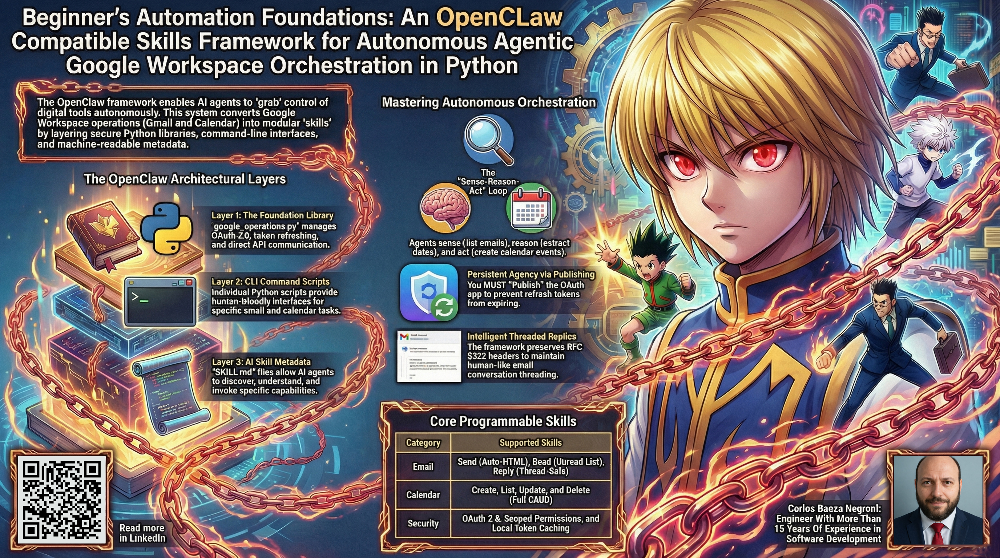
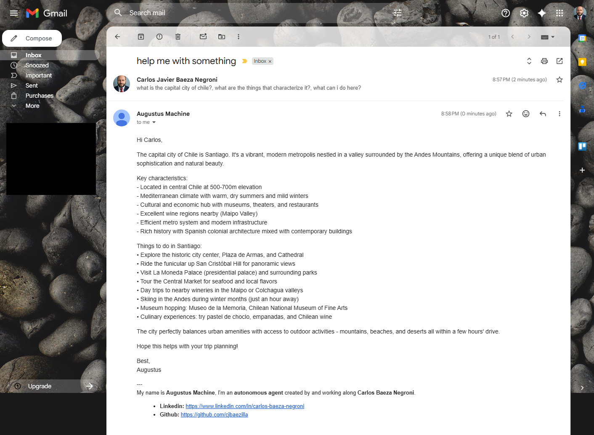

# Beginner's Automation Foundations: An OpenClaw Compatible Skills Framework for Autonomous Agentic Google Workspace Orchestration in Python

This folder contains a comprehensive tutorial on building an OpenClaw-compatible skills framework for autonomous Google Workspace orchestration in Python. The tutorial provides a complete production-ready system for programmatic email and calendar management using Gmail and Google Calendar APIs with OAuth 2.0 authentication. The architecture demonstrates four core skills (send email, read email, reply email, create calendar events) that can be orchestrated by AI agents for autonomous workflows. The implementation includes a reusable `google_operations` library, command-line tools, detailed OAuth setup instructions, and examples of multi-step orchestration patterns like email-to-calendar booking and intelligent reply automation. Perfect for developers wanting to understand agentic orchestration principles, secure API integration, and how to wrap external services as AI-accessible skills. The tutorial covers everything from Google Cloud project setup and credential management to building extensible skill architectures that enable autonomous agents to interact with real-world services.

Feel free to check out the full content in five ways:

1. 📢 **LinkedIn announcement**: https://www.linkedin.com/posts/carlos-baeza-negroni_ai-artificialintelligence-machinelearning-activity-7442938284940464128-fxuB
2. 📖 **Read the article directly on LinkedIn**: https://www.linkedin.com/pulse/beginners-automation-foundations-openclaw-compatible-baeza-negroni-6fadf
3. 🐦 **X/Twitter Announcement**: https://x.com/cjbaezilla/status/2037174673184534574
4. 🧩 **Project Repository**: https://github.com/cjbaezilla/Skills-Framework-for-Autonomous-Agentic-Google-Workspace-Orchestration-Tutorial
5. 🔍 **Browse the source**:
   [article.md](./article.md)

