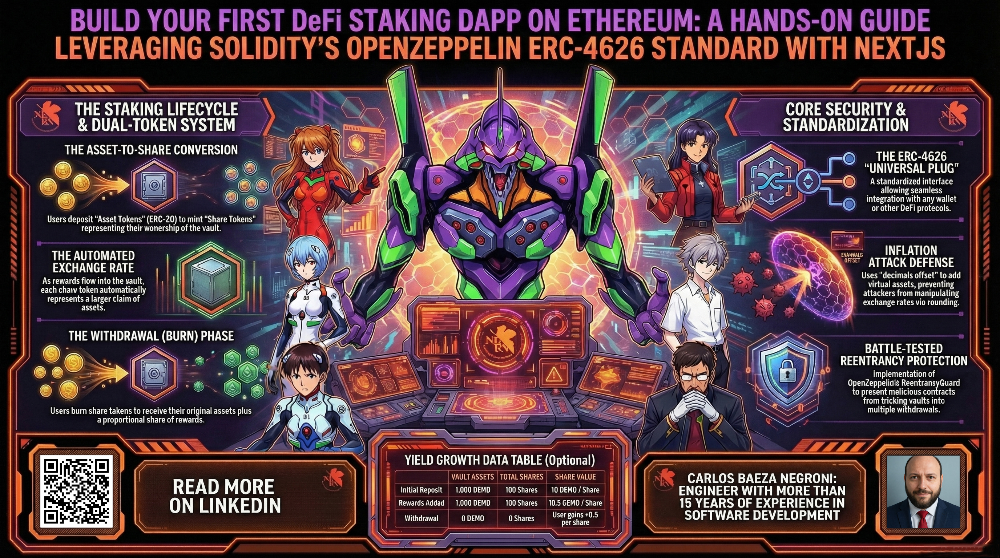
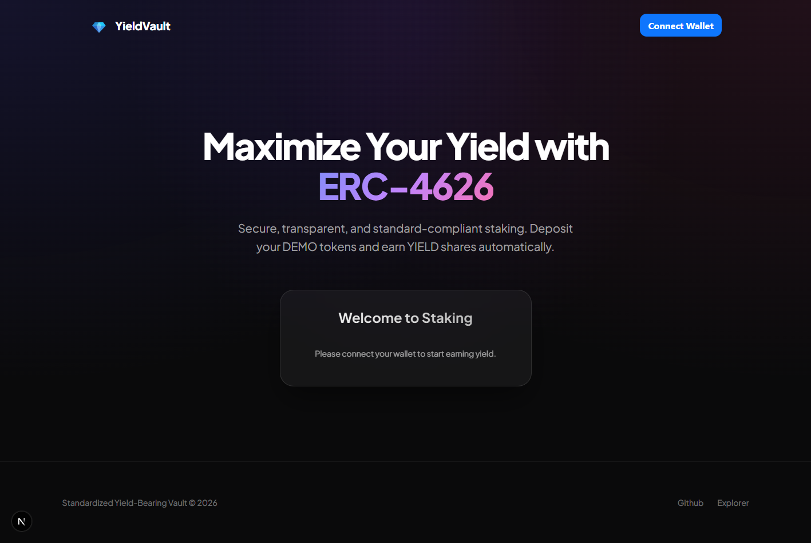

# Build Your First DeFi Staking Dapp on Ethereum: A Hands-On Guide Leveraging Solidity's OpenZeppelin ERC-4626 Standard with Nextjs

This folder contains a hands-on guide to building a DeFi staking application on Ethereum using the ERC-4626 standard. You'll learn how to create a production-ready staking vault with OpenZeppelin's audited contracts, implement secure token economics with inflation attack protections, and build a Next.js frontend to interact with your smart contract. The guide covers the two-token architecture (assets and shares), exchange rate mechanics, complete function reference, and deployment to testnet—all with working code examples.

Feel free to check out the full content in five ways:

1. 📢 **LinkedIn announcement**: https://www.linkedin.com/posts/carlos-baeza-negroni_staking-erc4626-erc20-activity-7438194156272959488-LK9B
2. 📖 **Read the article directly on LinkedIn**: https://www.linkedin.com/pulse/build-your-first-defi-staking-dapp-ethereum-hands-on-baeza-negroni-46wyf
3. 🐦 **X/Twitter Announcement**: https://x.com/cjbaezilla/status/2032432576363712548
4. 🧩 **Project Repository**: https://github.com/cjbaezilla/Build-Your-First-Solidity-ERC20-Staking-Contract-Tutorial
5. 🔍 **Browse the source**:
   [article.md](./article.md)