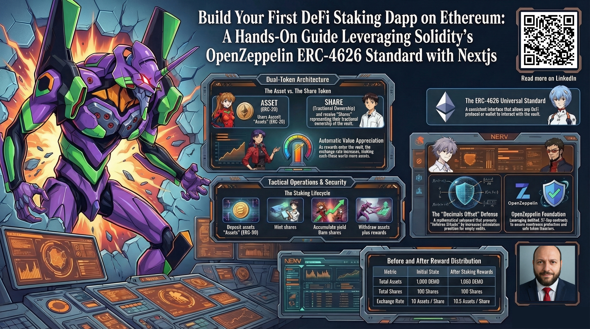
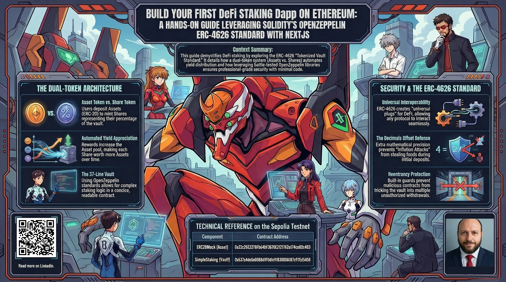
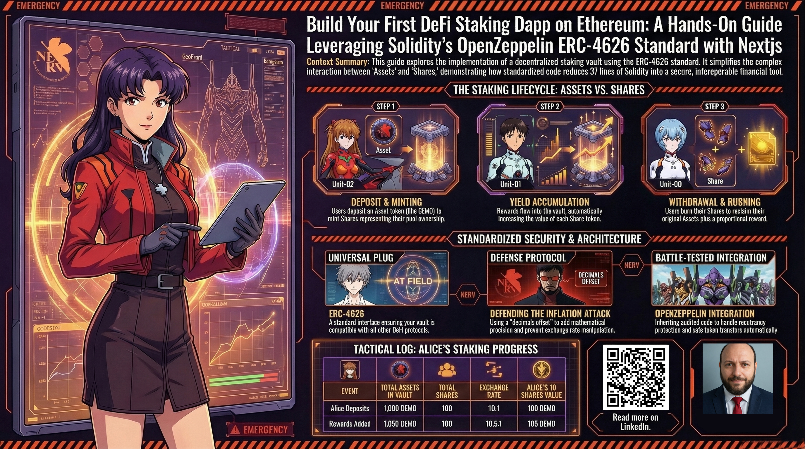

# Build Your First DeFi Staking Dapp on Ethereum: A Hands-On Guide Leveraging Solidity's OpenZeppelin ERC-4626 Standard with Nextjs


## Introduction

I want to tell you about something I built that brings the world of decentralized finance within reach of anyone with a computer and curiosity. This is a complete working application that lets people stake cryptocurrency tokens and earn rewards, and I deployed it on Ethereum's Sepolia testnet so you can try it right now without risking real money. When I started learning about blockchain technology, I found that most explanations either assumed you were already an expert or glossed over how things actually work. I wanted to create something that demonstrates the real mechanics of staking in a way that anyone can understand and even use themselves.

My project combines two essential parts: a smart contract written in Solidity that handles all the financial logic, and a modern web interface built with Next.js that lets you interact with it through your browser. The smart contract is the brain, it lives on the blockchain and enforces the rules automatically. The web application is the friendly face, it connects to your cryptocurrency wallet and lets you stake tokens with just a few clicks. Together they form a complete decentralized application that shows how blockchain technology can create accessible financial tools.

The heart of this project is the ERC-4626 standard, which is a set of rules that makes staking vaults compatible and secure. Think of it like the USB standard for computer peripherals, once everyone agrees on the same standard, different devices work together seamlessly. Before ERC-4626, every staking protocol did things differently, which made it hard for wallets and applications to support them all. This standard changed that, and I chose to build with it because it represents the maturity of the Ethereum ecosystem. My contract is only thirty-seven lines of code because I stand on the shoulders of OpenZeppelin, a team that has spent years building and auditing secure smart contract components.

What excites me most about this project is that it demonstrates how elegantly simple these systems can be. The core concept revolves around two tokens working together. You deposit an underlying token, in my example I call it DEMO, and in return you receive share tokens that represent your ownership stake in the vault. These share tokens automatically increase in value as fees and rewards flow into the vault. There is no central company managing your money, no board of directors making decisions, and no possibility of someone running off with your funds. The code enforces all the rules, and the blockchain ensures transparency. I can show you exactly how every piece works because everything is open source.

I remember the moment I first understood how the exchange rate mechanism works. I had been reading about staking for weeks, but the mathematical elegance only clicked when I traced through the numbers myself. When you deposit tokens, you receive shares based on the current rate. If the vault holds one thousand tokens and there are one hundred shares, each share represents ten tokens. When someone adds more tokens to the vault, whether from staking rewards or from another user depositing, the total increases but your share count stays the same. Suddenly your ten shares represent more than ten tokens. The system automatically adjusts without anyone having to manually distribute rewards. This passive growth is what makes staking appealing, and the mathematics guarantees fairness.

What I built is not just a theoretical exercise. The smart contract is deployed on the Sepolia testnet, which is a testing version of Ethereum where you can get fake tokens for free. The web application connects to this contract and provides an experience similar to what you would find in a production DeFi protocol. I've designed the interface to be as straightforward as possible: you connect your wallet, you see your balances, you enter an amount, and you click a button. Behind that simplicity lives a sophisticated system of cryptographic signatures, gas calculations, and blockchain state changes, but the user doesn't need to understand any of that. This separation between powerful technology and accessible user experience is what motivates me to build these tools.

In the following sections, I will walk you through the smart contract code line by line, explaining not just what each piece does but why it matters. I will show you how the frontend talks to the blockchain and how we handle the complexities of Ethereum transactions. I will discuss security considerations because financial applications demand rigor. Most importantly, I will explain the concepts in plain language without assuming you have a background in programming. My goal is to leave you with both a practical understanding of how this staking system works and the confidence to explore further on your own. The tools are all available, the code is open, and the knowledge is free to access. If I can contribute to making this technology more understandable, then I have accomplished what I set out to do.

- **The complete source code for this project is available at** https://github.com/cjbaezilla/Build-Your-First-Solidity-ERC20-Staking-Contract-Tutorial.


## What Are Staking Contracts and Why Do We Need Them?

When I first encountered staking contracts, I realized they represent something profound in the evolution of finance: the ability to create automated, trustless systems that serve anyone with an internet connection. A staking contract is not merely a digital safe where you lock away your cryptocurrency tokens. It is an active participant in a blockchain network, a sophisticated piece of code that holds your assets, participates in securing the network, and distributes rewards according to transparent, unchangeable rules. What fascinates me is how this small piece of software embodies principles that traditional finance has struggled with for centuries: fairness, transparency, and accessibility for all.

I think about my own experiences with traditional banking. To earn interest on my savings, I needed to trust a bank with my money. I had to provide identification, maintain minimum balances, accept that the bank could lend my money to others while paying me a fraction of the profits, and hope that the bank wouldn't fail and take my savings with it. The entire system relies on intermediaries whose interests do not always align with mine. Staking contracts remove those intermediaries entirely. When you stake your tokens through a smart contract, you interact directly with code that lives on the blockchain. That code cannot be altered after deployment, cannot be bribed or coerced, and executes exactly as written regardless of who you are or where you live. There is no board of directors making discretionary decisions, no government that can freeze your assets without due process, and no company that can go bankrupt and disappear with your money. The contract enforces all terms automatically, and the blockchain ensures that every transaction is publicly verifiable.

The need for these contracts emerges from the very architecture of proof-of-stake blockchains. Ethereum, the network I deployed my contract to, secures its transactions through a process called validation. Instead of miners solving complex puzzles like in older blockchain systems, Ethereum uses validators who lock up their own ETH as collateral. These validators are responsible for checking transactions and creating new blocks. In return, they receive rewards in the form of newly minted ETH and transaction fees. The key insight is that this validation work requires someone to have skin in the game. Validators risk losing their staked ETH if they behave dishonestly or negligently. This economic incentive aligns their behavior with the network's health.

But not everyone has thousands of dollars worth of ETH to run a validator node. The hardware requirements, technical knowledge, and capital needed to operate a validator independently are substantial. This is where staking contracts as a concept become essential. They allow people who hold smaller amounts of cryptocurrency to pool their tokens together and participate in validation as a group. A staking contract acts as the pool manager: it collects tokens from many users, combines them into a large enough stake to run a validator (or contribute to one), and distributes the rewards back to each participant according to their share of the pool. This democratizes access to staking rewards. You don't need to be wealthy or technically sophisticated. If you have a few dollars worth of tokens and a crypto wallet, you can earn the same proportional returns as someone running a massive validator operation.

My particular implementation focuses on the staking mechanism itself rather than running validators, but the principle remains the same. Users deposit their tokens into my contract, and those tokens generate rewards that automatically increase everyone's holdings. There is no manual accounting, no monthly payout, and no human intervention required. The mathematics of the system ensures that rewards flow to token holders continuously and fairly.

What excites me most about this technology is its potential to reshape economic participation globally. In many parts of the world, people lack access to basic financial services. They cannot open bank accounts, invest in stocks, or earn interest on their savings due to documentation requirements, minimum balance restrictions, or geographic limitations. Staking contracts change that equation. If you have an internet connection and a cryptocurrency wallet, you can interact with these contracts. There are no credit checks, no citizenship requirements, and no gatekeepers. The code treats everyone equally. You receive the same rewards per token as anyone else. The system does not know or care about your race, gender, location, or income level. That universality is revolutionary.

The technical beauty lies in how these contracts achieve such fairness through simple mechanisms. At the heart of my staking contract is what I call a two-token dance. You deposit what I think of as the working token, the actual ERC-20 token that generates rewards, and in return you receive what I call a share token, which represents your claim on the entire pool. This separation is not just a programming convenience; it's a fundamental design choice that enables automatic reward distribution. When new tokens enter the vault from any source, whether from staking rewards generated by the blockchain, from fees collected by the protocol, or even from someone donating tokens as a gift, the ratio between working tokens and share tokens shifts. Each share now represents a slightly larger claim on the total assets. And because you hold those shares in your wallet, your wealth increases without you having to do anything. You don't need to claim rewards, fill out forms, or wait for a payout cycle. The moment the vault receives more tokens, your shares become more valuable. This is passive income in its purest form.

I find this design elegant because it scales perfectly. Whether ten people or ten thousand people stake their tokens, each person's share of the pool remains proportional to their contribution. The mathematics works the same way regardless of the vault size. And importantly, because the share token itself is a standard ERC-20 token, you can transfer it, trade it, or use it in other decentralized finance applications. Your stake becomes a liquid asset that you can sell or borrow against without having to withdraw your underlying tokens. This creates a whole ecosystem of possibilities that simply doesn't exist in traditional staking arrangements.

But why do we need staking contracts specifically built to standards like ERC-4626? Before this standard emerged, every staking protocol had its own custom implementation. Wallet developers had to write separate code to support each vault. Auditors had to review completely different architectures for every project. Users had to learn new interfaces for each platform. This fragmentation held back adoption because the ecosystem remained siloed. Imagine if every bank used a completely different format for checks, requiring you to learn a new system every time you opened an account. That was the state of staking before ERC-4626.

The standard changed everything by establishing a common language. Now every contract that follows ERC-4626 speaks the same commands. A wallet knows how to query your balance, how to estimate your share value, and how to process deposits and withdrawals without needing custom integration for each vault. This universality accelerates innovation because developers can build tools that work across the entire ecosystem. My contract benefits from this immediately: any ERC-4626 compatible wallet or analytics platform can interact with it without me writing additional code. And future improvements to the standard can propagate to my contract through the OpenZeppelin library I use.

Security considerations are also part of why we need properly designed staking contracts. When you entrust your assets to a pool, you need assurance that the mathematics cannot be manipulated. One particularly clever attack that concerned me during development is the inflation attack. In a poorly designed vault that starts empty, an attacker could deposit a tiny amount to establish an initial exchange rate, then donate a large amount of tokens to the vault. This would artificially inflate the value of the attacker's shares, causing subsequent depositors to receive disproportionately fewer shares. The attacker could then withdraw their shares and siphon off a significant portion of the vault. I implemented a defense called a decimals offset that adds precision to the calculations, effectively creating virtual shares and assets that make such manipulation economically irrational. An attacker would need to invest thousands of times more than they could possibly steal, which defeats the incentive entirely. This type of sophisticated protection is why I rely on OpenZeppelin's battle-tested implementation rather than writing my own vulnerable math.

Looking at what I have built, I see not just a technical artifact but an embodiment of values. I believe financial systems should be open, fair, and automated. I believe that code can replace many of the costly intermediaries that currently extract value from ordinary people. And I believe that education about these systems is essential for their adoption. That's why my contract is only thirty-seven lines of code, yet it achieves what traditional finance would need pages of legal documents and expensive intermediaries to accomplish. I do not need a team of lawyers, accountants, or compliance officers. The blockchain and the standard provide the foundation, and I provide the minimal customization needed to make this particular vault functional and secure.

The reality is that we need staking contracts because they represent a new paradigm for coordinating economic activity at scale without centralized control. They enable global participation, ensure mathematical fairness, reduce costs, and remove single points of failure. When I think about the implications for people who have been excluded from traditional finance, or who have suffered from bank failures, currency devaluations, or opaque financial systems, I see staking contracts as more than just a way to earn yield. They offer a path toward financial sovereignty. Of course, this technology is not without its risks, smart contracts can have bugs, blockchain networks can upgrade in ways that affect economics, and users must take responsibility for securing their own private keys. But when designed carefully and used wisely, these contracts provide functionality that was impossible just a few years ago. My project demonstrates that we can build systems that are both powerful and accessible, sophisticated yet simple to use, and lucrative while remaining fair to all participants.



## The Magic of Two Tokens: Understanding the System

When I think about what makes this staking system so elegant, I keep coming back to the simple yet profound idea of using two different tokens working together in harmony. This is not just a technical detail I added because the standard required it, it is the very heart of how the system creates automatic growth for everyone who participates. Let me walk you through how this works in plain language, using the example of my deployed contracts where you can stake DEMO tokens and receive YIELD shares in return.

I want you to imagine for a moment that you are putting money into a savings account. In a traditional bank, when you deposit dollars, your account balance simply goes up by that amount. The bank then uses your money for various investments and lending activities, and at the end of the month they manually calculate your interest and add it to your account. There is a whole department of people doing calculations, tracking rates, and processing payments. With my staking contract, the same basic principle applies but the magic happens automatically through mathematics instead of human intervention.

Here is how the two-token system accomplishes this. When you decide to stake your DEMO tokens, you are not simply depositing them into a vault where they sit idle. Instead, you exchange your DEMO tokens for something I call share tokens, which in my contract are called YIELD. Think of these YIELD tokens as representing your ownership stake in the entire staking pool. If the vault currently holds one thousand DEMO tokens and there are one hundred YIELD shares in circulation, each YIELD share represents a claim on ten DEMO tokens. This ratio between total DEMO in the vault and total YIELD shares outstanding is what I call the exchange rate, and it is the engine that drives the automatic growth.

Now here is where it gets interesting. The exchange rate is not fixed, it changes whenever new DEMO tokens enter the vault from any source. Those new tokens could come from other users depositing their own DEMO, or they could come from staking rewards generated by the blockchain network itself, or even from someone donating tokens as a gift. The moment those additional DEMO tokens arrive in the vault, the exchange rate shifts. If one hundred new DEMO tokens arrive, the vault now holds eleven hundred DEMO but still only one hundred YIELD shares outstanding. Now each YIELD share represents eleven DEMO instead of ten. Your share count has not changed, but each of your shares is now worth more. The value of what you own has increased without you having to do anything, without anyone manually distributing rewards, and without waiting for a monthly payout cycle.

This mechanism is powerful because it eliminates the need for a separate rewards distribution system. In older staking designs, you might have to claim your rewards manually, or the contract might need to track how many rewards each person earned over time, which adds complexity and gas costs. With this two-token approach, the mathematics simply works itself out. Everyone who holds YIELD shares when new DEMO enters the vault automatically benefits in exact proportion to their ownership. The person who deposited one hundred DEMO and received ten YIELD shares experiences the same percentage increase as the person who deposited one thousand DEMO and received one hundred YIELD shares. The system is inherently fair and requires no centralized calculation.

I also want to explain why we cannot just use a single token for this. Why not simply keep track of how much DEMO each person deposited and then add rewards directly to their balances? There are several reasons. First, that approach would require the contract to maintain an individual balance record for every user and then update each one whenever rewards arrive. With thousands of users, that would be computationally expensive and potentially run into gas limits on the blockchain. Second, if rewards come from multiple sources at different times, you would need a complex accounting system to track when each reward was added and who was entitled to what portion. Third, and perhaps most importantly, using a separate share token creates a liquid asset that can be transferred, traded, or used in other DeFi applications independently of the underlying DEMO. You could sell your YIELD tokens to someone else without actually withdrawing any DEMO from the vault, which opens up possibilities for leverage, collateral, and secondary markets.

The share token is itself a fully functional ERC-20 token, which means it follows the same standard as DEMO and can be stored in wallets, sent to others, or integrated into other smart contracts. This creates an entire ecosystem around your staked position. You could use your YIELD tokens as collateral to borrow other assets, or you could trade them on a decentralized exchange if someone wants to buy your staked position without waiting for the underlying DEMO to unlock. This liquidity would simply not exist if your stake was just an internal accounting entry in the vault.

Another beautiful aspect of this design is what happens when new users join the pool. When someone new arrives and deposits their DEMO tokens, they purchase YIELD shares at the current exchange rate. The exchange rate incorporates all the previous growth that has occurred, so they pay the fair market price for their share of the pool. Meanwhile, all existing shareholders maintain their ownership percentage because the total number of shares increases proportionally. This means your slice of the pie remains the same size relative to the whole, but the pie itself keeps getting bigger as new assets enter from any source.

I find this system mathematically elegant because it aligns perfectly with the principle that ownership should be proportional to contribution, and that growth should be distributed according to ownership. There is no discretion involved, no human decision about who gets what percentage, and no way to game the system through preferential treatment. The exchange rate calculation is transparent and verifiable by anyone. You can look at the contract on the blockchain, see the total number of DEMO tokens held, see the total number of YIELD shares, do the division yourself, and verify that your balance of YIELD shares actually represents the ownership percentage you expect.

This two-token architecture is what the ERC-4626 standard formalizes, and it has become the foundation for a new generation of vaults and yield-bearing products across Ethereum and compatible networks. What started as a clever solution to the problem of automatic reward distribution has evolved into a standard interface that allows wallets, analytics platforms, and other protocols to interact with any ERC-4626 vault in a predictable way. I chose this standard for my project because it represents the convergence of community wisdom about how these systems should work, and because it allows me to stand on the shoulders of battle-tested implementations from OpenZeppelin rather than trying to reinvent this wheel myself.

When I reflect on how this all fits together, I see a system that is simultaneously simple and profound. The core idea of two tokens representing asset ownership and yield bearing could be explained in a few sentences, yet its implications ripple through the entire design of decentralized finance. It solves the problem of how to distribute rewards fairly without manual intervention, creates liquid tokens that can be used elsewhere, establishes compatibility across the ecosystem, and does all of this through transparent mathematics rather than opaque accounting. This is the kind of elegant solution that makes me excited about what we can build with blockchain technology: systems that align incentives, remove intermediaries, and operate automatically according to rules that everyone can verify.



## What Happens Behind the Curtains

I want to take you behind the digital curtain and show you exactly what unfolds when you interact with this staking system. The beauty of what I have built lies not just in its functionality but in its transparency. Every single step is encoded in Solidity, deployed to the blockchain, and verifiable by anyone who cares to look. When you deposit your tokens, a carefully choreographed sequence of events plays out without any human intervention, and I would like to walk you through each one in plain language.

Let us start with the moment you decide to stake your DEMO tokens. You open the web interface, connect your wallet, enter an amount, and click the deposit button. At that precise instant, your wallet presents you with a transaction to approve. This is your digital signature authorizing the staking contract to move a specific number of your DEMO tokens from your wallet into the contract's custody. Once you confirm and the transaction is mined into a block, the contract springs into action. The first thing it does is verify that you actually have enough DEMO tokens to complete the deposit. This check happens automatically through the token contract itself, which maintains a ledger of everyone's balances. Assuming you have sufficient funds, the contract executes a transfer: your DEMO tokens physically move from your wallet address into the vault's address. From that moment forward, those tokens are no longer in your possession directly; they now belong to the staking contract and will remain there until you decide to withdraw them.

Now the contract must figure out how many YIELD share tokens to give you in return for your deposit. This calculation is the heart of the entire system and it works through what I call an exchange rate, which represents the value of each share in terms of underlying DEMO tokens. The contract maintains two critical pieces of information: the total amount of DEMO tokens currently held in the vault, and the total number of YIELD shares that exist across all holders. The exchange rate is simply the total assets divided by the total shares, though the implementation adds a precision offset to prevent rounding attacks. When you deposit, the contract looks at the current exchange rate before your deposit and determines how many shares your contribution is worth. For example, if the vault holds one thousand DEMO tokens and there are one hundred YIELD shares outstanding, each share represents ten DEMO tokens. If you deposit one hundred DEMO tokens, the contract calculates that you should receive ten shares. This calculation happens entirely on the blockchain through a mathematical formula that cannot be manipulated.

Once the contract knows how many shares you deserve, it mints new YIELD tokens and sends them directly to your wallet address. Minting means creating tokens that did not exist before, increasing the total supply of YIELD in circulation. This is not something the contract does lightly; ERC-20 standards require careful tracking of supplies and balances. The contract updates its internal ledger to record that your wallet now holds those newly created shares, and it emits an event on the blockchain so that anyone watching can see that a mint operation occurred. Your wallet interface, which is listening for these events, will update almost instantly to show your increased YIELD balance. At the end of this whole process, you have successfully exchanged your DEMO tokens for an equivalent value in share tokens, and those shares now represent your ownership stake in the entire vault. You are free to hold them, transfer them to someone else, or use them in other DeFi applications because YIELD is a standard ERC-20 token in its own right.

The magic truly reveals itself in what happens next, and this is where the automatic nature of the system shines. Your shares are now yours to keep, but you do not need to do anything else to earn yield. When the vault receives additional DEMO tokens from any source, whether that is staking rewards generated by the Ethereum network itself, fees collected by the protocol, or other users making new deposits, the exchange rate adjusts upward. Because you hold a certain number of shares, each of those shares becomes slightly more valuable. Your balance of YIELD tokens in your wallet stays exactly the same numerically, but your claim on the underlying assets has grown. There is no separate transaction required to claim your rewards, no waiting for a distribution schedule, and no manual intervention. The mathematics of the exchange rate ensures that everyone who held shares before the vault's assets increased receives their proportional benefit automatically. You could check your wallet at any time and realize that your ten YIELD shares, which previously represented one hundred DEMO tokens, now represent one hundred and five DEMO tokens because five extra tokens entered the vault while you were sleeping. This is passive income in its purest form, and it works without any trusted intermediary taking a cut or any central operator deciding how much you earned.

When you eventually decide to withdraw your stake, the process runs in reverse, though with some important differences. You initiate a withdrawal by telling the contract how many underlying DEMO tokens you want to receive, or alternatively how many of your YIELD shares you want to burn in exchange. If you choose to specify the DEMO amount, the contract first calculates how many shares you will need to destroy to provide that amount, based on the current exchange rate. If you specify the shares, it calculates how many DEMO tokens those shares are worth. Either way, the contract verifies that you have enough shares to proceed, then it burns those shares, permanently removing them from the total supply. Burning means reducing the totalSupply counter and deducting from your personal balance. This has an interesting side effect: burning shares increases the exchange rate for everyone who remains, because the same pool of assets is now divided among fewer shares. The person who withdrew gets their proportional assets, and the remaining holders get a slightly larger slice of the pie.

After burning your shares, the contract transfers the calculated amount of DEMO tokens directly to your wallet address. This transfer goes through the ERC-20 token contract itself, following the same standard transfer mechanism that you used to initially fund the vault. Your wallet receives the tokens, your balance updates, and the transaction is permanently recorded on the blockchain. At the end of this withdrawal, your YIELD share balance decreases (or goes to zero if you withdrew everything), and your DEMO token balance increases by the corresponding amount. You have successfully cashed out your position, including all the yield that accrued automatically during your staking period. Notably, you do not need to withdraw in a single transaction; you can withdraw partially as many times as you want, and each time the contract handles the calculations and transfers seamlessly.

What I find most elegant about this entire flow is that it eliminates so many failure modes that plague traditional financial systems. There is no risk that the operator of the vault runs off with your money, because the contract code controls everything and no one has a master key. There is no risk that you forget to claim your rewards, because they are not held separately waiting for you to collect them; they are automatically reflected in the value of your shares. There is no risk that the accounting gets out of sync, because every single change to asset balances and share supplies is recorded on the immutable blockchain for anyone to audit. The system is also completely permissionless: anyone with a wallet can interact with it, regardless of their nationality, credit history, or access to traditional banking. When I step back and think about it, this is revolutionary. We have created a financial primitive that anyone can use, that operates automatically according to transparent rules, and that treats all participants equitably based on their contribution. That is what happens behind the curtains, and that is why I am so excited about what this technology enables.



## How ERC-4626 Changes Everything

When I think about what makes the ERC-4626 standard truly transformative, I keep returning to a simple observation: before this standard existed, building staking contracts felt like trying to fit square pegs into round holes. Every project approached vault design differently. Wallets had to be manually configured to recognize each new staking contract. Developers found themselves reinventing the wheel over and over again, writing custom code for functions that should have been universal. Users faced a fragmented landscape where moving your assets between different staking platforms meant learning entirely new interfaces and trust assumptions each time. The ecosystem was siloed, and innovation moved slowly because everyone had to solve the same fundamental problems in isolation.

What ERC-4626 did was establish a shared language for tokenized vaults. This is not just a technical specification to me; it represents a moment of collective maturity in the Ethereum ecosystem. After years of watching brilliant developers build similar systems with slight variations that made them incompatible, the community finally agreed on a common set of rules. This agreement changed everything because it created interoperability where there was none before.

Let me explain what that means in practical terms. When I build my staking contract using ERC-4626, I am automatically speaking the same language as every other vault that follows this standard. That shared language has profound consequences for everyone involved. For wallet developers, it means they can write one integration that works with any ERC-4626 vault. Instead of needing custom code for SimpleStaking, for some other project's staking contract, and for a third project's implementation, they can build a generic vault interface that handles them all. This dramatically reduces their development burden and means users get consistent experiences across different applications. When you connect your MetaMask or any compatible wallet to my staking dapp, the wallet already knows how to read your balance, estimate your share value, and process transactions because it understands the standard.

For other DeFi protocols, this standard opens up possibilities for composition that simply did not exist before. Imagine a lending protocol that could automatically recognize your staked position as legitimate collateral. They can query any ERC-4626 vault using the same `balanceOf` and `convertToAssets` functions they use for regular tokens. This creates a modular financial system where protocols can build on top of each other seamlessly. A yield aggregator could move funds between different vaults without needing custom adapters for each one. The barrier to integration drops dramatically, and with lower barriers comes more innovation.

For users like you and me, the standard brings transparency and predictability. I can look at any ERC-4626 vault on a block explorer and immediately understand how to interact with it. The function names and parameters are consistent. I know that `deposit(uint256 assets, address receiver)` will work the same way whether I am using my contract or someone else's 1000 miles away written by a completely different team. There is no need to read lengthy documentation to learn whether a vault uses `stake` or `deposit` as its function name, or whether it returns shares directly or requires a separate claim step. The standard removes that friction and builds trust through familiarity.

For developers like myself, the standard means I do not have to design these mechanisms from scratch. I can rely on battle-tested implementations from OpenZeppelin that follow the specification exactly. When I inherited from `ERC4626`, I got not just the basic deposit and withdraw functions, but also all the edge case handling, event emissions, safety checks, and compatibility features that make a vault production-ready. This allows me to focus on what makes my particular vault unique rather than reimplementing common logic. My contribution becomes identifying the right security parameters, like the decimals offset that protects against inflation attacks, rather than designing the entire vault architecture myself.

The standard also defines exactly how share calculations should work, which was perhaps the most important part. Before ERC-4626, every vault had its own way of determining how many shares someone should receive when they deposit. Some used rounding that favored existing holders, some used rounding that favored new depositors, and some had obscure formulas that were difficult to audit. By standardizing the mathematics through functions like `convertToShares` and `convertToAssets`, the spec ensures that everyone can calculate exactly what they should receive before they commit to a transaction. The `previewDeposit`, `previewMint`, `previewWithdraw`, and `previewRedeem` functions give users clarity about the outcomes of their actions. This predictability is essential for financial applications where people are risking real assets.

I see ERC-4626 as part of a broader pattern in Ethereum's evolution. Early on, every token project created its own implementation of basic functionality, leading to countless security vulnerabilities and integration headaches. The ERC-20 standard emerged to solve that problem for tokens, and now almost every token follows it. ERC-4626 does the same thing for vaults and staking systems. It recognizes that certain patterns recur across many projects and that codifying those patterns into a standard benefits everyone. The standard has already caught on widely, and I see new vaults launching every day that follow it. This growing adoption creates network effects: the more vaults that use the standard, the more valuable the standard becomes for everyone.

What excites me most is that this standardization happens at exactly the right moment in DeFi's evolution. We are moving from experimental protocols built by individual teams to an interconnected ecosystem where protocols compose and build on each other. Standards like ERC-4626 are the plumbing that makes this composition possible. They reduce friction, lower costs, and most importantly, they make the systems safer because they benefit from shared scrutiny. When hundreds of projects use the same standard interface, vulnerabilities in that interface get discovered and fixed faster, and everyone benefits from the improvements.

I chose to build my staking contract as an ERC-4626 vault precisely because it represents this convergent wisdom. I did not want to innovate on the basic interface; I wanted to stand on the shoulders of those who established this standard and focus on delivering a clear, educational implementation that demonstrates how these systems work in practice. The 37 lines of my contract are possible because OpenZeppelin and the Ethereum community already figured out the hard problems. My contribution is to document, explain, and deploy this in a way that helps others understand what can be achieved with modern tooling.

When I reflect on the implications, I see ERC-4626 as a catalyst for making decentralized finance more accessible, more composable, and more trustworthy. It transforms staking from a bespoke implementation challenge into a building block that anyone can use. It means the next generation of DeFi applications can integrate staking functionality with minimal effort. It means users can move their staked positions between protocols more easily. It means wallets and analytics platforms can provide consistent experiences across the entire ecosystem. This standardization is not glamorous work; it is about careful design and community coordination. But its effects ripple through everything built on top of it, and that is why I believe ERC-4626 genuinely changed everything for staking on Ethereum.

## The Mechanics: How Money Actually Moves

I want to take you by the hand and walk you through exactly what unfolds when someone uses this staking system, because the magic is in the details. This is not some abstract financial concept I am describing; this is what actually happens, step by step, when you decide to put your cryptocurrency to work. I have built this in a way that feels almost magical in its simplicity, yet underneath that simplicity lies a beautifully engineered system that I am excited to explain in plain language.

When you first decide to stake your DEMO tokens, you start by opening the web interface I created. You connect your wallet, which is your digital identity and your gateway to the blockchain. You enter the amount you want to stake and click the stake button. At that moment, your wallet presents you with a transaction to approve. This approval is your digital signature giving the staking contract permission to move a specific amount of your DEMO tokens from your wallet into the contract's custody. This two-step process, approval followed by deposit, might feel like an extra step, but it is actually a fundamental protection built into how Ethereum tokens work. The token standard requires that anyone who wants to move tokens from your wallet must first receive explicit permission from you. Once you confirm that approval transaction and it gets recorded on the blockchain, the staking contract can then proceed with the actual deposit. You trigger the deposit action, and another transaction is sent to the blockchain where the contract springs into action.

The first thing the contract does when it receives your deposit transaction is verify that you actually have enough DEMO tokens to complete the deposit. This verification happens automatically through the token contract itself, which maintains a public ledger of everyone's balances. Assuming you have sufficient funds, the contract executes a transfer of your DEMO tokens from your wallet address into the vault's address. From that moment forward, those tokens are no longer in your possession directly; they now belong to the staking contract and will remain there, working for you, until you decide to withdraw them. This transfer is permanent and irreversible in the sense that you have given up direct control, but you have not lost ownership, you have simply exchanged direct possession for a different form of claim through your share tokens.

Now comes the heart of the entire system: the calculation of your share tokens. The contract needs to figure out how many YIELD shares you deserve in exchange for your deposited DEMO. This calculation uses what I call the exchange rate, which represents the value of each share in terms of underlying DEMO tokens. The contract maintains two critical pieces of information on the blockchain: the total amount of DEMO tokens currently held in the vault, and the total number of YIELD shares that exist across all holders. The exchange rate is derived from these two numbers, though the implementation adds a precision offset to prevent rounding attacks. When you deposit, the contract looks at the current exchange rate before your deposit enters the vault and determines how many shares your contribution is worth. For example, if the vault holds one thousand DEMO tokens and there are one hundred YIELD shares outstanding, each share represents a claim on ten DEMO tokens. If you deposit one hundred DEMO tokens, the contract calculates that you should receive ten shares. This calculation happens entirely on the blockchain through a mathematical formula that cannot be manipulated by anyone, including the contract itself. The formula is transparent and deterministic.

Once the contract knows how many shares you deserve, it mints new YIELD tokens and sends them directly to your wallet address. Minting means creating tokens that did not exist before, increasing the total supply of YIELD in circulation. This is not something the contract does lightly; the ERC-20 standard it follows requires careful tracking of total supplies and individual balances. The contract updates its internal ledger to record that your wallet now holds those newly created shares, and it emits an event on the blockchain so that anyone watching can see that a mint operation occurred. Your wallet interface, which is constantly listening for these events, will update almost instantly to show your increased YIELD balance. At the end of this whole process, you have successfully exchanged your DEMO tokens for an equivalent value in share tokens, and those shares now represent your ownership stake in the entire vault. You are free to hold them, transfer them to someone else, use them as collateral in other DeFi applications, or simply watch their value grow over time, because YIELD is a standard ERC-20 token in its own right.

The magic truly reveals itself in what happens next, and this is where the automatic nature of the system shines in a way that traditional finance rarely matches. Your shares are now yours to keep, but you do not need to do anything else to earn yield. When the vault receives additional DEMO tokens from any source, whether that is staking rewards generated by the Ethereum network itself, fees collected by the protocol, other users making new deposits, or even someone donating tokens as a gift to the vault, the exchange rate adjusts upward. Because you hold a certain number of shares, each of those shares becomes slightly more valuable. Your balance of YIELD tokens in your wallet stays exactly the same numerically, but your claim on the underlying DEMO assets has grown. There is no separate transaction required to claim your rewards, no waiting for a monthly payout schedule, and no manual intervention by anyone. The mathematics of the exchange rate ensures that everyone who held shares before the vault's assets increased receives their proportional benefit automatically. You could check your wallet at any time and realize that your ten YIELD shares, which previously represented one hundred DEMO tokens, now represent one hundred and five DEMO tokens because five extra tokens entered the vault while you were sleeping. This is passive income in its purest form, and it works without a trusted intermediary taking a cut, without any central operator deciding how much you earned, and without the administrative complexity that makes traditional finance so costly.

When you eventually decide to withdraw your stake, the process runs in reverse in a way that feels symmetrical and fair, though with some important differences in the mechanics. You initiate a withdrawal by telling the contract how many underlying DEMO tokens you want to receive, or alternatively how many of your YIELD shares you want to burn in exchange. If you choose to specify the DEMO amount you want, the contract first calculates how many shares you will need to destroy to provide that amount, based on the current exchange rate. If you specify the shares you want to burn, it calculates how many DEMO tokens those shares are worth at the current rate. Either way, the contract verifies that you have enough shares to proceed, and if you do, it burns those shares permanently, removing them from the total supply. Burning means reducing the totalSupply counter and deducting from your personal balance. This has an interesting side effect: burning shares increases the exchange rate for everyone who remains, because the same pool of assets is now divided among fewer shares. The person who withdrew gets their proportional assets, and the remaining holders get a slightly larger slice of the pie. This is the mathematical fairness ensuring that your withdrawal does not harm those who continue to stake.

After burning your shares, the contract transfers the calculated amount of DEMO tokens directly to your wallet address. This transfer goes through the ERC-20 token contract itself following the same standard transfer mechanism that you used initially to fund the vault. Your wallet receives the tokens, your balance updates, and the transaction is permanently recorded on the blockchain for anyone to audit. At the end of this withdrawal, your YIELD share balance decreases (or goes to zero if you withdrew everything), and your DEMO token balance increases by the corresponding amount. You have successfully cashed out your position, including all the yield that accrued automatically during your staking period. Notably, you do not need to withdraw in a single transaction; you can withdraw partially as many times as you want, and each time the contract handles the calculations and transfers seamlessly. The system remains fair to everyone regardless of how they choose to enter or exit.

What I find most elegant about this entire flow is that it eliminates so many failure modes that plague traditional financial systems. There is no risk that the operator of the vault runs off with your money, because the contract code controls everything and no one has a master key that can override the rules. There is no risk that you forget to claim your rewards, because they are not held separately waiting for you to collect them; they are automatically reflected in the value of your shares from the moment they enter the vault. There is no risk that the accounting gets out of sync or that someone makes an error in calculating who earned what, because every single change to asset balances and share supplies is recorded on the immutable blockchain for anyone to verify. The system is also completely permissionless: anyone with a wallet can interact with it, regardless of their nationality, credit history, or access to traditional banking. When I step back and think about it, this is revolutionary. We have created a financial primitive that anyone can use, that operates automatically according to transparent rules, and that treats all participants equitably based on their contribution. That is what happens behind the curtains of my staking dapp, and that is why I believe this technology represents a genuine step forward in how we can organize economic activity.

## The SimpleStaking Contract: Walking Through the Code

Now that we understand the mechanics conceptually, let's examine the actual code that brings this staking system to life. I'll guide you through each part of the SimpleStaking contract, breaking down every line in plain language. Even if you've never programmed before, you'll see how the ideas we discussed translate into working code.

Here's the complete contract:

```solidity
// SPDX-License-Identifier: MIT
pragma solidity ^0.8.20;

import "@openzeppelin/contracts/token/ERC20/extensions/ERC4626.sol";
import "@openzeppelin/contracts/token/ERC20/ERC20.sol";

contract SimpleStaking is ERC4626 {

    constructor(
        IERC20 asset_,
        string memory name_,
        string memory symbol_
    ) ERC4626(asset_) ERC20(name_, symbol_) {}

    function _decimalsOffset() internal view virtual override returns (uint8) {
        return 3;
    }
}
```

Now let's dissect this piece by piece:

### The Foundation: Starting Your Contract

```solidity
// SPDX-License-Identifier: MIT
pragma solidity ^0.8.20;
```

The first line declares the license. The MIT license is permissive and widely used in open source projects. It simply says anyone can use, copy, modify, and distribute this code, as long as they include the original license notice. This is important because smart contracts are immutable, once deployed, they cannot be changed. Being explicit about licensing helps everyone understand they can build upon this work.

The `pragma` line tells the Solidity compiler which version to use. The caret symbol means "version 0.8.20 or any later version in the 0.8.x series, but not version 0.9.0 or higher." This ensures consistency across different development environments. Solidity evolves quickly, and newer versions add safety features. Pinning to a specific major version prevents unexpected behavior while allowing minor updates.

### Importing Time-Tested Building Blocks

```solidity
import "@openzeppelin/contracts/token/ERC20/extensions/ERC4626.sol";
import "@openzeppelin/contracts/token/ERC20/ERC20.sol";
```

These import statements pull in existing code rather than writing everything from scratch. The `@openzeppelin` notation refers to the OpenZeppelin Contracts library, a collection of audited, production-ready smart contracts that implement Ethereum standards. The first import gives me the ERC-4626 vault functionality, and the second gives me standard ERC-20 token capabilities. 

I could write deposit, withdraw, mint, burn, and all the token transfer logic myself, but that would be reinventing the wheel and introducing potential security flaws. Instead, I inherit this battle-tested code and only customize what's necessary. This modular approach is fundamental to secure smart contract development.

### Declaring Our Contract

```solidity
contract SimpleStaking is ERC4626 {
```

The `contract` keyword starts a new contract definition. `SimpleStaking` is our contract's name. The `is ERC4626` part establishes inheritance: SimpleStaking extends the ERC4626 contract and inherits all its public and internal functions. In object-oriented terms, SimpleStaking is a child of ERC4626. This means SimpleStaking automatically gets all the vault behavior defined in the standard.

Inheritance in Solidity works similarly to classes in other programming languages. The child contract can override specific functions to customize behavior while inheriting everything else unchanged. This is exactly what we do with the `_decimalsOffset` function.

### The Setup Function: Constructor

```solidity
constructor(
    IERC20 asset_,
    string memory name_,
    string memory symbol_
) ERC4626(asset_) ERC20(name_, symbol_) {}
```

The `constructor` is a special function that executes exactly once when the contract is deployed to the blockchain. Think of it as the "initialization" or "setup" routine that configures the contract for operation.

The parameters are:
- `asset_`: The address of the ERC-20 token that users will stake. The `IERC20` type is an interface, a promise that any address passed here will support the standard ERC-20 functions like `transfer`, `balanceOf`, and `allowance`. The trailing underscore in `asset_` is just a naming convention to distinguish the parameter from the state variable we'll pass it to.
- `name_`: The human-readable name for our share token. For example, "Simple Staking Shares" or "MyVault Token". This appears in wallets and block explorers.
- `symbol_`: The short ticker symbol, like "SS" or "MV". This is also shown in wallets alongside balances.

The syntax `ERC4626(asset_) ERC20(name_, symbol_)` calls the constructors of the parent contracts. First, we initialize the ERC4626 parent with the `asset_` parameter. This tells the parent vault which token it should manage. Then we initialize the ERC20 parent with `name_` and `symbol_`, setting up the share token's metadata. Our constructor body is empty because all initialization happens through these parent constructors. Once deployment completes, the contract is ready to accept deposits.

### The Security Heart: Decimals Offset

```solidity
function _decimalsOffset() internal view virtual override returns (uint8) {
    return 3;
}
```

This small function is the critical security customization that protects against inflation attacks. Let me break down each keyword:

`function _decimalsOffset()`: The function name follows a convention where leading underscores indicate internal functions meant to be overridden. It's a customization hook in the OpenZeppelin design.

`internal`: Only this contract and contracts that inherit from it can call this function. External accounts (users) cannot call it directly. This is appropriate because the offset is used internally by the vault's calculation logic.

`view`: The function does not modify any state, it simply returns a value. It's a read-only operation. The compiler enforces this by preventing any state changes within the function body.

`virtual override`: `override` tells the compiler we're replacing the default implementation from the ERC4626 parent contract. `virtual` allows future contracts that inherit from SimpleStaking to override this function again if needed. This combination makes our implementation customizable while ensuring we've actually overridden something.

`returns (uint8)`: The function returns an 8-bit unsigned integer, a number between 0 and 255.

`return 3;`: We return the value 3, which sets the decimals offset to 3.

Now, what does this offset actually do? The OpenZeppelin documentation explains the mathematics, but here's the practical effect: the offset adds precision to share calculations by effectively multiplying all share-related values by 10^3 (1000). This does two things:

First, it increases the initial exchange rate. When the vault is empty, the virtual calculations treat it as if there are already shares in circulation. This means even tiny deposits receive a reasonable number of shares rather than being rounded to zero. Without this, the first depositor could receive as few as 1 share for a large deposit, creating rounding vulnerabilities.

Second, the virtual shares and assets capture part of any direct donation to the vault, making inflation attacks economically irrational. An attacker would lose thousands of times more than they could steal.

Choosing 3 as the offset provides strong protection while remaining conservative. Some vaults might use 6 or even higher for maximum security. The documentation shows graphs demonstrating how different offset values affect attack economics. With offset=3, an attacker needs to lose at least 1000 times more than they could gain, which makes the attack non-viable.

### The Power of Inheritance: What We Get for Free

Notice that we don't implement `deposit`, `withdraw`, `mint`, `redeem`, or any other user-facing functions. These are all provided by the ERC4626 parent contract. Here's what each of those inherited functions does:

- `deposit(uint256 assets, address receiver)`: User transfers `assets` amount of the underlying token to the vault, and the vault mints and sends shares to `receiver`. The number of shares is calculated from the current exchange rate and rounded favorably for existing shareholders.
- `mint(uint256 shares, address receiver)`: User pays the exact amount of assets needed to receive `shares` amount of shares. The required asset amount is returned by `previewMint` and must be transferred along with the call.
- `withdraw(uint256 assets, address receiver, address owner)`: `owner` burns their shares to receive `assets` amount of the underlying token sent to `receiver`. The required share amount is returned by `previewWithdraw`.
- `redeem(uint256 shares, address receiver, address owner)`: `owner` burns their shares and receives the proportional assets sent to `receiver`.

Additionally, the contract provides getter functions:
- `totalAssets()`: Returns the total amount of underlying assets held by the vault.
- `totalSupply()`: Returns the total number of shares in circulation.
- `convertToShares(uint256 assets)`: Calculates how many shares `assets` would purchase.
- `convertToAssets(uint256 shares)`: Calculates how many underlying assets `shares` are worth.
- `previewDeposit(uint256 assets)`: Estimates shares received from a deposit without executing it.
- `previewMint(uint256 shares)`: Estimates assets required to mint specific shares.
- `previewWithdraw(uint256 assets)`: Estimates shares required to withdraw specific assets.
- `previewRedeem(uint256 shares)`: Estimates assets received from redeeming specific shares.

All of these functions include the decimals offset in their calculations. They also handle edge cases like insufficient balances, maximum capacity limits, and rounding errors. The implementation follows the checks-effects-interactions pattern to prevent reentrancy. It properly emits events for transparency. It uses SafeMath (or Solidity 0.8's built-in overflow checks) to prevent arithmetic overflows.

In essence, OpenZeppelin's ERC4626 gives us a complete, production-grade vault implementation that passes all compliance tests. All we needed to do was specify the offset.

### How the Two-Token System Materializes

In this contract, the separation between asset token and share token is cleanly implemented:

The asset token is whatever ERC-20 address is passed to the constructor. The vault never holds any other token. The `asset` is stored internally by the ERC4626 parent and used in all transfer and balance operations.

The share token is the SimpleStaking contract itself. Because SimpleStaking inherits from ERC20, it is a token contract. Its `totalSupply` equals the number of shares outstanding. When `deposit` is called, the contract mints new shares to the depositor. When `withdraw` or `redeem` is called, the contract burns shares from the caller. The share token's decimals are typically set to match the underlying asset's decimals plus the offset (though OpenZeppelin handles this internally).

The exchange rate is computed as: `(totalAssets() * 10^decimalsOffset()) / totalSupply()`. This means if the vault holds 1000 tokens with offset=3 and 100 shares outstanding, each share is worth (1000 * 1000) / 100 = 10,000 units in the expanded precision, which equals 10 tokens when scaled back. The offset effectively multiplies the precision by 1000, making small deposits meaningful.

### What Happens When Yield Enters

The vault automatically benefits from any tokens sent directly to its address. Here's how that works:

Suppose the vault currently holds 1000 DEMO tokens with 100 shares. The exchange rate is 10 DEMO per share. If someone transfers 50 additional DEMO tokens directly to the vault (outside of the deposit function), then `totalAssets()` becomes 1050 while `totalSupply()` remains 100. Now each share is worth 10.5 DEMO. All existing shareholders benefit proportionally without any action on their part.

This is the magic of the share token model: yield accrues to the vault's balance and automatically increases every share's value. There's no need to manually distribute rewards or track individual contributions over time. The exchange rate does the work for us.

### How Your Shares Grow When Others Deposit

When you stake your tokens, you receive share tokens that represent your ownership of the vault's total assets. The value per share is calculated as total assets divided by total shares. As new tokens enter the vault from any source, your shares automatically become more valuable because they now represent a claim on a larger pool.

Consider this example: you hold 10 shares when the vault contains 1,000 tokens, making each share worth 100 tokens. If someone deposits an additional 100 tokens, the vault balance increases to 1,100 while your share count remains 10. Now each share equals 110 tokens, giving you an extra 100 tokens in value without any action required.

I designed the system so that growth happens completely passively. The exchange rate updates instantly whenever tokens arrive, whether from other users depositing, staking rewards, or direct transfers. You simply hold your shares and watch them appreciate. No claiming, no extra transactions, no manual steps. The mathematics ensures everyone who owned shares before the deposit benefits proportionally, while new depositors receive shares at the updated rate.

This is the power of the ERC-4626 standard: it transforms staking into a truly effortless experience. You commit once, then let the system work for you. Every token that flows into the vault increases the value of what you already own, and that's how we create sustainable passive income in DeFi.

### A Minimalist Design with Maximum Security

The simplicity of this contract is its strength. At 37 lines total, it's tiny compared to what it achieves. That brevity comes from relying on OpenZeppelin's comprehensive implementation. My contribution was to identify the necessary security customization, the 3-decimal offset, and apply it cleanly.

This approach demonstrates an important principle in smart contract development: don't build what you can inherit. The OpenZeppelin contracts have been battle-tested across hundreds of deployments and audited by multiple security firms. They handle subtle edge cases that would be easy to miss in a custom implementation. By inheriting rather than copying, we get security updates when OpenZeppelin improves their code.

If we needed to add fees, we could override the `deposit` and `withdraw` functions to deduct a percentage before calculating shares. If we wanted withdrawal restrictions, we could add time locks or whitelist checks. But for a basic staking vault, this minimal implementation is both sufficient and optimal.

The code shows how standards and reusable libraries enable rapid development of secure decentralized financial tools. I built this not by writing thousands of lines, but by understanding the standard, identifying the security parameter that matters for my use case, and plugging in the right value.

### Complete Public Function Reference

To help you interact with the SimpleStaking contract confidently, I've compiled a complete reference of all available public functions. Many of these are inherited from the ERC4626 and ERC20 standards, giving you powerful capabilities out of the box.

#### Staking Operations: The Main Functions

These four functions are the primary ways users interact with the vault:

| Function Name | What It Does | When You Would Use It |
|---------------|--------------|----------------------|
| `deposit(uint256 assets, address receiver)` | You send exactly `assets` amount of the underlying token to the vault. The vault then mints new share tokens and sends them to `receiver`. The exchange rate determines how many shares you receive. | When you want to stake your tokens and receive share tokens in return. You approve the vault to spend your tokens first, then call this function. |
| `mint(uint256 shares, address receiver)` | You send the exact amount of underlying tokens needed to buy `shares` number of share tokens. The required token amount is calculated based on the current exchange rate. The vault mints `shares` and sends them to `receiver`. | When you want to acquire a specific number of shares rather than depositing a specific token amount. You must first call `previewMint` to learn the cost. |
| `withdraw(uint256 assets, address receiver, address owner)` | `owner` burns (destroys) enough of their shares to withdraw `assets` amount of underlying tokens. The burned shares are removed from circulation, and `receiver` gets the tokens. | When you want to redeem your shares for a specific amount of underlying tokens. You must first call `previewWithdraw` to learn how many shares to burn. |
| `redeem(uint256 shares, address receiver, address owner)` | `owner` burns exactly `shares` number of their share tokens. The vault calculates the proportional underlying tokens and sends that amount to `receiver`. | When you want to cash out all of your shares or a specific share quantity. This is the most straightforward withdrawal method. |

#### Preview Functions: Planning Ahead

Before executing any transaction, you can use these functions to estimate the outcome without spending gas:

| Function Name | What It Does | Example Use |
|---------------|--------------|-------------|
| `previewDeposit(uint256 assets)` | Returns the number of shares you would receive if you deposited `assets` amount of underlying tokens. | Know exactly how many shares you'll get before committing to a deposit. |
| `previewMint(uint256 shares)` | Returns the amount of underlying tokens required to mint `shares` number of share tokens. | Calculate the cost before buying a target number of shares. |
| `previewWithdraw(uint256 assets)` | Returns the number of shares you would need to burn to withdraw `assets` amount of underlying tokens. | Learn your share cost before committing to withdraw a specific token amount. |
| `previewRedeem(uint256 shares)` | Returns the amount of underlying tokens you would receive if you burned `shares` number of share tokens. | See your expected payout before redeeming your shares. |

#### Conversion Functions: Understanding the Exchange Rate

These help you convert between assets and shares at the current rate:

| Function Name | What It Does | What It Returns |
|---------------|--------------|-----------------|
| `convertToShares(uint256 assets)` | Converts `assets` amount of underlying tokens into the equivalent number of share tokens (using the current exchange rate, without rounding). | Share token amount (may include fractional shares that cannot be minted in practice due to rounding). |
| `convertToAssets(uint256 shares)` | Converts `shares` number of share tokens into the equivalent amount of underlying tokens (using the current exchange rate, without rounding). | Underlying token amount (may include fractional tokens). |

#### Vault Status: Getting Information

These functions let you check the vault's current state:

| Function Name | What It Does | Use Case |
|---------------|--------------|----------|
| `totalAssets()` | Returns the total amount of underlying tokens currently held by the vault. | Check vault size, calculate total value locked. |
| `totalSupply()` | Returns the total number of share tokens in circulation. | Understand the share token supply, used in exchange rate calculations. |
| `asset()` | Returns the address of the underlying ERC20 token contract. | Verify which token the vault manages. Useful for user interfaces to display token metadata. |

#### Standard ERC20 Functions: Managing Your Share Tokens

Because SimpleStaking inherits from ERC20, your share tokens behave like any other token:

| Function Name | What It Does | When You Use It |
|---------------|--------------|-----------------|
| `balanceOf(address account)` | Returns the number of share tokens owned by `account`. | Check your own share balance or someone else's. |
| `transfer(address recipient, uint256 amount)` | Transfers `amount` of share tokens from your account to `recipient`. | Send share tokens to another wallet or smart contract. |
| `transferFrom(address sender, address recipient, uint256 amount)` | Transfers `amount` of share tokens from `sender` to `recipient`. Requires prior `approve`. | Used by third parties (like exchanges or DeFi protocols) to move tokens on your behalf after you authorize them. |
| `approve(address spender, uint256 amount)` | Grants `spender` permission to withdraw up to `amount` tokens from your account, multiple times if needed. | Authorize a DeFi protocol to interact with your share tokens. |
| `allowance(address owner, address spender)` | Returns the remaining allowance that `spender` can withdraw from `owner`. | Check how many tokens you've approved a spender to use. |
| `increaseAllowance(address spender, uint256 addedValue)` | Increases the allowance granted to `spender` by `addedValue`. | Safely add more approval without resetting existing allowance. |
| `decreaseAllowance(address spender, uint256 subtractedValue)` | Decreases the allowance granted to `spender` by `subtractedValue`. | Safely reduce approval to limit risk. |

All standard ERC20 token functions work with your share tokens. You can view them in wallets like MetaMask, transfer them to others, or use them as collateral in other DeFi protocols that support ERC20 tokens.

#### A Note on Function Naming

You might notice some functions have a `0` suffix in the codebase. In OpenZeppelin's implementation, they use a pattern where base functions have a `0` suffix to allow for upgradeable contracts. The actual public functions you call are the ones without the suffix. The compiler automatically routes calls to the appropriate internal implementation. For users and most developers, you can simply use the functions as described above.

This comprehensive set of functions means you have complete visibility and control over your staked positions. You can always check how many shares you own, preview any action before executing it, and move your shares around just like any other token. The vault handles all the complex math behind the scenes while providing a simple, predictable interface.

## Security Risks and How We Protect Against Them

Any financial system on the blockchain needs to consider security. When I built my staking contract, two risks concerned me most:

**Inflation Attacks** are particularly clever. Here's how they work: if a vault starts empty and someone makes a tiny initial deposit, an attacker can manipulate the exchange rate by donating large amounts of tokens directly to the vault. This shifts the rate so that subsequent depositors receive almost no shares, effectively stealing their tokens through rounding errors.

But I implemented a defense called the "decimals offset" that makes this attack unprofitable. Essentially, we add virtual shares and assets to the calculations, increasing precision by 3 decimal places. This means an attacker would need to commit thousands of times more funds than they could ever steal, making the attack economically irrational.

**Reentrancy Vulnerabilities** occur when malicious contracts trick vaults into making multiple withdrawals during a single transaction. My solution uses OpenZeppelin's battle-tested ReentrancyGuard and follows checks-effects-interactions patterns, ensuring that state updates happen before external calls.

What gives me confidence is that OpenZeppelin has already solved most common vulnerabilities. Their ERC-4626 implementation includes these protections by default, and I simply override the decimals offset function to enhance security further.

## Handling Mistakes and Practical Safety

While building this staking system, I thought deeply about what happens when things don't go exactly as planned. The blockchain world can feel intimidating because transactions are immutable once confirmed, so understanding potential pitfalls is crucial for staying safe. I designed this system with those concerns in mind, and I want to share what I learned about both the risks and the protective features.

One question that comes up often is what happens if someone sends the wrong token directly to the vault address. The contract is programmed to recognize only the specific DEMO token it was built to manage. If you send any other ERC-20 token, whether that's USDC, DAI, or any other cryptocurrency, those tokens will become permanently inaccessible. The vault has no mechanism to identify or recover foreign tokens, and there is no administrator who can retrieve them. This is not a bug; it's a security feature that prevents the contract from doing anything unexpected with unknown assets. The lesson here is simple: always use the official web interface when interacting with the vault, never send tokens directly to the contract address unless you are absolutely certain they are the intended asset.

A related concern involves sending ETH, the native currency of Ethereum, to the vault. Unlike ERC-20 tokens, ETH is not a token contract but the base currency of the network. The vault contract does not contain the special payable functions required to accept ETH, so any attempt to send ETH directly will result in a failed transaction. Your wallet will show an error and the ETH will remain in your possession. This might seem like a limitation, but it actually protects both you and the contract from unintended behavior. The system is designed to handle only the DEMO token according to the ERC-4626 standard, and deviating from that would introduce unnecessary complexity and risk.

Transaction failures can occur for several reasons beyond sending the wrong asset. The most common issue I've seen is when users try to stake or unstake without first approving the vault to spend their tokens. Ethereum's token standard requires a separate approval step before a contract can move tokens from your wallet. If you skip this step or set an allowance lower than your intended deposit amount, the transaction will revert. I built the frontend to handle this automatically by first requesting approval when needed, but if you're interacting directly with the contract, you must remember to approve first. Another frequent cause of failure is insufficient gas. Blockchain transactions require a fee paid in ETH, and if your wallet doesn't have enough ETH to cover gas, the transaction won't process. Always check that you have a small amount of ETH in your wallet even when working with test networks.

Gas pricing volatility can also cause issues. When the network is congested, the gas price you initially set might become too low, causing your transaction to sit pending for a long time or eventually fail. Most wallets allow you to speed up or cancel pending transactions by submitting a new one with a higher gas price. Be aware that if a transaction fails after you've already approved token spending, the approval itself might still succeed and you would need to revoke it separately if desired.

The good news is that the contract includes several safeguards to protect against financial loss even when mistakes happen. The two-token architecture ensures that your stake is always represented by share tokens in your wallet. Even if the vault somehow became compromised, you could withdraw your proportional share of the remaining assets as long as there are sufficient funds. The contract never takes custody of your share tokens; they remain in your wallet under your control at all times. Because the contract code is fully open and immutable, you can verify these behaviors yourself by reading the blockchain or using a block explorer.

I also want to address what happens during the withdrawal process. When you decide to unstake, you can choose to withdraw either a specific amount of DEMO tokens or burn a specific number of YIELD shares. The contract will always respect the current exchange rate and will never give you less than your proportional share. However, be aware that extremely small withdrawals might be affected by rounding due to the decimals offset. The contract uses the same safe mathematics as OpenZeppelin's audited code, so you don't need to worry about precision errors stealing your funds. It's worth noting that there are no admin functions to pause the contract or emergency withdraw; the code is immutable once deployed. This design choice means the contract cannot be upgraded even if a future vulnerability is discovered, so it's essential to use only thoroughly tested implementations, which is why I rely on OpenZeppelin's battle-tested code.

One practical safety measure I always recommend is to test everything on a testnet first. The Sepolia testnet used for this deployment provides free DEMO tokens, so you can experiment with depositing, withdrawing, and even trying edge cases without any financial risk. This is the best way to understand how the system works before using real assets on a production network. For instance, you can try depositing a small amount, then withdrawing, then depositing again to see how the exchange rate updates. You can also try sending a direct transfer of DEMO to the vault to observe how the value of your shares increases automatically.

Always verify you are interacting with the correct contract addresses. The vault and underlying token addresses are published on the project's documentation page and can be cross-checked on block explorers. A common attack vector involves tricking users into interacting with malicious contracts that mimic legitimate ones. By double-checking addresses and using bookmarked links, you can avoid this class of phishing attacks. When you connect your wallet to the dapp, your wallet will also show the contract address it is interacting with; take a moment to confirm it matches the known address.

When using the official web interface, you'll notice that every transaction requires confirmation in your wallet. Take a moment to review what the transaction does before signing. The wallet interface will show you the function being called and the estimated gas cost. If anything looks unusual, such as an unexpectedly high token amount or an unfamiliar contract, cancel the transaction and investigate. Remember that you are authorizing a direct transfer of your tokens, and once signed, the transaction cannot be undone.

The frontend also provides preview functionality through the convertToAssets and convertToShares functions, which let you see exactly what you'll receive before committing. This transparency is built into the ERC-4626 standard itself, and I've made it prominently visible in the user interface. Always check these previews to confirm that the numbers align with your expectations. For example, before depositing, you can see how many YIELD shares you'll receive. Before withdrawing, you can see how many DEMO tokens you'll get back. This eliminates guesswork and helps you make informed decisions.

Another important aspect is understanding that rewards accrue automatically without any need to claim. Your share balance stays constant, but the value of each share increases as new tokens enter the vault. This means you won't see separate reward transactions in your wallet; instead, the number of DEMO tokens you can withdraw by burning your shares grows over time. If you transfer your YIELD tokens to another wallet, the new owner automatically inherits the same proportional claim on the vault's assets. This is a powerful feature but also something to be aware of: your YIELD tokens are valuable and should be treated like any other asset.

Finally, remember that smart contracts are only as secure as the underlying blockchain network and the code they contain. While Ethereum is highly decentralized and battle-tested, it's still possible for network upgrades or consensus bugs to affect contract behavior. This risk is minimized by using well-audited standards like ERC-4626, but no system is absolutely risk-free. My contract has been tested thoroughly and follows best practices, but it's ultimately your responsibility to understand what you're using and to start with small amounts until you feel comfortable. The code is short enough to be audited by anyone with basic programming knowledge, and I encourage you to review it yourself.

I'm optimistic about the safety of this system because it uses proven building blocks and follows a standard that has been rigorously reviewed by the community. The combination of OpenZeppelin's battle-tested code, the mathematical soundness of the two-token model, and the transparency of the blockchain creates a strong foundation. Mistakes happen, but the system is designed to limit their impact and give you full visibility into what's occurring at every step. By following simple precautions such as using the official interface, verifying contract addresses, testing on Sepolia, and starting with small amounts, you can explore decentralized finance with confidence.

## Keeping the System Secure

Security was my top priority. I used tools from a group called OpenZeppelin, who are well-known for writing safe, battle-tested code. 

One specific risk I addressed is something called an "Inflation Attack." This can happen when a vault is empty and someone tries to manipulate the math to steal tokens from the next person who joins. To prevent this, I used a technique called a "decimals offset." It basically adds a bit of extra precision to the math, making it way too expensive for anyone to try and trick the system. 

It's like adding extra decimal places to a bank balance so that even a fraction of a cent is accounted for, leaving no room for someone to "round off" money into their own pocket.

## Why OpenZeppelin Matters in This Journey

I've mentioned OpenZeppelin several times, and for good reason. When I first started, I thought I needed to write everything myself to truly understand it. But I learned that using battle-tested libraries is smarter and safer.

OpenZeppelin provides the foundational building blocks for Ethereum smart contracts. Their ERC-4626 implementation has been audited by multiple security firms and used in production by hundreds of projects. When I inherit from their contracts, I'm standing on the shoulders of giants.

Here's what OpenZeppelin gives me automatically:
- Compliance with ERC-20 and ERC-4626 standards
- Safe token transfer functions that handle edge cases
- Proper event emission for transparency
- Reentrancy protections
- Overflow and underflow safeguards

My SimpleStaking contract is only 37 lines of code because OpenZeppelin handles all the complexity. I focus on the specific customizations, like the decimals offset, that make my vault secure. This separation of concerns means I can quickly build secure contracts without reinventing the wheel.

## Bringing the Contract to Life: Building the User Interface

Staking contracts represent a fundamental building block of the decentralized future. They demonstrate how code can create trustless, automated financial systems that serve everyone equally. The ERC-4626 standard, with its two-token architecture and precise mathematical guarantees, provides a solid foundation for this new economy.

If you're reading this and feeling inspired, I encourage you to explore further. Deploy this contract on a testnet. Interact with it using a wallet. Read the OpenZeppelin documentation. The skills you develop will serve you well as blockchain technology continues to reshape finance.

I'm optimistic about what we can build together. The tools are available, the standards are maturing, and the community is welcoming to newcomers. Whether you're a developer, a designer, or simply curious about this space, there's a place for you in building a more open and accessible financial system.

The future of finance isn't just for experts, it's for everyone. And I'm thrilled to be part of making that happen, one smart contract at a time.

When I finished writing the smart contract, I realized something important: a brilliant contract is useless if people cannot interact with it easily. I needed to build a friendly interface that anyone could use, even if they knew nothing about blockchain technology. This part of the project taught me how to connect the theoretical world of smart contracts with practical, everyday usability.

In this section, I'll walk you through how I built the frontend application that lets users stake their tokens with just a few clicks. I'll explain each piece in simple terms, focusing on how everything fits together rather than getting lost in technical details.

### The Foundation: Setting Up the Project

I chose Next.js for this project because it gives me a solid foundation for building modern web applications. Think of Next.js as a well-organized toolbox that handles all the boring but necessary stuff, like routing, performance optimization, and server-side rendering, so I can focus on what makes my app special.

The first thing I did was create a basic page structure. Here's what my main page looks like in code:

```typescript
import { ConnectButton } from '@rainbow-me/rainbowkit';
import type { NextPage } from 'next';
import Head from 'next/head';
import { StakingCard } from '../components/StakingCard';
import styles from '../styles/Home.module.css';

const Home: NextPage = () => {
  return (
    <div className={styles.container}>
      <Head>
        <title>ERC4626 Staking Vault</title>
        <meta
          content="Premium Staking interface for ERC4626 Vaults"
          name="description"
        />
        <link href="/favicon.ico" rel="icon" />
      </Head>

      <nav className={styles.navbar}>
        <div className={styles.logo}>
          <span className={styles.logoIcon}>💎</span>
          <span>YieldVault</span>
        </div>
        <ConnectButton showBalance={false} chainStatus="icon" />
      </nav>

      <main className={styles.main}>
        <div className={styles.heroSection}>
          <h1 className={styles.heroTitle}>
            Maximize Your Yield with <span className={styles.gradientText}>ERC-4626</span>
          </h1>
          <p className={styles.heroSubtitle}>
            Secure, transparent, and standard-compliant staking. 
            Deposit your DEMO tokens and earn YIELD shares automatically.
          </p>
        </div>

        <div className={styles.stakingContainer}>
          <StakingCard />
        </div>
      </main>

      <footer className={styles.footer}>
        <div className={styles.footerContent}>
          <p>Standardized Yield-Bearing Vault &copy; 2026</p>
          <div className={styles.footerLinks}>
            <a href="https://github.com" target="_blank" rel="noreferrer">Github</a>
            <a href="https://etherscan.io" target="_blank" rel="noreferrer">Explorer</a>
          </div>
        </div>
      </footer>
    </div>
  );
};

export default Home;
```

This might look like a lot at first, but it's actually quite straightforward. The page has three main parts: a navigation bar at the top with a logo and wallet connection button, a main content area with a title and the staking interface, and a footer at the bottom. The `StakingCard` component is where all the real action happens, that's the part I'll explain next.

### The Staking Interface: A User-Friendly Card

I designed the `StakingCard` component to be intuitive and clean. It shows users their balances, lets them input amounts, and handles the entire staking process. Here's the complete component:

```typescript
import { useState } from 'react';
import { useStaking } from '../hooks/useStaking';
import styles from '../styles/Staking.module.css';

export function StakingCard() {
  const {
    assetBalance,
    shareBalance,
    allowance,
    totalAssets,
    previewAssets,
    approve,
    deposit,
    withdraw,
    isPending,
    isWaitingForTransaction,
    address
  } = useStaking();

  const [amount, setAmount] = useState('');
  const [activeTab, setActiveTab] = useState<'stake' | 'unstake'>('stake');

  const handleAction = async () => {
    if (!amount || isNaN(Number(amount))) return;

    if (activeTab === 'stake') {
      if (Number(allowance) < Number(amount)) {
        await approve(amount);
      } else {
        await deposit(amount);
      }
    } else {
      await withdraw(amount);
    }
  };

  if (!address) {
    return (
      <div className={styles.card}>
        <h2 className={styles.title}>Welcome to Staking</h2>
        <p className={styles.description}>Please connect your wallet to start earning yield.</p>
      </div>
    );
  }

  const isApproved = Number(allowance) >= Number(amount) && Number(amount) > 0;

  return (
    <div className={styles.card}>
      <div className={styles.tabs}>
        <button 
          className={activeTab === 'stake' ? styles.activeTab : styles.tab} 
          onClick={() => setActiveTab('stake')}
        >
          Stake
        </button>
        <button 
          className={activeTab === 'unstake' ? styles.activeTab : styles.tab} 
          onClick={() => setActiveTab('unstake')}
        >
          Unstake
        </button>
      </div>

      <div className={styles.statsGrid}>
        <div className={styles.statItem}>
          <span className={styles.statLabel}>Total Vault Assets</span>
          <span className={styles.statValue}>{Number(totalAssets).toLocaleString()} DEMO</span>
        </div>
        <div className={styles.statItem}>
          <span className={styles.statLabel}>Your Staked Balance</span>
          <span className={styles.statValue}>{Number(previewAssets).toLocaleString()} DEMO</span>
          <span className={styles.statSubValue}>({Number(shareBalance).toLocaleString()} YIELD)</span>
        </div>
      </div>

      <div className={styles.inputContainer}>
        <div className={styles.inputHeader}>
          <span>Amount</span>
          <span>Balance: {activeTab === 'stake' ? assetBalance : previewAssets}</span>
        </div>
        <input
          type="number"
          value={amount}
          onChange={(e) => setAmount(e.target.value)}
          placeholder="0.0"
          className={styles.input}
        />
        <div className={styles.maxButton} onClick={() => setAmount(activeTab === 'stake' ? assetBalance : previewAssets)}>
          MAX
        </div>
      </div>

      <button 
        className={styles.actionButton} 
        disabled={isPending || isWaitingForTransaction || !amount}
        onClick={handleAction}
      >
        {isPending || isWaitingForTransaction ? (
          <span className={styles.loader}></span>
        ) : (
          activeTab === 'stake' 
            ? (isApproved ? 'Stake DEMO' : 'Approve DEMO') 
            : 'Unstake DEMO'
        )}
      </button>

      {(isPending || isWaitingForTransaction) && (
        <p className={styles.statusText}>
          {isPending ? 'Confirm in wallet...' : 'Transaction pending...'}
        </p>
      )}
    </div>
  );
}
```

Let me break this down in plain language. The component starts by importing a custom hook called `useStaking`, this is my bridge to the blockchain. The hook gives me all the data I need (balances, transaction status) and all the functions I need to interact with the contract (approve, deposit, withdraw).

Inside the component, I use React's `useState` to keep track of two things: what amount the user typed into the input field, and whether they want to stake or unstake (controlled by the two tabs at the top). The `handleAction` function is the main logic, when the user clicks the big button, this function decides whether to run an approval transaction first (if the user hasn't approved the vault yet) or directly call the deposit function.

There's an important conditional at the beginning: if the user hasn't connected their wallet yet (`!address`), I show a simple welcome message asking them to connect. This is handled by the RainbowKit `ConnectButton` that lives in the navigation bar.

When the user is connected, I show the full interface. The stats grid displays two key pieces of information: the total amount of tokens in the vault (this shows how big the staking pool is) and their personal balance (how much they have staked, shown both in DEMO tokens and in YIELD shares).

The input section lets them type how much they want to stake or unstake, and shows their available balance. The MAX button is a convenient shortcut that fills in their entire available balance with one click. The big action button changes its label based on context: if they haven't approved the vault to spend their tokens yet, it says "Approve DEMO"; once approved, it says "Stake DEMO". For unstaking, it always says "Unstake DEMO". While a transaction is in progress, the button shows a loading spinner and becomes disabled.

The status text below the button gives users feedback about what's happening, either asking them to confirm in their wallet or telling them the transaction is pending on the network.

### The Bridge to Blockchain: The useStaking Hook

The real magic happens in the `useStaking` hook. This is where I connect my React application to the actual deployed smart contracts on the Ethereum Sepolia testnet. Let me show you the full hook code:

```typescript
import { useAccount, useReadContract, useWriteContract, useWaitForTransactionReceipt } from 'wagmi';
import { formatUnits, parseUnits } from 'viem';
import { 
  ERC20_MOCK_ADDRESS, 
  ERC20_MOCK_ABI, 
  SIMPLE_STAKING_ADDRESS, 
  SIMPLE_STAKING_ABI 
} from '../constants/contracts';
import { useState, useEffect } from 'react';

export function useStaking() {
  const { address } = useAccount();
  const { writeContract, data: hash, error: writeError, isPending } = useWriteContract();
  
  const { isLoading: isWaitingForTransaction, isSuccess } = useWaitForTransactionReceipt({
    hash,
  });

  // Fetch decimals
  const { data: assetDecimals } = useReadContract({
    address: ERC20_MOCK_ADDRESS,
    abi: ERC20_MOCK_ABI,
    functionName: 'decimals',
  });

  const { data: shareDecimals } = useReadContract({
    address: SIMPLE_STAKING_ADDRESS,
    abi: SIMPLE_STAKING_ABI,
    functionName: 'decimals',
  });

  const aDec = assetDecimals ?? 18;
  const sDec = shareDecimals ?? 18;

  // Fetch balances
  const { data: assetBalance, refetch: refetchAssetBalance } = useReadContract({
    address: ERC20_MOCK_ADDRESS,
    abi: ERC20_MOCK_ABI,
    functionName: 'balanceOf',
    args: address ? [address] : undefined,
    query: {
      enabled: !!address,
    }
  });

  const { data: shareBalance, refetch: refetchShareBalance } = useReadContract({
    address: SIMPLE_STAKING_ADDRESS,
    abi: SIMPLE_STAKING_ABI,
    functionName: 'balanceOf',
    args: address ? [address] : undefined,
    query: {
      enabled: !!address,
    }
  });

  const { data: allowance, refetch: refetchAllowance } = useReadContract({
    address: ERC20_MOCK_ADDRESS,
    abi: ERC20_MOCK_ABI,
    functionName: 'allowance',
    args: address ? [address, SIMPLE_STAKING_ADDRESS] : undefined,
    query: {
      enabled: !!address,
    }
  });

  const { data: totalAssets, refetch: refetchTotalAssets } = useReadContract({
    address: SIMPLE_STAKING_ADDRESS,
    abi: SIMPLE_STAKING_ABI,
    functionName: 'totalAssets',
  });

  // Preview redeem (how many assets for current shares)
  const { data: previewAssets } = useReadContract({
    address: SIMPLE_STAKING_ADDRESS,
    abi: SIMPLE_STAKING_ABI,
    functionName: 'convertToAssets',
    args: shareBalance ? [shareBalance] : undefined,
    query: {
      enabled: !!shareBalance,
    }
  });

  const refetchAll = () => {
    refetchAssetBalance();
    refetchShareBalance();
    refetchAllowance();
    refetchTotalAssets();
  };

  useEffect(() => {
    if (isSuccess) {
      refetchAll();
    }
  }, [isSuccess]);

  const approve = async (amount: string) => {
    const value = parseUnits(amount, aDec);
    writeContract({
      address: ERC20_MOCK_ADDRESS,
      abi: ERC20_MOCK_ABI,
      functionName: 'approve',
      args: [SIMPLE_STAKING_ADDRESS, value],
    });
  };

  const deposit = async (amount: string) => {
    if (!address) return;
    const value = parseUnits(amount, aDec);
    writeContract({
      address: SIMPLE_STAKING_ADDRESS,
      abi: SIMPLE_STAKING_ABI,
      functionName: 'deposit',
      args: [value, address],
    });
  };

  const redeem = async (amount: string) => {
    if (!address) return;
    const value = parseUnits(amount, sDec);
    writeContract({
      address: SIMPLE_STAKING_ADDRESS,
      abi: SIMPLE_STAKING_ABI,
      functionName: 'redeem',
      args: [value, address, address],
    });
  };

  const withdraw = async (amount: string) => {
    if (!address) return;
    const value = parseUnits(amount, aDec);
    writeContract({
      address: SIMPLE_STAKING_ADDRESS,
      abi: SIMPLE_STAKING_ABI,
      functionName: 'withdraw',
      args: [value, address, address],
    });
  };

  return {
    address,
    assetBalance: assetBalance ? formatUnits(assetBalance, aDec) : '0',
    shareBalance: shareBalance ? formatUnits(shareBalance, sDec) : '0',
    allowance: allowance ? formatUnits(allowance, aDec) : '0',
    totalAssets: totalAssets ? formatUnits(totalAssets, aDec) : '0',
    previewAssets: previewAssets ? formatUnits(previewAssets, aDec) : '0',
    approve,
    deposit,
    redeem,
    withdraw,
    isPending,
    isWaitingForTransaction,
    writeError,
    refetchAll
  };
}
```

This hook is the heart of my application's blockchain connectivity. It uses the `wagmi` library, which provides React hooks specifically designed for Ethereum interactions. Let me walk you through what each part does.

First, I import everything I need. The `useAccount` hook tells me whether the user has connected their wallet and what their address is. The `useWriteContract` hook is how I send transactions to the blockchain. The `useWaitForTransactionReceipt` hook lets me know when a transaction is confirmed. And the `useReadContract` hook is how I fetch data from the contracts, like balances and vault information.

At the beginning of the function, I get the user's wallet address using `useAccount`. Then I set up the writing functionality with `useWriteContract`. This gives me a `writeContract` function that I can call whenever I want to execute a transaction, plus metadata about whether a transaction is pending or has failed.

Next, I set up `useWaitForTransactionReceipt` to monitor the transaction hash that `writeContract` returns. This tells me when the transaction is actually mined on the blockchain and no longer just pending.

After that, I fetch some basic information from both contracts: the number of decimals each token uses. Tokens can have different decimal precision, most use 18 decimals (like ETH), but some use fewer. I need to know this so I can convert between the raw blockchain numbers and human-readable amounts. I use `?? 18` as a fallback in case the data hasn't loaded yet.

Then comes the bulk of the hook: reading all the data I need from the contracts. I use `useReadContract` multiple times to fetch:

1. The user's balance of the underlying DEMO token (`assetBalance`)
2. The user's balance of YIELD share tokens (`shareBalance`)
3. How many DEMO tokens the user has approved the vault to spend (`allowance`)
4. The total amount of assets held by the vault (`totalAssets`)
5. How much DEMO their current shares are worth (`previewAssets`), calculated by calling `convertToAssets` on their share balance

Each `useReadContract` call takes the contract address, the ABI (which I'll explain shortly), the function name to call, and the arguments for that function. I also use the `query.enabled` option to make sure these calls only run when the user has connected their wallet.

The `refetchAll` function is useful for refreshing all this data after a transaction completes. I set up a `useEffect` that calls `refetchAll` whenever `isSuccess` becomes true (meaning a transaction just finished). This ensures the displayed numbers are always up to date.

Now let's look at the action functions: `approve`, `deposit`, `redeem`, and `withdraw`. Each of these calls `writeContract` with the appropriate contract address, ABI, function name, and arguments.

The `approve` function tells the DEMO token contract that the staking vault is allowed to spend a specific amount of the user's tokens. This is a necessary step because of how Ethereum security works: tokens are safe in your wallet until you explicitly authorize another contract to move them.

The `deposit` function calls the vault's `deposit` method, passing the amount of tokens (converted to the correct decimal format) and the user's address as the receiver of the shares. The vault automatically transfers the tokens from the user's wallet (since they already approved it) and mints new shares to the user.

The `redeem` function is for withdrawing by specifying how many shares to burn. The user burns their shares and receives the proportional amount of underlying assets.

The `withdraw` function is for withdrawing by specifying how many underlying assets they want to receive. The vault calculates how many shares to burn and sends the requested assets to the user.

Finally, the hook returns all this data and functionality in a clean object that the `StakingCard` component can use. The component doesn't need to know about wagmi or contract ABIs, it just calls simple functions and receives readable numbers.

### Understanding ABIs: The Contract's User Manual

You might have noticed those references to ERC20_MOCK_ABI and SIMPLE_STAKING_ABI scattered through my code. These are Application Binary Interfaces, and they serve as something like a complete guidebook or directory that tells JavaScript exactly how to talk to my smart contracts. Let me explain what that means in practical terms, because this concept opened up a whole new world for me when I finally grasped it.

When I first started building this staking application, I realized I faced a fundamental challenge. My smart contracts live on the Ethereum blockchain, written in Solidity, and they exist as bytecode in a specific address on the network. But my frontend application runs in a web browser using JavaScript, a completely different programming environment. How does JavaScript know what functions are available on those contracts? How does it know what parameters each function expects, or what data will be returned? How does it properly format a request so the Ethereum Virtual Machine can execute it correctly? This is where the Application Binary Interface comes in as our essential translator.

The ABI is essentially a comprehensive specification that describes everything about a contract's interface. It lists every function by name, tells us what inputs that function needs, specifies what type of data it will return, and even documents all the events that the contract can emit. This might sound like just another technical detail, but I've come to see it as one of the most elegant solutions in the Ethereum ecosystem. Without ABIs, every developer building a frontend would have to manually figure out how to encode function calls, and integration would be fragile and error-prone. The ABI standardizes this communication layer so that any application can interact with any contract as long as it has that contract's ABI and its deployed address.

```typescript
export const ERC20_MOCK_ADDRESS = '0x22c26E2278Fb64bF367dE2121762e174ce02c4ED' as const;
export const SIMPLE_STAKING_ADDRESS = '0x637a4de5e0068d1F0dfc91B3C00A1B7c92Ed3458' as const;

export const ERC20_MOCK_ABI = [
  {
    "inputs": [
      { "internalType": "string", "name": "name", "type": "string" },
      { "internalType": "string", "name": "symbol", "type": "string" },
      { "internalType": "address", "name": "initialAccount", "type": "address" },
      { "internalType": "uint256", "name": "initialBalance", "type": "uint256" }
    ],
    "stateMutability": "nonpayable",
    "type": "constructor"
  },
  // ... many more function definitions ...
] as const;

export const SIMPLE_STAKING_ABI = [
  {
    "inputs": [
      { "internalType": "contract IERC20", "name": "asset_", "type": "address" },
      { "internalType": "string", "name": "name_", "type": "string" },
      { "internalType": "string", "name": "symbol_", "type": "string" }
    ],
    "stateMutability": "nonpayable",
    "type": "constructor"
  },
  // ... all the ERC4626 functions ...
] as const;
```

In my project, I keep my ABIs in a dedicated TypeScript file called contracts.ts. This file serves as a single source of truth for all the contract information my application needs. You'll see that I define both the contract addresses and their corresponding ABIs right there in the same place. I made this design choice early on because I wanted everything related to contract connectivity to be easily discoverable and maintainable. When I need to point my application to a different deployment or environment, I can update this one file and everything stays in sync.

Looking at what's actually in those ABI structures, you'll find a comprehensive description of everything the contract can do. For the ERC20_MOCK_ADDRESS, the ABI includes the constructor that created that token contract, all the standard ERC20 functions like transfer and balanceOf and approve, plus the mint function I added specifically for testing. It also includes all the associated events like Transfer and Approval that we can listen for on the blockchain. For the SIMPLE_STAKING_ADDRESS, the ABI is even richer because it inherits all the ERC4626 vault functionality plus the ERC20 token standard, so it contains both the staking-specific functions like deposit and withdraw and convertToShares and convertToAssets, along with the standard token functions like transfer and balanceOf that anyone would expect from a tradable token.

What I find particularly clever is how this ABI format evolved from the Solidity compiler itself. When you compile Solidity code, the compiler generates not just the bytecode that gets deployed to the blockchain, but also this JSON-formatted ABI as part of the build output. This means the ABI is always in perfect sync with the actual deployed code, because both come from the same source. In my development process, I use tools that extract this ABI directly from the compiled artifacts, so I can be absolutely certain that what my JavaScript code expects matches exactly what the blockchain contract implements. This eliminates a whole class of integration bugs where someone might accidentally mismatch function names or parameter types.

Now here's where this becomes truly practical for my staking application: every time my useStaking hook needs to read data from or write data to the blockchain, it relies on these ABI definitions. When I call useReadContract to fetch a user's token balance, I pass along the address of the token contract and its ABI, along with the function name balanceOf and the user's address as an argument. The wagmi library that I use examines that ABI, figures out exactly how to encode the function call according to Ethereum's binary standards, sends it to the blockchain, receives the response, and then uses the ABI again to decode the returned data into something JavaScript can work with. All of this happens automatically because the ABI provides the complete blueprint for the contract's interface.

I also want to share what this means for the preview functions that I mentioned earlier. When a user wants to know how many shares they'll receive before they deposit tokens, my application calls the previewDeposit function on the staking contract. Without the ABI, how would my code know that such a function exists? How would it know that previewDeposit takes a single uint256 parameter called assets and returns a uint256 value? The ABI spells all of this out explicitly. It's not just about making calls work; it's about ensuring type safety and correctness throughout the entire stack. When I call convertToAssets to figure out what someone's shares are worth in terms of DEMO tokens, I'm relying on the ABI to properly encode that call with the user's share balance as an argument, and to properly decode the returned value.

The ABI also plays a crucial role in security. Because the ABI defines the exact function signatures, it prevents me from accidentally calling a function with the wrong number of arguments or the wrong types. The wagmi library validates my calls against the ABI before they even hit the blockchain. If I try to call deposit with a string instead of a number, or if I forget to pass the receiver address, the library can catch that mistake early. This acts as a safety net that protects both me as a developer and users who interact with the application. I've found that having this explicit interface definition makes my code more self-documenting and easier to reason about.

Another aspect I appreciate is that the ABI includes information about events. Events are how contracts communicate important state changes that happened on-chain, and they're essential for building responsive user interfaces. When someone deposits tokens, the staking contract emits a Deposit event with details about who deposited, how many assets, and how many shares they received. My frontend listens for these events to update the displayed balances immediately after a transaction completes. Without the ABI's event definitions, I wouldn't know how to parse those event logs or understand what data they contain. The ABI gives me the structure to transform raw blockchain events into meaningful information I can display to users.

You might wonder why the ABI file is so long. It seems like it contains many more details than I actually use in my application. That's because the ABI is comprehensive by design, it describes every possible interaction with the contract, not just the ones my particular frontend needs. This completeness is actually valuable because it means anyone else could build a different interface or analytics tool using the same ABI, and they'd have access to all the same functionality. It also means that if I ever want to add new features to my staking interface, I likely already have the necessary ABI definitions available; I just need to wire up new calls in my React components.

The as const assertion you see at the end of those ABI arrays is a TypeScript feature that tells the compiler to treat the array as a constant literal. This gives me better type safety and autocomplete in my editor, so when I type contractABI somewhere in my code, TypeScript will suggest all the available functions and their expected parameters. This might seem minor, but it dramatically improves the developer experience and helps prevent mistakes. I rely heavily on TypeScript's type system to catch errors early, and the ABI definitions integrate seamlessly into that workflow.

When I step back and think about the role of ABIs in my architecture, I see them as the bridge that makes decentralization practical for everyday use. Without a standardized way for applications to communicate with contracts, we'd be stuck building fragile, custom integrations for every single deployment. The ABI standard means that once I define the interface for my staking vault, anyone can write code that interacts with it, wallets, block explorers, analytics dashboards, other smart contracts, all using the same blueprint. This interoperability is exactly what we need to build a composable financial ecosystem where different protocols can work together seamlessly. My staking contract implements a standard interface, my ABI reflects that standard accurately, and therefore my application can be just one piece of a much larger interconnected system. That's the vision that keeps me enthusiastic about building with these tools, even when dealing with seemingly dry topics like interface definitions.

### Wallet Connection with RainbowKit

One of the easiest decisions I made was to use RainbowKit for wallet connection. RainbowKit is a library that provides a beautiful, consistent interface for connecting crypto wallets like MetaMask, Coinbase Wallet, and WalletConnect.

The configuration lives in `wagmi.ts`:

```typescript
import { getDefaultConfig } from '@rainbow-me/rainbowkit';
import {
  sepolia,
} from 'wagmi/chains';

export const config = getDefaultConfig({
  appName: 'RainbowKit App',
  projectId: 'YOUR_PROJECT_ID',
  chains: [
    sepolia,
  ],
  ssr: true,
});
```

This sets up the wallet connection to work with the Sepolia testnet, the same network where I deployed my contracts. The `projectId` is something I'd get from WalletConnect if I wanted to support mobile wallets through that protocol. The `ssr: true` option ensures wallet connection works with server-side rendering, which is important for Next.js applications.

In my main page, I simply add the `<ConnectButton />` component from RainbowKit and it handles everything: showing the connect button when not connected, displaying the wallet address and balance when connected, and letting users switch networks or disconnect. I customized it slightly with `showBalance={false}` and `chainStatus="icon"` to keep the interface clean.

What I appreciate about RainbowKit is that it abstracts away all the complexity of different wallet providers. Whether a user uses MetaMask, Brave Wallet, or a mobile wallet through WalletConnect, they all get the same seamless experience. And from my perspective as a developer, I don't have to write separate code for each wallet type.

### The Complete Picture: How It All Flows Together

Now that I've explained the individual pieces, let me trace through what happens when a user actually stakes tokens:

First, the user opens the web page. The Next.js app loads and displays the staking interface. The `useStaking` hook runs its `useReadContract` calls, but since no wallet is connected yet, most of them return nothing. The `StakingCard` component sees that `address` is null and shows the welcome message.

The user clicks the "Connect Wallet" button (provided by RainbowKit). Their wallet extension pops up and asks them to approve the connection. Once they approve, `wagmi` gives my app their address and all the `useReadContract` queries start running for real.

Now the app fetches: their DEMO token balance, their YIELD share balance, their allowance for the vault, the total assets in the vault, and the value of their shares. All these numbers appear in the interface almost instantly.

The user types an amount into the input field, say, 100 DEMO tokens. The `onChange` handler updates the local state, which causes React to re-render the component. The button now reads "Approve DEMO" because the allowance (likely zero) is less than the amount.

The user clicks "Approve DEMO". The `handleAction` function calls `approve(100)`. This triggers `writeContract` to create a transaction that calls `approve` on the DEMO token contract, authorizing the vault to spend 100 tokens from this user's account.

Ethereum asks the user to confirm this transaction in their wallet. They click confirm. The transaction is sent to the network. The `isPending` flag becomes true, so the button shows a loading spinner.

After the transaction is mined (usually 10-15 seconds on Sepolia), `isSuccess` becomes true. The `useEffect` I set up calls `refetchAll`, which updates all the numbers. Most importantly, the `allowance` value is now at least 100. The button label changes to "Stake DEMO".

The user clicks "Stake DEMO". The `handleAction` function calls `deposit(100)`. This creates another transaction that calls `deposit` on the staking vault, passing 100 and the user's address. The vault receives the 100 DEMO tokens (which the user's wallet transfers automatically because of the previous approval) and mints shares to the user.

Again, the user confirms in their wallet. The transaction processes. When it succeeds, `refetchAll` runs one more time, and now the user's share balance and the total vault assets have both increased appropriately.

From the user's perspective, this entire flow feels smooth and straightforward. They connect their wallet, type an amount, click approve, confirm in their wallet, click stake, confirm again, and they're done. Behind the scenes, there's a sophisticated dance of contract calls, state updates, and data fetching that makes everything work.

### Keeping Everything in Sync

One challenge in blockchain applications is keeping the displayed data current. After any transaction, the balances could change. That's why I built the `refetchAll` function and connected it to the `useEffect` that watches for `isSuccess`. Whenever any transaction finishes (whether approval, deposit, or withdraw), I refresh all the data from the blockchain.

I also rely on `wagmi`'s built-in automatic refetching. The library periodically re-runs read queries to keep data fresh, and it automatically invalidates relevant queries after write transactions. So even if the user sits on the page without doing anything, their balances will update in the background.

This creates a responsive experience where numbers change in real-time as transactions happen on the network. There's no need for manual refresh buttons or confusing "loading" states that never clear.

### Error Handling and User Feedback

I wanted the interface to be helpful when things go wrong. Any error from a contract call gets captured by `wagmi` and exposed as `writeError`. I could display this to users, but for this MVP I kept it simple and just disabled the button while transactions are pending.

The button text changes provide clear feedback about what will happen next. If it says "Approve DEMO", the user knows they need to do that first. Once it says "Stake DEMO", they know approval is complete. The loading spinner during transactions prevents double-submits, and the status text below tells them whether they need to check their wallet.

This design philosophy extends throughout: users should never be confused about what the interface is doing or what they need to do next.

### What Makes This Integration Work

Reflecting on the architecture, I'm pleased with how cleanly the concerns are separated:

- The smart contract handles all the financial logic and security. It's simple, auditable, and follows standards.
- The `useStaking` hook is the sole point of contact between my UI and the blockchain. It knows about contracts, ABIs, and wagmi, but the UI components don't.
- The `StakingCard` component is purely presentational. It receives data and functions as props and renders them appropriately. It doesn't know where the data comes from or how transactions are sent.
- The main page arranges components and provides layout and navigation.

This separation makes the code maintainable and testable. If I wanted to change the staking logic, I'd only modify the hook. If I wanted to redesign the card, I'd only touch that component. And if I wanted to support multiple vaults or add more features, the architecture scales nicely.

### The Role of TypeScript

I chose TypeScript for this project because it catches mistakes early and makes the code self-documenting. Notice how the `useStaking` hook returns specific types: `assetBalance` is a string (formatted for display), `deposit` is a function that takes a string, etc. TypeScript ensures that I use these values correctly throughout the app.

For example, when I call `parseUnits(amount, aDec)` in the deposit function, TypeScript knows that `parseUnits` expects a string and a number, and it returns a big number object. Without TypeScript, I might accidentally pass a number where a string was expected, or forget to handle the conversion, and the bug would only appear at runtime.

In a blockchain application, type safety is especially valuable because on-chain transactions are irreversible and cost real money. I want to be absolutely certain that the values I'm sending to contracts are correctly formatted.

### Deploying and Testing the Full Stack

Once I had both the contract and the frontend working locally, I needed to deploy them. The contract lives permanently on the Sepolia testnet at the address `0x637a4de5e0068d1F0dfc91B3C00A1B7c92Ed3458`. The mock token is at `0x22c26E2278Fb64bF367dE2121762e174ce02c4ED`.

These addresses are hardcoded in `contracts.ts` so the frontend knows where to find the contracts. As long as these contracts stay deployed, anyone can interact with them through my web interface.

For the frontend itself, I could host it on any static hosting service, Vercel, Netlify, or even GitHub Pages. Next.js builds the application into static files that run entirely in the browser, with no server-side logic required (except for the initial page load).

What makes this combination powerful is that users don't need to install any special software. They just need a web browser and a wallet extension like MetaMask. They visit the site, connect their wallet, and they can start staking immediately. The contract is trustless and transparent, anyone can verify on Etherscan that it does exactly what I claim.

### Contract Deployment Details

The contracts were successfully deployed to the Sepolia testnet with the following details:

**ERC20 Mock Token (DEMO)**
The mock ERC20 token contract is deployed at [`0x22c26E2278Fb64bF367dE2121762e174ce02c4ED`](https://sepolia.etherscan.io/address/0x22c26E2278Fb64bF367dE2121762e174ce02c4ED). The deployment transaction can be viewed on Etherscan at https://sepolia.etherscan.io/tx/0xbe3dd6773d7b8b18b553293eaa7f90a72cc129fe3c9919587e3cb1da31f3d2e3. This token serves as the underlying asset for the staking vault, allowing users to practice staking with test tokens that have no real monetary value.

**SimpleStaking Vault**
The staking vault contract is deployed at [`0x637a4de5e0068d1F0dfc91B3C00A1B7c92Ed3458`](https://sepolia.etherscan.io/address/0x637a4de5e0068d1F0dfc91B3C00A1B7c92Ed3458). Its deployment transaction is available at https://sepolia.etherscan.io/tx/0xb89c9a91d4e4a073205b6da9fdc6e1f12a7103372b590210881e30fca8518aef. This contract implements the ERC-4626 standard and manages the staking operations, including deposits, withdrawals, and share token minting/burning.

### Demo Operations on Sepolia

To demonstrate the staking functionality, several transactions were executed on the Sepolia testnet:

**Token Approval**
Before staking, users must approve the vault to spend their tokens. The approval transaction can be seen at https://sepolia.etherscan.io/tx/0xcd7587f1fd9674f1d062fc5f6136602aa5ab823a8e4677ca4c855f041ea4e557. This transaction grants the staking vault permission to transfer a specified amount of DEMO tokens from the user's wallet.

**Staking (Deposit)**
A successful staking operation is documented at https://sepolia.etherscan.io/tx/0x9398016f758ff85ddb7a3ebf7625a0aebaba155f3004a2d817c844796efeb833. In this transaction, DEMO tokens were deposited into the vault and corresponding YIELD share tokens were minted to the depositor's address, representing their ownership stake in the pool.

**Unstaking (Withdraw)**
The withdrawal operation is showcased at https://sepolia.etherscan.io/tx/0x0906c0677bcba0823306863d5e06829a3e9d0087c80fdb22d75a08054b956d31. This transaction burned the user's share tokens and returned the proportional amount of DEMO tokens (including any accrued rewards) to their wallet, completing the staking cycle.

These live transactions confirm that the staking contract functions correctly according to the ERC-4626 standard, with proper handling of token approvals, share calculations, and asset redemptions.

### Accessibility and User Experience

I designed this interface with several accessibility considerations:

- All text has sufficient contrast against the background
- Buttons are large enough to tap on mobile devices
- The interface works with keyboard navigation
- Numbers are formatted with locale-aware commas for readability
- Status messages clearly indicate what's happening

But beyond these technicalities, the most important accessibility feature is simplicity. I avoided technical jargon in the UI. Instead of showing raw contract addresses or ABI details, I show friendly labels like "Stake" and "Unstake". Instead of showing wei values (the tiny units of ETH), I show formatted decimal numbers.

My goal was to create an experience that feels like any other financial app, something familiar and approachable. The blockchain complexity should be invisible to the user. They should feel like they're just depositing money into a savings account, because conceptually that's exactly what they're doing.

### Security Considerations in the Frontend

While the smart contract handles the critical security logic, the frontend also has responsibilities:

- I never store private keys or sensitive data. All signing happens in the user's wallet extension.
- I validate user input before sending transactions (the `isNaN` check in `handleAction`).
- I use the official wagmi and RainbowKit libraries rather than rolling my own wallet connection code, which prevents common vulnerabilities.
- I don't trust contract responses blindly, I format them and handle cases where data might be missing.

But the most important security principle is transparency: the contract code is verified and viewable on Etherscan. Users can independently verify that the vault does what it promises before they deposit any funds. My frontend is merely a convenience layer, the truth lives on the blockchain.

## Using the DApp: A Step-by-Step Visual Guide

Now that you understand how the staking contract works, let's walk through the actual user experience. The interface I built makes it easy for anyone to stake and unstake tokens with just a few clicks. Below are screenshots showing each step of the process, from landing on the page to completing a full stake and unstake cycle.

### Step 1: Landing Page

When users first visit the application, they see a clean, professional landing page with a clear value proposition. The interface prominently displays the staking card and includes a wallet connection button in the navigation bar. The design is intuitive and welcoming, even for those new to DeFi.


### Step 2: Connect Wallet

Before interacting with the staking contract, users must connect their cryptocurrency wallet. Clicking the "Connect Wallet" button (provided by RainbowKit) triggers the wallet extension to open, asking for permission to connect. This establishes a secure connection between the web application and the user's wallet, enabling blockchain transactions.


### Step 3: Wallet Connected

Once the wallet is connected, the interface updates to show the user's connected address (partially masked for privacy). The staking card now displays the user's current DEMO token balance and YIELD share balance, if any. The user can now proceed with staking operations.


### Step 4: Approving Tokens

Before staking, the user must grant the vault permission to spend their DEMO tokens. This is done by clicking the "Approve DEMO" button. The transaction appears in the wallet for confirmation. This approval is a necessary security step in Ethereum, tokens remain in the user's wallet until they explicitly authorize the vault to access them.


### Step 5: Depositing Tokens

After approval, the button changes to "Stake DEMO". The user enters the amount they want to stake (or clicks MAX to use their entire balance) and clicks the button. This creates a deposit transaction that transfers the tokens to the vault and mints corresponding share tokens to the user's wallet.


### Step 6: Tokens Deposited

Once the deposit transaction is confirmed on the blockchain, the interface updates automatically. The user's staked balance now reflects the newly deposited tokens, and their YIELD share balance increases accordingly. The total vault assets also grow, demonstrating how each deposit strengthens the staking pool.


### Step 7: Withdrawing Tokens

When the user wants to unstake, they switch to the "Unstake" tab. They enter the amount they wish to withdraw (or click MAX) and click "Unstake DEMO". This creates a withdrawal transaction that burns their share tokens and returns the proportional amount of DEMO tokens to their wallet.


### Step 8: Tokens Withdrawn

After the withdrawal transaction confirms, the user's staked balance decreases, and their DEMO token balance in their wallet increases by the withdrawn amount (plus any rewards earned while staked). The user has successfully completed a full staking cycle, and can choose to stake again or hold their tokens.


This visual walkthrough demonstrates how the DApp transforms complex blockchain operations into simple, user-friendly interactions. Each step is accompanied by clear feedback, and the interface remains responsive throughout the entire process.

## Useful Links

### ERC-4626 & OpenZeppelin 
- [ERC-4626 Official Standard](https://eips.ethereum.org/EIPS/eip-4626) ,  Canonical EIP defining tokenized vaults.  
- [OpenZeppelin ERC4626 Docs](https://docs.openzeppelin.com/contracts/5.x/erc4626) ,  Full documentation including decimals offset and inflation attack defense.  
- [ERC4626.sol Source Code](https://github.com/OpenZeppelin/openzeppelin-contracts/blob/master/contracts/token/ERC20/extensions/ERC4626.sol) ,  Exact contract you inherited.

### Frontend Stack  
- [wagmi Documentation](https://wagmi.sh/react/getting-started) ,  React hooks for reading/writing contracts (useReadContract, useWriteContract, etc.).  
- [RainbowKit Documentation](https://rainbowkit.com/docs) ,  Wallet connection UI and configuration.

### Sepolia Testnet Faucets (get free test ETH)  
- [Alchemy Sepolia Faucet](https://www.alchemy.com/faucets/ethereum-sepolia) ,  0.1 ETH daily, no authentication required.  
- [Google Cloud Sepolia Faucet](https://cloud.google.com/application/web3/faucet/ethereum/sepolia) ,  Official 0.05 ETH drip.

## Conclusion

Staking contracts represent a fundamental building block of the decentralized future. They demonstrate how code can create trustless, automated financial systems that serve everyone equally. The ERC-4626 standard, with its two-token architecture and precise mathematical guarantees, provides a solid foundation for this new economy.

If you're reading this and feeling inspired, I encourage you to explore further. Deploy this contract on a testnet. Interact with it using a wallet. Read the OpenZeppelin documentation. The skills you develop will serve you well as blockchain technology continues to reshape finance.

I'm optimistic about what we can build together. The tools are available, the standards are maturing, and the community is welcoming to newcomers. Whether you're a developer, a designer, or simply curious about this space, there's a place for you in building a more open and accessible financial system.

The future of finance isn't just for experts, it's for everyone. And I'm thrilled to be part of making that happen, one smart contract at a time.