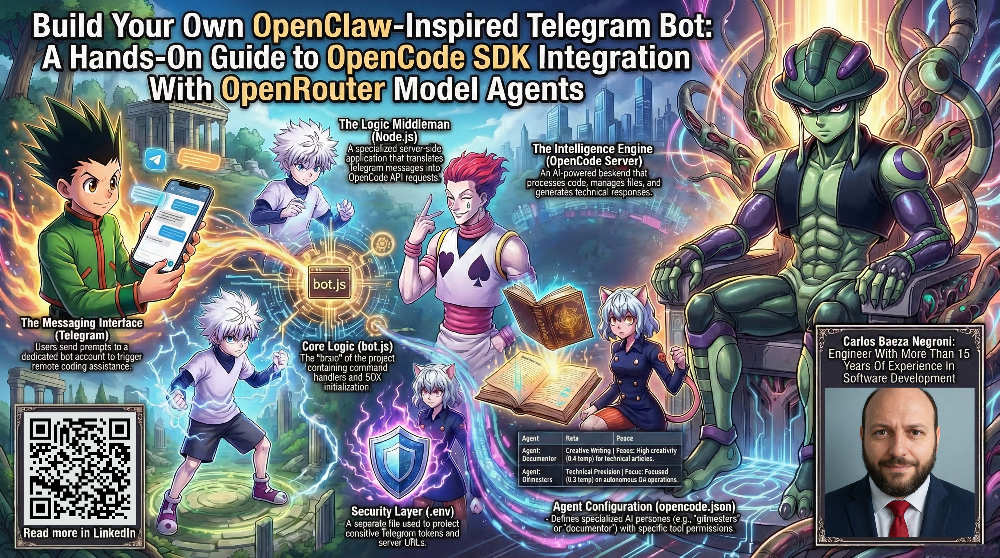
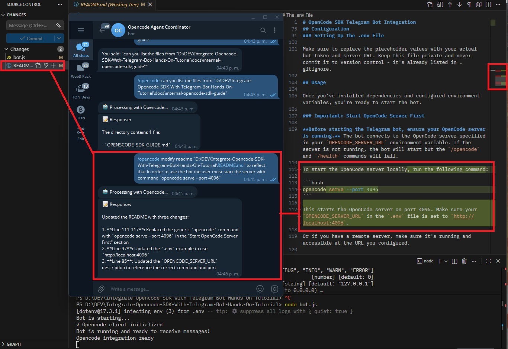

# Build Your Own OpenClaw-Inspired Telegram Bot: A Hands-On Guide to OpenCode SDK Integration With OpenRouter Model Agents

This folder contains a comprehensive guide to building a Telegram bot that integrates with the OpenCode SDK and OpenRouter model agents. The guide explores a complete implementation allowing you to control computer functions and access AI-powered coding assistance through simple Telegram messages. Starting with the core concepts of Telegram bots, Node.js, and OpenCode architecture, you'll learn about the bot's event-driven design, session management strategies, configuration with multiple AI providers, and practical implementation details. The article dives into the code structure covering environment setup, OpenCode agent configuration, Telegram bot initialization, command routing with regular expressions, and security best practices. Each section includes practical code snippets in JavaScript and configuration files alongside natural explanations of concepts like asynchronous programming, API integrations, state management, and sandboxed AI operations. Whether you're a developer interested in bot development, AI integration, or remote development tools, this guide provides real-world implementation details for deploying a production-ready Telegram bot that brings OpenCode's AI capabilities to your mobile device.

Feel free to check out the full content in five ways:

1. 📢 **LinkedIn announcement**: 
2. 📖 **Read the article directly on LinkedIn**: 
3. 🐦 **X/Twitter Announcement**: 
4. 🧩 **Project Repository**: https://github.com/cjbaezilla/Integrate-Opencode-SDK-With-Telegram-Bot-Hands-On-Tutorial
5. 🔍 **Browse the source**:
   [article.md](./article.md)
