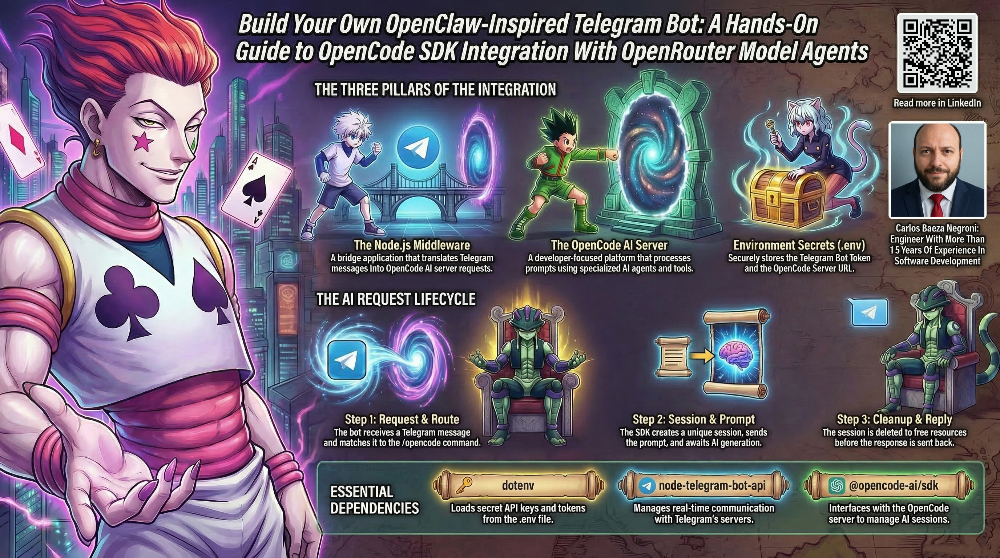

# Build Your Own OpenClaw-Inspired Telegram Bot: A Hands-On Guide to OpenCode SDK Integration With OpenRouter Model Agents


## Introduction

Have you ever wanted to control your computer from your phone? Imagine being able to ask an AI assistant to help with programming tasks, generate code, and manage development work through simple text messages on Telegram. This is exactly what this project makes possible. Think of it like having a technical expert sitting in your pocket, ready to help whenever you need assistance with coding, regardless of where you are or what you are doing. The bot essentially bridges the gap between your mobile device and your development environment, allowing you to tap into AI-powered coding assistance without needing to sit at your computer.

This guide will walk you through every single aspect of the OpenCode SDK Telegram Bot integration. By the end, you will understand exactly how this system works, how to set it up, how to use it, and how to extend it. No prior programming knowledge is needed. We will start from the very beginning and build up your understanding piece by piece, just like constructing a house from the foundation up. Each concept will be explained in plain language with real-world analogies so you can grasp even the most technical aspects without feeling overwhelmed.

This implementation lets you control computer functions through the OpenCode server SDK integration, similar to how the OpenClaw project can control computer behavior. The project connects Telegram messaging with OpenCode AI through a Node.js application. When you send a message to your Telegram bot, it forwards your request to an OpenCode server, processes the AI response, and sends the result back to you. It creates a remote control for AI-powered coding assistance that you can access from anywhere in the world using Telegram. To understand this better, imagine a scenario where you are traveling and suddenly realize you need to debug a piece of code. Without this bot, you would need to find a computer, open your development environment, and start troubleshooting. With this bot, you can simply pull out your phone, open Telegram, describe the problem, and receive suggestions and solutions within minutes. This transforms how developers work, making help available exactly when and where it is needed.

The integration might sound complex, but at its heart it is simply three things talking to each other: Telegram's messaging platform, your bot running as a middleman, and the OpenCode AI server that generates intelligent responses. Each component has a specific job, and they work together like a well-coordinated team. The bot listens for your messages, understands what you want, asks the AI for help, and delivers the answer back to you. All of this happens in seconds, creating a seamless experience that feels like magic but is actually just clever engineering.

Let us take a moment to understand why this matters in everyday terms. Many developers spend hours at their computers, but life happens away from the desk. You might be at a family gathering, commuting, or simply away from your machine when a coding question arises. Traditionally, you would have to wait until you return to your computer to address it. This bot eliminates that wait. It puts a powerful coding assistant in your pocket, available at any hour of the day or night. Whether you need a quick syntax reminder, want to generate a function, or need help understanding a complex concept, the bot is ready. This is especially valuable for students learning to code, freelance developers working on multiple projects, or anyone who wants to make productive use of small moments of downtime.

Furthermore, this integration demonstrates how different technologies can work together to solve real problems. You do not need to be an expert in networking, APIs, or artificial intelligence to use it. The goal of this guide is to demystify all of that and give you the confidence to not only use the bot but also modify it for your own needs. By the time you finish reading, you will understand each piece of the puzzle and how they fit together, and you will be able to troubleshoot issues, add new features, and deploy the bot in your own environment.



## Getting Started with Practical Examples

Before we dive deeper into the technical details, let us think about what you can actually do with this bot once it is running. Imagine you are at a coffee shop, away from your computer, and you remember you need to write a function to parse some data. You open Telegram on your phone, type a command to your bot, and ask it to generate Python code for parsing CSV files. Within seconds, you receive a complete, working function. You can then copy that code and paste it into your project. This is the power of having an AI coding assistant in your pocket.

Let us explore this scenario with more detail. You are sitting in a café, enjoying a cup of coffee, when you recall that your data analysis project needs a function to read CSV files and convert them into a structured format. Normally, you would need to find a computer, open your code editor, search for examples online or in documentation, and piece together the code yourself. With this bot, you simply take out your phone, open Telegram, and send a message like: "/opencode Write a Python function that reads a CSV file and returns a list of dictionaries, with error handling for missing files." The bot communicates with the OpenCode AI, which understands exactly what you need, and within moments you receive a well-structured function complete with comments and error handling. You can review the code, copy it, and it is ready to use. This saves you time and mental effort, allowing you to capture ideas and get work done no matter where you are.

Or consider this scenario: you are working on a complex bug and cannot figure out why your code is not behaving as expected. You could describe the problem to your bot, include the relevant code snippets, and ask for debugging help. The AI can analyze the code, identify potential issues, and suggest fixes. All of this happens through simple text messages, without needing to switch to a different application or interrupt your flow.

Let us elaborate on this debugging scenario. Suppose you have been staring at a piece of JavaScript code for an hour, trying to understand why a certain function returns undefined. You have checked variable names, console logged everything, and still cannot find the problem. Frustrated, you decide to take a break and go for a walk. While walking, you remember your bot. You pull out your phone and send a message: "/opencode This function should return the sum of an array but it returns undefined: function sum(arr) { let total; for (let i = 0; i < arr.length; i++) { total += arr[i]; } return total; } What is wrong?" The AI quickly responds: "The issue is that total is declared but not initialized. It starts as undefined, and adding numbers to undefined results in NaN. You should initialize total to 0: let total = 0;". Just like that, a problem that had you stuck for an hour is solved in seconds. The bot does not get frustrated, it does not need coffee, and it is always ready to help with fresh eyes.

Another useful application is learning new programming concepts. If you are trying to understand how recursion works, you can ask your bot to explain it in simple terms, provide examples, and even generate practice problems. The bot becomes a personal tutor available anytime.

Let us explore this learning aspect further. Learning to program can be daunting, especially when encountering abstract concepts like recursion, closures, or higher-order functions. Traditional learning resources include documentation, tutorials, videos, and forums. These are all valuable, but they may not be immediately accessible when you have a specific question. Your bot changes that. You can ask targeted questions and get immediate, personalized explanations. For instance, you could send: "/opencode Explain what a closure is in JavaScript with a simple analogy and code example." The AI might respond with an analogy about a child keeping access to their parent's kitchen even after moving out, followed by a code snippet demonstrating a nested function that retains access to variables from its outer scope. You can then ask follow-up questions, ask for more examples, or request clarification on parts you do not understand. This creates an interactive learning experience tailored to your pace and needs. It is like having a patient mentor who never judges your questions and always provides explanations at your level.

These examples illustrate why this integration is valuable. It puts powerful AI assistance within reach of anyone with a Telegram account, turning your phone into a portable development environment helper. The bot democratizes access to coding help, making it possible for beginners to get guidance, for experienced developers to accelerate their work, and for anyone in between to have a reliable assistant. It is not meant to replace human expertise or deep learning, but to augment your capabilities and provide support when you need it. Think of it as a tool in your toolkit, like a spellchecker for your ideas or a calculator for your logic. It helps you work more efficiently and confidently, knowing that help is just a message away.

Beyond the specific use cases we have discussed, the bot can assist with many other tasks: generating unit tests, refactoring code, explaining error messages, suggesting design patterns, reviewing code for potential improvements, translating code between languages, creating documentation, and even brainstorming project ideas. Because OpenCode is specifically designed for programming tasks, its responses are focused on code and development concepts, making it more useful for these purposes than a general-purpose chatbot. This specialization means you get relevant, practical help rather than generic or off-topic answers.

In summary, this bot is not just a technical demonstration; it is a practical tool that can genuinely improve how you work and learn. By the end of this guide, you will be able to set it up, use it effectively, and adapt it to your own workflow. The examples we have described are just the beginning—once you start using it, you will likely discover even more ways it can help you in your day-to-day development activities.

## What You Need to Know First

Before we dive into the code, let us establish some basic concepts. A Telegram bot is like a virtual assistant that lives inside Telegram. You can send it messages, and it responds automatically. The bot itself is just a program running on a computer somewhere. In our case, that program is written in Node.js, which is a way to run JavaScript outside of a web browser.

Let us break down these concepts more thoroughly. A Telegram bot is an account that can interact with users automatically, but it is not a human—it is a computer program that you write. When you create a bot, BotFather gives you a special token, which is like a password that identifies your bot to Telegram's servers. With this token, your program can log in as the bot and access Telegram's messaging system. The bot can receive messages from users, send replies, and perform various actions like editing messages, sending documents, or even making payments depending on its configuration. However, the bot does nothing on its own—it completely depends on the code you write to define its behavior. Think of it like a puppet: you write the strings that make it move, and Telegram provides the stage and audience.

OpenCode is an AI-powered coding assistant platform. It provides artificial intelligence that can help with programming tasks: writing code, explaining concepts, analyzing files, and more. The OpenCode SDK is a library that lets other programs talk to OpenCode servers. Our bot uses this library to send your prompts to OpenCode and get responses.

To understand OpenCode, imagine it as an expert programmer who never sleeps and can be called upon to help with any coding task. When you send a request to the OpenCode server, that server uses advanced AI models to generate helpful, context-aware responses. OpenCode is specifically designed for programming work, which means it understands code syntax, common patterns, and development workflows. Unlike a general chatbot that might give vague or incorrect advice about code, OpenCode is trained and optimized to provide accurate, practical assistance. It can read files, execute commands in a safe environment, and maintain a conversation about a specific coding problem. The SDK (Software Development Kit) is essentially a toolkit that makes it easy for your bot to communicate with the OpenCode server. Without the SDK, you would have to manually construct network requests, format data according to OpenCode's specifications, and parse responses; the SDK handles all that, providing simple methods you can call.

The Node.js application we are building sits in the middle. It receives Telegram messages, uses the OpenCode SDK to process them, and returns results. Think of it as a translator that knows both Telegram's language and OpenCode's language.

This middleman role is crucial. Telegram and OpenCode do not know how to talk to each other directly. They are separate systems with their own protocols and data formats. Our Node.js application acts as a bridge between them. When a user sends a message to the bot on Telegram, that message arrives at our application. The application examines the message to determine what the user wants, then forwards the relevant information to OpenCode via the SDK. OpenCode processes the request and sends back a response. The application then takes that response and sends it back to the user through Telegram. This entire cycle typically happens in just a few seconds, creating the illusion of a single, unified system. However, behind the scenes, there are multiple steps, multiple networks, and multiple pieces of software working together. Understanding this flow helps you see where problems might occur if something goes wrong: maybe the bot cannot reach Telegram, maybe the OpenCode server is down, or maybe the bot's code has an error.

Node.js is the platform we use to build this bridge. But what exactly is Node.js? Node.js is a way to run JavaScript code on a computer, not just in a web browser. Normally, JavaScript runs inside browsers like Chrome or Firefox, making web pages interactive. Node.js lets us use the same JavaScript language for general-purpose programming, like we would with Python or Java. This is significant because JavaScript is now one of the most popular programming languages in the world, and many developers already know it. Using Node.js means we can write our bot using a familiar language and take advantage of a huge ecosystem of libraries (which we will discuss later). Node.js is also excellent for building network applications because it handles many connections efficiently without needing multiple threads. Its asynchronous nature allows our bot to wait for responses from Telegram or OpenCode without freezing the entire program, so it can handle multiple users at the same time. This makes it a solid choice for a bot that might receive messages frequently.

Why is this useful? Because JavaScript is widely known, has a huge ecosystem of libraries, and Node.js makes it easy to build network applications like our bot. With Node.js, we can listen for incoming network requests, make outgoing requests to other services, handle files, and do all the things we need for our bot.

Node.js also comes with npm, the Node Package Manager, which is like an app store for code libraries. When we need to talk to Telegram, we do not write all that code ourselves. We install a library called node-telegram-bot-api that already knows how to communicate with Telegram's servers. This saves enormous time and ensures reliability.

Let us expand on npm and packages, as they are fundamental to modern JavaScript development. npm stands for Node Package Manager, and it serves two purposes: it is a command-line tool for installing and managing code libraries, and it is also a massive online repository of those libraries (the npm registry). When you want to add functionality to your Node.js project—for example, to connect to Telegram—you do not reinvent the wheel. Instead, you use npm to download a package that already implements that functionality. Packages are reusable bundles of code published by developers around the world. Anyone can publish a package, and anyone can use it. This creates a vibrant ecosystem where common tasks are solved once and shared widely. In our bot, we use three packages: dotenv for handling environment variables, node-telegram-bot-api for Telegram communication, and @opencode-ai/sdk for OpenCode integration. Each of these is maintained by its respective team and brings expertise and reliability to our project. Using these packages means we can focus on the unique logic of our bot rather than spending time on low-level details like HTTP requests, authentication protocols, or file parsing.

Now let us circle back to APIs, which are the communication standard between different software systems. An API is a set of rules that defines how one program can request services from another. It is like a menu at a restaurant: the menu tells you what dishes you can order and how you can customize them. When you place an order, the kitchen (the other program) prepares your food and brings it back. Similarly, when our bot wants something from Telegram or OpenCode, it sends an API request in a specific format, and the server responds with data in a specific format. Both sides agree on this format ahead of time, so they understand each other. APIs are everywhere in software: your weather app uses an API to get data from a weather service, your phone's maps app uses an API to retrieve map data, and your browser uses APIs to fetch web pages. In our bot, we are using two APIs: Telegram's Bot API and OpenCode's API. Each has its own endpoints (specific URLs), request methods, authentication requirements, and response structures. The libraries we use (node-telegram-bot-api and @opencode-ai/sdk) handle the low-level details of making these API calls, so we can work with simple JavaScript objects and methods instead of manually crafting HTTP requests.

Understanding APIs is fundamental because they are the glue connecting different systems. Every time you use an app on your phone that shows weather data, that app is probably making an API request to a weather service server.

In summary, before we write any code, we need to understand that our bot consists of a Node.js program that sits between Telegram and OpenCode, using specific libraries to handle the complex communication. The bot runs on your computer or server, constantly checking for new Telegram messages, and for each message it decides what to do and either responds directly or asks the OpenCode AI for help. All of this depends on proper configuration of tokens, URLs, and API keys, which we will cover in later sections.

## Understanding the Core Concepts in Everyday Terms

Let us build a solid foundation by explaining the key concepts in plain language. Do not worry if some of these terms are new; we will explore them thoroughly. The goal here is to make the invisible workings of the bot feel concrete and understandable, so when you look at code or configuration files later, you will know exactly what each piece does.

### What is a Bot, Really?

A bot is simply a computer program that automates tasks, like a robot but for software. In our case, the bot lives on a computer (maybe your laptop, a server, or a cloud machine) and waits for messages from Telegram. When you send a message to your bot on Telegram, that message travels across the internet to Telegram's servers. Your bot, which is constantly checking for new messages, sees your message, figures out what you want, does some processing, and sends a reply back through Telegram to your phone.

Think of it like having a personal assistant who sits at a desk with a telephone. You call that assistant (send a Telegram message), the assistant answers, understands your request, does some work, and calls you back with the answer. The assistant never sleeps, never gets tired, and can handle many requests over time. However, unlike a human assistant, this assistant follows exactly the instructions you give in your code. It has no common sense beyond what you program, and it will not deviate from its script unless you specifically give it permission to ask an AI for help. In our bot, the assistant (the Node.js program) is mostly handling simple commands like "/time" or "/joke", but when it encounters "/opencode", it passes the request along to the OpenCode AI to generate a more intelligent response. The bot is essentially a traffic director, routing each message to the appropriate handler.

It is important to understand that a bot is not a sentient being; it is purely logic and data. When we say the bot "figures out what you want," what actually happens is pattern matching: the bot looks at the text of your message and checks if it matches certain patterns (like starting with "/start" or "/opencode"). Based on which pattern matches, the bot executes a specific block of code that was written for that command. This is deterministic: the same message will always produce the same response, unless the response involves randomness (like the /joke command) or an AI that generates different outputs each time. The bot itself does not learn or change over time unless you modify its code. This is a good thing for reliability—you want the bot to behave predictably.

### What is Node.js and Why Do We Use It?

Node.js is a way to run JavaScript code on a computer, not just in a web browser. Normally, JavaScript runs inside browsers like Chrome or Firefox, making web pages interactive. Node.js lets us use the same JavaScript language for general-purpose programming, like we would with Python or Java.

Why is this useful? Because JavaScript is widely known, has a huge ecosystem of libraries, and Node.js makes it easy to build network applications like our bot. With Node.js, we can listen for incoming network requests, make outgoing requests to other services, handle files, and do all the things we need for our bot.

Let us dive deeper into Node.js and what makes it special. JavaScript originally was created to add interactivity to web pages. It ran only in browsers. But in 2009, a developer named Ryan Dahl created Node.js, which took Google's V8 JavaScript engine (the part of Chrome that executes JavaScript) and embedded it in a standalone program that could run on a computer. This meant you could write JavaScript programs that run directly on the operating system, without a browser. These programs are called Node.js applications or sometimes "server-side JavaScript" because they are often used to build web servers, but they can do much more than that.

Node.js comes with built-in modules for common tasks: reading and writing files, making network connections, working with URLs, handling operating system interactions, and more. But its real power comes from the package ecosystem (npm). Because JavaScript became so popular, thousands of developers have created reusable libraries that you can easily add to your projects. These libraries solve common problems: connecting to databases, sending HTTP requests, parsing JSON, validating data, you name it. This means when we need to talk to Telegram, we do not have to implement the entire Telegram Bot API protocol ourselves. We simply install a package that already knows how to do that. Not only does this save time, but it also means we are using a library that has been tested by many users and is likely to handle edge cases and errors robustly.

Another key feature of Node.js is its asynchronous, non-blocking I/O model. Let us unpack that. I/O stands for input/output—things like reading files, making network requests, or querying a database. In traditional programming, when you ask the computer to read a file, your program waits (blocks) until the file is completely read before moving on. This is synchronous I/O. While waiting, the program cannot do anything else. In a server that handles many requests, this would be a problem: if one request requires reading a large file, all other requests would have to wait. Node.js uses an event-driven approach: when you ask it to read a file, it starts the operation and then immediately moves on to handle other work. When the file reading finishes, Node.js triggers an event (or calls a callback function) to resume processing that request. This allows a single Node.js process to handle thousands of concurrent operations efficiently, without needing multiple threads. For our bot, this means that while it is waiting for a response from the OpenCode server (which could take a few seconds), it can still receive and process other Telegram messages from other users. The bot remains responsive even when some requests are slow. This is crucial for a good user experience.

Node.js also comes with npm, the Node Package Manager, which is like an app store for code libraries. When we need to talk to Telegram, we do not write all that code ourselves. We install a library called node-telegram-bot-api that already knows how to communicate with Telegram's servers. This saves enormous time and ensures reliability.

We should clarify what a package (or module) is in the Node.js world. A package is simply a reusable piece of code distributed with a package.json file that describes its contents, dependencies, and metadata. When you run npm install, npm downloads the package from the registry and places it in a folder called node_modules in your project. Then you can import that package into your code using import statements (if using ES modules) or require() (if using CommonJS). Packages can have their own dependencies, forming a tree. This modularity is powerful because it encourages code reuse and specialization. Node.js itself provides an environment for running JavaScript outside browsers, and npm provides the ecosystem that makes Node.js practical for building real applications. Together, they form a complete platform for server-side development.

In summary, we use Node.js because it lets us write our bot in a language (JavaScript) that is widely known and has excellent libraries for both Telegram and OpenCode integration. Its asynchronous nature ensures our bot stays responsive under load, and its rich ecosystem means we do not have to reinvent the wheel for common tasks like making HTTP requests or handling configuration.

### What is an API?

API stands for Application Programming Interface. It is a contract that says: "If you send me a request in this specific format, I will send you back a response in this specific format." APIs are how different software systems talk to each other.

Telegram provides an API that lets bots send and receive messages. OpenCode provides an API that lets programs ask its AI to generate responses. Our bot uses both of these APIs. It sends requests to Telegram's API to get messages and to send replies. It sends requests to OpenCode's API to get AI responses.

Let us explore APIs with an analogy that makes them concrete. Imagine you are at a restaurant. You, the customer, are one application. The kitchen is another application. You cannot just walk into the kitchen and start cooking—you need to interact through the waiter, who is the API. You place your order using the menu's format (specific dishes, modifications). The waiter takes your request to the kitchen, the kitchen prepares the food, and the waiter brings it back to you. The menu and the waiter's procedure constitute the API: they define what you can request and how you will receive the food. If the menu changes, you need to adjust your ordering. If the kitchen changes how it prepares dishes, you might still get your food but perhaps with different ingredients—that is an API change that might break your expectations. In software, APIs work the same way: one program (the client) makes a request to another program (the server) according to agreed-upon rules, and the server sends back a response.

In the context of our bot, Telegram exposes a Bot API. This API consists of various endpoints (URLs) that accept HTTP requests. For example, to get updates (new messages), you call the getUpdates endpoint. To send a message, you call the sendMessage endpoint with parameters like chat_id and text. Telegram's server processes these requests and sends back responses, typically in JSON format. JSON (JavaScript Object Notation) is a lightweight data interchange format that is easy for both humans and machines to read. It looks like JavaScript objects: key-value pairs with curly braces. For example, a Telegram message might be represented as JSON: {"message_id": 123, "chat": {"id": 456, "type": "private"}, "text": "hello"}. Our bot library parses this JSON into JavaScript objects we can work with.

OpenCode similarly has an API. The OpenCode server runs on a specific port (default 4096) and listens for HTTP requests on endpoints like /session to create sessions, /session/{id}/prompt to send prompts, and /session/{id} to delete sessions. When we call these endpoints with appropriate data, the server interacts with its AI models and returns responses, again in JSON. The OpenCode SDK abstracts away the HTTP details; we just call JavaScript methods like opencodeClient.session.create() which internally makes the HTTP request, sends JSON, receives the response, and parses it back into a JavaScript object.

Understanding APIs is fundamental because they are the glue connecting different systems. Every time you use an app on your phone that shows weather data, that app is probably making an API request to a weather service server. APIs enable interoperability—they allow separate pieces of software, possibly built by different teams using different technologies, to work together. In our bot, we rely on two third-party APIs: Telegram's and OpenCode's. Both have documentation that defines the request and response formats. The libraries we use are essentially implementations of those API specifications, so we do not have to read the docs and manually construct every request. However, knowing that an API exists and what it does helps when things go wrong; you can inspect network traffic, read error messages, and understand limits like rate limits or authentication requirements.

It is also worth noting that APIs can be versioned. If Telegram updates their Bot API to version 7.0, the old version might still work for a while but eventually they may deprecate it. The node-telegram-bot-api library abstracts these version differences, so our code does not need to change drastically. When using third-party APIs, you should be aware that they can change, and you may need to update your libraries if the underlying API changes significantly. That is why we list dependencies in package.json with version ranges: to get updates that maintain compatibility while avoiding breaking changes.

### What is OpenCode?

OpenCode is an AI-powered coding assistant platform. Unlike ChatGPT or GitHub Copilot, OpenCode is designed specifically to help with programming tasks. It can write code, explain programming concepts, analyze existing codebases, run commands, edit files, and more. It is like having an experienced programmer sitting next to you, ready to help.

The OpenCode platform consists of a server that runs AI models and provides tools for file manipulation, command execution, and code analysis. The server exposes an API that clients can use to create sessions and interact with the AI.

OpenCode differs from general AI chat in that it is built for development work. It understands code, can read files from your computer, can execute terminal commands (with permission), and maintains context across a session. This makes it powerful for real development tasks.

Let us explore what makes OpenCode special. Many AI assistants exist today: OpenAI's ChatGPT, GitHub Copilot, Claude, and others. OpenCode distinguishes itself by being developer-focused. It is not just a chatbot that knows some programming facts; it is an integrated environment where the AI can perform actions on your behalf. When you interact with OpenCode, you are typically working within a "session" that has access to tools. These tools might include reading and writing files in a workspace, running shell commands (like running a script or checking git status), searching through code, and more. The AI can decide to use these tools as needed to accomplish your request. For example, if you ask "What is in my current directory?" the AI might use a file-listing tool to find out. If you ask it to fix a bug in a file, it might read the file, analyze the code, suggest changes, and optionally apply those changes using a file-editing tool. This makes OpenCode more than a conversational partner; it is an active participant in your development workflow.

The OpenCode architecture typically includes a server component that you run on your own machine or on a server you control. This server loads configuration (like which AI provider to use, which agents are available) and exposes an API over HTTP. It may also provide a web-based user interface where you can interact with the AI directly. When we use the OpenCode SDK in our bot, we are connecting to that server's API. The SDK simplifies the communication: we create a client with configuration, then call methods to create sessions, prompt the AI, and delete sessions. Behind the scenes, the client makes HTTP requests to the server, which then routes the request to the appropriate AI model and tools, gathers the results, and sends back a response.

Agents are an important concept in OpenCode. An agent is a specialized AI persona with its own instructions, tools, and settings. For example, there might be a "documentor" agent optimized for writing clear documentation, a "gitmasters" agent skilled at Git operations, or a general-purpose coding agent. The configuration file opencode.json defines these agents. When we create a session, we can optionally specify which agent to use. If we do not specify, the server may use a default agent. Agents allow you to fine-tune the AI's behavior for specific tasks, improving the quality and relevance of responses.

OpenCode also offers features like persistent sessions, where the AI remembers the conversation history within that session. This enables multi-turn dialogues: you can ask a follow-up question, and the AI will remember the context of previous messages in that session. This is crucial for iterative tasks like debugging or gradually refining requirements. In our current bot implementation, we use disposable sessions that are deleted after each use, so each /opencode command is independent. But as we will discuss later, you can modify the bot to use persistent sessions that allow users to have ongoing conversations with the AI.

OpenCode integrates with various AI providers through an abstraction layer. The provider configuration in opencode.json tells OpenCode how to connect to an AI service, such as OpenRouter, Anthropic, or OpenAI. This means you are not locked into a single AI model; you can configure OpenCode to use whichever provider and model you prefer, and even have different agents use different models. The SDK reads this configuration and knows how to route requests appropriately. This flexibility is valuable because AI models evolve rapidly; you can switch to newer models simply by updating configuration, without changing your bot's code.

In summary, OpenCode is a powerful, developer-centric AI assistant platform that provides a rich set of tools through a well-defined API. Our bot acts as a gateway to OpenCode via Telegram, making it easy to access these capabilities from your phone. Understanding that OpenCode is a separate server that our bot talks to helps you see the architecture: Telegram (messaging) <-> our bot (Node.js application) <-> OpenCode server (AI with tools). Each piece can be developed, deployed, and scaled independently.

## Project Structure

Let us first look at what files make up this project and what each one does. Understanding the structure of a software project is like understanding the layout of a house: each room has a purpose, and knowing where everything belongs helps you find what you need and make changes safely. Here is the typical folder layout:

```
project-root/
├── .env                    # Secret configuration file
├── .gitignore              # Files to ignore in version control
├── package.json            # Project metadata and dependencies
├── package-lock.json       # Exact dependency versions (auto-generated)
├── opencode.json           # OpenCode agent and provider configuration
├── bot.js                  # Main application code
├── prompts/               # Prompt templates for agents
└── images/                # Documentation images
```

### Project Files Reference Table

For a quick overview of each file's purpose and type, refer to this table:

| File/Directory | Purpose | Type |
|----------------|---------|------|
| `.env` | Secret configuration (API keys, tokens) | Configuration |
| `.gitignore` | Files excluded from version control | Configuration |
| `package.json` | Project metadata and dependencies | Configuration |
| `package-lock.json` | Exact dependency versions (auto-generated) | Auto-generated |
| `opencode.json` | OpenCode agent and provider configuration | Configuration |
| `bot.js` | Main application code | Source Code |
| `prompts/` | Prompt templates for agents | Directory |
| `images/` | Documentation images | Directory |

Let us explore each of these elements in depth, understanding not just what they are but why they exist and what would happen if they were missing.

**bot.js** is the heart of the project. This is the main program that runs the bot. It is a JavaScript file containing all the logic: loading configuration, setting up event listeners, handling incoming messages, and calling the OpenCode SDK. Think of it as the brain of the operation. When you run `node bot.js`, Node.js reads this file and executes it. The file starts with import statements to bring in external libraries, then defines functions and event handlers, and finally starts the bot and keeps it running. You will spend most of your time in this file when customizing the bot because it contains the command handlers and business logic. If you want to add a new command, change how messages are processed, or modify the bot's behavior, you edit bot.js. The code is written in modern JavaScript (ES modules) and uses async/await patterns to handle asynchronous operations like network calls gracefully.

**package.json** is a configuration file for Node.js projects. It is written in JSON format and serves as the project's manifest. It lists essential information: the project name (though not strictly necessary), the type of module system ("module" for ES modules), the dependencies (external libraries needed), and scripts (shortcuts for common commands). When someone else gets your project, they look at package.json to understand what it needs. Running `npm install` reads this file and installs all the listed dependencies into node_modules. The "scripts" section defines command shortcuts: "start" means you can run `npm start` instead of typing `node bot.js`. This is conventional and makes it easier for others to know how to run your project. If you need additional packages, you add them to dependencies using `npm install package-name --save`, which updates package.json automatically. The file is also used by tools like IDEs and deployment platforms to understand your project.

**opencode.json** is the configuration file that OpenCode SDK reads to know which AI providers to use and how to configure its agents. This file is specific to OpenCode and is not part of Node.js itself. OpenCode uses it to define agents (specialized AI personas) and providers (connections to AI model services). Imagine the OpenCode server as a restaurant with different chefs (agents) that specialize in different cuisines, and providers are the suppliers that provide the ingredients (AI models). The opencode.json file is the menu and chef roster that tells the server which chefs are available and where to get ingredients. The bot does not directly use this file; rather, when you create the OpenCode client with `createOpencodeClient(config)`, the SDK automatically looks for this file in the specified directory and reads it. The client then uses the information to route requests appropriately. If this file is missing or malformed, the OpenCode client will fail to initialize. It is important because it determines which AI models the bot can access and how they behave. You can edit this file to change agents, adjust permission levels, or switch to different AI providers without touching bot.js.

** .env** stores environment variables – secret configuration values that should not be hard-coded in the source code. This file contains your Telegram bot token and OpenCode server URL. The .env file is plain text with lines in the format `KEY=value`. The dotenv library reads this file when your application starts and loads those key-value pairs into `process.env`, making them accessible throughout your code. Keeping secrets in .env files is a common security practice. If you hard-coded your Telegram token directly in bot.js, anyone who read that file would see the token. By putting it in .env, you can add .env to .gitignore so it never gets committed to version control, and you can have different .env files for development, testing, and production. Changing the token or server URL then requires only editing .env, not modifying code. This separation of configuration from code is a fundamental principle in software development. If the .env file is missing or the required variables are not set, the bot will detect this at startup and print an error message, preventing confusion later.

**node_modules/** is a folder where npm (Node Package Manager) installs all the dependencies. This folder is automatically created when you run `npm install` and contains thousands of files from the libraries you use, organized in nested directories. You never edit this folder manually; it is managed entirely by npm. When you install a package, npm downloads it from the public registry (or a private one) and places it here. The folder can become quite large, which is why it is standard practice to add it to .gitignore. When you or someone else runs `npm install` on a fresh copy of the project, npm reads package.json and package-lock.json to recreate the exact same set of packages in node_modules. This ensures that the code runs consistently across different machines.

**package-lock.json** is automatically generated by npm to lock the exact versions of all dependencies. It is a snapshot of the entire dependency tree with precise version numbers, including sub-dependencies. This file is crucial for reproducibility. Suppose your package.json says "dotenv": "^17.3.1" meaning "any version from 17.3.1 up to, but not including, 18.0.0". If you run `npm install` today, you might get 17.3.1; in six months, a newer 17.x version might be available and npm would upgrade to that. That could introduce subtle differences if a new version changes behavior. The package-lock.json prevents this by recording exactly which version was installed at the time. When another person runs `npm install`, npm checks for package-lock.json and installs those exact versions, ensuring everyone is using the same code. This avoids the "it works on my machine" problem. You typically do not edit this file by hand; it is updated automatically by npm whenever dependencies change.

**.gitignore** tells Git which files to ignore when tracking changes. Git is a version control system, and this project uses it (indicated by the .git folder). When you run `git add .` to stage changes, Git normally includes all files in the directory. But some files should not be committed: node_modules is huge and can be regenerated; .env contains secrets; opencode.json might contain API keys; and there could be temporary files, logs, or IDE-specific configuration files. The .gitignore file lists patterns for files and directories that Git should ignore. When you initialize a Node.js project, there are standard patterns to ignore. By ignoring these files, you keep your repository clean, secure, and small. It is essential to never commit secrets like .env or API keys; if you do, you must revoke those secrets and remove them from the repository's history (which can be tricky). This file is your friend for maintaining a secure and efficient project.

The prompts/ folder contains text files with prompt templates for the OpenCode agents. In our configuration, agents like "documentor" reference a prompt file at "./prompts/documentor.txt". These files contain the system instructions that define the agent's role, behavior constraints, output format, and goals. They are essentially the job description or personality script for the AI. Separating prompts into files makes them easier to edit without touching the main bot.js or opencode.json, and it allows different agents to have different, well-crafted instructions. The prompts are typically plain text or Markdown, and they can be quite long, specifying how the agent should approach tasks, what tone to use, what tools are available, and how to structure responses. Modifying a prompt can significantly change how an agent behaves, so these files are important.

The images/ folder simply contains images used in the documentation. Our bot code does not use it directly; it is for the tutorial you are reading right now. In a real project, you might have a public/ folder for static assets served by a web server, but here it is just documentation.

Now that we have listed the files, let us understand how they work together as a system. When you run `npm start`, here is what happens step by step:

Node.js reads package.json to understand that the project uses ES modules and to locate the entry point (bot.js via the start script). Node.js loads the module dependencies using the import statements at the top of bot.js. These dependencies are found in node_modules. The `dotenv.config()` call reads the .env file in the current working directory and populates `process.env` with the variables defined there. This must happen before we try to access those variables.

The bot code then checks for the presence of required environment variables (TELEGRAM_BOT_API_KEY and OPENCODE_SERVER_URL). If they are missing, the bot logs an error and exits. It then calls `initOpencode()`, which creates an instance of the OpenCode client. That client internally reads opencode.json to learn about agents and providers, and it establishes a connection to the OpenCode server using the URL from the environment. The client object is stored for later use.

The bot then creates an instance of TelegramBot from the node-telegram-bot-api library, passing the Telegram token and enabling polling. Polling means the library will repeatedly call Telegram's getUpdates method to fetch new messages. The bot registers event handlers for 'message', 'polling_error', and 'error' events, and then begins listening. At this point, the bot is fully operational: it will receive incoming Telegram messages and invoke the message handler for each.

If any of these pieces is missing or misconfigured, the bot will fail to start or behave incorrectly. For example, if the Telegram token is wrong, the polling requests to Telegram will be rejected. If the OpenCode server is not running, the client may still initialize but later API calls will fail. That is why understanding each file's role is essential for troubleshooting.

This structure is typical for a small Node.js application that integrates with external services. The separation of concerns—code in bot.js, dependencies in package.json, configuration in .env and opencode.json—makes the project maintainable and portable. You can move the project to another computer, run `npm install` to install dependencies, create a .env file with the appropriate values, and it should work exactly the same.

## The Project Structure in Depth

We already listed the files in the project structure, but let us explore how they work together and why each is necessary. Understanding these relationships will help you when you need to modify or debug the bot.

Imagine the project as a kitchen. The `bot.js` file is the chef who does the cooking. The `package.json` is the recipe book that lists all the ingredients (dependencies) needed. The `opencode.json` is a special instruction manual that tells the AI assistant (OpenCode) how to behave. The `.env` file is a secure note card where you write your secret passwords and keys. The `node_modules` folder is the pantry where all the ingredients (libraries) are stored after you bring them home from the store (npm install).

Let us elaborate on this kitchen analogy. In a restaurant kitchen, you have various tools and ingredients. The chef (bot.js) knows the recipes and how to combine ingredients. The recipe book (package.json) does not contain the actual food; it merely lists what ingredients and tools are required. The pantry (node_modules) holds those ingredients in bulk. The secure note card (.env) contains the alarm codes and supplier passwords—sensitive information that should not be left lying around. The instruction manual (opencode.json) tells any assistant chefs (AI agents) how to prepare specific dishes according to the restaurant's standards. All these components must be in place and in good order for the kitchen to function smoothly. If the recipe book is missing, you do not know what ingredients to have on hand. If the secure note card is missing, you cannot access the special suppliers. If the instruction manual is unclear, the assistant chefs might prepare dishes incorrectly. Similarly, in our bot project, each file plays a specific role, and understanding that role helps you manage the project effectively.

When you run `npm start`, here is what happens step by step:

1. Node.js reads `package.json` to understand the project and its dependencies. The "type": "module" tells Node.js to use ES module syntax for imports. The "scripts.start" tells npm what command to execute when you run `npm start`. It also checks dependencies to ensure they are present in node_modules; if not, npm would normally install them, but when you run `node bot.js` directly, Node.js will look for modules in node_modules automatically.

2. Node.js loads the modules from `node_modules` that are referenced in the `import` statements at the top of `bot.js`. This means JavaScript files from those packages are read and executed, and their exported functionality becomes available under the names you imported (dotenv, TelegramBot, createOpencodeClient). This loading process may itself involve reading other files in node_modules, as packages can have many files and their own dependencies.

3. The `dotenv.config()` call reads the `.env` file and puts those values into `process.env`, making them available as environment variables. This happens synchronously: the file is read, parsed, and each line becomes a property on process.env. If the file does not exist, dotenv fails silently by default (it does not throw); the variables will simply not be set. That is why we check for the presence of required variables later. The order is important: dotenv must run before any code that tries to access process.env variables.

4. The bot code starts executing: it checks for the Telegram token, initializes the OpenCode client, and sets up event listeners. The token check is a simple if statement that ensures we have a value; if not, it logs an error and exits. The OpenCode client initialization calls initOpencode(), which constructs a configuration object and calls createOpencodeClient(config). That function likely reads the opencode.json file (since we specified directory: process.cwd()) and validates its contents, then establishes a connection to the OpenCode server (perhaps by making a test request or just storing the base URL for later use). If anything goes wrong—missing opencode.json, invalid JSON, server unreachable—the catch block logs an error, and opencodeClient remains null.

5. The bot connects to Telegram and begins polling for messages. The new TelegramBot(token, { polling: true }) call starts an internal polling loop that uses setInterval or setTimeout to periodically call Telegram's getUpdates API. The library handles the details: it makes HTTP requests, parses responses, filters out updates that have already been processed, and emits 'message' events for each new message. The bot is now listening.

6. The bot also tries to connect to the OpenCode server using the configuration from `opencode.json` and the URL from `.env`. Actually, the OpenCode client may not establish a persistent connection; it might just store the baseUrl and make HTTP requests on demand. But conceptually, we can think of it as preparing to talk to the OpenCode server. The first actual API call happens when a user triggers the `/opencode` command.

If any of these pieces is missing or misconfigured, the bot will fail to start or behave incorrectly. That is why understanding each file's role is essential for troubleshooting.

Let us consider some common misconfigurations and their symptoms:

- If package.json is missing or does not have "type": "module", the import statements at the top of bot.js will cause syntax errors because Node.js will expect CommonJS require statements instead.
- If node_modules is missing or incomplete, running the bot will produce "Cannot find module 'dotenv'" or similar errors. Solution: run npm install.
- If .env is missing or lacks the required keys, the bot will exit early with "TELEGRAM_BOT_API_KEY not found".
- If opencode.json is missing, invalid JSON, or lacks required provider/agent definitions, the OpenCode client initialization will fail, and opencodeClient will remain null. The bot will still start, but any attempt to use /opencode will produce "Opencode client not initialized".
- If the OpenCode server is not running or the URL is wrong, the client may initialize (since it only stores the URL), but the first actual API call (session.create) will fail with a network error, which we catch and report as "Opencode error: fetch failed" or "ECONNREFUSED".
- If the Telegram token is wrong, polling will fail with an authentication error, and the 'polling_error' event will fire (we log it). The bot may still appear to be running but will not receive messages. Or Telegram might block the token entirely.
- If .gitignore is missing, you might accidentally commit node_modules or .env to version control, causing repository bloat or exposing secrets. That is wasteful and dangerous.

The takeaway: each file has a specific purpose, and they must all be present and correctly configured for the bot to work as intended. When something goes wrong, checking the console logs and then verifying each configuration piece is the systematic approach to debugging.

## Understanding package.json in Depth

package.json is one of the most important files in any Node.js project. It is the project's manifest that describes what the project is and what it needs. Let us look at our package.json line by line and understand the deeper implications.

```json
{
  "type": "module",
  "dependencies": {
    "dotenv": "^17.3.1",
    "node-telegram-bot-api": "^0.67.0",
    "@opencode-ai/sdk": "^1.2.26"
  },
  "scripts": {
    "start": "node bot.js"
  }
}
```

The `"type": "module"` declaration might seem small, but it has significant implications. In Node.js, there are two systems for organizing code: CommonJS (the old way using `require()` and `module.exports`) and ES Modules (the modern way using `import` and `export`). By setting `"type": "module"`, we tell Node.js that files in this project should use the ES Modules syntax. This is why we can write `import dotenv from 'dotenv'` at the top of `bot.js`. Without this line, Node.js would expect CommonJS syntax and would throw an error when it sees `import`.

Let us delve into the importance of this distinction. JavaScript originally ran in browsers, where modules were introduced later. The CommonJS system was created for server-side JavaScript (Node.js) and uses `require('module')` to load dependencies and `module.exports` to export values. This is synchronous; when you call require, it immediately loads the module and returns its exports. ES Modules (ESM) are part of the modern ECMAScript standard and use `import` and `export`. They are asynchronous under the hood and support features like tree-shaking (removing unused code) and static analysis. In Node.js, whether a file is treated as CommonJS or ESM depends on the "type" field in package.json: "module" means ESM, "commonjs" (or absence of type) means CommonJS. ESM also changes file extensions: .js files are .mjs if not in a "type": "module" package. Our project uses ESM because it is the modern standard and aligns with how many third-party libraries are now distributed. The bot.js file uses import statements, so we must have "type": "module". If you accidentally remove it, running `node bot.js` will throw a SyntaxError: Unexpected token 'import'. This is a common pitfall for beginners, so it is worth noting.

The `"dependencies"` object lists the external libraries our project needs. Each entry has a package name and a version number. The version numbers have a caret (`^`) before them, which means "compatible with this version and newer patch versions, but not new major versions." For example, `^17.3.1` means version 17.3.1 up to, but not including, version 18.0.0. This is a safety measure: it allows you to get bug fixes and minor improvements automatically when you run `npm install`, but avoids automatically upgrading to versions that might introduce breaking changes.

We should explain semantic versioning (semver) because it is critical for managing dependencies. Version numbers in the Node.js world follow the format MAJOR.MINOR.PATCH, like 17.3.1. The MAJOR number increments when there are incompatible API changes; if you upgrade from 17.x to 18.x, the library might have removed or changed functions that your code depends on, causing breakage. The MINOR number increments when new functionality is added in a backward-compatible manner; upgrading from 17.3.1 to 17.4.0 should be safe. The PATCH number increments when backward-compatible bug fixes are made; upgrading from 17.3.1 to 17.3.2 is almost always safe. The caret (^) notation says: allow any version that does not change the MAJOR number. This means ^17.3.1 includes 17.3.1 up to, but not including, 18.0.0. Similarly, ~ would restrict to PATCH-level changes only (17.3.x). No prefix means exact version. By using ^, we opt into receiving minor updates automatically while avoiding major updates that might break us. This is a widely adopted convention in npm.

The three dependencies each serve a specific purpose:

- **dotenv** handles environment variables. It is a tiny library, only a few kilobytes, but it does one job very well. When your application starts, it reads the `.env` file, parses each line as a key-value pair, and adds those pairs to `process.env`. This means you can access your secrets as `process.env.TELEGRAM_BOT_API_KEY` anywhere in your code. The library also handles edge cases like quoted values and comments, so you do not have to write that parsing logic yourself.

Let us expand on dotenv further. Environment variables are a standard way to configure applications. They are set outside the program, either by the operating system or by a wrapper script, and are inherited by child processes. In Node.js, they are accessible via the global `process.env` object, which is a simple key-value map where both keys and values are strings. For example, if you run `PORT=3000 node server.js` in a Unix shell, then inside server.js, `process.env.PORT` will be "3000". However, for local development, typing these variables every time you start the program is cumbersome. The .env file provides a convenient place to store them, and dotenv reads that file and injects the values into process.env before your code runs. The library is careful to handle cases like: `API_KEY="abc def"` (quoted value with space), `# comment` (ignored), `KEY=value # comment` (inline comment ignored). It also respects the existing environment: if a variable with the same name is already defined in the environment (e.g., set in the shell), dotenv will not overwrite it by default. This allows you to have a .env file for defaults but override in specific environments. Without dotenv, you could manually read and parse the file using Node's fs module, but that would be more code and would miss edge cases. dotenv is so widely used that it has become a de facto standard for Node.js configuration.

- **node-telegram-bot-api** is a comprehensive wrapper around Telegram's Bot API. Telegram's API is a set of web endpoints (URLs) that accept HTTP requests and return responses in JSON format. You could theoretically use a generic HTTP library like `fetch` or `axios` to call these endpoints directly, but `node-telegram-bot-api` makes it much easier. It handles authentication (adding your token to every request), provides a clean event-driven interface, manages the polling loop or webhook server, and offers convenient methods for sending messages, editing messages, handling different types of updates, and more. In our bot, we use the simplest part: we create a bot with polling enabled, listen for 'message' events, and call `sendMessage`. But this library could do much more if we needed.

Let us explore what node-telegram-bot-api does under the hood. Telegram's Bot API is a RESTful API. To receive messages, you can either set up a webhook (Telegram sends HTTP POST requests to your server when messages arrive) or use getUpdates (your server polls Telegram for new updates). Both require handling HTTP requests and responses, managing offsets to avoid processing the same update twice, and dealing with network errors and retries. The library abstracts all this complexity. You simply create a TelegramBot instance with your token and an options object. If you set `polling: true`, the library starts a polling loop that periodically calls getUpdates, tracks the last update ID, and emits events for each new message. It also handles reconnection if the network drops, exponential backoff, and rate limiting. The event-driven interface means you write `bot.on('message', handler)` and the library calls your handler with a parsed message object whenever a message arrives. Sending a message is as easy as `bot.sendMessage(chatId, text)`. The library constructs the appropriate HTTP request to Telegram's sendMessage endpoint, includes the token as a query parameter or in the URL, sends the JSON body, and processes the response to determine success or failure. It also provides convenience methods for sending photos, documents, using Markdown or HTML formatting, replying to specific messages, and more. The library is actively maintained and knows the details of Telegram's API, which saves you from having to read the full API documentation and implement every nuance yourself.

- **@opencode-ai/sdk** is the official client library for OpenCode. It provides a typed, promise-based interface to the OpenCode HTTP API. Without this SDK, we would have to construct HTTP requests manually: building URLs, setting headers, formatting request bodies according to OpenCode's specification, parsing responses, and handling errors. The SDK abstracts all that away. We simply call methods like `opencodeClient.session.create()` and get back JavaScript objects. The SDK also reads the `opencode.json` configuration file to understand which providers and agents are available, and it handles the details of routing requests to the appropriate AI service.

Let us understand what the OpenCode SDK does in more depth. The OpenCode server exposes HTTP endpoints for various operations: creating sessions, sending prompts, listing sessions, deleting sessions, and perhaps others. The API expects specific request and response formats, likely JSON. To use the API directly, you would use a generic HTTP client (like Node's built-in fetch or a library like axios) to make requests to URLs like `http://localhost:4096/session`, with appropriate headers and JSON bodies. You would need to handle authentication if required (maybe via an API key in headers), parse the JSON response, check for error fields, and possibly handle pagination for list operations. The SDK encapsulates all that. You include it in your project (`import { createOpencodeClient } from '@opencode-ai/sdk'`), then call `createOpencodeClient({ baseUrl, throwOnError, directory })`. This returns an object with properties like `session` that itself has methods `create`, `list`, `prompt`, `delete`, etc. When you call these methods, they internally construct the correct URL, send the HTTP request with the appropriate body, parse the response, and return either the data or an error object depending on the `throwOnError` setting. This gives you a clean, JavaScript-friendly interface that feels like a local library rather than a remote API. Additionally, the SDK knows about OpenCode's concept of agents and providers, so it can route requests to different AI models based on configuration. It also may provide type definitions (TypeScript types) that help with autocomplete and error checking in editors. In short, the SDK is a convenience layer that hides the complexity of HTTP and raw JSON handling, letting you focus on the bot logic.

### Dependencies Summary Table

Here is a quick reference for the three dependencies used in this project:

| Package | Version | Purpose |
|---------|---------|---------|
| `dotenv` | ^17.3.1 | Load environment variables from .env file into process.env |
| `node-telegram-bot-api` | ^0.67.0 | Communicate with Telegram Bot API (polling, sending messages) |
| `@opencode-ai/sdk` | ^1.2.26 | Interface with OpenCode server (sessions, prompts, agents) |

The `"scripts"` section defines shortcuts that can be run with `npm run`. The `"start"` script runs `node bot.js`. This is conventional. You could also define other scripts like `"dev"` to run with auto-reload on file changes, or `"test"` to run tests, or `"lint"` to check code style. Having these scripts in `package.json` means other developers (or you in a few months) will know how to run common tasks just by reading this file.

Scripts are more than just shortcuts; they are a standardized interface to your project. When someone clones your repository, they typically look at package.json to see how to run the project. The "start" script is especially important because it is a de facto standard: many hosting platforms (like Heroku, Railway, Render) automatically run `npm start` to launch your application. By defining "start": "node bot.js", you tell those platforms exactly what command to execute. Similarly, `npm test` runs the "test" script if present, `npm run dev` runs the "dev" script. Writing these scripts in package.json keeps them out of your code and makes them easily accessible. You can also write more complex scripts using npm's ability to run multiple commands with &&, or use pre/post hooks like "pretest" and "poststart". For example, you might add "build": "npm run lint && npm test" or "dev": "nodemon bot.js" to auto-restart on file changes. The script names are just strings; npm provides them as command names.

When someone else wants to use your project, they run `npm install`. npm reads the `package.json`, downloads the specified versions of all dependencies (and their dependencies, and their dependencies' dependencies, forming a tree), and stores them in the `node_modules` folder. The `package-lock.json` file is created or updated to record the exact version of every package that was installed. This ensures that if someone else runs `npm install` later, they get the exact same set of packages, preventing "it works on my machine" problems.

Let us further clarify what happens during `npm install`. When you run npm install without arguments, npm looks at package.json, resolves the dependency tree, and downloads each package from the npm registry. It creates or updates package-lock.json to record the resolved versions and their integrity hashes. It also creates a node_modules directory structure where each package is placed. The structure is nested: each package can have its own dependencies, which are installed in its own node_modules subfolder. However, npm tries to deduplicate: if two packages depend on the same sub-package, npm will hoist it to the top-level node_modules when possible to avoid duplication. This can sometimes lead to complex situations where the version resolution is non-trivial. The package-lock.json eliminates this complexity by locking the entire tree exactly as it was resolved. If you later add a new dependency (npm install new-package --save), npm will attempt to fit it into the existing tree respecting version constraints, update package-lock.json accordingly, and add it to dependencies in package.json. The lock file is automatically generated and should be committed to version control along with package.json, so that anyone who checks out the repository gets the exact same dependency tree. This is a best practice: always commit package-lock.json (and package.json) but never commit node_modules.

In summary, package.json is the blueprint of your project. It declares dependencies so that npm can install them, scripts so that developers know how to run the project, and metadata that identifies the project. It is a cornerstone of Node.js development, and understanding its fields and the implications of version specifiers is essential for maintaining a healthy project. The combination of package.json (flexible constraints) and package-lock.json (exact lock) gives the best of both worlds: you can update dependencies when you choose, and everyone gets the same versions when they install.

## Understanding opencode.json in Depth

While package.json describes our project's dependencies, opencode.json configures the OpenCode SDK itself. This file must be in your project root because the SDK looks for it in the current working directory. Let us break it down and understand each concept thoroughly.

```json
{
  "$schema": "https://opencode.ai/config.json",
  "agent": {
    "documentor": { ... },
    "gitmasters": { ... }
  },
  "provider": {
    "openrouter-hunter-alpha": { ... },
    "openrouter-nemotron": { ... },
    "openrouter-stepfun": { ... },
    "openrouter-trinity": { ... }
  }
}
```

The `$schema` is not used by OpenCode directly; it helps code editors provide autocomplete and validation for this file. It points to the official OpenCode configuration schema. When you open this file in an editor like VS Code, the editor fetches that schema and uses it to warn you about invalid fields, suggest possible values, and show documentation on hover. This makes editing much easier and less error-prone.

The `$schema` property is a feature of JSON Schema, a standard for describing the structure of JSON data. The JSON schema at the URL defines what fields are allowed, what types they should be, required fields, and formatting constraints. When your editor sees a `$schema` key, it knows to load that schema and use it to validate the file as you edit. This is like having a built-in tutor that prevents mistakes: if you type a field name incorrectly or put a number where a string is expected, the editor will underline it and show an error message. It might also autocomplete property names as you type, suggesting only valid ones. This is particularly helpful for configuration files like opencode.json that have many nested fields and specific requirements. You do not have to memorize the exact structure; the editor guides you. However, if your editor does not support JSON Schema, or if you are editing without an editor, you will not get this help. In that case, you need to be extra careful to follow the documented format exactly. The presence of the $schema field also indicates that the configuration should comply with the official OpenCode specification, so if the specification changes, you might see validation warnings until you update your file accordingly.

The `agent` section defines specialized AI agents. Agents in OpenCode are like different personalities or specialists, each with their own prompt template, tools, and permissions. Think of them as different AI assistants optimized for specific tasks. In this project's configuration, we see two agents:

**documentor** is an agent designed to write accessible articles for non-technical audiences. It has permissions to read files, edit files, run bash commands, fetch web pages, perform tasks, and more. Its temperature is set to 0.8, meaning it is more creative and varied in responses. The prompt is loaded from `./prompts/documentor.txt`.

**gitmasters** is an agent focused on Git operations. It can perform all git-related tasks autonomously. Its temperature is 0.3, making it more deterministic and focused. It has similar tool permissions but asks before fetching web content (`"webfetch": "ask"` versus `"webfetch": "allow"`).

### Agent Configuration Comparison Table

For quick reference, here is a comparison of the two agents defined in this configuration:

| Property | documentor | gitmasters |
|----------|-----------|------------|
| Description | Write accessible articles for non-technical audiences | Perform all Git-related operations autonomously |
| Mode | subagent | subagent |
| Model | stepfun/step-3.5-flash:free | stepfun/step-3.5-flash:free |
| Temperature | 0.8 (creative) | 0.3 (precise) |
| Bash | allow | allow |
| Write | allow | allow |
| Read | allow | allow |
| WebFetch | allow | ask |
| Tools | Bash, Glob, Grep, Read, Edit, Write, Task, WebFetch | Bash, Glob, Grep, Read, Edit, Write, Task, WebFetch |

Let us unpack the agent concept in depth. An agent is not just a different AI model; it is an entire package of instructions, capabilities, and constraints that shape how the AI behaves. When you interact with OpenCode, you typically work within a session, and that session can be assigned an agent. The agent's prompt (system prompt) is a long text that sets the stage: it might say "You are a technical writer who explains complex topics in simple language for beginners. Avoid jargon, use analogies, keep sentences short. Your output should be friendly and encouraging." This prompt primes the AI to adopt a specific tone, style, and approach. The temperature setting controls randomness: lower temperature makes the AI more predictable and focused on the most likely next words; higher temperature makes it more creative and diverse, sometimes producing more varied phrasing but also potentially more irrelevant content. For creative writing like documentation, a higher temperature can produce more engaging text; for precise code generation, a lower temperature ensures correctness and consistency.

The tools (Bash, Glob, Grep, Read, Edit, Write, Task, WebFetch, etc.) are the primitive operations the agent can perform. These are not just theoretical; the AI can actively decide to use these tools to accomplish a task. For example, if you ask the documentor agent to "write an article about OpenCode", it might use the Read tool to examine existing files in your project to understand the codebase, use WebFetch to gather information from the internet, and then use Write to create a draft file. The ability to run Bash commands is particularly powerful: the agent could compile code, run tests, check git status, or even navigate your file system. This means the AI can interact with your development environment directly, acting almost like a remote pair programmer. However, this power also carries risk: a misconfigured or misbehaving agent could accidentally delete files, run dangerous commands, or leak data. That is why the permission system exists: you can restrict which tools an agent has access to, and for some tools like webfetch you can require the agent to ask for permission ("ask" mode) before using them, giving you a chance to intervene.

The `permission` object in the configuration allows you to fine-tune what the agent is allowed to do. Common permissions include `bash` (run shell commands), `write` (edit or create files), `read` (read file contents), `webfetch` (fetch web pages), `task` (execute complex multi-step tasks using the Task tool), and more. Setting a permission to "allow" means the agent can use that tool freely; "ask" means the agent must ask for user confirmation before using it; "deny" means the tool is disabled entirely. In our sample, gitmasters has `"webfetch": "ask"` while documentor has `"webfetch": "allow"`. This reflects the different trust levels: the documentor might need to fetch reference materials from the web, but gitmasters primarily deals with local Git operations and should not need the web. If an agent has "bash": "allow", it can run any shell command, which is equivalent to giving it full control over the machine. That is a powerful permission that should be granted only after careful consideration and ideally with additional sandboxing or user confirmation mechanisms.

Each agent also has a `mode`. In our configuration, both agents have `"mode": "subagent"`. This means they are not the default agent; they are specialized subagents that can be invoked explicitly when needed. OpenCode may have a general-purpose default agent for everyday queries. The subagent mode indicates that these agents are designed for specific tasks and might have different tool sets or prompts. You would reference them by name in API calls if you want to use them. In our bot code, we are not explicitly selecting an agent; we rely on OpenCode's default behavior. But if we wanted to use the gitmasters agent for Git-related commands, we could modify the `/opencode` handler to send the prompt to that specific agent.

The color property is just a visual identifier used in the OpenCode web interface to distinguish agents; it has no functional impact on behavior.

Each agent specifies several properties that control its behavior:

- `description`: A human-readable explanation of what this agent does. This is for your reference when managing agents.
- `mode`: The operational mode. `"subagent"` means it is a specialized assistant that can be invoked for particular tasks, rather than the default general-purpose agent.
- `model`: Which AI model the agent uses. This points to a model identifier defined in the `provider` section. In our configuration, both agents use `openrouter-stepfun/stepfun/step-3.5-flash:free`, which is a specific model provided through OpenRouter. The model determines the AI's capabilities, knowledge, response style, and cost.
- `prompt`: The path to a file that contains the system prompt. The system prompt is the set of instructions that define the agent's role, goals, constraints, and output format. It is essentially the "personality" or "job description" of the agent. For example, the documentor agent's prompt might say "You are a technical writer who explains complex topics in simple language for beginners."
- `temperature`: A number between 0 and 1 that controls randomness. Lower values (near 0) make the AI more deterministic and focused; it will give similar responses to similar prompts. Higher values (near 1) make the AI more creative and varied. For technical tasks like code generation, lower temperatures are often better because they produce more consistent results. For creative writing or brainstorming, higher temperatures can yield more diverse ideas. The documentor uses 0.8 for creativity, while gitmasters uses 0.3 for precision.
- `color`: A hex color code used to identify the agent in the OpenCode user interface. This is purely cosmetic.
- `permission`: What external operations the agent is allowed to perform. This is a critical security setting. Permissions include `bash` (run shell commands), `write` (edit files), `read` (read files), `webfetch` (fetch web pages), `task` (execute complex multi-step tasks), and more. You should grant only the permissions your agent needs. An agent that can run arbitrary shell commands could do harmful things if misused.
- `tools`: Which built-in tools the agent has access to. Tools are the primitive operations the agent can combine to accomplish tasks, such as `Bash`, `Glob`, `Grep`, `Read`, `Edit`, `Write`, `Task`, `WebFetch`, etc. The tools listed here must be among the agent's permissions.

Let us discuss the `tools` array more. The tools are the actual functions the AI can invoke. They are essentially an API within OpenCode that the AI can call with arguments to perform actions. The SDK provides these as methods on helper objects. For example, the Bash tool allows running shell commands; the AI might ask to run `ls -la` to list files. The Read tool reads a file's contents; the AI can request to read a specific path. The Edit and Write tools allow modifying files. The Glob tool searches for files by pattern. The Grep tool searches file contents. The Task tool is interesting: it allows the AI to break a complex request into smaller subtasks and delegate them to itself or other agents, enabling multi-step reasoning. The WebFetch tool retrieves content from a URL. The AI decides which tools to use and in what order based on its prompt and the user's request. The configuration's tools list indicates which tools are available for that agent. Even if a tool is listed in permissions, if it is not in the tools array, the agent might not be able to invoke it. So both permissions and tools work together to define the agent's capabilities.

The `provider` section defines how to connect to AI model services. OpenCode does not host AI models itself; it acts as a client that connects to external providers like OpenRouter, Anthropic, OpenAI, or others. Each provider entry specifies:

- `npm`: The npm package to use for this provider. For OpenRouter-compatible providers, it is typically `@ai-sdk/openai-compatible`. This package knows how to speak the OpenAI API format, which many providers (including OpenRouter) emulate.
- `name`: A human-readable name for the provider.
- `options`: An object containing connection details:
  - `baseURL`: The API endpoint URL for this provider, where requests will be sent.
  - `apiKey`: The secret API key for authentication with the provider. This key proves you have an account and are authorized to use the service.
  - `headers`: Additional HTTP headers to send with requests. Sometimes providers require custom headers for identification or tracking.
- `models`: A mapping from model identifiers (the strings used in an agent's `model` field) to human-readable names. For example, `"openrouter-stepfun/stepfun/step-3.5-flash:free": "Step Fun Step 3.5 Flash (Free)"`. This mapping allows OpenCode to display friendly names in the UI.

Let us unpack providers in detail. A provider is essentially a bridge between OpenCode and an AI service. OpenCode is designed to be provider-agnostic; it can work with multiple AI backends. The provider configuration tells OpenCode: "To access models from OpenRouter, use this npm package, connect to this baseURL, and authenticate with this apiKey." The `npm` field indicates which client library to use. For OpenAI-compatible providers (which follow the same API shape as OpenAI's chat completions endpoint), the `@ai-sdk/openai-compatible` package implements the necessary interface. OpenCode likely has its own abstraction layer, and this npm package adapts the provider's API to that abstraction. If you were using a different provider that uses a proprietary API, you might need a different npm package that OpenCode supports. The `options.baseURL` is the root endpoint for API calls. For OpenRouter, it might be something like `https://openrouter.ai/api/v1`. The `apiKey` is a token you obtain from the provider's website when you create an account. This key is used to authenticate your requests, often in an HTTP header like `Authorization: Bearer YOUR_KEY`. You must keep this secret; if someone obtains it, they could use your account, potentially incurring charges or exhausting quotas. The `headers` field can add extra headers, such as `HTTP-Referer` or `X-Title`, that some providers require for tracking or billing purposes. The `models` mapping is crucial: the model identifier strings are used throughout OpenCode to refer to specific AI models. Different providers have different names for their models (e.g., `gpt-4`, `claude-3-opus`, `stepfun/step-3.5-flash`). By mapping these to friendly names, the OpenCode UI can show readable labels instead of cryptic strings. It also allows you to change the underlying model string without affecting agents that reference it by a logical name, if the system supports such indirection. In practice, agents directly reference the provider model identifier, so the mapping is for display purposes.

In our configuration, we see four providers, all through OpenRouter, each with different AI models. The bot can use any of these depending on which model is specified in an agent's configuration. OpenRouter is a service that aggregates many AI models from different vendors and provides a unified API. By using OpenRouter as a provider, we can access multiple models without changing our integration code.

### Provider Reference Table

Here is a quick summary of the configured providers:

| Provider | Name | Base URL | Package |
|----------|------|----------|---------|
| openrouter-hunter-alpha | OpenRouter Hunter Alpha | https://openrouter.ai/api/v1 | @ai-sdk/openai-compatible |
| openrouter-nemotron | OpenRouter Nemotron | https://openrouter.ai/api/v1 | @ai-sdk/openai-compatible |
| openrouter-stepfun | OpenRouter Stepfun | https://openrouter.ai/api/v1 | @ai-sdk/openai-compatible |
| openrouter-trinity | OpenRouter Trinity | https://openrouter.ai/api/v1 | @ai-sdk/openai-compatible |

This modular architecture is powerful: you can add new providers simply by adding entries to opencode.json, provided you have the necessary npm package installed (which will be a dependency of OpenCode itself, not necessarily ours). You can also switch models by changing the `model` field in an agent's configuration. For example, you could try the same prompt with different models to compare quality, cost, or speed, all without modifying bot.js. This flexibility is one of the strengths of OpenCode.

Important security note: the `opencode.json` file may contain API keys in the `apiKey` fields. In a real deployment, you should never commit these keys to version control. Instead, you can set environment variables in the provider configuration, like `"apiKey": "${OPENROUTER_API_KEY}"`, and then set those environment variables on the system where the bot runs. The SDK will substitute environment variable references. If you do commit keys, at minimum ensure `.gitignore` excludes `opencode.json` and rotate the keys immediately.

Let us emphasize this security point. The providers' API keys are essentially passwords that grant access to paid AI services. If you are using OpenRouter, your API key is linked to your account and may have a billing setup. If someone steals your key, they could use it to make API calls that consume your credits or incur charges. Therefore, you must treat these keys with the same care as passwords or credit card numbers. Never write them in code that goes into a repository, especially a public one. If you accidentally commit them, they become part of the repository's history and can be extracted even if you later remove them; you must rotate (revoke and generate new) the keys immediately. The recommended practice is to use environment variables. Many configuration systems support variable substitution, where a value like `${OPENROUTER_API_KEY}` is replaced with the environment variable's actual value at runtime. This means opencode.json can contain placeholders, and you set the actual keys in the environment or a .env file. That way, opencode.json can be safely committed because it contains no secrets. If your version of OpenCode does not support variable substitution directly in the JSON file, you might need to generate the file from a template during deployment, or you can exclude opencode.json from version control if it contains secrets (though that makes sharing configuration harder). The safest approach is to keep all secrets in environment variables and reference them rather than embedding them. Some hosting platforms provide a way to set environment variables through their dashboard; you would not need a .env file at all in production.

In summary, opencode.json tells OpenCode: "Here are the AI services I have access to, and here are the specialized agents I want to use." The OpenCode SDK reads this file on initialization and sets up the necessary connections. This separation of configuration from code makes it easy to change models or agents without modifying bot.js. Understanding the agent and provider concepts allows you to customize the AI's behavior to suit your needs, whether you want a creative writer, a precise coder, or a Git expert.

## Understanding .env in Depth

The .env file stores environment variables – configuration values that our application reads at runtime. Environment variables are a universal way to configure applications across different environments (development, testing, production). Our bot.js reads two variables from .env:

```
TELEGRAM_BOT_API_KEY=your_telegram_bot_token_here
OPENCODE_SERVER_URL=http://localhost:4096
```

### Environment Variables Quick Reference

| Variable | Example Value | Required | Description |
|----------|---------------|----------|-------------|
| `TELEGRAM_BOT_API_KEY` | `1234567890:ABCdefGHI...` | Yes | Bot token from BotFather for Telegram API authentication |
| `OPENCODE_SERVER_URL` | `http://localhost:4096` | No | URL of the OpenCode server (defaults to localhost:4096) |

Environment variables are not unique to Node.js; they are a concept from operating systems. Before a program starts, the operating system can set key-value pairs in its environment, and the program inherits them. In Node.js, these are accessible through `process.env`, an object where each property is an environment variable. You could set environment variables in your shell before running the program: in bash, `export TELEGRAM_BOT_API_KEY=abc123`; in Windows Command Prompt, `set TELEGRAM_BOT_API_KEY=abc123`; in PowerShell, `$env:TELEGRAM_BOT_API_KEY="abc123"`.

However, hardcoding secrets in shell commands is cumbersome and insecure. The `.env` file method provides a convenient, safe place to store these values. The dotenv library reads the file when your app starts, parses each line, and assigns the values to `process.env`. From that point on, your code can access them just like any other environment variable.

Let us explore environment variables more thoroughly. An environment variable is a dynamic named value that can affect the way running processes behave on a computer. They are part of the operating system's environment. When you open a terminal and start a program, that program inherits a copy of the environment variables from the shell. This is a long-standing Unix tradition that has been adopted by Windows as well. Environment variables are used for many purposes: to configure database connection strings, API keys, feature flags, file paths, locale settings, and more. The key advantage is that they separate configuration from code: the same binary or script can run in different environments (your laptop, a staging server, production) simply by setting different environment variables, without changing a single line of code. This is essential for security because secrets like passwords and API keys should never be hard-coded; using environment variables ensures they are not embedded in the application and can be managed separately.

In Node.js, the `process.env` object is a global that provides access to these variables. It is just a plain JavaScript object: `process.env.PORT` or `process.env["PORT"]`. All values are strings, because environment variables are fundamentally strings. If you need a number, you must convert it: `const port = parseInt(process.env.PORT, 10)`. If a variable is not set, accessing it returns `undefined`. You can also set environment variables programmatically within your Node.js process by assigning to process.env, but that affects only the current process and its children, not the parent shell or other processes.

Setting environment variables manually in the shell before each run is possible but inconvenient. For example, on Unix-like systems you might do: `TELEGRAM_BOT_API_KEY=123 node bot.js`. This works but you have to type it every time, and if you have multiple variables, it becomes unwieldy. Also, the variable would be visible in your command history, potentially exposing secrets. The .env file solves this by providing a file-based store. You create a file named `.env` in your project directory and put `KEY=value` lines in it. The dotenv library, when initialized, reads that file and adds each defined variable to process.env. It does not override variables that are already set in the environment, which allows you to have defaults in .env but override them in certain environments by setting actual environment variables (which take precedence). The library is careful about parsing: it trims whitespace, supports quoted values to include spaces, ignores blank lines and lines starting with #, and handles comments. This makes .env files easy to write and read by humans.

`TELEGRAM_BOT_API_KEY` is the secret token you get from BotFather when creating a Telegram bot. This token identifies your bot to Telegram's servers. Anyone with this token can control your bot, send messages as your bot, and potentially perform actions depending on your bot's capabilities. So it must be kept secret. That is why we store it in .env and add .env to .gitignore. The token is a long string of letters, numbers, and sometimes colons, for example `1234567890:ABCdefGHIjkLMNOPqrSTUvwxYZ0123456789`.

Let us discuss the Telegram bot token in more detail. When you create a bot via BotFather, Telegram generates a unique token that serves as both an identifier and a password for your bot. This token is used in every API call your bot makes to Telegram. When the bot sends a message, it includes the token in the URL (e.g., https://api.telegram.org/bot<token>/sendMessage). Anyone who possesses that token can impersonate your bot. They could send messages to users who have started a chat with the bot, read incoming messages, and even change the bot's settings if they know the API. Therefore, the token is sensitive. If it leaks, you should revoke it using BotFather and generate a new one. Revoking is important because Telegram does not automatically invalidate old tokens; if someone has your old token, they can still use it until you revoke it. Revoking is immediate and you will need to update your .env with the new token and restart the bot.

The token also scopes the bot's permissions. The bot can only interact with users who have voluntarily started a conversation with it (by sending /start or any message). It cannot initiate conversations with users who have not messaged the bot first. This is a privacy protection by Telegram. However, within those chats, the bot can do everything its code allows. So while the token protects against unauthorized use, you still need to ensure your bot code does not have vulnerabilities that could be exploited if someone triggers the bot with malicious input (e.g., if you add commands that run shell commands, you must validate inputs to prevent command injection).

`OPENCODE_SERVER_URL` tells the bot where to find the OpenCode server. The default is `http://localhost:4096`, meaning the server is running on the same machine as the bot, on port 4096. If your OpenCode server is on a different machine or uses a different port, you change this URL. For example, if your OpenCode server is on a remote machine with IP address 192.168.1.100 and you have configured it to listen on port 4096, you would set `OPENCODE_SERVER_URL=http://192.168.1.100:4096`. If you set up SSL/TLS, you would use `https://` instead of `http://`.

Let us explain what a URL like `http://localhost:4096` means. The scheme `http` indicates the Hypertext Transfer Protocol, the standard way web clients and servers communicate. `https` is the secure version that uses encryption. The `localhost` part is a special hostname that always refers to the current machine (your own computer). It is equivalent to the IP address 127.0.0.1. So `http://localhost:4096` means "connect to my own computer on port 4096". A port is a number that identifies a specific service on a machine. Think of a computer as an office building; an IP address is the building's street address, and a port is the room number within that building. Many services run on standard ports: HTTP uses 80, HTTPS uses 443, SSH uses 22, etc. Port 4096 is just a number chosen for OpenCode; it is not a standard port, which is fine. When the OpenCode server starts, it binds to that port and listens for incoming connections. The client (our bot) knows to connect to that port. If the server were on a different machine, you would use that machine's IP address or hostname instead of localhost. For example, `http://192.168.1.100:4096` would connect to a machine on your local network with that IP. Or `http://my-opencode-server.example.com:4096` if you have a DNS name pointing to it. The port must be open and the server must be reachable (no firewall blocking). Also, if the server uses HTTPS, you need to provide an `https://` URL, and the server must have a valid TLS certificate (usually from a certificate authority like Let's Encrypt). Self-signed certificates might cause the client to reject the connection unless you configure it to accept them.

The .env file format is simple: `KEY=value` on each line, no spaces around the equals sign. The dotenv library is forgiving; it will ignore lines that do not match the pattern, and it supports quoted values if your value contains spaces (though you should not have spaces in these particular keys). Comments are allowed on lines starting with `#`. For example:

```
# Telegram bot configuration
TELEGRAM_BOT_API_KEY=123:ABC
# OpenCode server (local)
OPENCODE_SERVER_URL=http://localhost:4096
```

The `dotenv.config()` call reads .env and populates `process.env`. This must happen before you try to access the environment variables. That is why it is placed at the top of bot.js, immediately after the imports. If you try to access `process.env.TELEGRAM_BOT_API_KEY` before calling `dotenv.config()`, you will get `undefined` even if the .env file contains the key.

Let us clarify the timing. When Node.js starts executing a script, it processes the file from top to bottom. The import statements are executed first, loading modules. Then we call `dotenv.config()`. That function reads the .env file and adds variables to process.env. Only after that line executes are those variables available. If we tried to read `process.env.TELEGRAM_BOT_API_KEY` before the config call, the variable would not be there because dotenv hasn't read the file yet. That is why the placement matters. The order is deliberate: configure environment first, then use those values.

You can call `dotenv.config()` with an options object to specify a different path or control behavior, but the default works fine: it looks for a file named `.env` in the current working directory (the directory from which you started the process).

One important detail: environment variables are always strings. If you need a number or boolean, you must convert it yourself. For our purposes, strings are fine.

Why is the .env approach better than hard-coding values in bot.js? Several reasons:

1. **Security**: The .env file is typically added to .gitignore, so it never gets committed to version control. If your repository is public or shared with others, your secrets remain private.
2. **Configuration flexibility**: You can have different .env files for development, testing, and production. Or you can set actual environment variables on the system (which take precedence over .env), allowing you to deploy the same code to different environments without changing it.
3. **Separation of concerns**: Code and configuration are kept separate. The code does what it does regardless of the specific values; the configuration determines which specific resources the code connects to.
4. **Ease of change**: You can change the Telegram token or OpenCode server URL without touching the code. Just edit .env and restart the bot.

Let us expand on these points. Security is paramount. Hard-coding a token in a source file means that anyone who can read the file (including those who can access your version control history) can see the token. If you accidentally push to a public repository, bots scan for such secrets and attackers can immediately start using them. Using .env and adding it to .gitignore prevents the file from being committed. However, you must be vigilant: if you do `git add .` and later realize you included .env, you must remove it and purge it from history using `git filter-branch` or similar tools, because even a single commit containing the secret can be found in the repository's history. Many hosting services also provide ways to set environment variables through their web interface, eliminating the need for a .env file in production entirely.

Configuration flexibility is crucial for modern development workflows. You might have a .env file for local development pointing to a locally-run OpenCode server, while your production server sets environment variables via the platform's dashboard pointing to a remote OpenCode server with a different URL or API key. The same codebase can be deployed to multiple environments without modification. This is often called the "twelve-factor app" methodology: store config in environment variables. The .env file is just a convenience for local development that mimics the environment variable approach.

Separation of concerns is a fundamental software design principle. Mixing configuration with code makes the code brittle: if you move to a different server, you have to edit the code and redeploy. Keeping configuration external makes the code portable and the configuration manageable by non-developers (e.g., an operations person can update the .env without touching the codebase).

Ease of change is self-explanatory: if your OpenCode server moves to a new port, you just edit one line in .env and restart; you do not have to search through code for hard-coded URLs.

Always ensure `.env` is listed in `.gitignore`. Never share it. If you accidentally commit it, immediately rotate the secrets (generate new tokens/keys) and remove the file from the repository's history if possible.

In summary, .env is a simple but powerful mechanism for managing environment variables, especially secrets. It is widely used in the Node.js ecosystem and beyond. Understanding how it works and why it is important helps you build secure, portable applications.

## The Main Event: bot.js

Now we reach the core of the project. Let us go through bot.js line by line and understand what each part does. This file is where everything comes together. Before diving into the specifics, let us step back and understand the overall architecture and design patterns.

The bot follows a straightforward event-driven architecture. At its core, it sets up a listener for incoming Telegram messages. When a message arrives, the listener calls a function that examines the message text to determine what command or action the user wants, then performs the appropriate operations and sends a reply.

The bot consists of several logical layers:

1. **Configuration Layer**: At the top, we import dependencies and load configuration from `.env` and `opencode.json`. This layer establishes the bot's identity (Telegram token) and its connection to OpenCode.

2. **Initialization Layer**: We validate that required configuration is present and create instances of the Telegram bot and OpenCode client. The OpenCode client is created asynchronously because it may need to read configuration files and establish connections.

3. **Event Registration Layer**: We define functions to handle different events (incoming messages, polling errors) and register them with the bot. This tells the bot what to do when those events occur.

4. **Message Processing Layer**: The heart of the bot is the message event handler. This function runs every time a message is received. It performs command routing using regular expressions, executes the appropriate logic for each command, and handles errors.

5. **Response Layer**: Throughout the message handler, we call `bot.sendMessage` to send replies back to the user. These calls are asynchronous but generally we do not wait for them to complete before returning from the handler.

The bot runs in a single process, using Node.js's asynchronous, non-blocking I/O model. This means that while waiting for network operations (like calling the OpenCode API), the bot can handle other incoming messages. This is crucial for responsiveness: if we made synchronous network calls, the entire bot would freeze until the call returned, making it impossible to serve multiple users or handle concurrent requests.

Now let us go through bot.js line by line and understand what each part does.

### Imports and Setup (Lines 1-6)

```javascript
import dotenv from 'dotenv';
import TelegramBot from 'node-telegram-bot-api';
import { createOpencodeClient } from '@opencode-ai/sdk';
import path from 'path';

dotenv.config();
```

The first four lines import the libraries we need:

- `dotenv` – to load environment variables from .env
- `node-telegram-bot-api` – to connect to Telegram
- `createOpencodeClient` – the main function from the OpenCode SDK
- `path` – Node.js built-in module for working with file paths (though we do not actually use it in this code)

Then `dotenv.config()` executes immediately, reading the .env file and populating `process.env` with its contents. This must happen before we try to access the environment variables.

Let us discuss imports in ES modules. The `import` statement loads a module and binds it to a variable. The syntax `import dotenv from 'dotenv'` means: import the default export from the 'dotenv' package and name it dotenv. Some modules export multiple things under named exports, like `{ createOpencodeClient }` which imports a specific named export called createOpencodeClient. The difference between default and named exports is a detail of ES module syntax. The `path` module is part of Node.js's standard library; it provides utilities for working with file and directory paths (like joining, normalizing, extracting parts). Even though we do not use it in this code, it might be used in a more complex version or was left from earlier development. It is harmless to import unused modules, though in a production app you might remove them to keep things tidy.

The `dotenv.config()` call is a function that reads the .env file and adds the variables to process.env. It returns an object with information about what it loaded, but we ignore the return value. If the file does not exist, dotenv by default fails silently; no error is thrown. That is fine because we will check for required variables later. You can pass a path option: `dotenv.config({ path: './config/.env' })` to load from a different location. In our simple setup, the default of looking for `.env` in the current working directory is perfect.

### Loading the Telegram Token (Lines 8-14)

```javascript
const token = process.env.TELEGRAM_BOT_API_KEY;

if (!token) {
  console.error('Error: TELEGRAM_BOT_API_KEY not found in .env file');
  process.exit(1);
}
```

Here we read the Telegram bot token from the environment. We store it in a constant called `token`. Then we check whether it exists. If the token is missing (maybe the user forgot to create .env or did not put the token in it), we print an error message to the console and exit the program with a non-zero status code. `process.exit(1)` tells the operating system that the program failed to start.

This is an important validation step. Without the token, the bot cannot connect to Telegram, so there is no point continuing. Failing fast is a good practice: detect configuration errors early, report them clearly, and exit rather than continuing in a broken state. The error message tells the user exactly what is missing, so they can fix it.

Notice we use `process.env.TELEGRAM_BOT_API_KEY`. The string must exactly match the variable name we put in .env. Variable names are case-sensitive; `TELEGRAM_BOT_API_KEY` is not the same as `telegram_bot_api_key`. We chose all caps with underscores, a common convention for environment variable names, but any string works as long as it matches.

### OpenCode Server URL and Client Setup (Lines 16-19)

```javascript
const opencodeServerUrl = process.env.OPENCODE_SERVER_URL || 'http://localhost:4096';
let opencodeClient = null;
```

We read the OpenCode server URL from the environment, with a fallback default of `http://localhost:4096` if the variable is not set. The `||` operator returns the left side if it is truthy (not null, undefined, empty string), otherwise the right side.

We declare `opencodeClient` as a variable initialized to `null`. This variable will later hold the OpenCode client instance once we create it. We keep it in a variable (rather than a constant) because it starts as null and gets assigned later when we initialize the client asynchronously.

The use of a default is user-friendly: if the user does not set OPENCODE_SERVER_URL, we assume the server is on localhost at the default port. This means the .env file could omit that line if the default is acceptable. However, it is still good practice to specify it explicitly so you know exactly what the bot is connecting to. The default makes the initial setup easier because you can just start the OpenCode server locally and the bot will find it without extra configuration.

The variable opencodeClient will be assigned the actual client object in the initOpencode function. Since that function is async and runs later, we need a variable accessible from the message handler; we define it in the outer scope. Initially it is null, which we check in the /opencode handler to ensure the client has been initialized before use. This avoids calling methods on an uninitialized client.

### Initializing OpenCode (Lines 21-37)

```javascript
async function initOpencode() {
  try {
    const config = {
      baseUrl: opencodeServerUrl,
      throwOnError: false,
      directory: process.cwd(),
    };

    opencodeClient = createOpencodeClient(config);
    
    console.log('✓ Opencode client initialized');
    return true;
  } catch (error) {
    console.error('Failed to initialize Opencode client:', error.message);
    return false;
  }
}
```

This `initOpencode` function sets up the OpenCode client. It is marked `async` because creating the client might involve asynchronous operations, such as reading the `opencode.json` file from disk (which is synchronous but could be done asynchronously in some implementations) or establishing connections to the OpenCode server. Even if the current implementation is mostly synchronous, marking it `async` allows us to use `await` inside and makes the function return a Promise, which fits better with the asynchronous nature of the rest of the bot.

Inside the function:

We build a `config` object with three properties:

`baseUrl` is the URL of the OpenCode server. We use the `opencodeServerUrl` we read from the environment. The SDK will use this base URL to construct full API endpoints, for example appending `/session` to create sessions.

`throwOnError: false` tells the SDK not to throw exceptions when errors occur. Instead, it will return objects that have an `error` property. This is an important design pattern. Most Node.js libraries throw exceptions on failure, which means you must wrap each call in try-catch. By setting `throwOnError: false`, the SDK adopts a "result object" pattern where every response is an object like `{ data: ..., error: ... }`. This allows you to check for errors at your convenience without writing try-catch for every line. It leads to flatter code where you can handle errors in one place rather than having many nested try-catch blocks. However, you must remember to check the `error` property after each call. Our code does this consistently in the `/opencode` handler.

`directory: process.cwd()` sets the directory where the SDK should look for `opencode.json`. `process.cwd()` returns the current working directory – the folder from which you started the bot. This is typically the project root. By specifying this, we ensure the SDK finds the configuration file regardless of where it is located relative to the bot script. If you started the bot from a different directory than the project root, you would need to adjust this or change your working directory before starting.

Then we call `createOpencodeClient(config)` which returns an OpenCode client object. We assign this to our outer variable `opencodeClient`. This makes the client available to the rest of the bot code. The client is reusable; we will use it for all OpenCode operations for all users.

We log a success message and return `true`. If an error occurs during creation (for example, if `opencode.json` is missing or malformed, or the server is unreachable), we catch it, log the error, and return `false`. Note that the caller uses `.then()` and does not distinguish between success and failure in terms of logging; it logs "Opencode integration ready" regardless. That is a minor bug: the success log should be inside the try block, or the caller should check the return value. In practice, the bot will still function (or not) based on whether `opencodeClient` is null or not, so it is not critical.

The use of an async initialization function rather than doing everything synchronously demonstrates good separation of concerns. The function encapsulates all OpenCode setup logic and returns a simple boolean indicating success. This makes the main flow cleaner.

### Creating the Telegram Bot (Lines 40-42)

```javascript
const bot = new TelegramBot(token, { polling: true });

console.log('Bot is starting...');
```

Here we create the Telegram bot instance. The `TelegramBot` constructor takes the token and an options object. Setting `polling: true` enables long polling mode. In polling mode, the bot actively checks Telegram for new messages at regular intervals. It keeps a connection open and waits for updates. It is simpler than webhook mode because we do not need to expose a public URL.

After creating the bot, we log "Bot is starting..." to indicate the initialization process is underway.

Let us explain polling versus webhook. Telegram offers two ways for bots to receive updates: long polling and webhooks. With polling, your bot repeatedly makes requests to the getUpdates API endpoint, asking "Are there any new messages?" Telegram holds the connection open for a short time (up to about 30 seconds) if there are no updates, and responds when an update arrives or when the timeout expires. This is the simpler method because you do not need to set up a publicly accessible server; you just need the ability to make outbound HTTPS requests to Telegram. The downside is some latency (the bot might not receive a message instantly if it is between polling cycles) and more HTTP overhead. With webhooks, you give Telegram a URL (must be HTTPS and publicly reachable) and Telegram sends a POST request to that URL immediately when a message arrives. This is real-time and efficient, but requires you to have a server with a public IP and a valid SSL certificate. For development and simple deployments, polling is easier, which is why we use it here. The node-telegram-bot-api library handles all the polling details: it manages the long polling requests, tracks the offset to avoid receiving the same update twice, reconnects on errors, and emits events. We simply set `polling: true` and it works.

### Initializing OpenCode and Starting (Lines 44-49)

```javascript
// Initialize Opencode
initOpencode().then(() => {
  console.log('Opencode integration ready');
});
```

We call `initOpencode()` and use `.then()` to log when it completes. Since `initOpencode` returns a Promise, we can attach a callback that runs after the Promise resolves. This asynchronous call means we do not wait for OpenCode to finish initializing before moving on – the bot creation continues immediately. That is fine because the OpenCode client might take a moment to set up, and the bot will only process `/opencode` commands once `opencodeClient` is available.

The log message "Opencode integration ready" appears after initialization succeeds (or fails but returns true/false? Actually the `then` runs regardless of success, since we return boolean, not throw; but our catch returns false and still resolves, so `then` runs. That is a minor bug in the original code, but it does not affect functionality because we check `opencodeClient` later). In a more robust version, we might log success only if the promise resolved to true, and log failure if it resolved to false or rejected. But the message is harmless either way; the important thing is that we attempt initialization and the opencodeClient variable is set accordingly.

### The Jokes Collection (Lines 51-60)

```javascript
const jokes = [
  "Why do programmers prefer dark mode? Because light attracts bugs! 🐛",
  "Why did the developer go broke? Because he used up all his cache! 💸",
  "How many programmers does it take to change a light bulb? None, that's a hardware problem! 💡",
  "Why do Java developers wear glasses? Because they can't C#! 👓",
  "What's a programmer's favorite place to hang out? Foo Bar! 🍻",
  "Why was the JavaScript developer sad? Because he didn't know how to 'null' his feelings! 😢",
  "What do you call a programmer from Finland? Nerdic! 🇫🇮",
  "Why did the programmer quit his job? Because he didn't get arrays! 📊"
];
```

This is an array of programming-themed jokes. Arrays are ordered collections of items. In JavaScript, arrays are written with square brackets and items separated by commas. Here we have eight strings, each a joke. This array is stored in the constant `jokes` so we can later pick a random one when someone uses the `/joke` command.

Arrays are fundamental data structures in programming. They allow you to store multiple values in a single variable and access them by numeric index (starting at 0). For example, `jokes[0]` gives the first joke. Arrays also have properties like `length` and methods like `push`, `pop`, `slice`, `map`, `filter`. In our bot, we use `jokes.length` to get the number of jokes and `jokes[Math.floor(Math.random() * jokes.length)]` to pick a random index. Arrays are mutable, though we declare it with `const` which means the variable cannot be reassigned to a different array, but the array's contents can be modified (e.g., adding more jokes with `jokes.push("new joke")`). In this bot, we treat the jokes as read-only, which is fine.

### Message Handling: The Core Logic (Lines 62-232)

The heart of the bot is the message event handler. This is the function that runs for every incoming message. It embodies the command routing logic and ties together all the bot's capabilities.

```javascript
bot.on('message', async (msg) => {
  const chatId = msg.chat.id;
  const text = msg.text || '';
```

`bot.on('message', ...)` registers a callback function that executes every time the bot receives a message. The callback receives the `msg` object which contains all information about the message: who sent it, what text it contains, when it was sent, message ID, and more. The callback is marked `async` because inside we will use `await` for OpenCode operations, making the handler asynchronous.

We extract `chatId` which is the unique identifier of the chat (conversation) with the user. Every chat in Telegram, whether private or group, has a numeric ID. We need this to send replies back to the same conversation.

We extract `text` from `msg.text`. Telegram messages may have various types: text, photos, stickers, documents, etc. We only handle text commands. If `msg.text` is undefined (non-text message), we use `|| ''` to default to an empty string. This prevents errors when we try to use string methods on undefined. Non-text messages will fall through to the echo fallback at the end, but since `msg.text` is undefined, the echo condition `if (msg.text)` will be false, so nothing happens. That is acceptable.

Let us discuss event-driven programming. The `bot.on('message', handler)` registers an event listener. The node-telegram-bot-api library will emit a 'message' event for each incoming message. This is an asynchronous callback-based pattern. The bot does not sit in a loop checking for messages; rather, the library's internal polling loop fetches updates and then triggers the event for each one. Our handler runs in response to that event. Because the handler is async, it returns a Promise; but we do not await it inside the library. That is fine; the library does not care about the promise resolution. Any errors thrown in the async handler can be caught either by our try-catch inside or by the library's error events. This event-driven model is common in Node.js: you set up listeners for events and then let the event loop run indefinitely. In our case, we also register error listeners separately.

#### Command Routing Strategy

The handler uses a series of independent `if` statements, each checking whether the text matches a particular command pattern using regular expressions. The order matters in the sense that once a command matches, we `return`, preventing subsequent checks from running. This is a simple dispatch mechanism.

Each command pattern is mutually exclusive (no two commands can match the same text because they start with different literal strings). For example, `/start` cannot also match `/help`. Therefore, the order of the checks does not affect correctness, but it is logical to place the most common or most specific commands first.

The final two conditions handle fallback cases:
- If the text starts with `/` but did not match any known command, it is an unknown command.
- If the text does not start with `/`, it is a regular message to be echoed.

This two-tier fallback ensures that unknown commands are acknowledged as such, while non-command messages still get a response, making the bot feel interactive.

Command routing is essentially pattern matching. For each incoming message, we check if the text matches any of our known command patterns. The patterns are simple regular expressions that match the entire string (using ^ and $ anchors). For commands with arguments, we capture the argument part. The checks are independent if/else-if chains. As soon as one matches, we execute its block and return, stopping further checks. This is a classic command pattern. It could be implemented with a switch statement or a lookup table, but if/else is simple and clear for a small number of commands. As the bot grows, you might extract each command handler into its own function and use a command map, but for now this is fine.

#### Why We Return After Each Command

Notice that every command block ends with `return;`. This is crucial. The `return` exits the async function immediately, so the bot stops processing that message after sending the reply. Without it, after handling `/start`, the code would continue to check the `/help` condition, then `/echo`, and so on, eventually reaching the "unknown command" block because the text starts with `/`. That would cause the bot to send multiple replies for a single message. The `return` prevents that by terminating the function after the first matching command.

Returning from an async function means resolving the Promise that represents the handler. The caller (the library) does not wait for that promise to resolve before processing the next update; it simply schedules the handler to run asynchronously and moves on. This is fine.

#### Asynchronous Nature and Concurrency

Since the handler is `async` and we use `await` in commands that call OpenCode, the function may pause at those points. While it is paused, Node.js can handle other incoming messages. Each message triggers a new invocation of the handler, and those invocations run independently. This means multiple users can interact with the bot concurrently, even if one user's request is taking a long time to process. The bot does not block other users while waiting for OpenCode to respond. This is a key advantage of the async/await pattern.

Let us elaborate on Node.js's concurrency model. Node.js runs in a single thread but uses an event loop. When you make an asynchronous call that involves I/O (like a network request), Node.js registers a callback with the operating system and then continues executing other code. The actual I/O happens in the background (handled by the OS or by libuv's thread pool). When the I/O completes, the callback is queued to be executed on the event loop. The `await` keyword in an async function essentially tells Node.js: "this promise is not yet resolved, so I'm going to pause this function and return to the event loop; when the promise resolves, resume this function." This pausing does not block the entire thread; other event handlers can run in the meantime. This is cooperative multitasking: each async function yields control at each await. In our bot, if one user's /opencode command is waiting 5 seconds for the AI to respond, the event loop is free to handle other messages during those 5 seconds. The bot can serve many users simultaneously without needing multiple threads or processes. This scalability is a major reason for Node.js's popularity for I/O-bound applications.

## Session Management Deep Dive

Sessions are a core concept in OpenCode. Understanding them helps you use the bot effectively and extend it.

A session in OpenCode is an isolated workspace. Each session has:
- A unique ID
- A title (human-readable name)
- Its own file system context (if file operations are enabled)
- Conversation history with the AI
- State that persists across multiple prompts

When you use the `/opencode` command in our current bot, we create a brand new session, send your prompt, retrieve the response, and immediately delete the session. This is a "use and discard" pattern. It works well for one-off questions because each request is independent and we clean up automatically.

But you might want to have longer conversations where context carries over. In that case, you would change the bot to:
1. Create a session only once per user or per context
2. Store the session ID (in memory or a database)
3. Reuse that session for subsequent prompts
4. Optionally provide a command to list and switch between sessions
5. Only delete sessions when explicitly requested

Our health check command (`/health`) lists all sessions currently on the server. With the current disposable-session pattern, this count should usually be zero or very low, because we delete after each use. If the server crashes or the bot exits without cleaning up, sessions might be left orphaned; health check would reveal them.

### Session Operations Reference

The OpenCode SDK provides the following session operations. Each corresponds to an HTTP endpoint on the OpenCode server:

| Operation | Method | HTTP Endpoint | Description |
|-----------|--------|---------------|-------------|
| Create | `session.create({ body: { title } })` | POST /session | Create a new session with a title |
| List | `session.list()` | GET /session | List all active sessions |
| Prompt | `session.prompt({ path: { id }, body: { parts } })` | POST /session/{id}/prompt | Send a prompt to a specific session |
| Delete | `session.delete({ path: { id } })` | DELETE /session/{id} | Delete a session and free resources |
| Heartbeat | `session.heartbeat({ path: { id } })` | - | Keep a session alive (prevent timeout) |

The heartbeat operation is used to tell the server that an active session is still in use, preventing automatic expiration. The other operations map directly to RESTful endpoints.

In a more advanced bot, you could add commands like `/sessions` to list your sessions, `/switch <id>` to change the active session, `/delete <id>` to remove a specific session, and `/continue` to continue the last session without creating a new one.

Let us explore sessions in depth. A session in OpenCode is analogous to a chat thread in a messaging app. When you start a conversation with an AI, you want that AI to remember what you have already discussed. Without a session, each message would be treated as a brand new conversation with no context. Sessions solve this by maintaining state: the AI's responses, the user's messages, any files that have been read or created, and even the AI's internal reasoning process. The session ID is a token that represents this state on the server. When you prompt a session, the server loads that state and continues the conversation from where it left off.

In our disposable pattern, we create a session, send one prompt, get a response, and then delete the session. This is like asking a quick, isolated question: "What is the capital of France?" You do not need memory for that; the answer is independent. But if you ask "What is the capital of France?" and then "What about Spain?", you would want the AI to understand that you are still asking about capitals. That requires a persistent session. By deleting the session after the first question, you lose context. A persistent session would keep the conversation alive across multiple `/opencode` commands from the same user.

Why would you choose one pattern over the other? Disposable sessions are simpler and use fewer server resources because sessions are destroyed immediately. They also avoid privacy concerns: no conversation history is stored beyond the immediate exchange. Persistent sessions provide a more natural conversational experience but require you to manage session lifetimes, handle cases where a user starts a new conversation versus continuing, and clean up unused sessions to avoid resource exhaustion.

The session operations provided by the SDK cover the lifecycle: create, list, prompt, delete, and heartbeat. The heartbeat operation is used to tell the server that an active session is still in use, preventing automatic expiration. Some servers may have a timeout after which inactive sessions are automatically deleted. If you want to keep a session alive for a long time (like a user who steps away but plans to continue later), you could periodically send a heartbeat. However, in many cases sessions are kept alive simply by activity: each prompt automatically resets the idle timer, so explicit heartbeats may not be necessary.

The list operation returns metadata about all sessions, which can be used for administration. In the health check command, we used it to count sessions. You could also use it to let users see their past sessions if you store ownership information.

Now, regarding implementation of persistent sessions, we will cover that in the next section where we provide a practical guide with code examples.

In summary, sessions are the key to making OpenCode conversations stateful. Understanding how to create, reuse, and clean up sessions allows you to build a bot that supports multi-turn dialogues and provides a richer user experience.

### Conclusion

Security is a layered discipline. For a simple personal bot, the main risks are token exposure and unrestricted access. By following best practices (keep secrets out of version control, use whitelist, run OpenCode in a sandbox, keep software updated), you can operate the bot safely. As you deploy to more users or integrate with more powerful tools, the security considerations become more critical. Always think about the worst that could happen if a malicious actor gained access to the bot or the server, and design defenses accordingly.