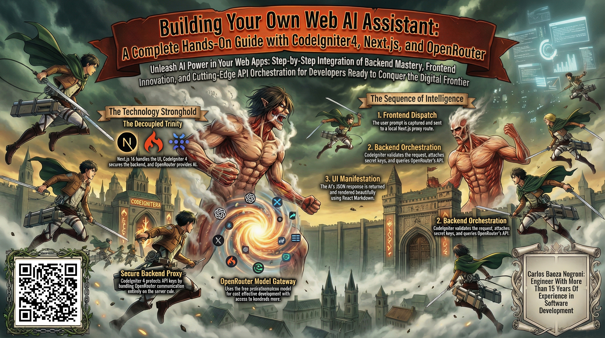

# Building Your Own Web AI Assistant: A Complete Hands-On Guide with CodeIgniter4, Next.js, and OpenRouter

This folder contains a comprehensive guide to building a fully functional AI-powered chat assistant from scratch. The project combines the robust backend capabilities of CodeIgniter 4 with the cutting-edge frontend features of Next.js 16, all connected to OpenRouter's powerful AI API infrastructure. You'll learn how to build a complete working AI chat application with a clean, modern chat interface, secure server-side communication, and enterprise-grade architecture designed to be easily deployable, maintainable, and extensible.

Feel free to check out the full content in five ways:

1. 📢 **LinkedIn announcement**: https://www.linkedin.com/posts/carlos-baeza-negroni_technology-tech-innovation-activity-7433183610213560320-8oQI
2. 📖 **Read the article directly on LinkedIn**: https://www.linkedin.com/pulse/building-your-own-web-ai-assistant-complete-hands-on-baeza-negroni-bcp4f
3. 🐦 **X/Twitter Announcement**: https://x.com/cjbaezilla/status/2027435454895710330
4. 🧩 **Project Repository**: https://github.com/cjbaezilla/Building-Your-First-Web-AI-Assistant-Hands-On-Tutorial
5. 🔍 **Browse the source**:
   [article.md](./article.md)
