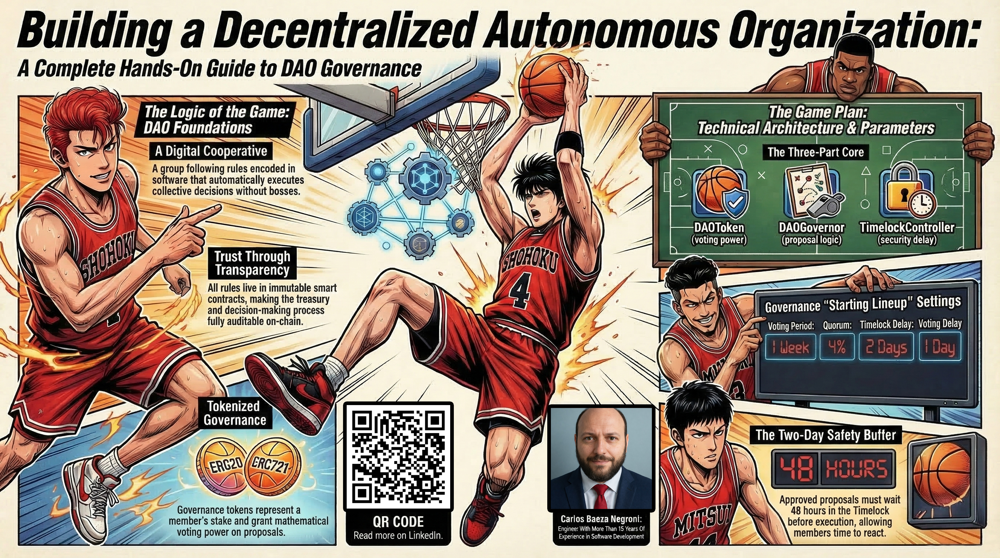
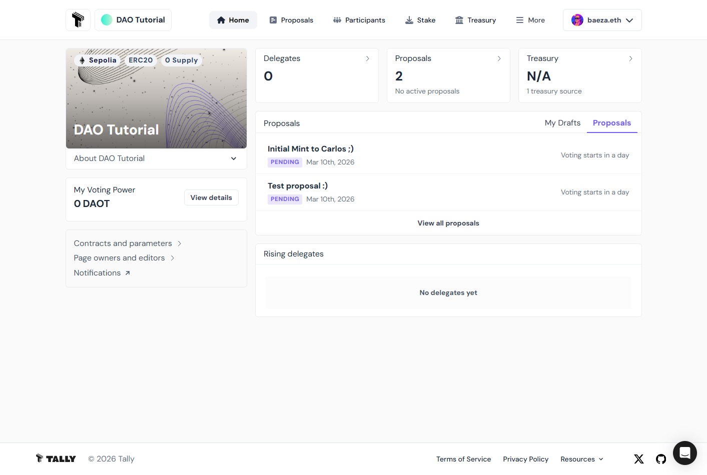

# Building a Decentralized Autonomous Organization: A Complete Hands-On Guide to DAO Governance

This folder contains a comprehensive guide to building a fully functional decentralized autonomous organization (DAO) governance system from scratch. The project combines OpenZeppelin's battle-tested smart contract library with Tally's user-friendly governance interface, providing a complete working DAO implementation. You'll learn how to build a complete, secure, and transparent governance system with token-based voting, proposal management, and automated execution through smart contracts, all designed to be easily deployable, maintainable, and extensible.

Feel free to check out the full content in five ways:

1. 📢 **LinkedIn announcement**: 
2. 📖 **Read the article directly on LinkedIn**: 
3. 🐦 **X/Twitter Announcement**: 
4. 🧩 **Project Repository**: https://github.com/cjbaezilla/Your-First-DAO-Solidity-Token-OpenZeppelin-Tally-Tutorial
5. 🔍 **Browse the source**:
   [article.md](./article.md)
