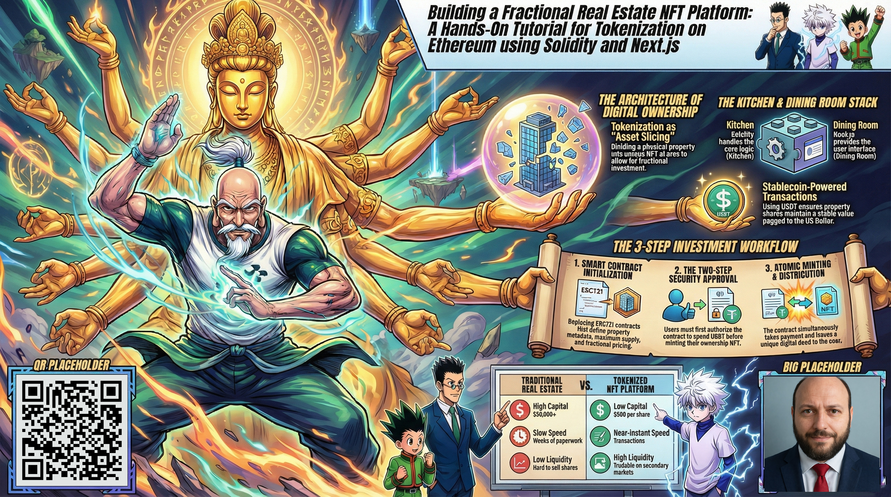
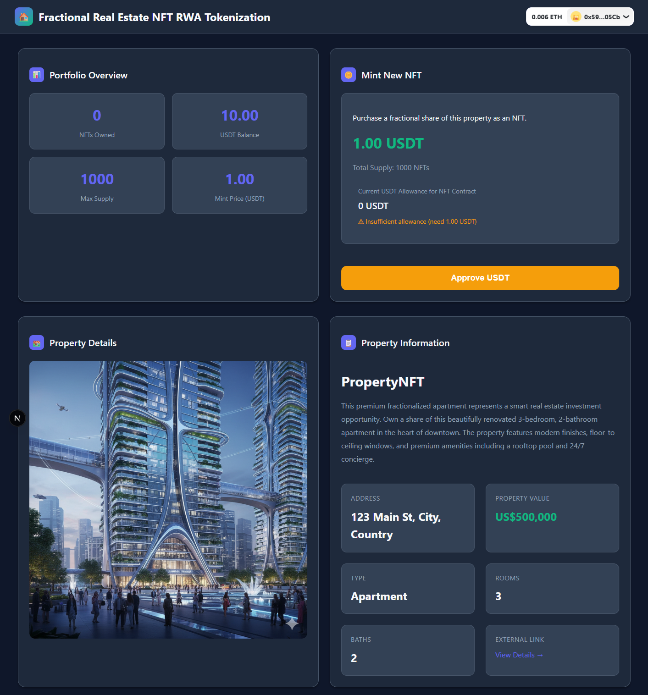

# Building a Fractional Real Estate NFT Platform: A Hands-On Tutorial for Tokenization on Ethereum using Solidity and Next.js

This folder contains a complete, production-ready fractional real estate NFT platform that demonstrates practical tokenization of physical property on Ethereum. The tutorial provides a full-stack implementation combining Solidity smart contracts with Next.js, featuring an ERC721-based fractional ownership system where users purchase property shares using USDT stablecoin. The project includes comprehensive testing with 35 test cases covering all contract functions, detailed code explanations of inheritance patterns, access control, and payment processing workflows. The smart contract implements property metadata management, tokenURI generation with NFT marketplace compatibility, and secure USDT payment handling. The frontend dashboard built with Next.js, Wagmi, and RainbowKit provides wallet connection, real-time balance displays, approval flows, and transaction tracking. Perfect for developers wanting hands-on experience with real-world asset tokenization, covering the complete workflow from smart contract development and testing to frontend integration and deployment.

Feel free to check out the full content in five ways:

1. 📢 **LinkedIn announcement**: https://www.linkedin.com/posts/carlos-baeza-negroni_realestatetokenization-blockchain-solidity-activity-7442228854833741825-Z5T9
2. 📖 **Read the article directly on LinkedIn**: https://www.linkedin.com/pulse/building-fractional-real-estate-nft-platform-hands-on-baeza-negroni-9xrje
3. 🐦 **X/Twitter Announcement**: https://x.com/cjbaezilla/status/2036468867954847827
4. 🧩 **Project Repository**: https://github.com/cjbaezilla/Tokenize-Fractional-Real-Estate-NFT-Solidity-HandsOn-Tutorial
5. 🔍 **Browse the source**:
   [article.md](./article.md)

