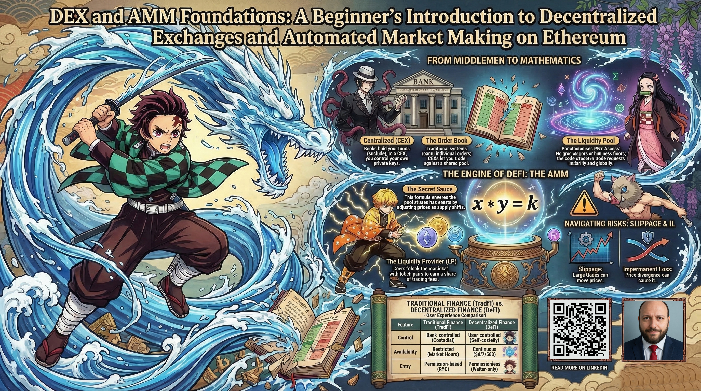
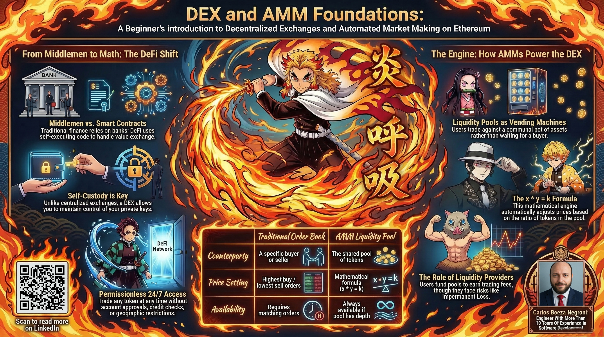
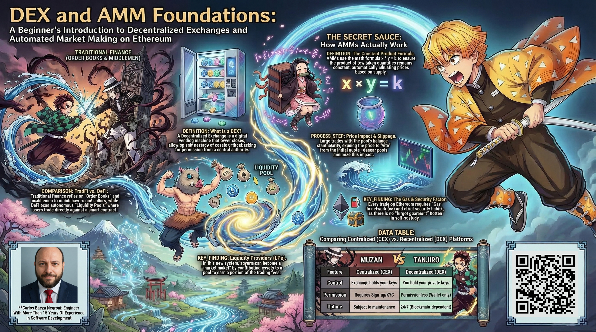
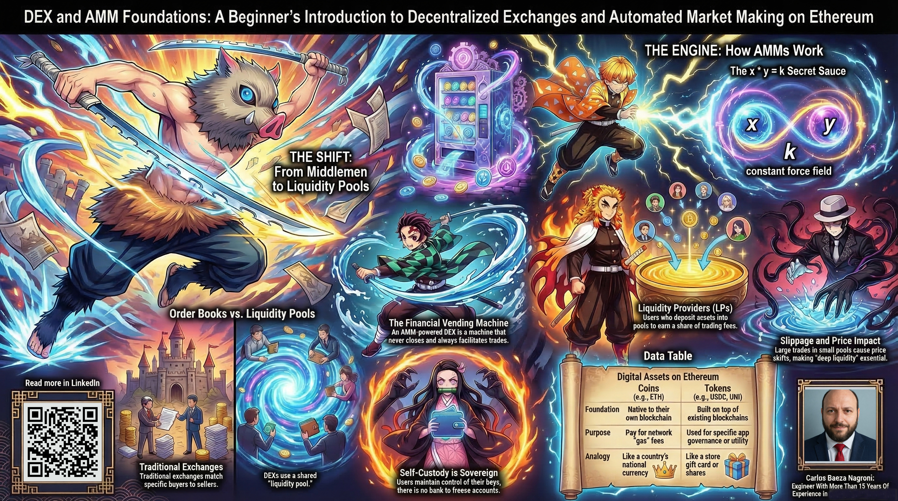
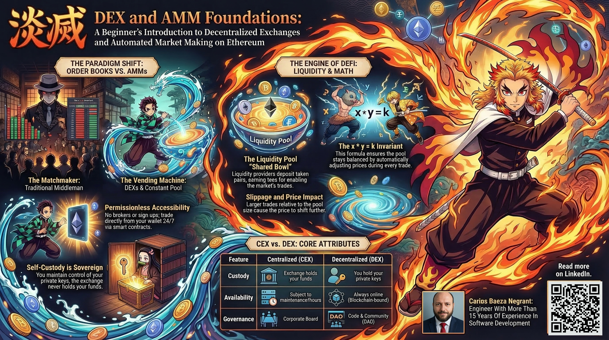
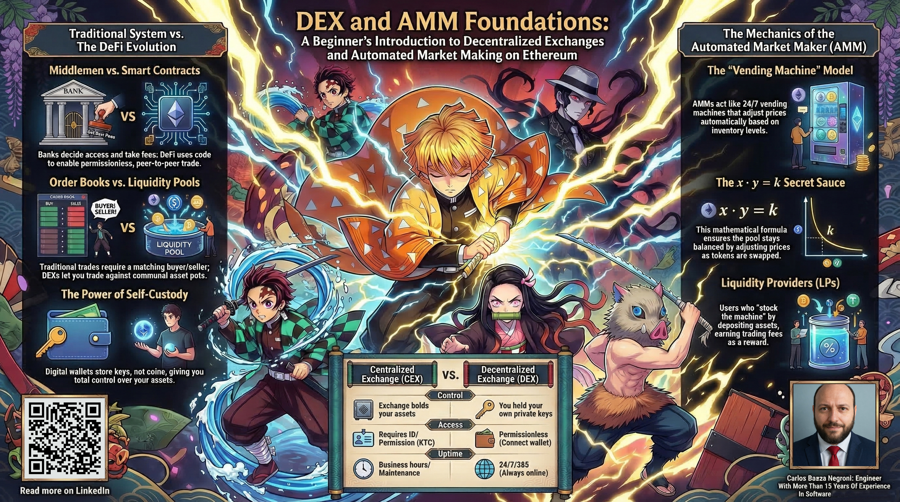
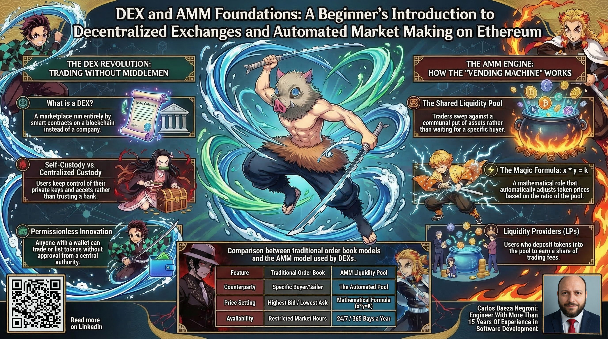

# DEX and AMM Foundations: A Beginner's Introduction to Decentralized Exchanges and Automated Market Making on Ethereum

Have you ever stood in line at the bank to send money to a family member in another country, only to be told it will take days and cost a small fortune? Or perhaps you've watched as your paycheck sits in a savings account earning practically nothing, while banks lend that same money to others at much higher interest rates? These everyday frustrations reveal a fundamental truth about our current financial system: it's built on middlemen. Banks, brokers, payment processors, and clearinghouses all take a cut, adding fees, slowing things down, and deciding who gets access and who doesn't. What if there were a way to trade value directly between people, without asking permission, without waiting for business hours, and without all those fees eating into your money? That's not science fiction. It's already happening, and it's called decentralized finance, or DeFi for short. In this guide, we're going to explore the beating heart of this new world: decentralized exchanges and their revolutionary pricing engine, the automated market maker.

Before we go any further, let me assure you of something crucial: this guide is written for absolutely everyone. Whether you've never opened a stock account or you've been investing for decades, whether you're comfortable with technology or get nervous just opening your email, you can understand this. We're going to start from zero, like explaining how a light switch works before building a house. No technical background required. No prior knowledge of cryptocurrency assumed. We'll use ordinary language, everyday analogies, and step-by-step explanations that build on themselves. By the time we're done, you'll not only understand what these terms mean. You'll see why they matter and how they could change the way we think about money itself.

The reason this matters right now, today, is that we're standing at a historical turning point in how humans exchange value. For most of history, trade required either bartering (you have what I need, I have what you need) or using some form of money as an intermediary. For the past century, that intermediary has been banks and financial institutions (trusted third parties who hold our money, move it around, and charge fees for their services). But those trusted third parties come with problems: they can fail (as we saw in 2008), they can exclude people (billions worldwide lack bank accounts), they can freeze accounts, and they operate within restricted hours. Now, for the first time in human history, we have the technology to enable true peer-to-peer value exchange, 24 hours a day, 365 days a year, without anyone in the middle taking a slice. That's what DeFi is building, and DEXs with AMMs are one of the most important innovations making it possible.

Think about a traditional stock exchange like the New York Stock Exchange. To trade stocks, you need a broker, an account, permission, and you're restricted to market hours. Buyers and sellers are matched through an order book system: sellers list the prices they want, buyers list what they're willing to pay, and the exchange matches them when prices align. This works, but it requires multiple parties to be present simultaneously. What if, instead, you could walk up to a machine at any time, day or night, put in $100 of one thing, and get back a different amount of something else automatically? That's essentially what an AMM-powered DEX does. It's like a financial vending machine that never closes, never needs a break, and always has something to trade. You don't need to wait for someone else to want to buy what you're selling. The machine itself is always ready to take one token and give you another, at a price that adjusts automatically based on what's inside. That's the magic we're going to unpack together.

To truly appreciate how revolutionary this is, imagine a farmer's market. In a traditional market setup, you set up your stall with your apples and wait for customers who want apples to show up. If there are more sellers than buyers, you might lower your price to attract them. If there are more buyers than sellers, you can raise your price. The price emerges from the interaction of individual buyers and sellers negotiating in real time. This is like the order book model: you have a list of buyers and sellers, and trades happen when their prices match. Now imagine a different kind of farmer's market: instead of individual stalls, there's one giant shared bowl of fruit. Each farmer contributes some apples and some oranges to this bowl. The bowl automatically maintains a ratio between apples and oranges based on how much of each has been contributed. When someone wants to trade, they simply put some apples in and take oranges out (or vice versa). The more apples they put in relative to what's already there, the more expensive apples become and the cheaper oranges become, because the bowl's internal balance shifts. This shared bowl is the liquidity pool (a communal pot of assets that anyone can trade against anytime). The farmers who contribute to the bowl are called liquidity providers, and they earn fees from trades as compensation for making the bowl possible. This is the core insight of the AMM: instead of waiting for a buyer to match your seller, you trade directly with a pool of assets that always has a price determined by a simple mathematical formula.

That formula, known as x*y=k, is the secret sauce. Don't worry if math isn't your thing; we'll explain it in plain language with concrete examples. In essence, it says that the product of the quantities of two tokens in a pool remains constant (k) during trades, which automatically determines the price. When you put some of token X into the pool, you have to take some of token Y out, and the amounts are calculated so that the product stays the same. It's like a see-saw: when one side goes down, the other side goes up. The pool itself enforces this balance through code. No human sets the price. No one decides if your trade is acceptable. The code just runs, adjusting automatically based on supply within the pool. It's elegant, deterministic, and works 24/7.

In this guide, we'll demystify all of this. We'll start with the absolute foundations everyone needs: what money really is, how blockchains work, what cryptocurrency is, how Ethereum enables smart contracts, what wallets actually do (spoiler: they don't store your money, they store the keys to control it), and what stablecoins are and why they're so important for trading. We'll understand what DeFi means in practical terms and how you can actually acquire cryptocurrency and put it in your own wallet. We'll walk through using Uniswap step by step, explaining gas fees along the way, and we'll cover crucial security practices and risks so you don't fall victim to scams or irreversible mistakes. This first part, the foundations, might feel like we're taking the scenic route, but it's essential. You wouldn't try to drive a car without understanding what the steering wheel does, and you shouldn't trade on a DEX without understanding these basics.

Then, in Part 2, we'll dive deep into the mechanics of DEXs and AMMs themselves. We'll compare the order book model (used by traditional exchanges) with the AMM model, and you'll see why each has its place. We'll explain liquidity pools in detail: what they are, how they're created, who provides liquidity and why they'd do it, and how liquidity providers earn trading fees. We'll explore the x*y=k formula through multiple concrete examples, with numbers you can verify yourself. We'll examine slippage (why your trade might not get exactly the price you saw initially) and price impact (how your trade affects the pool's balance and thus the price you receive). And we'll tackle the crucial concept of impermanent loss (the mathematical phenomenon that means liquidity providers can sometimes lose value compared to simply holding their tokens if prices diverge). All of this will be explained in plain language with analogies and visual comparisons that make abstract concepts tangible.

The world of DeFi moves fast, and it can feel overwhelming with all the jargon: liquidity, yield farming, impermanent loss, gas wars, slippage tolerance. But strip away the fancy terms and you're left with simple human activities: people pooling resources together, trading value, earning fees for providing a service, and managing risk. That's what we're exploring. And while the technology behind it is sophisticated, the underlying principles don't have to be complicated. We'll help you see the forest through the trees.

Here's what you'll learn in Part 1: the nature of money and how cryptocurrency builds on that foundation; what blockchains are and why they matter; the difference between coins and tokens; how Ethereum enables smart contracts; how crypto wallets work and the critical concept of self-custody; what stablecoins are and why they're essential for trading; what DeFi encompasses; how to actually buy cryptocurrency and set up a wallet; a complete walkthrough of using Uniswap; how gas fees work and why they vary; essential security practices to protect your funds; the main risks you need to understand (smart contract bugs, volatility, no customer support, regulatory uncertainty); and basic tax implications. By the end of Part 1, you'll have both the conceptual understanding and the practical know-how to safely interact with decentralized exchanges.

Then Part 2 will unpack the specific innovations of DEXs and AMMs: the difference between DEXs and centralized exchanges; the distinction between order books and AMMs; the mathematics and mechanics of liquidity pools; how trading actually happens step by step; what liquidity providers do and how they earn; a deep dive into the x*y=k invariant; how to calculate price impact and slippage; understanding impermanent loss with clear examples; how fees work in Uniswap; and the key philosophical and practical differences between this new system and traditional finance. You'll come away with a solid mental model of how these systems function at their core.

I want to address something you might be feeling right now: maybe a sense of intimidation, or the thought that this is all too technical for you to grasp. I get it. Crypto headlines are full of jargon and hype and sometimes scams. But the concepts themselves aren't complicated; they're just new, and they're often explained poorly. We're going to change that. You don't need to know how to code. You don't need a finance degree. You just need curiosity and patience. We'll take this step at a time, building your understanding brick by brick. If something doesn't make sense at first, that's okay; we'll circle back. There's no quiz, no rush. You can read at your own pace, and you can always re-read sections. This isn't about making you an expert overnight; it's about giving you a solid foundation you can trust.

One more thing before we begin. This guide will not promise you fortunes or try to sell you on any particular cryptocurrency. It's an educational tool, not investment advice. The DeFi space is still young and carries real risks: smart contract bugs, market volatility, regulatory uncertainty, and irrecoverable human error. You should never put in more than you can afford to lose. But if you approach it with clear eyes, solid security habits, and a learning mindset, you can participate safely and understand what's happening. Knowledge is your best protection. So take a deep breath, set aside any intimidation, and let's start at the very beginning, with the oldest question of all: what is money, really? You've got this.

## Part 1: Foundations: Everything You Need Before Understanding DEXs

## What is Money, Really? Setting the Stage

Before we dive into digital currencies and blockchain technology, let's take a step back and ask a surprisingly deep question: what is money, really? Most of us think of money as the paper bills in our wallets or the numbers in our bank accounts. But those are just physical or digital representations. The true essence of money is much simpler and more profound: money is a shared agreement. It's a collective belief that something has value and can be exchanged for other things we want or need.

Imagine a world thousands of years ago, before money existed. If you were a farmer with extra wheat and you needed shoes, you'd have to find a cobbler who wanted wheat and was willing to trade. This is called barter, and it worked, but it had a big problem: you needed what's called a "double coincidence of wants." You had to find someone who both had what you wanted and wanted what you had. This was inefficient and limited trade to small communities.

The first solution was to use something universally desirable as an intermediary. In many places, that was gold. Gold was valuable because it was rare, durable, and people agreed it was worth something. You could trade your wheat for gold, then trade that gold for shoes. The gold itself wasn't inherently useful for eating or wearing, but its universal acceptance made it valuable. This was the first form of money: a shared story about value.

Later, societies realized that carrying around heavy gold was inconvenient. So they created paper certificates that represented gold stored in a vault. The paper itself was worthless, but everyone trusted that they could exchange it for real gold. Eventually, most countries abandoned the gold standard, and today the paper bills we use aren't backed by anything physical. Their value comes entirely from our collective belief and the government's declaration that they are legal tender. That's a powerful idea: money is a social construct, a story we all agree to believe.

Now we're in the digital age. Most of our money today isn't even paper; it's numbers in a bank's computer. When you check your account balance online, you're seeing a database entry. You can't touch that money. You can't see it. You're trusting that the bank's database is accurate and that the bank will honor it when you want to withdraw cash or send money to someone. This brings us to the next step in money's evolution: digital currency that doesn't require a bank as an intermediary.

## What is Cryptocurrency?

Cryptocurrency is essentially digital money that lives on a computer network instead of in a bank's database. The "crypto" part refers to the cryptography (advanced math) that keeps it secure, and the "currency" part means it can be used to buy and sell things, just like dollars or euros. But unlike the money in your bank account, cryptocurrency doesn't need a bank or any company to manage it. Instead, it's maintained by a network of computers spread all over the world.

To understand why cryptocurrency was invented, we need to briefly touch on the 2008 financial crisis. Many people lost trust in traditional banks and financial institutions. Banks had made risky loans, people's savings vanished, and governments had to bail out these huge companies with taxpayer money. A mysterious person (or group) named Satoshi Nakamoto published a paper called "Bitcoin: A Peer-to-Peer Electronic Cash System." The idea was to create money that couldn't be controlled by any government or bank, that could be sent directly from one person to another without going through a financial middleman, and that would operate on transparent rules everyone could verify.

Bitcoin was the first cryptocurrency. In 2009, the first bitcoins were created and the network started running. Since then, thousands of other cryptocurrencies have been created. But not all cryptocurrencies are the same. There are two main types you'll hear about: coins and tokens.

Coins like Bitcoin (BTC) and Ethereum (ETH) have their own independent blockchains. Think of a blockchain as a separate network, like different highway systems. Bitcoin runs on the Bitcoin blockchain, and Ethereum runs on the Ethereum blockchain. These coins are the native currency of their respective networks; they're used to pay for transactions and secure the network.

Tokens, on the other hand, are created on top of existing blockchains. USDC, UNI, and many others are tokens that run on the Ethereum blockchain. They use the same underlying infrastructure but have their own rules and purposes. Imagine tokens as businesses that rent space in a huge shopping mall (the blockchain). They don't own the mall; they operate within it, following the mall's rules.

Here's a simple comparison to make this distinction crystal clear:

| Feature | Coins | Tokens |
|---------|-------|--------|
| **What they are** | The native currency of their own blockchain network | Applications built on top of an existing blockchain |
| **Examples** | Bitcoin (BTC), Ethereum (ETH), Solana (SOL) | USDC, UNI, DAI, many others |
| **How they're made** | Created through the blockchain's consensus process (mining/staking) and sometimes sold in initial offerings | Created by developers using smart contract standards (like ERC-20 on Ethereum) |
| **What they pay for** | Used to pay network transaction fees and secure the blockchain | Used for specific purposes within their application (governance, utility, representing real-world assets) |
| **Analogy** | Like the national currency of a country | Like store gift cards or company shares that operate within that country |

You might wonder: why does cryptocurrency have any value at all? After all, it's just computer code. The value comes from several things working together. First, scarcity: most cryptocurrencies have a limited supply. Bitcoin, for example, will only ever have 21 million coins. This built-in scarcity is similar to gold. Second, utility: cryptocurrencies can be used for things (sending money across borders quickly, accessing financial services without a bank, participating in new forms of organizations). Third, network effects: the more people who use and believe in a cryptocurrency, the more valuable it becomes, much like social media platforms. It's a combination of practical usefulness and collective belief.

## What is a Blockchain?

Imagine a village where everyone keeps a notebook. Every time someone buys or sells something, they stand in the town square and announce the transaction to everyone. Everyone listening writes it down in their own notebook. At the end of the day, they all compare notes to make sure everyone recorded the same information. If someone tries to cheat by writing down a fake transaction, the others will have the correct version and will reject it. This village has no central record-keeper; everyone collectively maintains the record. This is the essence of a blockchain.

A blockchain is exactly that: a decentralized public ledger. Instead of a single company (like a bank) keeping a private database, the ledger is copied and distributed across thousands of computers worldwide. Each computer has a complete copy of the entire history. When a new transaction happens, it's broadcast to the network, and the computers work together to validate it and add it to the chain.

The "block" part refers to the fact that transactions are grouped into blocks (like pages in a ledger). Every few minutes (depending on the blockchain), a new block is created containing the recent transactions. The "chain" part means each block contains a unique fingerprint (called a hash) of the previous block, linking them together. If someone tried to alter an old transaction, they'd have to change that block's fingerprint, which would break the link to the next block, and they'd have to change every single block afterward. Plus, they'd have to control more than half of all the computers on the network to convince everyone to accept their fake version. That's virtually impossible in a large network.

The computers that maintain the blockchain are called nodes. Some are run by volunteers, some by organizations, some by miners or validators who get rewarded for their work. In Bitcoin, miners use powerful computers to solve complex puzzles; the first to solve it gets to add the next block and receives new bitcoins plus transaction fees. In Ethereum and other newer blockchains, validators stake their own coins as collateral and are chosen to propose blocks based on how much they stake. If they try to cheat, they lose their stake. This system is called consensus (everyone agrees on what the true state of the ledger is without needing a central authority).

Why does this matter? Because it means no single entity controls the ledger. A government can't just erase your balance. A bank can't freeze your account because it disagrees with your politics. The rules are encoded in the software and enforced by the network. This creates a form of money that is censorship-resistant, transparent (anyone can view the entire history), and secure against tampering. Of course, this also means there's no buyer protection or customer service (if you send cryptocurrency to the wrong address, there's no one to reverse it). But for many people, the trade-off is worth it for the freedom and control.

## What is Ethereum?

When Bitcoin was created, it was designed primarily as a digital currency (a way to send value from one person to another without a bank). The Bitcoin blockchain is excellent at tracking who owns how many bitcoins. But it's not designed to do much else. It's like a ledger that only knows about one thing: bitcoin transactions.

Ethereum, created in 2015 by Vitalik Buterin and others, took the blockchain concept and added a revolutionary twist: it's a programmable blockchain. Instead of just tracking currency transfers, Ethereum can run applications. Think of it this way: if Bitcoin is a basic calculator that only does addition, Ethereum is a full-fledged computer that can run any program you write, as long as it follows the network's rules.

On Ethereum, developers can write smart contracts (which we'll explore in the next section). A smart contract is a piece of code that lives on the blockchain and automatically executes when certain conditions are met. These contracts can create all sorts of applications: digital identities, supply chain trackers, games, and most importantly for our purposes, decentralized finance applications like Uniswap.

Ether (ETH) is the native cryptocurrency of the Ethereum network. Its primary purpose is to pay for computation. Every operation on Ethereum (sending ETH, calling a smart contract, storing data) costs a small amount of ETH as a fee. This fee goes to the validators who maintain the network. You can think of ETH as the fuel that powers the Ethereum world computer. Without ETH, you can't interact with anything on Ethereum.

Ethereum matters for DEXs because it provides the platform where they can exist as smart contracts. Uniswap isn't a company with servers; it's a collection of smart contracts deployed on the Ethereum blockchain. Anyone can use these contracts as long as they have an Ethereum wallet and pay the network fees in ETH. This makes Uniswap globally accessible, always online, and resistant to shutdowns. Ethereum also has a huge ecosystem of tokens (ERC-20 tokens) that can be traded on these DEXs, creating an entire financial universe built on open code.

Ethereum has faced challenges: when lots of people use it, fees can become very expensive because demand for computation exceeds supply. This has led to the development of Layer 2 solutions (which we'll discuss later) that are like side roads built on top of the Ethereum main highway, allowing cheaper and faster transactions while still benefiting from Ethereum's security.

## What is a Smart Contract?

A smart contract is a digital agreement that enforces itself automatically through code, without needing lawyers, judges, or any human intervention once it's set up. The term "smart contract" was coined in the 1990s, but Ethereum made them practical and widely usable. Let's make this concrete with an analogy.

Imagine you're renting an apartment. You and the landlord could write a traditional contract: you'll pay $1,000 on the first of each month, and in return you get the keys. If you don't pay, the landlord might have to go to court to evict you. That process costs time and money.

Now imagine a digital version: a smart contract that holds the apartment's digital lock. It's programmed to automatically send you the digital key on the first of each month if it receives $1,000 from your digital wallet. If the payment doesn't arrive by the deadline, it automatically revokes your access and returns the $1,000 you might have paid as a deposit. The whole process runs on its own, without either of you having to trust the other or rely on external enforcement. The code is the law.

A more everyday analogy is a vending machine. You insert money, press a button, and the machine automatically gives you a snack. There's no cashier. The machine's mechanisms are the "contract": if you insert enough money, you get a snack; if not, you get nothing or your money back. The machine executes its programmed logic without personal judgment.

Smart contracts on blockchains work the same way, but they're much more flexible. They can hold and transfer assets, execute complex logic, and interact with other smart contracts. When you use Uniswap, you're not dealing with a person who decides whether to accept your trade. You're interacting with a smart contract that has been programmed to accept any trade that meets its mathematical conditions. It doesn't care who you are, where you're from, or what your motivation is. It just runs the code.

The trustlessness of smart contracts is their magic. In traditional agreements, you have to trust that the other party will honor their word and that the courts will enforce it if they don't. With smart contracts, you only need to trust that the code is correct and that the underlying blockchain remains secure. The contract's execution is guaranteed by mathematics and distributed consensus.

However, there are important caveats. Smart contracts are only as good as the code written by humans. Bugs or vulnerabilities can be exploited, leading to loss of funds. That's why reputable contracts undergo multiple security audits by independent firms. Also, "code is law" can be harsh: if you send your cryptocurrency to a smart contract by mistake, there's no undo button. The contract does exactly what it was programmed to do, period.

**Real-World Example: DeFi Lending Without a Bank**

Let's make this concrete with a real DeFi scenario. Imagine you own $5,000 worth of ETH but you need $2,000 in cash for an emergency. You don't want to sell your ETH because you believe its price will go up. In traditional finance, you'd go to a bank, apply for a loan, fill out paperwork, and wait for approval (if you even qualify). With a smart contract-based lending protocol like Aave or Compound, you can do this in minutes: you deposit your $5,000 ETH as collateral into the smart contract. The contract automatically calculates that, given its collateral requirements, you can borrow up to $3,000 worth of stablecoins. You borrow $2,000 USDC. You now have cash, your ETH is still locked but belongs to you, and you'll pay interest on the loan. If the value of your ETH drops below a certain threshold, the smart contract will automatically sell some of your collateral to repay the loan, protecting the lender. No paperwork, no waiting, no one to ask permission from. The entire借贷过程 is handled by code that executes exactly as programmed.

## What is a Wallet?

This is one of the most crucial concepts to understand correctly. A crypto wallet is not like the physical wallet in your pocket that holds cash and cards. A crypto wallet does not actually store your cryptocurrency at all. Instead, it stores the keys that prove you own the cryptocurrency. The coins themselves live on the blockchain, which is that global public ledger we talked about. Think of the blockchain as a giant spreadsheet that tracks who owns what. Your wallet is like the password and username that give you access to your entry on that spreadsheet.

The most common type of wallet for beginners is a software wallet like MetaMask, which you install as a browser extension or phone app. When you set up MetaMask for the first time, it generates a secret phrase of 12 or 24 words. This is called a seed phrase or recovery phrase. This phrase is the master key to your wallet. Anyone who has it can access all the assets in that wallet. You must write it down on paper and store it somewhere extremely safe. Never save it on your computer or phone, because if your device gets hacked, the thief could steal your phrase. If you lose your seed phrase, you lose access to your wallet forever; there's no "forgot password" option.

The wallet also gives you a public address. This is like your bank account number (you can share it freely and people can send you cryptocurrency). But it's not actually your account; it's just a pointer to your entry on the blockchain. The blockchain shows all the transactions associated with that address. When someone sends crypto to your address, it's recorded on the blockchain as a transfer to that address, and your wallet's keys give you the ability to control those funds.

The wallet software holds your private key. The private key is a long string of characters (like a very long password) that mathematically proves you own the public address. When you want to send cryptocurrency, your wallet uses your private key to digitally sign the transaction, proving to the network that you have the authority to move those funds. The network verifies the signature and then updates the blockchain's ledger.

This leads to the concept of self-custody. Unlike keeping money in a bank where the bank holds the money and you rely on them to give it back, with a crypto wallet you hold the keys directly. You are your own bank. This gives you complete control and freedom, but it also comes with great responsibility. There are no customer service reps to help you if you make a mistake. If you send funds to the wrong address, they're gone. If a phishing site tricks you into signing a malicious transaction, your wallet can be emptied. If you lose your seed phrase, your money is unrecoverable.

For large amounts, many people use hardware wallets (physical devices like Ledger or Trezor that keep your private key offline, adding an extra layer of security against hackers). But software wallets like MetaMask are fine for getting started, as long as you understand the risks and start with small amounts.

Here's a clear comparison of the two main wallet types to help you understand the trade-offs:

| Aspect | Software Wallet (e.g., MetaMask) | Hardware Wallet (e.g., Ledger, Trezor) |
|--------|-----------------------------------|----------------------------------------|
| **What it is** | An app or browser extension installed on your computer/phone | A physical device (like a USB drive) that stores keys offline |
| **Security level** | Good for small amounts, but connected to internet so vulnerable to malware/phishing | Very high (keys never touch the internet, transactions signed on device) |
| **Ease of use** | Very easy, just install and create | Requires setup, need to connect device for transactions |
| **Cost** | Free | Typically $60-$200 purchase cost |
| **Best for** | Daily use, small amounts, beginners starting out | Large holdings, long-term storage, maximum security |
| **Risk if computer is hacked** | Keys could be stolen if not careful | Keys remain safe on device, hackers can't access them |

Most people start with a software wallet to learn the ropes, then add a hardware wallet once they have more significant assets. You can use both: a hardware wallet can connect to MetaMask, giving you the convenience of MetaMask's interface with the security of hardware signing.

## What are Stablecoins?

Imagine you're at a casino. The chips you use to play blackjack or roulette aren't worth anything outside the casino, but inside, each chip represents one dollar. You can trade your cash for chips, play your games, and then cash out your chips for dollars again. The value stays pegged to the dollar while you're inside. Stablecoins are like that (they're cryptocurrencies designed to maintain a stable value, usually pegged 1:1 to the US dollar).

Why do we need stablecoins? Because most cryptocurrencies like Bitcoin and Ethereum are extremely volatile. Their prices can swing 10% or more in a single day. This volatility is great for speculation and investment, but it's terrible for everyday transactions and for services that need predictable pricing. If you're trying to buy a coffee with Bitcoin, the price might change between when you order and when you pay. If you're a business accepting crypto payments, you don't want your revenue fluctuating wildly. Stablecoins solve this by providing a digital dollar that lives on the blockchain.

There are different types of stablecoins. The most common are fiat-collateralized stablecoins like USDC and USDT. These are issued by companies that hold real US dollars in bank accounts. For every USDC token created, the company Circle holds one actual dollar in reserve. You can trade your dollars for USDC tokens, and you can redeem USDC tokens for dollars. This backing ensures that each USDC is worth exactly one dollar. It's a centralized arrangement, but it's been widely adopted because it's simple and reliable.

Other stablecoins use cryptocurrency collateral (like DAI, which is backed by other crypto assets locked in smart contracts) or algorithmic mechanisms that adjust supply to maintain the peg. Algorithmic stablecoins have faced challenges maintaining their peg during market stress.

Here's a breakdown of the main types you'll encounter:

| Type | How it works | Examples | Pros | Cons |
|------|--------------|----------|------|------|
| **Fiat-collateralized** | Company holds real dollars in reserve; 1 token = 1 dollar | USDC, USDT | Simple, easy to understand, stable historically | Centralized, you must trust the issuer actually has the reserves |
| **Crypto-collateralized** | Users lock up other crypto as collateral; algorithm mints stablecoins against that value | DAI | Decentralized, transparent on-chain | Requires over-collateralization (e.g., lock $150 worth of ETH to get $100 DAI), can be liquidated if collateral value drops |
| **Algorithmic** | Code automatically adjusts supply based on demand to maintain peg | (Terra/Luna was this type, but failed) | No collateral needed, theoretically capital efficient | Historically unstable, can break peg during market stress, complex risk |

Stablecoins are absolutely critical for DEX trading. Why? Because most trading pairs on Uniswap involve a stablecoin like USDC or USDT paired with a volatile token like ETH. This allows you to trade your volatile token for a stable dollar value without having to cash out to a bank. You can move between volatile assets and stable assets seamlessly, 24/7, without leaving the crypto ecosystem. It also provides a stable unit of account for pricing (everything is quoted in terms of USDC or USDT, just like in traditional finance most prices are in dollars).

**Use Case: Sending Money to Family Abroad**

Maria works in the United States and wants to send $500 to her family in the Philippines. Traditional money transfer services like Western Union might charge 5-10% in fees (that's $25-$50) and take 2-3 days to deliver. Instead, Maria uses a centralized exchange to buy $500 worth of USDC, paying a 1% fee ($5) and a $5 withdrawal fee. She now has $495 in USDC in her MetaMask wallet.

She then sends the USDC directly to her family's wallet address. The transaction takes about 15 seconds on the Ethereum network and costs $3 in gas (during a low-traffic period). Her family receives $492 worth of USDC. Total cost: $5 (exchange fee) + $5 (withdrawal) + $3 (gas) = $13, or about 2.6% total. That's much better than 5-10%.

Her family, who has a crypto wallet, can then either hold the USDC (stable dollar value) or exchange it instantly for Philippine pesos on a local crypto exchange. The whole process is fast (minutes instead of days), cheap, and doesn't require either party to have a bank account. Stablecoins make cross-border remittances practical and affordable for everyday people. The key insight: even with all the fees, crypto is often cheaper and faster than traditional remittance services, especially for people who can't easily access banks.

**What Happens If the Pool Runs Out of Liquidity? (A Cautionary Tale)**

Let's say Carlos wants to sell 50,000 of Token Y on a Uniswap pool. He checks the pool and sees it holds 500,000 Token Y and 50,000 USDC (so price is 0.10 USDC per Token Y). His 50,000 Token Y is 10% of the pool's Token Y reserves. He initiates the trade with 1% slippage tolerance.

The calculation:
- Starting pool: x = 50,000 USDC, y = 500,000 Token Y, k = 25,000,000,000
- He sends 50,000 Token Y, with 0.3% fee → effective = 49,850 Token Y added to pool
- New Token Y: 500,000 + 49,850 = 549,850 Token Y
- New USDC: k ÷ 549,850 ≈ 45,461 USDC
- He would receive: 50,000 - 45,461 = 4,539 USDC
- Average price: 4,539 USDC ÷ 50,000 Token Y = 0.09078 USDC per Token Y
- That's a 9.2% price drop from 0.10, way above his 1% tolerance!

The transaction fails. Carlos tried to sell too much relative to the pool's depth. In fact, if he had tried to sell the full 50,000 without slippage protection, he would have received only 4,539 USDC, a terrible price. Pools can be depleted: if someone tried to sell all 500,000 Token Y, the price would go to near zero. But the AMM prevents that by making the price approach zero only at extreme withdrawals. The slippage becomes infinite as you drain the pool. That's why deep liquidity is essential for large trades.

## What is DeFi (Decentralized Finance)?

DeFi stands for Decentralized Finance. It's an umbrella term for financial services (lending, borrowing, trading, earning interest, buying insurance) that are built on blockchain technology and run by smart contracts instead of traditional institutions like banks, brokerages, or insurance companies. Think of it as a new financial system that operates parallel to the old one, but with different rules and no gatekeepers.

To understand DeFi, contrast it with traditional finance. To get a loan today, you go to a bank. You fill out applications, provide proof of income, let them check your credit score, and wait for approval. The bank decides if you qualify and what interest rate you get. If you want to earn interest on your savings, you put money in a savings account and the bank pays you a tiny fraction of what they charge borrowers. The bank takes the spread. All this requires trusting the bank to be honest, to manage risk well, and to give you access to your money when you need it.

DeFi replaces these human-run institutions with smart contracts. There are lending protocols where you can deposit your cryptocurrency as collateral and borrow other assets algorithmically. No credit checks, no applications, just code. The interest rates are set by supply and demand within the protocol. If you want to earn interest, you can provide your crypto to the lending pool and earn a share of the interest paid by borrowers. There are yield farming platforms that automatically move your funds between different DeFi protocols to maximize returns. There are decentralized insurance protocols that let you buy coverage against smart contract failures.

DEXs like Uniswap are a core part of DeFi (they handle the trading piece). But DeFi also includes stablecoins, lending/borrowing platforms like Aave and Compound, derivatives platforms, prediction markets, and more. All these pieces are composable, meaning they can be combined. You could take a loan from one protocol, trade the borrowed assets on a DEX, then deposit into a yield farm (all in a single transaction that executes automatically).

The promise of DeFi is open access: anyone with an internet connection and a crypto wallet can use these services, regardless of where they live or what their credit score is. There's no discrimination, no bureaucracy, and operations are transparent (all transactions and contract code are public). The risks are different (smart contract bugs, market volatility, regulatory uncertainty), but there's no risk of a DeFi "bank" failing because of bad loans, because loans are overcollateralized and liquidated automatically by code.

DeFi is still young and experimental. Billions of dollars have been locked in these protocols, showing real demand, but it's a high-risk space. We'll cover the risks in detail later.

## How to Acquire Your First Cryptocurrency

Now that we've covered the foundational concepts, let's get practical. How do you actually get cryptocurrency to start using Uniswap? You have two main options: buy on a centralized exchange or buy through a decentralized method. We'll focus on the centralized exchange route because it's the easiest for beginners.

The first step is to choose a reputable cryptocurrency exchange that operates in your country. Popular ones include Coinbase, Kraken, and Binance (though Binance has regulatory restrictions in some places). These exchanges are like the stock brokerages of the crypto world (they're companies that hold your money and crypto, but they're regulated and relatively user-friendly).

Visit the exchange's website and create an account. You'll need to provide an email address and create a password. Then comes a step called KYC (Know Your Customer) verification. This means you'll need to upload photos of your government ID (passport, driver's license), sometimes a selfie holding the ID, and possibly proof of address. This is required by law in most countries to prevent money laundering. It can take from a few minutes to several days to get approved.

Once your account is verified, you'll need to link a payment method. Most exchanges allow you to connect a bank account via ACH transfer (US) or similar systems. You can also use a debit or credit card, though card purchases usually have higher fees. The exchange will initiate small test deposits to verify your account.

Now you can buy cryptocurrency. The easiest is to buy Ethereum (ETH) because you'll need ETH to pay for gas fees on the Ethereum network, and you'll also need it to trade on Uniswap. On the exchange, you'll see a simple interface: you choose to buy, select ETH, enter the amount in dollars (or your local currency), and confirm the purchase. The exchange will charge a fee (typically 1-3%). The ETH will appear in your exchange account.

Here's an important decision: do you keep your crypto on the exchange, or do you withdraw it to your own wallet? When crypto is on the exchange, it's in their custody (you're trusting them to hold it securely). This is convenient for buying and selling, but it's what we call "not your keys, not your coins." If the exchange gets hacked, goes bankrupt, or freezes your account, you could lose access. Many experienced users recommend withdrawing to a self-custody wallet like MetaMask as soon as you buy.

To withdraw, you'll need to set up your MetaMask wallet first (we'll explain that process in the practical walkthrough). You'll get your wallet address (a long string starting with 0x). On the exchange, you go to the withdrawal section, select ETH, paste that address, and specify the amount. The exchange will send the ETH to your wallet on the Ethereum blockchain. There will be a network fee for this withdrawal (a separate fee from the purchase fee), and it can be anywhere from $5 to $50 depending on how busy the network is at that moment.

Once the ETH arrives in your MetaMask wallet (it might take a few minutes), you're ready to use Uniswap. You now have your own crypto wallet with actual assets on the blockchain. You can also buy other cryptocurrencies on the exchange (like USDC or UNI) and withdraw them to your wallet to have a variety of tokens available for trading.

## How to Actually Use Uniswap: A Practical Walkthrough

Now we come to the moment you've been waiting for: let's walk through using Uniswap step by step. We'll assume you already have MetaMask installed and funded with some ETH. If you don't, the previous section explains how to get there.

First, open your web browser and go to the official Uniswap website: app.uniswap.org. This is crucial because there are many fake phishing sites that mimic Uniswap to steal your funds. Make sure the URL is exactly correct and that you see the little padlock icon indicating a secure connection. You might want to bookmark it to avoid typos later.

When the page loads, you'll see a clean interface with a big swap window in the center. Before you do anything, check that your MetaMask wallet is locked or unlocked. If it's locked, you'll need to click the MetaMask extension icon in your browser and enter your password to unlock it. Never enter your seed phrase anywhere except when you're initially setting up or recovering a wallet.

At the top of the Uniswap interface, you should see a "Connect Wallet" button if your wallet isn't already connected. Click it. A popup will appear asking you to select your wallet (choose MetaMask). MetaMask will then open a new window asking you to connect your wallet to Uniswap. It will show which network you're on (you want Ethereum Mainnet, not a testnet) and ask for confirmation. Click "Next" and then "Connect." Your wallet address will now appear in the top right of the Uniswap interface, replacing the connect button. Your wallet is now connected.

Now let's make a trade. In the swap window, you'll see two dropdowns for tokens. The left one is what you're selling (input), the right one is what you're buying (output). Click the left dropdown and select ETH from the list (it should be near the top). In the right dropdown, search for USDC and select it.

Now enter the amount you want to trade on the left side. If you enter "0.1" ETH, Uniswap will automatically calculate how much USDC you'll receive based on the current pool balance and price. The interface shows you the expected output, the price impact (slippage), and the minimum you'll receive after slippage. It also shows the pool you're trading against and the route (usually a single pool if it's a direct pair).

Before you confirm, you need to set your slippage tolerance. There's a gear icon near the swap button (click it). You'll see a slider or input for slippage. The default is often 0.5% or 1%. This means if the price moves more than 0.5% between when you see the quote and when your transaction executes, it will fail rather than give you a worse price. For stablecoin pairs like ETH/USDC, slippage is usually very low so 0.5% is fine. For very volatile tokens, you might need to increase it. Set something reasonable, maybe 0.5% to start.

Now click the big "Swap" button. MetaMask will pop up again, showing you a summary of the transaction: it's a "Swap" action on the Uniswap router contract, the estimated gas fee (in ETH), and the total amount you're authorizing. Review it. If it looks good, click "Confirm" in MetaMask.

Your transaction is now being broadcast to the Ethereum network. It enters something called the mempool (a waiting room of unconfirmed transactions). Miners/validators will pick it up and include it in a block. You'll see a spinning icon in Uniswap and MetaMask will show "pending." This can take anywhere from a few seconds to several minutes depending on how busy the network is and how much gas you're willing to pay. The gas fee you saw is what you're paying for this transaction; if the network is congested, you might need to pay more to get priority.

Once confirmed, you'll see a success message. You can click "View on Etherscan" to see the transaction details on the public blockchain explorer. In your MetaMask wallet, you should now see slightly less ETH and some USDC added.

That's it! You've successfully made a trade on a decentralized exchange. The USDC tokens are now in your wallet, controlled by your private keys. You can hold them, trade them again, or later withdraw them to a centralized exchange to cash out to dollars. But remember: every trade you make costs gas fees, and if you're trading small amounts, those fees can be a big percentage of your trade. Always check the gas fee before confirming (if it's $20 for a $5 trade, that's not economical).

**First-Time User Experience: A Concrete Walk-Through with Exact Numbers**

Let's walk through a completely realistic first-time trade with specific numbers so you know exactly what to expect. Meet Alex, who has just set up MetaMask and bought $200 worth of ETH on Coinbase. After paying a $5 withdrawal fee, $195 worth of ETH (0.065 ETH at $3,000/ETH) arrives in Alex's MetaMask wallet. Alex wants to diversify and buy some UNI tokens.

Step 1: Alex goes to app.uniswap.org and connects MetaMask. The wallet shows 0.065 ETH ($195).

Step 2: Alex selects ETH as the input token and searches for UNI. The UNI/USDC pool is selected by default.

Step 3: Alex enters 0.05 ETH as the trade amount. The interface shows:
- Expected output: 11.8 UNI tokens
- Price impact: 0.3% (very low because the pool has high liquidity)
- Minimum you'll receive (with 0.5% slippage tolerance): 11.75 UNI
- Pool: UNI/USDC with $50M total liquidity
- Route: Direct swap through UNI/USDC pool

Step 4: Alex clicks the gear icon to check slippage tolerance. Default is 0.5%, which seems fine for a major token pair like UNI. Alex keeps it.

Step 5: Alex clicks Swap. MetaMask pops up with transaction details:
- Action: Swap ETH for UNI via Uniswap Router
- Estimated gas fee: 0.00345 ETH (about $10.35 at current ETH price)
- Total: 0.05 ETH + gas

Alex thinks: "Hmm, that's a $10 fee on a $150 trade (0.05 ETH × $3,000 = $150). That's 6.7% in fees alone. Is it worth it?" Alex decides to proceed anyway to learn the process.

Step 6: Alex clicks Confirm in MetaMask. The transaction is sent to the Ethereum network. For the next 45 seconds, Uniswap shows "pending" and MetaMask shows "waiting for confirmation." Alex feels a little nervous (what if it fails? What if the gas was too low?)

Step 7: After about a minute, the transaction confirms. A success message appears. Alex clicks "View on Etherscan" and sees the transaction:
- From: Alex's wallet address
- To: Uniswap Router contract
- Status: Success
- Gas used: 176,542
- Gas price: 20 gwei
- Total fee: 0.003452 ETH ($10.36)

Step 8: Back in Uniswap, the output shows "Transaction Completed." In MetaMask, Alex adds UNI as a custom token (pastes the UNI contract address from Etherscan) and sees the balance: 11.78 UNI tokens (slightly less than estimated due to tiny rounding differences). The value: at $13 per UNI, that's about $153.

Step 9: Alex's wallet now shows: 0.015 ETH remaining (0.065 - 0.05 = 0.015, worth $45) plus 11.78 UNI worth $153. Total value: $198. Minus the $10 gas fee, that's a net value of $188. The trade effectively cost about $7 in slippage + $10 in gas = $17 total cost on a $150 trade, or about 11.3%. That seems high, but Alex understands that most of that is gas, not the DEX itself.

**What Alex learned**:
1. Always check gas fees before trading: $10 on a $150 trade is steep
2. Slippage was negligible (0.3%) because the pool was deep
3. The interface shows estimates that are pretty accurate
4. Transactions can take a minute or more
5. You need to add custom tokens to see them in MetaMask

Next time, Alex might wait for lower gas (weekend) or use a Layer 2 like Arbitrum where the same trade would cost maybe $0.50 in gas. But the core process worked smoothly. No permission needed, no account to log into, just wallet connect and trade. Alex feels like a true DeFi user now.

## Gas Fees in Practice

Gas fees are often the most confusing and frustrating part of using Ethereum for beginners. Let's understand exactly what they are, why they exist, and how to manage them.

Every action on the Ethereum blockchain (sending ETH, trading on Uniswap, interacting with any smart contract) requires computation. Computers (validators) need to process that transaction, verify it's valid, and include it in the blockchain. Gas is the unit that measures how much computation a transaction requires. Different operations cost different amounts of gas. A simple ETH transfer costs 21,000 gas. A Uniswap trade, which involves multiple token transfers and complex calculations, can cost 150,000 to 300,000 gas depending on the pool and slippage settings.

Gas price is how much ETH you're willing to pay per unit of gas. It's measured in gwei (1 gwei = 0.000000001 ETH). So if the gas price is 50 gwei and your transaction uses 200,000 gas, the total fee is 200,000 * 50 gwei = 10,000,000 gwei = 0.01 ETH. At $3,000 per ETH, that's $30.

Gas prices aren't fixed. They fluctuate based on supply and demand for block space. Ethereum blocks are produced roughly every 12 seconds and have a size limit. If lots of people are trying to send transactions at the same time, there's competition to get into the next block. Users can bid higher gas prices to priority their transactions. During periods of high activity (like when a popular NFT collection launches or the markets are volatile) gas prices can skyrocket. It's not uncommon to see gas prices over 200 gwei, making a simple Uniswap trade cost $100 or more in fees.

This is why you always see a warning: "This transaction may fail" or "Gas fees may exceed trade value." Before confirming any transaction, look at the estimated gas fee that MetaMask shows. If it looks too high relative to your trade size, you might want to wait or lower your expectations. You can also use gas tracking websites like Etherscan Gas Tracker or ETH Gas Station to see current gas prices. They show different tiers: safe low (transaction will likely confirm within a few blocks), standard, and fast (higher price but faster confirmation).

**Understanding Gas Fee Tiers**

Gas fees are not one-size-fits-all. Network activity constantly changes, and you can choose how quickly you want your transaction to confirm by selecting a gas price tier. Here's what each tier typically means in practice:

| Gas Tier | Typical Gas Price (gwei) | Estimated Time to Confirm | When to Use | Approximate Cost for a Uniswap Trade (assuming 180,000 gas) |
|----------|-------------------------|---------------------------|-------------|------------------------------------------------------------|
| **Low (Safe)** | 10-30 gwei              | 5-30 minutes              | Non-urgent trades, when network is quiet | $1.80 - $5.40 (at $3,000 ETH) |
| **Standard**   | 30-60 gwei              | 1-5 minutes               | Normal trading, balanced speed/cost | $5.40 - $10.80 |
| **Fast**       | 60-150 gwei             | Under 1 minute            | Urgent trades, market opportunities | $10.80 - $27.00 |
| **Extreme**   | 150+ gwei               | Immediate                 | Rare emergencies, high volatility events | $27+ |

**Why this matters in practice**: During normal times, using the "Standard" tier is fine (your trade confirms in a couple minutes at a reasonable cost). But when the network is congested (like during a major token launch or market crash), Standard tier might not be enough to get in the next block; your transaction could sit pending for hours. That's when you might need to bump to Fast or Extreme, but the cost multiplies quickly. A $100 trade that normally costs $5 in gas could suddenly cost $30 if you need priority. That's why many experienced traders either avoid trading during peak times or switch to Layer 2 networks where gas is always cheap.

**What Gas Fees Actually Buy You**

Each gas unit you pay goes to the validator who includes your transaction in a block. The higher your gas price relative to other pending transactions, the more attractive your transaction is to validators seeking maximum rewards. It's like an auction: limited block space, highest bidders win. Gas fees also serve as a security mechanism (they prevent spam attacks because attackers would have to pay enormous fees to flood the network). For users, gas fees are simply the cost of using a decentralized, globally distributed computer. You're not paying a company; you're compensating the network participants who maintain the blockchain. That's why there's no "customer service" (you're paying for infrastructure, not a service contract).

There are strategies to save on gas. Sometimes trading during weekends or late nights (US time) is cheaper because fewer people are using the network. Some trading sites and wallets offer gas optimization features. But the most effective solution is Layer 2 networks.

Layer 2 (L2) solutions are separate blockchains that run alongside Ethereum Mainnet. They process transactions off the main chain and then periodically submit a compressed summary to Ethereum, inheriting its security. Think of Ethereum as a crowded downtown highway where every car pays a toll. Layer 2s are like side roads that let many cars travel quickly and cheaply, then merge onto the highway occasionally to update the total accounting. Popular L2s for DeFi include Arbitrum, Optimism, and Polygon.

Using Uniswap on a Layer 2 is exactly the same experience, but with dramatically lower fees (often less than $1 for a trade). You simply switch your MetaMask network to, say, Arbitrum One, and then go to the Uniswap interface (it automatically detects your network). As long as you have ETH on that network (you need to bridge your funds from Mainnet first, which costs a one-time gas fee), all trades are much cheaper. For small traders, using an L2 is essential to avoid fees eating up your capital.

## Security for Beginners: Protecting Yourself

The crypto world has its share of scams, hacks, and mistakes. Before you start trading, you need to understand basic security practices to protect your funds. The most important rule: you are your own bank, and you are responsible for your security. There's no tech support to call if something goes wrong. So learn these lessons before you risk significant money.

First and most critical: never, ever share your seed phrase with anyone. Not with MetaMask support (they'll never ask), not with anyone claiming to help you, not with friends. The seed phrase is the master key. Anyone who has it can restore your wallet on their own device and drain all your assets. Write it on paper, store it in a safe place, and maybe make a backup in a secure location like a safety deposit box. Do not store it digitally (no photos, no text files, no cloud notes).

Second: be vigilant against phishing. Attackers create fake websites that look exactly like Uniswap, MetaMask, or exchanges. They might send you an email with a link that goes to a copycat site. When you connect your wallet and approve a transaction, they'll steal your funds. Always double-check the URL. Bookmark the real sites. Be suspicious of links in tweets, Discord messages, or emails. Use a wallet like MetaMask that shows you exactly what site you're connecting to and what permissions you're granting.

Third: the tokens you trade on DEXs are not curated. Anyone can create a new token and deploy it on Ethereum. Many are scams called "rug pulls" where the creator creates a token, pairs it with a legitimate asset, attracts buyers, then pulls all the liquidity and vanishes. To avoid this: only trade tokens you've researched and that come from reputable projects. Check if the token has a verified contract on Etherscan. Look for liquidity locked for a long period (use tools like DeFi Safer). Avoid tokens with strange names promising guaranteed returns.

Fourth: understand token approvals. When you trade on Uniswap, you first need to "approve" the router contract to spend your tokens. This is a separate transaction that gives permission. Sometimes malicious contracts will ask for unlimited approval. Once you approve, they could drain your wallet anytime. Best practice: set approval amounts to the exact needed amount or revoke approvals after you're done. Use tools like Revoke.cash to check and revoke old approvals.

Fifth: start small. Your first few trades should be with tiny amounts ($20, $50). Test the entire process: buying, trading, withdrawing. Get comfortable with gas fees, slippage, wallet operations. Don't put your life savings into a new wallet until you're confident you understand what you're doing.

Sixth: consider a hardware wallet if you're holding significant amounts. Ledger and Trezor are physical devices that hold your private key offline. Transactions must be signed on the device itself, so even if your computer is compromised, hackers can't steal your keys. It's an extra layer of protection worth the investment.

## Risks You Must Understand Before Trading

It's time for an honest, sobering look at the risks involved in DeFi and DEX trading. This isn't meant to scare you away, but to ensure you go in with eyes wide open and never risk money you can't afford to lose.

First, smart contract risk. The code that powers Uniswap and all DeFi protocols is complex and has been audited, but bugs still happen. In 2022, various DeFi protocols suffered millions in losses due to vulnerabilities that weren't caught in audits. If the Uniswap smart contracts had a bug, your funds could be at risk. That's why it's generally safer to use well-established protocols with a long track record and multiple independent audits, rather than brand new unaudited projects.

Second, regulatory uncertainty. Governments around the world are still figuring out how to regulate DeFi. New laws could affect the legality of certain activities, impose reporting requirements, or even lead to sanctions against particular protocols. While it's unlikely that basic trading would be banned in most places, there's a lot of uncertainty.

Third, impermanent loss, which we cover in detail later in this guide. If you're considering becoming a liquidity provider, understand that you can lose value compared to just holding your tokens if their prices diverge dramatically. This is particularly true for volatile token pairs. Many retail liquidity providers lose money because they underestimate impermanent loss.

Fourth, no customer support. If you send funds to the wrong address, if you approve a malicious transaction, if you lose your seed phrase, there's absolutely no one to help you. The transactions are irreversible. This is a hard lesson many have learned the expensive way. Double-check every address. Use copy-paste to avoid typos. Test with small amounts first.

Fifth, extreme volatility. Cryptocurrency prices can swing wildly. You could buy a token at $1 and see it go to $0.10 in days. Don't trade with leverage unless you fully understand the risks. Don't invest money you need for rent or emergencies.

Sixth, gas fee volatility. As we discussed, fees can sometimes be astronomical. During network congestion, a simple trade might cost more than the value you're trading. You need to factor gas into your calculations, especially on Ethereum Mainnet. Many traders switch to Layer 2s for this reason.

Seventh, the experimental nature of DeFi. This entire space is barely a decade old. New innovations are happening constantly, and with innovation comes instability and unforeseen risks. Treat it as an emerging technology frontier, not a mature financial system. Only allocate a small portion of your portfolio to DeFi activities.

## Tax Implications

Taxes are one of the least fun but most important topics. In most countries, cryptocurrency transactions are taxable events. This means that when you trade one cryptocurrency for another, when you earn rewards from liquidity providing, when you receive airdrops, these are all potentially taxable income or capital gains. The exact rules vary by country, but the principles are similar.

In the United States, the IRS treats cryptocurrency as property, not currency. So if you buy ETH at $2,000 and later trade it for $3,000 worth of USDC, you have a capital gain of $1,000 that must be reported and taxed. The same applies if you trade USDC for another token. Every single swap could trigger a taxable event. Additionally, the fees you pay in gas might be deductible.

If you earn fees from providing liquidity, that's ordinary income and must be reported as such. When you eventually withdraw your liquidity, if the value of your tokens has changed, you might have additional capital gains or losses.

The challenge is keeping track of all these transactions across multiple platforms. You'll need to record: date, amount of cryptocurrency, its fair market value at the time of the transaction (in USD), what you received, and any fees. Many people use specialized crypto tax software that can connect to their wallet addresses and DeFi protocols to automatically generate reports. But you should still keep your own records.

Important: this is not tax advice. You should consult a tax professional who understands cryptocurrency in your jurisdiction. The rules are complex and evolving. Some countries have different treatments (for example, treating crypto as currency rather than property). Penalties for not reporting can be severe.

The key takeaway: factor taxes into your trading decisions. If you're frequently trading, you're generating many taxable events that could result in a significant tax bill come April. Consider using tax-loss harvesting strategies (selling losing positions to offset gains). Keep meticulous records from day one, because trying to reconstruct a year's worth of trades months later is a nightmare.

### Quick Risk Summary

Before you dive in, it's helpful to have a clear overview of the main risks you'll face when using DEXs:

| Risk Category | What it means | How to mitigate |
|---------------|---------------|-----------------|
| **Smart Contract Bugs** | Code vulnerabilities could allow theft of funds | Use well-established protocols with multiple audits; avoid unaudited new projects |
| **Regulatory Changes** | Government actions could affect legality or usability | Stay informed; accept uncertainty as part of the space |
| **Impermanent Loss** | Providing liquidity can lose value vs. holding if token prices diverge | Only provide liquidity for pairs you believe will stay relatively correlated; use stablecoin pairs when possible |
| **No Customer Support** | Mistakes (wrong address, lost keys) are irreversible | Double-check everything; start with tiny amounts; write down seed phrase securely |
| **Price Volatility** | Token values can drop dramatically in short time | Never invest more than you can afford to lose; avoid leverage unless experienced |
| **Gas Fee Spikes** | Transaction costs can become very high, making small trades uneconomical | Use Layer 2 networks; trade during off-peak hours; check gas tracker before transacting |
| **Scams & Rug Pulls** | Fake tokens or malicious contracts can steal your money | Only trade verified tokens; research projects; avoid "too good to be true" tokens |
 | **Phishing Attacks** | Fake websites trick you into approving malicious transactions | Bookmark real sites; verify URLs; use wallet warnings; never share seed phrase |

We've now covered the essential foundations: what blockchains and cryptocurrencies are, how wallets work, what stablecoins and smart contracts do, and the practical steps of using a DEX like Uniswap. You understand the basic concepts of trading, gas fees, security, and the risks involved. But we haven't yet dived deep into the specific mechanics that make decentralized exchanges possible (the revolutionary AMM model and its mathematical underpinnings). We touched on liquidity pools briefly, but there's much more to explore.

In Part 2, we're going to take a close look at how DEXs and AMMs work at the technical level, but still in plain language. We'll unpack the famous x*y=k formula, understand exactly how liquidity providers earn fees and face impermanent loss, examine slippage and price impact in detail, and explore why this architecture represents such a fundamental shift from traditional finance. We'll also look at the challenges and trade-offs. Think of Part 1 as giving you the map and compass; Part 2 will show you the terrain in detail.

## Part 2: Understanding DEXs and AMMs in Depth

## Introduction: A New Kind of Market

Imagine you're standing in the middle of a bustling farmer's market on a Saturday morning. All around you, people are buying and selling fresh produce. You can smell the ripe peaches, hear the friendly bargaining, and see the vibrant colors of vegetables laid out on wooden tables. This is how most markets have worked for thousands of years: buyers and sellers find each other, negotiate prices, and complete transactions with a handshake or a digital payment.

But what if you could walk up to a magical kiosk in that same market, one that never closes, never needs a vendor to be present, and always gives you a fair price based purely on what's inside? You wouldn't need to search for the best deal or wait for someone to accept your offer. You'd simply put your items in, take other items out, and the price would adjust itself automatically based on what's available. That's the essence of what a DEX and an AMM bring to the world of digital finance. This guide will walk you through these revolutionary concepts using the language of everyday life, with no prior technical knowledge required. We'll start with simple analogies and gradually build up to the more nuanced details, ensuring that by the end, you'll understand not just what these systems are, but why they matter and how they actually work under the hood.

## What is a DEX?

A DEX, which stands for Decentralized Exchange, is fundamentally a marketplace that runs itself through computer code rather than through a company or organization. To really grasp this, let's contrast it with what we're all familiar with: traditional financial institutions.

When you want to buy stocks, you probably think of platforms like E-Trade, Fidelity, or Robinhood. These are centralized exchanges, meaning they're companies that own and operate the trading platform. They have offices, employees, servers, and a central authority that makes decisions. When you deposit money with them, you're actually giving that money to the company. They hold it in their accounts, and they keep records of how much belongs to you. You have to trust them to act responsibly, to secure your funds properly, and to follow the rules. There's a hierarchy of control.

A DEX is completely different in philosophy and implementation. It's not a company; it's a set of smart contracts deployed on a blockchain. Think of a smart contract as a digital vending machine written in code that lives on a global network of computers. Once that code is deployed, no single person or entity can change it unilaterally. The rules are baked into the program itself. When you trade on a DEX, you don't deposit your assets into someone else's custody. Instead, you connect your own digital wallet (which is like having a personal vault that only you control with a private key) and you trade directly from that wallet to the smart contract. The DEX never takes possession of your funds; it merely facilitates the swap between you and the system's liquidity pools.

The most helpful comparison might be this: in a traditional bank, the bank holds your money in their vault and gives you an IOU in the form of a bank statement. In a personal safe at your home, you hold your own cash and you have the combination. A DEX is like that personal safe; you maintain custody throughout. This concept of self-custody is central to the decentralized ethos. It means you don't need to trust a third party with your assets because you never relinquish control. However, it also means you bear full responsibility (if you lose access to your wallet keys, there's no customer service to reset your password). Your assets are effectively unrecoverable.

Now, you might be wondering: if there's no company running things, who maintains the website? Who answers users' questions? Who pays for development? These are excellent questions. DEXs are often governed by decentralized autonomous organizations (DAOs) or by foundations that support open-source development. The funding typically comes from transaction fees that are distributed to both liquidity providers and, in many cases, token holders who participate in governance. The infrastructure itself is permissionless (anyone can deploy a DEX smart contract, though the most popular ones like Uniswap have been created by professional teams and then handed over to community governance).

**Real-World Example: Why Someone Might Use a DEX**

Imagine you live in a country where your local banks don't support international crypto exchanges, or you can't open an account on a centralized exchange due to strict KYC requirements. Or perhaps you want to buy a brand-new token that just launched and won't be listed on centralized exchanges for months. With a DEX like Uniswap, as long as you have an internet connection and a crypto wallet, you can trade any token that has a liquidity pool (no permission needed, no account approval, no geographic restrictions). You're in complete control. This is especially powerful for people in regions with limited banking access or for accessing the very latest innovations in crypto before they become mainstream.

To make the differences concrete, here's a side-by-side comparison:

| Aspect | Centralized Exchange (CEX) | Decentralized Exchange (DEX) |
|--------|----------------------------|------------------------------|
| **Who controls your funds?** | The exchange holds your assets in custody | You control your assets directly with your private keys |
| **Need permission?** | Yes (must create account, verify identity (KYC)) | No (just connect your wallet, no signup) |
| **Who sets the rules?** | Company decides what tokens to list, can delist anytime | Anyone can create a pool for any token pair; users decide what trades |
| **Customer support** | Available if you have issues | None (you're responsible for your own actions) |
| **Uptime** | Can go down for maintenance, technical issues | Always online as long as underlying blockchain runs |
| **Regulation** | Subject to government regulations, can freeze accounts | Operates via code; harder to shut down but regulatory unclear |
| **Fees** | Trading fees + withdrawal fees | Trading fees + blockchain gas fees (can be high) |
| **Speed** | Instant trades off-chain (but withdrawals may be slow) | Trades execute on-chain, limited by blockchain speed |
| **Hacking risk** | Exchange gets hacked = you lose funds (if not insured) | Smart contract bug or your own mistake = fund loss (no insurance) |

## What is an AMM?

An AMM, or Automated Market Maker, is the engine that powers a DEX. It's the mathematical mechanism that determines prices and enables trading without the need for traditional buyers and sellers to be matched. Understanding the AMM is key to understanding how DEXs work their magic.

In our farmer's market analogy, imagine you want to sell some handmade pottery. In a traditional market, you'd set up a stall, put a price tag on your items, and wait for a customer to agree to that price. The transaction happens only when a willing buyer meets a willing seller at an agreed price. This is called the "order book" model, and it's how most traditional exchanges work. Your ability to sell depends entirely on finding someone who wants to buy at your price, and vice versa. If there are no buyers when you want to sell, you're out of luck.

An AMM changes this fundamental dynamic. Instead of matching individual orders, it uses a mathematical formula to automatically set prices based on the ratio of assets in a shared pool. Think of this pool as a giant bowl that anyone can add tokens to or take tokens from. The bowl always maintains a specific relationship between the amounts of the two assets inside it. For the most common type of AMM using the constant product formula, that relationship is simple: the product of the quantities of the two tokens always stays the same. If you add more of one token, the amount of the other token available for withdrawal decreases to keep the product constant. The ratio of the two tokens in the pool determines the price.

Let's make this concrete with a different analogy: imagine a see-saw that is perfectly balanced when there are equal weights on both ends. If you add weight to one side, that side goes down and the other side goes up. The see-saw doesn't care who added the weight; it simply responds to the imbalance. In an AMM, the "see-saw" is a mathematical curve, and the positions of the tokens on that curve determine the exchange rate between them.

This is revolutionary because it means there's never a situation where you can't trade because no one is on the other side. The pool itself is always there, always ready to take one side of the trade. You're not trading against another person; you're trading against the pool's inventory. As long as the pool has sufficient liquidity, you can buy or sell instantly at a price that's determined automatically by the current balance in the pool. This eliminates the need for market makers to stand ready to buy and sell, and it removes the latency and complexity of order matching engines.

## Traditional Order Books vs Liquidity Pools

To truly appreciate the innovation of AMMs, we need to understand in detail how traditional exchanges work and why the AMM model offers a fundamentally different approach. Let's explore both models thoroughly.

Here's a side-by-side comparison to highlight the key differences:

| Feature | Traditional Order Book | AMM with Liquidity Pool |
|---------|------------------------|--------------------------|
| **How trades happen** | Buyers and sellers place orders; exchange matches them when prices align | Traders swap directly with a shared pool of tokens |
| **Counterparty** | Each trade pairs a specific buyer with a specific seller | The pool itself is the counterparty to every trade |
| **Price setting** | Determined by the highest buy order and lowest sell order (supply/demand of orders) | Determined automatically by a mathematical formula based on pool balances |
| **Liquidity source** | Market makers and limit orders standing by | Liquidity providers who deposit tokens into the pool |
| **Need for matching** | Yes (requires complex matching engine and priority rules) | No (immediate execution against pool, no waiting) |
| **Market making** | Done by specialized firms with sophisticated technology | Anyone can be a market maker by adding liquidity |
| **Time dependence** | Orders have time priority; you might wait for your price | Always available at current pool price, no waiting |
| **Possible failure** | Order may not fill if no one takes your price | Trade may have high slippage if pool is small, but will always execute (unless below slippage limit) |
| **Front-running risk** | Possible through order book visibility and speed advantages | Possible via blockchain transaction ordering but different dynamics |
| **Transparency** | Order book visible, but execution may have hidden aspects | Entirely on-chain and transparent; anyone can see pool reserves and all trades |

How Traditional Exchanges Work: The Matchmaker Model

Traditional exchanges, whether they're stock markets like the New York Stock Exchange or crypto exchanges like Binance, rely on an order book. An order book is essentially a list of buy orders and sell orders sorted by price. It's like a massive, continuous auction where participants post their intentions. If you want to buy 1 Bitcoin at $50,000, you place a buy order in the order book. If someone else wants to sell 1 Bitcoin at $50,000, they place a sell order. The exchange's matching engine constantly scans the order book and when it finds a buy order with a price equal to or higher than a sell order's price, it executes a trade between those two specific parties.

This system has some advantages. It allows for complex order types like limit orders (buy only at or below a certain price), stop-loss orders, and iceberg orders. It can efficiently match large volumes when there's high participation. However, it also has significant limitations. Liquidity is fragmented: you need someone to be on the other side of your order at your desired price. Markets can be thin, meaning that for less popular assets, there may be few buyers or sellers, leading to wide spreads between the highest buy offer and lowest sell offer. Additionally, the exchange itself must maintain robust infrastructure to handle high-frequency trading and ensure fair matching, which requires substantial resources and creates a central point of potential failure or manipulation.

The order book model also creates what's called "time priority" - the first person to place an order at a given price gets priority. This incentivizes market makers to constantly renew and adjust their orders to stay ahead, but it also means that ordinary retail traders may get worse execution if they're slower than professional trading firms with superior technology.

How DEXs Use Liquidity Pools: The Vending Machine Model

A DEX with an AMM replaces this entire matching mechanism with a liquidity pool. Instead of individual orders waiting to be matched, there's a shared pool of two tokens. Let's call them Token A and Token B. Anyone can contribute to that pool by depositing equal value amounts of both tokens. These contributors are called liquidity providers. The pool then becomes the counterparty to every trade. When you want to swap Token A for Token B, you're not finding a seller of Token B; you're interacting directly with the pool. You send Token A to the pool, and the pool automatically calculates how much Token B to send back to you based on its current balance and the AMM formula.

This is more like a vending machine that never runs out. In a traditional vending machine, the company stocks it with snacks and drinks, and customers come and select what they want, paying the displayed price. The machine has a finite inventory, but as long as employees regularly restock it, it's always available. In a liquidity pool, the "restocking" is done by liquidity providers who add more tokens when they see the pool becoming depleted in one asset. The price adjusts automatically to incentivize this rebalancing.

The implications are profound. First, there's no waiting. As long as the pool has sufficient inventory, trades execute immediately. There's no need for your order to sit in a book until someone else accepts it. Second, the price is transparent and deterministic. You can calculate exactly what price you'll get based on the current pool balances and the size of your trade before you execute it. There's no uncertainty about whether your limit order will ever be filled. Third, anyone can create a liquidity pool for any two tokens that follow the standard. This creates permissionless innovation: new tokens can have markets created for them instantly, without needing approval from a central listing committee.

But this model also introduces new dynamics. The price impact of a trade depends entirely on the size of the trade relative to the pool's total liquidity. In a deep, liquid pool with millions of dollars in each token, a small trade has almost no price impact. But in a shallow pool with only a few thousand dollars, even a modest trade can move the price significantly. This is called slippage, and we'll explore it in detail soon. Additionally, the pool's pricing is purely mechanical; it doesn't know anything about external market prices. The price in the pool can drift away from prices on other exchanges if there's unbalanced trading activity, and it's the arbitrage traders who eventually bring the prices back in line by exploiting differences.

## The Mathematics Behind AMM Curves: The Magic Recipe

Now we arrive at the heart of how AMMs actually function: the mathematical relationship that governs the pool. While we'll use the most common formula as our primary example, it's important to understand that this is a design choice, not a law of nature. Different AMM curves exist for different purposes, but the constant product formula is the simplest and most widely used.

The Constant Product Formula (x*y=k)

The core idea is beautifully elegant in its simplicity. A constant product AMM maintains a pool with two tokens. Let's call the quantity of Token A "x" and the quantity of Token B "y". The AMM enforces that x multiplied by y always equals some constant number k. That's it. That's the entire rule. k is set when the pool is first created and then remains unchanged unless liquidity providers add or remove capital (in which case k increases or decreases proportionally).

Let's walk through this with our marble example again, but with much more detail and exploration. Imagine we create a new pool with 1000 red marbles (Token A) and 1000 blue marbles (Token B). The constant k is 1000 * 1000 = 1,000,000. The pool starts perfectly balanced.

Now, a trader arrives and wants to exchange some red marbles for blue marbles. They decide to trade 100 red marbles. What happens?

The trader sends 100 red marbles to the pool, so the new amount of red marbles becomes x_new = 1000 + 100 = 1100. The constant product must be maintained: x_new * y_new = k = 1,000,000. Therefore, y_new = 1,000,000 / 1100 ≈ 909.09 blue marbles. But the pool originally had 1000 blue marbles, so the amount of blue marbles that can be withdrawn is 1000 - 909.09 = 90.91 blue marbles.

So the trader gave 100 red marbles and received 90.91 blue marbles. The effective exchange rate was 90.91/100 = 0.9091 blue marbles per red marble. Notice that this rate is slightly worse than the initial pool ratio of 1000/1000 = 1 blue marble per red marble. The trader got a slightly worse rate because their trade shifted the pool balance.

Now let's see what happens if the trader wants a larger trade. Suppose they want to trade 500 red marbles instead. Then x_new = 1000 + 500 = 1500. y_new = 1,000,000 / 1500 ≈ 666.67 blue marbles. The amount of blue marbles they receive is 1000 - 666.67 = 333.33. The exchange rate is 333.33/500 = 0.6667 blue marbles per red marble. That's significantly worse than the 0.9091 rate for the smaller trade.

This demonstrates the core characteristic of constant product AMMs: the marginal price gets worse as the trade size increases relative to the pool. If you plot all possible combinations of x and y that satisfy x*y = k, you get a hyperbolic curve. Moving along that curve in either direction means you get less of the token you're buying per unit of the token you're selling as you move further from the starting point.

**Why this matters in practice**: This automatic price adjustment ensures the pool never runs out of either token. As one token becomes scarce, its price rises, which naturally reduces demand for buying it and encourages people to sell it back, bringing the pool back toward balance. It's a self-correcting system that requires no human intervention.

But wait, what about the reverse trade? If someone wants to trade blue marbles for red marbles, the same logic applies but with the variables reversed. Trade 100 blue marbles: y_new = 1000 + 100 = 1100, x_new = 1,000,000 / 1100 ≈ 909.09, so you receive 1000 - 909.09 = 90.91 red marbles. Rate = 90.91/100 = 0.9091 red marbles per blue marble.

This symmetry is important. The formula treats both tokens identically; it doesn't matter which one is "Token A" and which is "Token B." The price is simply the ratio of the amounts in the pool. Specifically, the price of Token A in terms of Token B is y/x (blue divided by red). Initially it's 1000/1000 = 1. After the first trade, it becomes 909.09/1100 ≈ 0.826. So the price of red marbles in blue marbles has decreased because the pool now has more red marbles (relative to blue).

To make this concrete, let's look at a step-by-step breakdown of different trade sizes in the same pool:

| What you trade (red marbles) | New red marbles in pool | New blue marbles in pool | Blue marbles you receive | Effective price (blue per red) | Slippage from ideal price |
|-----------------------------|-------------------------|--------------------------|--------------------------|-------------------------------|---------------------------|
| 10                          | 1010                    | 990.10                   | 9.90                     | 0.990                         | 1.0%                     |
| 50                          | 1050                    | 952.38                   | 47.62                    | 0.952                         | 4.8%                     |
| 100                         | 1100                    | 909.09                   | 90.91                    | 0.909                         | 9.1%                     |
| 200                         | 1200                    | 833.33                   | 166.67                   | 0.833                         | 16.7%                    |
| 400                         | 1400                    | 714.29                   | 285.71                   | 0.714                         | 28.6%                    |
| 500                         | 1500                    | 666.67                   | 333.33                   | 0.667                         | 33.3%                    |

This table shows a crucial insight: doubling your trade size more than doubles your slippage. The relationship is not linear. That's why pool depth matters so much (a deeper pool means you can trade larger amounts before experiencing significant price impact).

How Prices Are Determined Automatically

The automatic price discovery is one of the most elegant aspects. The AMM doesn't need an external price feed or a human to set the price. The market price emerges directly from the pool balances. If many people are buying red marbles (adding red to the pool, removing blue), then the pool becomes richer in red and poorer in blue, so the ratio y/x decreases, meaning the price of red in terms of blue goes down. Conversely, if many people are selling red marbles (removing red, adding blue), then y/x increases, so red becomes more expensive in blue terms.

This creates a self-balancing mechanism. If the price in the pool drifts far away from prices on other exchanges, arbitrageurs will step in. Suppose the pool has 1100 red and 909 blue, so the price is 909/1100 ≈ 0.826 blue per red. But on a centralized exchange, the market price is still 1 blue per red. An arbitrageur can buy red marbles cheaply from the pool (paying 0.826 blue each) and immediately sell them on the other exchange for 1 blue each, making a risk-free profit. This trading activity will continue until the pool's price converges with the external market price, because every time someone buys red from the pool, it pushes the price down further (more red, less blue), so eventually the pool price aligns with the outside world.

This arbitrage mechanism is crucial. It means that even though the AMM formula itself doesn't reference external prices, market forces effectively peg the pool price to the broader market, as long as there's sufficient arbitrage activity. This is why liquidity pools on different DEXs for the same token pair generally have very similar prices; if they diverge, arbitrageurs quickly close the gap.

**Arbitrage Step-by-Step: A Concrete Example**

Let's walk through exactly how an arbitrage opportunity plays out in real time. Suppose:

- Uniswap ETH/USDC pool has 100 ETH and 200,000 USDC → pool price = 2,000 USDC per ETH
- On a centralized exchange (Coinbase), ETH is trading at 2,050 USDC per ETH
- The arbitrageur sees this: buy cheap ETH on Uniswap, sell expensive ETH on Coinbase for instant profit

Here's the detailed step-by-step:

1. **Arbitrageur prepares**: They have 5,000 USDC in their wallet ready to deploy.

2. **Buy on Uniswap**: They execute a trade to buy ETH with 5,000 USDC on the Uniswap pool.
   - Pre-trade: 100 ETH, 200,000 USDC, k = 20,000,000
   - They add 5,000 USDC (with 0.3% fee → actual added = 4,985 USDC)
   - New USDC: 205,000 USDC
   - New ETH: k ÷ 205,000 ≈ 97.56 ETH
   - They get: 100 - 97.56 = 2.44 ETH
   - Average price paid: 5,000 ÷ 2.44 ≈ 2,049 USDC/ETH
   - Because the trade is large relative to the pool, slippage pushed the price up from 2,000 to about 2,049. The arbitrage is already getting smaller.

3. **Sell on Coinbase**: They immediately sell that 2.44 ETH on Coinbase at 2,050 USDC/ETH, receiving: 2.44 × 2,050 = 5,002 USDC

4. **Profit calculation**:
   - Spent: 5,000 USDC
   - Received: 5,002 USDC
   - Gross profit: 2 USDC
   - Minus trading fees on Coinbase (say 0.1% = $5) and gas fees (~$10-50 depending on Ethereum congestion)
   - Net result: likely a small loss or break-even after fees

Wait, this isn't profitable! That's the reality: most visible arbitrage opportunities are already captured almost instantly by automated bots with faster execution and lower fees. For arbitrage to be worth it, the price difference must be large enough to overcome:
- Slippage on the DEX (which erodes the price gap as you trade)
- Trading fees on both exchanges
- Gas fees for two transactions (buy on DEX, sell on CEX)
- The fact that the arbitrage itself moves the DEX price toward equilibrium

**A more realistic profitable scenario**:
- Uniswap pool price: 2,000 USDC/ETH
- Coinbase price: 2,080 USDC/ETH (4% spread)
- Arbitrageur uses a larger pool (minimizing slippage) or does a huge trade (but slippage increases)
- Or they arbitrage between two DEXs where both have high liquidity and fees are only 0.3% each
- Example: Pool A has ETH at 2,000, Pool B has ETH at 2,070. Buy from A, sell on B. After 0.6% total fees and slight slippage, they might net 2-3% profit if they trade fast enough with large capital.

**Why arbitrageurs matter**: They don't just make money for themselves; they provide the crucial service of price discovery. By exploiting any price discrepancy, they push prices back into alignment. The moment a Uniswap pool drifts from the market price, arbitrageurs swarm in and correct it. This happens automatically, 24/7, without anyone having to coordinate. It's the invisible force that keeps decentralized markets honest.

Why This Works Without Buyer-Seller Matching

The most common initial question about AMMs is: if I'm selling my tokens, who is buying them? Where does the counterparty come from? The answer is: there is no counterparty in the traditional sense. The pool itself is the counterparty.

When you deposit into a liquidity pool as a liquidity provider, you're essentially creating an inventory of tokens that the pool will use to facilitate trades. You're not placing a sell order; you're providing the goods that the vending machine will sell. The pool's balance represents the total inventory available. When a trader comes and "buys" Token B with Token A, they're actually removing some Token B from the pool and adding some Token A to it. The pool had those Token B all along, provided by the liquidity providers. The pool never runs out as long as it maintains some positive balance of both tokens, because the price adjusts to make continued withdrawals progressively more expensive.

There's an important subtlety here: a single trade taken in isolation appears to give the trader a slightly worse rate than the pool's initial ratio. But the pool's price changes after the trade, so the next trader faces a different rate. The pool is continuously revalued based on its current holdings. This dynamic pricing ensures that over time, the pool's value in terms of any external benchmark should roughly stay constant, ignoring fees and impermanent loss. If you took the pool's total value in dollars and compared it to the value of the initial deposit, they'd be similar if the relative prices of the two tokens haven't changed, because the product rule means the pool always maintains a geometric mean of the quantities that balances out the shifts.

Think about it this way: if you have a bowl with 100 apples and 100 oranges, and someone trades 10 apples for 9 oranges, the bowl now contains 110 apples and 91 oranges. The total number of fruit increased from 200 to 201, but the value relationship has shifted. If apples and oranges are equally valuable, the bowl's total value is unchanged. The pool doesn't create or destroy value through trading; it just redistributes the relative amounts between the two assets according to the trading demand.

This is the genius of the constant product AMM: it creates an always-available market without requiring a specific counterparty for each transaction. The pool is the counterparty to everyone, and the mathematical curve ensures that prices adjust to balance supply and demand automatically.

## Complete Novice-Friendly Explanations

Now let's break down all the key concepts that are essential for understanding how DEXs work in practice. We'll cover each in depth with multiple examples and real-world implications.

What is Liquidity and Why It Matters

Liquidity is often described as how easy it is to buy or sell an asset without affecting its price. But let's dig deeper into what that actually means on a practical level.

Imagine two different farmer's markets. Market A has hundreds of vendors selling identical apples. There's so much supply that you could buy a truckload and the price wouldn't budge. The market absorbs your purchase effortlessly. That's high liquidity. Market B has only one vendor with just a bushel of apples. If you want to buy more than a few apples, you'll deplete his inventory, and he'll have to either raise prices or simply have nothing left to sell. That's low liquidity.

In the world of DEXs, liquidity refers specifically to the amounts of each token in a trading pool. A pool with $10 million worth of Token A and $10 million worth of Token B has high liquidity. A pool with only $100 worth of each token has extremely low liquidity. But liquidity isn't just about raw numbers; it's also about the depth of the pool relative to typical trade sizes.

When you trade on a DEX, your trade size relative to the pool's reserves determines your price impact. In a high-liquidity pool, your small or even medium-sized trade is a tiny fraction of the total pool, so the pool balance changes only minutely. The price you get is very close to the current market price. In a low-liquidity pool, even a modest trade represents a significant percentage of the pool's inventory, causing the price to shift dramatically. This is why traders strongly prefer pools with high liquidity (they get better prices and less surprise).

But liquidity isn't static. It fluctuates as liquidity providers add or remove capital, and as trading activity changes the pool balances through the constant product mechanism. When a pool has high trading volume relative to its size, it's said to be "deep" and "active." Deep pools with lots of volume tend to have more stable pricing and lower slippage, making them attractive for both traders and liquidity providers.

What are Liquidity Providers (LPs)

Liquidity providers are the essential backbone of any AMM-based DEX. They are individuals or entities who deposit their tokens into liquidity pools to enable trading. Without liquidity providers, there would be no pool, and therefore no trading possible on the DEX. They're the ones who stock the vending machine.

Anyone can become a liquidity provider. It's as simple as sending your tokens to the pool's smart contract. When you deposit, you must contribute both tokens in equal proportion to their current value in the pool. If the pool has an ETH/USDC pair and the current price is 1 ETH = 2000 USDC, and the pool holds 10 ETH and 20,000 USDC (total value $40,000), then if you want to add $10,000 worth of liquidity, you'd deposit 0.25 ETH and 500 USDC. This maintains the pool's overall ratio.

In return for your deposit, you receive LP tokens. These are special tokens that represent your share of the pool. If the pool issued 100 LP tokens total and you receive 10 of them, you own 10% of the pool. These LP tokens are themselves tradable assets; you can sell them on any DEX if you want to exit your position before withdrawing your underlying tokens.

The primary economic incentive for providing liquidity is earning trading fees. Every trade that occurs in the pool charges a fee (typically 0.3%), and that fee stays in the pool, effectively increasing the value of each LP token. So if the pool originally had 1000 total tokens worth $10,000, and it collects $100 in fees, the pool is now worth $10,100, and your share represents a slightly larger dollar amount even though your percentage ownership hasn't changed.

However, there's a critical caveat: impermanent loss, which we'll explore in detail shortly. Providing liquidity isn't risk-free. You're essentially holding a combination of two assets whose relative prices can change, and the AMM's rebalancing mechanism means your actual holdings (in terms of token quantities) will drift away from your initial deposit if the prices diverge significantly. You may end up with more of the token that lost value and less of the one that gained value, compared to just holding them separately.

**Real-World Example: A Day in the Life of a Liquidity Provider**

Sarah has $4,000 worth of ETH and $4,000 worth of USDC. Instead of holding both separately, she decides to provide liquidity to the ETH/USDC pool on Uniswap. She deposits 1 ETH (worth $2,000) and 2,000 USDC, receiving LP tokens representing her share. Now, the pool uses her capital to facilitate trades. When someone buys ETH with USDC, the pool's ETH balance shrinks and USDC grows, so Sarah's share automatically becomes slightly heavier in USDC and lighter in ETH. When someone sells ETH for USDC, the opposite happens. Sarah doesn't have to do anything (the pool rebalances automatically). Every trade that occurs generates a 0.3% fee, and those fees accumulate in the pool, increasing the total value. At the end of each day, she can see her LP tokens have gained a little value from fees, but the ratio of ETH to USDC in her withdrawal rights has shifted. If ETH price stays stable relative to USDC, she'll likely earn more from fees than any small imbalances. But if ETH price skyrockets or crashes dramatically, she'll notice that when she finally withdraws, she has less of the winning asset than she would have if she just held her original 1 ETH and 2,000 USDC. That's the trade-off: she earns fees for providing the service of always-available liquidity, but gives up some upside potential (and downside protection) compared to simple buy-and-hold.

This creates an interesting dynamic: liquidity providers are selling optionality to traders. The pool gives traders the ability to execute trades at any time, in any direction, at a price that's predictable based on the pool size. In return, liquidity providers collect fees, but they accept the risk that their portfolio composition will change unfavorably if the token prices move apart. In well-managed pools with high volume, the fees can outweigh the impermanent loss, making liquidity provision profitable. In low-volume pools or pools with highly volatile tokens that tend to move in opposite directions, impermanent loss can easily exceed fee收入.

How Trading Works on a DEX: A Step-by-Step Deep Dive

Let's walk through a complete trade in extreme detail so you understand every step and the underlying mechanics.

Suppose Alice wants to trade 1 ETH for UNI tokens. She connects her MetaMask wallet (or another Web3 wallet) to the Uniswap interface. She selects the ETH/UNI pool and enters 1 ETH as the input amount. The interface queries the blockchain to get the current reserves of the pool. Let's say the pool has 1000 ETH and 200,000 UNI, making the current price 200 UNI per ETH (200,000/1000 = 200). The interface calculates the expected output based on the constant product formula with a 0.3% fee deduction.

Here's how the calculation actually works:

The AMM formula is x*y=k, but trading fees are taken before the invariant is applied. If there's a 0.3% fee on the input amount, then when Alice sends 1 ETH, only 0.997 ETH actually enters the pool's balance. The fee of 0.003 ETH goes directly to the pool's accumulated fees (which will eventually be distributed to LPs). So the new ETH reserve becomes x_new = 1000 + 0.997 = 1000.997 ETH. To maintain the constant product, we need y_new = k / x_new. But what is k? k changes with each trade because the product changes. We compute k from the previous state: before the trade, k = 1000 * 200,000 = 200,000,000. This is the product that must be preserved after accounting for fees. So y_new = 200,000,000 / 1000.997 ≈ 199,800.54 UNI. That means the amount of UNI that can be withdrawn from the pool is 200,000 - 199,800.54 = 199.46 UNI. Alice receives 199.46 UNI for her 1 ETH, at an effective price of 199.46 UNI per ETH, slightly worse than the pre-trade price of 200 due to slippage and fees.

Now the pool reserves are: 1000.997 ETH and 199,800.54 UNI. The new price is 199,800.54 / 1000.997 ≈ 199.60 UNI per ETH. The price has moved because the pool now has proportionally more ETH and less UNI relative to the starting point.

This entire process happens in a single blockchain transaction. Alice's wallet signs a transaction that calls the pool's smart contract function for swapping tokens. The smart contract validates that she has enough ETH, transfers her ETH to the pool, calculates the output amount using the formula exactly as we did, transfers the UNI to her wallet, updates the pool reserves on-chain, and emits an event that records the trade. All of this is atomic (it either succeeds completely or reverts entirely if any condition fails, like insufficient output amount below her slippage tolerance). No human intervention is involved.

What's remarkable is that this works 24 hours a day, 7 days a week, as long as the blockchain is running. There's no maintenance downtime, no time zone restrictions, no need for a trading floor with employees. The code executes exactly as written, every single time.

What is Slippage: The Detailed Mechanics

Slippage is one of the most important practical concepts for DEX traders to understand. We mentioned it briefly earlier, but let's explore it thoroughly.

Slippage is the difference between the quoted price when you start a trade and the execution price you actually receive. On a DEX, slippage occurs for two main reasons. First, your trade itself changes the pool balance, which changes the price according to the AMM curve. Second, between the time you see a quote and the time your transaction actually gets confirmed on the blockchain, other traders might execute trades that change the pool reserves, altering the price you would get. That's why DEX interfaces show you an "expected" output based on current conditions, but also warn that the actual output could be different.

The slippage from your own trade is called "price impact" and is mathematically predictable based on the trade size relative to the pool depth. Let's calculate it precisely.

Suppose the pool has reserves x = 1000 ETH and y = 200,000 UNI. The current spot price is y/x = 200 UNI per ETH. If you trade an amount Δx of ETH, you'll receive an amount Δy of UNI. With the constant product formula and including the 0.3% fee, the exact calculation is:

Δy = y - (k / (x + fee_factor * Δx)), where fee_factor = 1 - fee_rate. For 0.3% fee, fee_factor = 0.997. The effective input to the pool is fee_factor * Δx, because the fee is retained in the pool as extra value for LPs.

The average price you pay is Δy / Δx. The spot price before the trade is y/x. The difference between these is the slippage.

Let's compute examples in a step-by-step format:

**Example 1: Small trade of 1 ETH**
- You send: 1 ETH
- Effective amount entering pool (after 0.3% fee): 1 × 0.997 = 0.997 ETH
- New ETH in pool: 1000 + 0.997 = 1000.997 ETH
- The product (k) must stay: 1000 × 200,000 = 200,000,000
- New USDC needed: 200,000,000 ÷ 1000.997 ≈ 199,800.54 USDC
- You receive: 200,000 - 199,800.54 = 199.46 USDC
- Effective price: 199.46 USDC per ETH
- Slippage: (200 - 199.46) ÷ 200 = 0.27% (very small)

**Example 2: Medium trade of 10 ETH**
- You send: 10 ETH
- Effective amount: 10 × 0.997 = 9.97 ETH
- New ETH: 1000 + 9.97 = 1009.97 ETH
- New USDC: 200,000,000 ÷ 1009.97 ≈ 198,010.93 USDC
- You receive: 200,000 - 198,010.93 = 1,989.07 USDC
- Effective price: 1,989.07 ÷ 10 = 198.91 USDC per ETH
- Slippage: (200 - 198.91) ÷ 200 = 0.55% (still small)

**Example 3: Large trade of 100 ETH**
- You send: 100 ETH
- Effective amount: 100 × 0.997 = 99.7 ETH
- New ETH: 1000 + 99.7 = 1099.7 ETH
- New USDC: 200,000,000 ÷ 1099.7 ≈ 181,914.70 USDC
- You receive: 200,000 - 181,914.70 = 18,085.30 USDC
- Effective price: 18,085.30 ÷ 100 = 180.85 USDC per ETH
- Slippage: (200 - 180.85) ÷ 200 = 9.57% (significant)

Now let's see the full progression across different trade sizes in this same pool, clearly showing how slippage escalates:

| Trade size (ETH) | ETH after trade | USDC after trade | USDC you receive | Price per ETH (USDC) | Slippage |
|------------------|-----------------|------------------|------------------|----------------------|----------|
| 1                | 1000.997        | 199,800.54       | 199.46           | 199.46               | 0.27%    |
| 5                | 1004.985        | 199,005.97       | 994.03           | 198.81               | 0.60%    |
| 10               | 1009.97         | 198,010.93       | 1,989.07         | 198.91               | 0.55%    |
| 25               | 1024.925        | 195,122.55       | 4,877.45         | 195.10               | 2.45%    |
| 50               | 1049.85         | 190,476.19       | 9,523.81         | 190.48               | 4.76%    |
| 100              | 1099.7          | 181,914.70       | 18,085.30        | 180.85               | 9.57%    |
| 200              | 1199.4          | 166,694.42       | 33,305.58        | 166.53               | 16.74%   |

**Why this matters in practice**: If you try to trade 200 ETH in this pool, you would lose nearly 17% of your expected value just from slippage. That's why traders always check pool depth before making sizable trades, and why liquidity providers are essential (they create the pool depth that keeps slippage low for everyone).

Notice how slippage grows nonlinearly with trade size. That's because the constant product curve becomes steeper as you move away from the initial point. This is why liquidity depth matters so much. If the pool had 10,000 ETH and 2,000,000 USDC (10x bigger), a 100 ETH trade would have much lower slippage because the relative change in reserves is much smaller (maybe only 0.1% instead of nearly 10%). That's the power of deep liquidity.

DEX interfaces protect users from excessive slippage by allowing them to set a maximum acceptable slippage tolerance, often defaulting to 0.5% or 1%. If the calculated price impact exceeds this tolerance, the transaction will fail. This prevents you from accidentally accepting a terrible price due to either an unexpectedly large trade relative to pool size or because someone executed a large trade right before yours that shifted the price. However, if you set your tolerance too low in a volatile or low-liquidity pool, your transaction might fail repeatedly because the price moved beyond your threshold before it could be mined. That's an important practical consideration: finding the right slippage setting is a balance between protection and likelihood of execution.

Slippage from external trades (others moving the pool between your quote and confirmation) is harder to predict. This is why many traders use " slippage protection " features or trade during periods of low volatility when pool balances aren't changing rapidly. Some advanced traders even monitor pending transactions in the mempool to anticipate potential pool movements.

**Practical Example: When Slippage Protection Saves You Money**

Let's say you want to trade $1,000 worth of a low-cap token on a small liquidity pool. You initiate the trade and see an expected slippage of 2%. But you set your slippage tolerance at 3%, so you're fine. However, right as your transaction is about to be confirmed, another large trade occurs that drains a lot of liquidity from the pool. Now the price impact for your trade would be 8% (you'd get much fewer tokens than expected). Because you set a 3% tolerance, your transaction automatically fails rather than executing at that bad price. Your funds stay safely in your wallet, and you can decide whether to try again with a higher tolerance (accepting the worse price) or wait for liquidity to recover. Without that protection, you'd have lost a significant portion of your trade value unknowingly.

**Real-World Scenario: Why Pool Depth Makes All the Difference**

Imagine two different pools for trading Token X with USDC:

- **Pool A (deep liquidity)**: $1,000,000 in USDC + $1,000,000 worth of Token X
- **Pool B (shallow liquidity)**: $10,000 in USDC + $10,000 worth of Token X

Now suppose you want to buy $5,000 worth of Token X. Let's see what happens in each pool.

In Pool A (deep):
- Your trade is only 0.25% of the pool's USDC reserves ($5,000 ÷ $1,000,000)
- Slippage is minimal, maybe 0.1%
- You get very close to the market price

In Pool B (shallow):
- Your trade is 33% of the pool's USDC reserves ($5,000 ÷ $10,000)
- Because the AMM curve is so sensitive, your trade will cause massive slippage
- Expected slippage might be 25% or more
- You'd receive far fewer tokens than expected

Here's the concrete calculation for Pool B if it holds 10,000 USDC and 100,000 Token X (so price = 10 Token X per USDC). Your $5,000 trade (5,000 USDC) is huge relative to the pool:

- Starting: x = 100,000 Token X, y = 10,000 USDC, k = 1,000,000,000
- Fee factor: 0.3% → you actually add 5,000 × 0.997 = 4,985 USDC
- New USDC: 10,000 + 4,985 = 14,985 USDC
- New Token X: k ÷ 14,985 ≈ 66,735 Token X
- Token X you get: 100,000 - 66,735 = 33,265 Token X
- At the pre-trade price of 10 Token X per USDC, you'd expect 50,000 Token X
- But you only get 33,265 (that's 33.5% less!)
- Effective price: 5,000 USDC ÷ 33,265 Token X ≈ 0.15 USDC per Token X, or about 6.67 Token X per USDC (much worse than 10)

This is why traders always look for deep pools. A large trade in a small pool can devastate your returns. Liquidity providers in small pools are taking on high slippage risk for traders, which is why they might earn higher fees if volume is concentrated, but they also face higher impermanent loss due to price volatility having larger impacts. It's a complex trade-off.

**Use Case: Choosing Between DEX and CEX**

Let's say Maria wants to buy a newly launched token called "NewCoin" that just launched two hours ago. She could:
- Wait weeks or months for it to list on a centralized exchange like Coinbase (if it ever does)
- Or go to Uniswap right now, connect her wallet, and buy it immediately if someone has created a liquidity pool

She chooses Uniswap. She finds the NewCoin/USDC pool, but she notices the pool only has $50,000 in liquidity. She decides to buy only $200 worth to minimize slippage. She sets her slippage tolerance to 5% because the pool is small. The trade executes, she gets her NewCoin, and she's an early holder. If the token later gets listed on Coinbase and pumps, she benefits from being early. This is the power of permissionless innovation (no gatekeepers, no waiting, immediate access).

**Use Case: Arbitrage in Action**

Imagine Uniswap Pool A has ETH priced at $2,000 (2000 USDC per ETH), but on Exchange B (a centralized exchange), ETH is trading at $2,050. An arbitrageur notices this discrepancy. Here's what they do:

1. They buy 1 ETH on Exchange B for $2,050 (using USD or USDC)
2. They immediately go to Uniswap Pool A and sell that 1 ETH for USDC
3. On Uniswap, because the pool price is $2,000, they receive about 2,000 USDC (minus slippage and fees)
4. Net result: they lose $50 (plus trading fees and gas). Wait, that's a loss!

Actually, let's recalculate: they should buy on the cheaper exchange and sell on the expensive one. So if Uniswap has ETH at $2,000 and Exchange B has ETH at $2,050, the arbitrageur should:

1. Buy 1 ETH on Uniswap for ~$2,000 (2,000 USDC)
2. Immediately sell that ETH on Exchange B for $2,050
3. Profit: $50 minus fees

But they need to act fast. As they buy on Uniswap, their purchase pushes the Uniswap price up (they add USDC, remove ETH, so ETH becomes more expensive in the pool). If they buy a large amount, the price might rise to $2,020 by the time they finish. Then when they sell on Exchange B, the price there might have already dropped to $2,040 as others arbitrage. The profit window is tiny and fleeting. This is why arbitrageurs use automated bots (they can execute both legs of the trade within seconds, exploiting tiny discrepancies before others notice). These arbitrageurs are essential for keeping DEX prices aligned with the broader market.

What is Impermanent Loss: The Detailed Concept

Impermanent loss is often cited as one of the most misunderstood aspects of providing liquidity. Let's demystify it completely with multiple scenarios, clear calculations, and a real-world diary style narrative.

First, what does "impermanent" mean? It means the loss is not realized until you actually withdraw your liquidity. As long as you keep your funds in the pool, the loss exists on paper but hasn't been locked in. If the token prices later return to their original relative ratio, the impermanent loss can disappear. Think of it like an unrealized loss in your investment portfolio (it's only on paper until you sell).

Now, the core mechanism: when you deposit into a constant product pool, you contribute both tokens in equal value at the current market price. Over time, as traders buy and sell, the pool rebalances automatically. If one token appreciates relative to the other, the pool will end up holding more of the depreciating token and less of the appreciating token. When you withdraw, you get your share of the pool's current holdings, which will be weighted toward the token that lost value. Had you simply held your tokens separately, you would have benefited from the full appreciation of the winning token.

**The Formula in Plain Language**
The impermanent loss percentage depends purely on the ratio of the new price to the original price. It doesn't matter whether the token goes up or down (a 2x increase and a 50% decrease cause the same impermanent loss percentage). The formula is:

IL = 2 × √(price ratio) ÷ (1 + price ratio) - 1

Where price ratio is the factor by which one token's value changed relative to the other (e.g., if ETH went from $2000 to $6000, ratio = 3).

**Impermanent Loss at Different Price Movements**

Here's a clear table showing how impermanent loss escalates as prices diverge more dramatically:

| Price Movement | Price Ratio | Impermanent Loss | What it means in practice |
|----------------|-------------|------------------|---------------------------|
| 1.1x (10% up)  | 1.1         | -0.5%            | Very minor, likely covered by fees |
| 1.25x (25% up)| 1.25        | -1.3%            | Small loss, but manageable |
| 1.5x (50% up) | 1.5         | -2.0%            | Noticeable, but fees may offset |
| 2x (100% up)  | 2.0         | -5.7%            | Significant, need good fees to compensate |
| 3x            | 3.0         | -9.7%            | Large, high volume pool required |
| 5x            | 5.0         | -13.4%           | Substantial, only justified in high-fee pools |
| 10x           | 10.0        | -21.7%           | Very large, most LPs would lose money |
| 20x           | 20.0        | -28.6%           | Extreme, would need exceptional fees |
| 50x           | 50.0        | -36.9%           | Massive, unlikely to be profitable |

**Why this matters in practice**: As soon as your token pair moves more than 25% in either direction, you start feeling the effects. A 2x price move (like ETH doubling) creates a 5.7% gap between your LP position and simple holding. That's not huge, but if ETH goes 5x, it's 13.4% (a serious amount). And the worst part? The maximum impermanent loss approaches 50% as the price ratio becomes extreme. This means if you provide liquidity for a token that moons 100x, you could have made 100x by holding, but you only made about 50x after accounting for impermanent loss. That's a huge opportunity cost.

**A Liquidity Provider's Diary: One Week of Emotions**

*Day 1 (Monday):* I just deposited 1 ETH ($2,000) and 4,000 USDC into the ETH/USDC pool on Uniswap. I'm excited to earn those sweet 0.3% fees on every trade. My total position is $6,000. Everything is balanced (50% ETH, 50% USDC). I feel like a sophisticated market maker already.

*Day 2 (Tuesday):* ETH price is up to $2,100 (5% increase). I check my LP position. Instead of having 1 ETH worth $2,100 and 4,000 USDC worth $4,000 (total $6,100) if I had held, my pool share shows about 0.98 ETH worth $2,058 and 4,122 USDC. Total value: $6,180. Hmm, actually I'm ahead by $80. But I notice I have less ETH than I started. The pool automatically sold some ETH as its price rose. Weird, but I'm still up overall because the pool collected fees overnight.

*Day 3 (Wednesday):* ETH now $2,200 (10% up from my deposit). Holding would give me $6,200 (1 ETH × $2,200 + 4,000 USDC). My LP position: about 0.96 ETH ($2,112) and 4,240 USDC. Total: $6,352. Wait, that's $152 more than holding. That can't be right (shouldn't I be suffering impermanent loss?) Oh, right, the pool has been busy with lots of trades. The fees collected (maybe 0.5% of pool value already) are more than offsetting the impermanent loss. I'm actually coming out ahead! I'm loving this LP life.

*Day 4 (Thursday):* ETH surges to $2,500 (25% up). This is getting wild. Holding would now be worth $6,500. My LP position: about 0.92 ETH ($2,300) and 4,521 USDC. Total: $6,821. Still ahead by $321. But I'm starting to feel uneasy (I only have 0.92 ETH left). If ETH keeps going to the moon, I'll miss out on most of the gains because my position is being forced to sell ETH every time someone buys it. My USDC pile is growing while my ETH stack shrinks. I'm making money now, but what if ETH goes to $5,000? I'll have barely any ETH left to benefit.

*Day 5 (Friday):* ETH hits $3,000 (50% up). The perfect moment to assess. Holding would be worth $7,000. My LP position: about 0.82 ETH ($2,460) and 5,077 USDC. Total: $7,537. Still ahead by $537, but the gap is closing. If I had held, I'd be up $1,000. Instead, I'm up $537. That $463 difference is my impermanent loss (it's very real now). I earned fees that covered about half of it. But I realize: if ETH goes to $10,000, I'll have maybe 0.6 ETH left. My total could be $6,000 + USDC value, maybe $11,000 total. But holding would be $14,000. That's a $3,000 opportunity cost. I'm debating whether to exit now and avoid bigger losses later.

*Day 6 (Saturday):* ETH stable at $3,000. I check impermanent loss calculators online. For a 50% price move, the math says I should have about a 2% loss relative to holding if there were no fees. My pool has probably collected about 3% in fees so far, so I'm net positive 1%. But going forward, will fees keep up? ETH is volatile; if it doubles again to $6,000, impermanent loss will jump to maybe 5-6% total, and fees might only add another 1-2% in that timeframe. I'm nervous. Should I take profits now while I'm still ahead? Or should I be patient and let fees compound?

*Day 7 (Sunday):* I decide to check what would happen if I withdraw right now. The pool total value is maybe $1,000,000 (I own 0.6%). My share would be about 0.82 ETH and 5,077 USDC = $7,537 total. If ETH crashes back to $2,000, my position would be worth about $6,000 (0.82×$2,000 + $5,077). So I'd lose about $1,537 from this peak. That's terrifying. Meanwhile, if I had held, I'd have exactly $6,000 regardless of ETH price swings. I realize: as an LP, I'm giving up my asymmetric upside. I get fees for that, but the fees have to be big enough to justify capping my gains. Am I being greedy or prudent? I think I'll stay in for now, but I'm watching ETH price like a hawk. The emotional rollercoaster is real (every price move feels personal because my composition is shifting against me). I respect LTs more now.

**This is the essence of impermanent loss**: it's the silent, gradual shift in your portfolio composition that makes you systematically underperform the simple strategy of holding both tokens separately. The fees are your compensation, but they need to be high enough to make it worthwhile. In low-volume pools, fees are tiny and impermanent loss dominates. In high-volume pools like ETH/USDC on Uniswap, fees can be substantial enough to offset impermanent loss for moderate price movements, which is why these pools remain popular despite the phenomenon.

**When Impermanent Loss Actually Works in Your Favor**

Here's an important nuance that often gets missed: impermanent loss goes both ways. If you provide liquidity for two tokens that stay tightly correlated in price, you hardly experience any impermanent loss at all. For example, if you provide liquidity for USDC and USDT (both stablecoins pegged to $1), their prices remain equal, so there's essentially zero impermanent loss. You just collect fees. That's why stablecoin pairs are so popular for LPs (they earn trading fees with minimal price risk).

Similarly, if you provide liquidity for two tokens that you believe will move in similar directions (like two different large-cap cryptocurrencies that tend to rise and fall together), you minimize impermanent loss. The loss only becomes severe when the tokens diverge (one goes way up while the other goes down, or one stays flat while the other moves).

**Calculating Impermanent Loss from Your Own Numbers**

Let's use the example from the diary but with precise math. You deposit when:
- ETH price = $2,000
- You deposit: 1 ETH + 4,000 USDC = $6,000 total
- Pool before your deposit: 100 ETH + 200,000 USDC (your deposit is 1% of pool)
- k = 100 × 200,000 = 20,000,000

Later, ETH price = $3,000 (50% increase). The pool must satisfy:
- y/x = price = 3000 (USDC per ETH) → y = 3000x
- x*y = 20,000,000 (k unchanged, ignoring fees)

So: x × 3000x = 20,000,000 → 3000x² = 20,000,000 → x² = 6,666.67 → x ≈ 81.65 ETH; y = 3000 × 81.65 ≈ 244,950 USDC.

Your 1% share = 0.8165 ETH + 2,449.5 USDC. Value = 0.8165 × 3000 + 2,449.5 = 2,449.5 + 2,449.5 = $4,899.

If you had held: 1 ETH worth $3,000 + 4,000 USDC = $7,000.

Impermanent loss = $7,000 - $4,899 = $2,101, which is about 30% of your original $6,000, or about 35% of the potential gain. That's for a 50% price move. But we haven't added fees yet (if the pool collected enough fees to increase k by, say, 20% (to 24,000,000), then your share would be proportionally larger, maybe around $5,500, narrowing the gap).

**The Bottom Line**

Impermanent loss is unavoidable in constant product AMMs when token prices diverge. It's "impermanent" only in the technical sense that you can avoid realizing it by never withdrawing, but that's not practical (eventually you'll want your money back, and at that point the loss becomes permanent). The key question for any liquidity provider is: will the trading fees I earn over my investment period exceed the impermanent loss I suffer? This depends on: 1) how volatile the token pair is (more volatility means more likely divergence), 2) how much trading volume the pool gets (higher volume = more fees), and 3) how long I plan to provide liquidity (longer time = more fee accumulation). For stablecoin pairs (low volatility), impermanent loss is minimal and fees are often enough to be profitable. For volatile pairs, you need high volume or you'll likely lose money compared to holding. Many retail liquidity providers underestimate impermanent loss and end up with negative returns. Always calculate the potential impermanent loss at various price scenarios before depositing.

**Quick Reference: Is Liquidity Providing Right for You?**

| Situation | Expected Impermanent Loss | Likely Fee Income | Verdict |
|-----------|--------------------------|-------------------|---------|
| Stablecoin pair (USDC/USDT) | Very low (<0.1%) | Low to moderate | Generally profitable, low risk |
| Correlated large caps (ETH/BTC) | Moderate (1-5% for typical swings) | Moderate to high if pool deep | Can be profitable if deep pool and patient |
| Volatile altcoin pair | High (can exceed 20% on large moves) | Variable, often low | Risky, often unprofitable for retail LPs |
| New token launch pair | Extreme (up to 50% if token moons) | High initial but may drop | Gambling, not advisable for most |
| Low-volume pool with any tokens | Depends on price moves | Very low | Likely unprofitable due to high IL, low fees |

**The Golden Rule**: If you wouldn't be happy holding both tokens in equal proportions for the long haul, you probably shouldn't provide liquidity for that pair. Because the AMM will force you to hold a changing mix that underperforms when prices diverge.

How Fees Work: The Complete Integrated Explanation

Fees in the DEX ecosystem are multi-layered and affect different participants differently. Let's unravel them clearly without bullet points.

When you make a trade on a DEX, there isn't just one fee; there's a cascade of costs and distributions that happen all at once. It's helpful to think in terms of where the money goes.

At the moment you execute a swap, the first thing that happens is the trading fee. This is typically 0.3% of the trade amount, though some DEXs allow pools to be created with different fee tiers (like 0.05%, 0.3%, 1% depending on expected volatility and volume). This fee is taken from the input amount before it enters the pool. So if you're swapping $100 worth of tokens, about $0.30 is withheld. That $0.30 doesn't go to anyone immediately; it's added to the pool's accumulated fees balance. Over time, as more trades occur, this balance grows. When liquidity providers withdraw their stake, they get a share of these fees proportional to their LP tokens. So trading fees are the primary income for LPs, and they're continuous (every trade adds a little).

But there's more. Many DEX protocols also charge a protocol fee on top of the trading fee. This is a much smaller percentage, often 0.05% or even 0.01%, and it goes not to LPs but to the protocol's treasury. This treasury is used to fund development, pay developers, support ecosystem growth, and sometimes reward governance token holders. The protocol fee is usually taken as a portion of the trading fee, not an additional charge to the trader. So if the trading fee is 0.3%, maybe 0.05% of that is siphoned off to the protocol, and 0.25% goes to LPs. Or sometimes it's an extra fee on top, but from the trader's perspective, the total cost of trading includes both.

Now we must address gas fees, which are often the most confusing because they're separate from the DEX itself. When you execute a transaction on a blockchain like Ethereum, you need to pay a gas fee to the network validators or miners. This fee compensates them for the computational work of processing your transaction and including it in a block. Gas fees are paid in the blockchain's native cryptocurrency (ETH on Ethereum). They can vary wildly based on network congestion: during quiet periods, you might pay $2; during peak activity, you might pay $50 or even $100 for a single DEX trade. Gas fees go directly to the blockchain network, not to the DEX protocol or LPs. They're a cost of using the blockchain itself.

This creates an important distinction: trading fees are paid in the tokens you're swapping (or sometimes in the LP token), and they benefit the liquidity ecosystem. Gas fees are paid in the native coin and benefit the blockchain security. Both reduce your net proceeds from a trade.

When you as a trader see a quote on a DEX interface, the number shown is typically the amount you'll receive after trading fees but before gas. The interface warns that slippage could reduce that amount further. You need to separately ensure you have enough ETH (or whatever native coin) in your wallet to cover gas, or the transaction will fail.

Here's a clear breakdown of the different fees you'll encounter when using a DEX:

| Fee Type | What it pays for | Who receives it | Typical cost | When you pay it |
|----------|------------------|-----------------|--------------|-----------------|
| **Trading Fee** | Liquidity providers' service of providing capital | Split between LPs (usually 0.25% to 0.30%) and protocol (0.05% to 0.01%) | 0.3% of trade amount (sometimes 0.05% to 1% depending on pool) | Every time you swap tokens |
| **Gas Fee** | Blockchain network computation and security | Validators/miners who process your transaction | Varies wildly: $2 to $150+ depending on network congestion | Every on-chain transaction (swap, add/remove liquidity, etc.) |
| **Protocol Fee** | Development, maintenance, and governance of the DEX protocol | Protocol treasury (used to fund development) | Small portion (e.g., 0.05%) of the trading fee | Included in trading fee, taken from pool earnings |
| **Withdrawal Fee** | Some protocols charge to leave a pool | Usually protocol treasury | Often 0.0-0.5% of withdrawn amount | When you remove your liquidity from a pool |

As a practical example: if you trade $100 of ETH for USDC on Uniswap, you might pay a $0.30 trading fee (embedded in the exchange rate), and a separate gas fee of $5 paid in ETH to the Ethereum network. If you're on a Layer 2 network, the gas fee might be only $0.50.

**Trading Fee Impact Across Different Trade Sizes**

Here's how the 0.3% trading fee affects trades of various sizes, showing the fee as both a percentage and an absolute dollar amount:

| Trade Amount | Trading Fee (0.3%) | Fee as % of Trade | Amount You Actually Trade (Net) |
|--------------|-------------------|-------------------|-------------------------------|
| $10          | $0.03             | 0.3%              | $9.97                         |
| $50          | $0.15             | 0.3%              | $49.85                        |
| $100         | $0.30             | 0.3%              | $99.70                        |
| $500         | $1.50             | 0.3%              | $498.50                       |
| $1,000       | $3.00             | 0.3%              | $997.00                       |
| $5,000       | $15.00            | 0.3%              | $4,985.00                     |
| $10,000      | $30.00            | 0.3%              | $9,970.00                     |

**Why this matters in practice**: The trading fee is proportional and predictable (always about 0.3%). That's easy to factor into your decision. However, when gas fees are high, small trades become uneconomical. If gas costs $20 and you're trading $50, your total cost is $20.30, which is 40% of your trade! That's why many traders either batch multiple trades or use Layer 2 networks for smaller amounts. The 0.3% trading fee is usually the least of your worries; it's the gas that kills small trades on Ethereum Mainnet.

For liquidity providers, fee accounting happens at the pool level. All trading fees (minus protocol fee) accumulate inside the pool, effectively increasing each LP token's underlying value. If you deposit when the pool has total reserves worth $100,000 and you contribute $10,000 (10%), you receive LP tokens. Later, if the pool has collected $5,000 in trading fees, the total value is now $105,000, and your 10% share is worth $10,500 before any impermanent loss. Fees effectively compound your returns.

But here's a nuance: fees are collected in the tokens being traded. If the pool is ETH/USDC, trading fees come partly as ETH and partly as USDC, depending on which side traders are favoring. Over time, if there's been more buying of ETH (people swapping USDC for ETH), the fee accumulation will be heavier in ETH. That changes the composition of the pool's assets. LPs are exposed to this drift as well; their share becomes weighted toward whichever token was being bought more often, because fees add to those reserves. This can slightly amplify impermanent loss if the token that's being bought also appreciates in price, because you end up with even more of the appreciating token through fees (which sounds good, but notice that if it's appreciating, you would have wanted less of it, not more, from a rebalancing perspective, it's complicated). Actually wait, let's think: if ETH price is rising and traders are buying ETH (so they're sending USDC into the pool and taking ETH out), then the pool accumulates extra USDC as fees. LPs thus get more USDC through fees, which is the depreciating token relative to ETH. That actually helps offset impermanent loss! Because impermanent loss makes you end up with more of the losing token and less of the winning token. Fees that add more of the losing token bring you back toward balance. So in a rising ETH market where people are buying ETH, fees come mostly in USDC, which partially compensates LPs for the fact they're forced to have less ETH. This is a subtle but important point: the direction of trading flow influences fee composition and can affect overall LP returns.

## Key Differences from Traditional Architecture: Why This Is Revolutionary

Now let's synthesize why DEXs and AMMs represent a paradigm shift. We've touched on many of these points, but here we'll elaborate on each difference and explain the profound implications.

### No Single Point of Control or Failure

Traditional exchanges are centralized entities. They have servers, offices, legal jurisdictions, boards of directors, and can be subject to government orders, bankruptcy, or hacks. When you deposit funds on a centralized exchange, you're trusting them with custody. History is full of exchanges that failed, either through fraud (like Mt. Gox), hacking, or mismanagement. Customers' funds can be frozen, seized, or lost. There's often a lengthy legal process to recover anything.

A DEX, by contrast, is deployed as immutable smart contracts on a blockchain. Once deployed, the code cannot be changed arbitrarily. There's no CEO who can decide to shut it down tomorrow. There's no office that can be raided. The assets are not held by a corporation; they're locked in smart contracts that execute according to their programming. You interact directly with the contract code. You don't need to trust the reputation of the team; you can audit the code yourself or rely on third-party audits. The risk is not about trusting an operator but about trusting the code's correctness. This is a fundamental shift from trust in institutions to trust in mathematics and open-source verification.

However, it's not absolute: if the DEX has a governance token, token holders could vote to upgrade the contracts. That introduces a layer of human control, though typically with safeguards and timelocks. Also, if the DEX has a front-end website run by a company, that website could be taken down, but the underlying smart contracts remain accessible via other interfaces. So the core remains permissionless even if the UI is censored.

### Continuous Availability

Traditional financial markets operate within specific hours. The New York Stock Exchange is open roughly 9:30 AM to 4:00 PM Eastern Time, Monday through Friday, excluding holidays. Even 24/7 crypto exchanges occasionally go down for maintenance or suffer outages during high volatility. A DEX, operating on a public blockchain that runs continuously, is always available. There are no breaks, no scheduled maintenance, no time zone restrictions. This is particularly valuable for global users in different time zones, for urgent trades during holidays, and for applications that need uninterrupted access.

But continuous availability has trade-offs: if the underlying blockchain experiences issues (like Ethereum's occasional congestion or upgrades), the DEX will be affected. So the DEX's uptime is tied to the blockchain's uptime. Major blockchains have very high uptime, so this is generally not a problem.

### Permissionless Access

On a centralized exchange, listing a new token requires an application process, review of the project's legitimacy, technical integration, and often substantial fees. The exchange decides which tokens get listed and which users can trade them based on KYC/AML regulations and their own risk assessments. This can exclude new projects, tokens from certain jurisdictions, or users without identification.

A DEX is permissionless. Anyone can deploy a new liquidity pool for any two ERC-20 tokens (or equivalent on other chains) by simply interacting with the factory contract. There's no approval needed. This opens the floodgates to innovation but also to scams. Users must do their own research because there's no gatekeeper vetting the tokens. On the other hand, it means that new financial experiments can happen instantly. A developer in a garage can create a new token and immediately launch a market for it alongside any other token, without asking anyone's permission. This democratization of market creation is a powerful force for innovation.

### Transparency

Every single transaction on a DEX (every trade, every liquidity addition or removal, every fee collection) is recorded on the public blockchain. Anyone can look at the pool's reserves in real time, verify the trading volume, check the accumulated fees, and see the liquidity providers' shares. This transparency is unprecedented in traditional finance, where order books and trade execution details are private to the exchange and its regulators.

Transparency has several benefits. It allows for trustless verification of claims: if a DEX says it has $100 million in liquidity, you can check that yourself. It enables advanced analytics and third-party tools that aggregate data across pools. It also means that front-running and other forms of market manipulation are publicly visible, though they still occur. The downside is that all your trades are public too, which has privacy implications. If you link your wallet address to your identity, your trading activity is visible to anyone who cares to look.

### Composability and Money LEGO

This might be the most exciting and novel aspect. Because DEXs are built on smart contracts with standardized interfaces, they can be integrated seamlessly with other DeFi protocols. This is called composability. One contract can call another contract, and that can call another, all in a single transaction, without any human in the middle.

Imagine these building blocks: a lending protocol where you deposit collateral and borrow assets; a yield optimizer that automatically moves your funds between different liquidity pools to chase the best returns; an automated market maker with different curve types for stablecoins versus volatile assets; a derivatives platform that uses liquidity pools as undercollateralized margin; an insurance protocol that covers smart contract risk. All these can be combined. You could create an application that takes your deposited funds, puts them in the highest-yielding pool, uses that collateral to borrow another asset, swaps it on a DEX, and stakes the result (all in one transaction, automatically).

This is like money being programmable in ways that traditional finance can't match. In traditional finance, moving assets between institutions requires settlement periods, manual processes, and legal agreements. In DeFi, it's just code calling code, trustlessly and instantly. This composability is accelerating innovation at a breakneck pace; new products are being built by combining existing ones like LEGO blocks.

### User Sovereignty

When you use a DEX, you never hand over custody of your assets to a third party. Your private keys control your wallet. The DEX smart contract doesn't "hold" your tokens in the sense of a custodian; it merely enforces the rules of the pool. You approve a transaction that transfers tokens from your wallet to the pool contract, and that contract holds them algorithmically. The important distinction is that only you can initiate withdrawals from your wallet; the DEX cannot unilaterally move your assets. This is self-custody, which aligns with the original cypherpunk vision of financial sovereignty.

Of course, this sovereignty is a double-edged sword. You are responsible for securing your private keys. There's no password reset. If your wallet is compromised by a phishing attack or you lose your seed phrase, your funds are gone forever. There's no customer support to call. This is a significant barrier for non-technical users, but it's a trade-off many make for the benefits of decentralization.

### New Incentive Structures

The AMM model decouples market making from speculation. In traditional finance, market makers are specialized firms that profit from the bid-ask spread and provide liquidity. They need sophisticated technology, capital, and regulatory compliance. In the AMM world, anyone can be a liquidity provider by simply depositing tokens into a pool. The spread is replaced by the trading fee, which is earned by all LPs proportionally. This democratizes the ability to earn from market activity.

Additionally, many DEX protocols have their own governance tokens that give holders a share of protocol fees and voting rights. These tokens are often distributed to early users and liquidity providers, creating additional incentives. This token-based economic model has spurred rapid growth but also introduces complexities around tokenomics, speculation, and regulatory status.

### Challenges and Trade-offs

Despite the promise, DEXs face real challenges. Gas fees on Ethereum have at times been prohibitively expensive for small trades, making DEXes inaccessible to retail users with small capital. Layer 2 solutions and alternative chains are addressing this. Slippage can be significant on low-liquidity pools, leading to poor execution. Impermanent loss can erode returns for liquidity providers, especially in volatile pairs. Smart contract bugs, though rare in well-audited protocols, could theoretically allow theft of funds (and have happened in less secure contracts). Regulatory uncertainty looms: governments may try to clamp down on decentralized systems, though their decentralized nature makes enforcement difficult. User experience is still not great compared to polished centralized apps; managing gas, slippage, and wallet security requires education. And finally, the composability that enables innovation also creates systemic risk: a bug in one widely-used protocol could cascade to others.

But the core idea (an automated, transparent, always-open market that runs on code rather than companies) remains powerful and is evolving rapidly.

## Conclusion: A New Dawn for Financial Access

When we step back and look at the big picture, DEXs and AMMs represent a profound shift in how financial markets can be structured. They replace human intermediation with algorithmic market making. They replace selective permissioning with open access. They replace opaque internal systems with public, auditable ledgers. They replace closed-source infrastructure with open-source code that anyone can inspect, copy, and improve.

For a complete beginner, the most important mental model is the following: an AMM liquidity pool is like a shared inventory of two tokens that maintains a fixed mathematical relationship between the quantities. This relationship is the x*y=k formula for constant product pools. When you trade, you add to one side and withdraw from the other, and the formula calculates exactly how much you get. There's no need for a specific counterparty because the pool itself is the counterparty. There's no need for a company to manage order matching because it's all in the code.

That simple formula (x times y equals a constant) is the seed from which an entire ecosystem grows. Variations on that formula (like constant sum, hybrid curves, or more sophisticated ones like those used by Curve for stablecoins) tweak the relationship to suit different use cases, but the core principle remains: a deterministic function that maps pool balances to token prices.

As you continue learning about DeFi, you'll encounter yield farming, which is basically providing liquidity to earn token rewards; flash loans, which are uncollateralized loans that must be borrowed and repaid within a single transaction; governance tokens that give voting rights; and Layer 2 scaling solutions that make everything cheaper and faster. But if you understand the basics of how a DEX and its AMM work, you have the foundation to grasp all these derivative concepts.

Think of it like learning physics: once you understand Newton's laws, you can begin to understand everything from bridges to rockets. Similarly, once you understand the AMM's constant product formula and the role of liquidity providers, you can understand the vast majority of DeFi mechanisms.

The world of decentralized finance is still young, still experimental, and carries real risks. But it also represents an unprecedented experiment in open, global, permissionless financial infrastructure. Whether it succeeds or fails, it's teaching us new ways to think about money, markets, and trust. And for now, it's giving people across the world access to financial tools that were previously reserved for accredited investors and institutions.

Welcome to the future of finance. It's being written in code, deployed on blockchains, and powered by simple math that anyone can understand.