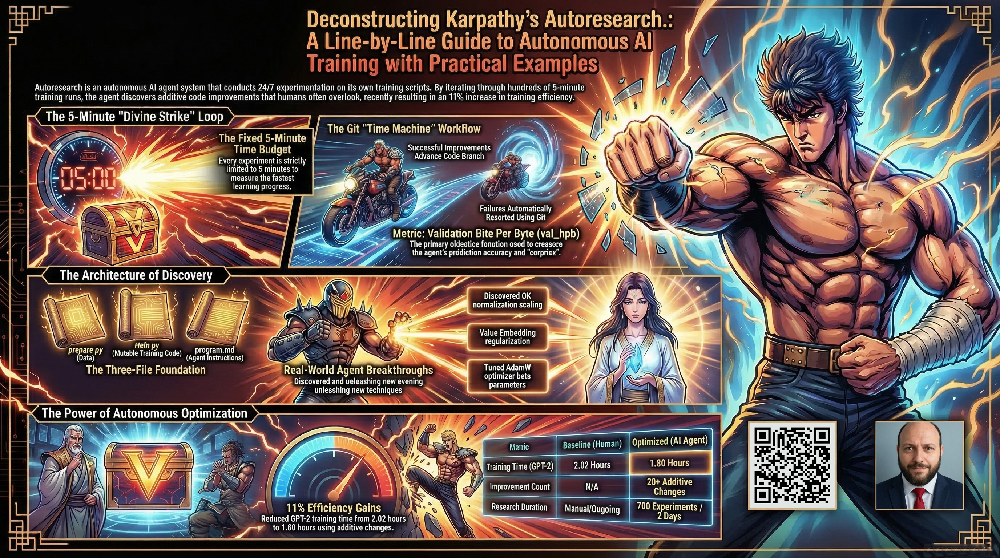

# Deconstructing Karpathy's Autoresearch: A Line-by-Line Guide to Autonomous AI Training with Practical Examples

This folder contains a comprehensive beginner-friendly guide to Andrej Karpathy's Autoresearch project. The article explores autonomous AI training—an AI agent that iteratively improves its own training code through hundreds of experiments. You'll learn how the system works, including the 5-minute experiment loop, git branch workflow for safe code modifications, the evaluation metric (val_bpb), and the three core files: prepare.py, train.py, and program.md. The guide explains neural networks, training, attention mechanisms, optimizers, and hyperparameters using everyday analogies. It also covers practical topics like bits per byte vs validation loss, how successful changes are kept while failures are discarded, and why this approach can discover additive improvements that stack together. Through a line-by-line deconstruction of the codebase, the article makes autonomous research accessible and demonstrates how AI agents can accelerate scientific discovery.

Feel free to check out the full content in four ways:

1. 📢 **LinkedIn announcement**: 
2. 📖 **Read the article directly on LinkedIn**: 
3. 🐦 **X/Twitter Announcement**: 
4. 🔍 **Browse the source**:
   [article.md](./article.md)

Original Andrej Karpathy's Tweet and Repository:

1. 🐦 **Official Release Tweet**: https://x.com/karpathy/status/2030371219518931079
2. 🐦 **Updated Tweet**: https://x.com/karpathy/status/2031135152349524125
3. 🧩 **Github Repository**: https://github.com/karpathy/autoresearch