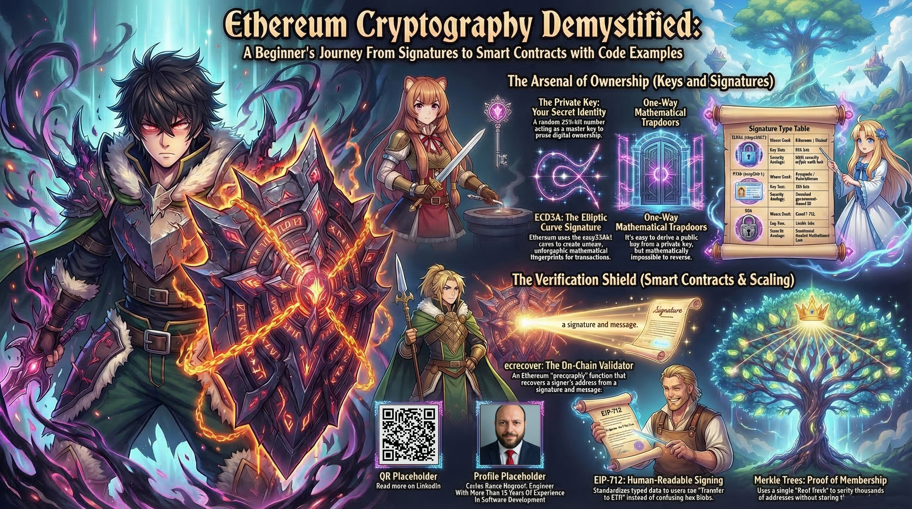

# Ethereum Cryptography Demystified: A Beginner's Journey From Signatures to Smart Contracts with Code Examples

This folder contains a comprehensive beginner's guide to cryptography in Ethereum. The guide covers digital signatures using ECDSA with secp256k1, comparing ECDSA, P256, and RSA signature types, and how signature verification works in smart contracts using OpenZeppelin libraries. You'll learn about Merkle trees for efficient on-chain verification, hash functions including Keccak-256 and the SHA-3 family, the full derivation path from private key to Ethereum address with EIP-55 checksums, the ecrecover precompile for on-chain signature recovery, and EIP-712 for typed structured data signing. The article also covers practical OpenZeppelin utilities including storage optimization, safe math operations, type conversions, EnumerableSet and EnumerableMap collections, BitMaps, and time/block operations.

Feel free to check out the full content in four ways:

1. 📢 **LinkedIn announcement**: https://www.linkedin.com/posts/carlos-baeza-negroni_ethereum-cryptography-web3-activity-7440081392912474112-9HWp
2. 📖 **Read the article directly on LinkedIn**: https://www.linkedin.com/pulse/ethereum-cryptography-demystified-beginners-journey-baeza-negroni-tvtbf
3. 🐦 **X/Twitter Announcement**: https://x.com/cjbaezilla/status/2034317099049324580
4. 🔍 **Browse the source**:
   [article.md](./article.md)
