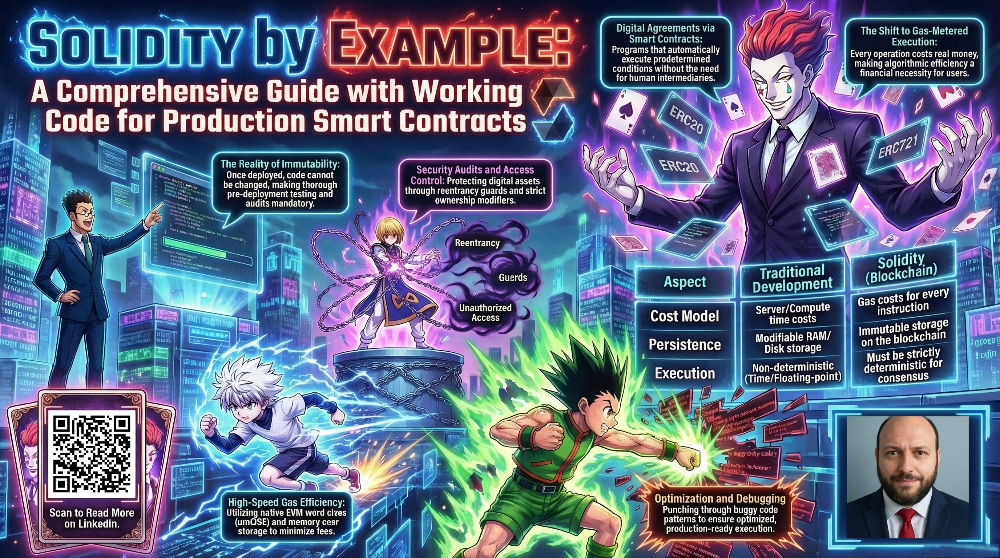
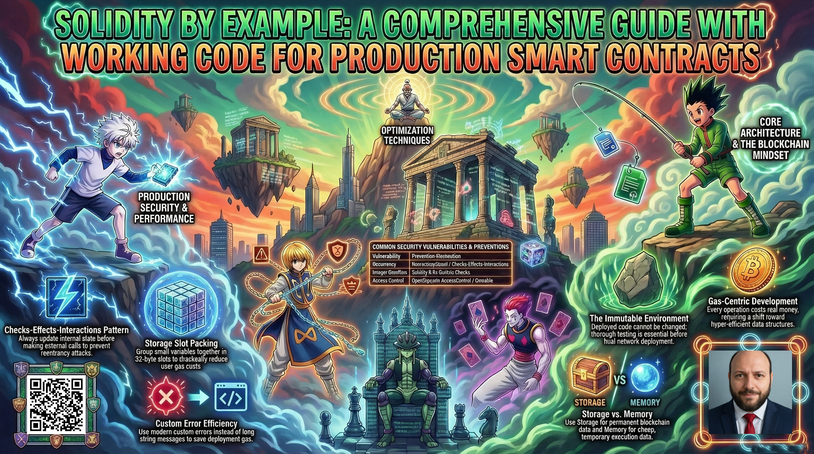
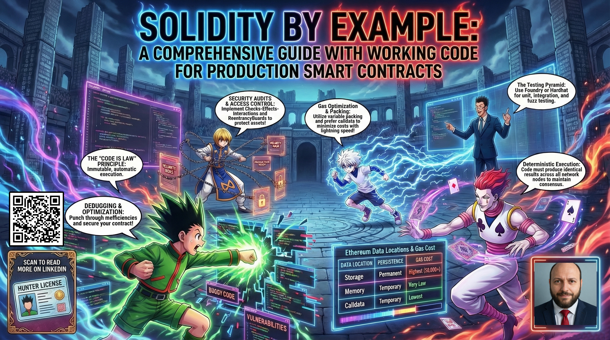
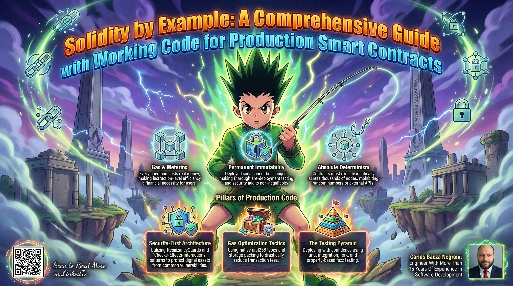

# Solidity by Example: A Comprehensive Guide with Working Code for Production Smart Contracts


Get ready to dive into one of the most exciting areas of modern software development. Smart contracts are changing how we think about money, governance, and trust, and you're about to become part of this transformation. This guide walks you through everything you need to know, starting from absolute basics and building up to sophisticated DeFi protocols that handle millions of dollars.

What makes this guide different from typical programming tutorials is something crucial: we don't teach concepts in isolation. Because that's not how real development works. Instead, we show you how everything connects together. You will see the practical patterns developers actually use, the optimization tricks that save users real money on gas fees, and the security practices that protect millions of dollars in digital assets. You'll see working code you can build on, not just abstract theory.

By the time you work through this guide, you'll have the confidence and skills to build production-ready smart contracts, optimize them to save users money on gas fees, secure them against common vulnerabilities, and deploy them with peace of mind on Ethereum and other compatible networks.

---

## Executive Summary

If you've been looking for a single resource that covers Solidity thoroughly, from "what is a smart contract?" all the way to building flash loans and governance systems, you've found it. Solidity has become the backbone of Ethereum and EVM-compatible blockchain development, powering billions of dollars in decentralized applications, tokens, and financial protocols. This document provides an exhaustive exploration of Solidity programming, organized into logical sections that build upon each other progressively.

Here's what makes our approach unique: instead of throwing definitions at you and moving on, we show you how these concepts work together in real-world scenarios. You'll get practical code examples you can copy and experiment with, optimization techniques that professional developers use to save users money, and security best practices that come from hard-won experience in the space. Each section builds naturally on the previous ones, so you never feel lost or confused about why you're learning something.

The questions covered in this guide span the full spectrum of Solidity development, from understanding basic data types and control structures, through advanced topics like proxy patterns and flash loans, to the intricacies of the Ethereum Virtual Machine itself. Each section includes detailed explanations, comparisons, and actionable insights that you can immediately apply to your projects.

By the end of this guide, you'll have the knowledge and confidence to build production-ready smart contracts, optimize them for gas efficiency, secure them against common vulnerabilities, and deploy them with confidence on Ethereum and other EVM-compatible networks.



---

## 1. Introduction to Solidity and Smart Contracts

Welcome to the world of blockchain development! This section sets the foundation for everything you'll learn moving forward. Before we dive into writing code, let's make sure you understand what Solidity actually is, why it was created, and how it fits into the broader Ethereum ecosystem. This isn't just theory; understanding these fundamentals will make every line of code you write make more sense and help you avoid common mistakes that beginners often make.

Think of this section as laying the groundwork before building a house. Skip it, and you might build something that looks fine but eventually crumbles. Pay attention, and you'll have a solid understanding that supports everything else you learn.

### 1.1 What is Solidity and What is it Used For?

Let's start with the basics. Solidity is the programming language you'll use to write smart contracts on Ethereum and other compatible blockchains. Think of it as the language that powers digital agreements: contracts that automatically execute when specific conditions are met, without needing any middleman to oversee the process.

The language was created specifically for blockchain development back in 2014, and it's become the standard for Ethereum smart contracts. If you've glanced at any DeFi protocol, NFT collection, or token in the crypto space, there's a good chance Solidity is behind it. The language draws inspiration from JavaScript, Python, and C++, so if you've worked with any of those, you'll recognize the syntax right away.

Here's where things get genuinely different from regular programming. In traditional software, you might worry about server costs or performance. In Solidity, you're working with a system where every single operation costs real money (called "gas"), where data you store lives on the blockchain forever, and where your code runs identically on thousands of computers simultaneously. That's a fundamentally different mindset than what most developers are used to.

The beauty of this approach is that once you deploy a smart contract, it does exactly what you programmed. There are no exceptions and no surprises. There's no server that can go down, no database that can be corrupted, and no intermediary who can decide to change the rules. The code is the law, as they say in the Ethereum community.

**Real-World Use Case:**

Let me paint a picture of how this works in practice. Imagine you want to buy something from a stranger online. In the old world, you'd need banks or payment processors to hold funds and verify conditions. This often involves a lot of middlemen, fees, and plenty of waiting.

With Solidity, you can program an escrow smart contract that handles this beautifully. The buyer sends funds to the contract, which holds them securely. Once the buyer confirms receipt of goods, the contract automatically releases funds to the seller. If the seller fails to deliver within a specified timeframe, the buyer gets their money back automatically, no questions asked. The entire process runs 24/7, costs a fraction of traditional methods, and everyone can verify the code does exactly what it promises. No middleman required.

```solidity
// Efficient logic for trustless P2P transactions without intermediaries
// Purpose: Locking funds which can only be moved with arbiter approval or returned if a dispute occurs.

// SPDX-License-Identifier: MIT
pragma solidity ^0.8.19;

contract SimpleEscrow {
    address public buyer;
    address public seller;
    address public arbiter;
    uint256 public amount;
    bool public released;
    
    enum State { Created, Funded, Released, Refunded }
    State public state;
    
    event Funded(address funder, uint256 amount);
    event Released(address recipient, uint256 amount);
    event Refunded(address recipient, uint256 amount);
    
    modifier onlyBuyer() { require(msg.sender == buyer, "Only buyer"); _; }
    modifier onlyArbiter() { require(msg.sender == arbiter, "Only arbiter"); _; }
    modifier inState(State _state) { require(state == _state, "Invalid state"); _; }
    
    constructor(address _seller, address _arbiter) {
        buyer = msg.sender;
        seller = _seller;
        arbiter = _arbiter;
        state = State.Created;
    }
    
    function fund() external payable onlyBuyer inState(State.Created) {
        require(msg.value > 0, "Must send Ether");
        amount = msg.value;
        state = State.Funded;
        emit Funded(msg.sender, msg.value);
    }
    
    function release() external onlyArbiter inState(State.Funded) {
        released = true;
        state = State.Released;
        payable(seller).transfer(amount);
        emit Released(seller, amount);
    }
    
    function refund() external onlyArbiter inState(State.Funded) {
        released = false;
        state = State.Refunded;
        payable(buyer).transfer(amount);
        emit Refunded(buyer, amount);
    }
}
```

This simple contract demonstrates how Solidity enables trustless transactions, as no middleman is required because the code itself enforces the rules.

### 1.2 Solidity vs Other Programming Languages: Key Differences

Coming from another programming language? You'll find Solidity feels familiar in many ways, but there are some critical differences that trip up even experienced developers. Understanding these isn't just academic; it directly impacts whether your contracts work correctly and whether they cost users too much in gas fees.

The blockchain environment is fundamentally different from traditional computing. When you run a program on your computer or a server, you have complete control over the execution environment. On a blockchain, your code runs on a distributed network of computers that need to reach consensus on the outcome. This changes everything.

| Aspect | Traditional Languages (Java, Python, C++) | Solidity |
|--------|------------------------------------------|----------|
| **Execution Model** | Runs on specific hardware/cPU | Runs on Ethereum Virtual Machine (EVM) |
| **Determinism** | Non-deterministic (floating-point, time) | Must be deterministic for consensus |
| **State Persistence** | RAM/disk, can be modified | Storage persists on blockchain forever |
| **Cost Model** | Compute time, server costs | Gas costs for every operation |
| **Immutability** | Code can be updated anytime | Contract code is immutable after deployment |
| **Error Handling** | Exceptions, try-catch | Revert, require, assert |
| **Concurrency** | Multi-threaded possible | Sequential execution, single state |
| **Address Model** | Pointers, references | EVM addresses (20 bytes) |

**Key Distinctions You Must Understand:**

Coming from traditional programming? Here's what will trip you up if you're not careful:

**Gas and Metering:** Every single operation in Solidity costs gas, which translates to real money. A loop that runs 100 times in a traditional program might cost you nothing (just CPU time). The same loop on Ethereum might cost users real money in transaction fees. This fundamentally changes how you approach code design. You'll start thinking differently about loops, data structures, and when to store information versus calculating it on the fly. It's similar to going from unlimited free compute to paying for every instruction, so suddenly efficiency becomes critically important.

**Immutability:** When you deploy a smart contract, the code cannot be changed. (Unless you use upgradeable proxy patterns, which we'll cover later.) This is both a feature and a challenge. On one hand, users know the rules won't change underneath them. On the other hand, if there's a bug, you can't just push a hotfix like you would with a regular application. This is why thorough testing before deployment is not optional; it's absolutely essential. The blockchain never forgets mistakes, and neither do hackers.

**Determinism:** Smart contracts must produce the same result regardless of when or where they execute. This is crucial for the network to reach consensus. What this means practically is that you can't pull random numbers from external sources (like weather APIs), because different nodes might get different values. You also need to be aware that miners can slightly influence timestamps, so you shouldn't use block.timestamp for anything security-critical. Your code needs to behave identically on every node, every single time.

### 1.3 Understanding Smart Contracts in Ethereum

At its core, a smart contract is simply a program that runs on a blockchain. But what makes it "smart" is that it automatically executes when predetermined conditions are met. No human intervention is required, and no middleman is needed to verify that everyone held up their end of the bargain.

Think about how traditional contracts work. You agree to something, then you hope the other person follows through, and if they don't, you might need lawyers, courts, or arbitrators to resolve the dispute. Smart contracts eliminate all of that. The code itself enforces the agreement. If the conditions are met, the contract executes automatically. If they're not, nothing happens. There's no room for argument about what was agreed to, because the code is right there, visible to everyone, doing exactly what it was programmed to do.

**The Smart Contract Lifecycle:**

Here's what happens from idea to deployed contract:

1. **Writing:** Developers write Solidity code defining contract logic: the rules of your agreement. This is where you specify what should happen and under what conditions.

2. **Compilation:** Code is compiled to EVM bytecode. This is a crucial step that transforms human-readable Solidity into something the Ethereum Virtual Machine can actually execute. Think of it like compiling a C++ program or transpiling TypeScript; the high-level code gets transformed into machine-executable instructions.

3. **Deployment:** The compiled bytecode is sent as a transaction to the Ethereum network. This creates a new address on the blockchain. This process is just like how transactions create regular account addresses, but this one is associated with your code instead of a private key.

4. **Execution:** When someone interacts with the contract, the EVM executes the relevant functions. Every function call is actually a transaction that gets recorded on the blockchain.

5. **State Changes:** All state modifications are recorded on the blockchain permanently, creating an immutable audit trail. This is one of the most powerful aspects of smart contracts because there is a complete history of everything that ever happened.

**How Smart Contracts Actually Work:**

When you deploy a smart contract, you're creating a special account on Ethereum. It has its own balance and storage, just like a regular account, but instead of being controlled by a private key, it's controlled by code. When someone calls a function in your contract, the EVM runs your bytecode, which can read from and write to the contract's storage and emit events that external applications can listen for.

The beautiful thing about this model is that no single entity controls the contract. Everyone can see the code, everyone can interact with it according to its rules, and here's the crucial part: no one, not even the original developer who wrote the code, can unilaterally change the rules after deployment. The code does exactly what it says, forever. This is both terrifying and wonderful, depending on whether your code has bugs. (Which is why we test so much!)


---

## 2. Fundamentals: Data Types and Variables

Now we're getting into the actual coding. This section covers the building blocks you'll use in every Solidity contract you write. Think of data types as the vocabulary of your code. Get comfortable with them, and everything else becomes much easier.

Understanding data types thoroughly is more important in Solidity than in many other languages. This is because Solidity's type system has some unique characteristics that directly impact both security and gas costs. These nuances separate code that works from code that works well.

### 2.1 Declaring Variables in Solidity

Getting variables right is foundational to Solidity. Where you declare a variable, how you declare it, and what keywords you use all matter. These choices affect how much gas users pay, how secure your contract is, and how easy it is to maintain. Let me walk you through the different categories and explain why each one matters:

```solidity
// Variable Declaration in Solidity

contract VariableDeclaration {
    // Permanent data stored on the blockchain (Storage).
    // Writing to these is expensive, so only store what is truly necessary.
    uint256 public publicNumber = 42;              // Public - auto-generates getter function
    uint256 internal internalNumber = 100;         // Internal - only this contract and children
    uint256 private privateNumber = 999;           // Private - only this contract
    
    // Constant variables - must be known at compile time
    // These occupy zero storage slots because their values are hardcoded into the bytecode.
    // Reading them is virtually free in terms of gas.
    uint256 public constant MAX_VALUE = 1000;
    bytes32 public constant CONTRACT_HASH = keccak256("Example");
    
    // Immutable variables - set once in constructor
    // Variables set once in the constructor and then become read-only.
    // Optimized for data that is unique per deployment but constant thereafter.
    address public immutable OWNER;
    uint256 public immutable CREATION_TIMESTAMP;
    
    constructor() {
        OWNER = msg.sender;
        CREATION_TIMESTAMP = block.timestamp;
    }
    
    // Temporary data residing in Memory (RAM).
    // These variables vanish when the function call ends, making them gas-efficient for calculations.
    function demonstrateLocalVariables() public pure returns (uint256) {
        uint256 localVariable = 50;           // Lives in memory, temporary
        bool localBool = true;                // In memory
        address localAddress = msg.sender;    // In memory
        
        uint256 result = localVariable + 10;
        return result;
    }
    
    // Function parameters are also local variables
    function processValue(uint256 input) public pure returns (uint256) {
        return input * 2;
    }
}
```

**Key Points About Variable Declaration:**

| Location | Keyword | Storage | Persistence |
|----------|---------|---------|-------------|
| Contract level | None | Storage | Permanent |
| Contract level | `constant` | Code | Permanent |
| Contract level | `immutable` | Storage | Set once |
| Function level | None | Memory | Temporary |

**Best Practices:**

- Always declare visibility for state variables (public, internal, private). This makes your code clearer and more secure.
- Use `constant` for values that never change and are known at compile time, as they cost zero gas to read
- Use `immutable` for values set in constructor but not known at compile time; they're still gas efficient
- Prefer `uint256` for most integer operations, as it is the EVM's native word size

Now let's look at the actual data types Solidity provides. Each has specific characteristics and use cases, so understanding them well will save you headaches later.

**Value Types:**

| Type | Description | Size | Example |
|------|-------------|------|---------|
| `bool` | Boolean value | 1 byte | `bool public isActive = true;` |
| `int` / `uint` | Signed/unsigned integer | 8-256 bits (steps of 8) | `uint256 public balance = 100;` |
| `address` | Ethereum address | 20 bytes | `address public owner = msg.sender;` |
| `address payable` | Address that can receive Ether | 20 bytes | `address payable public feeRecipient;` |
| `bytes1` to `bytes32` | Fixed-size byte arrays | 1-32 bytes | `bytes32 public dataHash;` |
| `enum` | User-defined type | Based on values | `enum State { Pending, Active, Closed }` |

**Boolean Type:**

The boolean type represents logical true/false values and is fundamental for control flow and conditional logic:

```solidity
// Boolean Declaration and Usage
contract BooleanExample {
    bool public isActive = true;
    bool public isVerified = false;
    
    // Returns (true, true, false): Logical evaluation for branching logic.
    function logicalOperators(bool a, bool b) public pure returns (bool, bool, bool) {
        return (
            a && b,  // AND - true only if both are true
            a || b,  // OR - true if either is true
            !a       // NOT - flips the value
        );
    }
    
    // Comparison operators return boolean
    function comparisons(int256 a, int256 b) public pure returns (bool, bool, bool) {
        return (
            a == b,  // Equal
            a != b,  // Not equal
            a > b    // Greater than
        );
    }
    
    // Common use case: flags
    bool public paused;
    
    function togglePause() public {
        paused = !paused;
    }
    
    function deposit() public payable {
        require(!paused, "Contract is paused");
        // Deposit logic
    }
}
```

**Integer Types Deep Dive:**

Solidity offers integers in sizes from 8 to 256 bits in increments of 8. The key distinction is between signed (`int`) and unsigned (`uint`) integers:

```solidity
// Integer Types in Solidity

// Unsigned integers (non-negative)
uint8 public smallNumber;    // 0 to 255 (2^8 - 1)
uint16 public mediumNumber;  // 0 to 65,535
uint32 public regularNumber; // 0 to ~4.3 billion
uint64 public largeNumber;   // 0 to ~1.8 x 10^19
uint128 public hugeNumber;   // 0 to ~3.4 x 10^38
uint256 public maximum;      // 0 to ~1.15 x 10^77 (the standard)

// Signed integers (can be negative)
int8 public signedSmall;    // -128 to 127
int256 public signedNormal;  // -2^255 to 2^255 - 1

// Default to uint256 as it matches the EVM word size (32 bytes).
// Using smaller types like uint8 rarely saves gas unless they are packed in storage.
uint256 public bestPractice = 42; 
```

**The uint8 vs uint256 Question:**

One of the most common questions from beginners is whether to use smaller integer types like `uint8` versus the default `uint256`. The answer might surprise you: in most cases, you should just use `uint256` and move on.

Here's why: the EVM operates on 256-bit words internally. This is how the machine is designed. When you use a smaller type like `uint8`, the EVM has to do extra work to pack and unpack that value within the 256-bit word. The result is that you often don't save any gas at all, and sometimes using smaller types actually costs more. Save yourself the headache and stick with `uint256` for most purposes.

The exception is when you're packing multiple values together into a single storage slot to save space, which we'll cover in the gas optimization section later.

### 2.2 Address Type: The Foundation of Ethereum Interactions

The `address` type is fundamental to Solidity because it represents Ethereum accounts, including both externally owned accounts (the wallets you probably use every day, controlled by private keys) and contract accounts (the smart contracts on the network). Almost every significant interaction in your contracts will involve addresses in some way, whether you're tracking who owns what, sending tokens, or checking permissions.

The address type is 20 bytes long, and that is not arbitrary. Ethereum addresses are derived from public keys using a specific hashing process, and that process produces exactly 20 bytes. When you're working with addresses, you're working with the fundamental building block of who owns what on the network.

```solidity
// Address Types in Solidity

// Representing addresses without balance transfer capability to minimize interaction risks.
address public regularAddress = 0x1234567890123456789012345678901234567890;

// Explicitly marked to receive Ether; includes .transfer() and .send() members.
address payable public payableAddress = payable(0x1234567890123456789012345678901234567890);

// Converting between types - sometimes you need to go back and forth
address public fromAddress = address(0x1234);
address payable public toPayable = payable(fromAddress);

// Getting balance - useful for checking if an account has funds
uint256 public addressBalance = address(this).balance;
uint256 public userBalance = regularAddress.balance;

// Key difference: payable addresses have transfer methods for sending Ether
function withdraw() public {
    payableAddress.transfer(100);  // Sends 100 wei, reverts on failure
    // regularAddress.transfer(100); // COMPILE ERROR - not payable!
}
```

**When to use address vs address payable:**

Use `address` when you need to check code or storage of another contract, or when the address is purely for informational purposes. Use `address payable` specifically when you'll be sending Ether to that address, as it won't compile otherwise.

### 2.3 Strings, Bytes, and Dynamic Data

Working with text and binary data is something you'll do constantly in smart contracts, whether you're storing user names, handling IPFS hashes, or working with cryptographic signatures. Understanding the difference between `string` and `bytes` is one of those details that seems minor on the surface but can have a real impact on your gas costs and contract behavior. Once you grasp this, you'll make better decisions about how to handle data in your contracts.

The key thing to understand is that Solidity treats these types differently at the EVM level, and those differences matter for both performance and functionality. Let's dive in and I'll walk you through everything you need to know.

```solidity
// String vs Bytes - Gas Implications

// Stored as UTF-8. Use only for end-user readability, not internal logic.
string public name = "Hello World";

// Bytes - raw byte array, more gas efficient
// Use when you need raw data, hashing, or are concerned about gas costs
bytes public nameBytes = "Hello World";

// Fixed-size bytes (bytes1 through bytes32)
// These are value types, which are cheaper than dynamic bytes because the size is known
bytes32 public fixedHash = keccak256(abi.encodePacked("data"));

// Dynamic bytes allows arbitrary length but costs more due to extra overhead
bytes public dynamicData = new bytes(20);
```

**Why does this matter?** When you store a `string`, Solidity converts it to UTF-8 internally, which means every character can take up to 4 bytes depending on the encoding. This makes string operations unpredictable from a gas perspective. With `bytes`, you're working with raw binary data, and the EVM knows exactly how much space each element takes. The result is that `bytes` operations tend to be more predictable and often cheaper.

For example, if you're building a contract that needs to verify that a hash matches expected data, working with `bytes32` gives you a massive advantage. The EVM handles fixed-size byte arrays much more efficiently than dynamic ones, and since cryptographic functions like `keccak256` return exactly 32 bytes, you're working with a perfect match.

**The Difference Between `bytes` and `byte`:**

This confusion catches many developers, so let's clear it up once and for all. The distinction is simple once you see it in action:

```solidity
// bytes vs byte - Important Distinction

contract BytesVsByte {
    // 'byte' is simply an alias for 'bytes1', which is a single byte (value type)
    byte public singleByte = 0xAB;
    bytes1 public alsoSingleByte = 0xAB;  // Same thing!
    
    // 'bytes' is a dynamic-length byte array (reference type)
    // Can grow and shrink during execution
    bytes public dynamicByteArray = "Hello";
    
    // bytes1 through bytes32 are FIXED-size byte arrays
    // Size is part of the type, so you choose exactly what you need
    bytes1 public fixed1 = 0xAA;     // 1 byte
    bytes2 public fixed2 = 0xAABB;    // 2 bytes
    bytes4 public fixed4 = 0xAABBCCDD; // 4 bytes
    bytes32 public fixed32;           // 32 bytes, which is very common in production
    
    // Practical insight: bytes32 is the standard for hashing and signatures
    function hashData(string memory input) public pure returns (bytes32) {
        return keccak256(abi.encodePacked(input));
    }
    
    // Use bytes32 when:
    // - Storing hashes (keccak256 returns bytes32)
    // - Working with cryptographic signatures
    // - Need fixed-size binary data
    // - Gas optimization for storage matters
    
    // Use bytes when:
    // - Variable-length data
    // Reading arbitrary data from external sources
    // - Working with ABI-encoded data dynamically
}
```

The practical takeaway here is straightforward: whenever you know the exact size of your data at compile time, use the fixed-size version. This applies to more than just bytes, too. You'll find this pattern throughout Solidity, and it's usually the right choice for gas efficiency.

**When to Use `bytes32`: A Practical Guide:**

The `bytes32` type is one of the most commonly used types in production smart contracts. Once you start building real applications, you'll find yourself reaching for it constantly. Here's why it becomes so indispensable:

First, cryptographic hashes in Ethereum are always 32 bytes. The `keccak256` function, which is the workhorse of Ethereum's hashing, returns exactly 32 bytes. This means whether you're verifying data integrity, creating unique identifiers, or implementing any security-sensitive logic, `bytes32` is your friend. You get to work with the hash directly without any conversion or padding overhead.

Second, `bytes32` is incredibly efficient in storage. Each storage slot in the EVM is 32 bytes, so a `bytes32` value fits perfectly into a single slot. This means reading and writing these values costs exactly what you'd expect, with no wasted space or extra operations.

Third, you'll see `bytes32` everywhere in established standards. The ERC-20 token standard uses it for roles and permissions. EIP-712 typed data signing uses it for domain separators. Access control systems often use it for role identifiers. When you work with these standards, `bytes32` becomes second nature.

```solidity
// bytes32 Use Cases

contract Bytes32Examples {
    // 1. Hashes and signatures
    bytes32 public lastHash;
    bytes32 public documentHash;
    
    // 2. Identifiers and keys
    bytes32 public roleAdmin = keccak256("ADMIN_ROLE");
    bytes32 public roleMinter = keccak256("MINTER_ROLE");
    
    // 3. Fixed-size data storage for gas efficiency
    bytes32[10] public fixedArrayOfHashes;  // Packed storage
    
    // 4. Encoding multiple values
    function encodePair(address user, uint256 id) public pure returns (bytes32) {
        return keccak256(abi.encodePacked(user, id));
    }
    
    // 5. Domain separators (EIP-712)
    bytes32 public domainSeparator = keccak256(
        abi.encode(
            keccak256("EIP712Domain(string name,string version,uint256 chainId,address verifyingContract)"),
            keccak256("MyToken"),
            keccak256("1"),
            block.chainid,
            address(this)
        )
    );
}
```

**Working with Dynamic Strings:**

There are times when you genuinely need variable-length strings, like user-provided names or text content. Solidity gives you the tools to handle this, but you need to understand the trade-offs:

```solidity
contract StringHandling {
    // Basic string storage
    string public productName = "My Awesome Product";
    string public description;
    
    // Setting strings from functions
    function setDescription(string memory _description) public {
        description = _description;
    }
    
    // Comparing strings - you need to hash them
    function stringsEqual(string memory a, string memory b) public pure returns (bool) {
        return keccak256(abi.encodePacked(a)) == keccak256(abi.encodePacked(b));
    }
    
    // Getting string length (in bytes, not characters!)
    function getByteLength(string memory s) public pure returns (uint256) {
        return bytes(s).length;
    }
    
    // Important: Solidity doesn't have native string concatenation
    // You need to use libraries or inline assembly
    // This is one area where bytes32 can be more practical
}
```

One thing to keep in mind: string length in Solidity is measured in bytes, not Unicode characters. For ASCII text, this is the same thing, but if you're working with international text containing non-ASCII characters, each character might use multiple bytes. This is why `bytes(s).length` gives you the byte length, which might differ from what a human would call the "length" of the string.

**Dynamic Data in Practice:**

When you're building real contracts, you'll often need to work with data that comes from external sources or needs to be processed dynamically. Here's how to handle some common scenarios:

```solidity
contract DynamicDataExamples {
    // Dynamic bytes for variable-length data
    bytes public data;
    
    // Append data efficiently
    function appendData(bytes memory newData) public {
        bytes memory result = new bytes(data.length + newData.length);
        for (uint256 i = 0; i < data.length; i++) {
            result[i] = data[i];
        }
        for (uint256 i = 0; i < newData.length; i++) {
            result[data.length + i] = newData[i];
        }
        data = result;
    }
    
    // Slicing bytes (careful with gas costs!)
    function sliceBytes(bytes memory input, uint256 start, uint256 length) 
        public pure returns (bytes memory) {
        bytes memory result = new bytes(length);
        for (uint256 i = 0; i < length; i++) {
            result[i] = input[start + i];
        }
        return result;
    }
    
    // Check if bytes starts with prefix
    function startsWith(bytes memory data, bytes memory prefix) 
        public pure returns (bool) {
        if (prefix.length > data.length) return false;
        for (uint256 i = 0; i < prefix.length; i++) {
            if (data[i] != prefix[i]) return false;
        }
        return true;
    }
}
```

The examples above show you the patterns, but keep in mind that operations on dynamic data tend to be more expensive in terms of gas than working with fixed-size types. This is why you should think carefully about whether you actually need dynamic data or whether a fixed-size alternative would work. In many cases, especially for identifiers, hashes, and cryptographic material, fixed-size bytes is the way to go.

Now that you understand how to work with these data types, let's move on to the more complex structures that combine them into powerful data structures you'll use in every serious contract you build.

### 2.4 Arrays, Mappings, and Complex Data Structures

When you're building real smart contracts, you'll quickly discover that single variables won't cut it for most applications. That's where arrays and mappings come in. These data structures let you organize and manage multiple values efficiently, whether you're tracking a list of token holders, maintaining a leaderboard, or storing historical data. You'll be amazed at how naturally these fit into your code once you understand the patterns.

**Arrays:**

Arrays in Solidity work similarly to what you might have seen in other languages, but with some important nuances that directly impact how much users pay in gas fees. Let's break this down so you can make smart decisions in your own contracts.

A fixed-size array is exactly what it sounds like: you declare the size upfront, and it never changes throughout the contract's lifetime. This is perfect for situations where you know exactly how many items you need to store, like the days of the week or a fixed set of categories. The EVM can optimize these really well because it knows exactly where each element lives in storage.

```solidity
// Array Declaration and Usage

// Fixed-size array - size known at compile time
uint256[5] public fixedArray = [1, 2, 3, 4, 5];

// Dynamic array that can grow during execution
uint256[] public dynamicArray;

// Different ways to initialize arrays in Solidity

contract ArrayInitialization {
    
    // 1. Fixed-size array initialization at declaration
    uint256[3] public fixedInit1 = [1, 2, 3];
    uint256[3] public fixedInit2 = [10, 20, 30];
    bytes[4] public stringArray = ["a", "b", "c", "d"];
    
    // 2. Dynamic array initialization in memory
    function getMemoryArray() public pure returns (uint256[] memory) {
        // Must specify size for memory arrays
        uint256[] memory arr = new uint256[](5);
        arr[0] = 10;
        arr[1] = 20;
        arr[2] = 30;
        arr[3] = 40;
        arr[4] = 50;
        return arr;
    }
    
    // 3. Inline initialization (Solidity 0.8+)
    uint256[] public inlineInit = new uint256[](0);
    
    function initializeInline() public {
        inlineInit = new uint256[](3);
        inlineInit[0] = 1;
        inlineInit[1] = 2;
        inlineInit[2] = 3;
    }
    
    // 4. Using push for dynamic arrays
    uint256[] public pushBased;
    
    function addElements() public {
        pushBased.push(1);    // Array is now [1]
        pushBased.push(2);    // Array is now [1, 2]
        pushBased.push(3);    // Array is now [1, 2, 3]
    }
    
    // 5. Initialize with default values
    function getDefaultValues() public pure returns (uint256[] memory) {
        uint256[5] memory fixedDefault;
        // Returns [0, 0, 0, 0, 0] - default value is 0
        uint256[] memory result = new uint256[](5);
        return result;
    }
    
    // 6. Struct array initialization
    struct Person {
        string name;
        uint256 age;
    }
    
    Person[] public people;
    
    function addPerson(string memory name, uint256 age) public {
        // Method 1: Direct struct creation
        people.push(Person(name, age));
        
        // Method 2: Create in memory then push
        Person memory newPerson = Person(name, age);
        people.push(newPerson);
    }
    
    // 7. Multi-dimensional array initialization
    uint256[][] public matrix2D;
    
    function init2D() public {
        matrix2D = new uint256[][](2);  // 2 rows
        matrix2D[0] = new uint256[](3); // 3 columns in row 0
        matrix2D[1] = new uint256[](3); // 3 columns in row 1
        
        matrix2D[0][0] = 1;
        matrix2D[0][1] = 2;
        matrix2D[0][2] = 3;
    }
}
```

One thing that makes Solidity arrays special is how they handle memory versus storage. When you declare an array as a state variable, it lives in storage, which means it persists on the blockchain and costs real money to write to. But when you create an array inside a function using the `memory` keyword, it only exists while that function is running. This distinction matters enormously for gas costs, and you'll get a feel for when to use each as you write more contracts.

Dynamic arrays give you flexibility that fixed-size arrays can't match. You can start with an empty array and add elements as needed using the `.push()` method. This is incredibly useful when you don't know ahead of time how many items you'll have. Think of a voting system where anyone can register as a candidate, or a lottery where players keep entering. These use cases naturally need dynamic arrays.

Here's a practical pattern you'll find yourself using often: storing structs in arrays. This combination lets you build sophisticated data management systems. The example above shows you exactly how to do this, and once you see it in action, you'll immediately recognize opportunities to use this pattern in your own projects.

**Array Methods:**

Solidity gives you several built-in methods for working with arrays. These are your everyday tools for managing dynamic data:

| Method | Description | Example |
|--------|-------------|---------|
| `.push()` | Add element to end | `arr.push(42)` |
| `.push()` (no args) | Add zero-initialized element | `arr.push()` |
| `.pop()` | Remove last element | `arr.pop()` |
| `.length` | Get array length | `arr.length` |
| `.length = x` | Resize array | `arr.length = 10` |

These methods make working with dynamic arrays straightforward and intuitive. The `.push()` method is particularly useful because it automatically expands the array and returns the index of the newly added element, which means you can do things like `arr.push()` followed by `arr[arr.length-1] = value` if you need to set a specific value immediately.

**Important Notes:**

There are a few key things to keep in mind as you work with arrays. These are the kinds of details that separate code that works reliably from code that causes headaches later.

Fixed-size arrays truly are fixed. Once you declare them, you cannot change their size. This is different from languages like JavaScript where arrays can grow and shrink freely. If you need flexibility, use dynamic arrays from the start.

Array elements are zero-initialized by default. This means if you create a new array with five elements, they're all automatically set to zero (or their type's default value). This is actually helpful because it means you don't have to manually initialize every element, but it does mean you need to be aware of this when checking values.

Accessing beyond the array length will cause your transaction to revert. The EVM doesn't allow this, and that's actually a good thing because it prevents reading garbage data. But it does mean you should always check the length before accessing elements, especially when working with user-provided indices.

When you delete an element using `delete arr[index]`, it resets that element to its default value (typically zero), but the array size stays the same. If you want to actually remove an element and shrink the array, use `.pop()` instead.

**When to Use Fixed vs Dynamic Arrays:**

This is a common question, and the answer depends on your specific use case. Fixed-size arrays are ideal when you know the exact number of items at compile time. They use slightly less gas because the EVM knows the size in advance, and they make your code's intentions clearer to anyone reading it.

Dynamic arrays shine when the number of items is unknown or can change during contract execution. Most real-world contracts end up using dynamic arrays because requirements often evolve. The gas overhead is minimal, and the flexibility is worth it.

**Mappings:**

Now let's talk about mappings, which are one of Solidity's most powerful and distinctive features. If arrays are like organized lists, think of mappings as lightning-fast lookup tables. They're Solidity's key-value hash tables, and you'll use them in nearly every contract you build.

The beauty of mappings is how efficient they are. When you write `mapping(address => uint256) public balanceOf`, you're creating a data structure where looking up any address's balance happens in essentially constant time, regardless of how many entries exist. This is fundamentally different from arrays where searching for an element might require checking every item.

```solidity
// Mapping Declaration

// Basic mapping: address to uint256
// This is how token contracts track balances
mapping(address => uint256) public balanceOf;

// Nested mapping: address to another mapping
// ERC-20's allowance system uses this pattern
mapping(address => mapping(address => uint256)) public allowances;

// Mapping with custom key
mapping(bytes32 => bool) public usedSignatures;

// Important: Mappings cannot be iterated directly
// If you need to loop through all entries, maintain a separate array
mapping(uint256 => address) public idToAddress;
uint256[] public allIds;  // Track all IDs so you can iterate
```

The most common use case you'll see is `mapping(address => uint256)`, which is how token contracts track how much each address owns. This pattern is everywhere in DeFi because it's so efficient and natural to work with.

Nested mappings open up even more possibilities. The `mapping(address => mapping(address => uint256))` pattern shown above is exactly how ERC-20 tokens implement allowances. It creates a two-level lookup: first find the owner, then find how much that owner has allowed a specific spender to use. This is elegant and efficient.

One thing that surprises developers coming from other languages is that mappings don't have a length property and you can't iterate over them directly. This is because they're implemented as hash tables internally, and there's no efficient way to enumerate all keys. The solution is simple: whenever you add a new entry to a mapping, also push the key to an array. Then you can iterate over the array to access all mapping values.

**Practical Pattern: Combining Arrays and Mappings:**

Here's a pattern you'll find incredibly useful in production contracts. Use a mapping for fast lookups by key, and maintain a parallel array when you need to iterate or know the total count. This gives you the best of both worlds:

```solidity
contract CombinedDataStructures {
    // Fast lookup by address
    mapping(address => User) public usersByAddress;
    
    // Ordered iteration when needed
    address[] public userAddresses;
    
    struct User {
        string name;
        uint256 balance;
        bool exists;
    }
    
    function addUser(address addr, string memory name) public {
        if (!usersByAddress[addr].exists) {
            usersByAddress[addr] = User(name, 0, true);
            userAddresses.push(addr);
        }
    }
    
    function getUserCount() public view returns (uint256) {
        return userAddresses.length;
    }
    
    function getAllUsers() public view returns (User[] memory) {
        User[] memory result = new User[](userAddresses.length);
        for (uint256 i = 0; i < userAddresses.length; i++) {
            result[i] = usersByAddress[userAddresses[i]];
        }
        return result;
    }
}
```

This pattern shows up constantly in real applications, whether you're building a whitelist system, a voting mechanism, or any situation where you need both quick lookups and the ability to process all entries.

### 2.5 Structs and Enums: Custom Data Types

As you build more complex smart contracts, you'll quickly discover that the built-in types like uint256, address, and bool are powerful but limited. Real-world applications need to represent richer concepts: a user with multiple attributes, a transaction with various states, a product with details. That's where structs and enums become invaluable. They let you create custom data types that perfectly match your application's needs, making your code more readable, maintainable, and expressive.

You'll find yourself reaching for these tools constantly as your contracts grow. They're not just organizational conveniences; they're essential for building contracts that are easy to understand and reason about. Once you start using them properly, your code will transform from a collection of scattered variables into clean, logical structures that clearly represent what your application actually does.

**Structs: Building Complex Data Types**

A struct is Solidity's way of letting you group related data together under a single name. Think of it like creating a custom data type that combines multiple pieces of information about one thing. Instead of keeping track of separate variables for a user's name, age, verification status, and scores, you can wrap them all up in a User struct that represents the complete picture.

This approach makes your code significantly easier to work with. When you pass around a User struct, you're passing everything related to that user in one clean package. When you read from storage, you get the complete user object. When you write to storage, you save the complete user object. This is far superior to managing separate mappings or arrays for each attribute.

```solidity
// Struct Definition

struct User {
    string name;
    uint256 age;
    bool verified;
    uint256[] scores;
}

// Creating struct instances
mapping(uint256 => User) public users;

// Setting struct values using named parameters
function createUser(uint256 id, string memory _name, uint256 _age) public {
    users[id] = User({
        name: _name,
        age: _age,
        verified: false,
        scores: new uint256[](0)
    });
}

// Alternative: inline struct creation
// The values are assigned in the order they were declared in the struct
function createUserInline(uint256 id, string memory _name, uint256 _age) public {
    users[id] = User(_name, _age, false, new uint256[](0));
}
```

There are two ways to create struct instances in Solidity, and both are useful in different situations. The named parameter style, like `User({ name: _name, age: _age, ... })`, is clearer and less error-prone because you don't have to remember the exact order of fields. The positional style, like `User(_name, _age, false, ...)`, is more concise when you're in a hurry. You'll develop a preference over time, but the named style is generally safer, especially when structs have many fields or get updated over time.

One thing that makes structs incredibly powerful is that they can contain other complex types. Notice in the example above that the User struct has a `uint256[] scores` field, which is a dynamic array. This means your structs can hold lists, mappings, and even other structs. This flexibility lets you model virtually any real-world entity with natural, readable code.

**Practical Struct Patterns**

Here's a pattern you'll encounter frequently in production contracts: using structs to represent complete business objects that need to be stored and retrieved efficiently.

```solidity
contract ProductRegistry {
    struct Product {
        string name;
        string description;
        uint256 price;
        address owner;
        uint256 stock;
        bool active;
    }
    
    mapping(bytes32 => Product) public products;
    bytes32[] public productIds;
    
    function addProduct(
        bytes32 productId,
        string memory name,
        string memory description,
        uint256 price,
        uint256 stock
    ) public {
        require(products[productId].owner == address(0), "Product exists");
        
        products[productId] = Product({
            name: name,
            description: description,
            price: price,
            owner: msg.sender,
            stock: stock,
            active: true
        });
        
        productIds.push(productId);
    }
    
    function updateStock(bytes32 productId, uint256 newStock) public {
        Product storage p = products[productId];
        require(p.owner == msg.sender, "Not owner");
        p.stock = newStock;
    }
}
```

This pattern works beautifully for inventory systems, supply chain tracking, or any application where you need to manage collections of items with multiple attributes. Notice how we use both a mapping for fast lookups by ID and an array to maintain ordering and allow iteration. You'll see this pattern repeatedly in professional contracts.

**Enums: Constraining Values to Specific Choices**

Enums are Solidity's way of letting you define a type that can only have one of a specific set of values. They're perfect for representing states, statuses, or any situation where you want to prevent accidental invalid values. Instead of using a uint256 where any number is theoretically valid, an enum restricts you to only the values you explicitly define.

The power of enums lies in their clarity and safety. Consider a payment contract where you're tracking whether an order is pending, shipped, delivered, or cancelled. You could use uint256 with magic numbers (0, 1, 2, 3), but that's error-prone and confusing. Anyone reading your code has to remember what each number means. With enums, the code speaks for itself: `OrderStatus.Shipped` is immediately clear.

```solidity
// Enum Definition

enum OrderStatus {
    Pending,    // 0 - the default value
    Shipped,    // 1
    Delivered,  // 2
    Cancelled   // 3
}

mapping(uint256 => OrderStatus) public orderStatuses;

function updateStatus(uint256 orderId, OrderStatus status) public {
    orderStatuses[orderId] = status;
}

function getStatus(uint256 orderId) public view returns (OrderStatus) {
    return orderStatuses[orderId];
}
```

Behind the scenes, Solidity stores enums as unsigned integers, so they're quite efficient in terms of gas. But they give you the readability and type safety you need. When someone tries to set an order status to something other than the four defined values, the code simply won't compile, catching bugs before they ever reach the blockchain.

**Real-World Enum Applications**

Enums shine in scenarios where your contract transitions through distinct phases or needs to enforce strict rules about valid states.

```solidity
contract CrowdFund {
    enum State {
        Fundraising,    // Accepting contributions
        Expired,        // Deadline passed, goal not reached
        Successful      // Goal reached, can withdraw
    }
    
    State public currentState;
    uint256 public targetAmount;
    uint256 public deadline;
    
    function fund() public payable {
        require(currentState == State.Fundraising, "Not accepting funds");
        require(block.timestamp < deadline, "Deadline passed");
        // Process funding...
    }
    
    function checkGoalReached() public {
        require(currentState == State.Fundraising, "Already finalized");
        if (address(this).balance >= targetAmount) {
            currentState = State.Successful;
        } else if (block.timestamp >= deadline) {
            currentState = State.Expired;
        }
    }
    
    function withdraw() public {
        require(currentState == State.Successful, "Cannot withdraw");
        // Process withdrawal...
    }
}
```

This crowd funding example shows how enums create natural boundaries in your contract logic. Each function checks the current state before allowing operations, preventing users from doing things out of order. You can't withdraw before the goal is reached, you can't fund after the deadline, and the state machine clearly tracks what phase the campaign is in.

**Combining Structs and Enums**

The real magic happens when you combine structs and enums. A struct can contain an enum, and an enum can reference structs in your logic. This combination lets you build sophisticated state management that remains readable and maintainable.

```solidity
contract Marketplace {
    enum ItemStatus {
        Available,
        Sold,
        Returned
    }
    
    struct Item {
        string name;
        uint256 price;
        address seller;
        ItemStatus status;
    }
    
    mapping(bytes32 => Item) public items;
    bytes32[] public itemList;
    
    function listItem(bytes32 itemId, string memory name, uint256 price) public {
        items[itemId] = Item({
            name: name,
            price: price,
            seller: msg.sender,
            status: ItemStatus.Available
        });
        itemList.push(itemId);
    }
    
    function markAsSold(bytes32 itemId, address buyer) public {
        Item storage item = items[itemId];
        require(item.seller == msg.sender, "Not seller");
        require(item.status == ItemStatus.Available, "Not available");
        
        item.status = ItemStatus.Sold;
    }
}
```

This marketplace contract demonstrates the pattern perfectly. Each item has a status represented by an enum, and that status controls what operations are possible. The code reads naturally, and the compiler helps you avoid invalid state transitions.

**Best Practices for Custom Types**

As you work with structs and enums, keep a few key principles in mind. First, name your structs after the business concept they represent. User, Product, Order, and Transaction are good names. Second, use enums whenever you have a fixed set of options that are conceptually related. Third, struct and enum names should be singular (Item, not Items) because each instance represents one item. These conventions might seem small, but they make your code much easier to read and collaborate on.

You'll find that well-designed structs and enums are among the most valuable tools in your Solidity toolkit. They transform complex data from something hard to manage into something elegant and intuitive to work with.

### 2.6 Storage vs Memory: Understanding Data Location

This is one of the most critical concepts in Solidity, and it directly affects both gas costs and contract behavior. Get this wrong, and your contracts will either cost way too much to run or behave in ways that don't make sense. This is one of those concepts that trips up even experienced developers coming from other languages.

Think of it this way: storage is the blockchain's permanent database. Every piece of data you store there persists forever, across all transactions, for the entire life of the contract. Memory, on the other hand, is like your computer's RAM; it's temporary, it's fast, and it gets cleared after each transaction ends. When the transaction is over, everything in memory is gone.

Why does this matter so much? Because writing to storage costs a significant amount of gas (thousands or even tens of thousands of units), while memory operations cost only a few gas units. Understanding when to use each one is crucial for writing efficient contracts.

```solidity
// Storage vs Memory

contract DataLocations {
    // State variables are ALWAYS in storage
    // This data persists on the blockchain forever
    uint256[] public storageArray = [1, 2, 3];
    mapping(address => uint256) public balances;
    
    function example() public view {
        // Local variables can be storage, memory, or calldata
        // Here's how each works:
        
        // storage pointer - points to actual state variables
        // Modifying this CHANGES the blockchain state!
        uint256[] storage ptr = storageArray;
        ptr.push(4);  // This MODIFIES storageArray!
        
        // memory - temporary data that disappears after function ends
        // Use this for calculations and intermediate values
        uint256[] memory tempArray = new uint256[](5);
        tempArray[0] = 100;  // This is temporary, won't persist
        
        // calldata - for function parameters, immutable and gas-efficient
        // Only valid for external function parameters
        // The compiler will yell at you if you try to use it wrong
    }
    
    // External function with calldata parameter
    // calldata is more gas-efficient than memory for external functions
    // because the data doesn't need to be copied
    function processData(uint256[] calldata data) external pure returns (uint256) {
        return data.length;
    }
    
    // Memory vs Storage in mappings
    function updateBalance(address user, uint256 newBalance) public {
        // Direct access to mapping - modifies storage immediately
        balances[user] = newBalance;
        
        // Storage pointer from mapping
        // This points to the actual storage slot, not a copy!
        uint256 storage balance = balances[user];
        balance += 100;  // This ALSO modifies storage!
    }
}
```

### 2.7 Pragma Directive and Versioning

The `pragma` directive tells the compiler which version of Solidity to use. Think of it as telling your build system what tools you need. Getting this right matters: if it is too old, you miss security features, and if it is too new, you might hit unexpected behavior.

```solidity
// Pragma directives

// Use a specific version - for production code where stability is critical
pragma solidity 0.8.19;

// Use a range of versions - more flexible but requires checking compatibility
pragma solidity >=0.8.0 <0.9.0;

// Compile with specific EVM version - for advanced scenarios
pragma solidity 0.8.19;
pragma experimental ABIEncoderV2;

// Modern pragma - using ^ allows compatible updates within the minor version
// This is the most common choice for development
pragma solidity ^0.8.19;  // Will compile with 0.8.19 through 0.8.x
```

**Version Selection Best Practices:**

- Use `^0.8.19` (or whatever the latest stable is) for most projects to get bug fixes while maintaining compatibility
- Pin exact versions (`0.8.19`) for production contracts where stability absolutely must not change
- Always check for breaking changes between major versions; for example, 0.7 → 0.8 introduced built-in overflow checks, which was a massive improvement

### 2.8 State Variables in Solidity

State variables are the backbone of any smart contract. They define the persistent data that lives on the blockchain. Understanding how to declare, use, and optimize state variables is fundamental to writing efficient smart contracts.

### 2.9 Ether Units: Wei, Gwei, and Ether

Here's something practical you'll use constantly: Solidity provides built-in support for ether denominations. This makes it much easier to work with cryptocurrency values in a human-readable way, rather than dealing with enormous numbers.

Think of it like cents and dollars; you don't write prices in cents when talking to humans, and you don't write them in dollars when doing precise calculations.

```solidity
// Ether Units in Solidity

contract EtherUnits {
    // Wei is the smallest unit of Ether (like cents to dollars)
    // 1 Ether = 10^18 Wei. That is a lot of zeros!
    
    uint256 public oneWei = 1 wei;
    uint256 public oneGwei = 1 gwei;  // 10^9 Wei
    uint256 public oneEther = 1 ether; // 10^18 Wei
    
    // Practical example: minimum deposit of 0.01 Ether
    // Using the ether suffix makes code readable
    uint256 public constant MINIMUM_DEPOSIT = 0.01 ether;
    
    function deposit() public payable {
        // msg.value is always in Wei automatically
        // Comparing against 0.01 ether handles the conversion for you
        require(msg.value >= MINIMUM_DEPOSIT, "Minimum deposit is 0.01 ETH");
    }
    
    // Convert Wei balance to Ether for display
    function getBalanceInEther() public view returns (uint256) {
        return address(this).balance / 1 ether;
    }
    
    // Gas fees are typically shown in Gwei because they're smaller numbers
    function getBalanceInGwei() public view returns (uint256) {
        return address(this).balance / 1 gwei;
    }
    
    // Sending a refund - using ether suffix makes the amount clear
    function refund() public {
        payable(msg.sender).transfer(0.001 ether);
    }
}
```

**Ether Units Reference Table:**

| Unit Name        | Wei Value   | Number of Wei             |
| :--------------- | :---------- | :------------------------ |
| Wei (wei)        | 1 wei       | 1                         |
| Kwei (babbage)   | 1e3 wei     | 1,000                     |
| Mwei (lovelace)  | 1e6 wei     | 1,000,000                 |
| Gwei (shannon)   | 1e9 wei     | 1,000,000,000             |
| Twei (szabo)     | 1e12 wei    | 1,000,000,000,000         |
| Pwei (finney)    | 1e15 wei    | 1,000,000,000,000,000     |
| Ether (buterin)  | 1e18 wei    | 1,000,000,000,000,000,000 |

**Real-World Use Case:**

When building DeFi applications, you often need to work with different precision levels. A lending protocol might track balances in wei for precision but display amounts in ether for users. Gas fees are typically displayed in gwei because they represent small values.

### 2.10 Fixed-Point Types in Solidity

Fixed-point numbers are numbers with a decimal portion. However, it's important to note that **fixed-point types (fixed and ufixed) are experimental and have been deprecated in recent versions of Solidity**. They should not be used in production code.

```solidity
// Fixed-Point Types - DEPRECATED/EXPERIMENTAL
// These types are NOT recommended for use in modern Solidity

// This is how they would theoretically work (if enabled):
// fixed8x1 - 8 bits integer part, 1 bit decimal (e.g., 127.5)
// ufixed128x18 - 128 bits integer part, 18 bits decimal (like decimals in ERC-20)
// fixed256x80 - maximum precision

// WHY THEY'RE DEPRECATED:
// 1. They're marked as experimental and may be removed
// 2. Limited compiler support
// 3. Can lead to precision loss
// 4. Better alternatives exist (use integers and manually track decimals)

// MODERN ALTERNATIVE: Integer Math with Decimal Tracking
contract DecimalMath {
    uint8 public constant DECIMALS = 18;
    
    // Store everything as integers in lowest denomination (like wei)
    // Apply decimal math manually
    
    function multiply(uint256 a, uint256 b, uint256 scale) public pure returns (uint256) {
        return (a * b) / scale;
    }
    
    function divide(uint256 a, uint256 b, uint256 scale) public pure returns (uint256) {
        return (a * scale) / b;
    }
    
    // Example: Calculate 1.5 * 2.0 with 18 decimals
    function calculate() public pure returns (uint256) {
        uint256 a = 1.5 ether;  // 1.5 * 10^18
        uint256 b = 2.0 ether;  // 2.0 * 10^18
        return (a * b) / 1 ether;  // Returns 3.0 ether
    }
}
```

**Best Practice:** Always use integer arithmetic with manual decimal tracking. The ERC-20 standard uses this approach with a `decimals()` function that returns 18 by convention.

### 2.11 Deleting Elements from Arrays and Mappings

Managing dynamic data structures requires understanding how to properly remove elements:

```solidity
// Deleting Elements from Arrays

contract ArrayDeletion {
    uint256[] public numbers;
    
    constructor() {
        numbers = [10, 20, 30, 40, 50];
    }
    
    // Method 1: Remove last element with pop()
    function removeLast() public {
        numbers.pop();  // Removes 50, array now [10, 20, 30, 40]
    }
    
    // Method 2: Remove by index (shifts elements)
    function removeByIndex(uint256 index) public {
        require(index < numbers.length, "Index out of bounds");
        
        for (uint256 i = index; i < numbers.length - 1; i++) {
            numbers[i] = numbers[i + 1];
        }
        numbers.pop();
    }
    
    // Method 3: Delete sets to default value (doesn't resize)
    function deleteAtIndex(uint256 index) public {
        delete numbers[index];  // Sets to 0, array still same length
    }
    
    // Method 4: Swap and pop (gas efficient for unordered removal)
    function removeSwap(uint256 index) public {
        require(index < numbers.length, "Index out of bounds");
        
        numbers[index] = numbers[numbers.length - 1];
        numbers.pop();
    }
    
    // Get array length
    function getLength() public view returns (uint256) {
        return numbers.length;
    }
}

// Deleting from Mappings

contract MappingDeletion {
    mapping(address => uint256) public balances;
    mapping(address => bool) public isWhitelisted;
    
    // For mappings, you can reset individual values
    function resetBalance(address user) public {
        delete balances[user];  // Sets to default (0)
    }
    
    function removeWhitelist(address user) public {
        delete isWhitelisted[user];  // Sets to default (false)
    }
    
    // Important: You cannot delete ALL entries in a mapping at once
    // To iterate, maintain a separate array of keys
    address[] public users;
    
    function addUser(address user) public {
        users.push(user);
        balances[user] = 100;
    }
    
    function clearAllBalances() public {
        for (uint256 i = 0; i < users.length; i++) {
            delete balances[users[i]];
        }
    }
}
```

**Key Points About Deletion:**

| Method | Use Case | Gas Cost | Array Size Changes? |
|--------|----------|----------|---------------------|
| `delete arr[index]` | Reset single element | Low | No |
| `arr.pop()` | Remove last element | Low | Yes |
| Swap and pop | Remove any element efficiently | Medium | Yes |
| Shift and pop | Preserve order | High | Yes |

### 2.12 Fixed-Size vs Dynamic Arrays in Solidity

Understanding the difference between fixed-size and dynamic arrays is crucial for proper data structure selection:

```solidity
// Fixed-Size vs Dynamic Arrays

contract ArrayTypes {
    // FIXED-SIZE ARRAYS
    // Size must be known at compile time
    // Cannot change size after declaration
    
    uint256[5] public fixedArray = [1, 2, 3, 4, 5];
    bytes32[3] public hashArray;
    address[10] public stakeholders;
    
    // DYNAMIC ARRAYS
    // Size can grow and shrink during execution
    
    uint256[] public dynamicArray;
    bytes[] public dynamicBytes;
    string[] public names;
    
    constructor() {
        // Initialize dynamic array
        dynamicArray.push(1);
        dynamicArray.push(2);
        dynamicArray.push(3);
    }
    
    // Fixed-size array in memory - size must be specified
    function getFixedMemory() public pure returns (uint256[4] memory) {
        uint256[4] memory arr = [10, 20, 30, 40];
        return arr;
    }
    
    // Dynamic array in memory - use new keyword
    function getDynamicMemory() public pure returns (uint256[] memory) {
        uint256[] memory arr = new uint256[](5);
        arr[0] = 1;
        arr[1] = 2;
        return arr;
    }
    
    // Multi-dimensional arrays
    uint256[3][2] public matrixFixed = [[1, 2, 3], [4, 5, 6]];  // 2 rows, 3 columns
    uint256[][] public matrixDynamic;
    
    function initMatrix() public {
        matrixDynamic.push([1, 2, 3]);
        matrixDynamic.push([4, 5, 6, 7]);  // Jagged array - different row lengths
    }
    
    // When to use each type:
    // - Fixed: Known size, better gas efficiency, no runtime overhead
    // - Dynamic: Unknown size, need to add/remove elements, more flexible
}
```

**Comparison Table:**

| Aspect | Fixed-Size Array | Dynamic Array |
|--------|-----------------|----------------|
| Size Declaration | Known at compile time | Unknown, can change |
| Memory | Optimized layout | Dynamic allocation |
| Methods | Static (.length only) | .push(), .pop(), .length |
| Use Case | Known data sets | Growing collections |
| Gas (storage) | Native word access | SSTORE overhead |

**Practical Example: Tracking Investors**

```solidity
contract InvestorTracker {
    // Use FIXED when you know the maximum number
    struct Investor {
        address addr;
        uint256 investment;
        bool active;
    }
    
    // Dynamic - number of investors varies
    Investor[] public investors;
    mapping(address => uint256) public investorIndices;
    
    function addInvestor(address addr, uint256 investment) public {
        require(investorIndices[addr] == 0, "Already registered");
        
        investors.push(Investor({
            addr: addr,
            investment: investment,
            active: true
        }));
        investorIndices[addr] = investors.length;  // 1-based index
    }
    
    function removeInvestor(address addr) public {
        uint256 index = investorIndices[addr] - 1;
        require(index < investors.length, "Not found");
        
        // Swap with last and pop - O(1)
        investors[index] = investors[investors.length - 1];
        investors.pop();
    }
}
```

**State Variables Deep Dive**

```solidity

contract StateVariables {
    // ============================================
    // BASIC STATE VARIABLES
    // ============================================
    
    // Unsigned integers - fundamental to token balances
    uint256 public totalSupply;
    uint256 public balance;
    uint8 public smallValue;  // Avoid using uint8 unless packing storage; it costs more to read individually.
    
    // Signed integers (can be negative)
    int256 public temperature;  // Could be -10 degrees
    
    // Boolean flags
    bool public isPaused;
    bool public isVerified;
    
    // Address types
    address public owner;
    address payable public feeRecipient;
    
    // Bytes and strings
    bytes32 public dataHash;
    string public name;
    
    // ============================================
    // COMPLEX STATE VARIABLES
    // ============================================
    
    // Arrays
    uint256[] public numbers;
    address[] public stakeholders;
    
    // Mappings - the backbone of Solidity data structures
    mapping(address => uint256) public balances;
    mapping(address => mapping(address => uint256)) public allowances;
    
    // Structs
    struct User {
        string name;
        uint256 points;
        bool active;
    }
    mapping(address => User) public users;
    
    // Enums
    enum Status { Pending, Active, Completed }
    Status public currentStatus;
    
    // ============================================
    // SPECIAL STATE VARIABLES
    // ============================================
    
    // Constant - embedded at compile time, no storage cost
    uint256 public constant MAX_UINT = type(uint256).max;
    bytes32 public constant ROLE_ADMIN = keccak256("ADMIN");
    
    // Immutable - set in constructor, stored once
    address public immutable CREATOR;
    uint256 public immutable INITIAL_SUPPLY;
    
    constructor() {
        CREATOR = msg.sender;
        INITIAL_SUPPLY = 1000000;
    }
    
    // ============================================
    // STATE VARIABLE INITIALIZATION
    // ============================================
    
    // Inline initialization
    uint256 public initialValue = 100;
    address public defaultOwner = 0xAb5801a7D398351b8bE11C439e05C5B3259aeC9B;
    bool public defaultActive = true;
    
    // Initialize in constructor (preferred for dynamic values)
    uint256 public deploymentTime;
    string public contractName;
    
    constructor(string memory _name) {
        deploymentTime = block.timestamp;
        contractName = _name;
    }
}
```

**State Variables: Key Characteristics:**

| Characteristic | Description |
|---------------|-------------|
| **Persistence** | Stored on blockchain, survives transactions |
| **Location** | Always in storage (not memory) |
| **Initialization** | Can be initialized inline or in constructor |
| **Visibility** | Can be public, internal, or private |
| **Gas Cost** | Writing is expensive (20,000+ gas), reading cheaper |

**State Variable Visibility Explained:**

```solidity
contract VisibilityShowcase {
    // PUBLIC - generates automatic getter function
    // Can be accessed internally and externally
    uint256 public publicValue = 100;
    
    // INTERNAL - only accessible within this contract and derived contracts
    // Most common choice for internal data
    uint256 internal internalValue = 200;
    
    // PRIVATE - only accessible within this contract
    // Not visible in derived contracts
    uint256 private privateValue = 300;
    
    // Functions to demonstrate visibility
    function accessAll() public view returns (uint256) {
        return publicValue + internalValue + privateValue;  // All accessible
    }
}

contract Derived is VisibilityShowcase {
    function accessPartial() public view returns (uint256) {
        return publicValue + internalValue;  // Can access public and internal
        // return privateValue;  // ERROR: privateValue not accessible
    }
}
```

**State Variable Packing for Gas Optimization:**

One of the most important optimizations for state variables is proper packing. The EVM stores data in 32-byte slots, and variables can share slots to save storage costs:

```solidity
// UNOPTIMIZED - uses 4 storage slots
contract Unoptimized {
    bool public a = true;          // Slot 0
    bool public b = false;         // Slot 1  
    bool public c = true;          // Slot 2
    uint256 public d = 100;        // Slot 3
    bool public e = false;         // Slot 4
}

// OPTIMIZED - packs into fewer slots
contract Optimized {
    // Slot 0: packs all bools (1 byte each) + uint248
    bool public a = true;          // 1 byte
    bool public b = false;         // 1 byte
    bool public c = true;          // 1 byte
    uint248 public d = 100;        // 31 bytes - fits in same slot!
    
    // Slot 1: single bool
    bool public e = false;
    
    // Best practice: order from largest to smallest type
    // uint256 → uint128 → uint64 → ... → bool
}
```

This optimization becomes critical in contracts with many state variables, potentially saving significant deployment and execution costs.



---

## 3. Control Structures and Functions

Now we're getting into the meat of programming. This section covers how to control program flow and organize code into reusable functions; essential skills for any Solidity developer. You'll find Solidity's control structures familiar if you've programmed before, but there are some blockchain-specific nuances to keep in mind.

### 3.1 Control Structures in Solidity

Solidity supports standard control structures with some important blockchain-specific considerations:

```solidity
// Control Structures

contract ControlStructures {
    
    // If-else statement
    function checkValue(uint256 value) public pure returns (string memory) {
        if (value > 100) {
            return "Greater than 100";
        } else if (value > 50) {
            return "Greater than 50";
        } else {
            return "50 or less";
        }
    }
    
    // Ternary operator - gas efficient
    function getStatus(bool isActive) public pure returns (string memory) {
        return isActive ? "Active" : "Inactive";
    }
    
    // For loop
    function sumArray(uint256[] memory arr) public pure returns (uint256) {
        uint256 total = 0;
        for (uint256 i = 0; i < arr.length; i++) {
            total += arr[i];
        }
        return total;
    }
    
    // While loop
    function findFirstEven(uint256[] memory arr) public pure returns (uint256) {
        uint256 i = 0;
        while (i < arr.length) {
            if (arr[i] % 2 == 0) {
                return i;
            }
            i++;
        }
        return type(uint256).max;  // Not found
    }
    
    // Do-while (executes at least once)
    function executeAtLeastOnce(uint256 times) public pure returns (uint256) {
        uint256 count = 0;
        do {
            count++;
        } while (count < times);
        return count;
    }
}
```

### 3.2 Error Handling: Require, Assert, and Revert

Knowing when to use each error handling mechanism is crucial for writing robust contracts. Get this right, and your contracts will handle edge cases gracefully. Get it wrong, and you might waste user gas or, even worse, leave security vulnerabilities.

```solidity
// Error Handling in Solidity

contract ErrorHandling {
    
    // require - your go-to for validation
    // Use this for checking user inputs, access control, and conditions that might reasonably fail
    // Returns unused gas to the caller, which is important for UX
    function validateInput(uint256 value) public pure {
        require(value > 0, "Value must be positive");
        require(value <= 100, "Value must be 100 or less");
        // Readable error messages help users understand what went wrong
    }
    
    // assert - for conditions that should NEVER be false
    // If an assert fails, something is seriously wrong with your contract
    // Consumes all gas - this is intentional, it signals a critical failure
    function checkInternalState(bool internalCheck) public pure {
        // Use assert for invariants that must always hold
        // If this fails, there's a bug in the contract logic
        assert(internalCheck == true);
    }
    
    // revert - explicit error raising for complex conditions
    // Useful when you have nested or complicated validation logic
    function explicitRevert(bool condition) public pure {
        if (condition) {
            revert("Condition was true, reverting");
        }
    }
    
    // Custom errors (Solidity 0.8.4+), which is the modern and efficient approach
    // These are deployed as error signatures rather than strings
    // Saves significant gas compared to string error messages
    error InsufficientBalance(uint256 available, uint256 required);
    
    function withdraw(uint256 amount) public view {
        uint256 balance = address(this).balance;
        if (amount > balance) {
            // Custom errors are cheaper than string messages
            revert InsufficientBalance(balance, amount);
        }
    }
}
```

**When to Use Each:**

| Method | Use Case | Gas Behavior | Best For |
|--------|----------|--------------|----------|
| `require` | Input validation, access control | Returns unused gas | User-facing errors |
| `assert` | Invariants, internal checks | Consumes all gas | Programming errors |
| `revert` | Explicit failure conditions | Returns unused gas | Complex conditions |
| Custom Errors | Modern error handling | Most efficient | Production code |

### 3.3 Functions: Declaration, Types, and Modifiers

```solidity
// Function Fundamentals

contract Functions {
    
    // Basic function
    function add(uint256 a, uint256 b) public pure returns (uint256) {
        return a + b;
    }
    
    // Multiple return values
    function getMinMax(uint256 a, uint256 b) public pure returns (uint256 min, uint256 max) {
        if (a < b) {
            return (a, b);
        }
        return (b, a);
    }
    
    // Named return values
    function divide(uint256 a, uint256 b) public pure returns (uint256 quotient, uint256 remainder) {
        quotient = a / b;
        remainder = a % b;
        // Can return early or let function end
    }
}
```

### 3.4 Function Visibility: Public, External, Internal, Private

```solidity
// Function Visibility

contract VisibilityExample {
    uint256 public value;
    
    // Public - can be called internally and externally, creates getter
    function setValue(uint256 _value) public {
        value = _value;
    }
    
    // External - can only be called externally (from other contracts/transactions)
    function externalFunc() external view returns (address) {
        return msg.sender;
    }
    
    // Internal - can only be called within this contract and derived contracts
    function internalHelper() internal view returns (bool) {
        return value > 0;
    }
    
    // Private - can only be called within this contract (not derived)
    function privateCalc() private pure returns (uint256) {
        return 42;
    }
    
    // Using internal in public function
    function checkAndSet(uint256 _value) public returns (bool) {
        value = _value;
        return internalHelper();  // Can call internal
    }
}
```

### 3.5 Special Function Types: View, Pure, Payable, Fallback

```solidity
// Special Function Types

contract SpecialFunctions {
    uint256 public storedValue = 100;
    
    // View function - reads state but doesn't modify
    function getValue() public view returns (uint256) {
        return storedValue;  // Reading state variable
    }
    
    // Pure function - doesn't read or modify state
    function calculate(uint256 a, uint256 b) public pure returns (uint256) {
        return a * b + 42;  // No state access
    }
    
    // Payable function - can receive Ether
    function deposit() public payable returns (uint256) {
        return msg.value;
    }
    
    // Fallback function - called when no function matches
    // Must be marked as payable to receive Ether
    fallback() external payable {
        // Handle unexpected calls or Ether transfers
    }
    
    // Receive function - specifically for receiving plain Ether
    receive() external payable {
        // Called when msg.data is empty
    }
}
```

### 3.6 Function Modifiers

Modifiers add reusable validation logic to functions:

```solidity
// Function Modifiers

contract Modifiers {
    address public owner;
    mapping(address => bool) public whitelisted;
    uint256 public counter;
    
    constructor() {
        owner = msg.sender;
    }
    
    // Basic modifier
    // This is the most common pattern - access control
    // The underscore is crucial - it's where the function body executes
    // If the require fails, the function never runs
    // Modifiers can access all contract state
    
    modifier onlyOwner() {
        require(msg.sender == owner, "Not owner");
        _;  // Underscore continues execution of function body
    }
    
    // Modifier with parameter
    // You can pass arguments to modifiers
    // They execute in the order declared
    // Can be chained together
    
    modifier onlyWhitelisted() {
        require(whitelisted[msg.sender], "Not whitelisted");
        _;
    }
    
    // Modifier that checks input
    // Validates function arguments before execution
    // Can't return values or use exceptions
    // Perfect for input validation
    
    modifier nonZero(uint256 value) {
        require(value > 0, "Value is zero");
        _;
    }
    
    // Usage examples
    function setValue(uint256 value) public onlyOwner nonZero(value) {
        // Function body executes after modifiers
        // Both onlyOwner and nonZero must pass
        // If either fails, this never runs
    }
    
    // Multi-step modifier
    function protectedAction() public view onlyOwner onlyWhitelisted {
        // Multiple modifiers execute in order
        // First onlyOwner, then onlyWhitelisted
        // All must pass for function to execute
    }
}
```

Modifiers are one of Solidity's most powerful features for creating maintainable, secure smart contracts. They allow you to encapsulate common validation patterns and apply them consistently across multiple functions.

**Real-world use case:** Consider a decentralized autonomous organization (DAO) where you need different access levels. You might create `onlyOwner`, `onlyAdmin`, and `onlyMember` modifiers, then apply them to various functions based on who should have access. This keeps your authorization logic centralized and prevents security mistakes from repeating validation code.

**Key concepts:**
- **Execution order:** Modifiers execute left to right, top to bottom
- **The underscore:** The `_` symbol is where the main function body runs
- **Early exit:** If any modifier's `require` fails, the function never executes
- **Parameter access:** Modifiers can access function parameters and contract state
- **No return values:** Modifiers can't return values or throw exceptions

**Common modifier patterns:**
- **Access control:** `onlyOwner`, `onlyAdmin`, `onlyWhitelisted`
- **Input validation:** `nonZero`, `positive`, `withinRange`
- **State checks:** `onlyWhenPaused`, `onlyWhenActive`, `whenNotPaused`
- **Authorization:** `hasPermission`, `canExecute`, `isAllowed`

**Best practices:**
- Keep modifiers focused on a single responsibility
- Use descriptive names that clearly indicate their purpose
- Avoid complex logic - modifiers should be pure or view when possible
- Be careful with state changes as they affect all functions using the modifier
- Document the expected behavior and execution order

**Advanced techniques:**
- **Multi-step modifiers:** Chain multiple modifiers for complex validation
- **Parameterized modifiers:** Pass arguments for flexible validation
- **State-aware modifiers:** Access contract state for context-aware checks
- **Library modifiers:** Create reusable modifier libraries for common patterns

**Performance considerations:** Modifiers add minimal overhead but provide significant code organization benefits. The compiler optimizes them well, so the main advantage is maintainability rather than gas savings.

**Security implications:** Modifiers are your first line of defense against unauthorized access. A single mistake in a modifier can expose all functions using it, so always test your modifiers thoroughly and keep them simple and auditable.

### 3.7 Events and Logging

Events are one of Solidity's most powerful features for building observable contracts. Think of them as your contract's way of shouting to the outside world what just happened. They're stored in transaction logs, not contract storage, which makes them incredibly cheap to emit while still being discoverable by off-chain applications.

```solidity
// Events

contract EventExample {
    // Define events with up to 3 indexed parameters
    // Events are declared outside functions, at contract level
    // They're emitted using the emit keyword
    
    // Indexed parameters enable efficient filtering, which is critical for dApp UX
    event Transfer(address indexed from, address indexed to, uint256 value);
    event Approval(address indexed owner, address indexed spender, uint256 value);
    event CustomEvent(string message, uint256 timestamp);
    
    mapping(address => uint256) public balances;
    
    function transfer(address to, uint256 value) public {
        require(balances[msg.sender] >= value, "Insufficient balance");
        
        balances[msg.sender] -= value;
        balances[to] += value;
        
        // Emit event - this is how external apps know what happened
        // Events are cheap because they just store data in transaction logs
        // They're perfect for audit trails and real-time notifications
        emit Transfer(msg.sender, to, value);
    }
    
    // Indexed parameters allow efficient filtering
    // You can filter logs by indexed values in tools like Ethers.js
    // Maximum 3 indexed parameters per event
    // Non-indexed parameters are stored but not filterable
    
    function logCustomEvent(string memory message) public {
        emit CustomEvent(message, block.timestamp);
    }
}
```

Events are essential for building observable, auditable smart contracts. They provide a way to log important actions that can be efficiently queried by off-chain applications, creating a bridge between on-chain logic and off-chain interfaces.

**Real-world use case:** In a decentralized exchange, every trade, liquidity addition, and fee distribution should be logged as an event. This allows front-end applications to display real-time trading activity, analytics platforms to track volume and trends, and auditors to verify that all transactions occurred as expected.

**Key concepts:**
- **Declaration:** Events are declared with the `event` keyword outside functions
- **Emission:** Use `emit` to trigger an event during contract execution
- **Indexed parameters:** Up to 3 parameters can be indexed for efficient filtering
- **Storage:** Events are stored in transaction logs, not contract storage
- **Cost:** Events are very gas-efficient compared to storage operations

**Event structure:**
```
event Name(type1 indexed param1, type2 param2, type3 indexed param3)
```
- Indexed parameters enable filtering but limit you to 3
- Non-indexed parameters are stored but not filterable
- All parameter types supported in events must be ABI-encodable

**Common event patterns:**
- **Transfers:** `Transfer(address from, address to, uint256 value)`
- **Approvals:** `Approval(address owner, address spender, uint256 value)`
- **State changes:** `Paused()`, `Unpaused()`, `SetOwner(address newOwner)`
- **Custom actions:** `CustomEvent(string message, uint256 timestamp)`

**Best practices:**
- **Consistency:** Use standard event names across your project
- **Completeness:** Log all state-changing operations
- **Indexing strategy:** Index the most commonly filtered parameters
- **Documentation:** Comment what each event represents
- **Privacy:** Don't log sensitive information in events

**Advanced event features:**
- **Anonymous events:** Remove event signature from logs for privacy
- **Struct events:** Use structs for complex event data
- **Nested events:** Emit multiple related events for complex operations
- **Event versioning:** Include version numbers for evolving contracts

**Querying events:**
Off-chain applications use tools like Ethers.js or Web3.js to filter and watch events:
```javascript
// Example: Filter Transfer events
contract.on('Transfer', (from, to, value) => {
    console.log(`Transfer from ${from} to ${to}: ${value}`);
});

// Example: Filter by indexed parameter
contract.filters.Transfer(null, userAddress);
```

**Security considerations:**
- Events are immutable and cannot be tampered with
- They provide an audit trail for all contract interactions
- Never log private keys, passwords, or sensitive data
- Use events for public information that needs to be observable

**Performance tips:**
- Events are much cheaper than storage operations
- Use events for historical data instead of contract storage
- Limit indexed parameters to the most important filters
- Batch related events when possible

**Testing events:**
Always test that your events are emitted correctly:
```solidity
// Foundry test example
function testTransferEvent() public {
    token.transfer(user, 100);
    emit Transfer(msg.sender, user, 100);
    assertEq(emittedEvents.length, 1);
}
```

Events transform your smart contracts from opaque black boxes into transparent, observable systems that can integrate seamlessly with the broader blockchain ecosystem.


---

## 4. Advanced Data Types and Structures

Time to level up. This section explores sophisticated data handling techniques that enable complex smart contract implementations. You'll learn how to organize data in ways that are efficient, maintainable, and gas-conscious. These patterns show up in every serious production contract.

### 4.1 Nested Mappings and Complex Data Structures

```solidity
// Advanced Mapping Structures

contract AdvancedMappings {
    
    // Nested mapping - 2D key structure
    mapping(address => mapping(address => uint256)) public allowances;
    
    // Three-level nesting - useful for complex permissions
    mapping(address => mapping(address => mapping(bytes4 => bool))) public functionPermissions;
    
    function setAllowance(address token, address spender, uint256 amount) public {
        allowances[token][spender] = amount;
    }
    
    function getAllowance(address token, address spender) public view returns (uint256) {
        return allowances[token][spender];
    }
}
```

### 4.2 Multi-Dimensional Arrays

```solidity
// Multi-Dimensional Arrays

contract MultiDimensionalArrays {
    
    // Fixed-size 2D array
    uint256[3][2] public matrix = [[1, 2, 3], [4, 5, 6]];
    
    // Dynamic 2D array (array of dynamic arrays)
    uint256[][] public dynamicMatrix;
    
    // Initialize
    function initMatrix() public {
        dynamicMatrix.push([1, 2, 3]);
        dynamicMatrix.push([4, 5, 6, 7]);
    }
    
    // Memory 2D array
    function processMatrix(uint256[][] memory input) public pure returns (uint256) {
        uint256 sum = 0;
        for (uint256 i = 0; i < input.length; i++) {
            for (uint256 j = 0; j < input[i].length; j++) {
                sum += input[i][j];
            }
        }
        return sum;
    }
}
```

### 4.3 Libraries in Solidity

Libraries are like utility belts for Solidity developers. They are contracts deployed once and used by many others. The magic happens through delegatecall, where your contract's context runs the library's code, so it feels like the functions are part of your own contract.

```solidity
// Library Definition

// SafeMath.sol: This pattern was essential before Solidity 0.8
library SafeMath {
    function add(uint256 a, uint256 b) internal pure returns (uint256) {
        uint256 c = a + b;
        require(c >= a, "SafeMath: addition overflow");
        return c;
    }
    
    function sub(uint256 a, uint256 b) internal pure returns (uint256) {
        require(b <= a, "SafeMath: subtraction overflow");
        return a - b;
    }
    
    function mul(uint256 a, uint256 b) internal pure returns (uint256) {
        if (a == 0) return 0;
        uint256 c = a * b;
        require(c / a == b, "SafeMath: multiplication overflow");
        return c;
    }
}

// Using the library
contract UseLibrary {
    using SafeMath for uint256;
    
    function safeAdd(uint256 a, uint256 b) public pure returns (uint256) {
        return a.add(b);  // Cleaner syntax
    }
    
    // Without "using For"
    function safeSub(uint256 a, uint256 b) public pure returns (uint256) {
        return SafeMath.sub(a, b);  // Explicit syntax
    }
}
```

### 4.4 Using For Directive

```solidity
// Using For Directive

library ArrayLib {
    function find(uint256[] storage arr, uint256 value) internal view returns (int256) {
        for (uint256 i = 0; i < arr.length; i++) {
            if (arr[i] == value) return int256(i);
        }
        return -1;
    }
}

contract UseArrayLib {
    uint256[] public data;
    
    // Attach library functions to uint256[] type
    using ArrayLib for uint256[];
    
    function testFind(uint256 value) public view returns (int256) {
        return data.find(value);  // Calls ArrayLib.find(data, value)
    }
}
```

### 4.5 Inline Assembly and Yul

Assembly is the nuclear option of Solidity optimization. You can drop down to raw EVM opcodes when you need extra performance, but it's dangerous territory. Most contracts don't need assembly; it makes your code harder to audit and maintain. Still, understanding it helps you see why certain Solidity patterns exist.

```solidity
// Inline Assembly

contract AssemblyExamples {
    
    // Efficient addition using assembly
    function addAssembly(uint256 a, uint256 b) public pure returns (uint256) {
        assembly {
            // Result is stored in memory at position 0x80
            let result := add(a, b)
            mstore(0x80, result)
            return(0x80, 0x20)
        }
    }
    
    // Hash comparison to check if a hash is zero
    function isZeroHash(bytes32 hash) public pure returns (bool) {
        assembly {
            // Check if hash is zero
            let isZero := iszero(hash)
            mstore(0x00, isZero)
            return(0x00, 0x20)
        }
    }
    
    // Get address from bytes32
    function bytes32ToAddress(bytes32 b) public pure returns (address) {
        address result;
        assembly {
            result := b
        }
        return result;
    }
}
```


---

## 5. Inheritance and Object-Oriented Programming

Object-oriented programming in Solidity enables powerful code reuse patterns through inheritance. If you've worked with object-oriented languages before, you'll feel comfortable here, but pay attention to some important differences from traditional OOP.

### 5.1 Basic Inheritance

```solidity
// Inheritance Basics

// Base contract
contract Ownable {
    address public owner;
    
    constructor() {
        owner = msg.sender;
    }
    
    modifier onlyOwner() {
        require(msg.sender == owner, "Not owner");
        _;
    }
}

// Derived contract inherits from Ownable
contract MyContract is Ownable {
    uint256 public value;
    
    function setValue(uint256 _value) public onlyOwner {
        value = _value;
    }
}
```

### 5.2 Multiple Inheritance and Linearization

Multiple inheritance in Solidity is powerful but comes with some quirks. The most important thing to understand is the "C3 linearization" algorithm, which determines the order in which parent contracts are executed; the order you specify matters:

```solidity
// Multiple Inheritance

contract A {
    function foo() public pure virtual returns (string memory) {
        return "A";
    }
}

contract B {
    function foo() public pure virtual returns (string memory) {
        return "B";
    }
}

// Multiple inheritance - order matters for linearization
// Rightmost base is most "base-like," which gets priority in the inheritance chain
contract C is A, B {
    // C's foo overrides both A and B
    function foo() public pure override returns (string memory) {
        return "C";
    }
}

// Base constructors: calling parent constructors
contract Base1 {
    uint256 public x;
    constructor(uint256 _x) {
        x = _x;
    }
}

contract Base2 {
    string public y;
    constructor(string memory _y) {
        y = _y;
    }
}

contract Derived is Base1(42), Base2("hello") {
    // Constructor arguments passed in inheritance list
}
```

### 5.3 Interfaces and Abstract Contracts

```solidity
// Abstract Contract

abstract contract Token {
    function transfer(address to, uint256 value) external virtual returns (bool);
    function balanceOf(address account) external view virtual returns (uint256);
}

// Interface

// Interfaces are contracts that define function signatures without implementation
// They're like blueprints; you can interact with any contract that follows the interface.
// This is how different contracts communicate, so your contract doesn't need to know
// the details of another contract, just what functions it provides.

interface IERC20 {
    function transfer(address to, uint256 amount) external returns (bool);
    function balanceOf(address account) external view returns (uint256);
    function approve(address spender, uint256 amount) external returns (bool);
    function transferFrom(address from, address to, uint256 amount) external returns (bool);
    
    event Transfer(address indexed from, address indexed to, uint256 value);
    event Approval(address indexed owner, address indexed spender, uint256 value);
}

// Using interface, now your contract can interact with any ERC-20 token
contract UseToken {
    IERC20 public token;
    
    constructor(address _token) {
        token = IERC20(_token);
    }
    
    function getBalance(address user) public view returns (uint256) {
        return token.balanceOf(user);
    }
}
```

### 5.4 Virtual and Override Functions

```solidity
// Virtual and Override

contract Base {
    function foo() public pure virtual returns (uint256) {
        return 1;
    }
    
    function bar() public pure virtual returns (uint256) {
        return 2;
    }
}

contract Derived is Base {
    // Override must use override keyword
    function foo() public pure override returns (uint256) {
        return super.foo() + 1;  // Call parent implementation
    }
    
    // Can override without calling parent
    function bar() public pure override returns (uint256) {
        return 42;
    }
}
```



---

## 6. Gas Optimization and Best Practices

Gas optimization is what separates amateur Solidity code from professional, production-ready contracts. Every gas unit you save means lower costs for your users and more efficient protocol operations. In DeFi, where transactions happen thousands of times per day, these savings add up to real money.

Here's the good news: most gas optimizations don't require you to write complicated code. They come from understanding how the EVM works and making smart choices in your implementation. Let's explore the key techniques.

### 6.1 Understanding Gas in Ethereum

```solidity
// Gas Concepts

contract GasExplanation {
    // State variables - stored permanently on blockchain
    // Writing to storage is EXPENSIVE (~20,000-100,000 gas)
    uint256 public storageValue;
    
    // Memory variables - temporary, cleared after transaction
    // Memory operations are CHEAP (~3 gas per word)
    
    // Storage reading - cold access: 2100 gas
    // Storage reading - hot access: 100 gas
    function readStorage() public view returns (uint256) {
        return storageValue;  // Cold SLOAD: 2100 gas
    }
    
    // Storage writing - 5000-20000+ gas depending on operation
    function writeStorage(uint256 value) public {
        storageValue = value;  // SSTORE: 20000 gas (if setting from 0)
    }
}
```

### 6.2 Storage Packing

```solidity
// Storage Packing Example

// UNOPTIMIZED - wastes storage slots
contract Unpacked {
    bool public flag = true;
    uint256 public bigNumber = 100;
    bool public anotherFlag = false;
    // Uses 3 storage slots
    
    // Layout: slot 0 (flag), slot 1 (bigNumber), slot 2 (anotherFlag)
}

// OPTIMIZED - packs multiple values into single slots
contract Packed {
    // Variables should be ordered to fit in 32 bytes
    bool public flag = true;
    bool public anotherFlag = false;
    uint248 public bigNumber = 100;
    // All fit in slot 0!
    
    // Best practice: declare in order of size (largest to smallest)
    // This ensures optimal packing
}
```

### 6.3 Calldata vs Memory

```solidity
// Calldata vs Memory

// External functions should use calldata for parameters because it is immutable and gas-efficient
function processExternal(uint256[] calldata data) external pure returns (uint256) {
    // calldata can't be modified, but cheaper than memory
    return data.length;
}

// Public/internal functions must use memory
function processPublic(uint256[] memory data) public pure returns (uint256) {
    // Can modify the array
    data[0] = 0;
    return data.length;
}
```

### 6.4 Constant and Immutable Variables

```solidity
// Constant and Immutable

contract ConstantsExample {
    // Computed at compile time. Saves gas by inlining the value directly into the bytecode.
    uint256 public constant MAX_SUPPLY = 1000000;
    bytes32 public constant HASH = keccak256("data");
    
    // Immutable - set in constructor, stored once
    address public immutable owner;
    uint256 public immutable creationTime;
    
    constructor() {
        owner = msg.sender;
        creationTime = block.timestamp;
    }
    
    // Differences:
    // - Constant: must be known at compile time, inline expansion
    // - Immutable: set once in constructor, one storage slot
}
```

### 6.5 Gas-Efficient Patterns

```solidity
// Gas Optimization Patterns

contract GasOptimizations {
    
    // Cache storage values in memory
    mapping(address => uint256) public balances;
    
    function processWithCache(address user) public {
        uint256 balance = balances[user];  // Load to stack one time to avoid multiple SLOAD opcodes (expensive).
        // Use balance multiple times without extra gas
    }
    
    // Unchecked arithmetic (Solidity 0.8+) for known-safe operations
    function uncheckedExample(uint256 a, uint256 b) public pure returns (uint256) {
        unchecked {
            // No overflow check - saves gas
            return a + b;
        }
    }
    
    // Use events instead of storage for historical data
    uint256 public lastUpdate;
    event ValueUpdated(uint256 oldValue, uint256 newValue);
    
    function updateValue(uint256 newValue) public {
        emit ValueUpdated(lastUpdate, newValue);
        lastUpdate = newValue;
    }
    
    // Short-circuit in logical operations
    function shortCircuit(bool a, bool b) public pure returns (bool) {
        // If a is false, b is never evaluated
        return a && expensiveOperation(b);
    }
    
    function expensiveOperation(bool input) internal pure returns (bool) {
        // Complex logic here
        return input;
    }
}
```

### 6.6 Gas Cost Comparison Table

| Operation | Gas Cost | Notes |
|-----------|----------|-------|
| SLOAD (cold) | 2100 | Reading storage the first time |
| SLOAD (hot) | 100 | Reading recently accessed storage |
| SSTORE (set to 0) | 5000 | Deleting a storage slot |
| SSTORE (set from 0) | 20000 | Writing to new storage slot |
| SSTORE (update) | 5000 | Modifying existing storage |
| MLOAD/MSTORE | 3 | Memory operations |
| CALL | 100 + gas forwarded | External contract call |
| CREATE | 32000 | Contract creation |


---

## 7. Security Considerations

This is the section you can't afford to skip. Smart contracts handle real value, and bugs translate directly to lost money. This section covers the most common vulnerabilities and, more importantly, how to prevent them. Read this section carefully, internalize these patterns, and keep them in your production code.

### 7.1 Reentrancy Attack

The infamous DAO attack exploited reentrancy and changed the entire blockchain industry. Understanding this attack pattern is essential because it exploits the fact that when your contract makes an external call to another contract, that call can reenter your contract before the first execution finishes. This can lead to devastating results.

```solidity
// VULNERABLE to reentrancy - NEVER DO THIS
contract VulnerableBank {
    mapping(address => uint256) public balances;
    
    function deposit() public payable {
        balances[msg.sender] += msg.value;
    }
    
    function withdraw() public {
        uint256 bal = balances[msg.sender];
        require(bal > 0, "No balance");
        
        // VULNERABLE: State update happens AFTER the external ether transfer. 
        // An attacker's 'receive' function could re-call this withdraw() before the balance is cleared.
        (bool success, ) = msg.sender.call{value: bal}("");
        require(success, "Transfer failed");
        
        balances[msg.sender] = 0;  // This should happen before the call above.
    }
}

// SECURE version using Checks-Effects-Interactions pattern
contract SecureBank {
    mapping(address => uint256) public balances;
    
    function deposit() public payable {
        balances[msg.sender] += msg.value;
    }
    
    function withdraw() public {
        uint256 bal = balances[msg.sender];
        require(bal > 0, "No balance");
        
        // CHECKS: All validations first
        // EFFECTS: Update state BEFORE external call
        // This is the key - state changes happen first, so even if
        // the external call reenters, the state is already updated
        balances[msg.sender] = 0;
        
        // INTERACTIONS: External call last
        // Now even if the receiver tries to reenter, they can't
        (bool success, ) = msg.sender.call{value: bal}("");
        require(success, "Transfer failed");
    }
    
    // Additional protection: use ReentrancyGuard from OpenZeppelin
    // This adds a mutex that prevents recursive calls
}
```

### 7.2 Access Control Patterns

```solidity
// Ownable Pattern (OpenZeppelin)

abstract contract Ownable {
    address public owner;
    
    event OwnershipTransferred(address indexed previousOwner, address indexed newOwner);
    
    constructor() {
        owner = msg.sender;
    }
    
    modifier onlyOwner() {
        require(owner == msg.sender, "Ownable: caller is not the owner");
        _;
    }
    
    function renounceOwnership() public onlyOwner {
        emit OwnershipTransferred(owner, address(0));
        owner = address(0);
    }
    
    function transferOwnership(address newOwner) public onlyOwner {
        require(newOwner != address(0), "Ownable: new owner is the zero address");
        owner = newOwner;
        emit OwnershipTransferred(owner, newOwner);
    }
}

// Role-Based Access Control (RBAC)

contract RBAC {
    mapping(bytes32 => mapping(address => bool)) private roles;
    
    bytes32 public constant ADMIN_ROLE = keccak256("ADMIN_ROLE");
    bytes32 public constant MINTER_ROLE = keccak256("MINTER_ROLE");
    bytes32 public constant BURNER_ROLE = keccak256("BURNER_ROLE");
    
    modifier hasRole(bytes32 role) {
        require(roles[role][msg.sender], "Access denied");
        _;
    }
    
    function grantRole(bytes32 role, address account) public {
        roles[role][account] = true;
    }
    
    function revokeRole(bytes32 role, address account) public {
        roles[role][account] = false;
    }
}
```

### 7.3 Common Security Vulnerabilities Table

| Vulnerability | Description | Prevention |
|--------------|--------------|------------|
| Reentrancy | Calling external contract before state updates | Checks-Effects-Interactions, ReentrancyGuard |
| Integer Overflow/Underflow | Math operations exceeding bounds | SafeMath, Solidity 0.8+ built-in checks |
| Front-Running | Transactions visible before mining | Commit-reveal schemes, batch auctions |
| Access Control | Unauthorized function calls | Proper visibility, AccessControl |
| Timestamp Dependence | Miner manipulation of timestamps | Don't use block.timestamp for critical logic |
| tx.origin Usage | Phishing vulnerability | Use msg.sender instead |

### 7.4 Integer Overflow with SafeMath

```solidity
// SafeMath Library (for Solidity < 0.8)

library SafeMath {
    function add(uint256 a, uint256 b) internal pure returns (uint256) {
        uint256 c = a + b;
        require(c >= a, "Overflow");
        return c;
    }
    
    function sub(uint256 a, uint256 b) internal pure returns (uint256) {
        require(b <= a, "Underflow");
        return a - b;
    }
    
    function mul(uint256 a, uint256 b) internal pure returns (uint256) {
        if (a == 0) return 0;
        uint256 c = a * b;
        require(c / a == b, "Overflow");
        return c;
    }
}
```

### 7.5 Signature Replay Attacks

```solidity
// Preventing Signature Replay

contract SignatureVerification {
    mapping(bytes32 => bool) public usedSignatures;
    
    function verifyAndExecute(
        bytes32 message,
        bytes calldata signature,
        uint256 nonce
    ) public {
        // Include nonce to prevent replay
        bytes32 txHash = keccak256(abi.encodePacked(message, nonce));
        
        // Check signature hasn't been used
        require(!usedSignatures[txHash], "Signature already used");
        
        // Verify signature (simplified)
        // In practice, use OpenZeppelin's ECDSA library
        bytes32 ethSignedHash = keccak256(abi.encodePacked("\x19Ethereum Signed Message:\n32", message));
        
        // Mark as used
        usedSignatures[txHash] = true;
        
        // Execute logic
    }
}
```



---

## 8. Advanced Concepts: Tokens, DeFi, and Protocols

This is where things get really exciting. This section covers the sophisticated implementations that power modern DeFi ecosystems; the same patterns used by protocols handling billions of dollars. Understanding these patterns opens up a world of possibilities.

### 8.1 ERC-20 Token Standard

If Ethereum has a "killer app," it's the ERC-20 token standard. This is the backbone of tokenized assets on Ethereum; the interface that every fungible token follows. When you see "ERC-20," it means this token can be traded on exchanges, used in DeFi protocols, and integrated into any application that follows the standard.

```solidity
// ERC-20 Token Implementation

// SPDX-License-Identifier: MIT
pragma solidity ^0.8.19;

// The ERC-20 interface - every token implements these functions
interface IERC20 {
    function totalSupply() external view returns (uint256);
    function balanceOf(address account) external view returns (uint256);
    function transfer(address to, uint256 amount) external returns (bool);
    function allowance(address owner, address spender) external view returns (uint256);
    function approve(address spender, uint256 amount) external returns (bool);
    function transferFrom(address from, address to, uint256 amount) external returns (bool);
    
    event Transfer(address indexed from, address indexed to, uint256 value);
    event Approval(address indexed owner, address indexed spender, uint256 value);
}

contract ERC20 is IERC20 {
    mapping(address => uint256) private _balances;
    mapping(address => mapping(address => uint256)) private _allowances;
    uint256 private _totalSupply;
    string private _name;
    string private _symbol;
    
    constructor(string memory name_, string memory symbol_) {
        _name = name_;
        _symbol = symbol_;
    }
    
    function name() public view returns (string memory) { return _name; }
    function symbol() public view returns (string memory) { return _symbol; }
    function decimals() public view returns (uint8) { return 18; }
    
    function totalSupply() public view override returns (uint256) {
        return _totalSupply;
    }
    
    function balanceOf(address account) public view override returns (uint256) {
        return _balances[account];
    }
    
    function transfer(address to, uint256 amount) public override returns (bool) {
        _transfer(msg.sender, to, amount);
        return true;
    }
    
    function allowance(address owner, address spender) public view override returns (uint256) {
        return _allowances[owner][spender];
    }
    
    function approve(address spender, uint256 amount) public override returns (bool) {
        _approve(msg.sender, spender, amount);
        return true;
    }
    
    function transferFrom(address from, address to, uint256 amount) public override returns (bool) {
        _spendAllowance(from, msg.sender, amount);
        _transfer(from, to, amount);
        return true;
    }
    
    function _transfer(address from, address to, uint256 amount) internal {
        require(from != address(0), "Transfer from zero");
        require(to != address(0), "Transfer to zero");
        
        uint256 fromBalance = _balances[from];
        require(fromBalance >= amount, "Insufficient balance");
        
        _balances[from] = fromBalance - amount;
        _balances[to] += amount;
        
        emit Transfer(from, to, amount);
    }
    
    function _mint(address account, uint256 amount) internal {
        require(account != address(0), "Mint to zero");
        _totalSupply += amount;
        _balances[account] += amount;
        emit Transfer(address(0), account, amount);
    }
    
    function _burn(address account, uint256 amount) internal {
        require(account != address(0), "Burn from zero");
        uint256 accountBalance = _balances[account];
        require(accountBalance >= amount, "Burn amount exceeds balance");
        
        _balances[account] = accountBalance - amount;
        _totalSupply -= amount;
        
        emit Transfer(account, address(0), amount);
    }
    
    function _approve(address owner, address spender, uint256 amount) internal {
        require(owner != address(0), "Approve from zero");
        require(spender != address(0), "Approve to zero");
        
        _allowances[owner][spender] = amount;
        emit Approval(owner, spender, amount);
    }
    
    function _spendAllowance(address owner, address spender, uint256 amount) internal {
        uint256 currentAllowance = _allowances[owner][spender];
        if (currentAllowance != type(uint256).max) {
            require(currentAllowance >= amount, "Insufficient allowance");
            _approve(owner, spender, currentAllowance - amount);
        }
    }
}
```

### 8.2 ERC-721 Non-Fungible Tokens (NFTs)

```solidity
// ERC-721 Interface

interface IERC721 {
    function ownerOf(uint256 tokenId) external view returns (address);
    function safeTransferFrom(address from, address to, uint256 tokenId, bytes calldata data) external;
    function safeTransferFrom(address from, address to, uint256 tokenId) external;
    function transferFrom(address from, address to, uint256 tokenId) external;
    function approve(address to, uint256 tokenId) external;
    function setApprovalForAll(address operator, bool approved) external;
    function getApproved(uint256 tokenId) external view returns (address);
    function isApprovedForAll(address owner, address operator) external view returns (bool);
    
    event Transfer(address indexed from, address indexed to, uint256 indexed tokenId);
    event Approval(address indexed owner, address indexed approved, uint256 indexed tokenId);
    event ApprovalForAll(address indexed owner, address indexed operator, bool approved);
}
```

### 8.3 ERC-1155 Multi-Token Standard

```solidity
// ERC-1155 Interface

interface IERC1155 {
    function balanceOf(address account, uint256 id) external view returns (uint256);
    function balanceOfBatch(address[] calldata accounts, uint256[] calldata ids) external view returns (uint256[] memory);
    function setApprovalForAll(address operator, bool approved) external;
    function isApprovedForAll(address account, address operator) external view returns (bool);
    function safeTransferFrom(address from, address to, uint256 id, uint256 amount, bytes calldata data) external;
    function safeBatchTransferFrom(address from, address to, uint256[] calldata ids, uint256[] calldata amounts, bytes calldata data) external;
    
    event TransferSingle(address indexed operator, address indexed from, address indexed to, uint256 id, uint256 value);
    event TransferBatch(address indexed operator, address indexed from, address indexed to, uint256[] ids, uint256[] values);
    event ApprovalForAll(address indexed account, address indexed operator, bool approved);
    event URI(string value, uint256 indexed id);
}
```

### 8.4 Flash Loans

Flash loans are one of DeFi's most powerful and mind-bending concepts. They allow you to borrow any amount of money without collateral, as long as you pay it back in the same transaction. Yes, you read that right: borrow millions, do something profitable, and pay it back all within seconds.

This works because the transaction atomically succeeds or fails. If you can't repay the loan (with fees), the whole transaction reverts, and it's like it never happened. This enables arbitrage strategies, liquidations, and complex trading operations that would be impossible in traditional finance.

```solidity
// Flash Loan Pattern

interface IFlashLoanReceiver {
    function executeOperation(
        address[] calldata assets,
        uint256[] calldata amounts,
        uint256[] calldata premiums,
        address initiator,
        bytes calldata params
    ) external returns (bool);
}

contract FlashLoanPool {
    mapping(address => uint256) public reserves;
    
    function flashLoan(
        IFlashLoanReceiver receiver,
        address[] calldata assets,
        uint256[] calldata amounts,
        bytes calldata params
    ) public {
        require(assets.length == amounts.length, "Length mismatch");
        
        uint256[] memory premiums = new uint256[](assets.length);
        
        // Send funds to receiver - give them the money to work with
        for (uint256 i = 0; i < assets.length; i++) {
            uint256 amount = amounts[i];
            premiums[i] = amount / 100;  // 1% fee
            
            reserves[assets[i]] -= amount;
            IERC20(assets[i]).transfer(address(receiver), amount);
        }
        
        // Execute receiver's logic, which is where the magic happens
        // The receiver can now trade, arbitrage, liquidate, etc.
        require(
            receiver.executeOperation(assets, amounts, premiums, msg.sender, params),
            "Execution failed"
        );
        
        // Return funds and premium; this must happen in the same transaction
        for (uint256 i = 0; i < assets.length; i++) {
            uint256 amount = amounts[i];
            uint256 premium = premiums[i];
            
            require(
                IERC20(assets[i]).transferFrom(address(receiver), address(this), amount + premium),
                "Repayment failed"
            );
            reserves[assets[i]] += amount + premium;
        }
    }
}
```

---

## 9. EVM and Low-Level Knowledge

Understanding the Ethereum Virtual Machine at a deeper level makes you a better Solidity developer. You don't need to write assembly (though you can if you want to), but knowing how the EVM operates helps you write more efficient code and understand why certain patterns exist.

Think of it like knowing how a car engine works. You can drive without that knowledge, but understanding the mechanics makes you a better driver.

### 9.1 EVM Architecture Overview

The EVM is a stack-based virtual machine that executes smart contract bytecode:

```solidity
// EVM Concepts Demonstrated

contract EVMBasics {
    // Stack: 1024 items max, 256-bit each
    // Memory: Linear, byte-addressable, expands on access
    // Storage: Key-value, persistent, expensive
    
    // EVM word size is 256 bits (32 bytes)
    // All operations work on 256-bit values
    
    function demonstrateTypes() public pure returns (bytes32, bytes32) {
        // uint256 is native - no conversion needed
        uint256 value256 = type(uint256).max;
        
        // Smaller types are padded to 256 bits
        uint8 value8 = 255;
        
        // This works because EVM pads
        bytes32 padded = bytes32(value8);
        
        return (bytes32(value256), padded);
    }
}
```

### 9.2 Opcodes and Gas Costs

| Opcode | Gas Cost | Description |
|--------|----------|-------------|
| `ADD` | 3 | Addition |
| `MUL` | 5 | Multiplication |
| `SLOAD` | 2100 (cold) / 100 (hot) | Load from storage |
| `SSTORE` | 20000 / 5000 | Store to storage |
| `CALL` | 100 + forwarded | Call another contract |
| `DELEGATECALL` | 100 + forwarded | Call with same context |
| `STATICCALL` | 100 + forwarded | Call disallowing state changes |
| `CREATE` | 32000 | Create new contract |
| `CREATE2` | 32000 | Create with deterministic address |

### 9.3 Call, Delegatecall, and Staticcall

```solidity
// Call Types Comparison

// CALL: Separate execution context, msg.sender is this contract
function callOther(address target, bytes memory data) public returns (bytes memory) {
    (bool success, bytes memory result) = target.call(data);
    require(success, "Call failed");
    return result;
}

// DELEGATECALL: Same execution context, msg.sender preserved
// Libraries use this: code executes in this contract's context
function delegateCall(address target, bytes memory data) public returns (bytes memory) {
    (bool success, bytes memory result) = target.delegatecall(data);
    require(success, "Delegatecall failed");
    return result;
}

// STATICCALL: Read-only call, cannot modify state
function staticCall(address target, bytes memory data) public view returns (bytes memory) {
    (bool success, bytes memory result) = target.staticcall(data);
    require(success, "Staticcall failed");
    return result;
}
```

### 9.4 Function Selectors

```solidity
// Function Selector

contract FunctionSelectorExample {
    // Function selector = first 4 bytes of keccak256 of function signature
    // "transfer(address,uint256)" => 0xa9059cbb
    
    bytes4 public transferSelector = bytes4(keccak256("transfer(address,uint256)"));
    bytes4 public approveSelector = bytes4(keccak256("approve(address,uint256)"));
    
    // Manual selector usage
    function executeSelector(address token, address to, uint256 amount) public {
        bytes memory data = abi.encodeWithSelector(transferSelector, to, amount);
        (bool success, ) = token.call(data);
        require(success, "Transfer failed");
    }
    
    // Using encodeWithSignature
    function executeWithSignature(address token, address to, uint256 amount) public {
        bytes memory data = abi.encodeWithSignature("transfer(address,uint256)", to, amount);
        (bool success, ) = token.call(data);
        require(success, "Transfer failed");
    }
}
```

### 9.5 ABI Encoding Functions

```solidity
// ABI Encoding Functions

contract ABIEncoding {
    
    // abi.encode: Standard ABI encoding
    function encodeExample() public pure returns (bytes memory) {
        return abi.encode(uint256(1), address(0x123), "hello");
    }
    
    // abi.encodePacked: Packed encoding, smaller but ambiguous for dynamic types
    function encodePackedExample() public pure returns (bytes memory) {
        return abi.encodePacked(uint256(1), address(0x123), "hello");
    }
    
    // abi.encodeWithSelector: Prepends function selector
    function encodeWithSelectorExample() public pure returns (bytes memory) {
        bytes4 selector = bytes4(keccak256("transfer(address,uint256)"));
        return abi.encodeWithSelector(selector, address(0x123), uint256(100));
    }
    
    // abi.decode: Decode ABI-encoded data
    function decodeExample(bytes memory data) public pure returns (uint256, address) {
        return abi.decode(data, (uint256, address));
    }
}
```

---

## 10. Testing and Development Tools

Testing isn't optional in smart contract development; it's absolutely essential. Because blockchain transactions are immutable and often handle real value, a bug in production can result in permanent loss of funds. Comprehensive testing is your safety net, and in this section, you'll learn how to build robust test suites that give you confidence in your code.

### 10.1 Testing Overview

**Testing Pyramid:**

```
         /\
        /  \      Integration Tests
       /----\     (Fewer)
      /      \
     /--------\   Unit Tests
    /          \  (Many - foundation)
```

| Test Type | Description | Tools |
|-----------|-------------|-------|
| Unit Tests | Test individual functions in isolation | Foundry, Hardhat, Truffle |
| Integration Tests | Test contract interactions | Foundry, Hardhat |
| Fork Tests | Test against mainnet state | Foundry, Hardhat |
| Fuzz Tests | Random input testing | Foundry, Echidna |
| Invariant Tests | Property-based testing | Foundry |

### 10.2 Foundry Testing Example

```solidity
// Foundry Test Example

// SPDX-License-Identifier: MIT
pragma solidity ^0.8.19;

import "forge-std/Test.sol";
import "../src/Token.sol";

contract TokenTest is Test {
    Token public token;
    
    function setUp() public {
        token = new Token("Test", "TST", 1000 ether);
    }
    
    function testInitialSupply() public {
        assertEq(token.totalSupply(), 1000 ether);
    }
    
    function testTransfer() public {
        token.transfer(address(1), 100 ether);
        assertEq(token.balanceOf(address(1)), 100 ether);
    }
    
    function testFailInsufficientBalance() public {
        token.transfer(address(1), 2000 ether); // Should fail
    }
    
    function testTransferFrom() public {
        token.approve(address(this), 100 ether);
        token.transferFrom(msg.sender, address(1), 100 ether);
        assertEq(token.balanceOf(address(1)), 100 ether);
    }
}
```

### 10.3 Development Tools Comparison

| Tool | Type | Strengths | Use Case |
|------|------|-----------|----------|
| **Foundry** | Framework | Fast tests, Forge CLI, Solidity scripting | Performance-critical projects |
| **Hardhat** | Framework | Great plugins, TypeScript, debugging | JavaScript/TypeScript teams |
| **Truffle** | Framework | Migrations, Ganache, established | Legacy projects |
| **Remix** | IDE | Browser-based, quick prototyping | Learning, small projects |
| **Ganache** | Local blockchain | Instant mining, UI | Development |
| **Anvil** | Local blockchain | Fast, Foundry-native | Foundry projects |

---

## 11. Deployment and Operations

### 11.1 Deployment Considerations

```solidity
// Deployment Best Practices

// Use environment variables for sensitive data
// NEVER hardcode private keys in contracts or deployment scripts

// Deployment script example (Hardhat)
const hre = require("hardhat");

async function main() {
  const [deployer] = await hre.ethers.getSigners();
  console.log("Deploying with:", deployer.address);
  
  const Contract = await hre.ethers.getContractFactory("MyContract");
  const contract = await Contract.deploy();
  
  console.log("Contract deployed to:", contract.address);
}

main()
  .then(() => process.exit(0))
  .catch((error) => {
    console.error(error);
    process.exit(1);
  });
```

### 11.2 EIP-1559 and Gas Management

EIP-1559 changed Ethereum's fee market:

```solidity
// EIP-1559 Gas Concepts

contract GasManagement {
    
    // Modern way to send Ether with EIP-1559
    function sendWithFeeMarket() public payable {
        // Transactions have:
        // - baseFeePerGas: determined by protocol
        // - maxPriorityFeePerGas: tip to validator
        // - maxFeePerGas: max you're willing to pay
    }
    
    // Estimating gas
    function estimateGas() public view returns (uint256) {
        return gasleft();  // Remaining gas in transaction
    }
    
    // Gas refunds - storage clears refund 50% of cost
    function triggerRefund() public {
        mapping(address => uint256) storage data;
        // Delete to get refund
    }
}
```

---

## 12. Upgradeability Patterns

### 12.1 Proxy Pattern

```solidity
// Upgradeable Proxy Pattern

// Implementation contract (will be upgraded)
contract ImplementationV1 {
    uint256 public value;
    
    function setValue(uint256 _value) external {
        value = _value * 2;  // V1 logic
    }
}

contract ImplementationV2 {
    uint256 public value;
    
    function setValue(uint256 _value) external {
        value = _value * 3;  // V2 has different logic
    }
}

// Proxy contract
contract Proxy {
    address public implementation;
    
    constructor(address _implementation) {
        implementation = _implementation;
    }
    
    fallback() external payable {
        assembly {
            // Copy calldata to memory for the delegatecall.
            calldatacopy(0, 0, calldatasize())
            // Forward everything to the implementation. Returns 1 on success, 0 on failure.
            let result := delegatecall(gas(), implementation, 0, calldatasize(), 0, 0)
            // Copy the return data from the call back to this context.
            returndatacopy(0, 0, returndatasize())
            
            switch result
            case 0 { revert(0, returndatasize()) }
            default { return(0, returndatasize()) }
        }
    }
    
    function upgradeTo(address newImplementation) external {
        implementation = newImplementation;
    }
}
```

### 12.2 UUPS vs Transparent Proxy

| Pattern | Description | Pros | Cons |
|---------|-------------|------|------|
| **UUPS** | Upgrade in implementation | One proxy, gas efficient | Complex implementation |
| **Transparent** | Upgrade in proxy | Simpler logic | Proxy bloat |

### 12.3 Storage Gaps

```solidity
// Storage Gap for Upgradeable Contracts

abstract contract Initializable {
    uint256[50] private __gap;
}

contract MyUpgradeable is Initializable {
    uint256 public value;
    address public owner;
    mapping(address => uint256) public balances;
    
    // Add new variables at the end, reduce gap size
    // uint256[49] private __gap;  // Reduced by 1 slot
    
    function initialize() public initializer {
        owner = msg.sender;
    }
}
```

---

## 13. Advanced Patterns and DeFi

### 13.1 AMM and Liquidity Pools

```solidity
// Simple Constant Product AMM (Uniswap V2 style)

contract SimpleAMM {
    IERC20 public token0;
    IERC20 public token1;
    uint256 public reserve0;
    uint256 public reserve1;
    uint256 public totalSupply;
    mapping(address => uint256) public liquidity;
    
    function addLiquidity(uint256 amount0, uint256 amount1) public {
        token0.transferFrom(msg.sender, address(this), amount0);
        token1.transferFrom(msg.sender, address(this), amount1);
        
        uint256 liquidityMinted;
        if (totalSupply == 0) {
            liquidityMinted = sqrt(amount0 * amount1);
        } else {
            liquidityMinted = min(
                (amount0 * totalSupply) / reserve0,
                (amount1 * totalSupply) / reserve1
            );
        }
        
        require(liquidityMinted > 0, "Invalid liquidity amount");
        
        liquidity[msg.sender] += liquidityMinted;
        totalSupply += liquidityMinted;
        reserve0 += amount0;
        reserve1 += amount1;
    }
    
    function swap(address tokenIn, uint256 amountIn) external returns (uint256 amountOut) {
        require(tokenIn == address(token0) || tokenIn == address(token1), "Invalid token");
        
        bool isToken0 = tokenIn == address(token0);
        (uint256 reserveIn, uint256 reserveOut) = isToken0 
            ? (reserve0, reserve1) 
            : (reserve1, reserve0);
        
        amountOut = (amountIn * reserveOut) / reserveIn;
        
        if (isToken0) {
            token0.transfer(msg.sender, amountOut);
            reserve0 += amountIn;
            reserve0 -= amountOut;
        } else {
            token1.transfer(msg.sender, amountOut);
            reserve1 += amountIn;
            reserve1 -= amountOut;
        }
    }
    
    function sqrt(uint256 y) internal pure returns (uint256 z) {
        if (y > 3) {
            z = y;
            uint256 x = y / 2 + 1;
            while (x < z) {
                z = x;
                x = (y / x + x) / 2;
            }
        } else if (y != 0) {
            z = 1;
        }
    }
    
    function min(uint256 a, uint256 b) internal pure returns (uint256) {
        return a < b ? a : b;
    }
}
```

### 13.2 Governance (DAO)

```solidity
// Simple Governance Contract

contract Governance {
    address public timelock;
    mapping(address => uint256) public votingPower;
    mapping(bytes32 => Proposal) public proposals;
    uint256 public proposalCount;
    
    struct Proposal {
        address target;
        uint256 value;
        bytes data;
        uint256 votesFor;
        uint256 votesAgainst;
        bool executed;
        uint256 deadline;
    }
    
    function propose(address target, bytes memory data) external returns (bytes32) {
        bytes32 id = keccak256(abi.encodePacked(proposalCount++, target, data));
        
        proposals[id] = Proposal({
            target: target,
            value: 0,
            data: data,
            votesFor: 0,
            votesAgainst: 0,
            executed: false,
            deadline: block.timestamp + 2 days
        });
        
        return id;
    }
    
    function vote(bytes32 id, bool support) external {
        Proposal storage proposal = proposals[id];
        require(block.timestamp < proposal.deadline, "Voting ended");
        require(!proposal.executed, "Already executed");
        
        uint256 power = votingPower[msg.sender];
        require(power > 0, "No voting power");
        
        if (support) {
            proposal.votesFor += power;
        } else {
            proposal.votesAgainst += power;
        }
    }
    
    function execute(bytes32 id) external {
        Proposal storage proposal = proposals[id];
        require(block.timestamp >= proposal.deadline, "Not ended");
        require(proposal.votesFor > proposal.votesAgainst, "Failed");
        require(!proposal.executed, "Already executed");
        
        proposal.executed = true;
        
        (bool success, ) = proposal.target.call{value: proposal.value}(proposal.data);
        require(success, "Execution failed");
    }
}
```

---

## 14. Tools and Ecosystem

The Solidity ecosystem has matured significantly, and you don't have to build everything from scratch. OpenZeppelin provides battle-tested, security-reviewed implementations of the most common patterns, from ERC-20 tokens to access control. Using these libraries is the smart choice for production code.

```solidity
// Using OpenZeppelin

import "@openzeppelin/contracts/token/ERC20/ERC20.sol";
import "@openzeppelin/contracts/access/Ownable.sol";

contract MyToken is ERC20, Ownable {
    constructor() ERC20("MyToken", "MTK") Ownable() {}
    
    function mint(address to, uint256 amount) external onlyOwner {
        _mint(to, amount);
    }
    
    function burn(uint256 amount) external {
        _burn(msg.sender, amount);
    }
}
```

### 14.2 Static Analysis Tools

| Tool | Type | Purpose |
|------|------|---------|
| Slither | Static Analysis | Detect vulnerabilities |
| Mythril | Symbolic Execution | Deep security analysis |
| Echidna | Fuzz Testing | Property-based testing |
| Certora | Formal Verification | Mathematical proof |

---

## 15. Helpful Links

- [Official Solidity Documentation](https://docs.soliditylang.org/en/latest/) - Comprehensive guide covering all aspects of Solidity, from basics to advanced topics.
- [CryptoZombies](https://cryptozombies.io/) - Interactive game-based tutorial for learning Solidity by building a crypto-collectibles game.
- [Alchemy University Solidity Course](https://university.alchemy.com/) - Free interactive courses on Solidity and blockchain development.
- [Cyfrin Updraft Solidity Course](https://updraft.cyfrin.io/courses/solidity) - In-depth free course on Solidity smart contract development, including advanced concepts.
- [Speedrun Ethereum](https://speedrunethereum.com/) - Gamified quests for learning Solidity, covering NFTs, DeFi, and more.
- [Remix IDE](https://remix.ethereum.org/) - Online IDE for writing, testing, and deploying Solidity smart contracts.
- [Awesome Solidity GitHub Repository](https://github.com/bkrem/awesome-solidity) - Curated list of Solidity resources, libraries, tools, and more.
- [Solidity by Example](https://solidity-by-example.org/) - Practical examples for learning Solidity concepts.
- [Patrick Collins' Full Solidity Course on YouTube](https://www.youtube.com/watch?v=gyMwXuJrbJQ) - 32-hour free course on Solidity, blockchain, and full-stack Web3 development.
- [Dapp University YouTube Channel](https://www.youtube.com/c/DappUniversity) - Hands-on video tutorials for Solidity and dApp development.
- [Ethereum Developer Resources on ethereum.org](https://ethereum.org/en/developers/) - Official Ethereum site with tutorials, docs, and tools for smart contract developers.
- [OpenZeppelin Contracts](https://docs.openzeppelin.com/contracts) - Secure, reusable smart contract libraries and guides for best practices.

---

## 16. Conclusion

Congratulations! You've made it through a massive amount of material. This guide covered the entire spectrum of Solidity development, from fundamental concepts all the way to sophisticated DeFi patterns. You've learned about data types, control structures, inheritance, gas optimization, security best practices, and the sophisticated patterns that power modern blockchain applications.

Here's the thing about becoming really good at Solidity: it takes practice. Start with simple contracts, gradually tackle more complex implementations, and never, ever skip on security and gas efficiency. The blockchain ecosystem is evolving rapidly; staying current with the latest developments will ensure you continue to build successful projects.

**Key Takeaways to Keep in Mind:**

- Understand the fundamentals deeply before rushing to advanced topics: everything builds on these foundations.
- Always prioritize security: bugs in production can be catastrophic and irreversible.
- Gas optimization isn't just about saving money, it's about making your contracts accessible to everyone
- Testing isn't optional: comprehensive test coverage is absolutely essential.
- Use battle-tested libraries like OpenZeppelin for production code: don't reinvent security-critical patterns.
- Stay updated with Solidity versions and EIPs: the ecosystem moves fast.

Your journey into Solidity development is just beginning. The skills you've gained from this guide provide a solid foundation for building innovative decentralized applications, contributing to existing protocols, or even creating entirely new DeFi primitives. The blockchain space is full of opportunities for developers who combine technical excellence with creative problem-solving.

Go build something amazing.

---

*This document will be updated with detailed answers to all questions in each section. The comprehensive coverage ensures you have a single, authoritative resource for all your Solidity needs.*
