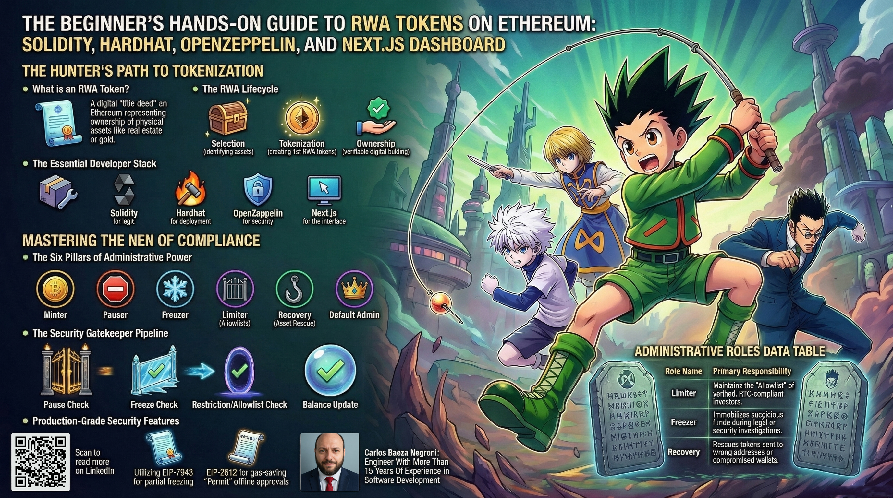
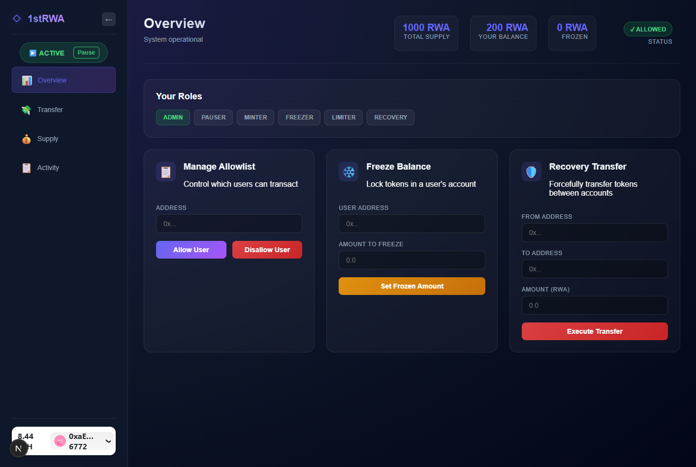

# The Beginner's Hands-On Guide to RWA Tokens on Ethereum: Solidity, Hardhat, OpenZeppelin, and Next.js Dashboard

This folder contains a comprehensive, beginner-friendly guide to building Real World Asset (RWA) tokens on Ethereum. The tutorial walks you through creating a production-grade smart contract that implements regulatory compliance features like token freezing, access restrictions, and role-based administration using OpenZeppelin's audited libraries. You'll learn Solidity fundamentals, Hardhat deployment workflows, and how to build a Next.js dashboard with Wagmi and RainbowKit for wallet interactions. The complete project includes a deployed token contract, detailed code explanations covering inheritance chains, modifiers, events, and error handling, plus a working web interface for minting, transferring, and monitoring token activity. Perfect for developers new to blockchain who want to understand how to tokenize real-world assets with proper security and compliance measures.

Feel free to check out the full content in five ways:

1. 📢 **LinkedIn announcement**: https://www.linkedin.com/posts/carlos-baeza-negroni_rwa-tokenization-solidity-activity-7441482335184773120-seSB
2. 📖 **Read the article directly on LinkedIn**: https://www.linkedin.com/pulse/beginners-hands-on-guide-rwa-tokens-ethereum-solidity-baeza-negroni-wgvlf
3. 🐦 **X/Twitter Announcement**: https://x.com/cjbaezilla/status/2035719995871654145
4. 🧩 **Project Repository**: https://github.com/cjbaezilla/Your-First-RWA-Token-Solidity-Nextjs-HandsOn-Tutorial
5. 🔍 **Browse the source**:
   [article.md](./article.md)
