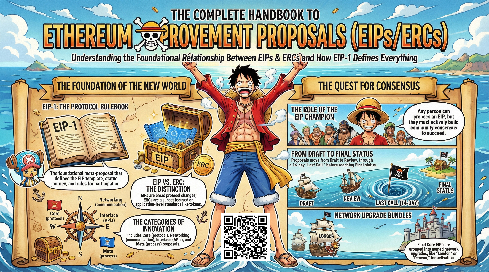

# The Complete Handbook to Ethereum Improvement Proposals (EIPs/ERCs)

This folder contains an in-depth article that serves as a complete handbook
for Ethereum Improvement Proposals (EIPs) and ERC standards. It walks through
what EIPs/ERCs are, how they are written and reviewed, the various categories
and processes involved, and how these proposals influence the protocol and
ecosystem.

Feel free to check out the full content in three ways:

1. 📢 **LinkedIn announcement** – a short post about the article: https://www.linkedin.com/posts/carlos-baeza-negroni_ethereum-eip-ethereumimprovementproposals-activity-7432524802030178304-Wnx8
2. 📰 **Read the article directly on LinkedIn**: https://www.linkedin.com/pulse/complete-handbook-ethereum-improvement-proposals-carlos-baeza-negroni-evwkf
3. 🔍 **Browse the source** here in the repo:
   [article.md](./article.md)