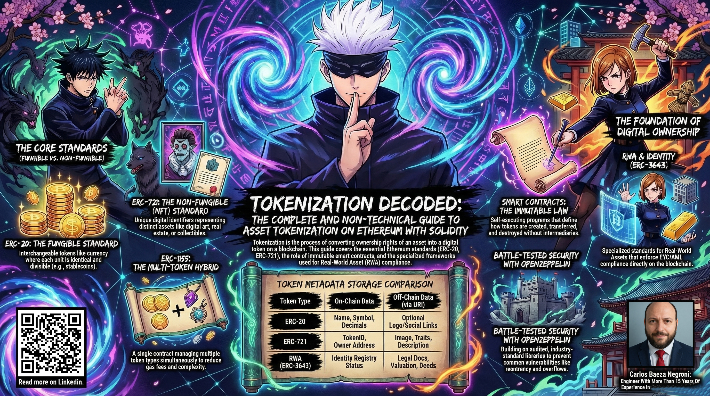
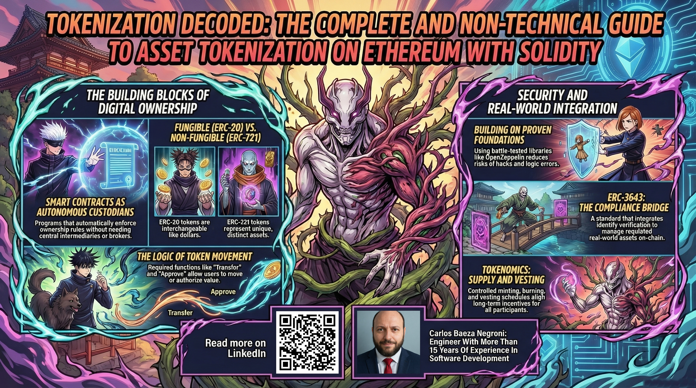
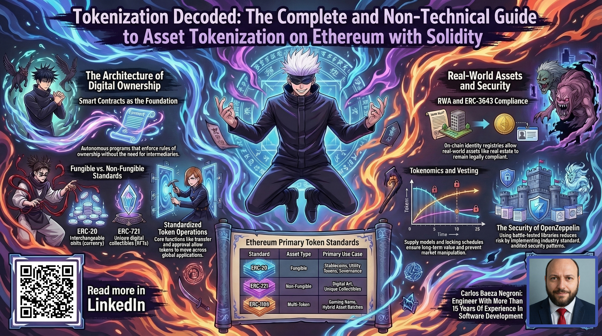
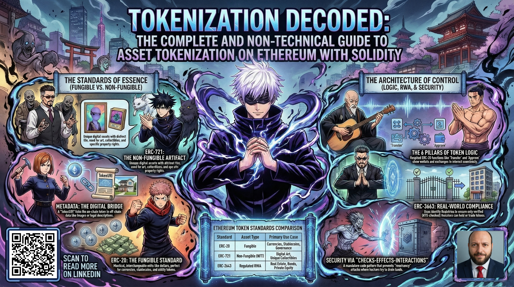
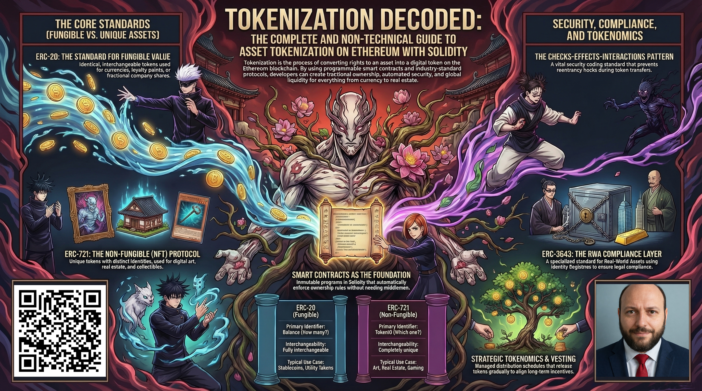

# Tokenization Decoded: The Complete Non-Technical Guide to Asset Tokenization on Ethereum with Solidity



## Executive Summary

This guide is my attempt to demystify tokenization on Ethereum for anyone who wants to understand this transformative technology, regardless of their technical background. I have organized the material to take you from complete beginner to confident practitioner, covering everything from foundational concepts to production-ready implementation. We begin with what tokenization actually means: converting rights to any asset, whether it's a currency, a piece of art, a share in a company, or loyalty points, into a digital token that lives on a blockchain. This simple idea has profound implications because these tokens are secured by cryptography, recorded on a distributed ledger, and can be transferred globally without middlemen.

I then trace the history of how tokenization emerged on Ethereum, from the early experiments to the formalization of standards that made tokens interoperable. You will learn about the three major token standards: ERC-20 for fungible tokens where each unit is identical (like dollars or stocks), ERC-721 for unique non-fungible tokens (like digital art or collectibles), and ERC-1155 which combines both in a single contract. Understanding these standards is essential because they define the rules that every token must follow to work with wallets, exchanges, and applications.

The guide dives deep into smart contracts, which are the self-executing programs that power tokens. I explain what makes a smart contract truly tokenized: it must follow a standard, maintain an on-chain ownership ledger, provide transfer functions, be immutable once deployed, and support programmability. You will see how tokens can embed complex business logic like automatic royalties, vesting schedules, or transaction fees, all enforced by code.

We explore token properties and metadata, then examine ERC-20 in detail: its six required functions (totalSupply, balanceOf, transfer, approve, transferFrom, allowance), the two critical events (Transfer and Approval), decimal handling for representing fractions, and the importance of safe math operations. I also cover essential extensions like ERC20Permit for better user experience and ERC20Votes for governance tokens with snapshotting to prevent vote manipulation.

For ERC-721, we walk through its nine required functions that handle unique tokenIds, the three required events, and the tokenURI mechanism that connects each NFT to its off-chain metadata. I discuss enumeration extensions that let you efficiently list all tokens in a collection, and safe minting practices to avoid stuck tokens.

OpenZeppelin contracts are throughout the guide because they represent the industry's best practice. I show you how to use their audited implementations to build secure tokens without reinventing the wheel. Their modular design lets you inherit exactly the features you need while maintaining compatibility.

The implementation section is a practical, hands-on walkthrough. I show you how to set up a professional development environment with Hardhat, install OpenZeppelin, write a basic ERC-20 token, add minting and burning with proper access control, extend tokens with custom logic like fees or blacklisting, and deploy to mainnet with verification. Every step includes code examples and security considerations.

Tokenomics receives extensive treatment because economic design is as important as technical implementation. We cover supply models (fixed, inflationary, deflationary), minting and burning mechanisms with proper authorization, distribution strategies (airdrops, public sales, staking rewards), vesting schedules to align long-term incentives, and value accrual mechanisms like fee redistribution, staking, and governance rights. These concepts determine whether your token will have sustainable value or collapse under poor economics.

The guide then explores real-world use cases to ground the technology in practical applications. You will see how tokenization is revolutionizing real estate, art, and commodities through fractional ownership; how digital collectibles and NFTs have created new markets for digital art; how utility tokens power decentralized applications; what makes security tokens different due to regulatory requirements; how governance tokens enable decentralized decision-making; why stablecoins matter for stability; and how loyalty programs and gaming are being transformed by true digital ownership.

Security is a thread that runs through every chapter. I detail common vulnerabilities like reentrancy and integer overflow, and explain how to defend against them using patterns like Checks-Effects-Interactions, ReentrancyGuard, and proper access control. You will learn about Ownable for simple ownership, AccessControl for fine-grained roles, and Timelock for delayed execution of sensitive actions. I also discuss testing strategies, static analysis, and the importance of multiple audits.

The development tools section covers Solidity fundamentals you need to write effective token contracts, compares Hardhat, Truffle, and Foundry, outlines comprehensive testing approaches including fuzzing, and provides gas optimization techniques to keep your contracts affordable for users. Deployment and monitoring are treated as continuous processes, not one-time events.

Regulation and compliance are unavoidable for serious projects. I explain the regulatory landscape across major jurisdictions, KYC/AML requirements, securities law considerations, and how to build compliance into your tokens from day one. This includes using standards like ERC-3643 for real-world asset tokenization, which combines identity verification, claim attestation, and transfer restrictions.

The dedicated section on ERC-3643 shows you how to implement compliant tokenization for real-world assets. You will learn about the Identity Registry that tracks verified investors, the Claim Topics Registry that defines compliance requirements, and the Compliance Module that enforces rules automatically. On-chain identity verification approaches, from centralized registries to zero-knowledge proofs, are examined.

By the end of this guide, you will have a comprehensive understanding of what tokenization is, how it works on Ethereum, how to build secure and compliant tokens, how to design sound tokenomics, and how to apply these technologies to real-world problems. I have intentionally avoided unnecessary jargon and explained technical concepts in plain language. My goal is not to overwhelm you with complexity but to empower you with practical knowledge you can apply immediately. Whether you want to create a community token, a digital collectible series, a governance system, or a regulated security token, this guide provides the foundation you need to move forward with confidence. Tokenization represents one of the most significant shifts in how we conceptualize and transfer value, and I am optimistic that with the knowledge in these pages, you can contribute meaningfully to this evolving ecosystem.



## What is Tokenization?

When I first encountered the concept of tokenization, I had a moment of clarity that felt like discovering a fundamental truth about how value could exist in the digital age. At its heart, tokenization is the process of converting rights to any asset, whether that asset is physical, digital, or conceptual, into a digital token that lives on a blockchain. This transformation is profound because it takes something that might have been difficult to divide, transfer, or verify, and turns it into a precise, programmable, and globally accessible unit of ownership and value. I find it helpful to think of it this way: just as the invention of paper money represented gold in a portable, divisible form, tokenization represents any asset in a digital form that can be moved instantly across the globe. The token itself becomes the asset, or more precisely, the authoritative proof that you own or have rights to that asset.

I want to explain what I mean by "any asset" because the scope is truly expansive. We can tokenize traditional financial instruments like stocks and bonds, turning them into tokens that can be traded without clearinghouses. We can tokenize physical real estate, breaking a building into thousands of tokens so that ordinary people can own a fraction of a property they could never afford to buy outright. We can tokenize art, allowing a masterpiece to have multiple owners who share in its appreciation. We can tokenize commodities like gold or oil, creating digital representations backed by physical reserves. We can tokenize intellectual property, so that royalties from a song or patent can be automatically distributed to the token holders. We can tokenize in-game items, loyalty points, carbon credits, or even time and expertise. The list is limited mostly by our imagination and the legal frameworks that govern each asset class. What all these examples share is that something of value, which previously existed in some constrained form, is now represented as a token that can flow freely and be programmed with rules.

The magic of tokenization happens because of blockchain technology. A blockchain is essentially a decentralized, immutable ledger that records transactions across many computers. When I create a token, I'm creating a smart contract, a program that enforces the rules about who owns what, how tokens can be transferred, and what special conditions apply. The contract lives on the blockchain, so its code is transparent and cannot be changed arbitrarily. This creates a level of trust that is difficult to achieve in traditional systems. Instead of trusting a company to maintain an accurate database of who owns shares, I can verify ownership directly on the blockchain using cryptographic proofs. The blockchain becomes the single source of truth, and the token in my wallet is my key to proving ownership.

Let me break down the key properties that make tokenized assets so powerful. First, ownership is cryptographic. When I hold tokens in my wallet, I control them with a private key that only I know. No bank, broker, or company can freeze my account or prevent me from transferring my tokens (unless the token contract itself includes such restrictions for compliance). This gives me true self-sovereignty over my assets. Second, tokens are transferable. I can send them to anyone in the world with an internet connection, typically within seconds and for a small fee. There are no bankers' hours, no international wire delays, and no high correspondent banking fees. The transfer is final and irrevocable once confirmed, which eliminates chargebacks and fraud. Third, tokens are programmable. This is perhaps the most exciting aspect because it allows us to embed complex logic directly into the asset itself. I can create a token that automatically sends a 5% royalty to the original creator every time it's sold on the secondary market. I can create a token that vest over four years, releasing gradually according to a schedule. I can create a token that can only be transferred after a certain date, or that requires both parties to be whitelisted for compliance. This programmability means tokens are not static; they can actively enforce business rules, distribute value, and coordinate complex systems without human intervention.

Fourth, tokens are transparent. All transactions are publicly visible on the blockchain. Anyone can audit the total supply, check who owns what, and verify that the contract is operating as advertised. This transparency builds trust and accountability. Fifth, tokens are divisible and combinable. Many tokens can represent fractions of a larger asset, down to many decimal places. This fractionalization unlocks liquidity for assets that were previously illiquid. I can sell 2.5% of my real estate token to raise cash without selling the whole property. I can combine ten 0.1 tokens into a full unit. Sixth, tokens are interoperable. Because tokens follow standards like ERC-20, ERC-721, or ERC-1155, they work across countless wallets, exchanges, and applications. I can move my token from one platform to another seamlessly, which creates a vibrant ecosystem of services around each token standard.

When I think about why tokenization matters, I see it as a democratizing force. It lowers barriers to entry for investments that were once reserved for the wealthy. It gives creators new ways to monetize and maintain relationships with their audiences. It enables new economic models like decentralized finance, where people can lend, borrow, and trade without intermediaries. It makes assets more liquid, which means they can be bought and sold more easily, which in turn makes them more valuable. It reduces friction in global commerce, opening new markets and opportunities. It also introduces unprecedented levels of automation and efficiency. Complex financial instruments that required lawyers, accountants, and clearinghouses can now be encoded in smart contracts that execute automatically when conditions are met.

The implications extend beyond finance. Tokenization can revolutionize supply chain management by representing physical goods as tracked tokens. It can transform identity verification by making self-sovereign identity possible. It can enable new forms of community governance where voting power is represented by tokens. It can create transparent donation systems where every token's path is visible. It can even model social relationships and reputation as transferable or burnable assets. What I find most compelling is that tokenization moves us from a world where ownership is recorded in siloed, proprietary databases to a world where ownership is expressed in a universal, open, and composable language.

I also want to be honest about the challenges. Tokenization is not a panacea. Regulatory frameworks are still evolving, and compliance requirements vary dramatically across jurisdictions. Security is paramount because bugs in token contracts can lead to irreversible loss of funds. User experience often falls short for non-technical people. Volatility can make tokens poor stores of value in the short term. And the technical complexity can be daunting for developers and users alike. But despite these challenges, I remain optimistic because the benefits are so substantial and the technology is maturing rapidly. We're seeing real-world adoption in areas like real estate tokenization platforms, securities settlement, carbon credit markets, and digital collectibles. These early successes are proving that tokenization works at scale.

Ultimately, when I talk about tokenization, I'm talking about a fundamental shift in how we conceptualize and transfer value. It's not merely a technical upgrade; it's a reimagining of ownership itself. We're moving from a world where assets are tied to specific institutions and jurisdictions, to a world where assets are expressed in code and can flow freely across borders. This shift empowers individuals, unlocks liquidity, and creates opportunities that were previously impossible. I believe we're still at the very beginning of this transformation. As the technology improves, regulatory clarity emerges, and user experience gets better, tokenization will become as ordinary as email or digital payments are today. And that's why I'm excited to guide you through this landscape, to help you understand not just how tokenization works, but how you can participate in and contribute to this evolution.

Tokenization represents one of the most significant innovations in how we handle value, and I want to make it accessible to everyone. Whether you're a complete beginner curious about the buzz around blockchain, a business owner exploring new revenue models, or an artist wanting to understand digital ownership, tokenization has something to offer. It's a tool that can reshape industries, empower creators, and give people more control over their assets. And the best part? We're all still early. There's plenty of room to learn, build, and make an impact. I'm optimistic that with the knowledge in this guide, you'll see not only the mechanics of tokenization but also the profound possibilities it unlocks.



## Core Concepts

### Fungible vs Non-Fungible Tokens

When I first try to explain the difference between fungible and non-fungible tokens to someone new to this space, I start with something they already understand: money. Think about a twenty-dollar bill in your wallet. It doesn't matter which twenty-dollar bill you have, they all have the same value. You can break it into smaller bills, combine smaller bills into larger ones, and trade it for goods and services without anyone caring about which specific bill you're using. That's fungibility in action. Each unit is identical to every other unit of the same denomination, and they can be exchanged freely. Fungible tokens on the blockchain work exactly the same way. When I hold a fungible token like USDC or a company's stock token, each unit is indistinguishable from any other unit. If I have one hundred tokens and you have one hundred tokens of the same type, we have the same thing. We can trade them one for one, split them into fractions, or combine them without any loss of value. This interchangeability is what makes fungible tokens perfect for representing currencies, commodities, shares, or any asset where the individual units don't have unique characteristics.

Let me go deeper into what this means in practice. I find it helps to think about the token's structure. With fungible tokens, there's no such thing as a specific "token number one" versus "token number two." The token is really just a number stored in a smart contract that says how many units you own. If I transfer ten tokens to you, the contract simply reduces my balance by ten and increases yours by ten. There's no record of which specific tokens moved because they're all the same. This simplicity has profound implications. For one, liquidity becomes straightforward because anyone can buy or sell any amount at the prevailing market price, just like trading dollars. Pricing is easy: one token always equals one token, so the value is expressed in terms of how many tokens you have, not which tokens you have. The mathematics stays clean and predictable. Fungible tokens also enable elegant financial mechanisms like automated market makers, where you can swap one token for another based on a simple equation. The entire decentralized finance ecosystem is built on this foundation of fungibility because it allows for efficient, atomic trades without needing to match specific items.

Now let me contrast this with non-fungible tokens, which are sometimes called NFTs. Here the analogy shifts from money to something like a house or a painting by a famous artist. If I own the Mona Lisa, that specific painting is unique. There's no other Mona Lisa in the world. Even if someone creates an exact copy, the original has a different value because it's the authentic, original piece. The uniqueness matters. Non-fungible tokens capture this property on the blockchain. Each NFT has a unique identifier, called a token ID, that distinguishes it from every other token in the collection. Even if I create a collection of a thousand NFTs that all look similar, each one has its own distinct token ID and is stored separately in the smart contract. When I own token #42 of a collection, I own that specific token, not just "one of a thousand." I can't simply split it into fractions, because token #42 is one complete item. This uniqueness opens up entirely different use cases that fungible tokens can't address.

I want to explore the technical differences more thoroughly because they reveal why these token types behave so differently. With fungible tokens, the smart contract maintains a simple mapping: address => balance. That's it. The entire state of who owns what is just numbers in a table. With non-fungible tokens, the contract maintains two separate mappings: tokenId => owner, and optionally tokenId => approval or tokenId => operator approvals. There's also often a mapping from owner => list of tokenIds they own, especially if the contract supports enumeration. The state becomes more complex because each token is an individual entity that needs to be tracked separately. This explains some of the gas cost differences: minting a thousand fungible tokens at once is essentially just increasing one balance by a thousand, while minting a thousand NFTs requires creating a thousand separate records and potentially updating owner enumerations. The technical architecture reflects the fundamental economic difference.

When I think about how these tokens get used, the divergence becomes even clearer. Fungible tokens thrive in scenarios where quantity and divisibility matter. Think about stablecoins: I might want to send 2.75 USDC to a friend, exactly. Or consider loyalty points: if I earn 500 points from a purchase, those points are identical to anyone else's 500 points and can be spent in any combination. Imagine a tokenized stock: if I own 15 shares of a company through tokens, those shares are interchangeable with anyone else's 15 shares. The applications span payments, remittances, treasury management, utility tokens inside applications, reward systems, and governance tokens where voting power is proportional to quantity. In all these cases, the individual unit doesn't have special meaning; what matters is the aggregate amount you hold.

Non-fungible tokens unlock a completely different dimension. They become valuable when the specific item matters. Digital art and collectibles are the most obvious application: the token proves you own the original version of a digital piece, and that ownership is verifiable on the blockchain. But I see NFTs doing much more. Virtual real estate in metaverse platforms uses NFTs to represent specific parcels of land, where location matters. Gaming items, such as a sword, a character skin, or a special hat, are often NFTs because each item has unique attributes or scarcity. Identity credentials could be NFTs where the specific credential matters, like a college diploma or a professional certification. Event tickets are exploring NFTs because each ticket corresponds to a specific seat or entry pass. Domain names on blockchain naming services are NFTs. Even real-world assets can be represented as NFTs, though typically high-value unique assets like a specific painting or a specific piece of real estate, where the asset itself has unique characteristics that cannot be divided. The common thread is that ownership of the specific token represents ownership of the specific underlying item.

There's also an interesting middle ground that I think deserves mention, even though it's not the main focus: semi-fungible tokens. The ERC-1155 standard introduced this concept. Think about concert tickets: you might have 500 identical general admission tickets, and any one is equivalent to any other for entry purposes; they're fungible among themselves. But the 500 tickets are different from 500 VIP tickets, and each individual ticket has a unique seat number that matters for specific assignment. This is semi-fungible: tokens of the same class are interchangeable, but different classes are distinct, and sometimes individual tokens have unique identifiers within their class. This bridges the gap between the two extremes and shows how the spectrum is more nuanced than just binary categories.

The economic models differ substantially as well, which affects how I think about value. With fungible tokens, value is derived from supply, demand, utility, and sometimes from the underlying asset in tokenized securities. The economics are relatively straightforward: total supply, circulating supply, inflation or deflation mechanisms. With non-fungible tokens, value becomes much more subjective and tied to scarcity, provenance, artistic merit, cultural significance, and utility within a specific ecosystem. A single NFT can be worth millions while another from the same collection might be nearly worthless, depending on traits, rarity, creator reputation, and community perception. This creates a market that's more like art collecting than like trading currencies. I can't simply say "all NFTs are worth X" because each one is unique.

From a user experience perspective, the differences manifest in how I interact with these tokens. When I use a fungible token wallet, I see a simple number: 150.75 USDC. It's clean. With NFTs, my wallet might show a gallery of individual items, each with its own image, name, and attributes. I need to see which specific token I'm holding. The transfer experience differs too: sending fungible tokens is like sending an amount, while sending an NFT means selecting the specific token to send from my collection. This might seem like a minor detail, but it shapes the entire design of applications around these tokens.

I also want to address a common confusion that I encounter when talking to newcomers. The distinction between fungible and non-fungible isn't about whether the token is on the blockchain, both types are. It's not about whether it can be traded, both can. It's specifically about whether each unit is indistinguishable and interchangeable from every other unit of the same type. That's the core property that determines everything else: how the smart contract is designed, what the wallet displays, how marketplaces operate, how liquidity pools work, how values are determined, and which use cases make sense.

When I consider the historical development, it's fascinating to see how both types evolved. Fungible tokens came first with ERC-20 in 2015, enabling the ICO boom and later the explosion of DeFi. Non-fungible tokens followed with ERC-721 in 2018, catalyzing the NFT movement. Each standard solved different problems and enabled different applications. But they share the same underlying philosophy: creating digital assets that users truly own, that can move freely, and that are secured by cryptography rather than by a company's database. Whether I'm holding fungible tokens for international payments or an NFT representing my digital art collection, I'm experiencing the same fundamental shift toward user sovereignty.

For someone completely new to this space, I often say: think of fungible tokens as digital money or shares, and think of non-fungible tokens as digital collectibles or deeds. That's an oversimplification but a helpful starting point. As you learn more, you'll see that the line can blur in interesting ways, and the creative applications continue to expand. But at the heart of it all is that simple question: does each individual unit have its own identity and value, or are all units the same? The answer determines everything about how the token works and what it's good for.

### Smart Contracts as the Foundation

When I first learned about smart contracts, I realized they are the beating heart of tokenization. A smart contract is simply a program that runs on the Ethereum blockchain and automatically enforces its own rules. Unlike traditional software that runs on a server controlled by a company, a smart contract lives on a decentralized network of computers and cannot be altered once deployed. This immutability is crucial for trust: when I create a token via a smart contract, I know the rules will execute exactly as written, without any possibility of interference. The contract holds the code that defines how tokens are created, transferred, and destroyed. For example, an ERC-20 token contract includes functions that let anyone check the total supply, query balances, and move tokens between accounts. The contract also emits events that publicly log important actions. I find it remarkable that a smart contract essentially acts as an autonomous custodian of the token. There is no central authority managing the token; the contract itself handles everything. This self-executing nature eliminates middlemen and reduces the need to trust any single entity. For developers, smart contracts are written in languages like Solidity, which compiles to bytecode that the Ethereum Virtual Machine can execute. Once deployed, the contract's address becomes a permanent fixture on the blockchain, and anyone can interact with it by sending transactions. Understanding smart contracts is foundational because every token, whether fungible or non-fungible, is just an instance of a carefully crafted contract that follows a standard.

Let me spend more time on what makes smart contracts so transformative. Imagine a vending machine: you insert money, press a button, and the machine automatically gives you a snack. The machine follows programmed rules without needing a human operator. Smart contracts are like digital vending machines that run on a global network instead of in a physical location. Once the contract is deployed, it sits on the blockchain waiting for someone to interact with it. When you send a transaction to the contract, the Ethereum network executes the code exactly as written, and the state changes are recorded on the blockchain for everyone to see. There is no CEO who can change the rules later, no server that can crash, and no intermediary that can freeze your assets. The contract is the rulebook, the enforcer, and the record-keeper all in one.

What I find most powerful is that the contract's code is transparent. Anyone can read it before interacting with it. You don't have to take my word that the token will behave as promised; you can verify the code yourself or have an expert review it. This transparency creates a level of accountability that is rare in traditional finance. When a bank tells you your money is safe, you're trusting their promises and their regulators. When a token contract says your tokens can't be minted beyond a certain cap, you can see that rule in the code and know that the blockchain will enforce it forever. The contract doesn't have bad days, it doesn't make mistakes, and it doesn't act out of self-interest. It simply does what it was programmed to do, every single time.

I should also explain how smart contracts interact with the blockchain itself. The blockchain is a shared, immutable ledger that records all transactions. When a smart contract changes state, for example when tokens move from Alice to Bob, that change is recorded in a new block along with the transaction that triggered it. Because the ledger is distributed across thousands of computers, no single actor can alter the record. This means that ownership of tokens is secure against forgery and censorship. If a government tried to seize my tokens, they couldn't just ask a company to freeze my account; they would have to attack the entire Ethereum network, which is economically infeasible. The smart contract gives me direct control over my assets through cryptographic keys.

From a technical perspective, I appreciate that smart contracts are deterministic. Given the same inputs and the same initial state, they will always produce the same outputs. This predictability is essential for building systems that people can rely on. If I send a transaction to transfer tokens, I know exactly what will happen: my balance decreases, someone else's balance increases, and an event is logged. There is no randomness or human judgment involved. This deterministic nature also makes contracts auditable and testable. Before deployment, developers can run the contract through thousands of simulated transactions to verify that it behaves correctly under all conditions.

The cost aspect is worth mentioning as well. Every operation a smart contract performs costs a small fee called gas. This fee compensates the miners or validators who execute the code and secure the network. While this creates a cost for each transaction, it also means that the network is sustainable and that spam is deterred. For the average user, gas fees can be noticeable, but they're transparent: you see the cost upfront before confirming a transaction. There is no hidden fee schedule or surprising monthly charge.

In practice, I interact with token contracts through wallet applications like MetaMask. My wallet knows the standard interface for ERC-20 or ERC-721 tokens, so when I want to check my balance, it calls the appropriate function on the contract and displays the result. When I want to send tokens, my wallet constructs and signs a transaction that calls the transfer function. All of this happens through simple user interfaces that hide the blockchain complexity, but underneath, smart contracts are doing the work.

I must be honest about limitations too. Smart contracts are only as good as their code. A bug can lead to unintended behavior, and because contracts are immutable, fixing a deployed contract often requires deploying a new one and migrating users. This is why careful development, testing, and auditing are non-negotiable. Also, smart contracts can't access information outside the blockchain directly; they need oracles to bring in external data like stock prices or weather conditions. And they have no inherent sense of time beyond block timestamps, which miners can manipulate slightly. These constraints shape how we design token systems.

Despite these challenges, I remain deeply optimistic about smart contracts as the foundation of tokenization. They give us a way to encode trust directly into digital systems. They enable new economic models that were impossible before. They put power in the hands of individuals rather than institutions. Every day, I see more sophisticated applications built on these simple building blocks, from decentralized finance to supply chain tracking to digital identity. The fact that a piece of code can reliably manage ownership, enforce rules, and coordinate activity across a global network is nothing short of revolutionary. Smart contracts are not just a technology; they represent a new way of organizing economic activity, and I'm convinced they will become as fundamental to our digital future as the internet itself.

### What Makes a Smart Contract Tokenized?

When I think about what makes a smart contract truly tokenized, I realize it's not enough to simply call any contract a token. Tokenization follows specific patterns and standards that give the contract its special properties. In my experience, a contract earns the label 'tokenized' when it meets several key criteria that together create a reliable, interoperable digital asset. Let me walk you through each characteristic in detail, because understanding these fundamentals will help you recognize what makes a token work and why certain design choices matter.

The most obvious hallmark is adherence to a recognized token standard. Whether it's ERC-20 for interchangeable tokens, ERC-721 for unique items, or ERC-1155 for hybrid collections, the contract implements a precise set of functions that the wider ecosystem expects. This isn't just about checking boxes; it's about ensuring that any wallet, exchange, or application can interact with the token without special permissions or custom code. I've seen projects try to roll their own token standard and end up isolated because nothing could read their balances. Standards are the glue that holds the token economy together.

Let me explain why standards matter so much. When you use a wallet like MetaMask to view your tokens, that wallet knows how to talk to ERC-20 tokens because there's a agreed-upon interface. The wallet calls the balanceOf function to show your balance, the symbol function to show the ticker, and the decimals function to understand how to display amounts. If your contract doesn't implement these functions exactly as specified, your token becomes invisible or unusable in standard tools. The same goes for decentralized exchanges like Uniswap: they rely on standardized interfaces to enable trading. Without standards, we'd have a fragmentation problem where every token needs custom integration work. Standards create composability, meaning your token can plug into existing infrastructure seamlessly. This is why I always build from established standards like OpenZeppelin's implementations rather than starting from scratch.

Beyond just following a standard, a tokenized contract does something fundamental: it represents ownership. Whether it's ownership of a currency, a piece of art, a share in a company, or a loyalty point, the token in your wallet proves you own it. This ownership is tied to a cryptographic key that only you control. The contract itself maintains a ledger, typically a mapping, that shows which blockchain address owns how many tokens. There's no central database that could be altered; the mapping is stored on the blockchain and can be verified by anyone.

I want to spend time on this ownership concept because it's revolutionary. In traditional systems, ownership is recorded in a database owned by some institution. Your bank says you have $10,000, but really they have a database entry that they could theoretically change. If the bank gets hacked, your balance could be altered. If the bank decides to freeze your account, they can. With tokenized ownership, the ledger is the blockchain itself, and no single entity controls it. If the token contract says that address 0xabc123 owns 100 tokens, then that address owns 100 tokens, full stop. The only way to change that is to have the private key controlling that address sign a transaction that transfers the tokens. This gives you true self-sovereignty: you don't need permission from anyone to hold or transfer your tokens. This concept extends to any asset that can be tokenized. Imagine owning a fraction of a painting through a token. The token's ownership record on the blockchain is the proof that you own that fraction. You could sell it without involving an auction house, you could prove your ownership to anyone who asks, and no gallery could tell you that you can't transfer your share. This is a fundamental shift in how we conceive of ownership.

The contract also provides the machinery to move tokens. It has functions that allow you to transfer your tokens to someone else, to approve someone else to move tokens on your behalf, and to check balances. These functions are callable by anyone who holds the private key for the address that owns tokens (or has been approved). When a transfer happens, the contract updates its internal ledger and emits an event that gets recorded on the blockchain forever. This event is how the outside world knows a transfer occurred; wallets use it to update your balance display, explorers use it to show transaction history, and analytics platforms use it to track flows.

Let me break down this transfer mechanism because it's subtle but important. When you send tokens, you're not actually sending them anywhere in the physical sense. You're calling a function on the smart contract that changes the mapping: it subtracts from your balance and adds to someone else's balance. That's it. The tokens don't move; the ledger updates. Because this update happens on the blockchain, it's permanent and irreversible. Once the transaction is confirmed, the new ownership state is the truth. There's no way to undo it unilaterally. The events that get emitted are like public announcements: "Alice sent 50 tokens to Bob at 3:42 PM." These events are indexed so that applications can easily filter and search them. Your wallet listens for these events to update your balance automatically without you needing to manually refresh. This event-driven architecture is what makes blockchain applications feel responsive even though the underlying state changes happen on a shared ledger.

What makes this particularly powerful is that the contract is immutable. Once deployed, its code cannot be changed. This means the rules are set in stone, literally encoded in the blockchain's history. If I create a token with a fixed supply of one million, that cap remains forever. If I include a mechanism where 1% of every transaction gets burned, that's permanent. This immutability creates trust. Participants don't need to trust me or any company; they can read the code and know exactly what will happen. There's no way to later alter the terms to favor insiders or change the economics.

I should elaborate on immutability because it's both a strength and a constraint. On the positive side, immutability means that once a token contract is deployed, its behavior is guaranteed. No developer can wake up one day and decide to mint more tokens for themselves. No government can pressure the team to blacklist certain addresses. The code is the law, and the law cannot be amended arbitrarily. This gives token holders confidence that their assets won't be subject to unexpected changes. On the other hand, if there's a bug in the contract, we can't simply patch it like we would with traditional software. We would have to deploy a new contract and migrate users, which is complicated and often results in some value being left behind. This is why immutability must be balanced with extreme care before deployment. We test thoroughly, we get multiple independent audits, and we often include upgrade mechanisms only when absolutely necessary, using proxy patterns that allow controlled changes while maintaining transparency. But even then, any upgrade requires consensus and clear communication. The principle is: change is hard by design, because that protects users from malicious or careless changes.

Tokenization also introduces programmability. Unlike physical assets or even traditional digital assets, tokens can have logic built into them. I could create a token that automatically sends a royalty to the original creator every time it's sold. I could create a token that vests over time, releasing gradually according to a schedule. I could create a token that can only be transferred after a certain date, or that requires whitelisting for compliance. This programmability means tokens aren't just static representations; they're dynamic instruments that can enforce complex business rules automatically.

Programmability is where tokenization becomes truly exciting. We're not just replicating existing asset classes in digital form; we're inventing new ones. Think about a token that represents a subscription service: the token could automatically become inactive after 30 days unless renewed. Or a token that splits revenue automatically among multiple stakeholders based on percentages encoded in the contract. Or a token that requires multiple signatures to transfer, like a multisignature vault for a company's treasury. Or a token that changes its properties based on external conditions, for instance a carbon credit token that becomes non-transferable once it's retired to offset emissions. The possibilities are limited only by what we can imagine and implement in code. This ability to embed business logic directly into the asset itself reduces the need for intermediaries, lowers transaction costs, and eliminates disputes because the rules are executed exactly as written without human interpretation.

Another defining feature is that the token itself is the asset. There's no separate legal document or off-chain ledger that says who owns what. The blockchain IS the ledger. If you hold the private keys to an address that the contract says owns tokens, you own those tokens. This is a radical shift from how most assets work today, where ownership is recorded in some company's database that could be hacked, corrupted, or manipulated. Here, ownership is cryptographically secured and globally verifiable.

I want to emphasize this point because it's so fundamental. When you buy shares in a traditional company, your ownership is recorded in the company's shareholder registry, which is maintained by a transfer agent. That registry is a centralized database. If it gets corrupted, you could lose your shares. If the transfer agent goes bankrupt, you might be stuck in a messy legal process. With tokenized assets, the ledger is distributed across thousands of nodes. Even if some nodes go offline or try to lie, the network as a whole maintains consensus on the true state. Your ownership is not dependent on any single entity's continued good operation. This is what we mean by censorship resistance: no one can prevent you from holding or transferring your tokens as long as you control your private keys. Of course, this also means you are responsible for securing those keys. If you lose your private key, you lose access to your tokens permanently, because there's no central authority that can reset your password. This trade-off between self-sovereignty and individual responsibility is central to the ethos of tokenization.

In my experience, when a contract exhibits all these characteristics, it follows a standard, it maintains an on-chain ownership ledger, it provides transfer functions, it's immutable, and it's programmable; that's when I can confidently say it's a tokenized contract. It's not just a smart contract; it's a smart contract specifically designed to create and manage digital tokens that represent value. There are many smart contracts that do other things, like facilitating auctions or managing decentralized organizations. A tokenized contract has the specific purpose of representing and transferring ownership of an asset.

The beauty of this is that it democratizes access to assets. I could tokenize a piece of real estate, breaking it into a thousand tokens, and allow anyone to buy a fraction. I could tokenize a digital artwork and ensure the artist gets a cut forever. I could create loyalty points that customers can actually trade rather than being stuck with a company's gift card. Tokenization transforms static assets into fluid, tradable, programmable entities. It's not just a technological upgrade; it's a reimagining of ownership itself.

Let me give a concrete example that ties these characteristics together. Suppose I want to create a token that represents membership in a community. I would deploy a smart contract that follows the ERC-20 standard so it's compatible with wallets. The contract would maintain a ledger of which addresses hold how many membership tokens. These tokens themselves are the proof of membership. I could make the token transferable only after a certain date by programming that rule into the contract. I could include a small fee on each transfer that goes to a community treasury, and that fee would be automatic, requiring no collection agency. I could even make the token confers voting rights on community proposals, with voting power proportional to the number of tokens held, using snapshot mechanisms to prevent manipulation. None of this would require a membership office, a paper ledger, or manual accounting. The smart contract handles everything, and because it's on the blockchain, the rules are transparent and immutable. Members can verify the code themselves, and they can trust that the rules will be enforced exactly as written.

But with this power comes responsibility. A tokenized contract must be implemented flawlessly because the stakes are high. A bug could allow someone to mint infinite tokens, steal others' holdings, or lock everyone out. That's why I always rely on battle-tested libraries like OpenZeppelin, why I write exhaustive tests, and why I get multiple audits before deploying any token that will hold real value. The contract is the law; if there's a flaw, the law works in unexpected ways.

I should say more about security because it's non-negotiable. When I build a token contract, I start with the assumption that anything that can go wrong will go wrong. I think like an attacker: where could I drain funds? Where could I manipulate balances? Could I cause a denial of service? Could I exploit rounding errors? I use established patterns that have been proven safe through years of use and thousands of hours of audit scrutiny. I avoid complex logic that introduces edge cases. I keep functions simple and focused. I use access control carefully, ensuring only authorized addresses can perform sensitive operations like minting or pausing. I implement reentrancy guards to prevent recursive calls that drain contracts. I use the latest version of Solidity and OpenZeppelin to benefit from all the safety improvements that have been learned from past hacks. And I don't deploy to mainnet until the contract has been tested in every scenario I can imagine and reviewed by experts. The reality is that smart contracts handle real value, and a single mistake can result in irreversible losses. There is no customer support to reverse a fraudulent transaction. There is no FDIC insurance. So I approach development with humility and rigor.

In the end, what makes a contract tokenized is its purpose and its pattern. It exists specifically to represent and manage digital ownership of something valuable, using a standardized interface that the world understands. It's a contract that turns abstract value into concrete, transferable, programmable tokens. That transformation is at the heart of what we're building. It's not just about making a digital coin; it's about creating a new primitive for human coordination and value exchange. When I deploy a token contract, I'm not just deploying code; I'm deploying a piece of economic infrastructure that people will rely on. That means I need to get it right, because others will build on top of it and trust it with their assets. That responsibility weighs heavily on me, but it also excites me, because I know that done well, these contracts can empower people in ways traditional systems never could.



## ERC-20: The Fungible Token Standard

When I think about what made tokenization truly take off on Ethereum, I keep coming back to one moment: the creation of ERC-20. This standard, proposed in 2015, gave us a common language for fungible tokens, which are digital assets where each unit is exactly the same as every other unit, like dollars in your bank account or shares in a company. Before ERC-20, every token project had its own way of doing things, and wallets couldn't reliably read balances or send transfers. The ecosystem was fragmented. ERC-20 changed that by defining a precise set of functions that every compliant token must implement. This seemingly simple idea unlocked interoperability: once wallets, exchanges, and applications learned to talk to one ERC-20 token, they could talk to all of them. That's the power of standards. I want to walk you through ERC-20 in detail, showing not just what it does but why each piece matters and how you'd actually build one.

### The Six Essential Functions

Every ERC-20 token implements exactly six required functions. These form the contract's public interface, and they're what make tokens work across the entire ecosystem. Let me show you each one with practical code examples. When you use a wallet like MetaMask to check your token balance or send tokens to a friend, these are the functions being called behind the scenes.

The first function is `totalSupply()`. It returns the total number of tokens that exist. This might seem straightforward, but it's crucial for transparency; anyone can verify the circulating supply at any time.

```solidity
function totalSupply() external view returns (uint256);
```

The second function is `balanceOf(address account)`. This returns how many tokens a specific address holds. Wallets call this constantly to display your balance.

```solidity
function balanceOf(address account) external view returns (uint256);
```

The third function is `transfer(address to, uint256 amount)`. This is the most basic way to send tokens from your wallet to someone else. When you click "send" in your wallet, it's calling this function.

```solidity
function transfer(address to, uint256 amount) external returns (bool);
```

Here's how OpenZeppelin's ERC20 implementation handles this:

```solidity
function transfer(address to, uint256 amount) public virtual override returns (bool) {
    address owner = _msgSender();
    _transfer(owner, to, amount);
    return true;
}
```

The fourth function is `approve(address spender, uint256 amount)`. This allows you to authorize another address (like a decentralized exchange) to spend your tokens up to a certain limit. Without this, services couldn't move tokens on your behalf.

```solidity
function approve(address spender, uint256 amount) external returns (bool);
```

The fifth function is `transferFrom(address from, address to, uint256 amount)`. Once you've approved someone, they use this function to actually move your tokens. This is how Uniswap and other DEXs handle trades: you approve first, then the exchange calls transferFrom to execute the swap.

```solidity
function transferFrom(address from, address to, uint256 amount) external returns (bool);
```

The sixth and final required function is `allowance(address owner, address spender)`. This returns how many tokens an owner has approved a spender to use. Wallets and exchanges call this to show current allowance values.

```solidity
function allowance(address owner, address spender) external view returns (uint256);
```

### Required Events: The Immutable Record

Events are how the blockchain permanently logs important actions. They're critical because every wallet, explorer, and analytics platform relies on them to track what's happening. Think of events as public announcements that get written into the blockchain forever.

ERC-20 requires two events. The first is `Transfer(address indexed from, address indexed to, uint256 value)`. This logs every token movement, including both regular transfers and the special cases of minting (from = address(0)) and burning (to = address(0)).

```solidity
event Transfer(address indexed from, address indexed to, uint256 value);
```

The second required event is `Approval(address indexed owner, address indexed spender, uint256 value)`. This logs every time an allowance is set or changed.

```solidity
event Approval(address indexed owner, address indexed spender, uint256 value);
```

What's important to understand is that these events aren't just for show. They're how your wallet knows your balance updated without you refreshing. When a transfer occurs, the transaction emits a Transfer event. Your wallet listens for events with your address in the `from` or `to` fields and automatically updates your displayed balance. Block explorers like Etherscan use these events to show your transaction history. Without proper events, your token would be invisible to the ecosystem.

### Minting and Burning Mechanisms

When I think about token supply management, minting and burning are the two fundamental operations that determine how many tokens exist at any given time. These mechanisms are central to token economics because they directly affect scarcity, value, and incentive alignment. Let me explain these concepts clearly, show practical implementations, and help you understand which patterns work best for different use cases.

**What minting and burning really mean**

Minting creates new tokens and adds them to circulation. Think of it like printing money, but with rules enforced by code that everyone can see. When I mint tokens, the total supply increases and those tokens appear in a designated wallet. Burning does the opposite: it permanently removes tokens from existence, usually by sending them to an unreachable address like `0x000000000000000000000000000000000000dEaD`. This reduces the total supply and can create deflationary pressure over time.

Both operations must be implemented with proper access controls because they're powerful. Anyone being able to mint would create infinite supply and destroy value. Similarly, anyone being able to burn tokens from any wallet would be disastrous. The key is ensuring only authorized parties can perform these actions while keeping the rules transparent on the blockchain.

**Implementing minting safely**

OpenZeppelin's ERC20 contract provides the internal `_mint(address account, uint256 amount)` function that handles all the accounting correctly and emits the proper Transfer event. I call this from my own external functions that include access control. Here's the simplest pattern where only the contract owner can mint:

```solidity
import "@openzeppelin/contracts/token/ERC20/ERC20.sol";
import "@openzeppelin/contracts/access/Ownable.sol";

contract SimpleMintableToken is ERC20, Ownable {
    uint256 public constant MAX_SUPPLY = 1_000_000_000 * 10**18;
    
    constructor() ERC20("My Token", "MTK") {
        _mint(msg.sender, 100_000_000 * 10**18); // Initial supply
    }
    
    function mint(address to, uint256 amount) external onlyOwner {
        require(totalSupply() + amount <= MAX_SUPPLY, "Exceeds maximum supply");
        _mint(to, amount);
    }
}
```

This pattern works well when a single company or team controls token issuance. The supply cap protects holders from unlimited inflation. Notice the `require` statement that enforces the cap; this is crucial for maintaining trust.

For more decentralized systems, I use role-based access control:

```solidity
import "@openzeppelin/contracts/token/ERC20/ERC20.sol";
import "@openzeppelin/contracts/access/AccessControl.sol";

contract RoleBasedToken is ERC20, AccessControl {
    bytes32 public constant MINTER_ROLE = keccak256("MINTER_ROLE");
    bytes32 public constant BURNER_ROLE = keccak256("BURNER_ROLE");
    
    constructor() ERC20("Community Token", "COMM") {
        _grantRole(DEFAULT_ADMIN_ROLE, msg.sender);
        _grantRole(MINTER_ROLE, msg.sender);
    }
    
    function mint(address to, uint256 amount) external requiresRole(MINTER_ROLE) {
        _mint(to, amount);
    }
    
    function burn(address from, uint256 amount) external requiresRole(BURNER_ROLE) {
        _burn(from, amount);
    }
}
```

This approach lets me grant minting authority to multiple addresses or even a multisig wallet controlled by a DAO. The `requiresRole` modifier (from OpenZeppelin's AccessControl) ensures only authorized addresses can execute sensitive operations.

**When and why to burn tokens**

Burning is straightforward with `_burn(address account, uint256 amount)`. I typically expose a public burn function so anyone can destroy their own tokens, which is useful for deflationary mechanisms:

```solidity
function burn(uint256 amount) external {
    uint256 balance = balanceOf(msg.sender);
    require(balance >= amount, "Insufficient balance");
    _burn(msg.sender, amount);
}
```

But I also implement controlled burning from any address when needed:

```solidity
function burnFrom(address account, uint256 amount) external {
    _spendAllowance(account, msg.sender, amount);
    _burn(account, amount);
}
```

The `burnFrom` pattern works like `transferFrom`. The burner must first be approved to spend the tokens, then can burn them. This is useful for protocols that take a fee and burn part of it automatically.

**Combining mint and burn with transaction fees**

One of the most powerful patterns I've implemented is embedding automatic fees in transfers, where part goes to a treasury and part gets burned. This creates an economic system that rewards holders and funds development:

```solidity
import "@openzeppelin/contracts/token/ERC20/ERC20.sol";
import "@openzeppelin/contracts/access/Ownable.sol";

contract FeeAndBurnToken is ERC20, Ownable {
    uint256 public feeBasisPoints = 50; // 0.5% = 50 basis points
    address public treasury;
    address public immutable burnAddress = 0x000000000000000000000000000000000000dEaD;
    
    constructor() ERC20("Deflationary Token", "DEFL") {
        treasury = msg.sender;
        _mint(msg.sender, 1_000_000_000 * 10**18);
    }
    
    function _transfer(address from, address to, uint256 amount) internal override {
        if (feeBasisPoints > 0 && from != treasury && to != treasury) {
            uint256 fee = (amount * feeBasisPoints) / 10_000;
            uint256 transferAmount = amount - fee;
            
            // Send the main transfer
            super._transfer(from, to, transferAmount);
            
            // Send fee portion to treasury
            if (fee > 0) {
                super._transfer(from, treasury, fee);
            }
        } else {
            super._transfer(from, to, amount);
        }
    }
    
    // Treasury can periodically burn tokens
    function burnFromTreasury(uint256 amount) external onlyOwner {
        _burn(treasury, amount);
    }
    
    function setFeeBasisPoints(uint256 newFee) external onlyOwner {
        require(newFee <= 200, "Fee cannot exceed 2%"); // Safety cap
        feeBasisPoints = newFee;
    }
}
```

This token takes a 0.5% fee on every transfer, which accumulates in the treasury. The owner can periodically burn tokens from the treasury, creating a deflationary effect. The burn address is set to the standard dead address so burned tokens are provably unrecoverable.

**More on Adding Transfer Fees**

Many tokens take a small fee on each transfer, either to fund a treasury or create deflation through burning. I implement this by overriding the internal _transfer function in ERC20. I calculate the fee using basis points (hundredths of a percent) to keep everything in integer math. The key is to split the transfer into two parts: the fee goes to the treasury, the remainder to the recipient. I also handle the zero-fee case to save gas, and I'm careful to call super._transfer for each portion so the standard logic runs correctly.

Here's a complete implementation:

```solidity
// SPDX-License-Identifier: MIT
pragma solidity ^0.8.20;

import "@openzeppelin/contracts/token/ERC20/ERC20.sol";
import "@openzeppelin/contracts/access/Ownable.sol";

contract FeeToken is ERC20, Ownable {
    uint256 public feeBasisPoints; // 100 = 1%, 50 = 0.5%, 0 = no fee
    address public treasury;

    constructor(uint256 _feeBasisPoints, address _treasury) 
        ERC20("Fee Token", "FEE")
    {
        feeBasisPoints = _feeBasisPoints;
        treasury = _treasury;
        _mint(msg.sender, 1_000_000 * 10**decimals());
    }

    function setFee(uint256 newFeeBasisPoints) external onlyOwner {
        require(newFeeBasisPoints <= 500, "Fee cannot exceed 5%");
        feeBasisPoints = newFeeBasisPoints;
    }

    function setTreasury(address newTreasury) external onlyOwner {
        require(newTreasury != address(0), "Invalid address");
        treasury = newTreasury;
    }

    function _transfer(address from, address to, uint256 amount) 
        internal 
        override 
    {
        // Fast path: no fee configured
        if (feeBasisPoints == 0 || treasury == address(0)) {
            super._transfer(from, to, amount);
            return;
        }

        // Calculate fee (multiply first to maintain precision)
        uint256 fee = (amount * feeBasisPoints) / 10_000;
        uint256 transferAmount = amount - fee;

        // If fee rounds to zero, do simple transfer to save gas
        if (fee == 0) {
            super._transfer(from, to, amount);
            return;
        }

        // Send fee to treasury, remainder to recipient
        if (transferAmount > 0) {
            super._transfer(from, treasury, fee);
            super._transfer(from, to, transferAmount);
        } else {
            // Entire amount is fee
            super._transfer(from, treasury, amount);
        }
    }

    // Keep token functions always enabled
    function _beforeTokenTransfer(address from, address to, uint256 amount)
        internal
        override
    {
        super._beforeTokenTransfer(from, to, amount);
    }
}
```

**Real-world patterns and use cases**

I've seen minting implemented in various scenarios. For token vesting, tokens are minted gradually according to a schedule rather than all at once. This aligns long-term incentives for team members and investors. A common approach is to create a separate vesting contract that holds minting authority and releases tokens over time.

For airdrops, I often mint tokens to a distribution contract that then disperses them to eligible addresses. This allows controlled distribution without giving the airdrop manager unlimited minting power.

For staking rewards, I implement a mint function that can only be called by the staking contract, with daily or per-block limits to prevent excessive inflation.

Burning patterns I've used include: automatic burn on every transfer (like the fee token above), manual burns from treasury to reduce supply, burns as part of token redemption (users burn tokens to access a service), and burns triggered by specific events (like burning NFT items when they're used in gameplay).

**Key security reminders**

I must emphasize a few critical points. First, never expose `_mint` and `_burn` directly. Always wrap them in functions that include access control and validation. Second, always implement a supply cap unless you specifically want unlimited inflation. Third, use OpenZeppelin's audited implementations rather than writing your own balance manipulation logic. Fourth, test thoroughly, especially edge cases around zero amounts, maximum values, and reentrancy. Fifth, consider using OpenZeppelin's `ERC20Burnable` and `ERC20Capped` extensions; they're well-tested and save you from reinventing the wheel.

When you design your minting and burning mechanisms, think about the long-term economic impact. What message does your issuance schedule send to holders? How will burning affect token velocity and perceived scarcity? The answers to these questions shape whether your token will have sustainable value or become just another speculative asset.

### Supply Models

When I think about token supply, I realize it's one of the most consequential design decisions. The supply model dictates how tokens are created and whether the total amount can change over time. I've seen two broad approaches that work well for different goals.

**Fixed-supply tokens** lock the maximum number of tokens at deployment. This creates scarcity and makes the asset predictable for holders. Bitcoin's 21 million cap is the classic example. A fixed supply is easy to communicate: everyone knows the endpoint, which can build trust. To enforce it, I use a constant and an `onlyOwner` mint function that respects a hard cap.

```solidity
contract FixedToken is ERC20, ERC20Permit, Ownable {
    uint256 public constant MAX_SUPPLY = 10_000_000 * 10**18; // 10 million tokens
    constructor() ERC20("Fixed Token", "FXD") ERC20Permit("Fixed Token") {
        _mint(msg.sender, MAX_SUPPLY); // initial allocation
    }
    function mint(address to, uint256 amount) external onlyOwner {
        require(totalSupply() + amount <= MAX_SUPPLY, "Exceeds cap");
        _mint(to, amount);
    }
}
```

**Inflationary or schedule‑driven tokens** expand the supply on a defined curve. Some projects emit a steady 5 % yearly increase to fund development or reward stakers. Others follow a release schedule, like a 10 % quarterly unlock for the first year, so early participants aren’t surprised by a sudden influx. I typically expose the schedule through state variables that an authorized role can read, keeping the logic transparent.

**Deflationary designs** regularly burn tokens, shrinking the total supply. This can increase perceived value if demand holds steady. I implement burns in the `_transfer` hook, sending the fee to the contract’s own address before it’s removed from circulation.

Elastic supply models go a step further, adjusting the supply algorithmically based on price or demand signals. These are more experimental, but they can help stabilize a token’s price in theory. Regardless of the approach, I always document the rule clearly in the token’s whitepaper and in the contract’s comments, so users can verify the behavior on‑chain without relying on off‑chain explanations.

Choosing a supply model isn’t just a technical choice; it shapes how people perceive and interact with the token. If I want a store‑of‑value narrative, I lean toward a fixed cap. If I need flexibility to fund ongoing work, I consider a predictable inflation schedule. In every case, the key is to make the rule transparent, immutable, and easy to audit.

### Decimal Handling: Making Tokens Human-Friendly

This is a subtle point that trips up many newcomers. ERC-20 tokens store balances as whole numbers internally, but we often need to represent fractions. A USDC token divided into 100,000 pieces (6 decimals) lets you send exactly 2.75 USDC. A token with 18 decimals (like many cryptocurrencies) lets you send tiny fractions. The `decimals()` function tells wallets and exchanges how many decimal places to show when displaying amounts.

```solidity
function decimals() external view returns (uint8);
```

Most tokens use 18 decimals (matching Ether), but stablecoins often use 6. The key is consistency: every application that reads your token needs to know the decimal count to interpret the raw integer correctly. OpenZeppelin's ERC20 sets this to 18 by default, but you can override it in your constructor:

```solidity
constructor() ERC20("My Token", "MTK") {
    _setupDecimals(6); // For 6 decimal places
}
```

When you transfer 1.5 tokens with 18 decimals, the contract actually moves `1.5 * 10^18 = 1,500,000,000,000,000,000` units. This is why you'll see huge numbers in transaction data, they're scaled integers.

### Extensions That Matter in Practice

The base ERC-20 standard is just the beginning. In real projects, I almost always add extensions to provide better user experience or essential functionality. Let me cover the two most important ones.

**ERC20Permit** solves a major usability problem. The original ERC-20 requires two separate transactions to approve and then spend: first you call `approve()`, then the spender calls `transferFrom()`. This costs extra gas, creates a race condition (the allowance could be changed between the two steps), and makes meta-transactions impossible. ERC20Permit lets you sign an off-chain message that does both in one atomic operation. Users approve by signing with their wallet, and anyone can submit that signature to execute the transfer. This pattern, based on EIP-712, reduces costs and eliminates the race condition. I use it for any token that will be traded on modern DEXs.

**ERC20Votes** is essential for governance tokens. Without it, token holders could buy a large amount right before a vote, vote, then sell immediately, a flash loan attack. ERC20Votes solves this by checkpointing (saving) balances every time they change. When a governance proposal asks "how many tokens did you have at block X?", the contract can answer accurately. This makes vote manipulation infeasible. OpenZeppelin's implementation provides `getPastVotes(address account, uint256 blockNumber)` and `getPastTotalSupply(uint256 blockNumber)` functions.

Beyond these, I frequently use:
- **ERC20Burnable** – allows token holders to permanently destroy their tokens
- **ERC20Capped** – prevents the total supply from exceeding a fixed maximum
- **ERC20Pausable** – lets authorized roles pause all transfers in emergencies

Here's how I typically compose these together:

```solidity
contract GovernanceToken is
    ERC20,
    ERC20Permit,
    ERC20Votes,
    ERC20Burnable
{
    constructor() ERC20("Governance Token", "GOV") ERC20Permit("Governance Token") {
        _mint(msg.sender, 1_000_000 * 10**decimals());
    }

    // Override required by ERC20Votes
    function _update(address from, address to, uint256 amount, uint256 burnAmount)
        internal
        override(ERC20, ERC20Votes)
    {
        super._update(from, to, amount, burnAmount);
    }
}
```

### What Makes a Token Truly Tokenized

I've created the following table to capture all the essential behaviors, mechanics, and functionalities that a token must have to be considered properly tokenized. This goes beyond the ERC-20 standard to encompass what makes any token, whether fungible, non-fungible, or hybrid, work as a digital asset.

| Category | Requirement | Why It Matters | Example |
|----------|-------------|----------------|---------|
| **Ownership** | On-chain ledger tracking | Ownership is cryptographically verifiable, not stored in a company database | `balances` mapping in ERC-20 |
| **Transfer** | Standardized transfer functions | Enables interoperability with wallets and exchanges | `transfer()`, `transferFrom()` |
| **Approval** | Allowance mechanism | Allows third parties (DEXs, payment services) to move tokens on your behalf | `approve()`, `allowance()` |
| **Immutability** | Code cannot be changed after deployment | Rules are enforced permanently without trust in any entity | Smart contract bytecode on blockchain |
| **Events** | Transparent logging of all state changes | Wallets, explorers, and analytics platforms need these to track activity | `Transfer`, `Approval` events |
| **Programmability** | Can embed custom business logic | Enables fees, vesting, royalties, access control, etc. | Override `_transfer` or `_beforeTokenTransfer` |
| **Decimals** | Precise representation of fractions | Makes tokens human-readable and consistent across platforms | `decimals()` returning 6, 8, or 18 |
| **Compliance** | Transfer restrictions and identity verification (when needed) | Meets regulatory requirements for security tokens or regulated assets | Whitelisting/blacklisting mappings |
| **Security** | Protection against reentrancy, overflow, unauthorized access | Prevents hacks and loss of funds | OpenZeppelin's ReentrancyGuard, SafeMath |
| **Metadata** | Human-readable name and symbol | Helps users identify tokens in wallets | `name()`, `symbol()` functions |
| **Upgradeability (optional)** | Proxy pattern for bug fixes | Allows contracts to be upgraded while preserving state | EIP-1967 proxy, TransparentUpgradeableProxy |
| **Snapshotting (for governance)** | Historical balance tracking | Prevents vote manipulation via flash loans | Checkpointing in ERC20Votes |

Notice that some of these are always required (ownership, transfer, events), while others are situational depending on your use case. A stablecoin needs compliance and immutability. A governance token needs snapshotting. A collectible needs metadata. But all tokenized assets share the core principles: decentralized ownership, standardized interfaces, transparency through events, and the ability to encode trust directly into code.

### Contract Structure and Best Practices

When I build an ERC-20 token, I follow a specific pattern that ensures security and maintainability. I start by inheriting from OpenZeppelin's ERC20 contract, which gives me all the required functions and a battle-tested implementation. I then add only the extensions I actually need, mixing them through multiple inheritance. The constructor sets the token name and symbol, and optionally mints an initial supply or configures roles. I implement any custom logic by overriding the `_transfer` or `_beforeTokenTransfer` hooks, calling `super` to maintain the base functionality. I avoid storing unnecessary data in storage, use events for off-chain communication, and keep functions small and focused. Most importantly, I never roll my own implementation of standard functions, I rely on audited libraries and write comprehensive tests covering every possible input and edge case.

Let me show you a complete example that combines several features:

```solidity
// SPDX-License-Identifier: MIT
pragma solidity ^0.8.20;

import "@openzeppelin/contracts/token/ERC20/ERC20.sol";
import "@openzeppelin/contracts/token/ERC20/extensions/ERC20Permit.sol";
import "@openzeppelin/contracts/token/ERC20/extensions/ERC20Burnable.sol";
import "@openzeppelin/contracts/access/Ownable.sol";
import "@openzeppelin/contracts/security/Pausable.sol";

contract MyToken is ERC20, ERC20Permit, ERC20Burnable, Ownable, Pausable {
    uint256 public constant INITIAL_SUPPLY = 100_000_000 * 10**18; // 100 million with 18 decimals
    uint256 public constant MAX_SUPPLY = 1_000_000_000 * 10**18; // 1 billion cap

    constructor() ERC20("My Token", "MTK") ERC20Permit("My Token") {
        _mint(msg.sender, INITIAL_SUPPLY);
    }

    function mint(address to, uint256 amount) external onlyOwner {
        require(totalSupply() + amount <= MAX_SUPPLY, "Exceeds max supply");
        _mint(to, amount);
    }

    function _beforeTokenTransfer(address from, address to, uint256 amount)
        internal
        override(ERC20, Pausable)
    {
        super._beforeTokenTransfer(from, to, amount);
    }
}
```

In this example, I've created a token with a name and symbol, enabled the improved ERC20Permit approval flow, allowed burning, set up ownership for minting, added a supply cap, and included a pausable mechanism. Notice how clean this is, I didn't have to reimplement transfer logic because inheritance handles it. This is the power of building on standards and battle-tested libraries.

### Extending with Custom Logic

When I build tokens for real projects, I often need features beyond the basic standard. OpenZeppelin contracts make this simple because they're designed for extension. I can override specific functions to add custom behavior while keeping full compatibility with wallets and exchanges. Let me show you the practical patterns I use most, with complete code you can actually deploy.

**Blacklisting for Compliance**

Regulated tokens often need to prevent certain addresses from transferring. I add this by overriding _beforeTokenTransfer, which runs before any token movement. I check both sender and recipient against a frozenAccounts mapping. The admin can freeze or unfreeze any address, and the transaction reverts immediately if either party is frozen. I also include events so everyone can see when accounts are restricted.

```solidity
contract CompliantToken is ERC20, Ownable {
    mapping(address => bool) public frozenAccounts;
    mapping(address => bool) public whitelisted;
    bool public whitelistEnabled;

    event AccountFrozen(address indexed account, bool frozen);
    event WhitelistEnabled(bool enabled);

    constructor() ERC20("Compliant Token", "COMP") {
        _mint(msg.sender, 100_000 * 10**decimals());
    }

    function freezeAccount(address account, bool freeze) external onlyOwner {
        frozenAccounts[account] = freeze;
        emit AccountFrozen(account, freeze);
    }

    function setWhitelistEnabled(bool enabled) external onlyOwner {
        whitelistEnabled = enabled;
        emit WhitelistEnabled(enabled);
    }

    function setWhitelisted(address account, bool status) external onlyOwner {
        whitelisted[account] = status;
    }

    function _beforeTokenTransfer(
        address from,
        address to,
        uint256 amount
    ) internal virtual override {
        super._beforeTokenTransfer(from, to, amount);

        require(!frozenAccounts[from], "Sender frozen");
        require(!frozenAccounts[to], "Recipient frozen");

        if (whitelistEnabled) {
            require(whitelisted[from] && whitelisted[to], "Not whitelisted");
        }
    }
}
```

**Vesting for Gradual Release**

When I allocate tokens to team members or investors, I often want them to unlock over time instead of all at once. I create a separate VestingWallet contract that holds the tokens and releases them according to a schedule. The token itself remains standard. The vesting contract has a cliff period (when vesting starts) and a total duration. The beneficiary can call release() to withdraw any vested tokens that have accumulated.

```solidity
contract VestingWallet {
    IERC20 public immutable token;
    address public immutable beneficiary;
    uint256 public immutable cliff;
    uint256 public immutable duration;
    uint256 public totalAmount;
    uint256 public released;

    event TokensReleased(address indexed to, uint256 amount);

    constructor(
        IERC20 _token,
        address _beneficiary,
        uint256 _cliff,
        uint256 _duration,
        uint256 _totalAmount
    ) {
        require(_duration > 0, "Duration must be positive");
        token = _token;
        beneficiary = _beneficiary;
        cliff = _cliff;
        duration = _duration;
        totalAmount = _totalAmount;

        // Transfer tokens to this vesting contract
        require(token.transferFrom(msg.sender, address(this), totalAmount), 
               "Transfer to vesting failed");
    }

    function release() external {
        require(msg.sender == beneficiary, "Only beneficiary");
        
        uint256 currentTime = block.timestamp;
        require(currentTime >= cliff, "Tokens not yet vested");

        uint256 vested;
        if (currentTime >= cliff + duration) {
            vested = totalAmount;
        } else {
            uint256 timeVesting = currentTime - cliff;
            vested = (totalAmount * timeVesting) / duration;
        }

        uint256 unreleased = vested - released;
        require(unreleased > 0, "Nothing to release");

        released += unreleased;
        require(token.transfer(beneficiary, unreleased), "Transfer failed");
        emit TokensReleased(beneficiary, unreleased);
    }

    // Helper to view claimable amount
    function claimable() external view returns (uint256) {
        uint256 currentTime = block.timestamp;
        if (currentTime < cliff) return 0;

        uint256 vested;
        if (currentTime >= cliff + duration) {
            vested = totalAmount;
        } else {
            uint256 timeVesting = currentTime - cliff;
            vested = (totalAmount * timeVesting) / duration;
        }

        return vested - released;
    }
}
```

**Dividend Distribution**

Some tokens pay dividends to holders from collected fees or treasury funds. I've implemented this with an accounting system that tracks how much each address has earned. When tokens transfer, I update the global "dividends per share" accumulator. When someone claims their dividends, I calculate what they've earned based on their balance and the accumulated amount since their last claim.

```solidity
contract DividendToken is ERC20, Ownable {
    uint256 public totalDividends;
    uint256 public dividendsPerShare; // Scaled by 1e18
    uint256 public constant SCALING_FACTOR = 1e18;
    
    mapping(address => uint256) public lastDividendClaimed;
    mapping(address => uint256) public withdrawableDividends;

    constructor() ERC20("Dividend Token", "DIV") {
        _mint(msg.sender, 100_000 * 10**decimals());
    }

    function _transfer(address from, address to, uint256 amount) 
        internal 
        override 
    {
        // Process pending dividends for sender before they send
        _processDividends(from);

        // Perform the actual transfer
        super._transfer(from, to, amount);
    }

    function _processDividends(address account) internal {
        if (account == address(0) || balanceOf(account) == 0) return;

        uint256 currentAccumulated = dividendsPerShare;
        uint256 lastClaimed = lastDividendClaimed[account];

        if (currentAccumulated > lastClaimed) {
            uint256 newDividends = (balanceOf(account) * (currentAccumulated - lastClaimed)) / SCALING_FACTOR;
            withdrawableDividends[account] += newDividends;
            lastDividendClaimed[account] = currentAccumulated;
        }
    }

    // Owner adds ETH or another token to distribute as dividends
    function distributeDividends(uint256 amount) external payable onlyOwner {
        require(amount > 0, "No amount");
        totalDividends += amount;

        uint256 totalSupplyVal = totalSupply();
        if (totalSupplyVal > 0) {
            dividendsPerShare += (amount * SCALING_FACTOR) / totalSupplyVal;
        }
    }

    function claimDividends() external {
        _processDividends(msg.sender);
        uint256 amount = withdrawableDividends[msg.sender];
        require(amount > 0, "No dividends");

        withdrawableDividends[msg.sender] = 0;
        (bool success, ) = payable(msg.sender).call{value: amount}("");
        require(success, "Transfer failed");
    }

    // Withdraw any accumulated dividends when calling other token functions
    function _update(address from, address to, uint256 amount)
        internal
        override(ERC20)
    {
        super._update(from, to, amount);
        _processDividends(from);
        _processDividends(to);
    }
}
```

**Patterns I Use Regularly**

Beyond these examples, I frequently combine patterns. A deflationary token might have both transfer fees burning tokens and a maximum supply cap. A regulated token might use both whitelisting and time-locked vesting. The key is to start simple, add only what you need, and test thoroughly.

**Critical Safety Practices**

Before deploying any custom token, I follow strict safety checks. I always call super in override functions to preserve base functionality. I write tests for every edge case: zero amounts, maximum values, fees rounding to zero, whitelist changes during transfers. I ensure custom logic doesn't interfere with minting and burning unless that's intentional. I use OpenZeppelin's audited implementations as my foundation and avoid rewriting low-level token logic. I also consider gas costs: every additional check adds to user transaction fees, so I optimize where possible without compromising security.

By starting with OpenZeppelin and extending thoughtfully, I create tokens that are both unique and reliable. The pattern is clear: inherit the base, override precisely where needed, and keep the rest untouched. This approach has served me well across dozens of production tokens, and it can serve you too.

### Common Pitfalls to Avoid

I've seen many projects make the same mistakes, so let me highlight a few. First, never ignore overflow protection. Solidity 0.8+ does this automatically, but if you use an older version or `unchecked` blocks, be extremely careful. Second, always emit events for every balance change. Without events, wallets and exchanges cannot track your token. Third, be meticulous with access control, minting and pausing should be restricted to authorized addresses only. Fourth, test thoroughly on a local network before deploying anywhere real. I'm talking about hundreds of test cases covering normal transfers, edge cases like zero amounts, maximum values, and scenarios where multiple users interact simultaneously. Fifth, consider decimal handling carefully, don't assume 18 decimals works for every use case. Stablecoins typically use 6. Sixth, if you need to upgrade, use a proxy pattern from the start; once deployed, you cannot modify the code.

By understanding ERC-20 deeply, its required functions, events, decimal handling, and extensions, you have a solid foundation for building any fungible token. Whether you're creating a stablecoin, a governance token, a utility token for your dApp, or a loyalty points system, ERC-20 gives you the building blocks. The standard has been refined over years of use, and following it ensures your token will work with every wallet and exchange that matters.




## Practical Use Cases

### Real-World Asset Tokenization

When I first started exploring tokenization beyond cryptocurrencies, I realized the most profound applications involve real-world assets. This is where blockchain technology meets the physical economy, and the implications are massive. Real-world asset tokenization means taking something that exists outside the blockchain, a building, a painting, a company's shares, a barrel of oil, or even intellectual property like patents and copyrights, and creating a digital token on the blockchain that represents ownership or rights to that asset. The token becomes the legal embodiment of the asset, or more precisely, the cryptographic proof that you own it. This simple transformation unlocks benefits that traditional systems simply cannot match, and I consider it one of the most important developments in finance and ownership in decades.

Let me start with why this matters so much. I think about the world's assets, real estate, art, infrastructure, natural resources, private companies. Many of these assets are valuable but extremely illiquid. If you own a commercial building worth ten million dollars, you can't easily sell half of it to raise cash. You would need to find a buyer, negotiate, get lawyers involved, and the process could take months. The asset is essentially frozen. Tokenization changes this by allowing fractional ownership. Instead of selling the whole building to one buyer, you can divide it into a thousand tokens, each representing a 0.1% share. Those tokens can be traded on digital exchanges, potentially within seconds, to buyers anywhere in the world. This fractionalization democratizes investment, allowing ordinary people to own a piece of assets they could never afford outright. It also unlocks liquidity for asset owners, who can sell small portions without losing control of the asset entirely.

The mechanics of how this works deserve careful explanation because they involve both technical and legal layers. At the technical layer, I create a token on the blockchain, usually Ethereum, that follows a standard like ERC-20 for fungible shares or ERC-721 for unique ownership rights. The token contract holds information about how many tokens exist, who owns them, and any special rules about transfers. But here's the critical point: the token itself is not the asset. The token is a representation of the asset, and its value depends entirely on the legal connection to the underlying real-world thing. That legal connection is established through off-chain agreements, typically using a structure like a trust, a special purpose vehicle, or a direct legal contract. For example, a real estate tokenization project might create a limited liability company that owns the building, and then issue tokens that represent shares in that company. The legal documents state that token holders are beneficial owners and receive proportional rental income and capital gains. The token contract on the blockchain tracks who owns those shares, and the smart contract can even automate dividend distributions.

I see tokenization happening across many asset classes, each with its own nuances. In real estate, I've watched projects tokenize both commercial and residential properties. One example involves a luxury condominium building where each unit is represented by tokens, allowing owners to sell their units on secondary markets without traditional real estate brokers. Another tokenizes an entire apartment complex, distributing rental income automatically to token holders through the smart contract. The benefits are clear: faster settlement, lower transaction costs, global accessibility, and the ability to build portfolios across multiple properties with small amounts of capital. But legal challenges remain, especially around property titles, which are traditionally recorded in government land registries. Some jurisdictions are experimenting with recognizing blockchain-based ownership records, while others require the token to represent an indirect interest through a legal entity.

Art and collectibles present another fascinating application. High-value paintings and sculptures have long been the domain of wealthy collectors and auction houses. Tokenization allows multiple investors to own fractions of a masterpiece. The physical artwork typically remains in a secure vault, insured and managed by a custodian, while the tokens represent economic ownership. The token might grant rights to exhibit the artwork, or simply to share in its appreciation when it's eventually sold. I've seen projects where the token contract includes mechanisms for voting on whether to sell the piece, ensuring all fractional owners have a say. The challenge here is provenance: the market needs to trust that the token truly represents ownership of the specific artwork and that the artwork exists and is properly secured. This requires rigorous off-chain verification and legal frameworks that are recognized by courts.

Commodities like gold, silver, and oil are also being tokenized. A gold token might represent one troy ounce of physical gold stored in a verified vault. The token holder can redeem the token for physical delivery or trade it digitally. These tokens offer the convenience of digital assets with the backing of real commodities. I find the transparency particularly valuable: the token issuer must regularly prove that the physical gold exists and is properly stored, usually through audits and on-chain attestations. The tokenization reduces the friction of holding physical commodities while maintaining the asset backing. However, I remain cautious about verification: the token's value collapses if the underlying gold disappears or if the issuer becomes insolvent.

Company shares and securities tokenization is probably the most regulated area. Here, the token represents equity in a private or public company, or debt instruments like bonds. The legal structures must comply with securities laws in each jurisdiction where the token is offered or traded. I've worked with teams implementing security tokens that include features like transfer restrictions (only to accredited investors), automatic cap table management, dividend distribution, and governance rights. The token contract often implements compliance directly on-chain, checking whether a recipient is eligible to receive tokens before allowing a transfer. This is where standards like ERC-3643 become essential, providing modular components for identity verification and rule enforcement that satisfy regulators while maintaining blockchain benefits.

Intellectual property tokenization is an emerging area I find particularly interesting. Patents, copyrights, music royalties, and brand licensing can all be represented as tokens. A musician could tokenize a song, issuing tokens that represent a share of future royalties. Token holders receive automatic distributions whenever the song is streamed or licensed, with the smart contract enforcing the proportional split. This creates new ways for creators to finance their work and for fans to invest in their success. The challenge is connecting the token to real-world revenue streams, which requires off-chain accounting and legal agreements to ensure payments flow into the smart contract as promised.

From a technical implementation perspective, real-world asset tokenization requires more than just a standard token contract. Compliance features are almost always necessary. I need to enforce Know Your Customer and Anti-Money Laundering checks, meaning the token must restrict transfers to addresses that have been verified. This is typically done through an identity registry contract that lists approved wallet addresses. The token's transfer functions check this registry before allowing a move. I also need to handle jurisdiction-specific rules, some tokens might only be tradeable within certain countries, or only during certain periods after issuance (lock-ups). The token contract may include roles for an issuer, a regulator, and a transfer agent, each with specific permissions.

The connection between on-chain and off-chain is the most delicate part. The token's value depends entirely on the legal enforceability of the underlying ownership claim. I work closely with legal experts to draft offering documents, trust agreements, and custody arrangements that are legally binding and recognized by courts. The token contract might reference these documents through metadata or hashes, providing transparency about the legal framework. In some advanced implementations, the token is designed to be compliant with local regulations by default, using standards like ERC-3643 which integrates identity verification, claim attestation, and transfer restrictions directly into the token fabric.

What excites me most about real-world asset tokenization is its potential to transform markets that have been stagnant for centuries. Trillions of dollars in real estate, art, and private companies are locked up, illiquid, and accessible only to the wealthy. Tokenization can unlock this value, creating new investment opportunities for ordinary people and new funding channels for asset owners. I envision a future where buying a share of a rental property is as easy as buying a stock, where owning a piece of a famous painting is as simple as holding a token in your wallet, and where small businesses can raise capital by issuing tokenized shares to their communities. The efficiency gains are substantial: settlements that currently take weeks can happen in minutes, transaction costs drop dramatically, and the global pool of available capital expands enormously.

That said, I remain sober about the challenges. Regulatory frameworks are still developing, and compliance requirements vary widely across countries. The legal infrastructure to support tokenized assets is in its infancy, title registries, dispute resolution mechanisms, and bankruptcy treatment all need clarification. Market adoption is still limited, with most tokenized assets trading on niche platforms rather than major exchanges. There have been security incidents and fraud attempts that undermine trust. And the technical risks are real: a bug in the token contract could freeze assets or allow unauthorized transfers, and these aren't games, we're talking about real buildings and real art. I address these risks through rigorous code audits, using battle-tested libraries like OpenZeppelin, implementing multiple layers of access control, and designing systems with upgradeability where legally permissible to fix issues.

The standards landscape is evolving to support these use cases. ERC-20 remains the workhorse for fungible shares, but with added compliance modules. ERC-721 and ERC-1155 handle unique assets or semi-fungible rights. ERC-3643 specifically addresses real-world assets by providing a framework for identity, compliance, and claim topics. The standard defines interfaces that allow token contracts to verify investor eligibility, enforce transfer restrictions based on jurisdiction and investor status, and maintain audit trails. I've implemented ERC-3643 in several projects and find its modularity valuable: you can plug in different identity registry providers, configure claim topics for different asset classes, and the compliance logic remains transparent on-chain.

Looking ahead, I believe real-world asset tokenization will grow gradually but steadily as regulators provide clarity and traditional financial institutions enter the space. We're seeing major asset managers, banks, and stock exchanges launching tokenization initiatives. Sovereign wealth funds and pension funds are exploring tokenized real estate and infrastructure. This institutional participation will bring credibility, liquidity, and standardization. At the same time, I expect new asset classes to emerge, carbon credits, water rights, intellectual property royalties, even personal data, all represented as tokens that can be traded efficiently. The key to success will be balancing innovation with compliance, transparency with privacy, and decentralization with legal enforceability.

For developers entering this space, my advice is to learn both the technical and legal aspects. Understand token standards deeply, especially ERC-20, ERC-721, and ERC-3643. Master OpenZeppelin's compliance and access control contracts. But also educate yourself on securities laws, KYC/AML requirements, and the specific regulations in your target jurisdictions. Partner with legal experts from the beginning, you cannot design compliant tokens in a vacuum. And always prioritize security: these contracts will hold real value, and attacks will happen. Use multiple auditors, implement thorough testing, and design with failure modes in mind.

I am optimistic about real-world asset tokenization because it addresses fundamental inefficiencies in how we own and trade value. The potential to make markets more liquid, transparent, and accessible aligns with a broader vision of financial inclusion and economic empowerment. We are at the early stages of a transformation that could reshape the global economy, bringing the benefits of blockchain to tangible assets that people rely on every day. The journey will require collaboration between technologists, regulators, and traditional financial institutions, but I believe the destination, a world where any asset can be tokenized, traded, and owned globally, is worth striving for.

### Utility Tokens for dApps

When I think about utility tokens, I see them as keys that unlock experiences inside decentralized applications. Unlike collectible tokens that represent ownership of something unique, utility tokens give you the right to use something, to access a service, to participate, or to get special benefits. These tokens are what make a dApp feel alive because they create real reasons for people to engage.

I like to start by asking: what actual problem does this token solve for users? The best utility tokens answer that clearly. Common uses include paying for services within an app, like transaction fees, storage, or computing power. They might let you vote on decisions that shape the product's future. They could be required to access premium features or content. Some tokens let you earn rewards by contributing resources or data to the network. Others work as collateral when you want to borrow something. The token's value comes from how many people want to use that specific utility.

Let me give you real examples so this doesn't sound abstract. Think about a decentralized storage network where users pay tokens to store their files, and providers earn those same tokens for renting out their extra hard drive space. Or a decentralized exchange where token holders can propose and vote on changes to how the platform works, and they also earn a share of the trading fees. I've built tokens that are required to mint new digital collectibles, or to upgrade characters in a game, or to unlock advanced analytics tools. The token isn't just a tradable asset; it's a functional tool that makes the ecosystem run.

From a technical perspective, most utility tokens use the ERC-20 standard because it's widely supported and easy to integrate. Sometimes we add custom features like small transfer fees or snapshot mechanisms for governance. But the smart contract is only part of the equation. The dApp itself needs to check token balances and enforce the utility rules in its logic. If the token is meant to pay for API calls, the application's backend must verify the user has enough tokens before processing a request. If the token grants voting power, there needs to be a governance system that reads token holdings to calculate voting weight. This integration is where many projects stumble: they build the token but forget to build the actual utility into the application.

I've noticed that tokens with unclear or weak utility often become purely speculative assets, which defeats their purpose. People buy hoping the price will go up rather than because they want to use the product. This creates volatility and can harm the community. That's why I spend time early on working with product teams to make sure the token's utility feels meaningful and necessary. The token should enhance the user experience, not complicate it. When users naturally want to hold and use the token because it improves what they can do, then we've built something sustainable.

Also, I always consider whether the utility creates healthy incentives. Does the token encourage behaviors that strengthen the network? Does it reward contributors fairly? Does it align long-term interests? These questions matter because the token economics will determine whether people actually use the token or just trade it.

At its best, a utility token becomes invisible infrastructure, something users reach for without thinking because it just works. They don't need to understand blockchain to benefit from it. They just know they need the token to access the feature they want, and that need creates genuine demand. That's the sweet spot we aim for: a token that serves people, creates value, and helps decentralized applications fulfill their promise.

### Security Tokens and STOs

Security tokens and Security Token Offerings (STOs) bring blockchain into the world of regulated finance. Security tokens represent real ownership stakes or profit-sharing rights in assets or businesses, and they must follow securities laws. This distinction shapes how they're created and traded.

When I work on security token projects, I combine technical skill with respect for compliance. The first step is determining if the token qualifies as a security. In the United States, courts use the Howey test to decide. Put simply, if people invest money expecting profits from someone else's efforts, it's a security. Many token offerings meet this test. Other countries have similar standards.

If a token is a security, the offering must either be registered, like a traditional IPO, or qualify for an exemption such as Regulation D or A+. These options require proper documentation and ongoing reporting. As a developer, I don't prepare legal documents, but I build the technical system that matches the legal structure.

A security token can represent company shares, bonds, REIT units, or fund ownership. The smart contract includes features that enforce compliance automatically. For example, I might limit transfers to verified investors or enforce holding periods. The contract can manage cap tables, dividend payments, and voting rights. I often use ERC-3643 for compliance, as it provides identity verification and transfer controls. There is also ERC-1400, another security token standard that supports partial transfers and connects to legal documents.

What excites me about security tokens is their potential to unlock liquidity for traditionally illiquid assets like real estate or private company shares. They bring blockchain benefits, fast settlement, fewer intermediaries, transparency, while working within regulatory frameworks. The key is early collaboration between developers and legal experts. When done well, security tokens show that innovation and compliance can coexist productively.

### Governance Tokens

Governance tokens are special because they give holders a real say in how a project or organization develops. When I create a governance token, I'm building a way for communities to make decisions together. You've probably heard of tokens like UNI for Uniswap, COMP for Compound, or MKR for MakerDAO. These tokens let people propose changes and vote on them, whether it's adjusting a fee or making a major upgrade.

I think it's important to be clear: governance tokens do more than just provide utility. They often hold financial value too, because people want influence over systems they believe in. This combination means we need to design them carefully, making sure they're both fair and secure.

The technical foundation usually starts with a standard ERC-20 token that includes additional voting features. I use OpenZeppelin's ERC20Votes, which tracks token balances at specific moments in time. This snapshot system is vital. It ensures that voting power is based on how many tokens you held when a proposal was created, not on whether you bought more tokens right before voting or sold them immediately after. This prevents manipulation and keeps the process honest.

Token holders can also pass their voting power to someone else they trust, this is called delegation. You might delegate to a community expert, a developer, or even keep the power yourself. Delegates build influence based on how many people trust them. This system lets knowledgeable people guide decisions without needing to hold many tokens themselves.

I also work with Governor contracts, which manage the entire proposal process: how ideas get submitted, how long voting lasts, what percentage needs to agree for a proposal to pass, and how approved changes actually take effect. Different Governor systems support various voting methods, from simple majority votes to more nuanced approaches that give smaller holders a bit more say.

For safety, I often add a Timelock feature. After a proposal wins, there's a waiting period before it's implemented. This delay gives everyone time to review the decision, voice concerns, or even exit the project if they strongly disagree. It protects against sudden changes that could harm users.

Governance tokens demonstrate how blockchain technology can create organizations where everyone has a voice. It's not about everyone voting on everything, delegation makes that practical. But the option is there, and everything happens transparently on the blockchain where anyone can verify the results.

What gives me hope is that we're still learning how to make governance both secure and accessible. We're figuring out how to prevent wealthy holders from dominating, how to keep voters informed, and how to encourage participation. The experiments happening now will shape how decentralized communities govern themselves for years ahead. If you want to have a say in a project's direction, understanding governance tokens is a great place to start.

### Stablecoins

When I think about stablecoins I see them as the bridge that brings the reliability of fiat money onto the blockchain. In my experience there are three dominant ways to achieve that peg and each comes with its own trade‑offs. The most widespread approach is the fiat‑collateralized model where a custodian holds a bank account that backs each token one for one with a dollar or euro. I have used USDC and USDT and I appreciate how the issuer regularly publishes attestations that show the exact amount of cash or short‑term Treasury holdings held in reserve. This transparency builds trust but it also places a heavy reliance on the operator to honor redemption requests and to stay compliant with regulators. Because the backing is straightforward I find it easiest for newcomers to understand why the price stays close to one dollar and why it can be used confidently for everyday payments and remittances.

The second model is crypto‑collateralized stablecoins such as DAI. In this design the protocol asks users to lock up overcollateralized amounts of other digital assets, usually Ethereum or other trusted tokens, inside a smart contract. The contract then mints stablecoins up to a safe limit, and it monitors the health of the position in real time. If the value of the collateral drops enough the system automatically triggers a liquidation to protect the peg. I have built and audited such contracts and I can tell you that the mathematics of overcollateralization is simple but the operational risk is real. Sudden market moves can force liquidations at prices that may surprise new users and can expose the system to cascades if many positions are undercollateralized at once. Nevertheless the fully on‑chain nature of these stablecoins means that no single party can freeze the reserves and the code that enforces the peg is visible to anyone who wants to audit it.

The third category is algorithmic stablecoins which attempt to keep the price stable through purely programmatic incentives. Some of these designs mint a second token that absorbs excess demand or supply and burn it when the peg deviates. I have studied the now defunct UST experiment and I saw how the algorithm tried to expand supply when the price fell below the target and to contract it when the price rose above. The theory looked solid on paper but the execution faltered when market liquidity dried up and the incentives could not offset a rapid sell‑off. From that episode I learned that algorithmic approaches need very deep liquidity and a robust safety net, otherwise they can collapse under stress. Because of these risks most teams prefer to launch or adopt a collateral‑backed stablecoin rather than try to invent a new algorithm from scratch.

Beyond the mechanics of how a peg is maintained I have come to appreciate why stablecoins matter for the broader ecosystem. In my view they are the essential liquidity layer that lets traders move in and out of volatile assets without leaving the crypto world. They enable merchants to accept payments in a token that does not lose value overnight and they let families send remittances across borders with near‑instant settlement. Stablecoins also power many decentralized finance strategies such as yield farming or lending where a user deposits a stable asset to earn interest or to borrow other tokens. Because the price is expected to stay steady the risk of impermanent loss is limited and the user can focus on the underlying protocol rather than on price swings. This stability also encourages institutional participation because custodians and regulators feel more comfortable when a token claims a one‑to‑one backing and offers regular audits. From my perspective the responsible growth of stablecoins depends on three pillars: transparent reserves, robust risk controls, and clear regulatory alignment. When those pillars are strong the stablecoin can serve as a trustworthy bridge between traditional finance and the emerging world of decentralized applications.

In summary I see stablecoins as a pragmatic solution that blends the familiarity of fiat money with the programmability of blockchain. Whether the backing is a bank account or a smart contract the ultimate goal is the same: a digital token that stays close to one dollar so that everyday transactions feel predictable. I have built stablecoin prototypes, I have reviewed audits, and I have watched the market mature over the past few years. Each iteration teaches me something new about the balance between openness, security, and regulatory compliance. My hope is that as the technology improves more people will be able to use stablecoins with confidence and that they will unlock new ways to move value in a borderless, programmable economy.

### Loyalty and Reward Systems

Loyalty tokens show how tokenization can improve everyday customer programs. Airlines, coffee shops, retailers, and gaming companies already use blockchain to create rewards that customers truly own. I've helped design these systems, and I find them fascinating because they solve real problems with traditional loyalty programs.

Most loyalty programs today work the same way: you collect points in a company's database, and you can only spend them with that company. Those points aren't really yours, the company controls them, and they often expire or have restrictions. When you tokenize loyalty points, you turn them into digital assets that customers hold in their own wallets. This changes the relationship between the business and its customers.

When I design a loyalty token, I typically use the ERC-20 standard because it works well for identical, interchangeable points. The company can create new tokens when customers make purchases or complete specific actions. For example, for every dollar spent, the system might issue 10 loyalty tokens. The company maintains control through a special permission that only allows the authorized program to create new tokens. All the rules are visible on the blockchain, so customers know exactly how points are generated.

Customers receive tokens directly in their crypto wallets. They can check their balance anytime, just like checking a bank account. The real difference is that tokenized points can do much more than traditional points. Customers can transfer them to friends, sell them on exchanges if the company allows it, or use them as collateral for loans. This flexibility means points gain real value, they're not locked inside one company's ecosystem.

However, businesses must decide whether to allow transfers. If points can be freely traded, the company loses some control over how the program works. Some customers might buy points just to speculate on their value, which could create volatility and separate the points from their intended purpose. Most companies I work with prefer to keep points within their own system. They might limit transfers to specific partner merchants or require the recipient to have an account. The token contract can enforce these rules automatically, by checking whether the person receiving tokens is eligible, for instance.

Another consideration is expiration. Traditional points often expire after a year or two. With tokens, you could build in automatic burning after a certain period, or you could let points accumulate indefinitely. I've implemented both approaches depending on the business goals. Some companies want to encourage regular engagement, so they use expiration. Others want to build long-term loyalty, so points become more like assets that hold value over time.

The technical implementation is straightforward compared to the business decisions. Using OpenZeppelin's audited contracts, I set up an ERC-20 token with minting restricted to the company. I add access control so only authorized addresses can create new tokens. I implement the transfer rules the business wants, whether that's free movement, restricted to whitelisted addresses, or locked entirely except for redemption with the company. I also make sure the token has a clear name and symbol so it's easy to identify in wallets.

What excites me about loyalty tokens is that they create win-win outcomes. Customers gain real ownership and flexibility. Businesses can design more engaging programs because points have tangible value beyond their own stores. And the transparency of blockchain means no one can secretly change the rules or devalue points without everyone seeing it happen. Some programs even let token holders vote on program changes, turning customers into stakeholders.

I should be honest about the challenges too. Not every business is ready for tokenized loyalty. You need customers who understand basic wallet usage, which still excludes many people. You need to decide how to handle lost private keys, if someone loses access to their wallet, their points are gone forever. And you need to consider whether regulatory rules apply, especially if tokens become tradeable assets. But for businesses willing to navigate these issues, tokenized loyalty programs offer a path to deeper customer relationships and more efficient reward systems.

At its best, a loyalty token makes rewards feel meaningful. Instead of arbitrary points that might never be used, customers hold tokens that represent real value they can choose to keep or use. The program becomes a two-way street where both the business and the customer benefit from a transparent, programmable system. I've seen this work for coffee chains, airlines, and gaming platforms. When done thoughtfully, tokenization transforms loyalty from a marketing expense into a genuine value-sharing mechanism.

## Regulation and Compliance

When I design tokens for real-world applications, whether that's a coffee shop loyalty program or a gaming marketplace, I quickly realize that technology is only part of the equation. The other part, just as critical, is navigating the complex world of regulations. Compliance isn't something we can bolt onto a token after it's built; it needs to be part of the design from day one. In this section, I'll walk you through what every token developer should know about regulation and compliance, in plain language without the legal jargon. Think of this as your practical guide to building tokens that can survive in the real world. I'll explain why these rules exist, how they affect your technical decisions, and what you can do to stay on the right side of the law while still creating innovative products. This isn't legal advice, for that you need a lawyer, but it is the foundation you need before you even talk to one.

### The Regulatory Landscape

Imagine you're building a bridge. You could design it to be beautiful and strong, but if you ignore the building codes, it won't matter, the authorities won't let you open it to traffic. Regulations are the building codes for token projects. They exist to protect people from fraud, to prevent money laundering, to ensure markets are fair, and to safeguard investors. As developers, we sometimes see compliance as a burden, something that slows us down. But I've learned to see it differently: compliance is what allows our projects to operate openly, gain user trust, and avoid catastrophic shutdowns. Ignoring regulations might seem like a fast track to launching, but the risks are enormous. We're talking about fines that can wipe out your entire budget, injunctions that freeze your project, criminal charges against founders, and permanent damage to your reputation. I've seen promising projects get derailed because they didn't consider regulatory issues early enough. That's why I take this seriously, and you should too.

The regulatory landscape is complex because it's not one set of rules, it's dozens of overlapping jurisdictions, each with its own approach. Let me break it down in a way that makes sense.

First, the United States. The U.S. has multiple agencies that touch token projects, each with its own focus. The Securities and Exchange Commission (SEC) oversees securities, essentially investments that people buy hoping to profit from someone else's work. They use something called the Howey Test, which I'll explain in detail later, to decide if a token is a security. If it is, you have to either register the offering or fit into an exemption. The SEC has been active in this space, bringing enforcement actions against many ICOs that sold tokens without proper registration. They've also pursued tokenized securities that aren't properly registered. Then there's the Commodity Futures Trading Commission (CFTC), which treats some tokens, particularly Bitcoin, as commodities. They oversee derivatives and futures based on those tokens. The Financial Crimes Enforcement Network (FinCEN) enforces anti-money laundering rules; they require businesses that transmit value to register as Money Services Businesses and implement KYC/AML programs. And that's just the federal level, individual states have their own rules, like New York's BitLicense, which requires a special license to operate with New York residents. It's a lot to keep track of.

Europe is moving toward a more unified approach with MiCA (Markets in Crypto-Assets), a regulation adopted in 2023 and being phased in through 2024-2025. MiCA aims to create a single set of rules across all EU member states, replacing the current patchwork of national regulations. It categorizes tokens into three main types: asset-referenced tokens (these are tokens that claim to maintain a stable value by referencing assets like currencies or commodities, think stablecoins), electronic money tokens (similar to e-money, like payment tokens), and other utility tokens (tokens that provide access to a service but aren't investments). Each category has different requirements. MiCA imposes strict transparency, governance, and authorization requirements, especially for stablecoin issuers. It also addresses market abuse and consumer protection. For developers, this means that once MiCA is fully in effect, the rules for tokens offered in the EU will be much clearer than they are today, but the requirements are also quite comprehensive.

Now, the United Kingdom. After Brexit, the UK has been developing its own crypto regulatory regime. The Financial Conduct Authority (FCA) requires cryptoasset businesses to register for anti-money laundering purposes. The UK also implements the Travel Rule, which requires crypto businesses to collect and share sender and recipient information for transfers above a certain threshold. The FCA has taken a stern stance, warning consumers about the risks of crypto investments and scrutinizing firms' compliance.

Asia is the most varied region. Japan has been ahead of the curve, with the Financial Services Agency (FSA) licensing crypto exchanges and recognizing tokens as property for tax purposes. Japan's Payment Services Act and Financial Instruments and Exchange Act provide a clear (though strict) framework. Singapore has become a global hub for crypto projects because the Monetary Authority of Singapore (MAS) provides detailed guidelines and has a pragmatic approach. Singapore regulates crypto under the Payment Services Act, focusing on AML/CFT, and has clear rules about when a token is a security token. Hong Kong recently opened up to retail crypto trading under a licensing regime for exchanges, creating a more welcoming environment. South Korea allows crypto trading but restricts ICOs and requires strict KYC on exchanges. India has had a complicated relationship with crypto, the Reserve Bank of India had banned banks from serving crypto businesses, though that was later overturned by the Supreme Court. However, taxation policies are high and there's no clear regulatory framework. Many Indian developers build for international markets because domestic crypto activity remains difficult. China has effectively banned crypto trading, mining, and most related activities, making it one of the most restrictive major economies. Switzerland is known for its crypto-friendly stance, with FINMA providing clear categorization of tokens and creating crypto valleys that offer favorable conditions. The regulatory environment is well-defined but not overly burdensome, making Switzerland a major market for crypto. The United Arab Emirates, particularly the Abu Dhabi Global Market (ADGM) and Dubai International Financial Centre (DIFC), have developed progressive regulatory frameworks that attract international projects.

What all this means for you as a developer is that you must decide early which markets you intend to serve, because the rules you need to follow depend on where your users are located. Many projects try to serve the world, but that's the hardest path because you have to comply with every jurisdiction that claims authority over you. Some choose to restrict access to countries with clear, favorable regulations and geoblock others. That's a strategy that reduces compliance burden but also limits your market. Others aim for the strictest standards (e.g., full KYC for everyone) so they can operate anywhere, though that can deter users who value privacy. There's no one-size-fits-all.

One more thing: jurisdiction isn't just about where your company is based. If you offer tokens to U.S. persons, the SEC may claim jurisdiction regardless of where you're incorporated. The same goes for the EU under MiCA. This concept is called extra-territorial reach, and it means you can't hide behind an offshore company if you're actively marketing to residents of regulated countries. The authorities look at where the investors are, not just where the developer sits.

The regulatory landscape is also constantly changing. What's permissible today might be restricted tomorrow. MiCA is rolling out; the U.S. could pass comprehensive crypto legislation; other countries are adjusting their approaches. I've learned to monitor these changes continuously and design systems that can adapt. That's where upgradeability and modularity come in handy from a technical standpoint.

Now, let's talk about the specific rules that affect token projects directly, starting with the most common: KYC and AML.

### KYC and AML Requirements

KYC stands for Know Your Customer, and AML stands for Anti-Money Laundering. These are not blockchain-specific concepts, they're financial regulations that have existed for decades, designed to prevent criminals from using financial systems for illegal activities like terrorism, drug trafficking, or tax evasion. When you open a bank account, they ask for your ID, proof of address, and maybe ask about your source of funds, that's KYC. When they monitor your transactions for suspicious patterns and report large cash deposits to authorities, that's AML. Token projects that interface with traditional finance, such as those offering fiat onramps or operating exchanges, must comply with these rules. And increasingly, even purely on-chain token projects are being pulled into the net if they facilitate significant value transfers.

Here's what KYC really means in practice: before someone can hold or transfer your tokens (if you're subject to KYC rules), you need to verify their identity. This typically involves collecting personal information: full name, date of birth, address, government ID (passport, driver's license), and sometimes a selfie or liveness check to prove they're physically present. You then check this information against sanctions lists (like OFAC in the U.S.) to ensure they're not a prohibited person, and you might screen for politically exposed persons (PEPs). This process is often outsourced to specialized compliance companies like Chainalysis, TRM Labs, or Sumsub, which provide APIs for identity verification and ongoing monitoring. As a developer, you need to build the token contract to interact with an identity system.

How does KYC work on a blockchain? You can't simply ask the token contract to check an ID, the contract needs on-chain data. The common pattern is to maintain a registry (a mapping) that records which Ethereum addresses have been verified. When a user completes KYC off-chain through a service, that service (or the project's backend) updates the registry to mark the address as verified. The token contract then checks that registry in functions like mint, transfer, or burn to ensure only verified addresses can participate. For example, a security token might have a modifier that says only addresses in the IdentityRegistry can receive tokens, and transfers are limited to other verified addresses. That's the core idea: the compliance logic lives partly off-chain (the identity verification) and partly on-chain (the access control).

AML adds another layer. It's not enough to verify identity once; you must monitor ongoing transactions. AML requires detecting suspicious activity, structuring (breaking large transfers into smaller ones to avoid thresholds), rapid movement of funds, mixing funds through tumblers, connections to darknet markets, etc. On-chain, this is done with tools that analyze transaction patterns and assign risk scores. If a transaction is flagged as suspicious, the token contract might freeze the assets or require manual review. Some compliance standards also require maintaining an audit trail that can be produced to regulators showing the full history of who owned what and when.

This is where ERC-3643 enters the picture. ERC-3643 is a standard for compliant tokenization of real-world assets, created by the Tokenized Group and standardized by EIP-3643. It's not a token standard itself, it's a set of modules that you add to your token contract to enable compliance features. Think of it like a compliance toolkit built into the token. Let me explain its three main components:

1. The Identity Registry: This is a smart contract that maps Ethereum addresses to their verification status. More than just a boolean, it can store attestations from trusted verifiers. For example, an accredited investor verification might be issued by a licensed third party and recorded in the registry. The registry maintains a list of which addresses are cleared to hold the token, and what their specific permissions are (like whether they're accredited or reside in a permissible jurisdiction).

2. The Claim Topics Registry: This defines the compliance requirements that apply to your token. It's a set of claim topics, each representing a requirement, like accredited_investor, US_citizen, non_pep, jurisdiction_whitelist. The registry maps these topics to the conditions that must be met. For instance, the US_citizen topic might be set to false meaning U.S. persons cannot hold the token, based on an SEC regulation. The token contract consults this registry to know what checks to enforce.

3. The Compliance Module: This is the logic that actually enforces the rules during transfers and minting. It references the Identity Registry and Claim Topics Registry to determine whether a transfer is allowed. For example, before moving tokens from Alice to Bob, the Compliance Module checks: is Alice verified? Is Bob verified? Do both meet the jurisdictions and accreditation requirements? If any check fails, the transfer reverts.

By using ERC-3643, you get a standardized, battle-tested compliance framework that has been audited and is recognized by regulators in some contexts. It's particularly useful for security tokens and tokenized real-world assets where transfer restrictions are legally required. As a developer, I like it because it separates concerns into modular contracts that work together to create compliant tokens.

But compliance isn't just about technology, it's about process. You need to integrate with KYC providers that can actually do the identity checks. You need to handle user data securely, especially if you're storing personal information. You need to consider data privacy laws like GDPR in Europe, which give individuals rights to access and delete their data, this can conflict with the immutable nature of blockchain. One common approach is to store only the minimum necessary on-chain (like a Merkle proof or an attestation ID) and keep personal data off-chain in a secure database. That way, you can comply with deletion requests without altering the blockchain.

AML monitoring also requires regular work: screening transactions, generating reports, filing Suspicious Activity Reports (SARs) with authorities like FinCEN. This is ongoing operational overhead. As a developer, you need to build systems that can produce the required reports, logs of all transfers, user verification status, flagged activity, preferably in formats regulators accept.

I should mention the tension between compliance and decentralization. In a fully decentralized token, who is responsible for KYC? The smart contract itself cannot verify identity, it needs a gatekeeper. That often means there's some centralized component, either the issuer, a delegated verifier, or a DAO, that decides who gets whitelisted. Some projects try to achieve decentralized KYC through zero-knowledge proofs or trusted attestation oracles, but at the end of the day, the regulator will want to know who is accountable. You need to identify a responsible entity that can be served with legal process. This is why many compliant tokens are issued by a corporate entity that undertakes the KYC obligations.

### Securities Law Considerations

Securities law is where things get serious because getting it wrong can lead to personal liability for founders and huge financial penalties. In simple terms, a security is an investment contract. When you sell something to people with the understanding that they'll make money from your efforts, that's usually a security. The classic test in the U.S. comes from a 1946 Supreme Court case called SEC v. W.J. Howey Co. The Howey Test asks four questions: 

1. Is there an investment of money? 
2. Is there a common enterprise? 
3. Is there an expectation of profits? 
4. Are those profits to be derived from the efforts of others?

If the answer to all four is yes, you have a security, whether you call it a token, a share, or a pie-in-the-sky contract. The key insight: the label doesn't matter, the economic reality does. This is why many tokens sold in ICOs were deemed securities: people invested money (or crypto) into a project hoping the token's value would go up as the team built the platform. The profits came from the efforts of the founders and developers. That's a textbook security.

Let me apply this to common token scenarios:

- **Presale of a utility token before the network exists**: This is almost always a security. Why? Because there's no functioning product yet. The only reason someone buys the token is the expectation that it will be worth more once the network launches. That expectation is based entirely on the promoter's efforts. This is exactly what the SEC cracked down on after The DAO report in 2017.

- **Token for a functioning dApp**: If the token already has a real use, say, it's needed to pay for compute time on a decentralized cloud storage network, and the marketing focuses on that utility, it's less likely to be classified as a security. The Howey Test's expectation of profits element would be weaker if users are buying primarily to consume a service, not to invest. But it's not a guarantee, the SEC might still look at secondary market trading and promotional materials. If the token is marketed as an investment, it becomes riskier.

- **Governance token**: Tokens that give voting rights on protocol changes can be securities depending on circumstances. If the governance rights are meaningful and the token is not primarily an investment, it might pass the test. But if there's also an expectation that the token will appreciate because good governance will increase demand, that could reintroduce the security characteristic. The SEC has indicated that governance tokens can be securities in some cases.

- **Revenue-sharing token**: If the token promises to distribute a share of the protocol's income to holders, that's a red flag. It looks like a dividend, which is a classic security feature. Even if not legally binding, if the marketing suggests such an expectation, it could be a security.

- **Airdrops**: Giving tokens for free to existing users is generally safer because there's no investment of money. However, if the airdrop is preceded by hype that creates an expectation of profit, the SEC might still look at it. And once airdropped tokens become tradable, their secondary market trading could be scrutinized if the original distribution was part of an unregistered offering.

- **NFTs**: Most NFTs, especially those sold as digital art or collectibles, are not considered securities because the buyer isn't expecting profits from the efforts of others, they're buying for personal enjoyment, status, or utility in a game. But an NFT that represents a share in a real estate fund, or that promises future royalties without active participation by the holder, could be a security.

Now, if your token is a security, you have two main paths: register the offering or find an exemption. Registration means filing a prospectus with the SEC, going through a review process, and providing extensive disclosures. It's expensive (millions of dollars in legal and accounting fees) and time-consuming (6-12 months). For most token projects, that's not feasible.

Some countries have their own securities exemptions tailored to crypto. For example, the U.S. sometimes uses the safe harbor concept, proposed rules that would exempt certain tokens from securities law if they meet decentralization criteria, but these are not yet finalized. The European Union's MiCA introduces a new exemption for small-scale issuances of utility tokens (up to 5 million euros over 12 months) with reduced disclosure.

But there's more to securities law than just the offering. Once your token is classified as a security, you become subject to ongoing obligations: reporting requirements to the SEC (Form 10-K, 10-Q), insider trading restrictions, proxy rules if you have a large number of holders, and potential liability for false statements. Exemptions often come with their own ongoing conditions. For instance, under Rule 506b, you can't have more than 2,000 holders or 500 non-accredited holders without risking loss of the exemption and having to register. Many security token projects aim to keep their holder count below those thresholds to avoid public reporting.

There's also the concept of functional utility as a defense. Some argue that if a token is truly functional, needed to use the service and actually being used, then it's not an investment contract. The SEC hasn't provided clear safe harbors, but they have indicated in speeches and enforcement releases that utility matters. However, utility alone isn't enough, the manner of sale and expectations still matter. A token that's heavily marketed as an investment, even if it has some utility, could still be a security.

International securities laws follow similar concepts but differ in specifics. Canada has similar investment contract tests but its own securities commissions. The UK's FCA uses a comparable test but also has its own definitions. The EU's MiCA, once implemented, will harmonize when a token is considered a financial instrument that falls under existing securities laws (MiFID II) versus a crypto-asset under MiCA. This is a complex area where local expertise is essential.

Securities law is also dynamic. The SEC is currently considering rules that would clarify the status of tokens that become sufficiently decentralized. The theory is that if a network is truly decentralized, no central group controls it, then the tokens might not be securities because there's no efforts of others driving the price. But decentralization is hard to define and prove. Many projects claim to be decentralized but still have core teams that hold large influence.

Finally, I want to mention the liability risks. Founders and developers can be held personally liable for securities violations. That means you could face fines, and in extreme cases, imprisonment. Corporate entities can provide some liability shield, but the SEC often pursues individuals. This is why I take compliance so seriously, it's not just about the project surviving, it's about protecting yourself and your team.

### Compliance Best Practices

After years of building tokens and watching projects succeed or fail based on their compliance posture, I've compiled a set of best practices that I follow religiously. None of these are rocket science, but they make the difference between a project that gets shut down and one that can scale within the law. I'll walk you through each one in detail, showing how to translate legal requirements into technical and operational decisions.

**1. Engage experienced legal counsel from day one, and maintain that relationship**

This is non-negotiable. Token law is a specialized field that combines securities, commodities, derivatives, AML, and cross-border regulations. You need lawyers who actually understand crypto, not just general corporate counsel. I've seen developers try to save money by relying on Google searches or generic advice, that's a recipe for disaster. The cost of proper legal guidance is a fraction of the cost of a regulatory penalty or a forced restructuring. Find a firm that has experience with token offerings and digital asset compliance. Have them review your token design, your distribution plan, your marketing materials, and your smart contracts. Don't wait until you're about to launch, involve them early when you're still figuring out the token economics and mechanics. They can steer you away from structures that would trigger securities registration or AML obligations you didn't anticipate. Also, keep them in the loop as the project evolves, regulations change, and you need to stay informed.

**2. Document your token's purpose with precision and consistency**

When regulators investigate, they look at your documentation and marketing to determine your intent. Is this token a security? Did you promise profits? Did you rely on the efforts of others? Your whitepaper, website, blog posts, social media, and even private messages can be evidence. Therefore, I'm extremely careful about what we publish. The token's purpose should be described in functional terms: what problem does it solve, how is it used, what rights does it confer? Avoid language about investment, price appreciation, returns, valuing early backers, etc. If the token is for utility, focus on the utility: discounts, access, governance, in-game benefits. If it's a loyalty token, talk about rewards and redemption, not speculation. If it's a governance token, discuss voting rights and community decision-making, not financial upside. This isn't just marketing, it's creating a record that supports a non-security classification. Have your legal team review all public-facing materials. And train your team, everyone from developers to community managers, to avoid language that could be interpreted as promoting an investment.

**3. Implement technical compliance controls in the smart contract itself**

Your token contract can enforce compliance rules automatically. This is powerful because it reduces reliance on manual processes and human error. Here are key patterns I use:

- **Whitelisting/Blacklisting**: Maintain a registry of addresses that are allowed to hold or transfer the token. The contract checks this registry in transfer and mint functions. This is essential for KYC-compliant tokens. You can store the whitelist directly in the contract (simple but immutable) or use an external registry with an oracle or a modular approach like ERC-3643.

- **Transfer restrictions**: Some regulations require that token transfers be limited to certain jurisdictions or only between verified investors. You can implement a compliance module that checks the recipient's eligibility before allowing a transfer. ERC-3643 provides a standard way to do this.

- **Minting caps and authority control**: Always control who can mint tokens and under what conditions. Use OpenZeppelin's AccessControl to grant MINTER role only to authorized contracts or multisig wallets. Implement maximum supply caps to avoid infinite minting. If you're doing a crowdsale, use a dedicated sale contract that enforces purchase limits per address and possibly per jurisdiction.

- **Pausable functionality**: In emergencies, say a regulatory request to freeze assets, you need a way to pause transfers. OpenZeppelin's Pausable lets an authorized entity (like a multisig or a DAO) pause the contract. Use this sparingly and document the conditions under which it will be triggered, to maintain trust.

- **Timelocks**: For actions that could affect token economics or user rights, like changing a compliance parameter, implement a timelock (delay) that gives users time to react or exit before the change takes effect. OpenZeppelin's TimelockController is a standard tool.

- **Audit logs**: Emit events for all significant actions: mint, burn, transfer, role changes, compliance checks, configuration updates. These logs are invaluable for regulators and forensic analysis. Design your events to include enough context (who, what, when) and index them properly.

## Conclusion

As we reach the end of this guide, I want to reflect on the journey we've taken through the world of tokenization on Ethereum. We've explored the fundamental concepts, from fungible and non-fungible tokens to the standards that govern them. We've delved into the technical details of ERC-20 and ERC-721, learned how to build tokens with OpenZeppelin, and examined critical aspects like security, compliance, and gas optimization. We've also looked at diverse use cases, from digital collectibles to real-world asset tokenization, and understanding how token economics can shape a project's success. Tokenization is not just a technology; it's a paradigm shift in how we think about ownership, value, and governance. The ability to create, manage, and transfer digital assets trustlessly opens up opportunities we are only beginning to imagine. However, with great power comes great responsibility. As a developer, I must always prioritize security, design with users in mind, and stay informed about the evolving regulatory landscape. I encourage you to take what you've learned here and start building, perhaps a simple token for a community project, a digital collectible series, or even a governance token for a DAO. Experiment on testnets, write tests, and engage with the developer community. The field moves quickly, so continuous learning is essential. Keep an eye on emerging standards like ERC-3643 for real-world assets, and follow the work of OpenZeppelin and the Ethereum Foundation. Remember that the best token designs align technical robustness with clear utility and fair economics. Build something meaningful, and you'll contribute to the next chapter of the internet of value. The future is being tokenized, and you can be part of it.
