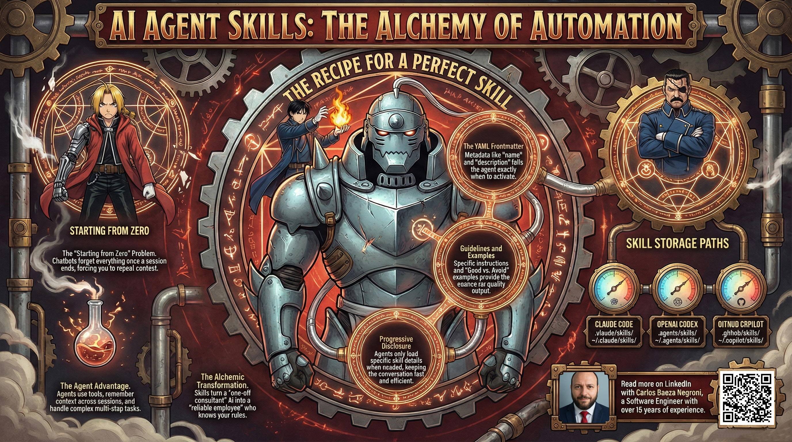

# Understanding AI Agent Skills: A Comprehensive Guide

This folder contains the article exploring what makes AI agents tick—the core
capabilities and skills that enable them to navigate complex tasks and learn
from their environment. We dive into how these agents are designed, trained,
and deployed across different domains.

Feel free to check out the full content in four ways:

1. 📢 **LinkedIn announcement** – a short post about the article:
   https://www.linkedin.com/posts/carlos-baeza-negroni_ai-artificialintelligence-chatgpt-activity-7431459511338606592-ztOU
2. 📰 **Read the article directly on LinkedIn**:
   https://www.linkedin.com/pulse/understanding-ai-agent-skills-comprehensive-guide-baeza-negroni-dwiaf
3. 📄 **Browse the source** here in the repo:
   [article.md](./article.md)

