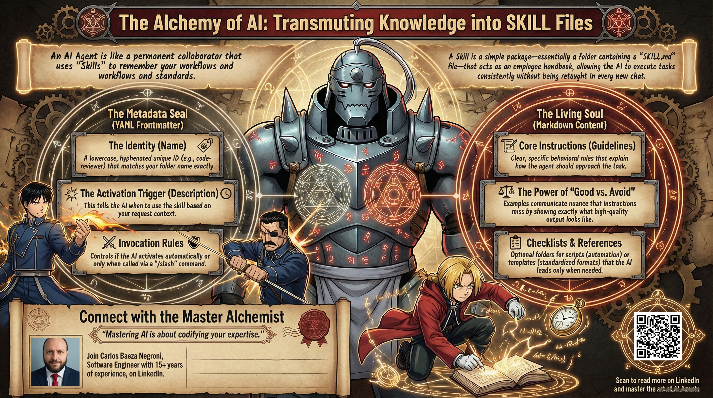
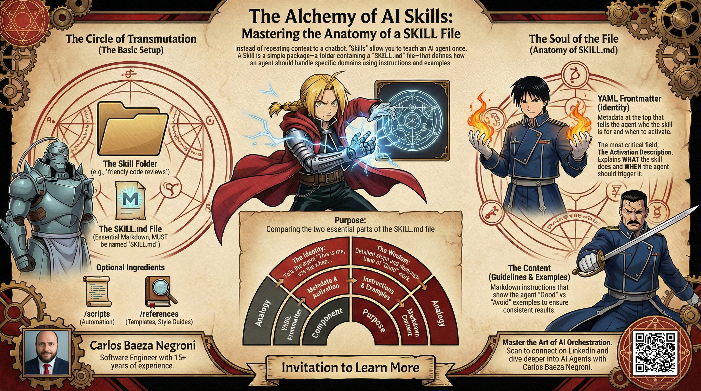
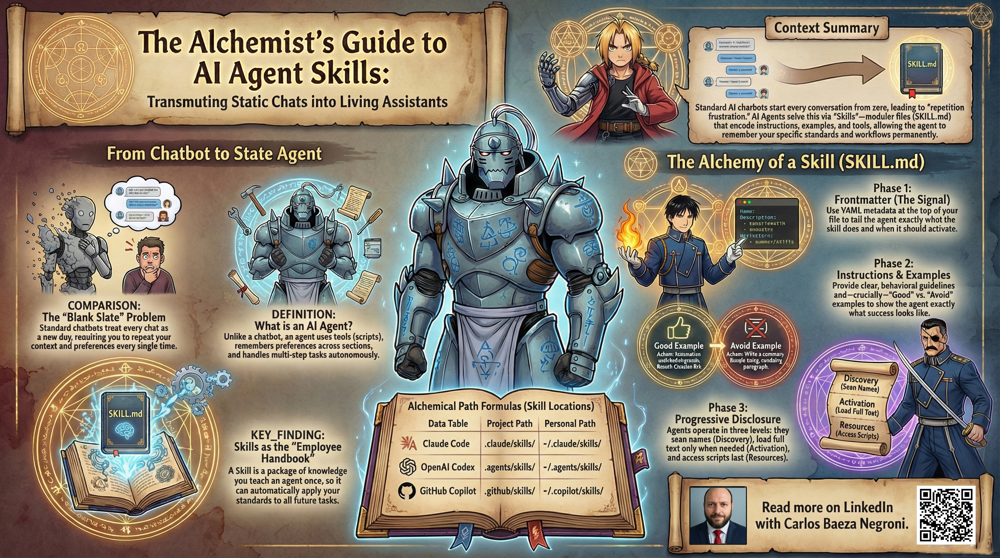

# Understanding AI Agent Skills: A Comprehensive Guide

## Table of Contents

1. [Why This Guide Exists](#why-this-guide-exists)
2. [The Fundamentals of AI Agents](#part-1-the-fundamentals-of-ai-agents)
3. [Creating Your First Skill](#part-2-creating-your-first-skill)
4. [The SKILL.md File in Depth](#part-3-the-skillmd-file-in-depth)
5. [Setting Up Skills on Your Platform](#part-4-setting-up-skills-on-your-platform)
6. [Making Your Skills Work Well](#part-5-making-your-skills-work-well)
7. [Real-World Examples and Use Cases](#part-6-real-world-examples-and-use-cases)
8. [How Skills Relate to Other Concepts](#part-7-how-skills-relate-to-other-concepts)
9. [Security Considerations](#part-8-security-considerations)
10. [Advanced Techniques and Optimization](#part-9-advanced-techniques-and-optimization)
11. [Getting Started and Next Steps](#part-10-getting-started-and-next-steps)


---

## Why This Guide Exists

If you've used ChatGPT, Claude, Gemini, or any similar AI tool, you've likely experienced a particular kind of frustration. Every single conversation starts from absolute zero. You find yourself typing out the same context, the same preferences, the same explanations about how you like things done—and then you do it all over again in the next chat, and the one after that.

This isn't just annoying. It's a fundamental limitation that prevents AI from becoming truly useful for recurring, real-world work. You might spend five minutes explaining your company's coding standards to an AI, only to get results that don't quite match what you're looking for—and then you have to explain it all over again, perhaps slightly differently, and hope this time the AI understands.

Skills solve this fundamental problem. They let you teach an AI agent once, and that agent remembers what you've taught it forever—or at least for as long as you need it to. Rather than repeating yourself in every conversation, you create a skill that encapsulates your knowledge, your preferences, your workflows, and your standards. Then, whenever the agent encounters a relevant task, it automatically loads your guidelines and applies them without you needing to say a word.

This guide walks you through everything you need to go from "I've never used skills" to "I have skills working reliably in my daily workflow." We'll start with the absolute fundamentals, making sure you truly understand what AI agents are and why skills matter. Then we'll move into hands-on examples you can copy and adapt immediately. We'll explore the nuances of writing effective skills, walk through platform-specific setup details, discuss security considerations, and cover advanced techniques for getting the most out of this powerful capability.

The goal isn't just to help you create skills—it's to help you think about how to capture and codify your knowledge in a way that makes AI agents genuinely useful for the work you do every day.

---

## Part 1: The Fundamentals of AI Agents

### What Is an AI Agent, Really?

To understand skills, you first need to understand what makes an AI agent different from the chatbots you've probably been using. This distinction matters more than you might think, because it fundamentally changes what you can expect from AI and how you should interact with it.

You've used AI chatbots. You ask a question, you get an answer. You might paste in some context, get a response, and that's the end of the interaction. Each conversation is completely isolated from every other conversation. The AI doesn't remember who you are, what your job entails, how you prefer things done, or what you've discussed in previous sessions—even if those sessions were five minutes ago. Every new chat is a blank slate.

This works fine for one-off questions. If you want to know the capital of France or need help writing a quick email, the chatbot model serves perfectly well. You get what you need, you move on, and there's no real cost to starting fresh each time.

But here's where things break down. Once you start using AI for anything beyond trivial tasks, you encounter the limits of this approach. Suppose you're a software developer working on a complex codebase. You might want the AI to help you review pull requests in a way that matches your team's specific standards. Or perhaps you're a content writer who needs AI to draft pieces that match your publication's particular voice and style. Maybe you're a researcher who follows specific methodological approaches that would take too long to explain every time.

Without agents and skills, you're stuck explaining your context, your preferences, and your requirements in every single conversation. And here's the painful truth: even when you do explain everything carefully, the results still vary depending on how you phrased things that day, what mood the model is in, and countless other variables you can't control.

An AI agent is different in several crucial ways. Instead of just answering questions, an agent can take real action in your digital environment. It can:

- **Use tools**: An agent can execute code, read and write files, send messages through various channels, interact with APIs, and perform operations in your development environment or other systems you connect it to. This isn't just hypothetical—the agent actually performs these actions, not just talks about them.

- **Remember things across conversations**: When you teach an agent something through skills, that knowledge persists. You don't need to re-explain your team's conventions or your personal preferences every time you start a new session. The agent carries that knowledge forward.

- **Handle multi-step tasks without constant hand-holding**: Rather than you needing to guide the agent through every micro-decision, you can delegate an entire workflow. The agent figures out the steps, executes them in sequence, and comes back with results. You specify the outcome you want; the agent figures out how to get there.

Think of it this way: a regular AI chatbot is like a consultant you call for one-off advice. You explain your situation, they give you guidance, and that's the end of the relationship. An AI agent is more like an employee you can delegate work to. You hire them (or configure them), you train them (through skills and instructions), and then you give them tasks to execute. They remember what you've taught them, they can take initiative on your behalf, and they get better at your specific needs over time.

The shift from chatbots to agents represents a fundamental change in the relationship between humans and AI. Instead of being a tool you use intermittently for specific tasks, an agent becomes an ongoing collaborator who understands your context and can work with increasing autonomy.

### What Problem Do Skills Solve?

Let's make this concrete with a scenario you might recognize from your own work.

Imagine you work on a software team that has very specific conventions for how database queries should be written. Maybe your team always uses parameterized queries to prevent SQL injection. Perhaps you have specific naming conventions for tables and columns that differ from the defaults. You might have particular patterns for handling transactions, logging queries, or managing connections that are specific to your architecture.

Without skills, here's what happens when you want AI help with a database task:

You paste your schema. You explain your team's query conventions. You mention that parameterization is required. You note the naming standards. You specify how errors should be handled. You might spend several minutes typing all of this out—or worse, you might forget to mention something important and get results that don't match your standards.

Then you move on to a different task. A few hours later, you need help with another database query. You start a new conversation, and you have to explain everything again. The AI doesn't remember your conventions from the previous conversation. You're starting from zero.

Now multiply this by every type of task you use AI for. Code reviews. Writing documentation. Analyzing data. Drafting communications. Each area has its own standards, its own conventions, its own "the way we do things here." And without skills, you're explaining all of it, over and over, forever.

Skills let you write down these instructions once. You create a skill that captures your team's database query standards, another for your documentation style, another for your code review process. Then, whenever the agent works on something relevant, it automatically loads your guidelines and follows them. No repetition required. No hoping you remembered to mention everything important.

This isn't just about saving time—although that's certainly a benefit. It's about consistency. When you rely on explaining things in every conversation, results vary. Some days you might be more thorough in your explanations. Some days you're rushed and forget key details. The AI might interpret your instructions slightly differently depending on context. Skills eliminate this variability. Once you've written your standards into a skill, they're applied consistently every single time.

### Skills in Plain English

At their core, skills are remarkably simple. A skill is a package containing everything an AI agent needs to handle a particular type of task well. This includes:

- **Instructions**: What the agent should do and how it should approach the task. This might include step-by-step procedures, decision criteria, quality standards, or specific behaviors you want the agent to exhibit.

- **Examples**: What good work looks like in your specific context. Examples are incredibly powerful because they communicate nuance that instructions alone often miss. You can show the agent exactly the kind of output you want, and also show examples of what to avoid.

- **Sometimes scripts**: Small programs that help automate certain parts of the task. These are useful when you need deterministic operations that must happen the same way every time—calculations, formatting, data transformations, or other repeatable processes.

- **Reference material**: Any documentation, templates, or other resources that might help the agent handle the task well. This might include style guides, API documentation, company policies, or any other background material the agent should consider.

When you create a skill, you're essentially writing an employee handbook for your AI. Instead of explaining your team's way of doing things every time you need help, you write it down once in the skill. The agent reads the handbook, understands your context, and applies your standards automatically.

The beauty of this approach is that it scales. You can create skills for every area where you use AI. Each skill is focused on one specific domain or workflow. When you need help with something, the relevant skill activates automatically based on what you're asking for. You get deep expertise on demand without the overhead of explaining everything every time.

### Who Is This For?

One of the biggest misconceptions about skills is that they're only for programmers. This couldn't be further from the truth. While skills originated in the developer tool space and work beautifully for coding tasks, the concept is entirely universal.

Anyone who finds themselves repeating the same instructions to an AI over and over can benefit from skills. This includes:

- **Writers** who have a specific style and tone they want AI to maintain. Perhaps you write for a publication with a distinctive voice, or you create marketing content that needs to follow specific brand guidelines. A skill can capture your style preferences and apply them automatically to every piece of content you create.

- **Researchers** who follow particular methodologies in their work. Whether you're conducting academic research, market analysis, or scientific studies, you likely have specific protocols and standards that need to be followed. A skill can encode these methodological requirements so every output meets your research standards.

- **Small business owners** with specific customer service processes. How your team handles inquiries, what language is appropriate, when to offer refunds, how to escalate issues—all of this can be captured in a skill so AI-assisted communications maintain your business's standards.

- **Teams that need consistent workflows across everyone**. Rather than relying on each team member to explain their context individually, you can create shared skills that encode team conventions, ensuring everyone gets consistent results regardless of who on the team is working with the AI.

- **Developers**, of course, who want AI to follow their project's specific patterns, coding standards, architectural decisions, and team workflows. This was the original use case and remains one of the most powerful applications.

The concept is genuinely universal. The implementation varies slightly depending on which AI platform you use, but the underlying principle remains the same everywhere: capture your knowledge once, apply it automatically whenever relevant.


---

## Part 2: Creating Your First Skill

This section gives you something you can actually use right now. We'll walk through creating a skill from scratch, explaining each part as we go, so you end up with a working skill you can adapt for your own needs. By the end of this section, you'll have seen every component that makes up a skill and understand how they fit together. You'll also have a complete, copy-ready example you can use as a starting point.

### What You'll Need

Before you can create and use skills, you need an AI platform that supports them. Not every AI tool has adopted the skills standard yet, but several major platforms have, and more are adding support. Here's a breakdown of the main options, so you can choose which fits your workflow best.

**Claude Code** — This is Anthropic's command-line tool designed specifically for developers. If you spend most of your time in a terminal working on code, Claude Code integrates naturally into your existing workflow. It can help you write code, debug issues, review pull requests, refactor existing code, and run tests. What makes Claude Code particularly powerful is how deeply it integrates skills into its operation—the tool is built around the concept of contextual awareness, and skills are the primary mechanism for providing that context. When you install Claude Code and add skills to it, the tool becomes increasingly customized to your specific needs and preferences over time. Many developers find that once they have their skill library set up, Claude Code feels less like an external tool and more like an extension of their own expertise.

**OpenAI Codex** — OpenAI's coding agent takes a slightly different approach. Where Claude Code is more of an interactive CLI partner, Codex is designed as an autonomous agent that can work on your codebase with less frequent hand-holding. It can explore repositories, understand your code's structure, make changes across multiple files, and execute complex multi-step tasks. Codex also supports skills, allowing you to define how it should approach different types of work. If you work on large codebases or have complex development workflows that benefit from an agent that can take initiative, Codex is worth exploring.

**GitHub Copilot in VS Code** — Microsoft's AI coding assistant has become the most widely used AI coding tool, and its integration into VS Code makes it accessible to developers who prefer a visual IDE. Copilot now supports skills, which means you can customize how it helps with your development work. If you already use VS Code for development, adding Copilot skills requires minimal changes to your workflow. The skill support allows you to go beyond simple code completion into more structured assistance that follows your team's conventions.

**Claude.ai (the web interface)** — Not everyone wants to work in a terminal or code editor. Some people prefer a web interface, and Anthropic's Claude.ai web platform supports skills too. This is a good option if you want to experiment with skills without setting up command-line tools, or if your work with AI involves more than just coding—perhaps you use AI for writing, analysis, or creative work in addition to development tasks. The web interface is also useful for testing skills before you deploy them in more production-oriented environments.

For the rest of this section, we'll focus on the skill file structure itself—the actual content of your skill files. This is largely the same regardless of which platform you choose. Once you understand the structure, platform-specific details are straightforward to apply.

### The Simplest Possible Skill

Here's a surprising fact: you can create a skill with nothing more than a folder and a single markdown file. That's it. There are no required configurations, no special formatting requirements beyond standard YAML and markdown, and no need to install anything extra. If you can create a folder and a text file, you can create a skill.

This simplicity is intentional. The skills system was designed to be low-friction—you shouldn't need extensive setup or technical knowledge to start capturing your knowledge and preferences. The folder and file structure is the minimum viable implementation, and it works.

Here's what the folder structure looks like:

```
my-first-skill/
└── SKILL.md
```

The folder name becomes the skill's identifier. In this example, the skill is called "my-first-skill" because that's what the folder is named. Inside that folder, there's a single file called "SKILL.md"—this is the required filename. The system specifically looks for a file named SKILL.md; if you name it something else, it won't be recognized as a skill.

The folder can contain other files too, if you want to add scripts or reference material, but those are entirely optional. The core of every skill is that single SKILL.md file, and you can accomplish a great deal with just that.

When you create this folder with this file inside, you've technically created a skill. It won't do anything useful yet—the SKILL.md needs actual content—but the structure is valid. Let's look at what goes inside that file.

### The SKILL.md Format

Every SKILL.md file has two main sections, each serving a different purpose in how the skill functions.

**The YAML Frontmatter**

At the very top of the file, between two lines containing only three dashes, sits the YAML frontmatter. This section uses YAML (YAML Ain't Markup Language) to provide metadata about the skill. YAML is designed to be human-readable, and you don't need to be a YAML expert to write it—just follow the basic patterns.

The frontmatter contains information that the agent uses to understand what the skill does and when it should be activated. Think of it as the skill's introduction—the few sentences that tell the agent whether this skill is relevant to the task at hand.

Here's what a frontmatter section looks like:

```yaml
---
name: friendly-code-reviews
description: Perform code reviews with a constructive, encouraging tone. Use when asked to review, critique, or provide feedback on code.
---
```

The `name` field provides an identifier for the skill. This should be lowercase, with hyphens replacing spaces. The name appears in various contexts—perhaps in slash command menus, in skill listings, or in conversation history. It should be descriptive enough that you can remember what the skill does just by looking at the name.

The `description` field is where the real magic happens. This is what the agent actually reads to decide whether to activate the skill. A good description does two things: it explains what the skill does, and it explains when the skill should be used. The description should be specific enough that the agent can reliably determine relevance, but not so narrow that the skill never gets used.

The description appears in places like skill selection menus, so it's also a form of documentation for humans. When you see a list of available skills, you're choosing based on the descriptions.

**The Content Section**

Below the frontmatter comes the actual content of the skill—the instructions, guidelines, and examples that the agent follows when this skill is active. This is written in standard markdown, which gives you flexibility in how you structure your guidance.

The content section can contain whatever makes sense for your skill, but there are patterns that work well. Let's walk through a complete example that demonstrates the key elements:

```yaml
---
name: friendly-code-reviews
description: Perform code reviews with a constructive, encouraging tone. Use when asked to review, critique, or provide feedback on code.
---
# Friendly Code Review Skill

## When to Use This Skill

Use this skill whenever you're reviewing someone else's code:
- Pull request reviews
- Pair programming sessions  
- Code feedback requests
- Any situation where you're asked to evaluate code quality

## Guidelines

### Tone

- Start with something the author did well
- Frame suggestions as questions or possibilities, not demands
- Explain the "why" behind each suggestion
- If something works but could be improved, acknowledge it works first

### Structure

1. **One thing done well** - Always find something positive to mention
2. **One specific suggestion** - Pick the most important improvement
3. **One question** - Ask about something you're curious about

### Examples

Good: "I like how you handled the error case here—that's a common pitfall that many developers miss. Have you considered what happens when the API is slow? One option might be to add a timeout."

Avoid: "This is wrong. You should use X instead."

## What to Look For

- Logic errors that could cause bugs
- Missing error handling
- Opportunities to simplify
- Documentation that could help future maintainers
- Security vulnerabilities
- Performance concerns
```

Let's break down each part of this example and understand why it's structured this way.

**The Header and Introduction**

The content begins with a title—markdown's `#` heading style—which gives the skill a human-friendly name. This appears when people browse skills but doesn't affect how the agent processes the content.

The "When to Use This Skill" section reinforces the activation criteria. While the frontmatter description handles the automatic decision, this section provides additional context that the agent can reference. It clarifies the exact situations where this skill should apply.

**The Guidelines Section**

This is where the skill provides its actual guidance. Notice how specific it is. Rather than saying "be nice" or "give positive feedback"—which are too vague to be useful—it specifies concrete behaviors:

- Start with something positive (not just "be positive," but specifically "start with" this)
- Frame suggestions as questions (specific communication technique)
- Explain the why (not just what to do, but why it matters)
- Acknowledge when something works (balanced feedback approach)

These instructions give the agent clear behavioral guidance it can apply in any code review situation. They tell the agent not just what outcome to achieve, but how to achieve it through specific actions.

**The Examples**

The examples section demonstrates the difference between what you want and what to avoid. This is one of the most powerful parts of a skill, because examples communicate nuance that instructions alone often miss.

In the example, we see:
- A "Good" example that demonstrates the desired tone, structure, and content
- An "Avoid" example that shows what NOT to do

The "Good" example is specific: it mentions a particular aspect of the code (error handling), acknowledges a positive (it addresses a common pitfall), offers a suggestion framed as a question ("Have you considered..."), and provides a concrete possibility ("One option might be...").

The "Avoid" example is equally valuable—it shows terse, demanding language that feels judgmental rather than helpful. This gives the agent a clear contrast to the desired behavior.

**The Checklist Section**

Finally, "What to Look For" provides a practical checklist of specific technical concerns to evaluate. This gives the agent concrete questions to ask during the review process. It's more actionable than "review the code" because it provides a starting point.

### Understanding the Example's Structure

Now that you've seen the full example, let's discuss why it's structured this way and what makes it effective.

The skill doesn't just describe what it wants—it demonstrates. The structure itself models the desired behavior: organized, clear sections that build on each other. The frontmatter tells the agent when to engage. The content tells it how to behave. The examples show specific instances of that behavior in action.

Notice also what the skill doesn't include. There's no lengthy philosophical discussion about why code reviews matter. There's no history of code review practices. There's no marketing language. The skill is ruthlessly focused on what the agent needs to know to do the job well.

This focus is key to effective skills. More isn't better—more is just more. The best skills provide exactly what's needed and nothing more. They give the agent enough guidance to make good decisions while leaving room for the agent to exercise judgment.

### Where to Put This Folder

Now that you have a skill file created, you need to put it in the right place for your AI platform to find it. This is where the different platforms diverge in their conventions.

Here's a quick reference table showing where each platform looks for skills:

| Platform | Project Skills Location | Personal Skills Location |
|----------|------------------------|-------------------------|
| Claude Code | `.claude/skills/` | `~/.claude/skills/` |
| OpenAI Codex | `.agents/skills/` | `~/.agents/skills/` |
| GitHub Copilot (VS Code) | `.github/skills/` | `~/.copilot/skills/` |
| Claude.ai (web) | Upload as zip | Upload via settings |

**Project Skills vs Personal Skills**

The distinction between project skills and personal skills is important and worth understanding before you decide where to put your skill.

**Project skills** live in your project directory—the folder containing your code, documentation, or whatever you're working on. These skills only apply when you're working within that specific project. If you have skills that capture project-specific conventions—coding standards unique to that project, documentation templates specific to that codebase, or workflows that only make sense in that context—project skills are the right choice.

For example, if you're working on a Django web application, you might have a project skill that understands your specific models, your URL routing conventions, and your template structure. That skill would make no sense in the context of a different project, so it belongs in the project skills directory.

**Personal skills** live in your home directory (represented by the tilde `~` in Unix-style paths). These skills apply to everything you do, regardless of which project you're working in. They're for preferences and knowledge that transcend any single project.

For example, you might have a personal skill that defines your preferred code review style—how you like feedback structured, what tone to use, what you typically look for. This applies whether you're reviewing code in a Python project, a JavaScript project, or a completely different domain. Personal skills follow you from project to project.

The choice between project and personal isn't always obvious. Here are some questions that help:

- Does this knowledge apply across multiple projects? If yes, personal skill.
- Is this specific to one codebase or context? If yes, project skill.
- Would this be useful to others on my team? If yes, consider project skill (or shareable skill if your team has a setup for that).
- Is this my personal preference that I don't want others to inherit? If yes, personal skill.

**Using the Right Path**

In the table above, paths like `.claude/skills/` are relative paths—they go in your project root. Paths like `~/.claude/skills/` are absolute (in the sense that `~` expands to your home directory).

On Windows, `~` typically expands to something like `C:\Users\YourName\`, so `~/.claude/skills/` becomes `C:\Users\YourName\.claude\skills\`. The exact path varies depending on your Windows username.

For now, don't worry about getting this perfect. Create your skill folder in any convenient location—we'll walk through putting it in the right place for your specific platform in Part 4.

### How Skills Actually Get Used

Here's the key insight that makes skills practical at scale: progressive disclosure.

You might reasonably worry that loading skills would create problems. If you have 20 skills, or 50, or more—surely loading all of their instructions every time would overwhelm the agent's context window, make responses slow, and increase costs?

This is a legitimate concern, and the skills system addresses it elegantly through progressive disclosure. The agent doesn't load every skill's full instructions at once. Instead, it uses a three-level system that only loads what you actually need for any given task.

**Level 1 - Discovery**

When the agent first starts up for a conversation, it scans for available skills. It reads only the names and descriptions—the metadata from the frontmatter. This is tiny: just a few words per skill. The agent now knows what capabilities exist in your skill library without actually loading any detailed instructions.

Think of this as reading the table of contents and chapter summaries of a library, rather than reading every book in its entirety. The agent gets a map of what's available, nothing more.

This level is extremely lightweight. Even if you have 100 skills, the agent is only reading a few hundred words of metadata total. This happens in milliseconds and costs almost nothing.

**Level 2 - Activation**

When you ask for something that matches a skill's description, the agent decides to use that skill. At this point, it reads the full SKILL.md file—the complete content including instructions, examples, and any guidance you've provided.

This is where the skill actually gets applied to your work. The agent loads the full text of the skill and begins following its guidance for your specific task.

Importantly, at this stage, the agent is only loading ONE skill (or a small number of skills). It doesn't load all your skills—it loads only the one that's relevant to what you asked for. This keeps the context manageable.

**Level 3 - Resources**

If the skill references additional files—scripts in a scripts subfolder, reference documents in a references folder, or templates in a templates folder—those load only when needed. The agent doesn't load them upfront; it loads them during task execution when it encounters a reference.

This means your scripts and reference files don't consume any resources until they're actually relevant to the work being done.

**Why This Matters**

This three-level system is why skills scale. You can have 50 skills installed, and the agent only uses the relevant ones for each specific task. You get deep expertise on demand without the overhead of loading everything always.

It's the difference between having an entire reference library in your head and having someone hand you the exact book you need for the question you're currently asking. The first is overwhelming; the second is efficient and practical.

This design also means you can keep building out your skill library without worrying about performance degradation. Whether you have 5 skills or 50, the agent only engages with the ones that match your current needs.


---

## Part 3: The SKILL.md File in Depth

Now that you understand the basics from the previous section, let's dig deeper into everything you can put in your skill files. The frontmatter and content sections offer more options than the simple example demonstrated, and understanding these options gives you much more control over how your skills behave. This section covers every available option, explains why each matters, and shows you how to use them effectively.

### Frontmatter Options

The YAML frontmatter at the top of your SKILL.md file is where you define metadata that controls how the skill behaves and how platforms present it to users. While it might look intimidating if you're not familiar with YAML, it's actually quite straightforward once you understand what each field does. Think of the frontmatter as the skill's identity card—the information that tells the agent and platform everything they need to know to use the skill properly.

The complete set of frontmatter options looks like this:

```yaml
---
name: skill-name           # Required: lowercase, hyphens for spaces
description: Required: What the skill does AND when to use it
argument-hint: Optional: Hint shown when invoking as slash command
user-invokable: true       # Optional: show in slash command menu (default: true)
disable-model_invocation: false  # Optional: require explicit invocation only
---
```

Let's examine each field in detail.

**name**

The name field is required. It identifies your skill internally and often appears in user interfaces such as skill menus, command palettes, or conversation histories. There are a few rules and conventions to follow:

The name must be lowercase. This is important because some platforms treat names case-sensitively, and consistency matters. Instead of "FriendlyCodeReviews" or "Friendly_Code_Reviews," use "friendly-code-reviews."

Use hyphens for spaces. This convention comes from URL-friendly naming and is standard across most platforms that use skills. It makes names easier to read and avoids encoding issues.

The name should match your folder name exactly. When you create a skill, you create a folder with a specific name, and inside that folder you place a SKILL.md file. The name field in your frontmatter should match that folder name. If they don't match, some platforms might have trouble finding or loading your skill.

The name is visible to users in various contexts. Depending on the platform, users might see the skill name in menus, command lists, or conversation history. Choose a name that's descriptive enough to be meaningful but concise enough to fit in UI elements.

**description**

This is the single most important field in your skill file. While every field matters, the description is what determines whether your skill gets used at all. The agent uses the description to decide whether to activate the skill—to determine if your skill is relevant to what the user is asking.

A good description must answer three questions:

1. **What does this skill do?** — What capability or behavior does it provide? This is the core functionality.

2. **When should someone use it?** — Under what circumstances should this skill be activated? Be specific about trigger conditions.

3. **What contexts does it apply to?** — What domain, technology, or situation does this skill relate to? This helps distinguish it from similar skills.

Here's the difference between a good description and a poor one:

- ✅ Good: "Write SQL queries following our team's formatting rules and security standards. Use when creating or editing database queries, including SELECT statements, INSERT operations, UPDATE modifications, and DELETE commands. Applies to PostgreSQL and MySQL databases."

- ❌ Bad: "Helps with database stuff"

- ❌ Also Bad: "Code review skill" (too vague, doesn't explain when to use it)

The good description is specific enough that the agent can reliably determine when this skill should activate. It explains exactly what the skill does (writes SQL queries following team standards), exactly when to use it (when creating or editing database queries), and what contexts apply (PostgreSQL and MySQL).

The bad descriptions are so vague that the agent can't possibly know when they're relevant. "Helps with database stuff" could mean almost anything—is it about writing queries? Optimizing performance? Designing schemas? The agent has no way to make a good activation decision.

**argument-hint**

This is an optional field that appears when users invoke your skill as a slash command. Slash commands are a common pattern in AI platforms—you type "/" followed by a skill name to explicitly invoke that skill.

The argument-hint provides a hint about what additional information the user should provide. For example, if your skill reviews code, the hint might tell users they can include a PR number or file path.

This field is optional because not all skills need additional context. But when your skill works better with specific input, a hint helps users provide it.

**user-invokable**

This boolean field defaults to true if not specified. When set to true, the skill appears in slash command menus and other skill selection interfaces. Users can explicitly choose to invoke it.

When set to false, the skill won't appear in user-facing skill menus. However, it can still be activated automatically by the model when it determines the task is relevant. This is useful for skills that should always be available to the model but shouldn't clutter user menus, or skills that are primarily meant for implicit activation.

**disable-model_invocation**

This is another boolean field that defaults to false. When set to its default value of false, the model can automatically activate the skill based on its description matching the user's request. This is the normal behavior—when you ask for something that matches a skill's description, the skill activates automatically.

When set to true, the model won't automatically activate this skill. Instead, the skill only activates when the user explicitly invokes it. This is useful in several scenarios:

- When you have multiple skills that might conflict or overlap, and you want to prevent automatic activation conflicts
- When a skill should only be used intentionally, not accidentally
- When you're building a skill that's meant to be invoked as part of a larger workflow but shouldn't trigger on its own

For most skills, you'll leave this at the default of false. Reserve true for cases where automatic activation causes problems.

### Writing Good Descriptions

Given how critical the description is, it deserves more thorough treatment. Let's explore the art and science of writing descriptions that actually work.

**Why Description Quality Matters So Much**

The description is the gateway to your skill. Everything else—the instructions, examples, scripts, references—only matters if the skill activates when it should. If your description doesn't accurately communicate when the skill applies, users won't get the benefit of your carefully crafted guidance.

This happens more often than you'd think. People create skills with excellent content but rush through the description, thinking it's just a formality. Then they wonder why their skill "doesn't work" when the real problem is that the agent doesn't know when to activate it.

Think of your description as the first and most important piece of the skill. Get it right, and everything else falls into place.

**The Three Components of a Great Description**

Every good description contains three distinct components, usually in this order:

1. **What the skill does** — A concise statement of the capability
2. **When to use it** — Explicit trigger conditions
3. **What contexts apply** — Domain or technical details

Here's a template you can follow:

> [What the skill does]. Use when [specific situations]. Applies to [context/domain].

And some real examples:

> Write API documentation following our company's style guide. Use when creating or updating REST API documentation. Applies to internal APIs built with Express.js and Python FastAPI frameworks.

> Perform comprehensive security reviews of code. Use when reviewing pull requests or analyzing code for security vulnerabilities. Focus on OWASP Top 10 issues and common language-specific vulnerabilities.

> Generate commit messages following conventional commits format. Use when preparing code for commit. Applies to Git repositories using conventional commits specification.

Notice how each example follows the template. They all state what the skill does, when to use it, and what contexts apply. This consistency makes it easy for the agent to parse and understand the skill's purpose.

**Common Description Problems**

Here are the most common mistakes people make with descriptions, and how to avoid them:

*Being too vague*: "Helps with code" or "Database assistance" doesn't tell the agent enough. Be specific about what kind of help and for what scenarios.

*Missing activation conditions*: A description that only says what the skill does without explaining when to use it leaves the agent guessing. Include phrases like "Use when..." to make activation clear.

*Being too narrow*: If your description is so specific that the skill almost never matches, it won't get used. Balance specificity with generality.

*Being too broad*: If your description is so vague that it matches everything, the skill might activate inappropriately or cause conflicts. Find the middle ground.

*Not mentioning context*: If your skill applies to specific technologies, languages, or domains, say so. This helps distinguish it from similar skills.

**Testing Your Description**

A good test for your description: if you were the agent reading this description, could you confidently determine whether to activate this skill for a given user request?

Try writing your description, then imagine various user requests. Would this description match those requests appropriately? Would it match requests where the skill shouldn't activate? Use this mental testing to refine your description before finalizing.

### The Content Section

Below the frontmatter comes the content section—the actual instructions, guidelines, and examples that the agent follows when the skill is active. This is where you communicate everything you want the agent to know about handling tasks in this domain.

The content section is written in standard markdown, which gives you flexibility in how you structure your guidance. You can use headings, lists, code blocks, tables, and all the other markdown formatting options. The agent reads this content just like it reads other text, so use whatever structure best communicates your intent.

**Organizing with Headings**

Headings serve two purposes: they make the content readable for humans, and they help the agent navigate the structure. Use a logical heading hierarchy to organize your skill.

Common sections include:

- **When to Use This Skill**: A reminder of the activation conditions. While this information is in the description, reinforcing it here helps.

- **Guidelines**: The core instructions—how the agent should approach this type of task. This is often the longest section.

- **Examples**: Concrete instances of what you want and what to avoid. Examples are incredibly valuable for communicating nuance.

- **What to Look For**: Specific criteria, checklist items, or concerns to address. This is particularly useful for review-type skills.

- **Reference Information**: Background knowledge the agent should consider. This can include domain information, technical details, or context.

- **Steps**: If there's a specific sequence to follow, outline it here. Numbered steps work well for procedural guidance.

**The Power of Examples**

If you take away only one thing from this section, let it be this: include examples in your skills. They are the single most effective way to communicate what you want.

Pure instructions can be abstract. When you say "use a professional tone," the agent doesn't know exactly what you mean by professional. Is it formal? Friendly but serious? What does "professional" look like in practice?

Examples solve this problem. When you show an actual piece of writing that represents your standard, the agent sees exactly what you're aiming for. It can extract patterns from examples that instructions alone can't convey.

Include both positive and negative examples:

- Positive examples show what you want—the desired output, approach, or behavior
- Negative examples show what to avoid—common mistakes, inappropriate approaches, or poor quality

Negative examples are particularly powerful because they make implicit knowledge explicit. Many professionals have internalized knowledge they can't easily articulate—but showing an example of what NOT to do makes that implicit knowledge available to the agent.

**Being Specific About Steps**

If your skill involves a specific process or workflow, lay out the steps in order. Don't assume the agent knows your workflow just because it's obvious to you.

Write it out explicitly:

1. First, review the requirements document
2. Then, check the existing codebase for related functionality
3. Next, draft the implementation following our coding standards
4. Finally, write tests covering the new functionality

This level of specificity ensures consistent results. The agent follows your defined process rather than improvising its own approach.

**Explaining Your Reasoning**

Whenever possible, explain why—not just what. The agent can then apply that reasoning to edge cases you didn't explicitly anticipate.

For example, instead of just saying "always use parameterized queries," consider adding "always use parameterized queries to prevent SQL injection attacks." Now the agent understands the security rationale and can make good decisions about query construction even in situations you didn't specifically describe.

This is especially important for skills that involve judgment or tradeoffs. If there's a reason behind a guideline, share it. It helps the agent navigate situations you didn't explicitly cover.

### Optional: Adding Scripts

While the core of every skill is the SKILL.md file, skills can optionally include executable scripts. These are small programs that help automate deterministic operations or perform tasks that are better handled by code than by prompting.

**When to Use Scripts**

Scripts are appropriate in several scenarios:

*Deterministic operations*: When you need something to happen the same way every single time, without any variation. Code is precise in a way that natural language can't match.

*Complex calculations*: Some operations are genuinely complicated to describe in words but straightforward to implement in code. Statistical analysis, data transformations, and numerical computations often fall into this category.

*Automation that must be reliable*: When an operation needs to work identically regardless of context, scripts are more trustworthy than natural language instructions.

*Precise format control*: If you need exact output formatting, code can guarantee it. Natural language output can vary in ways that might matter for structured integration.

**When NOT to Use Scripts**

Don't use scripts where simple instructions would work. Scripts add complexity—for you to write and maintain, and for the agent to use correctly. They also reduce transparency; someone reading your skill can understand natural language immediately, but scripts require reading and understanding code.

A good rule: if you can describe what you want clearly in a sentence or two, do that. Reserve scripts for cases where description would be lengthy, ambiguous, or unreliable.

**How Scripts Work in Skills**

To add scripts to your skill, create a scripts subfolder in your skill directory:

```
my-skill/
├── SKILL.md
└── scripts/
    ├── helper.py
    └── data-processor.js
```

Then reference the script from within your SKILL.md:

> Run `./scripts/helper.py --input data.json` to process the data. The script will output the transformed result to stdout.

When the agent uses this skill and encounters relevant tasks, it can execute the script as part of its workflow. The agent handles the mechanics—calling the script with appropriate arguments and using the output—while your skill defines when and why to use it.

**Script Considerations**

Keep these points in mind when adding scripts:

*Dependencies*: If your script requires external libraries or tools, document that clearly. The agent needs to know what environment the script expects.

*Error handling*: Think about what happens when the script fails. Does it output useful error messages? Should the skill include guidance on interpreting script output?

*Portability*: Scripts written in common languages (Python, JavaScript, shell) tend to work across platforms. Platform-specific scripts (PowerShell, for Windows; Bash scripts, for Unix) might not work everywhere.

### Optional: Adding References

In addition to or instead of scripts, you can include reference materials that the agent should consider when using the skill. These are supporting documents—style guides, API documentation, templates, examples, or any other resources that provide context.

**Reference Structure**

Create subfolders for organizing references:

```
my-skill/
├── SKILL.md
├── references/
│   ├── api-docs.md
│   └── style-guide.md
└── templates/
    └── report-template.md
```

The folder names (references, templates) are conventions but not requirements. You can organize references however makes sense for your skill.

**When References Are Useful**

Reference materials make sense in several situations:

*Too long for SKILL.md*: If you have extensive documentation—a comprehensive style guide, detailed API reference, or extensive policy documents—putting it all in SKILL.md makes the file unwieldy. References let you keep SKILL.md focused while still making comprehensive material available.

*Existing documentation*: If you already have documentation in markdown or other formats, you can reference those files directly rather than duplicating content.

*Templates*: If certain outputs should follow a specific format, templates make that explicit and reusable.

*Examples*: Multiple examples can be stored as reference files, keeping SKILL.md clean while providing extensive demonstration material.

**How References Get Used**

Reference files don't automatically load with the skill. They load when the agent determines they're relevant to the task at hand.

This is important to understand: including a reference file doesn't mean it's always considered. It means it's available when needed. The agent reads the skill's SKILL.md first, then accesses references as the task requires.

This design keeps the default load lightweight while still making comprehensive resources available. You get the best of both worlds: fast activation with deep resources on demand.


---

## Part 4: Setting Up Skills on Your Platform

Now that you've created your first skill—or at least understand how to create one—it's time to get skills working in your actual workflow. The exact steps vary depending on which AI platform you're using, because each platform has its own conventions for where it looks for skills, how it discovers them, and how you interact with them.

This section walks through the setup process for each major platform that supports skills. Choose the section that matches the platform you want to use, and follow the steps in order. By the end, you'll have skills active and working in your workflow.

### Claude Code (Anthropic)

Claude Code is Anthropic's command-line tool that brings AI-assisted development directly to your terminal. If you're a developer who prefers working in the command line—or who spends significant time in a terminal anyway—Claude Code integrates naturally into your existing workflow. It's particularly powerful because it combines the intelligence of Claude with deep integration into your development environment.

**What Claude Code Offers**

Claude Code can help you with virtually any development task: writing code, debugging issues, reviewing pull requests, refactoring existing code, running tests, and more. What makes it especially powerful is its ability to maintain context across sessions through skills. When you add skills to Claude Code, they become a persistent part of your development environment, shaping how Claude helps you across all your projects.

The tool is designed around the concept of contextual awareness. Rather than starting each conversation from scratch, Claude Code can carry forward the knowledge you've encoded in skills, making it feel more like a knowledgeable colleague who understands your context than a stateless chatbot.

**Step 1: Create the Skills Directory**

First, you need to tell Claude Code where to look for skills. You can create skills at two levels: project-specific and personal.

For project-specific skills that only apply to the current project, create a `.claude` folder in your project root, then a `skills` subfolder inside it:

```
mkdir -p .claude/skills
```

This creates a hidden folder called `.claude` with a `skills` folder inside. When you're working in this project directory, Claude Code will look for skills here first.

For personal skills that should be available across all projects, create the same structure in your home directory. On macOS and Linux, the tilde (`~`) represents your home directory:

```
mkdir -p ~/.claude/skills
```

On Windows, this translates to something like `C:\Users\YourUsername\.claude\skills`—the exact path depends on your Windows username.

You can create both directories if you want. Project-specific skills take precedence when you're in that project, while personal skills provide a baseline that applies everywhere.

**Step 2: Add Your Skill**

Now copy your skill folder into the appropriate directory. If you're adding a personal skill:

```
cp -r my-first-skill/ ~/.claude/skills/
```

The `-r` flag tells the copy command to copy recursively—to copy the folder and everything inside it. Make sure the final slash is there; it ensures the contents are copied into the destination folder rather than creating a nested structure.

For project skills, copy into your project's `.claude/skills/` directory instead.

**Step 3: Verify It Works**

Start a conversation with Claude Code and ask something that matches your skill's description. For example, if you created the friendly-code-reviews skill from earlier, you might say something like:

"Can you review this pull request for me?"

If your skill is set up correctly, Claude Code will recognize that this matches the skill's description and activate it automatically. The skill's guidance will influence how Claude approaches the code review.

If you want to invoke the skill explicitly—perhaps to be certain it's being used—you can mention the skill name directly:

"Use the friendly-code-reviews skill to look at this PR."

**How Claude Code Finds Skills**

Claude Code scans multiple locations when looking for skills:

- First, it checks `.claude/skills/` in your current project directory
- Then, it checks your personal skills at `~/.claude/skills/`
- Finally, it scans parent directories up to the git repository root

This hierarchical scanning means you can have skills at different levels. A skill in your project overrides a personal skill with the same name. A skill at a team or organization level (in a parent directory that multiple projects share) can apply across multiple projects.

This is particularly useful for teams. If your team has shared skills that everyone should use, you can place them in a parent directory that's above individual projects. Anyone working on any project within that directory tree will have access to those shared skills.

### OpenAI Codex

OpenAI Codex is designed specifically for software development tasks. Unlike Claude Code's interactive CLI approach, Codex is built as an autonomous agent that can work on your codebase with less frequent hand-holding. It can explore repositories, understand code structure, make changes across multiple files, and execute complex multi-step tasks.

**What Codex Offers**

Codex excels at handling substantial development workflows. You give it a goal—like "refactor this module to use the new API" or "add tests for the authentication flow"—and Codex figures out the steps needed to accomplish it. This makes it particularly valuable for larger tasks where you'd otherwise spend significant time guiding an AI step by step.

Codex also supports skills, allowing you to define how it should approach different types of work. Your skills shape Codex's behavior, ensuring it follows your team's conventions even in autonomous mode.

**Step 1: Create the Skills Directory**

Similar to Claude Code, Codex supports both project-level and personal skills, each with its own directory structure.

For project skills, create an `.agents` folder in your project root:

```
mkdir -p .agents/skills
```

For personal skills that apply across all projects, use your home directory:

```
mkdir -p ~/.agents/skills
```

**Step 2: Add Your Skill**

Copy your skill folder into the appropriate directory:

```
cp -r my-first-skill/ ~/.agents/skills/
```

**Step 3: Add Platform Configuration (Optional but Recommended)**

One of Codex's distinguishing features is its support for platform-specific configuration through an optional `openai.yaml` file. While not required, this file lets you customize how the skill appears and behaves within the Codex interface.

Create this file inside your skill folder:

```
my-first-skill/
├── SKILL.md
└── openai.yaml
```

The configuration file supports several options:

```yaml
interface:
  display_name: "Friendly Code Reviews"
  short_description: "Constructive code reviews that prioritize learning"
  brand_color: "#3B82F6"

policy:
  allow_implicit_invocation: true
  
dependencies:
  tools:
    - type: "mcp"
      value: "github"
```

The `interface` section controls how the skill appears in Codex's user interface. You can set a human-friendly display name, a short description for menus, and even a brand color to help visually distinguish skills.

The `policy` section controls invocation behavior. Setting `allow_implicit_invocation: true` means Codex can automatically activate the skill based on description matching. Set it to false if you only want the skill to activate when explicitly invoked.

The `dependencies` section lets you specify required tools. If your skill depends on specific MCP servers or other tools, list them here. Codex will ensure these tools are available before using the skill.

**Testing Your Skill**

You can test your skill in two ways:

- **Explicit invocation**: Mention the skill name in your prompt, like "Use the pytest skill to run the test suite"

- **Implicit invocation**: Just describe what you want, and Codex will decide whether to activate the skill based on whether the task matches the skill's description

Both approaches should work once your skill is properly configured. If explicit invocation works but implicit doesn't, your description might need to be more specific.

### GitHub Copilot in VS Code

GitHub Copilot has become the most widely used AI coding assistant, thanks to its deep integration into Visual Studio Code. For many developers, Copilot is their first introduction to AI-assisted coding. Now that Copilot supports skills, you can customize its behavior beyond the defaults.

**What Copilot Offers**

Copilot works through two primary mechanisms: inline completions as you type, and a chat interface for more complex interactions. The skills support applies primarily to the chat interface, where you can have more detailed conversations about your code.

If you already use VS Code for development, adding Copilot skills requires minimal changes to your workflow. The skill support allows you to move beyond simple code completion into more structured assistance that follows your team's conventions.

**Step 1: Create the Skills Directory**

VS Code supports multiple skill locations, giving you flexibility in how you organize. You can use any of these:

```
.github/skills/          # Project skills (GitHub's standard location)
.claude/skills/         # Also recognized
.agents/skills/         # Also recognized
~/.copilot/skills/      # Personal skills
```

For most projects, the standard approach is to use `.github/skills/` for project-level skills:

```
mkdir -p .github/skills
```

For personal skills that should be available in all your projects:

```
mkdir -p ~/.copilot/skills
```

**Step 2: Add Your Skill**

Copy your skill folder to the appropriate location:

```
cp -r my-first-skill/ ~/.copilot/skills/
```

**Step 3: Using Skills in VS Code**

Once your skill is in place, you can invoke it through Copilot's chat interface:

1. Open the Copilot Chat view in VS Code (View → Command Palette → Copilot Chat, or use the keyboard shortcut)

2. Type `/` in the chat input to see available skills

3. Select your skill from the dropdown menu

4. Add any additional context after the skill invocation, like `/friendly-code-reviews for PR #42`

The slash command pattern is consistent across platforms that support skills. You can type `/` followed by the skill name to explicitly invoke it.

**Configuration Option: Custom Locations**

If you want to store skills in a non-standard location, you can configure VS Code to look in additional places. Open VS Code settings (File → Preferences → Settings, or use `Ctrl+,` on Windows/Linux or `Cmd+,` on macOS) and add:

```json
{
  "chat.agentSkillsLocations": ["/path/to/custom/skills"]
}
```

This is useful if you have skills organized in a particular way or stored in a specific directory that isn't one of the defaults.

**Copilot Workspace Integration**

One advantage of using Copilot in VS Code is its deep integration with your workspace. When you invoke a skill in Copilot Chat, it has access to your open files, terminal output, and other VS Code context. This means your skills can work with more context than they might in other platforms.

### Claude.ai (Web Interface)

Not everyone wants to work in a terminal or code editor. Some people prefer a web interface, and Anthropic's Claude.ai web platform supports skills as well. This is a good option if you want to experiment with skills without setting up command-line tools, or if your AI work involves more than just coding—perhaps you use AI for writing, analysis, or creative work.

**What Claude.ai Offers**

The web interface gives you access to Claude's capabilities through your browser. You can have conversations, upload files, and now use custom skills—all without installing anything. It's the lowest-friction way to get started with skills if you're new to the concept or don't want to configure local tools.

Claude.ai also comes with built-in skills for working with common file formats: PDF, Word, Excel, and PowerPoint. These are automatically available when you work with those file types, handling the complexity of parsing and interacting with these formats.

**Using Pre-Built Skills**

Claude.ai comes with several built-in skills that handle common tasks:

- **PDF skill**: Reading and extracting information from PDF documents
- **Word skill**: Working with Word documents
- **Excel skill**: Analyzing and working with spreadsheet data
- **PowerPoint skill**: Creating and modifying presentations

These skills activate automatically when relevant. If you upload a PDF, the PDF skill activates to help you work with it. You don't need to do anything special—they're just there.

**Adding Custom Skills**

To add your own custom skills to Claude.ai:

1. Go to Settings (click your profile icon in the top right, then select Settings)

2. Navigate to the Skills section

3. Upload your skill as a ZIP file

The ZIP file should contain your entire skill folder—the SKILL.md file and any supporting files (scripts, references, etc.). When you upload it, Claude.ai extracts the skill and makes it available in your conversations.

After uploading, your skill will be available alongside the built-in skills. It should activate automatically when your requests match its description, just like on other platforms.

**Using Skills via API**

For developers who want to integrate skills into automated workflows, the Claude API supports programmatic skill management. This requires:

- An API key from Anthropic
- Knowledge of their API endpoints
- Appropriate headers for skill management

This approach is more advanced and typically used when building integrated workflows—automations that incorporate Claude and its skills as part of a larger system. If you're just getting started with skills, stick with the web interface or one of the developer tools.

### Choosing Your Platform

With all these options, you might wonder which platform to choose. Here's a quick guide:

- **Command-line developer**: Use Claude Code. It integrates naturally with terminal workflows and offers the deepest skill integration.

- **Autonomous development**: Use OpenAI Codex. Its autonomous agent capabilities excel at substantial, multi-step tasks.

- **IDE-based development**: Use GitHub Copilot in VS Code. If you already work in VS Code, this integrates seamlessly.

- **General AI use**: Use Claude.ai web. For non-coding tasks or when you want the simplest setup.

Remember that skills follow the open standard, so a skill you create for one platform often works on others. You might experiment with different platforms to find what fits your workflow best, then develop skills that work across your chosen environment.

---

## Part 5: Making Your Skills Work Well

Creating a skill is easy. Anyone can write a SKILL.md file and put it in the right folder. But creating a skill that actually works well in practice—that produces consistently good results, activates appropriately, and integrates smoothly into your workflow—takes some thought and attention.

This section covers the best practices that separate effective skills from mediocre ones, along with common problems you'll encounter and how to solve them. Think of this as the craftsmanship section: how to move beyond "it works" to "it works really well."

### Best Practices

These principles guide everything else. Internalize them, and your skills will be better for it.

**1. Keep skills focused**

This is the single most important principle for effective skills, and it bears repeating. One skill should do one thing well.

When you're first creating skills, there's a temptation to be comprehensive. You think, "I'll create one skill that covers all my code review needs" or "I'll make a skill that handles all documentation." This instinct is understandable—you want to minimize the number of skills you manage. But it leads to problems.

Here's what happens: if you try to cover too much in one skill, your description becomes vague. Instead of being able to say "Use when doing code reviews," you have to say something like "Use when reviewing code, writing documentation, or doing other quality checks." The broader your skill, the less specific your description, and the less reliable your activation becomes.

The solution is to split things up. Separate skills for "code review," "writing tests," and "database migrations" will work much better than one giant skill trying to cover everything.

This might feel like more work upfront. Creating and maintaining five skills is more effort than maintaining one. But that small extra effort pays off massively in reliability. Focused skills are easier to maintain, easier to test, and more reliable in their activation. They also compose better—when you need multiple capabilities, the agent can activate multiple focused skills rather than trying to extract the right behavior from a jack-of-all-trades.

**2. Write descriptions carefully**

This is worth repeating because it's the most common failure point. The description is the most critical part of any skill. The agent uses it to decide whether to activate the skill. Even perfect instructions don't matter if the skill doesn't activate when it should.

Write descriptions that are:

- **Specific about what the skill does**: Don't just say "code reviews"—say "friendly, constructive code reviews that prioritize learning over criticism." The more specific, the better the agent can match.

- **Clear about when it should be used**: Include phrases like "Use when..." to explicitly state the activation conditions. Make it obvious.

- **Honest about what contexts it applies to**: If this skill is for Python code only, say so. If it's for frontend components, make that clear. Don't overreach.

- **Distinct from other skills you might have**: Think about your other skills. If you have a code review skill and a security review skill, make sure their descriptions clearly differentiate them.

Take time to craft descriptions that accurately represent what the skill does. Vague descriptions lead to unpredictable activation behavior. Review your descriptions after writing your skill content, and ask yourself: "If I were the agent, would I know when to activate this?"

**3. Include both instructions and examples**

Pure instructions can be abstract. Pure examples can be ambiguous. The best skills have both, because they communicate different things.

Instructions communicate principles—the underlying approach and reasoning. Examples communicate specifics—the actual output you expect. Together, they give the agent both the theory and the practice.

When including examples, cover these aspects:

- **What good output looks like** in your specific context. Show concrete examples of the desired result.

- **What to avoid** (negative examples are powerful teaching tools). Show examples of common mistakes or inappropriate responses.

- **Edge cases** and how to handle them. Show examples of unusual situations and how they should be addressed.

- **The reasoning behind your standards**. When possible, explain why your standard is what it is.

Examples ground your instructions in reality. They give the agent concrete models to follow rather than abstract principles to interpret. This is especially important for things like tone, formatting, and quality standards—concepts that are hard to pin down in words but obvious when seen.

**4. Use scripts judiciously**

Scripts are powerful. When you need something to happen identically every time, scripts deliver. They bring the reliability and precision of code to your skills in ways that natural language can't match.

But scripts add complexity—for you to write and maintain, and for the agent to use correctly. They also reduce transparency. Someone reading your skill can understand natural language immediately, but scripts require reading and understanding code. That code might be in a language they don't know, making your skill opaque to them.

Use scripts when:

- **The same calculation must produce the same result every time**. If precision matters and variation is unacceptable, script it.

- **You need auditability and reproducibility** for compliance or quality reasons. Scripts create predictable, traceable operations.

- **The operation is too complex to describe reliably in natural language**. If you'd need paragraphs to explain the logic, a script might be clearer.

- **Precision is critical and variation is unacceptable**. For operations where any deviation causes problems, code is safer than prose.

Don't use scripts where simple instructions would work. The more logic you put in scripts, the harder it is for users (and future you) to understand what's happening. Sometimes a few clear sentences in natural language are better than a complex script that nobody can read.

When you do use scripts, document them well. Explain what the script does, what inputs it expects, what outputs it produces, and what dependencies it requires. A script that's a black box is much less useful than one with clear documentation.

**5. Test your skills**

This is the step everyone skips. Don't skip it.

Testing skills is different from testing traditional software. You can't just run a test suite and get a pass/fail result. Instead, you need to verify that the skill produces the kinds of results you expect, that it activates appropriately, and that the outputs match your standards.

Try asking the agent to use your skill in various scenarios:

- Does it activate when it should? Ask a question that should trigger the skill and see if it responds appropriately.

- Does it stay inactive when it shouldn't? Ask about something unrelated and verify the skill doesn't inappropriately activate.

- Are the outputs following the skill's guidance? Examine the results to see if they match your instructions and examples.

- Are there edge cases where behavior is unexpected? Test unusual situations to see how the skill handles them.

Keep notes on what works and what doesn't. You'll likely need to iterate on your skill several times before it performs reliably.

### Common Problems and Solutions

Even with best practices, you'll encounter issues. Here are the most common problems and how to address them.

**Problem: The skill won't activate**

This is the most frequent issue. You've created a skill, but when you ask for something that should trigger it, nothing happens. The agent doesn't seem to know the skill exists.

Possible causes:

1. **The description doesn't match what you're asking**: The agent decides whether to activate based on description matching. If your description and your request don't align linguistically, the agent won't recognize the match.

2. **The skill isn't in the right directory**: Different platforms look in different places. Make sure your skill is in the correct location for your platform.

3. **The skill name in frontmatter doesn't match the folder name**: The name field should exactly match the folder name, including case.

4. **The YAML is malformed**: A syntax error in the frontmatter can prevent the skill from being recognized entirely.

Debugging steps:

- Make sure `name:` in your YAML matches your folder name exactly (case-sensitive). This is the most common culprit.

- Verify the skill is in the correct directory for your platform. Double-check the path.

- Review your description—does it actually describe the situation where you're trying to use the skill? Try rephrasing your request to match the description more closely.

- Check for YAML errors. Even small issues like incorrect indentation can cause problems.

- Try explicitly invoking the skill by name. If that works but automatic activation doesn't, the description is likely the issue.

**Problem: The skill activates but doesn't follow instructions**

Sometimes the skill activates—the agent recognizes it should use the skill—but the output doesn't follow the guidance you provided. This usually indicates a problem with the skill content itself.

Possible causes:

1. **Instructions aren't specific enough**: The agent is trying to follow your instructions but can't determine exactly what you want.

2. **Examples contradict the instructions**: This is surprisingly common. You might describe one approach in your instructions but show a different approach in your examples. The agent gets confused.

3. **The task is outside what the skill covers**: If the specific task falls outside the skill's scope, the agent might default to general behavior.

4. **The instructions are ambiguous**: Words like "professional," "clean," or "appropriate" mean different things to different people—and to the agent.

Debugging steps:

- Add more specific examples of what you want. Show the exact output format, tone, and content you expect.

- Be explicit about things you've assumed are obvious. The agent doesn't know what you know.

- Include negative examples—things to avoid. This clarifies boundaries.

- Split the skill if it covers too much ground. A focused skill with clear scope is easier to follow.

**Problem: Multiple skills activate at once**

Sometimes you get unexpected behavior because multiple skills are activating simultaneously. This can happen when descriptions overlap or are too similar. The agent tries to use multiple skills, which creates confusing or conflicting output.

For example, if you have a "code review" skill and a "security review" skill, and their descriptions both mention "reviewing code," the agent might activate both when you ask for a code review—only one of which is what you wanted.

Solutions:

- **Make descriptions more specific and distinct**: Clarify each skill's unique scope so there's no ambiguity.

- **Use disable-model_invocation: true** for skills that commonly conflict. This requires explicit invocation rather than automatic activation.

- **Test which combinations work and which don't**. Some skill combinations work well together; others don't. Find out through experimentation.

- **Consider whether your skills are too overlapping**. If two skills always activate together, maybe they should be one skill—or maybe one should be a reference within the other.

**Problem: I don't know if the skill is being used**

Sometimes you're not sure whether a skill is even being applied. The output seems different, but you're not certain whether that's due to the skill or something else.

Signs that a skill is being used:

- The agent explicitly mentions the skill or refers to following its guidance
- Output matches your skill's format or examples
- Behavior is noticeably different than before the skill was added
- The agent references specific instructions from your skill

What to do:

- Look for the agent mentioning the skill. Some platforms show this explicitly.

- Compare output to your examples. Does it match the structure, tone, and content you specified?

- Try disabling the skill and see if behavior changes. This A/B testing approach reveals whether the skill is having an effect.

- Some platforms show skill activation status in their UI. In Claude Code, for instance, you can sometimes see which skills are being applied in the conversation.

If you're not sure whether a skill is activating, try making the activation conditions clearer in the description and testing with prompts that directly match those conditions.

**Problem: The skill worked once but doesn't work now**

This is frustrating. A skill seemed to work fine, but now it's not working—or working differently.

Possible causes:

- **The skill file was modified**: Check if the file was accidentally changed.

- **Context matters**: The agent's behavior can vary based on conversation context. What you say before affects what happens with your skill.

- **Platform updates**: Sometimes platform changes affect skill behavior.

Debugging steps:

- Review the skill file to ensure it hasn't been modified.

- Try starting a fresh conversation and using the skill in isolation.

- Check if there's been a platform update that might have changed behavior.

### How to Organize Multiple Skills

As you build out skills, you'll accumulate quite a collection. At some point, you'll want to organize them in a way that makes sense for maintenance and discovery.

There are several effective organizational approaches, and the right one depends on your use case.

**Organization by Domain**

Group skills by the area they relate to. This works well when you have many skills covering different topics:

```
skills/
├── coding/
│   ├── code-reviews/
│   ├── testing/
│   └── debugging/
├── writing/
│   ├── documentation/
│   └── reports/
└── data/
    ├── analysis/
    └── visualization/
```

This approach makes sense when your skills span multiple unrelated domains. You can quickly find skills related to coding versus writing versus data work.

**Organization by Team Workflow**

Group skills by which team uses them or what workflow they support:

```
skills/
├── frontend-team/
│   ├── component-reviews/
│   └── testing/
├── backend-team/
│   ├── api-reviews/
│   └── deployment/
└── devops/
    ├── incident-response/
    └── deployment-checks/
```

This approach works well in team settings where different groups have different needs. Each team can own and manage their own skills.

**Organization by Project**

If your skills are highly specific to individual projects, organize by project:

```
skills/
├── project-alpha/
│   └── (project-specific skills)
├── project-beta/
│   └── (project-specific skills)
└── shared/
    └── (skills used across projects)
```

This keeps project-specific knowledge isolated while allowing shared skills to be accessed by all projects.

**Hybrid Approaches**

Many people combine these approaches. For example, you might have a mix of project-specific and personal skills, or domain-organized skills within a project context.

There's no single right answer. Pick whatever makes sense for how you'll maintain and use them. Consider:

- **How you'll find skills when you need them**: Will you remember which folder something is in? If not, consider a more flat structure or a naming convention.

- **How you'll update skills over time**: Some structures make maintenance easier. Grouping related skills together often helps.

- **Whether you're sharing skills with others**: Team contexts might need different organization than personal use.

- **How many skills you expect to have**: Organization matters more with larger libraries. A handful of skills doesn't need much structure; dozens do.

**Naming Conventions**

Alongside folder organization, consider naming conventions that make skills easy to identify:

- Use descriptive names that indicate what the skill does
- Be consistent in your naming style (all lowercase with hyphens, for example)
- Include relevant context in names (python-code-reviews vs general-code-reviews)

Good names save time. When you're scanning a list of skills, you should be able to quickly identify which one you need.

### Iteration and Improvement

Creating a good skill is rarely a one-time effort. Expect to iterate. You'll use a skill, notice it could be better, and refine it. Over time, your skills become more effective as you fine-tune them based on real-world experience.

Keep a mindset of continuous improvement. Each time you use a skill and notice something that could work better, update it. Small improvements accumulate into significantly better skills over time.

---

## Part 6: Real-World Examples and Use Cases

Sometimes it helps to see what other teams have built. Reading about abstract concepts is valuable, but seeing concrete examples of skills in action makes the approach tangible and gives you starting points for your own creations.

This section provides realistic examples across different contexts, with enough detail that you can adapt them for your own needs. For each example, I'll explain what the skill does, what it includes, and why it solves a real problem. I'll also show complete skill structures so you can see how these skills are actually built.

### For a Software Team

Software development teams have some of the most natural use cases for skills. The work is technical, standards-heavy, and repetitive—exactly the combination that skills excel at addressing.

**PR Description Generator**

Every team that uses pull requests eventually develops conventions for how those PRs should be described. Maybe you use a specific template with required sections, or you have rules about linking tickets, or you require certain information in every description. Without skills, developers either forget to include important details or spend time manually following the template each time.

A PR Description Generator skill solves this by understanding your team's conventions and applying them automatically. The skill doesn't just generate descriptions—it understands your team's specific requirements and ensures consistency across every PR.

What it includes:

- Your team's PR template structure, including which sections are required and which are optional
- How to auto-link tickets from your issue tracker (Jira, GitHub Issues, Linear, etc.) and in what format
- What sections to include for test results and how to summarize testing approach
- How to note breaking changes if any exist, including what terminology to use
- Standard prefixes and conventions your team uses (feat:, fix:, docs:, etc.)
- Instructions for when to include screenshots, GIFs, or other visual context
- Guidance on length and detail level appropriate for your team

Example output format:
```markdown
## Summary
[Brief description of changes - what did you change and why]

## Type of Change
- [ ] Bug fix
- [ ] New feature
- [ ] Breaking change
- [ ] Refactor

## Testing
[How this was tested - include test commands, manual testing steps, or references to test coverage]

## Checklist
- [ ] Tests added/updated
- [ ] Documentation updated
- [ ] No breaking changes (or describe breaking changes below)
- [ ] Self-reviewed code

## Screenshots
[If UI changed, include before/after]

## Related Issues
Closes #123
```

This skill would have a description like: "Generate pull request descriptions following team conventions. Use when creating or updating PR descriptions. Applies to all pull requests in repositories using the standard PR template."

**Debugging Workflow**

When production issues occur, the last thing you want is for the debugging process to be inconsistent or incomplete. Different team members might have different approaches, and some might skip important steps in the pressure to fix the issue quickly.

A Debugging Workflow skill ensures every incident gets handled consistently, following your team's established process. It doesn't just find the bug—it guides the agent through your team's entire incident response process from first alert to resolution to post-mortem.

What it includes:

- Initial diagnosis questions to ask (what's the error? When did it start? What changed recently?)
- Information to gather immediately (logs, metrics, recent deployments, user impact)
- Root cause analysis steps (the "five whys" technique, or your team's specific approach)
- How to document the issue for the incident report
- Prevention measures to consider (what could prevent this from happening again?)
- Escalation criteria (when to wake people up vs. when it can wait)
- Communication templates for notifying stakeholders
- Post-incident review checklist

This skill would activate when you say things like "something's broken in production" or "users are reporting errors" or "help me debug this issue." The description might read: "Guide through the standard debugging workflow for production issues. Use when diagnosing bugs, investigating errors, or responding to incidents. Follows our incident response process."

**Commit Message Generator**

Commit messages matter more than most people realize. Good commit messages make code review easier, help future developers understand why changes were made, and enable powerful tools like automated changelogs and semantic versioning. But writing good commit messages is tedious, and consistency is hard to maintain.

A Commit Message Generator skill creates messages that follow conventional commits or your team's specific format, every time.

What it includes:

- Your commit message format (conventional commits like feat:, fix:, docs:, etc.)
- Types of changes your team allows (you might not want refactor: or chore: in your commits)
- How to handle scope (which component was changed)
- Rules about subject line length (typically 50 characters or fewer)
- When to include body vs. just subject (for complex changes)
- How to reference issues in commit messages
- Examples of good commit messages for different types of changes

Example guidance from the skill:
```
feat: add user authentication flow

Implements login, logout, and session management.
Includes password reset via email.

Closes #123
```

The description might be: "Create commit messages following conventional commits format. Use when preparing code for commit. Applies to Git repositories using conventional commits specification."

**Test Writing Assistant**

Every team has standards for how tests should be written—what to name test files, how to structure test cases, what assertions to use, how much coverage is expected. But these standards are often undocumented, leading to inconsistent test quality across the team.

A Test Writing Assistant skill ensures tests meet your team's standards every time.

What it includes:

- Test file naming conventions (test_*.py, *.test.js, etc.)
- Test structure (arrange-act-assert, given-when-then, etc.)
- What to include in test descriptions
- Assertion patterns your team prefers
- Mock and stub conventions
- How to handle test fixtures
- Coverage expectations and requirements
- Examples of well-written tests from your codebase

This skill activates when you ask the AI to write tests, create test cases, or add test coverage.

**Code Review Checklist**

Different teams care about different things in code reviews. Some teams prioritize security, others care most about performance, and others focus on readability. A Code Review Checklist skill makes sure every review covers what your team cares about.

What it includes:

- What aspects to evaluate (correctness, security, performance, readability, testing)
- Specific things to look for in your tech stack
- Questions to ask about the code
- Things that require special attention (known anti-patterns, previous bugs, etc.)
- How to provide feedback constructively
- When to approve vs. request changes vs. block

This skill could be paired with the "friendly code reviews" skill from earlier—one handles the tone and approach, while this handles the technical checklist.

### For a Content Team

Content teams face unique challenges around consistency and quality. Multiple writers might interpret brand guidelines differently, SEO best practices evolve constantly, and the editorial process often involves many hands and handoffs. Skills help solve these problems by encoding your standards directly into the workflow.

**Brand Voice Guide**

When multiple people create content for the same organization, consistency becomes a challenge. One writer might be more casual, another more formal. One might use technical jargon, another plain language. The brand feels fragmented.

A Brand Voice Guide skill maintains consistent tone across all content, whether it's blog posts, social media, customer communications, or marketing materials.

What it includes:

- Your brand's voice characteristics (friendly but professional, casual but authoritative, etc.)
- Vocabulary preferences—what words to use and what words to avoid
- Messaging guidelines for different channels (blog posts can be longer, Twitter needs brevity)
- Examples of on-brand content vs. off-brand content
- Tone variations for different contexts (a crisis communication sounds different than a product announcement)
- How to handle edge cases (controversial topics, sensitive subjects, etc.)
- Voice do's and don'ts with specific examples

This is incredibly valuable for teams where multiple people create content. The skill ensures everyone sounds like they're from the same organization, even when they're working independently.

The description might read: "Ensure content follows brand voice guidelines. Use when writing, editing, or reviewing content for publication. Maintains consistent tone, vocabulary, and style across all channels."

**SEO Optimization**

Search engine optimization is part art, part science, and constantly evolving. What worked last year might not work today, and different teams have different approaches. An SEO Optimization skill captures your team's current best practices and applies them consistently.

What it includes:

- Keyword research process and which tools to use
- Meta description requirements (length, format, what to include)
- Header structure rules (one H1, logical H2/H3 hierarchy, keyword placement)
- Internal linking strategy (when to link, anchor text conventions)
- Readability standards (Flesch-Kincaid targets, sentence length, paragraph length)
- Image optimization guidelines (file types, compression, alt text)
- Schema markup requirements
- URL structure conventions
- Content length expectations by content type
- How to optimize for featured snippets

This skill activates when creating any content that will be published publicly—blog posts, landing pages, product pages, etc.

**Review and Editing Process**

Content typically goes through multiple stages: draft, internal review, revision, final review, and publication. Each stage has different focuses and different people involved. A Review and Editing Process skill guides content through your editorial workflow.

What it includes:

- Stages of review (draft → self-edit → peer review → editorial review → final → published)
- What's required at each stage
- Checklist for each stage—what to look for, what questions to ask
- Common issues to look for at each stage
- Style guide to reference (AP, house style, industry-specific)
- Approval requirements—who can approve what
- Handoff procedures between stages
- Timeline expectations (how long should each stage take?)

This skill helps both writers know what's expected and reviewers focus on the right things at each stage.

**Social Media Templates**

Each social platform has its own conventions, character limits, and best practices. A Social Media Templates skill ensures your team posts effectively on each platform.

What it includes:

- Character limits and how to stay within them
- Hashtag strategy (which to use, how many, where to place them)
- Image and video specifications for each platform
- Link placement and shortening conventions
- Engagement tactics (questions, CTAs, timing)
- Brand hashtag and mention conventions
- Examples of posts that performed well
- What to avoid on each platform

### For Support Teams

Support teams deal with high volumes of repetitive questions, complex routing decisions, and the constant challenge of maintaining quality at scale. Skills help standardize responses and ensure consistency.

**Ticket Triage**

Every support team needs a way to categorize and prioritize incoming requests. Without clear triage criteria, important issues might slip through the cracks while less urgent matters consume valuable time.

A Ticket Triage skill categorizes and prioritizes incoming support requests according to your team's criteria.

What it includes:

- Categories and their definitions (bug, feature request, question, billing, etc.)
- Priority criteria and scoring (impact × urgency = priority)
- Routing rules (who handles what types of issues)
- SLA expectations per priority level
- Information to gather from customers for each category
- When to escalate vs. handle at first contact
- Tags and labels to apply based on content
- Automation rules (auto-respond, auto-route, etc.)

The skill might say: "Categorize and prioritize incoming support tickets. Use when triaging new tickets or reviewing unsubmitted requests. Applies to all customer support channels."

**Response Templates**

Support teams often handle the same situations repeatedly. How you respond to refund requests, feature questions, and technical issues should be consistent—not because you want robotic responses, but because certain language works better and some responses have legal or business implications.

A Response Templates skill provides approved language for common situations while allowing room for personalization.

What it includes:

- Templates for frequent scenarios (password reset, refund request, feature inquiry, etc.)
- What parts of templates can be customized vs. what must be exact
- Escalation triggers and criteria—when does a situation require specialist involvement?
- When to offer refunds or compensation—what's allowed, what's not, what's manager-approved
- Tone guidelines for difficult conversations (angry customers, crisis situations, etc.)
- Legal and compliance considerations—what can and can't be said
- Closing techniques that encourage satisfaction
- Follow-up and satisfaction check templates

The skill activates when you're drafting responses to common support situations.

**Knowledge Base Article Style**

A knowledge base is only as good as its articles. If articles are inconsistent, hard to search, or poorly structured, customers won't find the answers they need—and your support team won't get the deflection benefits of a good KB.

A Knowledge Base Article Style skill ensures consistent, helpful knowledge base content.

What it includes:

- Article structure templates (problem/solution, tutorial, reference, etc.)
- How to title articles for searchability
- Writing style (second person, imperative, active voice, etc.)
- Code snippet standards (syntax, formatting, comments)
- Image and screenshot guidelines (when to include, how to annotate)
- How to link to related articles
- Metadata requirements (categories, tags, last updated)
- Review and approval workflow
- Examples of well-written KB articles from your existing documentation

This skill helps writers create articles that are findable, readable, and effective at solving customer problems.

**Customer Feedback Analysis**

Support teams often sit on a goldmine of customer feedback—information about what's broken, what customers want, and what confuses people. But this feedback is only valuable if someone analyzes it systematically.

A Customer Feedback Analysis skill helps categorize and analyze incoming feedback.

What it includes:

- Categories for feedback (bug report, feature request, confusion, compliment, etc.)
- How to extract actionable information from feedback
- Prioritization criteria for feature requests
- Sentiment analysis guidance
- How to identify trends across multiple feedback items
- Templates for summarizing feedback for product teams
- When feedback indicates a documentation gap

### For Research and Analysis

Researchers and analysts often follow specific methodologies that would take too long to explain every time. Skills can encode these methodologies, ensuring consistent analysis every time.

**Data Analysis Workflow**

When analyzing data, there are standard steps: data cleaning, exploration, visualization, statistical testing, and interpretation. Different teams do these differently, and the specifics matter for reproducibility.

A Data Analysis Workflow skill guides the agent through your team's standard process.

What it includes:

- Data cleaning procedures (handling missing values, outliers, duplicates)
- Exploration techniques and what to examine first
- Visualization standards (chart types, color schemes, labeling)
- Statistical tests your team commonly uses and when to use each
- How to interpret results
- Reporting standards (what to include, format conventions)
- Reproducibility requirements (seed values, package versions, etc.)

**Literature Review Assistant**

Academic and market researchers often conduct literature reviews—surveying existing research on a topic. This is time-consuming but essential. A Literature Review Assistant skill helps structure and conduct thorough reviews.

What it includes:

- Search strategy guidance (which databases to use, search terms to try)
- Inclusion/exclusion criteria for sources
- How to assess source quality
- Note-taking templates for each source
- Synthesis approach (thematic analysis, chronological, comparison)
- Citation format requirements
- How to avoid confirmation bias

### Finding More Examples

The open-source community has built many skills you can learn from and sometimes use directly. Studying well-written skills is one of the best ways to understand what makes skills effective.

Here are resources to explore:

- **Anthropic's skills repository** (github.com/anthropics/skills) — Official examples from the creators of Claude, demonstrating best practices and common patterns used in production

- **OpenAI's skills repository** (github.com/openai/skills) — Codex-specific examples showing how skills work in the Codex development environment

- **awesome-copilot** (github.com/github/awesome-copilot) — Community collection of Copilot resources including skills, extensions, and tips from developers worldwide

- **skills.sh** — Searchable directory of available skills across different platforms and use cases

Browse these repositories for ideas. You'll find skills for all kinds of domains—security scanning, documentation generation, API design, database optimization, and countless others. Even if you don't use a community skill directly, studying how others write skills teaches you patterns and approaches you can adapt for your own needs.

When studying community skills, pay attention to:

- How they structure their SKILL.md files
- What they include in descriptions
- How they use examples
- What level of detail they provide
- How they handle edge cases

This analysis will accelerate your own skill development significantly.

---

## Part 7: How Skills Relate to Other Concepts

If you've been exploring the AI agent space, you've probably heard other terms that sound related to skills. You might wonder whether skills replace these other concepts, or how they work together. This section clarifies those relationships and helps you understand where skills fit in the broader landscape of AI agent tooling.

Understanding these relationships matters because it helps you make better architectural decisions. You don't want to recreate functionality that already exists in another form, and you want to combine the right tools for your specific needs. Let's explore each comparison in detail.

### Skills vs. MCP (Model Context Protocol)

MCP (Model Context Protocol) and skills are often mentioned together, and for good reason—they frequently work in concert. But they solve fundamentally different problems, and understanding the distinction helps you know when to use each.

**What MCP Does**

MCP is about connecting agents to external tools and data sources. It's a protocol—a standardized way for the agent to communicate with the outside world. MCP provides a universal interface for:

- **Calling APIs**: External services that the agent can invoke to get information or perform actions
- **Accessing databases**: Querying data stores, executing migrations, or retrieving stored information
- **Querying file systems**: Reading, writing, and managing files and directories
- **Interacting with external services**: Integration with GitHub, Slack, Jira, and countless other tools

Think of MCP as giving the agent "hands"—it lets the agent reach out and do things in the outside world. MCP servers are like tool libraries that the agent can draw from. Each MCP server exposes a set of capabilities, and the agent can invoke those capabilities as needed during its work.

For example, an MCP server might expose a function to search your codebase, another to read files, and another to create GitHub issues. The agent uses these tools to accomplish tasks, but it doesn't inherently know how to use them well—it just knows they're available.

**What Skills Do**

Skills are about teaching the agent how to do things. They provide the knowledge and guidance that shape how the agent approaches tasks:

- **Knowledge about your domain or workflow**: Your team's specific conventions, standards, and practices
- **Decision-making guidance**: How to choose between options, what priorities to consider, what tradeoffs to make
- **Standards and conventions**: Formatting rules, quality criteria, process requirements
- **Structured approaches to tasks**: Step-by-step procedures, checklists, review criteria

Think of skills as giving the agent "brains"—they shape how the agent thinks about and approaches tasks. A skill doesn't make the agent do something externally; it changes the agent's internal model of how to handle a particular type of work.

**How They Work Together**

In practice, you typically use both together. Here's a concrete example:

Imagine you want the agent to analyze your sales data and create a report. The agent might use MCP to connect to your database and fetch the raw sales data. Then it might use a skill to analyze that data according to your team's methodology—applying your specific statistical approaches, following your reporting conventions, and formatting the output according to your standards.

The MCP connection provides access. The skill provides know-how. Neither alone is sufficient: MCP without skills gives you raw data without analysis methodology; skills without MCP gives you analysis approaches without data access.

This is why good agent setups typically include both. MCP gives the agent connectivity to your systems and tools. Skills give the agent knowledge about your work. Together, they create a powerful combination.

**Quick Comparison**

| Aspect | MCP | Skills |
|--------|-----|--------|
| Purpose | Connectivity to external systems | Knowledge and guidance |
| What it provides | Tools and capabilities | Instructions and standards |
| Think of it as | Hands (can do) | Brains (knows how) |
| Examples | Database access, API calls | Code review style, documentation format |

### Skills vs. Function Calling

Function calling is another concept that relates to skills but serves a different purpose. Understanding this relationship helps you avoid confusion about what belongs in skills versus what belongs in function definitions.

**What Function Calling Does**

Function calling is a model-level capability built into many AI models. When the model determines that a particular function would be useful, it outputs structured JSON requesting that function be executed. The system then runs the function and returns the results to the model, which incorporates them into its response.

Function calling is excellent for:

- **Well-defined, discrete operations**: Tasks with clear inputs and outputs, like "get the weather for this location" or "add these two numbers"
- **Structured input/output requirements**: When you need data in a specific format, function calling ensures consistency
- **Simple, predictable function signatures**: Functions with clear, bounded purposes that don't require complex reasoning

When you ask a chatbot "What's the weather in San Francisco?" and it calls a `get_weather` function with "San Francisco" as the location parameter, that's function calling in action. The model recognized that it needed external information, selected the appropriate function, and provided the correct parameters.

**How Skills Are Different**

Skills are more flexible than function calling. While function calling handles individual, discrete operations, skills can encompass much broader guidance:

- **Instructions in natural language**: Explain complex procedures, reasoning, and decision criteria
- **Examples showing desired behavior**: Demonstrate nuance that function parameters can't capture
- **Decision logic**: Guidance for choosing between multiple options
- **Multiple scripts**: Include several related operations without hardcoding specific calls
- **Reference material**: Provide extensive background knowledge

A skill might instruct the agent to "call the function analyze_code() on the provided code snippet" as part of its workflow—but the skill itself provides far more context than just that function call. It explains what analysis means in your context, what standards to apply, how to present findings, and what to do with the results.

**When to Use Each**

Use function calling for:

- Discrete operations with clear inputs and outputs
- External tool invocations that need to happen identically every time
- Situations where structured data exchange is required

Use skills for:

- Complex guidance that spans multiple steps or decisions
- Situations where examples communicate better than specifications
- Knowledge that applies broadly rather than one specific action
- Standards and conventions that shape behavior across many interactions

**The Relationship**

Skills often use function calling internally. A skill might instruct the agent to call specific functions as part of its workflow. But function calling alone doesn't provide the context, standards, and guidance that skills offer.

Think of it this way: function calling is a mechanism—an action the agent can take. Skills are a framework—the overall structure within which those actions make sense. Function calling tells the agent what to do; skills tell the agent how to approach doing it.

### Skills vs. System Prompts

System prompts are another foundational concept in the AI agent space. Understanding how they relate to skills helps you distribute your configuration appropriately.

**What System Prompts Do**

System prompts set the foundational context for every conversation. They define the baseline that the agent starts from:

- **The agent's personality**: How the agent presents itself, its voice, its character
- **The agent's tone and manner**: The general style of communication (formal, casual, professional, friendly)
- **General behavioral guidelines**: Broad rules about how to approach problems, when to ask questions, how to handle uncertainty
- **The overall scope of what the agent should do**: What types of tasks are in scope, what's outside its purview

System prompts answer the foundational question: "Who is this agent?"

When you set a system prompt like "You are a helpful, detail-oriented software engineer who prefers clean, well-documented code," you're establishing the baseline identity. Every conversation starts from this foundation.

**How Skills Are Different**

Skills are more targeted. They address specific workflows or domains rather than overall behavior. They answer a different question: "How does this agent handle this specific task?"

While a system prompt might define that an agent is "helpful" and "detail-oriented," a skill defines exactly how to handle code reviews, or what approach to take when writing documentation, or what criteria to use when debugging.

The scope is different. System prompts are broad—setting the overall character. Skills are narrow—handling specific situations.

**Complementary Use**

In practice, you typically have both. Consider a developer working with Claude Code:

- Their system prompt might say something like "You are a helpful coding assistant that prioritizes code quality and developer productivity"
- Their code review skill defines how specifically to conduct code reviews
- Their documentation skill defines how to write documentation
- Their debugging skill defines the debugging workflow to follow

The system prompt creates the foundation. The skills build on it for particular use cases.

This separation has practical benefits:

- System prompts are platform-level settings that apply everywhere
- Skills can be project-specific or domain-specific
- You can have many skills for different purposes while maintaining one system prompt
- Skills can be added, removed, or modified without changing the agent's core identity

**Quick Comparison**

| Aspect | System Prompts | Skills |
|--------|-----------------|--------|
| Scope | Global, foundational | Specific, targeted |
| Changes | Agent's overall identity | Task-specific behavior |
| Number | Usually one per agent | Many per agent |
| Example | "You are a helpful assistant" | "For code reviews, start with something positive" |

### Skills vs. Prompt Templates

Prompt templates are a common pattern in AI development, and it's worth understanding how they relate to skills. The short answer is that skills are significantly more powerful, but let's explore why.

**What Prompt Templates Do**

Prompt templates are reusable prompt structures with placeholders. You create a template with slots that get filled in:

```
Write a {adjective} description of {product} for {audience}.
```

You then fill in the variables—"compelling," "our new smartphone," "tech enthusiasts"—and generate a complete prompt. Templates help reduce repetition when you're prompting for similar tasks repeatedly.

Templates are useful for:

- Standardizing prompt structure across similar use cases
- Reducing the effort of writing similar prompts
- Ensuring consistent information is included

**How Skills Are Different**

While templates help with prompt structure, skills provide much more comprehensive guidance:

A template just gives you a starting point—a single prompt. You use the template, fill in the blanks, and get one interaction. The template doesn't persist; the next conversation starts fresh.

A skill provides ongoing guidance that applies across multiple interactions within that domain. The agent loads the skill and applies its lessons throughout the conversation. The skill shapes the agent's behavior consistently, not just for one prompt.

Think of it this way: a template is like a form you fill out. You complete it once, submit it, and get a result. A skill is like a training course—the agent learns from it and applies those lessons throughout its work. The form is single-use; the training has lasting effect.

**What This Means in Practice**

If you're using templates today, skills can replace and exceed them. Instead of:

```
Template: "Write a {type} for {audience}. Use {tone} tone."
```

You could have a skill that:

- Defines the types of writing you commonly need
- Specifies your audience characteristics
- Embeds your tone preferences
- Includes examples of past successful pieces
- Provides guidance for handling edge cases

The skill accomplishes everything the template does, plus far more. And it applies consistently without you re-entering information each time.

**When to Use Templates**

That said, templates still have their place:

- Quick, one-off prompts where full skill guidance isn't needed
- Situations where you want explicit control over every word
- Simple, repetitive tasks that don't warrant full skill development

But for any recurring type of work—anything you find yourself explaining repeatedly—skills deliver far more value than templates could.

### Bringing It All Together

These concepts—MCP, function calling, system prompts, and prompt templates—aren't competitors with skills. They're complementary tools that serve different purposes:

- **MCP** provides connectivity
- **Function calling** enables discrete actions
- **System prompts** establish foundation
- **Prompt templates** standardize prompts
- **Skills** provide comprehensive guidance

A well-equipped AI agent setup might use all of these. The agent connects to external systems via MCP, calls functions for discrete operations, follows a system prompt for overall identity, uses skills for comprehensive domain guidance, and might reference templates for specific prompt structures.

Skills are perhaps the most flexible and powerful of these mechanisms—which is why this guide focuses on them. But understanding how they relate to the other tools helps you build integrated, effective agent setups that leverage the right mechanism for each aspect of your work.

---

## Part 8: Security Considerations

Skills modify how an AI agent behaves. This has security implications worth thinking about. You probably already think carefully about security in your software development—skills deserve the same thoughtful approach.

When you create a skill, you're essentially programming the agent's behavior. Just as you'd review code before deploying it to production, you should think carefully about what your skills are instructing the agent to do. The power that makes skills useful—that they shape agent behavior in significant ways—also means they can cause harm if misused or if they contain vulnerabilities.

This section covers the security considerations you should keep in mind as you create, use, and share skills. These aren't reasons to avoid skills—they're reasons to approach them thoughtfully.

### Treat Skills Like Code

If a skill includes scripts or gives instructions that affect what operations the agent performs, review it the same way you'd review code from an untrusted source. Skills can direct the agent to perform actions you didn't intend, especially if they contain malicious or careless instructions.

This principle applies even to skills you write yourself. You might accidentally include instructions that create security issues, or your skill might interact with other skills or the agent's capabilities in unexpected ways. Treating skills like code—reviewing them carefully, testing them in controlled environments, thinking about edge cases—helps catch these issues before they cause problems.

**Review What Skills Instruct**

When reviewing a skill, consider:

- What actions does the skill instruct the agent to take?
- Could those actions expose sensitive data?
- Could the skill be manipulated to do something harmful?
- What happens if the skill is used in an unexpected context?

This is particularly important because skills can be shared across teams or even publicly. A skill that seems harmless might behave differently when combined with other skills or used in a context you didn't anticipate.

**Before Using External Skills**

Before using a skill you didn't write yourself—a community skill, a skill from a vendor, or even a skill shared by a colleague—treat it with appropriate suspicion:

- Read through the entire SKILL.md carefully. Don't just check the description; read all the instructions, guidelines, and examples.
- Understand what the skill is instructing the agent to do. Does it make sense?
- Check any included scripts to see what operations they perform. Look for network calls, file operations, command execution, or other potentially dangerous operations.
- Consider whether the skill might have hidden purposes that aren't apparent from the description. Does it seem to do more than it says? Less?
- Look for obfuscation—instructions that are deliberately vague or ambiguous, perhaps to hide the skill's true purpose.

If you can't understand what a skill does, don't use it. The risk isn't worth the convenience.

**Common Red Flags**

Be especially suspicious of skills that:

- Request access to credentials, API keys, or other secrets
- Instruct the agent to make network requests to unknown destinations
- Include scripts with obfuscated or encrypted code
- Have descriptions that don't match their apparent functionality
- Request permissions or capabilities that seem unnecessary for their stated purpose
- Come from untrusted sources with no clear provenance

### Audit External Skills

Before adding skills from the community or third parties, review what they do. Look for the kinds of operations that could cause harm:

**Network Activity**

- Scripts that make network calls (could be exfiltrating data to external servers)
- Instructions to send results somewhere unexpected
- Code that connects to services you don't recognize

**Data Access**

- Operations that access sensitive data (customer information, credentials, personal details)
- Instructions to read files or directories beyond what's necessary
- Scripts that export or transmit data

**Overreach**

- Instructions that seem to do more than the skill description suggests
- Capabilities that go beyond what's needed for the stated purpose
- Vague or ambiguous instructions that could be interpreted in harmful ways

**Permissions**

- Unnecessary permissions or capabilities
- Requests for access to systems or data that seem unrelated to the skill's purpose

When in doubt, don't use skills from untrusted sources. The risk isn't worth the convenience. If you want to use community skills, start by running them in a limited, sandboxed environment where you can observe their behavior before giving them access to real systems or sensitive data.

### Scope Matters

Be thoughtful about where you install skills. The location of a skill determines who it affects—and a problematic skill in the wrong location can cause widespread harm.

**Understanding Scope Levels**

- A skill in your personal directory affects only your interactions. If something goes wrong, only you see the consequences.

- A skill in a shared project directory affects everyone using that project. Your teammates will inherit the skill's behavior, for better or worse.

- A skill at the system level affects all users on that machine. Anyone using the system will be affected by the skill's behavior.

**Considering the Blast Radius**

Before installing a skill at any scope, think about the blast radius—what happens if this skill causes problems?

Personal skills are relatively low-risk. Only you see their effects, and if something goes wrong, only your work is impacted. You can experiment with personal skills relatively freely.

Project-level skills affect your team. If a project skill has problems, everyone working on that project will experience them. This means you should review project skills more carefully and consider getting buy-in from your team before adding shared skills.

System-level skills affect everyone. These require the most careful review. A problematic system skill could affect multiple users, projects, or even production systems. Only install system-level skills from trusted sources, and review them thoroughly first.

**Sharing Skills Responsibly**

If you share skills with others—whether within your team or publicly—think about the scope implications:

- Make it clear what scope the skill is designed for
- Document any potential risks or considerations
- Provide clear instructions for safe use
- Consider what happens if your skill is used in an unexpected context

### Credentials and Secrets

Never put credentials, API keys, passwords, tokens, or other secrets directly in skill files. This is one of the most important security rules for skills.

**Why This Matters**

Skill files are text files that can be easily read, copied, and shared. If you put a secret in a skill file, that secret can easily leak:

- The skill might be shared with others who shouldn't have the credential
- The skill might be committed to a version control repository
- The skill might be uploaded to a public repository or marketplace
- The skill might be logged or monitored by systems you don't control

**What to Do Instead**

If a skill needs access to credentials, use your platform's recommended secrets management approach:

- Environment variables that the agent can access
- Platform-specific secrets storage (the agent's built-in credentials management)
- Integration with your existing secrets management system

For example, instead of putting an API key in your skill:

```
# Don't do this:
Run the analysis using API key "sk-1234567890abcdef"
```

You would instead instruct the agent to:

```
Run the analysis using the API key stored in the ANALYZE_API_KEY environment variable.
```

Then ensure that environment variable is set appropriately in your deployment environment, not in the skill file itself.

**When Skills Reference Credentials**

If a skill references credentials, make sure it uses your platform's recommended approach for secure credential handling. This might mean:

- Using platform-specific configuration to inject credentials at runtime
- Documenting what credentials the skill needs and how to provide them safely
- Avoiding any credential values in the skill file itself

### Keep Skills Updated

Like any software, skills can have bugs, vulnerabilities, or become outdated. Skills that aren't maintained can become liabilities—outdated guidance might lead to results that don't match your current needs, and unpatched vulnerabilities can be exploited.

**Regular Review**

Review your skills periodically, even if nothing seems to be wrong:

- Check that instructions still match your current workflows. Processes change; skills should change with them.
- Verify that examples are still relevant. Old examples can be misleading.
- Look for security issues that might have been discovered since you last reviewed the skill.
- Remove skills you no longer use. Abandoned skills can become forgotten liabilities.

**Dependencies**

If your skills include scripts or reference external resources, track their dependencies:

- What libraries or packages do the scripts use?
- Are those dependencies up to date?
- Do any dependencies have known vulnerabilities?
- What happens if a dependency becomes unavailable?

**Handling Security Disclosures**

If you discover a security issue in a skill—whether one you created or one you use from elsewhere—handle it responsibly:

- If it's your skill: Fix it promptly, test the fix, and update anyone using the skill
- If it's someone else's skill: Alert the maintainer if appropriate, and consider temporarily disabling the skill until the issue is resolved

### Additional Security Practices

Beyond the considerations above, here are some additional practices that improve skill security:

**Principle of Least Privilege**

Give skills only the capabilities they need. If a skill doesn't need to make network calls, don't include scripts that do. If a skill only needs read access, don't instruct the agent to modify files. This limits the potential damage if a skill is compromised.

**Isolation When Possible**

Consider running skills in isolated environments when possible. If a skill has potential security implications, testing it in a sandbox before deploying it widely can catch problems.

**Monitoring and Logging**

Be aware of what your skills are doing. If possible, monitor skill activity to detect unexpected behavior. This is especially important for skills that interact with sensitive systems or data.

**Incident Response**

Have a plan for what to do if a skill causes a security incident. Know how to disable skills quickly, how to identify which skill caused the problem, and how to restore normal operations.

### The Balance Between Security and Utility

Security considerations can feel like they're at odds with getting things done. You might worry that being too cautious prevents you from realizing the benefits of skills.

The reality is that thoughtful security enables better use of skills. A skill that's been reviewed and understood is a skill you can use with confidence. A skill that's been tested in controlled environments is a skill you can trust in production. Security isn't a barrier to using skills—it's what makes using skills sustainable.

The key is finding the right balance for your context. Personal skills for your own use need less scrutiny than shared team skills. Experimental skills need less scrutiny than skills used in production systems. The important thing is to think deliberately about security rather than ignoring it.

---

## Part 9: Advanced Techniques and Optimization

Once you have the basics down, there are more advanced techniques that can help you get even more from skills.

### Version Control Your Skills

Since skills live as files in your project, you can version them with Git. This is especially valuable for teams:

- **Track how your processes evolve over time**: The git history shows how your skills change, giving you insight into how your standards and workflows have evolved.

- **Roll back if a change doesn't work**: If you modify a skill and it stops working as expected, you can easily revert to a previous version.

- **Review changes through your normal PR process**: Team skills can go through code review just like any other change. This ensures quality and consistency.

- **Collaborate on skill development**: Multiple team members can work on skills through the normal Git workflow.

If you're using project-level skills, adding them to your repository is natural. For personal skills, you might want a separate repository that you sync across machines.

### Composability

Skills can combine intelligently. This is one of the more powerful aspects of the design.

If you have a data-cleaning skill and a report-writing skill, a single user request can trigger both. The agent recognizes that the task involves cleaning data first, then generating a report, and loads the appropriate skills in sequence.

This means you can build up a library of focused skills rather than trying to create one giant skill that does everything. Each skill handles one aspect of your work well, and the agent composes them as needed.

For example, you might have:
- A data-cleaning skill
- A statistical-analysis skill
- A visualization skill
- A report-writing skill

For a task like "analyze this sales data and create a report," the agent might activate all four skills, using each for its specific purpose within the overall workflow.

### Token Efficiency

Progressive disclosure is your friend for keeping conversations fast and affordable. Because of this design, skills don't bloat your context window with instructions you're not currently using. This keeps conversations faster and cheaper while still giving the agent deep knowledge when it needs it.

That said, when a skill does activate, its full content loads into context. This means:

- **Longer skills = more tokens = higher cost**: There's a cost to having lots of content in a skill. Be judicious about what you include.

- **More skills activating simultaneously = more tokens**: If several skills activate for one task, you're paying for all of them.

- **More reference files = more tokens**: Any referenced files that get loaded add to the token count.

If you're cost-sensitive, keep skills focused and descriptions tight. More isn't always better—the goal is to include exactly what's needed, nothing more.

### Cross-Platform Skills

The skills standard is open, so a well-written skill should work across any platform that supports it. This is a significant advantage:

- Skills you create for Claude Code can often work with Codex
- Community skills are typically usable across multiple platforms
- You can maintain a single skill and use it in multiple AI systems

This isn't guaranteed for every feature—platform-specific configuration files like Codex's openai.yaml won't carry over—but the core SKILL.md instructions are portable. This means your investment in creating good skills isn't locked to a single vendor.

### Debugging Skills

When a skill isn't working as expected, how do you debug it?

1. **Check activation**: Is the skill actually loading? Does its description match what you're asking?

2. **Simplify**: Remove complex elements and see if basic functionality works. Then add complexity back gradually.

3. **Test in isolation**: Try the skill alone without other skills active to see its pure behavior.

4. **Add explicit tests**: Include specific test cases in your skill that you can check for expected behavior.

5. **Check for conflicts**: Other skills might be interfering. Try deactivating other skills temporarily.

### Optimizing for Specific Platforms

While the core SKILL.md is portable, you can optimize for specific platforms:

- **Claude Code**: Focus on clear, actionable instructions. Claude responds well to structured guidance with specific steps.

- **OpenAI Codex**: Take advantage of the openai.yaml for interface customization. Codex works well with detailed technical specifications.

- **GitHub Copilot**: Consider VS Code integration specifics. Copilot skills work well with code examples and clear acceptance criteria.

---

## Part 10: Getting Started and Next Steps

Move from understanding to implementation with this phased action plan.

### First Hour: Get Something Working

**Step 1: Identify Your Pain Point**
What do you repeatedly explain to AI? Pick ONE focused area:
- Code style/conventions
- Writing preferences
- Documentation format
- Communication tone

**Step 2: Create Your First Skill**

```yaml
---
name: my-daily-standup
description: Format daily standup notes in a specific structure.
---

# Daily Standup Format
- Yesterday: [what you did]
- Today: [what you're doing]
- Blockers: [any issues]

Use bullet points, one line each.
```

Keep it short—expand later.

**Step 3: Install**
- Claude Code: `~/.claude/skills/`
- OpenAI Codex: `~/.agents/skills/`
- GitHub Copilot: `~/.copilot/skills/`
- Claude.ai: Upload via Settings → Skills

**Step 4: Test & Refine**
Use your skill and check the output. Refine based on results—add examples, clarify ambiguous instructions.

---

### First Week: Build Your Library

Add 2-3 more skills for recurring AI interactions:

| Role | Example Skills |
|------|----------------|
| Developer | commit messages, documentation, test conventions |
| Writer | brand voice, SEO guidelines, editing checklist |
| Business | email style, meeting notes, report structure |

**Explore community skills**: Anthropic's skills repo, OpenAI's Codex examples, awesome-copilot collection.

**Test skill combinations**: Multiple skills can activate together—experiment with how agents handle this.

---

### First Month: Master the Practice

- **Organize**: Group skills into folders (e.g., `skills/coding/`, `skills/writing/`)
- **Share**: Distribute useful skills to teammates
- **Iterate**: Refine based on real-world usage
- **Explore advanced features**: scripts, reference files, platform-specific config

---

### What's Next

**Trends to watch:**
- Broader platform support (skills become portable)
- Better tooling (visual editors, testing frameworks)
- Skill marketplaces (discover, share, sell skills)
- AI-assisted skill generation
- Knowledge management integration

Skills represent a shift from general-purpose AI to specialized, configurable agents. Your journey with skills contributes to this transformation—start building, learning, and sharing.

---

## Quick Reference

This section provides a quick reference you can return to as you work with skills.

### SKILL.md Template

Use this template as a starting point for new skills:

```yaml
---
name: your-skill-name
description: What this skill does and when to use it. Be specific.
---

# Skill Title

## When to Use This Skill

[When this skill should be activated]

## Guidelines

[Your instructions here - be specific and provide structure]

## Examples

### Good Example
[Example of what you want]

### Example to Avoid  
[Example of what to not do]
```

### Directory Locations by Platform

| Platform | Project Skills | Personal Skills |
|----------|---------------|-----------------|
| Claude Code | `.claude/skills/` | `~/.claude/skills/` |
| OpenAI Codex | `.agents/skills/` | `~/.agents/skills/` |
| GitHub Copilot | `.github/skills/` | `~/.copilot/skills/` |
| Claude.ai | Upload via settings | Upload via settings |

### Key Points to Remember

1. Skills let you teach AI agents once; they remember forever
2. The description is the most important part — it controls when skills activate
3. Keep skills focused on one thing
4. Include examples, not just instructions
5. Test your skills to make sure they work
6. Skills use progressive disclosure — only relevant skills load when needed
7. The open standard means skills work across platforms
8. Split complex workflows into multiple skills rather than creating one giant skill
9. Write descriptions that answer: what, when, and what context
10. Iterate on your skills based on real-world usage

---

*This guide was written to help you understand and use AI agent skills effectively. The landscape is evolving rapidly, so keep exploring and experimenting. The best skills are built through iteration and real-world use. Start small, learn fast, and don't be afraid to refine as you go.*

*As you develop your skill library, remember that you're not just making AI more useful—you're participating in shaping how humans and AI collaborate. Every skill you create is a step toward more capable, more helpful AI agents. That future is being built by people like you, one skill at a time.*
