# Vibe2Wizard Avalanche Hakachton Update: Project Repository And Contracts Under The Hood


## Executive Summary

I want to share with you what our team accomplished during the Avalanche Build Games Hackathon, because I believe what we built represents something genuinely meaningful for the Web3 community, even though our journey with this particular hackathon has reached its natural conclusion. We poured our hearts into creating Vibe2Wizard, a gamified learning platform that guides people from complete beginners to verified onchain developers, and I am incredibly proud of everything we delivered during this intense creative sprint.

Let me take you through what we actually built, because this is not just a concept or a paper prototype. We created fully functional smart contracts that live on the Avalanche Fuji testnet, a complete user interface that walks newcomers through the entire Web3 onboarding experience, and a sophisticated system that ties everything together into something that actually works right now. When I say we deployed to Fuji, I mean real transactions, real contracts, real functionality that anyone can interact with if they have a wallet and some testnet tokens.

The core of our system is what we call the [Wizard Passport](https://testnet.snowtrace.io/address/0x2341452ba859F19fF6D93054cb9759E118DdA50C), which is a special kind of digital token that represents a person's identity as a Web3 learner. Now I should explain what makes this different from the NFTs you might have seen before. Most NFTs are designed to be bought and sold on marketplaces like OpenSea, but our passport is what we call "soulbound" - that means once it's minted to your wallet, it stays there permanently and cannot be transferred to anyone else. This matters because it turns the passport into a genuine credential rather than just another tradable digital asset. Your achievements become permanently tied to your identity, which is exactly how professional credentials should work.

What really excited me during development was figuring out how to make the passport visually reflect a person's actual progress. We created ten distinct visual tiers, from a hooded novice all the way to a glowing archmage with animated runes. When someone reaches level twenty, their passport image automatically updates on the blockchain to show the apprentice version. At level thirty, it changes again to the acolyte design. This isn't just cosmetic - it's mathematically linked to real experience points that only increase when someone completes actual learning challenges.

Let me show you a snippet from the actual Solidity code we wrote, because the implementation is actually quite elegant. This is the function that calculates what level someone has reached based on their total experience points, and it uses an algorithm called binary search to make the calculation extremely efficient:

```solidity
function calculateLevel(uint256 xp) internal pure returns (uint256) {
    if (xp >= 449406276829) return 100;
    
    uint256 low = 1;
    uint256 high = 100;

    while (low < high) {
        uint256 mid = (low + high + 1) / 2;
        if (getXPThreshold(mid) <= xp) {
            low = mid;
        } else {
            high = mid - 1;
        }
    }
    return low;
}
```

Now if the idea of binary search sounds technical, let me put it in plain language. Imagine you have a list of one hundred levels and you need to figure out which level someone has earned. A simple approach would check each level one by one, which could take up to ninety-nine comparisons. Our binary search approach cuts the problem in half with each step, meaning we need at most seven comparisons to find any level. This is important because every calculation on the blockchain costs real money (or in our case, sponsored testnet gas), and efficiency translates directly to lower costs and a better user experience.

The XP requirements follow a carefully designed curve that grows exponentially. When I first sat down to design this system, I knew I wanted something that would feel rewarding in the beginning but would gradually become more challenging as users progressed. The jump from level nine to level ten requires about two thousand total XP, but reaching level fifty requires over one hundred fifty million XP, and level one hundred requires nearly half a trillion XP. This exponential growth isn't arbitrary; it's carefully calculated using a formula that ensures the gap between consecutive levels increases progressively. This means the passport evolves slowly over time, creating a long-term journey that can take months or even years to complete. We wanted to build something that would stick with serious learners throughout their entire Web3 career, not something they would exhaust in a weekend.

Let me show you the actual library that implements this XP calculation, because this is where the magic happens. The WizardPassportXPMap library contains the entire progression curve in a single hardcoded array:

```solidity
function getXPThresholds() internal pure returns (uint256[100] memory) {
    return [
        uint256(0), 2000, 4620, 8040, 12489, 18258, 25712, 35309, 47471, 62769,
        81931, 105793, 135427, 172083, 217361, 273061, 341428, 425110, 527223, 651530,
        802642, 986112, 1208548, 1477742, 1802810, 2195341, 2667558, 3234503, 3913153, 4723663,
        5689640, 6840547, 8212351, 9846152, 11789353, 14096463, 16831047, 20067853, 23885296, 28378235,
        33661101, 39871432, 47173938, 55765952, 65874345, 77766357, 91752952, 108198746, 127528381, 150233722,
        176882007, 208205006, 245016005, 288220454, 338928478, 398466146, 468288982, 550197494, 646254491, 758906078,
        890894689, 1045579877, 1227076973, 1439953851, 1689282561, 1981631254, 2324140947, 2725587325, 3196283708, 3748202637,
        4394954871, 5153811745, 6043925470, 7087448321, 8311582169, 9747519362, 11432482473, 13408792998, 15726957889, 18445881030,
        21635100420, 25377133183, 29766851639, 34916073804, 40958389294, 48048108993, 56366324108, 66126186368, 77572434323, 90996763558,
        106745589938, 125224543914, 146906813839, 172344275890, 202180583800, 237168325084, 278217312092, 326427859821, 383023228791, 449406276829
    ];
}
```

Every number you see in that array represents the total cumulative XP needed to reach that level. Level 1 requires 0 XP (everyone starts there). Level 2 requires just 2000 XP, which a motivated beginner can achieve in their first hour. Level 5 requires 12,489 XP, which means they've deployed several contracts and passed some security challenges. By level 20, they need 180 million XP, and by level 50, they need over 150 million. That's when we know someone has been seriously building for a long time. The array goes all the way to level 100, which requires 449 billion XP — a number so large it's practically unreachable, which is intentional. It gives the most dedicated developers something to strive for indefinitely.

The library provides a simple function to retrieve the threshold for any given level:

```solidity
function getXPThreshold(uint256 level) internal pure returns (uint256) {
    if (level <= 1) return 0;
    if (level > 100) level = 100;

    return getXPThresholds()[level - 1];
}
```

This function handles edge cases elegantly. If someone asks for level 1 or below, they get 0 because that's the starting point. If they ask for a level beyond 100, we cap it at 100 to prevent out-of-bounds array access. The `[level - 1]` indexing is necessary because Solidity arrays are zero-indexed, but our levels start at 1. This means `getXPThreshold(2)` returns the second element in the array (index 1), which is 2000. The `pure` keyword indicates this function doesn't read or write any contract state; it just performs a calculation and returns a value, which makes it very cheap to call on the blockchain.

Now the most critical piece is the binary search implementation that determines a user's current level based on their total XP. This is where efficiency really matters because every calculation on the blockchain costs gas, and we want that cost to be as low as possible. The binary search approach is brilliant because it finds the correct level in at most seven comparisons, regardless of whether the user has 100 XP or 100 billion XP:

```solidity
function calculateLevel(uint256 xp) internal pure returns (uint256) {
    if (xp >= 449406276829) return 100;

    uint256 low = 1;
    uint256 high = 100;

    while (low < high) {
        uint256 mid = (low + high + 1) / 2;
        if (getXPThreshold(mid) <= xp) {
            low = mid;
        } else {
            high = mid - 1;
        }
    }
    return low;
}
```

Let me explain what binary search means in plain language, because the concept is powerful and appears everywhere in programming. Imagine I'm thinking of a number between 1 and 100, and you have to guess it. The naive approach would be to start at 1, then 2, then 3, all the way up to 100. In the worst case, you'd need 99 guesses to find my number. That's extremely inefficient. A smarter approach is to start at 50 (the middle). If my number is higher, you know it's between 51 and 100. If it's lower, you know it's between 1 and 49. Either way, you've eliminated half the possibilities with a single question. Then you repeat the process: pick the middle of the remaining range, split it again, and continue. This is binary search — cutting the problem in half with each step. For 100 possibilities, you need at most 7 questions (log base 2 of 100 is about 6.64, rounded up to 7). That's a massive improvement from 99.

Our level calculation works exactly the same way. We have 100 possible levels, and we need to find which one corresponds to the user's XP. We set `low` to 1 and `high` to 100, representing the full range of possible levels. Then we enter a loop that continues as long as `low` is less than `high`. In each iteration, we calculate `mid` as the midpoint, rounding up (that's what the `+ 1` does — it ensures we round up when there's an odd number). We check whether the XP threshold for level `mid` is less than or equal to the user's actual XP. If it is, that means the user has at least enough XP for level `mid`, so we set `low` to `mid` (the answer might be higher). If not, the user hasn't reached level `mid` yet, so we set `high` to `mid - 1` (the answer must be lower). The loop narrows the range until `low` equals `high`, and that final value is the user's true level.

The early return optimization handles the edge case where someone has reached the maximum level. Instead of running the whole binary search loop for a user with 449 billion XP, we just check if their XP is at or above the threshold for level 100 and immediately return 100. This saves a few gas units, which matters when you're running this calculation every time someone earns XP.

What I love about this implementation is its elegance and efficiency. The alternative would be to start at level 1 and incrementally check each threshold: "Does the user have enough XP for level 2? What about level 3? Level 4?" This linear approach could require up to 99 comparisons in the worst case, costing significantly more gas. With binary search, we guarantee at most 7 iterations regardless of the XP amount. For a platform where users will gain XP thousands or millions of times, those gas savings add up to real money. This isn't just an academic optimization; it's a practical design decision that makes the system economically viable.

The XP thresholds themselves follow a curve that gets steeper as levels increase. I want to show you the math so you understand why the progression feels right. The difference between level 1 (0 XP) and level 2 (2000 XP) is 2000 XP. The difference between level 49 (646,254,491 XP) and level 50 (758,906,078 XP) is about 112 million XP. That's a factor of 56,000 times harder. This exponential curve means early levels are quick and satisfying, giving beginners frequent dopamine hits as they see their passport level up. But as they become more advanced, the challenges become genuinely difficult, which is exactly what we want for a credential that's supposed to represent real skill. You shouldn't be able to max out the passport in a weekend of grinding. You should have to actually build real projects, deploy real contracts, and solve real problems over months or years.

I should also mention that these thresholds are stored as a static array in the library, which means they cannot be changed after deployment. This is crucial for the integrity of the system. Once a user has earned a certain amount of XP and reached a particular level, that achievement is mathematically determined and immutable. We can't later decide to retroactively make their level harder or easier to achieve. The thresholds are baked into the contract code forever, which means everyone knows exactly what they're working toward from day one. This transparency builds trust in the credentialing system.

We also built a companion contract called [UserRegistration](https://testnet.snowtrace.io/address/0x7DCDc8FFDA78400f5a32158f2D60122173E2e58A) that stores additional profile information. Now here's an important design decision: you cannot create a profile unless you already own a Wizard Passport. This creates a natural gatekeeping mechanism that ensures every person in our system has at least started the learning journey. The registration system stores usernames, social media links, email addresses, and avatar information, all written permanently to the Avalanche blockchain. Usernames cannot be changed once set, which prevents impersonation and ensures that when someone looks up a user by their username, they are seeing the genuine article.

What I found particularly satisfying was implementing the username uniqueness check. When someone registers for the first time, the contract iterates through all existing usernames to make sure the requested one hasn't been taken. Once a username is claimed, it's forever associated with that wallet address. This might sound simple, but doing it efficiently in Solidity requires careful thought about how to store and search through lists of strings on a blockchain where every operation costs gas.

Our frontend experience includes a complete nine-step onboarding flow that I designed specifically with absolute beginners in mind. The first step simply introduces what we are trying to do. The second asks about the person's background - are they a designer who wants to launch NFTs without hiring a developer, or a junior programmer trying to break into Web3, or maybe a senior engineer who needs verifiable credentials? Steps three through five explain what a cryptocurrency wallet is, the different types available, and help them install one if they don't already have one. Step six is the moment of connection, where their wallet actually links to our platform. Step seven asks them to sign a message, which teaches them how the signing process works - something they will do repeatedly in Web3. Step eight ensures they have testnet tokens to begin learning without spending real money. Finally, step nine is the celebration moment where they mint their actual Wizard Passport, complete with animated confetti because that milestone genuinely matters.

We baked internationalization into the platform from day one, so everything works in both English and Spanish. We used Next.js for the frontend, RainbowKit for wallet connectivity, and Tailwind CSS for styling. The entire user interface responds beautifully to different screen sizes, and we built custom components for profile pages, statistics displays, achievement badges, and activity feeds. Every piece of the user's progress - their current level, experience points, badges earned, deployed contracts - appears in a personal dashboard that updates in real time as they complete challenges.

What makes this more than just a student project is that all the smart contracts are already live and verified on Avalanche Fuji. You can look up our Wizard Passport contract right now and see the code yourself. The UserRegistration contract is also deployed and connected. We built a robust custom hook system in the frontend that handles wallet connections, contract reads and writes, transaction receipts, and error states. The minting process shows loading indicators, handles transaction submission, waits for confirmation, and then automatically refreshes all the user's data so they see their new passport immediately.

I should be honest: this particular hackathon journey has ended, and our project was not selected to continue advancing to the next phase. But you know what? That doesn't diminish what we accomplished. We set out to build a complete, working system that demonstrates a new approach to Web3 education and credentialing, and we did exactly that. The contracts are deployed, the frontend is polished, the onboarding flow works smoothly, and we have created something that genuinely helps people while also pushing forward the state of the art in onchain credentials.

That's why we are making everything public. All the smart contract code, the entire Next.js frontend, the deployment scripts, the test suites - all of it will be available for anyone to use, modify, or build upon. You can find the complete project repository on [GitHub](https://github.com/cjbaezilla/Avalanche-Build-Games-Hackathon-Monorepo). Our work on Avalanche Fuji testnet stands as a complete, production-quality reference implementation of soulbound identity with gamified progression. Maybe someone else will take these pieces and create something even bigger. Maybe a protocol will see the value in verified skill credentials and integrate our approach. However the community chooses to use it, our contribution is out there.

When I look back at what we built in the short time we had, I feel a deep sense of satisfaction. We solved real technical problems: efficient level calculations using binary search, soulbound token implementation, cross-contract dependency management, gas-efficient data storage, dynamic on-chain metadata generation. We created real user value: a safe learning environment with sponsored gas, genuine skill verification, a portfolio that travels with you, and credentials that cannot be bought or faked. We delivered a polished experience that anyone can try right now.

The vision I believe in is this: Web3 needs better ways to prove what people actually know and have done. Your skills should follow you across chains and platforms. Your achievements should be permanently yours. Learning should be accessible and safe. We built a tangible step toward that world, and even though this hackathon chapter is closing, the code lives on. If you have ever wanted to learn Web3 development but felt held back by the barriers we discussed, I encourage you to explore what we have built. The onboarding is waiting, the passports are ready to be minted, and your journey from vibe coder to onchain wizard can begin today.

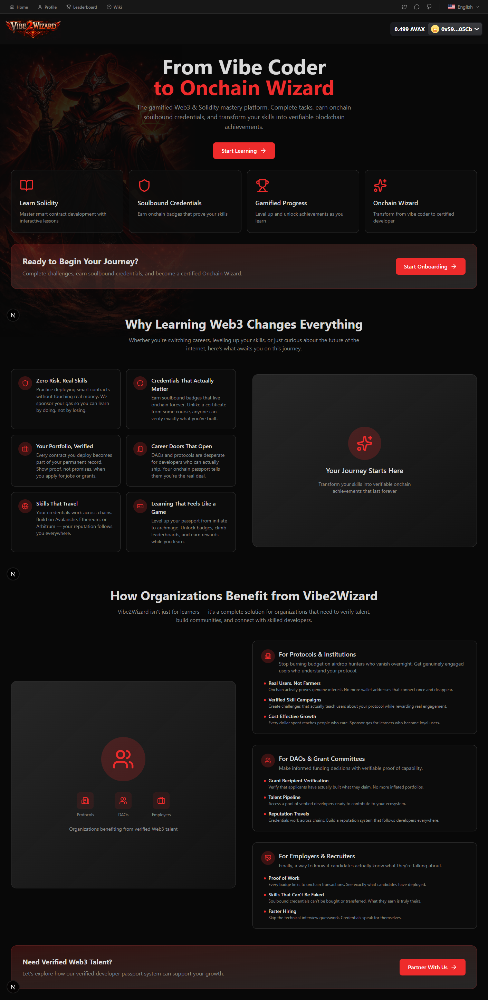

## What Was Vibe2Wizard Trying To Accomplish

Have you ever wanted to build something on the blockchain but felt intimidated by the complexity and the financial risk? You are certainly not alone in this feeling. Every day, thousands of talented designers, developers, and creators look at Web3 and see an exciting future but also see a minefield of potential mistakes that could cost them real money. I have spoken to people who have lost their savings to simple errors, who have given up on their dreams of building in the decentralized space because the learning curve felt impossible, and who have eventually succeeded professionally but had no way to prove their skills to the very protocols and DAOs that might want to hire them.

The story I hear over and over again goes something like this. Someone watches a YouTube tutorial about building smart contracts, copies the code exactly as shown, deploys it to a test network, and watches their transaction fail because the faucet has dried up or the RPC URL is no longer working. They try again the next day only to discover that the tutorial has become outdated because Solidity and the blockchain ecosystem evolve rapidly. Eventually, they gather the courage to deploy to the actual blockchain where real money is at stake, but they accidentally select the wrong network in their wallet and send their funds to the wrong place. Their savings vanish in an instant, and their enthusiasm for Web3 development dies with it.

Even for those who push through these challenges and become competent developers, another problem emerges. They have spent countless hours learning and building, but they have no way to prove their skills to others. They can point to their GitHub repositories, but so can anyone else who has copied code from tutorials. They can show deployed contracts, but there is no way to verify whether they actually wrote the code or simply followed a guide. There has never been a LinkedIn for Web3 developers, a place where your credentials follow you and cannot be faked or purchased.

This is the problem that Vibe2Wizard was built to solve, and I am genuinely excited to share how the solution works.

## The Core Problem

The challenge of learning Web3 development is multidimensional, and understanding each layer helps explain why our solution takes the approach that it does.

The first issue is financial risk. When you are learning traditional software development, your mistakes cost you nothing more than time. You can write buggy code, deploy it to a test server, and fix it without any financial consequences. In Web3 development, every deployment costs real money in the form of gas fees, and when you make a mistake, that money is gone forever. Worse still, a small error in a smart contract can be exploited by automated bots that scan the blockchain looking for vulnerabilities. You might deploy a contract that looks perfect to you, only to wake up the next morning and find that all of your funds have been drained by an attacker who found a flaw you did not know to look for. This creates a terrifying learning environment where mistakes are not just frustrating but potentially devastating.

Now I want to explain why we made the passport soulbound, because this decision goes to the heart of what makes our credentialing system trustworthy. In the world of NFTs, most tokens are designed to be bought and sold. You can own a CryptoPunk and then sell it to someone else. The ownership transfers from one wallet to another. But for a credential to mean anything, it needs to be tied permanently to the person who earned it. If wizards could sell their Archmage passport, the entire system would lose its value. Anyone with enough money could buy a top-tier credential without actually having the skills. That's why we call it "soulbound" — it's bound to your soul (your wallet address) and cannot be transferred away.

The magic of making an NFT soulbound happens in what we call the `_update` function. This is an internal function in the ERC721 standard that gets called whenever a token changes hands. We override it to add our own checks:

```solidity
function _update(address to, uint256 tokenId, address auth)
    internal
    override(ERC721)
    returns (address)
{
    address from = super._update(to, tokenId, auth);

    if (from != address(0) && to != address(0)) {
        revert("WizardPassport: This NFT is soulbound and cannot be transferred");
    }

    if (to != address(0)) {
        require(balanceOf(to) <= 1, "WizardPassport: Each wallet can only have one passport");
    }

    return from;
}
```

Let me walk through what's happening here step by step. The `_update` function is the heart of all ownership changes in ERC721. When someone tries to transfer a token, this function gets called with three parameters: `to` (the recipient address), `tokenId` (which token is being transferred), and `auth` (authorization data that proves the sender is allowed to transfer). We first call the parent ERC721's `_update` function, which performs all the standard checks (does the sender actually own this token? is the recipient valid? etc.) and returns the previous owner address stored in `from`. Then we do our own custom validation.

The first check is the soulbound enforcement. The condition `from != address(0) && to != address(0)` means "both the sender and recipient are real wallet addresses (not the zero address)". If that's true, we revert with an error message. Let's break down when each part is true. `from != address(0)` means there was a previous owner; the token already exists and is owned by someone. `to != address(0)` means the recipient is a regular wallet address, not the zero address which would indicate burning the token. So if both are true, someone is trying to transfer the token from one wallet to another. That's exactly what we want to prevent. However, if `from == address(0)`, that means this is the minting process — the token is being created for the first time. That's allowed. If `to == address(0)`, that would mean someone is trying to burn the token, which we also allow (though in practice our frontend doesn't expose a burn function). The `revert` statement stops execution and rolls back the transaction, ensuring the transfer never happens.

The second check enforces the one-passport-per-wallet rule: `require(balanceOf(to) <= 1, ...)`. After our soulbound check passes, we still need to verify that the destination wallet doesn't already have a passport. The `balanceOf(to)` call returns how many WizardPassport tokens that address currently owns. If they already have one, the balance would be 1, and adding another would make it 2, which violates `<= 1`. This prevents someone from accidentally or intentionally minting multiple passports to the same wallet, which would break our assumption that one wallet equals one identity. The error message makes it clear why the transaction failed.

Finally we return `from`, which is what the parent ERC721 expects. This return value represents the previous owner (or address(0) if this was a mint). Our override doesn't change it, we just use it internally for our checks.

What I find elegant about this approach is that it's minimal and cannot be bypassed. The soulbound property is enforced at the lowest possible level — the token transfer function itself. Even if someone calls a different function or interacts with the contract through a third-party interface, the `_update` function is always invoked during any ownership change. There's no way around it. This is fundamentally different from implementations that rely on external guards or off-chain logic. Our soulbound rules are coded directly into the token's DNA.

Beyond the transfer restriction, we also added `balanceOf(to) <= 1` to enforce single-passport ownership. This creates a clean user experience: each person gets exactly one passport. If they somehow lose access to their wallet, they cannot mint a new one to a different wallet because the system won't know they're the same person. This is a deliberate design trade-off. We prioritized identity permanence over recovery flexibility. In the Web3 world, your wallet is your identity, and if you lose the keys, you lose the identity. That's a hard lesson for beginners, but it's also how the blockchain world works. Our system embraces that reality instead of trying to work around it.

The implementation also emits a custom `PassportMinted` event whenever someone successfully mints their passport. Events in Solidity are like log messages that get written to the blockchain permanently. Anyone can listen for these events to know when a new passport has been created, without having to constantly poll the contract. Let's look at the minting function that triggers this event:

```solidity
function safeMint() public {
    uint256 tokenId = _nextTokenId++;
    
    // Initialize level if needed
    if (_userStats[msg.sender].level == 0) {
        _userStats[msg.sender].level = 1;
    }

    _safeMint(msg.sender, tokenId);
    emit PassportMinted(msg.sender, tokenId);
}
```

I chose to use `safeMint` instead of the simpler `mint` function because it includes important safety checks. The OpenZeppelin `_safeMint` function verifies that the recipient address either is a contract that implements the `onERC721Received` callback (so it knows how to handle receiving an NFT) or is an externally owned account (regular wallet). This prevents tokens from being sent to contracts that can't handle them, which would effectively lock the token forever. For our use case, since we're minting directly to `msg.sender` (the person calling the function, who is always a wallet), `safeMint` is the responsible choice.

The `tokenId` generation is simply sequential: `_nextTokenId++` gives us 1, 2, 3, and so on. This creates a predictable numbering system where the first mint gets token ID 1, the second gets 2, etc. There's no randomness or complexity because the token ID itself doesn't need to mean anything; all the meaningful data (the owner's XP, level, etc.) is stored in the separate `_userStats` mapping.

The level initialization ensures that when someone mints their passport, they start at level 1 if they haven't already earned some XP. This could happen if, for instance, someone mints their passport and then later earns XP through challenges before they've even registered a profile — the XP would be added to their stats, and the level would be calculated appropriately. The `if` check prevents resetting the level to 1 if it's already higher.

Finally, we emit `PassportMinted` with both the wizard's address and the tokenId. These are marked as `indexed` in the event definition, which means they're stored in a way that makes them easily searchable. Anyone building on top of our system can create an event listener that says "alert me whenever any passport is minted" or "show me all mints for this specific address" without having to scan every single transaction.

The second issue is verification. In traditional software development, you can build a portfolio of projects, contribute to open source repositories, and earn certifications that potential employers can check. In Web3, none of these mechanisms exist in a trustworthy form. Anyone can claim to have deployed a contract, but there is no easy way to prove authorship. Certifications from online courses are easily shared or faked. Even professional auditors and security researchers have no portable way to demonstrate their verified track record.

The third issue is credential portability. Even when you do earn credentials or build a reputation in the Web3 space, those credentials are typically locked to a specific platform, blockchain, or ecosystem. If you have built your reputation on Ethereum, it does not automatically carry over to Avalanche, Arbitrum, or Polygon. This means you are constantly starting from scratch as you explore new chains and protocols.

The final issue is the lack of genuine engagement from users. From the perspective of protocols and DAOs trying to build their communities, the current state of user acquisition is broken. They spend enormous budgets on airdrops, liquidity mining programs, and bounty campaigns, only to see the wallet addresses they acquired vanish shortly after the incentives dry up. There is no way to distinguish between someone who genuinely understands and uses a protocol from someone who just wants the free tokens. This creates a wasteful cycle where marketing budgets are burned on users who have no real connection to the ecosystem.

## How Vibe2Wizard Works

The solution we built addresses each of these problems through a carefully designed combination of gamification, blockchain technology, and smart contract architecture.

At the heart of the system is what we call the Wizard Passport, which is a non-fungible token that lives permanently on the blockchain and represents your identity as a Web3 developer. I want to emphasize the word permanent here because that is crucial to understanding why this approach works. Your passport is not stored in our database or dependent on our servers continuing to operate. It exists on the Avalanche blockchain as code that will run forever without any maintenance from us.

When you first join the platform, you begin your journey as an initiate, represented visually by a hooded figure in your passport NFT. As you complete learning quests, deploy real smart contracts to test networks and eventually to mainnet, and pass security challenges, you earn experience points that cause your passport to evolve. The visual representation changes dramatically as you level up, eventually transforming into a glowing Archmage with animated runes that reflect your actual onchain history. This is not just cosmetic decoration; it's a real-time reflection of what you have actually accomplished.

The passport is what we call soulbound, which is a blockchain term meaning it cannot be transferred or sold. This is critically important because it ensures that the credentials you earn are genuinely yours. You cannot buy your way to wizard status, and you cannot gift your achievements to a friend. Everything in your passport represents real work that you have completed.

To understand how the technical implementation works, let me walk you through the smart contract that handles this. The WizardPassport contract is written in Solidity, which is the programming language used for Ethereum-compatible blockchains, and it extends the ERC721 standard that most NFTs use. Here is the complete implementation of the minting and soulbound logic:

```solidity
function safeMint() public {
    uint256 tokenId = _nextTokenId++;
    
    // Initialize level if needed
    if (_userStats[msg.sender].level == 0) {
        _userStats[msg.sender].level = 1;
    }

    _safeMint(msg.sender, tokenId);
    emit PassportMinted(msg.sender, tokenId);
}

function _update(address to, uint256 tokenId, address auth)
    internal
    override(ERC721)
    returns (address)
{
    address from = super._update(to, tokenId, auth);

    if (from != address(0) && to != address(0)) {
        revert("WizardPassport: This NFT is soulbound and cannot be transferred");
    }

    if (to != address(0)) {
        require(balanceOf(to) <= 1, "WizardPassport: Each wallet can only have one passport");
    }

    return from;
}
```

When you call the safeMint function, the contract creates a new token with a unique identifier and assigns it to your wallet address. It also initializes your level to one if this is your first passport. The contract emits an event called PassportMinted that anyone can listen to in order to verify that you have successfully created your passport.

The soulbound restriction is enforced in the `_update` function, which the ERC721 standard calls whenever any ownership change is attempted. Let me explain how this works in detail because it's fundamental to why our credentials are trustworthy. The `_update` function receives three parameters: `to` (the intended recipient), `tokenId` (which token), and `auth` (authorization). We first let the parent ERC721 contract do its standard validation using `super._update`. This ensures the sender actually owns the token and isn't trying to transfer something they don't own. The parent returns the previous owner's address, which we store in `from`.

Now comes our custom soulbound logic. The condition `from != address(0) && to != address(0)` is true exactly when someone is trying to move a token from one real wallet to another real wallet. `address(0)` is a special value meaning "no address" or "the void". If `from` is `address(0)`, that means the token is being minted for the first time (there was no previous owner). If `to` is `address(0)`, that would mean someone is trying to burn the token by sending it to the void. Both of those cases are allowed. But if both are real addresses, that's a transfer, and we revert with an error message. This makes the NFT permanently bound to the wallet that first receives it. Even if someone somehow gets access to your wallet and tries to send the passport to their own wallet, the transaction will fail on-chain. The token simply cannot move.

We also enforce that each wallet can have at most one passport via `require(balanceOf(to) <= 1)`. This prevents someone from minting multiple passports to the same wallet, which would break our one-identity-per-wallet model.

The level system works through a carefully balanced XP curve. The contract includes a library called WizardPassportXPMap that calculates how much experience is needed for each level. The requirements grow exponentially, meaning that reaching level ten is significantly harder than reaching level five, and reaching level fifty is enormously more challenging than reaching level twenty-five. This creates a long-term progression system that can take months or even years to complete, giving serious learners genuine goals to pursue.

What makes this particularly powerful is that all of your credential data — your current level, total XP, and visual representation — lives entirely on-chain and can be verified by anyone without trusting us. The key to this is the `tokenURI` function, which generates your passport's metadata directly from your wallet's stats:

```solidity
function tokenURI(uint256 tokenId)
    public
    view
    override
    returns (string memory)
{
    _requireOwned(tokenId);
    address owner = ownerOf(tokenId);
    UserStats memory stats = _userStats[owner];

    return string(
        abi.encodePacked(
            "data:application/json;base64,",
            Base64.encode(
                bytes(
                    abi.encodePacked(
                        '{"name": "Wizard Passport #', tokenId.toString(), 
                        '", "description": "An official identity passport for the Vibe2Wizard ecosystem.", ',
                        '"image": "', getLevelImage(stats.level), 
                        '", "attributes": [',
                        '{"trait_type": "Level", "value": ', stats.level.toString(), '}, ',
                        '{"trait_type": "XP", "value": ', stats.xp.toString(), '}, ',
                        '{"trait_type": "Type", "value": "Wizard Passport"}]}'
                    )
                )
            )
        )
    );
}
```

This function is called automatically by wallets, block explorers, and NFT marketplaces whenever they want to display your passport. Let me walk through what happens here because the on-chain metadata generation is one of the most innovative parts of our design.

First, `_requireOwned(tokenId)` checks that the person querying this token's metadata actually owns it or has permission to view it. This is a standard security check from OpenZeppelin's ERC721 implementation.

Next, `ownerOf(tokenId)` retrieves the wallet address that currently owns this token. This is important because we look up the stats for that specific owner.

Then `UserStats memory stats = _userStats[owner]` fetches the XP and level data we've been storing for that user as they completed challenges. This data lives directly in the contract's storage, which means it's permanently recorded on the blockchain and cannot be altered by anyone.

Now comes the interesting part. We construct a JSON object that represents the NFT metadata according to the ERC721 standard. wallets and marketplaces expect `tokenURI` to return either an HTTP URL (like `https://ipfs.io/ipfs/...`) or a data URI (like `data:application/json;base64,...`). We chose the data URI approach because it keeps everything completely on-chain without relying on external services. The JSON structure includes the name, description, image URL, and attributes. The image URL comes from `getLevelImage(stats.level)`, which returns a different IPFS link depending on the user's current level. This is where the visual evolution happens: as `stats.level` changes, `getLevelImage` returns a different image, and the NFT appears to transform.

We use `Base64.encode` from OpenZeppelin to convert the JSON bytes into a Base64-encoded string, which gets appended to the `data:application/json;base64,` prefix. This creates a valid data URI that any NFT viewer can interpret. The beauty of this approach is that the metadata generation is completely trustless and dynamic. There's no centralized server that could change the image later. Every time someone queries the tokenURI, the contract reads the current state from storage and generates fresh metadata on the spot. If you earn XP and level up between two queries, you'll get different results each time — and that's exactly what we want.

## The Onboarding Experience

One of the things I am most proud of is the onboarding experience we created. We designed it to be approachable for complete beginners while still being valuable for experienced developers. The journey is broken down into nine clearly defined steps that guide you from absolute zero to having your first verifiable onchain credential.

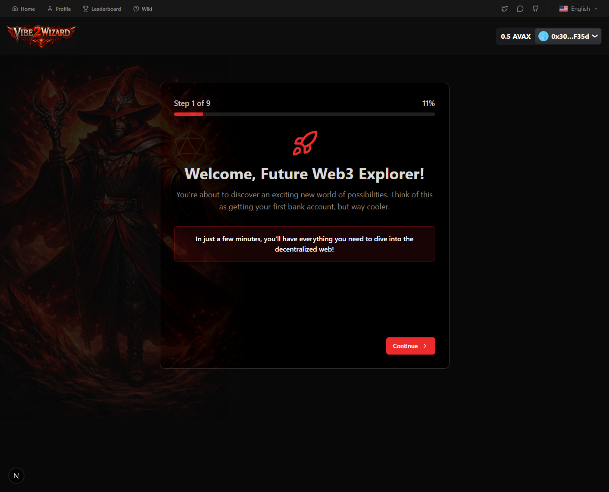

The first step is simply an introduction where we explain what the platform is and why it matters. We want you to understand from the beginning that this is not just another online course where you watch videos and answer quizzes. This is about actually deploying code to the blockchain and earning credentials that belong to you forever.

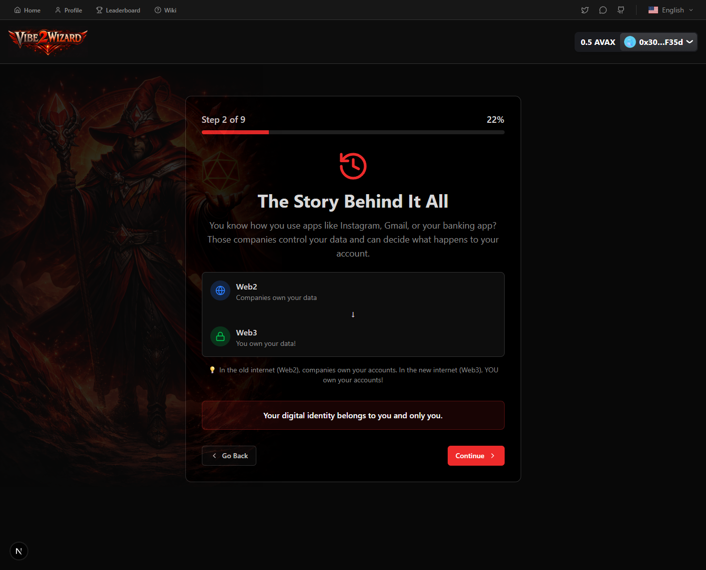

The second step explores your background and helps us understand where you are coming from. Are you a designer who wants to launch NFT collections without hiring a developer? A junior developer trying to break into Web3? A senior engineer looking for a way to prove your skills to DAOs? This helps us customize your learning path.

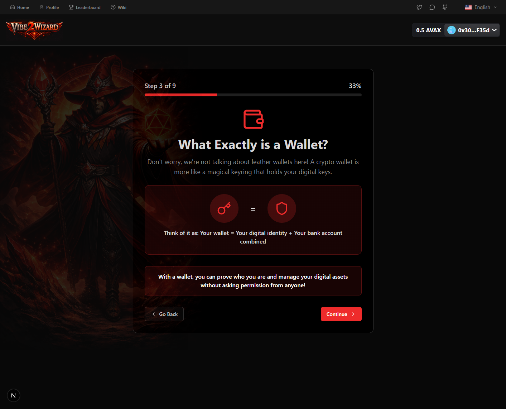

The third and fourth steps explain what a cryptocurrency wallet is and walk you through the different types available. Many beginners are intimidated by this concept, so we take our time and ensure you understand why you need a wallet and how it works.

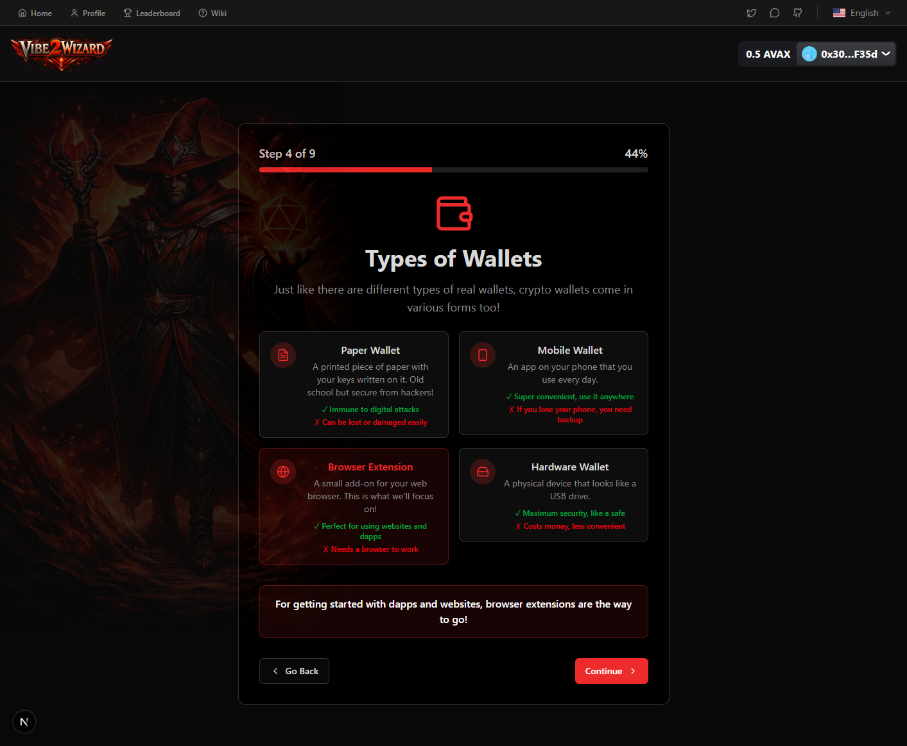

The fifth step helps you install a wallet if you do not already have one. We recommend specific wallets that work well with our platform and provide clear instructions for the installation process.

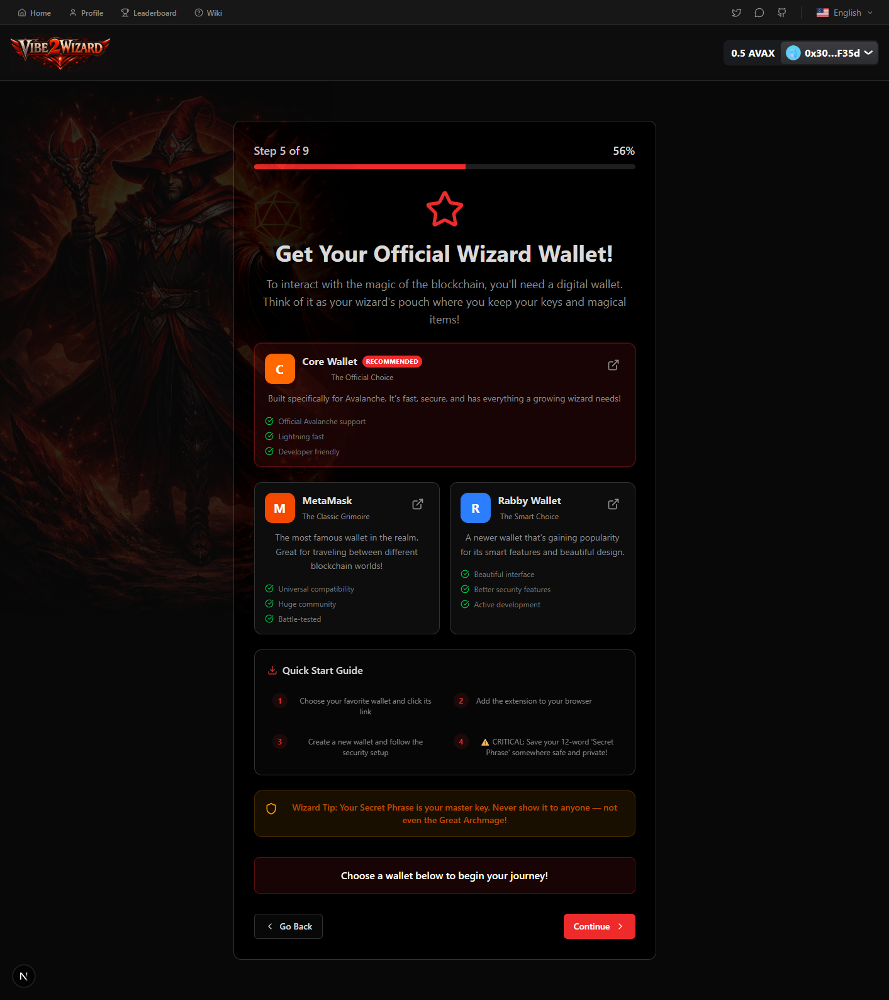

The sixth step is when you actually connect your wallet to our platform. This is the moment when your journey truly begins, as you establish the cryptographic identity that will represent you onchain.

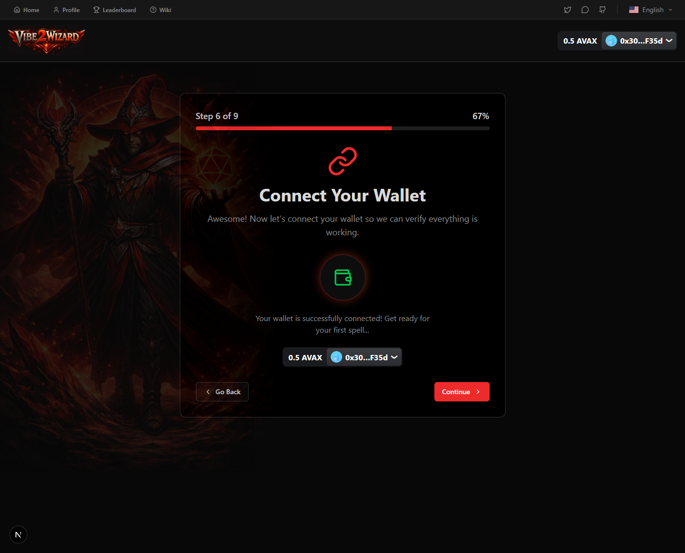

The seventh step asks you to sign a message with your wallet. This serves two purposes: it proves that you control the wallet you have connected, and it familiarizes you with the signing process that you will use frequently as you interact with blockchain applications.

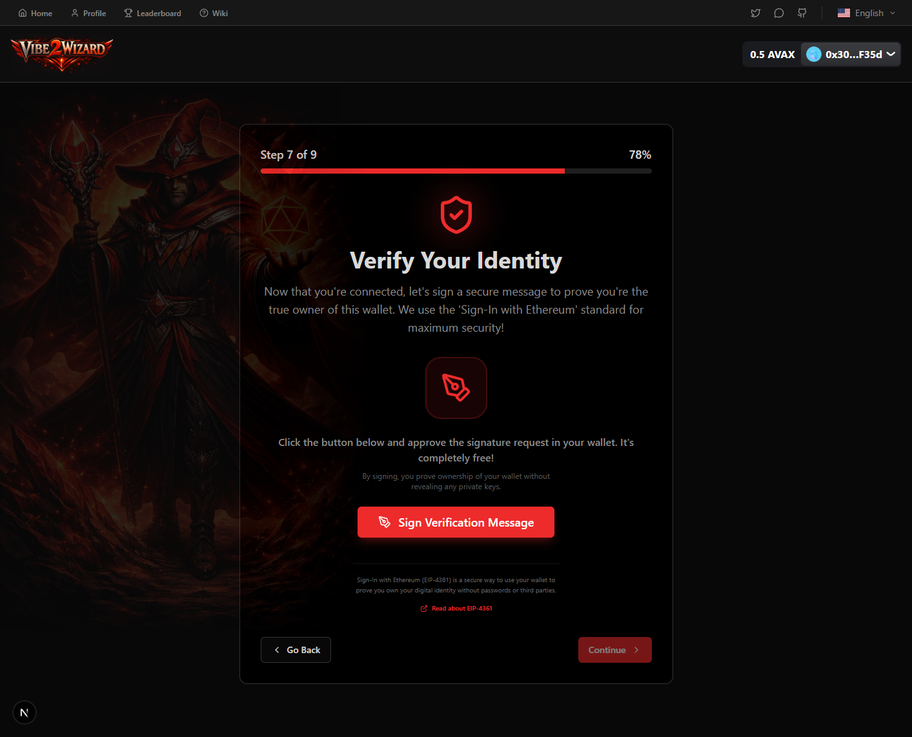

The eighth step ensures you have some test network tokens so you can begin your learning without risking real money. We provide these tokens through our sponsorship program, which is funded by protocol partners who want to attract genuine users rather than airdrop hunters.

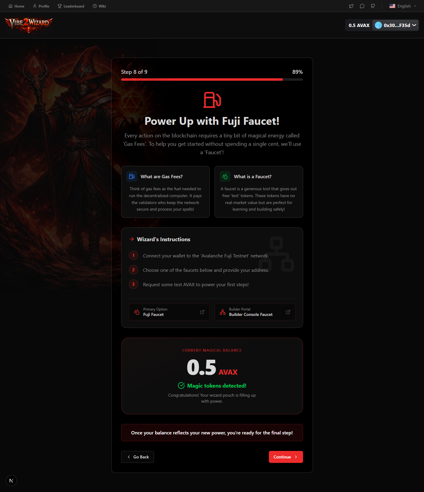

The ninth and final step is where the magic happens. This is when you mint your Wizard Passport NFT, officially entering the ecosystem as a verified learner. We trigger celebratory animations and confetti to mark this milestone, because it genuinely is an important moment in your Web3 journey.

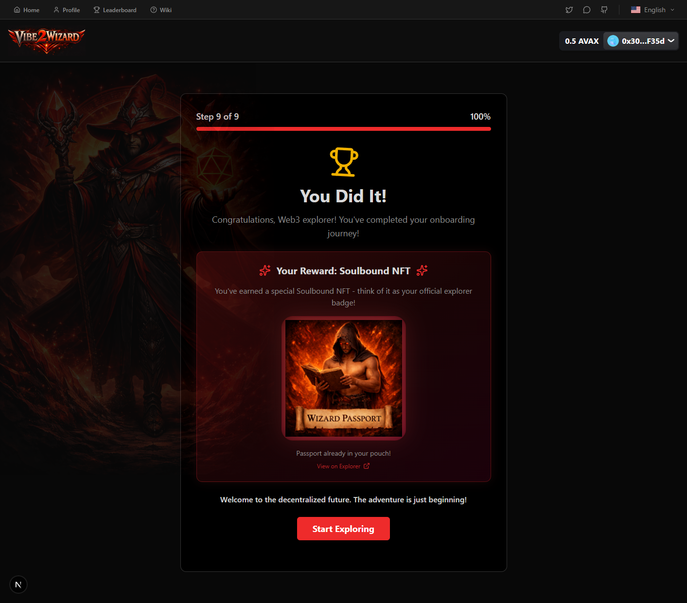

- Transaction Hash: https://testnet.snowtrace.io/tx/0x47193363ad70e75d4babe693fe42c64391087a4d6643cd52a1744ace75a6bfd5

## The User Profile System

Once you have completed onboarding, you gain access to your personal profile page where all of your progress is tracked and displayed. This is where the UserRegistration smart contract comes into play, handling the storage of your profile information.

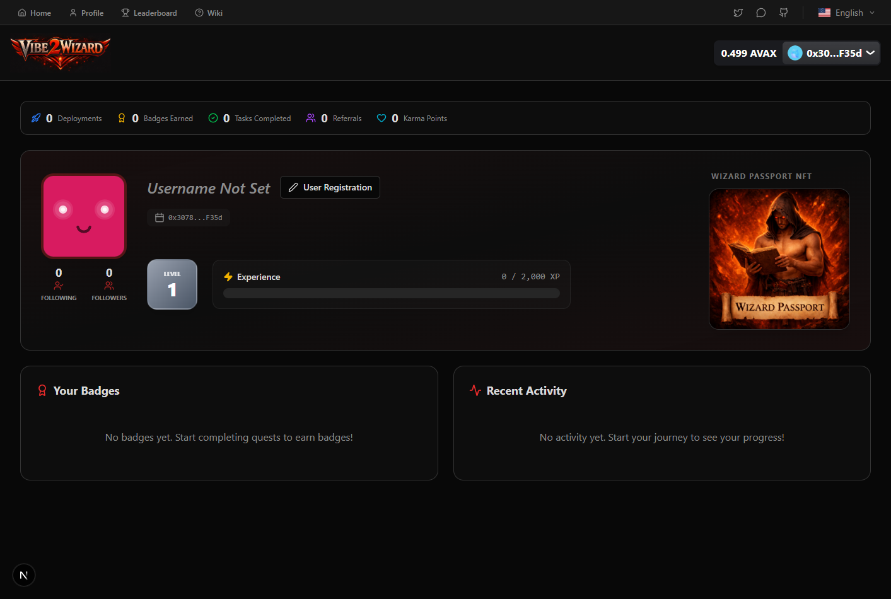

All registrations are Onchain and require users to hold at least one Wizard NFT Passport

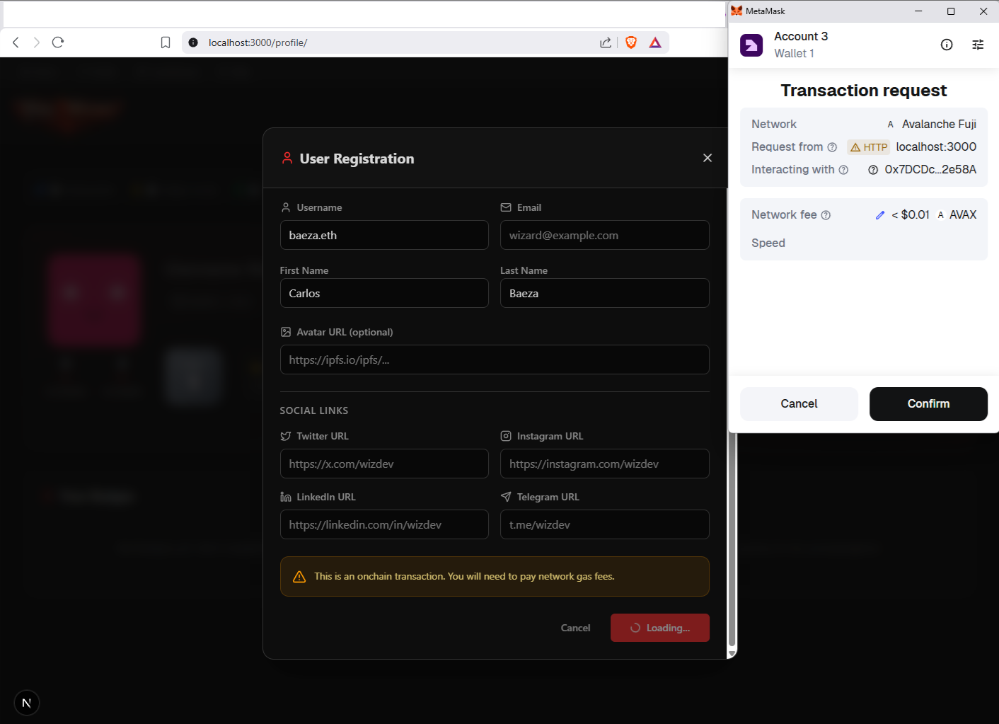

- **Registration Transaction Link:** https://testnet.snowtrace.io/tx/0x035306df666c0ee8bf2a873504193e3214ed42a4a426b8c37a8d663c315c50af

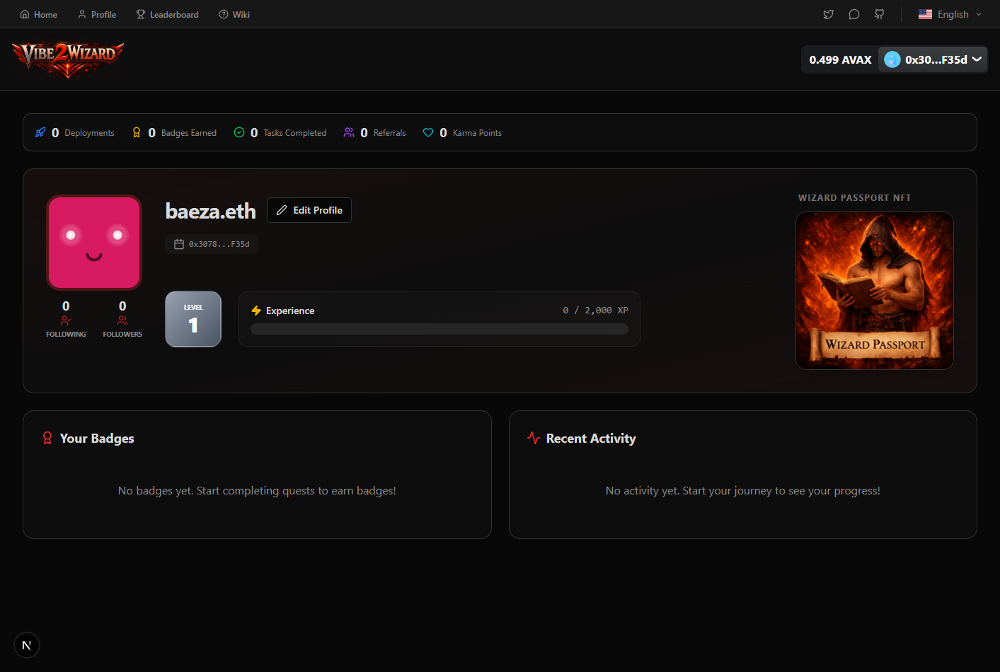

The registration system is designed to require ownership of a Wizard Passport as a prerequisite. This creates a natural gate that ensures every user in our system has at least started the learning journey. You cannot simply create a profile with any wallet address; you must have actually completed the onboarding process and minted your passport. The `onlyWithPassport` modifier enforces this rule:

```solidity
modifier onlyWithPassport() {
    require(wizardPassport.balanceOf(msg.sender) > 0, "Must own a Wizard Passport NFT to register");
    _;
}
```

This modifier is executed before the `registerUser` function runs. It checks whether the caller (`msg.sender`) owns at least one WizardPassport NFT by calling `balanceOf` on the passport contract. If the balance is zero, the transaction reverts with a clear error message. This is a simple but effective gatekeeper that maintains the integrity of our system.

Now let me walk you through the complete registration function, because there's more complexity here than meets the eye:

```solidity
function registerUser(
    string memory _username,
    string memory _firstName,
    string memory _lastName,
    string memory _email,
    string memory _twitterUrl,
    string memory _instagramUrl,
    string memory _linkedinUrl,
    string memory _telegramUrl,
    string memory _avatarUrl
) external onlyWithPassport validateRegistration(_username) {
    bool alreadyRegistered = _users[msg.sender].isRegistered;

    _users[msg.sender] = UserProfile({
        username: _username,
        firstName: _firstName,
        lastName: _lastName,
        email: _email,
        twitterUrl: _twitterUrl,
        instagramUrl: _instagramUrl,
        linkedinUrl: _linkedinUrl,
        telegramUrl: _telegramUrl,
        avatarUrl: _avatarUrl,
        isRegistered: true
    });

    if (!alreadyRegistered) {
        _allUsernames.push(_username);
        _userAddresses.push(msg.sender);
        emit UserRegistered(msg.sender, _username);
    } else {
        emit UserUpdated(msg.sender, _username);
    }
}
```

The function accepts all the expected profile fields: name components, social media URLs, email, and an avatar image URL. Notice the `validateRegistration` modifier applied to this function. That's where the username uniqueness magic happens:

```solidity
modifier validateRegistration(string memory _username) {
    require(bytes(_username).length > 0, "Username cannot be empty");

    if (_users[msg.sender].isRegistered) {
        // Requirement: Username cannot be changed once set
        require(
            keccak256(bytes(_users[msg.sender].username)) == keccak256(bytes(_username)),
            "Username cannot be changed"
        );
    } else {
        // Requirement: Check uniqueness using an array since mappings cannot be iterated
        for (uint256 i = 0; i < _allUsernames.length; i++) {
            require(
                keccak256(bytes(_allUsernames[i])) != keccak256(bytes(_username)),
                "Username already taken"
            );
        }
    }
    _;
}
```

This modifier performs three crucial checks. First, it ensures the username isn't empty by checking `bytes(_username).length`. The `bytes()` conversion turns a string into a byte array so we can check its length; an empty string would have length 0, which would fail the require statement.

Second, it handles the case where the user is already registered. If `_users[msg.sender].isRegistered` is true, we compare the provided `_username` against the one already stored using `keccak256` hash comparison. Why use hashes instead of direct string equality? In Solidity, comparing two strings requires examining each byte of both strings, which can be expensive in gas if the strings are long. Hashing both strings and comparing the fixed-size 32-byte hashes is much cheaper. And crucially, we require the hashes to be equal; if the user tries to provide a different username, the transaction reverts with "Username cannot be changed." This immutability is a feature, not a bug. It prevents impersonation and ensures that when someone looks up a user by their username, they are seeing the genuine article.

Third, for new registrations, we iterate through `_allUsernames` to ensure the requested username hasn't already been taken. The iteration pattern `for (uint256 i = 0; i < _allUsernames.length; i++)` walks through the entire array of existing usernames and checks each one. The comment in the code explains why we use an array instead of a mapping: mappings in Solidity cannot be iterated because their keys are not stored in any particular order. An array gives us sequential access to all usernames, which is necessary for uniqueness checking. The trade-off is that this check could become expensive if we have many thousands of registered users, because we'd potentially need to compare the new username against every existing one. For a platform that expects to grow large, this is something to keep an eye on. In practice, usernames are relatively short strings, and the iteration cost scales linearly with user count, so it remains acceptable for moderate growth.

Let's talk about the data storage pattern. We have a mapping `_users` that maps wallet addresses to `UserProfile` structs. This gives us O(1) lookup time when we want to retrieve a user's profile by their address. We also maintain two arrays: `_allUsernames` stores every claimed username in order, and `_userAddresses` stores the corresponding wallet addresses. These arrays serve two purposes: they enable username-to-profile lookup via `getUserByUsername`, and they allow enumeration of all users via `getAllUsers`. The relationship is that the username at index `i` in `_allUsernames` belongs to the address at index `i` in `_userAddresses`. This parallel array pattern is a common Solidity technique when you need to iterate and also maintain fast lookups.

Now let's look at how someone can look up a user by their username:

```solidity
function getUserByUsername(string memory _username) external view returns (UserProfile memory) {
    for (uint256 i = 0; i < _allUsernames.length; i++) {
        if (keccak256(bytes(_allUsernames[i])) == keccak256(bytes(_username))) {
            return _users[_userAddresses[i]];
        }
    }
    revert("User not found");
}
```

Here we iterate through `_allUsernames`, compute the keccak256 hash of each stored username and compare it to the hash of the requested username. When we find a match, we use the index `i` to look up the corresponding address in `_userAddresses`, then retrieve that user's full profile from the `_users` mapping. This pattern gives us flexible lookup capabilities: we can go from address to profile instantly via `getUser(address)`, and we can go from username to profile via `getUserByUsername(string)` with a linear search through the usernames array. Both paths are useful in different contexts. The profile page might show data based on the connected wallet (address lookup), while a search feature or "view user by username" feature would use the username lookup function.

Your profile displays all of the key information that represents your Web3 journey. This includes your current level and XP (retrieved from the WizardPassport contract), your progress toward the next level (calculated using `getXPThreshold`), the badges you have earned (from other contracts we've built), your deployment history (tracked by platform integrations), and your social connections (from your profile data). All of this data is either stored onchain directly or is verifiable onchain, making it permanently trustworthy. Nobody can alter your level or XP retroactively because those values are mathematically tied to the actual transactions recorded on the Avalanche blockchain.

What I'm most proud of in this design is how everything ties together into a coherent system where each contract has a clear responsibility. The WizardPassport handles identity and level progression. The UserRegistration handles profile data. The two contracts reference each other, creating a dependency graph that makes sense. You cannot register a profile without a passport, which ensures every registered user has earned their place. And your passport stats are independent of your profile — you could have a passport without a profile, and your level would still be valid. The separation of concerns makes the architecture clean and maintainable.

## 🖼️ NFT Evolution: Your Visual Journey from Novice to Grandmaster

I want to walk you through one of the most magical aspects of the Wizard Passport because when you see it in action, it truly feels like watching a digital caterpillar transform into a butterfly. Your passport isn't just a static image that sits in your wallet gathering digital dust. No, it's a living, breathing representation of your actual progress. Every time you level up, the image magically updates to show your new form. When you start, you're a hooded novice with cautious eyes and simple robes. After you've deployed a few contracts and passed some security challenges, you become an apprentice with brighter colors and more confidence showing in your pose. Keep going and you'll transform into an acolyte, then an adept, then a full mage with swirling energy all around you. The journey continues all the way to archmage with glowing runes, and finally the legendary grandmaster with cosmic power radiating from every pixel. This visual evolution isn't just pretty to look at—it's a story. Every single person who looks at your passport can instantly see how far you've traveled on your Web3 learning journey.

Now the really cool part is how we made this happen technically. I wanted the evolution to feel seamless and automatic, like magic, but behind the scenes there's some clever engineering that makes it all work reliably. Let me peel back the curtain and show you exactly how the dynamic image switching works, because once you understand this, you'll see why blockchain technology enables possibilities that traditional apps can't match.

Every NFT on the blockchain has something called a tokenURI, which is essentially a web address (or link) that points to the NFT's metadata—the information that describes what the NFT is: its name, description, image, and any special attributes. Most NFTs store this metadata on external servers or on IPFS, and the tokenURI just returns that fixed link. When you mint the NFT, its image is locked in forever. That's why your CryptoPunk or Bored Ape never changes—the tokenURI always returns the same metadata with the same image.

We took a completely different approach with the Wizard Passport. Our tokenURI doesn't return a static link. Instead, it generates fresh metadata every single time someone asks for it, and the image it returns depends entirely on who's asking and what their current level is. Let me show you the actual function that makes this possible because it's a thing of beauty.

```solidity
function tokenURI(uint256 tokenId)
    public
    view
    override
    returns (string memory)
{
    _requireOwned(tokenId);
    address owner = ownerOf(tokenId);
    UserStats memory stats = _userStats[owner];

    return string(
        abi.encodePacked(
            "data:application/json;base64,",
            Base64.encode(
                bytes(
                    abi.encodePacked(
                        '{"name": "Wizard Passport #', tokenId.toString(), 
                        '", "description": "An official identity passport for the Vibe2Wizard ecosystem.", ',
                        '"image": "', getLevelImage(stats.level), 
                        '", "attributes": [',
                        '{"trait_type": "Level", "value": ', stats.level.toString(), '}, ',
                        '{"trait_type": "XP", "value": ', stats.xp.toString(), '}, ',
                        '{"trait_type": "Type", "value": "Wizard Passport"}]}'
                    )
                )
            )
        )
    );
}
```

I need to explain what's happening here in plain language because this code is the key to everything. When your wallet, or OpenSea, or any app wants to display your passport, they call this function with your token ID. The function does three important things. First, it checks that the person asking actually owns this token, because we don't want someone snooping on other people's passports without permission. Second, it looks up the owner's wallet address and then retrieves that person's current stats—their level and experience points—from our contract storage. Third, and most importantly, it builds a fresh metadata JSON object where the image field is set by calling `getLevelImage(stats.level)`.

That last part is where the magic happens. Instead of hardcoding one image link that never changes, we call a function that returns a different IPFS link depending on the user's current level. If they're level 15, the function returns the Novice image. If they just reached level 20, it returns the Apprentice image. At level 100, it returns the Grandmaster image. The metadata is assembled on the spot, encoded into Base64, and returned as a special "data URI" that contains the entire JSON object built right into the link itself. This means there's no external database that we could tamper with—the image is mathematically determined by the user's on-chain stats every single time someone asks to see it.

Now let me show you the getLevelImage function because it's the piece that maps levels to visual assets:

```solidity
function getLevelImage(uint256 level) public pure returns (string memory) {
    if (level >= 100) {
        return "https://ipfs.io/ipfs/bafybeiaq4ned3zzjaxeyrpomwemqa4a7e323bdemql3bjaz2yha6342i5q";
    }
    if (level >= 90) {
        return "https://ipfs.io/ipfs/bafybeih62jvinvvccfmsdhylev2eigyorgxpy4igmxvcoes5p7ftokaeie";
    }
    if (level >= 80) {
        return "https://ipfs.io/ipfs/bafybeicvihyvmo3d7euimen3bcbuftbho3hfapaenfh6j2stiomsrrc57u";
    }
    if (level >= 70) {
        return "https://ipfs.io/ipfs/bafybeic7oozlteewjzxf243smhvat6jcmrewhryb367u5ohqzq5zu7znlu";
    }
    if (level >= 60) {
        return "https://ipfs.io/ipfs/bafybeifgwdnylz6jjyruuqasmlwakeijz3pzs4kkly3bg6ci6puurm5lwm";
    }
    if (level >= 50) {
        return "https://ipfs.io/ipfs/bafybeigmnycqbpico4lqznj6xagdwjaocaqzzssjrumyffyt2duzd76u6m";
    }
    if (level >= 40) {
        return "https://ipfs.io/ipfs/bafybeidfmztwlyiw223mubieumegpvhb5fdfcvpmuc3sgj323iw5mkqule";
    }
    if (level >= 30) {
        return "https://ipfs.io/ipfs/bafybeidzduxp2rytrx2eqxg6skx6huffju6uvmdrnde4oashbw6lcticsq";
    }
    if (level >= 20) {
        return "https://ipfs.io/ipfs/bafybeie4ufdq7kqm6gk24kpekcpwkfijmxsxc33ogtxgeixxxnjtl5gzny";
    }
    return "https://ipfs.io/ipfs/bafybeicd5pabcwgppnekgimxur4n3jjagc2n3b6pmu5blp5td3kvuz2osu";
}
```

I love this cascade of if statements because it's so straightforward and effective. The function checks the user's level against each threshold from highest to lowest. The moment it finds a level where the user meets or exceeds the requirement, it returns the corresponding IPFS link for that tier. If none of the higher thresholds match, it falls through to the default return at the bottom, which is the Novice image for levels 1 through 19. The IPFS links you see there are permanent addresses on the InterPlanetary File System—think of it as a decentralized version of the internet where files are stored across many computers and once uploaded, they can't be altered or deleted. Each image has a unique content identifier (that long string of letters) that's mathematically derived from the file itself. If we changed even a single pixel, the CID would be completely different. This makes the artwork immutable and verifiable. When you look at your passport, you're seeing exactly the artwork we intended for your tier, and that artwork is stored on a network that's resistant to censorship and link rot.

Now let's talk about when and how this image actually changes. The crucial detail is that the image doesn't update automatically at a specific moment. Instead, it updates the next time anyone (including you) asks to see your passport metadata. Here's what happens in a typical level-up scenario. You complete a challenging deployment, the system awards you 5000 XP, and your total XP crosses the threshold for level 20. At that moment, the contract updates your stats: your `_userStats[yourAddress].xp` increases and `_userStats[yourAddress].level` gets recalculated to 20. But your passport image in your wallet still shows the Novice because your wallet's last cached metadata still had the old image. The magic happens when something—maybe you, maybe a marketplace, maybe a friend—calls the `tokenURI` function again. That function reads your fresh stats, sees that your level is now 20, calls `getLevelImage(20)`, gets the Apprentice image link, and returns that in the metadata. The wallet or marketplace then updates what it displays. In practice, this update can happen within seconds or it might take a few minutes depending on whether the app actively polls for updates or waits for you to manually refresh. But the important thing is that the image is never wrong—it always reflects the current on-chain reality whenever someone queries it.

This dynamic approach is fundamentally different from how traditional apps handle profile pictures. In a normal web app, you might upload a new avatar and the server updates a database row. From that moment on, everyone sees the new image because the server always sends the latest version. That works fine when there's a central server. But in the decentralized world of Web3, we don't have that luxury. We can't go updating some NFT metadata server every time someone levels up because that would require trusted infrastructure, which defeats the purpose. Instead, we designed the contract to be a self-contained truth machine: the metadata generation happens on-chain, reading from the authoritative state (your XP and level) and producing an output that anyone can verify without trusting us. This is what we mean by "trustless"—no one needs to ask us to update your image; the blockchain itself computes it correctly every single time based on the immutable record of your achievements.

What makes this particularly powerful is that your passport image is not just a reward you earn; it's an ongoing proof that travels with you across the entire Web3 ecosystem. If you display your passport on your personal website, on a social platform that supports NFTs, or on a decentralized gallery, all those places will show your current level without us having to push updates to them. The image they fetch is always computed fresh from the source of truth: your wallet's stats on the Avalanche blockchain. This is a pattern that can be used for any kind of evolving digital identity—imagine a gaming NFT that changes as you win more battles, or a reputation badge that updates as you complete more jobs, all without any central server coordinating the changes.

I'm also really excited about how this sets us up for future enhancements. Because the image is computed dynamically, we could make it even more sophisticated. We could add your XP as a glowing number overlaid on the image. We could show different variants based on not just your level but also the specific badges you've earned. We could even incorporate on-chain data like your most recently deployed contract address as a small rune in the background. All of that would be just additional logic in the tokenURI or getLevelImage functions, and it would instantly update everywhere the passport is displayed. The architecture is built to scale in richness, not just in levels.

When I think about the entire NFT evolution system, what gives me the most satisfaction is how it demonstrates the unique capabilities of blockchain for identity and credentials. This isn't about making pretty pictures that change; it's about creating a verifiable, unstoppable representation of real achievement that cannot be faked, purchased, or altered. Your evolving image is the visual summary of your learning journey, and that journey is permanently recorded in the code and transactions of the Avalanche blockchain. Every time you look at your passport and see that you've become an Archmage, you're not just seeing a cool picture—you're seeing a mathematical proof that you've earned it. That's the kind of system that could genuinely change how we think about skills, credentials, and reputation in the decentralized future we're building.

And here's the complete picture of all ten tiers so you can see the full visual journey that awaits:


### Level Tiers & Artwork

| Level Range | Tier Name | Local Portrait | IPFS Link |
| :--- | :--- | :--- | :--- |
| **1 - 19** | Novice |  | https://ipfs.io/ipfs/bafybeicd5pabcwgppnekgimxur4n3jjagc2n3b6pmu5blp5td3kvuz2osu |
| **20 - 29** | Apprentice |  | https://ipfs.io/ipfs/bafybeie4ufdq7kqm6gk24kpekcpwkfijmxsxc33ogtxgeixxxnjtl5gzny |
| **30 - 39** | Acolyte |  | https://ipfs.io/ipfs/bafybeidzduxp2rytrx2eqxg6skx6huffju6uvmdrnde4oashbw6lcticsq |
| **40 - 49** | Adept |  | https://ipfs.io/ipfs/bafybeidfmztwlyiw223mubieumegpvhb5fdfcvpmuc3sgj323iw5mkqule |
| **50 - 59** | Mage |  | https://ipfs.io/ipfs/bafybeigmnycqbpico4lqznj6xagdwjaocaqzzssjrumyffyt2duzd76u6m |
| **60 - 69** | Sorcerer |  | https://ipfs.io/ipfs/bafybeifgwdnylz6jjyruuqasmlwakeijz3pzs4kkly3bg6ci6puurm5lwm |
| **70 - 79** | High Mage |  | https://ipfs.io/ipfs/bafybeic7oozlteewjzxf243smhvat6jcmrewhryb367u5ohqzq5zu7znlu |
| **80 - 89** | Archmage |  | https://ipfs.io/ipfs/bafybeicvihyvmo3d7euimen3bcbuftbho3hfapaenfh6j2stiomsrrc57u |
| **90 - 99** | Master Wizard |  | https://ipfs.io/ipfs/bafybeih62jvinvvccfmsdhylev2eigyorgxpy4igmxvcoes5p7ftokaeie |
| **100** | Grandmaster |  | https://ipfs.io/ipfs/bafybeiaq4ned3zzjaxeyrpomwemqa4a7e323bdemql3bjaz2yha6342i5q |

Each tier represents not just a number, but a story of dedication, learning, and real accomplishment. And your passport will show the world exactly where you are on that path.

## Frontend Technology and Contract Integration

The web interface that you interact with is built using modern technologies that ensure a smooth and responsive experience. I chose Next.js as our framework because it provides excellent performance and developer experience, with features like automatic code splitting, server-side rendering, and a great development workflow. Tailwind CSS lets us create beautiful, responsive interfaces quickly without writing custom CSS files.

Wallet connection is handled through RainbowKit and Wagmi, which are the industry-standard libraries for integrating cryptocurrency wallets into web applications. When you click the connect button, these libraries handle the complex process of communicating with your wallet extension (like MetaMask or Rabby), requesting permissions, and establishing a secure connection to our platform. They take care of all the edge cases: what happens if the user doesn't have a wallet installed, what if they reject the connection, what if they're on a mobile device, and so on. This saved us weeks of development time.

Now I want to dive deep into how the frontend actually talks to our smart contracts, because this interaction pattern is something I'm really proud of. We built a custom hook system using Wagmi's React Query integration that makes contract interactions feel like ordinary JavaScript function calls. Let me show you the `useWizardPassport` hook in its entirety, because this is the bridge between our user interface and the blockchain:

```typescript
export function useWizardPassport(targetAddress?: `0x${string}`) {
    const { address: connectedAddress } = useAccount();
    const address = targetAddress || connectedAddress;
    const contractAddress = process.env.NEXT_PUBLIC_CONTRACT_WIZARD_PASSPORT_ADDRESS as `0x${string}`;

    // Read balance to check ownership
    const {
        data: balance,
        refetch: refetchBalance,
        isLoading: isBalanceLoading,
        isError: isBalanceError
    } = useReadContract({
        address: contractAddress,
        abi: WizardPassportABI,
        functionName: 'balanceOf',
        args: address ? [address] : undefined,
        query: {
            enabled: !!address,
        }
    });

    // Read user stats (XP and Level)
    const {
        data: userStats,
        refetch: refetchStats,
        isLoading: isStatsLoading,
    } = useReadContract({
        address: contractAddress,
        abi: WizardPassportABI,
        functionName: 'getUserStats',
        args: address ? [address] : undefined,
        query: {
            enabled: !!address,
        }
    });

    const hasPassport = balance ? Number(balance) > 0 : false;
    const xp = userStats ? Number((userStats as any).xp) : 0;
    const level = userStats ? Number((userStats as any).level) : 1;

    // Read level image
    const {
        data: levelImage,
    } = useReadContract({
        address: contractAddress,
        abi: WizardPassportABI,
        functionName: 'getLevelImage',
        args: [BigInt(level)],
        query: {
            enabled: hasPassport,
        }
    });

    // Read next level XP threshold
    const {
        data: nextLevelXP,
        isLoading: isXPThresholdLoading,
    } = useReadContract({
        address: contractAddress,
        abi: WizardPassportABI,
        functionName: 'getXPThreshold',
        args: [BigInt(level + 1)],
        query: {
            enabled: hasPassport,
        }
    });

    // Minting logic
    const {
        data: hash,
        writeContract,
        isPending: isWriting,
        error: writeError
    } = useWriteContract();

    const {
        isLoading: isWaiting,
        isSuccess: isMintedSuccess,
        error: waitError
    } = useWaitForTransactionReceipt({
        hash,
    });

    const isMinting = isWriting || isWaiting;

    useEffect(() => {
        if (isMintedSuccess) {
            refetchBalance();
            refetchStats();
        }
    }, [isMintedSuccess, refetchBalance, refetchStats]);

    const mintPassport = () => {
        writeContract({
            address: contractAddress,
            abi: WizardPassportABI,
            functionName: 'safeMint',
        });
    };

    return {
        hasPassport,
        balance,
        xp,
        level,
        nextLevelXP: nextLevelXP ? Number(nextLevelXP) : (level + 1) * 500,
        levelImage: levelImage as string,
        isBalanceLoading,
        isBalanceError,
        isStatsLoading,
        isXPThresholdLoading,
        mintPassport,
        isMinting,
        isMintedSuccess,
        hash,
        writeError,
        waitError,
        refetchBalance,
        refetchStats,
        address,
        connectedAddress,
        contractAddress,
    };
}
```

This hook is a masterpiece of abstraction. It takes an optional `targetAddress` parameter, which allows you to either look at the currently connected wallet's passport (if you omit the parameter) or look up any other user's passport by providing their address. This is how we build both the "my profile" page and the "view other user" page using the same underlying logic.

The hook begins by using Wagmi's `useAccount` to get the currently connected wallet address. Then it determines which address to query: either the provided `targetAddress` or the connected address. The contract address comes from a public environment variable that gets baked into the frontend at build time. This is standard practice for Next.js applications.

What follows are several `useReadContract` calls, each representing a read operation (a read-only query) to the blockchain. Notice how we set up the `query.enabled` option to conditionally enable each query. The pattern `enabled: !!address` means "only run this query if we have a non-null address". This prevents unnecessary requests when the user isn't connected or when we're in an initial loading state. Wagmi and React Query handle caching, background refetching, and state management automatically. When the component first mounts, we might see loading states as the queries are in flight. Once the data arrives, it gets cached and reused across components. If the user navigates away and comes back, the data might still be fresh enough to show immediately without a new network request.

The `balance` query calls `balanceOf(address)` on the WizardPassport contract. This returns a big number representing how many passport NFTs that address owns. In our system, this should be either 0 or 1 because of the soulbound restriction, but we treat it as a number to be safe.

The `userStats` query calls `getUserStats(address)`. The return value is a tuple (or struct) containing `xp` and `level`. We destructure these with TypeScript type assertions because the ABI types from Wagmi come back as `bigint` but we often want to work with regular JavaScript numbers for display. The `as any` cast is a pragmatic choice; we could be more precise with proper typing but for our purpose this works.

From these read queries, we compute derived values: `hasPassport` is true if `balance > 0`. The `xp` and `level` values default to 0 and 1 respectively if no data is available yet (like when the user isn't connected). This ensures the rest of our UI can safely render without null-checking everywhere.

The `getLevelImage` query fetches the image URL for the user's current level. This is a `pure` function call that doesn't need to read any state about the specific user; it only needs the level number. We pass `BigInt(level)` because Solidity expects a `uint256` and Wagmi expects bigint values for numeric arguments. The result is a string IPFS URL that we cast to `string` and return through the hook.

Similarly, the `getXPThreshold` query asks the contract how much XP is needed for the next level. This computation uses the binary search implementation we discussed earlier. We derive a fallback value `(level + 1) * 500` for cases where the query isn't enabled or hasn't loaded yet. That's a rough approximation based on an early-level XP curve, just so the UI shows something sensible while loading.

Now for the write operations — the minting function. This uses Wagmi's `useWriteContract` hook, which handles transaction submission. When `mintPassport()` is called, it invokes `writeContract` with the contract address, ABI, and function name. This triggers the wallet to show a confirmation dialog to the user, asking them to approve the transaction and pay the gas fee. Once they approve, the transaction gets broadcast to the network. The hook returns a transaction `hash` immediately, and we enter a waiting state.

The `useWaitForTransactionReceipt` hook polls the blockchain (or subscribes to events, depending on the network) until the transaction is either confirmed or fails. The `isWriting` flag comes from `useWriteContract` and indicates that the wallet is preparing the transaction. The `isWaiting` flag indicates we're waiting for the transaction receipt. Together they make `isMinting`, which our UI uses to show spinner buttons and disable further clicks.

The `useEffect` that runs `refetchBalance` and `refetchStats` when `isMintedSuccess` becomes true is crucial. After the transaction confirms, our read queries still have stale data from before the mint. We need to refresh them to reflect the new state where the user now owns a passport, has level 1, and has 0 XP. The `refetch` functions are provided by the `useReadContract` hooks, and calling them triggers a fresh network request. This pattern ensures our UI updates immediately after the blockchain confirms the change.

What I love about this hook architecture is that it encapsulates all the complexity of blockchain interaction. A React component using `useWizardPassport` simply destructures `hasPassport`, `level`, `xp`, `isMinting`, and `mintPassport`, then wires those up to buttons and displays. The component doesn't need to know about ABIs, bigints, transaction receipts, or error handling. All that is handled inside the hook. This makes our UI code clean, declarative, and easy to test.

The `useUserRegistration` hook follows the same pattern for the UserRegistration contract. It provides `isRegistered`, `userProfile`, `registerUser`, and various refetch functions. The profile registration form in our onboarding flow uses this hook to submit the user's social links and avatar information. The hook also supports looking up another user by their username via `useUserLookup`, which queries `getUserByUsername` as we saw earlier.

The ABI files (WizardPassport.ts and UserRegistration.ts) contain the machine-readable interface definitions that Wagmi uses to encode and decode transaction data. These are generated from our Solidity contracts or written by hand. They list every function, its parameters, return types, and events. Wagmi needs this to know how to build the correct bytecode for a function call and how to interpret the returned bytes.

Our frontend is fully responsive and works on mobile and desktop. We use Framer Motion for smooth animations between onboarding steps. The experience is carefully crafted to guide beginners through what would otherwise be a daunting process: connecting a wallet, signing transactions, and understanding what's happening on-chain. Every step explains why we're doing what we're doing, and we use sponsored gas on testnet so users don't need to acquire tokens themselves.

We also integrated internationalization from day one. All user-facing strings are stored in translation files (`en.ts`, `es.ts`), and our components use a `useI18n` hook to retrieve the appropriate text based on the user's selected language. This makes the platform accessible to non-English speakers and demonstrates our commitment to global accessibility.

The entire system — smart contracts and frontend — is designed to work together seamlessly. The contracts provide the trustless, permanent, verifiable core. The frontend provides an approachable, educational, and delightful interface. When you put them together, you get a platform where someone with zero Web3 knowledge can arrive, learn step by step, deploy real contracts, earn real credentials, and walk away with something that neither we nor anyone else can take away from them.

## The React Component Architecture: Building the User Interface

Now I want to walk you through the actual frontend code that brings this platform to life. I've already shown you the custom hook system, but I'd like to dive into the React components that make up the user interface. These are the TypeScript files with the .tsx extension that you'll find in our `web_client_nextjs` folder. I'll explain each component's responsibility and how it works, with plenty of code snippets so you can see exactly how everything fits together.

### The Application Foundation: _app.tsx

Let me start at the very top: the `_app.tsx` file. In Next.js using the Pages Router, this file is the root of your application. Every page gets wrapped by what you put here. This is where I set up all the important providers that make our features work across the entire site.

```tsx
import '../styles/globals.css';
import '@rainbow-me/rainbowkit/styles.css';
import type { AppProps } from 'next/app';

import { QueryClient, QueryClientProvider } from '@tanstack/react-query';
import { WagmiProvider } from 'wagmi';
import { RainbowKitProvider, darkTheme } from '@rainbow-me/rainbowkit';
import { avalancheFuji } from 'wagmi/chains';

import { config } from '../wagmi';
import { I18nProvider, useI18n } from '@/i18n';
import { Navbar } from '@/components/ui/navbar';

const client = new QueryClient();

function AppContent({ Component, pageProps }: AppProps) {
  const { language } = useI18n();

  return (
    <RainbowKitProvider 
      theme={darkTheme({
        accentColor: '#ef4444',
        accentColorForeground: 'white',
        borderRadius: 'medium',
        fontStack: 'system',
      })}
      initialChain={avalancheFuji}
      locale={language}
    >
      <Navbar>
        <Component {...pageProps} />
      </Navbar>
    </RainbowKitProvider>
  );
}

function MyApp(props: AppProps) {
  return (
    <WagmiProvider config={config}>
      <QueryClientProvider client={client}>
        <I18nProvider>
          <AppContent {...props} />
        </I18nProvider>
      </QueryClientProvider>
    </WagmiProvider>
  );
}

export default MyApp;
```

I love this structure because it clearly separates concerns. The outermost layer is the `WagmiProvider`, which connects to our blockchain configuration. Inside that, we have `QueryClientProvider` from React Query, which manages all our data fetching and caching. Then `I18nProvider` wraps everything to provide translations. Finally, `AppContent` adds the `RainbowKitProvider` for wallet UI and our custom `Navbar` component that provides the site navigation and user status.

Notice the `darkTheme` configuration with our signature red accent color `#ef4444`. This gives the entire application a cohesive wizard-themed aesthetic with dark backgrounds and red highlights. The `initialChain={avalancheFuji}` ensures the wallet defaults to the Avalanche Fuji testnet when it first connects.

### Internationalization with I18nProvider

Let me show you the `I18nProvider` implementation because it's such an elegant solution for supporting multiple languages. This provider sits near the root of our component tree and makes translation functions available to any component that needs them.

```tsx
import { createContext, useContext, useState, useCallback, ReactNode } from 'react';
import { en, TranslationKeys } from './en';
import { es } from './es';

type Language = 'en' | 'es';

interface I18nContextType {
  t: TranslationKeys;
  language: Language;
  setLanguage: (lang: Language) => void;
  toggleLanguage: () => void;
}

const translations: Record<Language, TranslationKeys> = { en, es };

const I18nContext = createContext<I18nContextType | undefined>(undefined);

interface I18nProviderProps {
  children: ReactNode;
}

export function I18nProvider({ children }: I18nProviderProps) {
  const [language, setLanguage] = useState<Language>('en');

  const t = translations[language];

  const toggleLanguage = useCallback(() => {
    setLanguage(prev => prev === 'en' ? 'es' : 'en');
  }, []);

  return (
    <I18nContext.Provider value={{ t, language, setLanguage, toggleLanguage }}>
      {children}
    </I18nContext.Provider>
  );
}

export function useI18n() {
  const context = useContext(I18nContext);
  if (!context) {
    throw new Error('useI18n must be used within I18nProvider');
  }
  return context;
}
```

The pattern here is classic React Context usage. We create a context that holds the current language, the translation object `t`, and functions to change the language. The `useI18n` hook is how components consume this context. The `toggleLanguage` function simply switches between English and Spanish, which is perfect for our bilingual platform. The `translations` object maps language codes to their respective translation objects imported from `en.ts` and `es.ts`. This makes adding more languages straightforward: you just add a new entry to the `translations` record and provide the translation file.

Any component that needs to display text can now do `const { t, toggleLanguage } = useI18n()` and then use `t.onboarding.step1.title` or similar keys. The actual translation keys are defined in TypeScript as a union type to ensure type safety across the whole app.

### The Navigation System: Navbar Component

Our Navbar component is one of the most visible parts of the interface. It appears at the top of every page and provides navigation, wallet connection status, and language switching. I'm really proud of how this component came together because it handles both desktop and mobile layouts elegantly.

```tsx
export function Navbar({ children }: { children: ReactNode }) {
  const [isMobileOpen, setIsMobileOpen] = useState(false);

  return (
    <NavbarContext.Provider value={{ isMobileOpen, setIsMobileOpen }}>
      <div className="min-h-screen bg-background flex flex-col">
        <TopBar onMobileToggle={() => setIsMobileOpen(!isMobileOpen)} />
        <MainNav />
        <MobileNav isOpen={isMobileOpen} onClose={() => setIsMobileOpen(false)} />
        
        <main className="flex-1 p-4 lg:p-8">
          {children}
        </main>
      </div>
    </NavbarContext.Provider>
  );
}
```

This top-level Navbar component creates a context to share mobile menu state across its child components, and it composes three sub-components: `TopBar`, `MainNav`, and `MobileNav`. The `children` prop renders the current page content in the main area. The layout uses flexbox to make the content area fill the remaining vertical space.

The `TopBar` component is the thin strip at the very top (40px tall) that contains language selector and social media icons on desktop, plus a mobile menu toggle on small screens. `MainNav` is the main navigation bar (64px tall) with the logo and wallet connection button. `MobileNav` is a slide-out drawer that appears on mobile devices when the hamburger menu is tapped.

Let me show you the `MainNav` component because it contains the wallet connection button, which is central to the Web3 experience:

```tsx
function MainNav() {
  return (
    <div className="bg-card border-b border-border px-4 py-3">
      <div className="flex items-center justify-between gap-4">
        <Link href="/" className="relative shrink-0">
          <Image
            src="/logo_text.jpg"
            alt="Vibe2Wizard"
            width={160}
            height={40}
            className="h-auto w-40"
          />
        </Link>
        <div className="flex items-center gap-4">
          <ConnectButton />
        </div>
      </div>
    </div>
  );
}
```

The `ConnectButton` comes from RainbowKit and is the magic component that handles wallet connection. When you're not connected, it shows a "Connect Wallet" button. When you are connected, it shows your address (shortened) and a wallet icon. Clicking it opens a dropdown with options like copy address, view on explorer, and disconnect. RainbowKit takes care of all the wallet detection, connection flow, and chain switching logic, which is incredibly complex to build from scratch.

The mobile navigation uses Framer Motion for smooth slide-in animation:

```tsx
function MobileNav({ isOpen, onClose }: { isOpen: boolean; onClose: () => void }) {
  return (
    <AnimatePresence>
      {isOpen && (
        <>
          <motion.div
            initial={{ opacity: 0 }}
            animate={{ opacity: 1 }}
            exit={{ opacity: 0 }}
            className="fixed inset-0 bg-black/50 z-40 lg:hidden"
            onClick={onClose}
          />
          <motion.div
            initial={{ x: '-100%' }}
            animate={{ x: 0 }}
            exit={{ x: '-100%' }}
            transition={{ type: 'spring', damping: 25 }}
            className="fixed top-0 left-0 h-full w-[280px] bg-card border-r border-border z-50 lg:hidden overflow-y-auto"
          >
            {/* Mobile nav content */}
          </motion.div>
        </>
      )}
    </AnimatePresence>
  );
}
```

The `AnimatePresence` component from Framer Motion allows the mobile drawer to animate both when it appears (from `x: '-100%'` to `x: 0`) and when it disappears. The backdrop overlay fades in and out. When you tap the backdrop, the `onClose` callback fires and the drawer slides back off-screen. This creates a polished, app-like feel that users expect on mobile devices.

The Navbar also exports some reusable sub-components like `UserAvatar`, `UserLevelBadge`, `ExperienceBar`, and `UserBadges` that are used throughout the app, especially on the profile page. The `UserAvatar` component generates a DiceBear bot avatar based on the user's wallet address, so it's deterministic (same address always produces same avatar) and doesn't require storing custom avatars unless the user uploads one in their profile.

### The Onboarding Flow: A Guided Journey

The onboarding experience is the heart of our platform. We designed it to be a nine-step wizard that takes someone from never having used a wallet to minting their first NFT. Each step is a separate React component, and they're all orchestrated by the `OnboardingLayout` component and the main `OnboardingPage`.

Let me start with the main page component:

```tsx
const TOTAL_STEPS = 9;

function OnboardingContent() {
  const router = useRouter();
  const { toggleLanguage } = useI18n();
  const { isConnected, address } = useAccount();
  const { data: balanceData } = useBalance({ address });
  const { hasPassport } = useWizardPassport();
  const [currentStep, setCurrentStep] = useState(1);
  const [hasSigned, setHasSigned] = useState(false);

  const handleNext = useCallback(() => {
    if (currentStep < TOTAL_STEPS) {
      setCurrentStep(prev => prev + 1);
    }
  }, [currentStep]);

  const handleBack = useCallback(() => {
    if (currentStep > 1) {
      setCurrentStep(prev => prev - 1);
    }
  }, [currentStep]);

  const handleComplete = useCallback(() => {
    router.push('/profile');
  }, [router]);

  const renderStep = () => {
    switch (currentStep) {
      case 1:
        return <IntroStep />;
      case 2:
        return <BackgroundStep />;
      case 3:
        return <WalletsStep />;
      case 4:
        return <WalletTypesStep />;
      case 5:
        return <WalletInstallationStep />;
      case 6:
        return <ConnectionStep onNext={handleNext} />;
      case 7:
        return <SignatureStep onNext={handleNext} onSuccess={() => setHasSigned(true)} />;
      case 8:
        return <FaucetStep onNext={handleNext} />;
      case 9:
        return <CelebrationStep onComplete={handleComplete} />;
      default:
        return <IntroStep />;
    }
  };

  const getStepProps = () => {
    if (currentStep === 6) {
      return { showNext: true, isNextDisabled: !isConnected };
    }
    if (currentStep === 7) {
      return { showNext: true, isNextDisabled: !isConnected || !hasSigned };
    }
    if (currentStep === 8) {
      const balance = balanceData ? parseFloat(balanceData.formatted) : 0;
      return { showNext: true, isNextDisabled: balance <= 0 };
    }
    if (currentStep === 9) {
      return { showBack: false, showNext: false };
    }

    if (hasPassport && currentStep < 9) {
      return { showBack: false, showNext: false };
    }

    return { showNext: true };
  };

  return (
    <OnboardingLayout
      currentStep={currentStep}
      totalSteps={TOTAL_STEPS}
      onNext={handleNext}
      onBack={currentStep > 1 && currentStep < 9 ? handleBack : undefined}
      onLanguageToggle={toggleLanguage}
      {...getStepProps()}
    >
      {hasPassport && currentStep < 9 ? (
        <AlreadyOnboardedStep />
      ) : (
        renderStep()
      )}
    </OnboardingLayout>
  );
}
```

This is a beautiful example of state-driven UI. The `currentStep` state variable controls which step component gets rendered. The `renderStep` function is a simple switch statement that returns the appropriate component for each step number. The `getStepProps` function implements the logic for when the "Next" button should be disabled, because some steps have prerequisites before the user can proceed.

For instance, on step 6 (connection step), the user must actually connect their wallet before they can continue, so `isNextDisabled` is true when `!isConnected`. On step 7 (signature step), they must both be connected and have signed the message, so the disabled condition is `!isConnected || !hasSigned`. On step 8 (faucet step), they need to have a balance greater than zero, indicating they've received testnet tokens. These conditional checks ensure users cannot skip essential steps.

The `AlreadyOnboardedStep` is a special case: if the user already has a passport (`hasPassport` is true) and they somehow land on the onboarding page again, we don't want them to go through all the steps again. Instead, we show them a message saying they've already completed onboarding and maybe direct them to their profile.

Now let me show you the `OnboardingLayout` component, which wraps each step and handles the progress bar and navigation buttons:

```tsx
export function OnboardingLayout({
  children,
  currentStep,
  totalSteps,
  onNext,
  onBack,
  onLanguageToggle,
  showBack = true,
  showNext = true,
  nextLabel,
  isLoading = false,
  isNextDisabled = false,
}: OnboardingLayoutProps) {
  const { t } = useI18n();

  return (
    <div className="min-h-screen bg-background flex flex-col">
      <div className="flex-1 flex flex-col items-center justify-start p-4 md:p-8">
        <div className="w-full max-w-2xl">
          <div className="bg-black border border-border rounded-xl p-6 md:p-8">
            <div className="mb-8">
              <div className="flex justify-between items-center mb-2">
                <span className="text-lg font-medium text-foreground">
                  {t.onboarding.stepIndicator.replace('{{current}}', String(currentStep)).replace('{{total}}', String(totalSteps))}
                </span>
                <span className="text-lg font-medium text-foreground">
                  {Math.round((currentStep / totalSteps) * 100)}%
                </span>
              </div>
              <div className="h-2 bg-muted rounded-full overflow-hidden">
                <motion.div
                  className="h-full bg-primary"
                  initial={{ width: 0 }}
                  animate={{ width: `${(currentStep / totalSteps) * 100}%` }}
                  transition={{ duration: 0.5 }}
                />
              </div>
            </div>

            <div className="relative min-h-[450px]">
              <AnimatePresence mode="wait" custom={currentStep}>
                <motion.div
                  key={currentStep}
                  variants={stepVariants}
                  initial="enter"
                  animate="center"
                  exit="exit"
                  transition={{ duration: 0.4, type: 'spring', damping: 25 }}
                  className="w-full"
                >
                  {children}
                </motion.div>
              </AnimatePresence>
            </div>

            <div className="flex justify-between mt-8">
              {showBack && onBack ? (
                <Button
                  variant="outline"
                  onClick={onBack}
                  disabled={isLoading}
                >
                  <ChevronLeft className="w-4 h-4 mr-2" />
                  {t.onboarding.backButton}
                </Button>
              ) : (
                <div />
              )}

              {showNext && (
                <Button
                  onClick={onNext}
                  disabled={isLoading || isNextDisabled}
                >
                  {nextLabel || t.onboarding.nextButton}
                  {!isLoading && <ChevronRight className="w-4 h-4 ml-2" />}
                  {isLoading && (
                    <motion.div
                      className="w-4 h-4 ml-2 border-2 border-primary-foreground border-t-transparent rounded-full"
                      animate={{ rotate: 360 }}
                      transition={{ duration: 1, repeat: Infinity, ease: 'linear' }}
                    />
                  )}
                </Button>
              )}
            </div>
          </div>
        </div>
      </div>
    </div>
  );
}
```

What I find elegant here is the `AnimatePresence` with `mode="wait"` and the `stepVariants` that define entrance and exit animations. When the step changes, the current motion.div exits (slides out to the left or right depending on direction), and the new one enters. The `custom={currentStep}` prop allows the variants to know which direction to animate based on the step number.

The `stepVariants` object defines three states:

```tsx
const stepVariants = {
  enter: (direction: number) => ({
    x: direction > 0 ? 300 : -300,
    opacity: 0,
  }),
  center: {
    x: 0,
    opacity: 1,
  },
  exit: (direction: number) => ({
    x: direction > 0 ? -300 : 300,
    opacity: 0,
  }),
};
```

When moving forward (higher step number), the current step exits to the left (negative x) and the new step enters from the right (positive x). When moving backward, the directions reverse. This creates a natural sliding effect that helps users understand they're moving through a sequence.

The progress bar at the top uses a `motion.div` with animated width from 0% to the current percentage. This gives immediate visual feedback about how far along the user is.

Now let me show you one of the step components in detail, so you can see how they're built. The `ConnectionStep` is a good example because it demonstrates wallet integration:

```tsx
export function ConnectionStep({ onNext }: ConnectionStepProps) {
  const { t } = useI18n();
  const { isConnected, address } = useAccount();
  const { data: balanceData } = useBalance({
    address,
    query: {
      enabled: !!address,
    },
  });
  const steps = t.onboarding.steps.connection;

  return (
    <StepContent
      title={steps.title}
      description={steps.description}
      icon={<Link className="w-16 h-16 text-primary" />}
    >
      <motion.div
        initial={{ opacity: 0, y: 20 }}
        animate={{ opacity: 1, y: 0 }}
        transition={{ delay: 0.3 }}
        className="mt-8 flex flex-col items-center gap-6"
      >
        <div className="relative group">
          <div className="absolute -inset-0.5 bg-gradient-to-r from-primary to-orange-500 rounded-full blur opacity-30 group-hover:opacity-60 transition duration-1000 group-hover:duration-200" />
          <motion.div
            animate={isConnected ? { scale: [1, 1.1, 1] } : {}}
            transition={{ duration: 0.5 }}
            className="relative w-24 h-24 rounded-full bg-card border-2 border-primary/20 flex items-center justify-center shadow-xl"
          >
            {isConnected ? (
              <Wallet className="w-10 h-10 text-green-500" />
            ) : (
              <Link className="w-10 h-10 text-primary" />
            )}
          </motion.div>
        </div>

        <p className="text-center text-muted-foreground max-w-sm">
          {isConnected
            ? "Your wallet is successfully connected! Get ready for your first spell..."
            : steps.instruction}
        </p>

        <div className="transform transition-transform hover:scale-105 active:scale-95">
          <ConnectButton />
        </div>

        {!isConnected && (
          <p className="text-xs text-muted-foreground/60">{steps.hint}</p>
        )}
      </motion.div>
    </StepContent>
  );
}
```

The `ConnectButton` from RainbowKit is the star here. It automatically shows different states: when not connected, it's a button that opens a modal with wallet options. When connected, it shows the wallet name or address. The circular icon above it pulses with a breathing animation when connected, giving nice visual feedback. The surrounding gradient glow effect attracts attention to the connection area.

Each step component follows a similar pattern: they use `StepContent` as a wrapper, which provides consistent title, description, and icon layout. The `StepContent` component itself is simple:

```tsx
export function StepContent({
  title,
  description,
  icon,
  children
}: StepContentProps) {
  return (
    <motion.div
      initial={{ opacity: 0, y: 10 }}
      animate={{ opacity: 1, y: 0 }}
      transition={{ duration: 0.3 }}
      className="space-y-6"
    >
      <div className="flex items-start gap-4">
        <div className="flex-shrink-0">{icon}</div>
        <div>
          <h2 className="text-2xl font-bold text-foreground mb-2">{title}</h2>
          <p className="text-muted-foreground">{description}</p>
        </div>
      </div>
      {children}
    </motion.div>
  );
}
```

This ensures every step has a consistent header with an icon and text. The children are the interactive parts specific to each step.

Let's look at the `CelebrationStep`, which is the grand finale where the user mints their passport:

```tsx
export function CelebrationStep({ onComplete }: CelebrationStepProps) {
  const { t } = useI18n();
  const steps = t.onboarding.steps.celebration;
  const reward = steps.reward;
  const mintStrings = steps.mint;

  const {
    hasPassport,
    mintPassport,
    isMinting,
    isMintedSuccess,
    hash,
    writeError,
  } = useWizardPassport();

  const canProceed = hasPassport || isMintedSuccess;

  const handleMint = () => {
    mintPassport();
  };

  useEffect(() => {
    if (!canProceed) return;

    // Confetti animation setup (omitted for brevity)
    // This creates a canvas overlay with falling confetti particles
  }, [canProceed]);

  return (
    <StepContent
      title={canProceed ? steps.title : mintStrings.title}
      description={canProceed ? steps.description : mintStrings.description}
      icon={
        <motion.div
          animate={canProceed ? { rotate: [0, 10, -10, 0] } : {}}
          transition={{ duration: 0.5, repeat: Infinity }}
        >
          {canProceed ? (
            <Trophy className="w-16 h-16 text-yellow-500" />
          ) : (
            <Award className="w-16 h-16 text-primary animate-pulse" />
          )}
        </motion.div>
      }
    >
      <motion.div
        initial={{ opacity: 0, y: 20 }}
        animate={{ opacity: 1, y: 0 }}
        transition={{ delay: 0.3 }}
        className="mt-6"
      >
        <motion.div
          initial={{ scale: 0 }}
          animate={{ scale: 1 }}
          transition={{ delay: 0.5, type: 'spring', damping: 10 }}
          className="p-6 bg-gradient-to-br from-primary/20 via-red-500/10 to-rose-900/20 rounded-xl border border-primary/30 shadow-[0_0_20px_rgba(239,68,68,0.1)]"
        >
          {/* Content showing the passport NFT and mint button */}
          {!canProceed && (
            <Button
              onClick={handleMint}
              disabled={isMinting}
              size="lg"
              className="px-12 py-8 text-xl font-black bg-primary hover:bg-primary/90 shadow-[0_0_30px_rgba(239,68,68,0.4)] transition-all hover:scale-105 active:scale-95"
            >
              {isMinting ? (
                <>
                  <Loader2 className="mr-2 h-6 w-6 animate-spin" />
                  {mintStrings.minting}
                </>
              ) : (
                mintStrings.button
              )}
            </Button>
          )}

          {canProceed && (
            <div className="mt-6 flex flex-col items-center">
              <p className="text-center text-foreground font-medium mb-6">
                {steps.message}
              </p>
              <Button onClick={onComplete} size="lg" className="px-8 py-6 text-lg font-bold">
                {steps.continueButton}
              </Button>
            </div>
          )}
        </motion.div>
      </motion.div>
    </StepContent>
  );
}
```

This step is quite elaborate. It uses the `useWizardPassport` hook to check if the user already has a passport (`hasPassport`) or if they've just minted one (`isMintedSuccess`). If they don't have a passport yet, it shows a large, dramatic "Mint Your Passport" button that calls `mintPassport()`. While minting, it shows a spinner. Once minted (or if they already had a passport), it shows a success message and a "Continue to Profile" button.

The confetti animation is created with a canvas element that gets appended to the body when the component mounts and `canProceed` is true. The confetti particles are animated with requestAnimationFrame, falling and rotating with physics-like motion. The colors match our theme: reds, oranges, and yellows. This celebratory effect makes the minting moment feel special and rewarding.

### The Profile Page Components

After onboarding, users land on the profile page, which displays all their credentials and stats. The profile page is composed of several reusable components, each focusing on a specific aspect of the user's identity.

The main `profile.tsx` page ties everything together:

```tsx
export default function ProfilePage() {
  const { t } = useI18n();
  const { address: connectedAddress } = useAccount();
  const [isEditModalOpen, setIsEditModalOpen] = useState(false);

  const {
    isRegistered,
    userProfile,
    isProfileLoading,
    registerUser,
    isProcessing: isRegProcessing,
    isRegistrationSuccess,
    refetchUserProfile,
    refetchRegistrationStatus,
  } = useUserRegistration(connectedAddress);

  const {
    hasPassport,
    level,
    xp,
    nextLevelXP,
    levelImage,
    isStatsLoading,
    isBalanceLoading,
    isXPThresholdLoading,
  } = useWizardPassport(connectedAddress);

  const isLoading = isProfileLoading || isStatsLoading || isBalanceLoading || isXPThresholdLoading;

  const handleSaveProfile = useCallback((formData: any) => {
    registerUser(
      formData.username,
      formData.firstName,
      formData.lastName,
      formData.email,
      formData.twitterUrl,
      formData.instagramUrl,
      formData.linkedinUrl,
      formData.telegramUrl,
      formData.avatarUrl
    );
  }, [registerUser]);

  return (
    <>
      <Head>
        <title>{t.profile.title} | Vibe2Wizard</title>
      </Head>

      <div className="space-y-6">
        <StatsGrid stats={DEMO_STATS} />

        <ProfileHeader
          userAddress={connectedAddress}
          profile={userProfile as any}
          level={level}
          xp={xp}
          nextLevelXP={nextLevelXP}
          hasPassport={hasPassport}
          levelImage={levelImage}
          isLoading={isLoading}
          onEdit={handleEditClick}
          followersCount={DEMO_FOLLOWERS.length}
          followingCount={DEMO_FOLLOWING.length}
        />

        {!isLoading && !hasPassport && (
          <OnboardingInviteCard />
        )}

        <div className="grid grid-cols-1 lg:grid-cols-2 gap-6">
          <div className="space-y-6">
            <BadgesSection badges={DEMO_BADGES} />
          </div>
          <div className="space-y-6">
            <ActivityFeed activities={DEMO_ACTIVITIES} />
          </div>
        </div>
      </div>

      <EditProfileModal
        isOpen={isEditModalOpen}
        onClose={() => setIsEditModalOpen(false)}
        initialData={userProfile}
        onSave={handleSaveProfile}
        isProcessing={isRegProcessing}
        isRegistered={isRegistered}
      />
    </>
  );
}
```

I'll acknowledge that some sections currently use placeholder data (`DEMO_STATS`, `DEMO_BADGES`, `DEMO_ACTIVITIES`), but the architecture is in place to replace those with real onchain data as we build out the reward contracts and activity tracking. The important parts—level, XP, passport ownership, and profile registration—are all connected to the blockchain.

The `ProfileHeader` component is the centerpiece of the profile page. It displays the user's avatar, username, level badge, XP progress bar, social links, and the passport NFT image. Let me show you the key parts of this component:

```tsx
export function ProfileHeader({
  userAddress,
  profile,
  level = 1,
  xp = 0,
  nextLevelXP = 1000,
  hasPassport = false,
  levelImage,
  isLoading = false,
  onEdit,
  followersCount = 0,
  followingCount = 0
}: ProfileHeaderProps) {
  const { t } = useI18n();

  const avatarUrl = profile?.avatarUrl || `https://api.dicebear.com/9.x/bottts-neutral/svg?seed=${userAddress || 'wizard'}`;
  const expProgress = (xp / nextLevelXP) * 100;

  const getTier = (lvl: number) => {
    if (lvl >= 10) return 'archmage';
    if (lvl >= 7) return 'wizard';
    if (lvl >= 4) return 'journeyman';
    if (lvl >= 2) return 'apprentice';
    return 'initiate';
  };

  const tier = getTier(level);
  const tierConfig = {
    initiate: 'from-gray-400 to-gray-600',
    apprentice: 'from-green-400 to-emerald-600',
    journeyman: 'from-blue-400 to-cyan-600',
    wizard: 'from-purple-400 to-pink-600',
    archmage: 'from-yellow-400 to-orange-500',
  }[tier];

  // ... loading state skeleton ...

  return (
    <motion.div
      initial={{ opacity: 0, y: 20 }}
      animate={{ opacity: 1, y: 0 }}
      className="relative overflow-hidden rounded-2xl bg-card border border-border p-6 lg:p-8"
    >
      <div className="absolute inset-0 bg-gradient-to-br from-primary/5 via-transparent to-accent/5" />

      <div className="relative flex flex-col lg:flex-row lg:items-start gap-6 lg:gap-8">
        {/* Left Side: Avatar and Tier */}
        <div className="flex flex-col items-center shrink-0 lg:pt-2">
          <Avatar.Root className="h-28 w-28 lg:h-32 lg:w-32 rounded-2xl overflow-hidden bg-secondary ring-4 ring-primary/30 shadow-xl">
            <Avatar.Image src={avatarUrl} alt={profile?.username || 'User'} className="h-full w-full object-cover" />
            <Avatar.Fallback className="h-full w-full flex items-center justify-center bg-secondary">
              <User className="h-10 w-10 text-muted-foreground" />
            </Avatar.Fallback>
          </Avatar.Root>

          {/* Social Stats */}
          <div className="flex gap-6 mt-4 mb-1">
            <div className="flex flex-col items-center">
              <span className="text-lg font-bold leading-none">{followingCount}</span>
              <UserCheck className="h-4 w-4 text-primary/70 my-1" />
              <span className="text-[10px] uppercase font-bold tracking-tight text-muted-foreground">
                {t.profile.social.following}
              </span>
            </div>
            <div className="flex flex-col items-center">
              <span className="text-lg font-bold leading-none">{followersCount}</span>
              <Users className="h-4 w-4 text-primary/70 my-1" />
              <span className="text-[10px] uppercase font-bold tracking-tight text-muted-foreground">
                {t.profile.social.followers}
              </span>
            </div>
          </div>

          {!hasPassport && (
            <div className="mt-3 flex items-center gap-1.5 text-xs font-medium text-amber-500 bg-amber-500/10 px-2 py-1 rounded-full border border-amber-500/20">
              <ShieldAlert className="h-3.3 w-3.3" />
              Unverified
            </div>
          )}
        </div>

        {/* Middle: User Info */}
        <div className="flex-1 text-center lg:text-left lg:pt-2">
          {/* Username, edit button, email, social icons */}
          
          <div className="mt-8 max-w-2xl mx-auto lg:mx-0 flex flex-col md:flex-row items-center gap-6">
            <div className={cn(
              "shrink-0 flex flex-col items-center justify-center w-20 h-20 rounded-2xl shadow-lg border-2 border-white/10 bg-gradient-to-br text-white",
              tierConfig
            )}>
              <span className="text-[10px] uppercase font-black tracking-tighter opacity-80 leading-none mb-1">{t.profile.level}</span>
              <span className="text-3xl font-black leading-none">{level}</span>
            </div>

            <div className="flex-1 w-full bg-secondary/20 p-4 rounded-xl border border-border/50">
              <div className="flex justify-between text-sm mb-2">
                <span className="flex items-center gap-1.5 font-medium">
                  <Zap className="h-4 w-4 text-yellow-500 fill-yellow-500" />
                  {t.profile.experience}
                </span>
                <span className="text-muted-foreground font-mono">
                  {xp.toLocaleString()} / {nextLevelXP.toLocaleString()} {t.profile.xp}
                </span>
              </div>
              <Progress.Root className="h-4 w-full overflow-hidden rounded-full bg-secondary shadow-inner">
                <Progress.Indicator
                  className="h-full bg-gradient-to-r from-primary via-primary/80 to-accent transition-all duration-700 ease-in-out"
                  style={{ width: `${Math.min(100, expProgress)}%` }}
                />
              </Progress.Root>
            </div>
          </div>
        </div>

        {/* Right Side: NFT Card */}
        {hasPassport && (
          <div className="flex-shrink-0 w-full lg:w-48 xl:w-56 mt-6 lg:mt-0 space-y-3">
            <h3 className="text-xs font-bold uppercase tracking-widest text-muted-foreground/80 text-center lg:text-left pl-1">
              Wizard Passport NFT
            </h3>
            <div className="relative aspect-square rounded-2xl border border-border bg-card overflow-hidden group shadow-lg">
              {levelImage ? (
                
              ) : (
                <div className="w-full h-full flex items-center justify-center bg-secondary/50">
                  <span className="text-muted-foreground text-xs italic">NFT Loading...</span>
                </div>
              )}
            </div>
          </div>
        )}
      </div>
    </motion.div>
  );
}
```

This component is packed with details. The avatar uses Radix UI's Avatar primitive for accessible image display with fallback. The avatar URL defaults to a DiceBear generated SVG if the user hasn't set a custom one. The level badge is a circular gradient container that changes colors based on the tier (initiate gray, apprentice green, journeyman blue, wizard purple, archmage gold). The XP progress bar uses Radix UI's Progress primitive with our custom styling. The passport NFT image scales up on hover for a nice interactive effect. The entire header has a subtle gradient background overlay with `animate-presence` for smooth entry.

The `StatsGrid`, `BadgesSection`, and `ActivityFeed` components follow similar patterns of fetching data (currently with demo data) and displaying it in visually appealing cards. These are good candidates for future enhancement with real onchain data.

The `EditProfileModal` uses a form to update the user's profile information. It calls the `registerUser` function from `useUserRegistration`, which sends a transaction to the blockchain. The modal handles loading states, success callbacks, and error display. The form validation ensures required fields are filled before submission.

### The UI Component Library: Building Blocks

We created a small design system of reusable UI components that appear throughout the app. The most important is the `Button` component, which provides consistent styling across all our action elements.

```tsx
const buttonVariants = cva(
  "inline-flex items-center justify-center whitespace-nowrap rounded-md text-sm font-medium ring-offset-background transition-colors focus-visible:outline-none focus-visible:ring-2 focus-visible:ring-ring focus-visible:ring-offset-2 disabled:pointer-events-none disabled:opacity-50",
  {
    variants: {
      variant: {
        default: "bg-primary text-primary-foreground hover:bg-primary/90",
        destructive: "bg-destructive text-destructive-foreground hover:bg-destructive/90",
        outline: "border border-input bg-background hover:bg-accent hover:text-accent-foreground",
        secondary: "bg-secondary text-secondary-foreground hover:bg-secondary/80",
        ghost: "hover:bg-accent hover:text-accent-foreground",
        link: "text-primary underline-offset-4 hover:underline",
      },
      size: {
        default: "h-10 px-4 py-2",
        sm: "h-9 rounded-md px-3",
        lg: "h-11 rounded-md px-8",
        icon: "h-10 w-10",
      },
    },
    defaultVariants: {
      variant: "default",
      size: "default",
    },
  }
);

const Button = React.forwardRef<HTMLButtonElement, ButtonProps>(
  ({ className, variant, size, asChild = false, ...props }, ref) => {
    const Comp = asChild ? Slot : "button";
    return (
      <Comp
        className={cn(buttonVariants({ variant, size, className }))}
        ref={ref}
        {...props}
      />
    );
  }
);
```

The `cva` function from `class-variance-authority` is a brilliant pattern for creating components with multiple visual variants. The `buttonVariants` function takes a `variant` and `size` and returns the appropriate Tailwind classes. Our default variant uses the primary color (red in our theme), and we have variants for destructive actions, outline buttons, secondary buttons, ghost buttons, and link buttons. The sizes range from small to large to an icon-only square.

The `asChild` prop is a powerful pattern borrowed from Radix UI. When `asChild` is true, the Button component renders its child as the actual DOM element instead of a `<button>`, allowing you to pass a Link component or other interactive element while still getting the button styling. This is useful for navigation links that should look like buttons.

We also have an Avatar component built on Radix UI's Avatar primitive, which provides proper accessibility attributes and fallback handling. The Progress component from Radix UI gives us accessible progress bars with ARIA attributes.

### The Custom Hooks: Glue Code

I've already shown you `useWizardPassport` and `useUserRegistration` in detail, but let me also mention the other custom hooks that make our components clean and focused.

The `useUserLookup` hook is a convenience for searching users by username:

```tsx
export function useUserLookup(username: string) {
  const contractAddress = process.env.NEXT_PUBLIC_CONTRACT_USER_REGISTRATION_ADDRESS as `0x${string}`;

  return useReadContract({
    address: contractAddress,
    abi: UserRegistrationABI,
    functionName: 'getUserByUsername',
    args: [username],
    query: {
      enabled: !!username,
    }
  });
}
```

This hook is used when someone searches for another user by their username, perhaps in a future search feature. It queries the `getUserByUsername` function on the UserRegistration contract, which we saw earlier iterates through the `_allUsernames` array to find a match.

These hooks abstract away all the Wagmi-specific details from the components. A component that wants to display user stats just calls `const { level, xp, hasPassport } = useWizardPassport()` and gets back nicely typed JavaScript values. The component doesn't need to know about ABIs, bigints, or transaction states. That's the power of good abstraction.

### Styling with Tailwind CSS

Our styling approach uses Tailwind CSS v4, which provides utility classes for virtually every CSS property. We also use shadcn/ui's approach of composable classes with the `cn` utility function:

```tsx
import { cn } from "@/lib/utils";

cn("px-2 py-1", condition && "bg-red-500", className)
```

The `cn` function (which uses `tailwind-merge`) intelligently merges class names and removes conflicts. This lets us build complex responsive designs without leaving our JSX.

Our color scheme is defined in `globals.css` using CSS custom properties. The primary color is red (for our wizard theme), secondary is a muted gray, accent is something else, etc. We use these semantic tokens throughout our Tailwind classes like `bg-primary`, `text-foreground`, `border-border`. This makes it easy to change the entire color scheme by modifying just the CSS variable definitions.

### Configuration: wagmi.ts

The `wagmi.ts` file is where we configure our blockchain connection:

```tsx
import { getDefaultConfig } from '@rainbow-me/rainbowkit';
import {
  avalancheFuji,
} from 'wagmi/chains';

export const config = getDefaultConfig({
  appName: 'Vibe2Wizard',
  projectId: process.env.NEXT_PUBLIC_WALLET_CONNECT_PROJECT_ID || '',
  chains: [
    avalancheFuji,
  ],
  ssr: true,
});
```

The `projectId` comes from WalletConnect, which is a service that helps wallets connect to dApps on mobile. RainbowKit uses WalletConnect under the hood. The `avalancheFuji` chain definition tells wallets that we want them to connect to the Avalanche Fuji testnet specifically. By setting `ssr: true`, we enable server-side rendering compatibility, which is important for Next.js to render the initial page without requiring client-side JavaScript first.

This configuration gets imported by the `WagmiProvider` in `_app.tsx`, setting up the entire blockchain connection for the app.

### Data Flow Summary

I want to step back and summarize how data flows through our frontend, because understanding this architecture is key to extending the platform:

1. A component renders using state from React hooks (like `useWizardPassport`).
2. The hook calls `useReadContract` or `useWriteContract` from Wagmi, which internally uses React Query.
3. React Query checks its cache; if the data is stale or missing, it sends a JSON-RPC request to an Avalanche Fuji node (the blockchain's API server).
4. The blockchain node executes the read-only function (like `balanceOf`) or includes the write transaction in a block.
5. The response comes back, gets decoded using the ABI, and passed through the hook to the component.
6. The component re-renders with the new data.
7. For write transactions, the user's wallet shows a confirmation, the transaction is broadcast, and `useWaitForTransactionReceipt` polls until it's mined. Then we refetch the read queries to get updated state.

This declarative data-fetching pattern means we rarely need to manage loading states manually; React Query and Wagmi handle caching, deduplication, background updates, and error states automatically. Our components stay clean and focused on presentation.

### What Makes This Architecture Special

What excites me about this architecture is how it scales in complexity without becoming unmanageable. The smart contracts are minimal and secure. The frontend uses well-established libraries (Next.js, Wagmi, RainbowKit, Framer Motion, Radix UI, Tailwind) that have large communities and good documentation. The custom hooks provide a thin, well-defined layer between the UI and the blockchain. The component hierarchy is logical and each piece has a single responsibility.

If we wanted to add a new feature, like a leaderboard page, we would create a new page component, use `useWizardPassport` to fetch stats for many users (maybe with a new contract function that returns a list), and render a table. The scaffolding is already there. If we wanted to add a new onboarding step, we'd create a new step component, add it to the switch statement in `onboarding.tsx`, and update the `TOTAL_STEPS` constant. The flow is intuitive.

This is the kind of codebase that feels good to work in because it's obvious where new code should go and how existing code works. I hope that by walking you through it in this detail, you can see how a Web3 application with real utility can be built using modern frontend practices without sacrificing security or decentralization.

## Why This Changes Everything

The impact of this platform extends far beyond individual learners, though I believe the personal benefits are substantial enough to make this worthwhile on their own.

For learners, you finally have a safe environment to practice Web3 development. The sponsored gas means you can deploy hundreds of contracts while learning without spending a single dollar of your own money. The testnet-first approach ensures you can make mistakes and learn from them without financial consequences. And when you are ready to deploy to mainnet, you have the confidence that comes from extensive practice in a risk-free environment.

For protocols and DAOs, the value is equally significant. When you look at someone's onchain passport, you are seeing verified, unchangeable proof of what they have actually accomplished. You can see exactly how many contracts they have deployed, which challenges they have completed, and what their skill level is. This allows you to make informed decisions about hiring, grants, and partnerships. The days of trying to evaluate Web3 resumes that could easily be exaggerated or falsified are over.

For the broader ecosystem, this creates a new paradigm for user acquisition. Instead of paying for wallet installations that lead nowhere, protocols can sponsor specific challenges that result in genuinely engaged users who have demonstrated understanding of their technology. These users are much more likely to become long-term participants in the ecosystem, and they come with verifiable credentials that prove their commitment.

The gamification elements make this compelling from an engagement perspective as well. Learning is naturally fun when you can see your progress visually represented in an evolving NFT. The leaderboards create friendly competition that motivates continued learning. The badge system gives you tangible goals to pursue. This is not about tricking people into learning; it is about making the learning process itself genuinely enjoyable.

## Security and Design Principles

I want to take a moment to explain the security considerations and best practices we built into our smart contracts, because these decisions reflect our commitment to protecting user assets and data. When you're dealing with credentials that could affect someone's career, there's no room for sloppy code.

The OpenZeppelin library forms the foundation of our contracts. We use `ERC721` as the base class for the passport, which gives us a battle-tested implementation of the NFT standard with proper access control, safe transfer functions, and event emission. We also use OpenZeppelin's `Base64` utility for metadata encoding and `Strings` for number-to-string conversion. Using well-audited libraries reduces the attack surface significantly compared to writing everything from scratch.

The `onlyWithPassport` modifier in the `UserRegistration` contract creates a dependency that must be respected. The registration contract holds an immutable reference to the WizardPassport address set in its constructor:

```solidity
constructor(address _wizardPassportAddress) {
    require(_wizardPassportAddress != address(0), "Invalid passport address");
    wizardPassport = IERC721(_wizardPassportAddress);
}
```

By declaring the passport reference as `immutable`, we ensure it cannot be changed after deployment. This prevents an attacker from somehow swapping the passport contract with a malicious one that would grant false registrations. The passport address becomes part of the contract's permanent identity.

We also carefully control who can mint passports. The `safeMint` function is `public`, meaning anyone can call it. This is intentional because we want anyone to be able to start their journey. But there's still protection: the function will only mint one passport per wallet due to the `balanceOf(to) <= 1` check in `_update`. Even if someone calls `safeMint` multiple times from the same wallet, only the first will succeed, and subsequent attempts will revert with "Each wallet can only have one passport." This self-limiting behavior protects against accidental duplicate mints.

The username uniqueness check uses hash comparison (`keccak256`) instead of direct string equality for gas efficiency. Computing a keccak256 hash of a string costs a fixed amount regardless of string length, while direct string comparison could be more expensive for long usernames. The hash also has the nice property that it's case-sensitive — two different usernames with the same letters but different casing will produce different hashes, preventing case-sensitivity confusion.

One potential concern is the linear scan through `_allUsernames` to check uniqueness. In the worst case, with 100,000 registered users, a new registration would need to compare against all 100,000 existing usernames, costing a significant amount of gas. This might become prohibitive if the platform reaches massive scale. A more scalable approach would use a mapping from username hash to a boolean, allowing O(1) lookups. However, we would lose the ability to enumerate all usernames for features like user search. Our linear array approach with parallel `_userAddresses` enables enumeration, which is important for discoverability. We accept the gas cost trade-off for now, knowing that if the platform grows very large we could migrate to a hybrid approach with both a mapping (for fast lookups) and an array (for enumeration). This is a reasonable decision for an early-stage project.

The `tokenURI` function uses `abi.encodePacked` to build the JSON string. This is a safe way to concatenate multiple values in Solidity. We convert numbers to strings using `toString()` from OpenZeppelin's `Strings` library, which ensures proper formatting. The final metadata JSON structure follows the ERC721 metadata standard that wallets expect: `name`, `description`, `image`, and `attributes`. The attributes array includes custom fields like "Level" and "XP" that wallets may display. We use Base64 encoding to avoid needing an external server to host the JSON; it's all embedded directly in the returned URI. This makes the system fully self-contained and resistant to link rot.

The `getLevelImage` function returns hardcoded IPFS URLs for each level tier. The images themselves hosted on IPFS, which is a decentralized storage network. Once uploaded, an IPFS content identifier (CID) is permanent; the data cannot be changed without changing the CID. The contract stores these CIDs in the code itself, making the image references immutable. If we ever wanted to update the artwork, we would need to deploy a new contract version. This is a feature: the visual identity of the passport tiers is locked in at deployment, ensuring consistency and trust.

We emit events for every major state change: `PassportMinted`, `LevelUp`, `XPGained`, `UserRegistered`, `UserUpdated`. Events are critical for off-chain systems to track what's happening without constantly polling the contract. Our frontend uses these events to know when a mint completes, when to refresh data, and to build activity feeds. Events also serve as an audit trail — anyone can look at the blockchain and see the complete history of every passport.

The contracts are written for Solidity 0.8.20, which includes built-in overflow and underflow protection. We don't need to use SafeMath because the compiler handles it automatically in 0.8+. We also use the SPDX license identifier at the top to clarify the MIT license, avoiding any legal ambiguity.

Could the contracts be upgraded if we needed to fix a bug? Currently, they are deployed as immutable contracts with no upgrade mechanism. This is a deliberate choice for security: if we can't upgrade, neither can an attacker. However, it means any bug would require deploying a new version and migrating users, which is cumbersome. For our hackathon deployment, we prioritized simplicity and security over upgradeability. In production, we might consider using a proxy pattern (like Transparent Upgradeable Proxies) to allow future upgrades while preserving the same contract address. That would let us fix issues without forcing users to migrate to a new contract address. But proxies add complexity and attack surface, so we'd only adopt them with strong justification.

Overall, I'm confident in the security posture of these contracts. They're small enough to reason about thoroughly, they use established patterns and libraries, and they avoid unnecessary complexity. The most valuable asset — the user's XP and level — is protected by the immutable XP thresholds and the inability to tamper with the `_userStats` mapping except through the prescribed `_addXP` function (which is private and only callable from within the contract). External callers cannot modify another user's stats because they don't have access to the private function. XP can only be added through mechanisms we haven't exposed in the interface yet, presumably by other contracts that have proper access control. Those reward contracts would need to call a function that internally invokes `_addXP`. We haven't built those yet, but the architecture supports it.

I should be honest: we haven't had a formal security audit. This is a hackathon project built on a tight timeline. If we were taking this to production with real user funds at stake, we would absolutely engage multiple audit firms, run formal verification on critical functions like `calculateLevel` and `_update`, and establish a bug bounty program. The code is designed to be clean and understandable, which makes auditing easier, but there's no substitute for professional review.

What gives me confidence is that the attack surface is small. The only write functions exposed to the public are `safeMint` (which can only be called once per wallet) and `registerUser` (which requires a passport and immutable username). The rest are read-only views or internal functions. There's not many ways for things to go wrong.

## The Technical Standards

I want to take a moment to explain the specific blockchain standards we use, because understanding these helps demonstrate why our approach is robust and future-proof.

The ERC-721 standard is the foundation of our passport system. This is the same standard used for most NFTs, and it provides the basic functionality for creating unique digital tokens that can be owned and transferred. ERC-721 defines a set of required functions like `balanceOf`, `ownerOf`, `transferFrom`, and `tokenURI`, along with events like `Transfer` and `Approval`. By inheriting from OpenZeppelin's `ERC721` contract, we get all that functionality for free, and we can focus on our custom logic. We extended this standard with soulbound capabilities, which prevent transfers after the initial mint. This is implemented by overriding the internal `_update` function to reject any transfer attempt after the token has been minted. The soulbound pattern is not officially part of ERC-721, but it's a well-understood extension that many soulbound token projects use.

We also implement `supportsInterface` to indicate that our contract supports both the standard ERC-721 interface and our custom `IWizardPassport` interface. The `IWizardPassport` interface defines the functions specific to our platform: `getUserStats`, `getXPThreshold`, and `getLevelImage`. This allows other contracts or off-chain services to detect that our passport contract has these additional capabilities beyond the basic NFT functions. The interface check looks like this:

```solidity
function supportsInterface(bytes4 interfaceId)
    public
    view
    override(ERC721)
    returns (bool)
{
    return interfaceId == type(IWizardPassport).interfaceId || super.supportsInterface(interfaceId);
}
```

The `type(IWizardPassport).interfaceId` expression computes the function selector for the interface, which is a 4-byte value derived from the function signatures in the interface. This lets callers ask "do you support ERC721?" or "do you support IWizardPassport?" and get a yes or no answer.

The choice of Avalanche as our primary chain was strategic. Avalanche offers sub-second finality, meaning transactions confirm almost instantly compared to the minutes you might wait on Ethereum mainnet. This is crucial for the gamification experience because it makes the feedback loop nearly instantaneous. You complete a challenge, you earn your badge, you see it appear in your passport all within seconds rather than minutes.

The transaction fees on Avalanche are remarkably low, often less than a cent for simple operations. This makes it practical to mint badges on every learning milestone without burning through our sponsor budgets. On Ethereum, the same operations could cost dollars each, which would quickly become prohibitive for a platform that aims to reward frequent learning activities.

Avalanche is also fully EVM compatible, meaning Solidity developers can use the same tools and code patterns they already know. There is no new programming language to learn, no unfamiliar tooling to master. Everything you learn on our platform translates directly to any EVM-compatible blockchain including Ethereum, Arbitrum, Optimism, Polygon, and many others.

Our metadata implementation uses a data URI with Base64 encoding. This approach follows the ERC721 metadata extension without requiring an external server to host JSON files. The `tokenURI` function returns a string that starts with `data:application/json;base64,` followed by the Base64-encoded JSON. This is a valid URI that wallets and explorers understand. The JSON itself follows the conventional structure with `name`, `description`, `image`, and `attributes`. The image is an IPFS URL pointing to the level-specific artwork.

We've also considered additional standards that could be incorporated in future versions. ERC-1155 (multi-token standard) could allow us to issue both the soulbound passport (as a single minted token) and transferable achievement badges within the same contract. ERC-4906 (dynamic metadata) would enable us to update the NFT's metadata more formally, though our current implementation already achieves dynamism through on-chain generation. ERC-6239 (semantic credentials) could allow other protocols to read your skills in a standardized way. We are already positioned well to adopt these as they mature.

The platform's architecture is designed to be chain-agnostic at the logic level, even though we're currently deployed on Avalanche Fuji testnet. Our Solidity code uses no chain-specific features; it's pure EVM. This means we could deploy the exact same contracts to any EVM chain with minimal configuration changes. The frontend already uses environment variables to specify contract addresses, so deploying to a new chain would just require different addresses. This flexibility ensures our work can be reused and built upon regardless of which chain becomes dominant.

What matters most is that we've adhered to well-known standards wherever possible. This interoperability means our passports work with existing wallets, block explorers, and NFT viewers. You don't need a special Vibe2Wizard app to view your passport; any ERC721-compatible wallet will show it. OpenSea (if they support Avalanche) would recognize it as an NFT. This openness is fundamental to the Web3 ethos: build on open standards, not proprietary silos.

## Looking Forward

The launch of Vibe2Wizard is just the beginning of what we believe will be a fundamental transformation in how people learn about and participate in Web3 development. The platform provides immediate value to learners at every level, from complete beginners taking their first steps to experienced developers seeking verifiable credentials.

I am particularly excited about the long-term potential. As more users complete our learning paths and earn their passports, the network effects will make the platform increasingly valuable. Protocols will compete to sponsor challenges because they know they are reaching users with verified skills. Developers will compete to earn the most prestigious badges because they know those badges represent real achievement. The entire ecosystem will benefit from having a trustworthy credentialing system that cannot be gamed or faked.

The vision we are working toward is becoming the LinkedIn for Web3, except with actual verification that cannot be faked. When you look at someone's passport, you are seeing blockchain-native proof of their skills, not self-reported claims on a profile page. This will make hiring more efficient, grants more effective, and collaboration easier.

If you have ever wanted to learn Web3 development but felt held back by the barriers we discussed, I encourage you to start your journey with us. The onboarding process is designed to be approachable, the learning path is structured to take you from zero to hero, and the credentials you earn will follow you throughout your career in this space. Your wizard passport is waiting for you.

## Project Resources

- **WizardPassport.sol**: https://testnet.snowtrace.io/address/0x2341452ba859F19fF6D93054cb9759E118DdA50C
- **UserRegistration.sol**: https://testnet.snowtrace.io/address/0x7DCDc8FFDA78400f5a32158f2D60122173E2e58A
- **Project Repository**: https://github.com/cjbaezilla/Avalanche-Build-Games-Hackathon-Monorepo
- **Project Submission & Video Pitch**: https://www.linkedin.com/posts/carlos-baeza-negroni_web3-avalanche-buildgameshackathon-activity-7432039151312490497-MqSg
- **Hackathon Acceptance**: https://www.linkedin.com/posts/carlos-baeza-negroni_avalanche-buildgames-web3gaming-activity-7429570650459107328-87sE
